# Maya 动画

> 原文：<https://www.educba.com/maya-animation/>

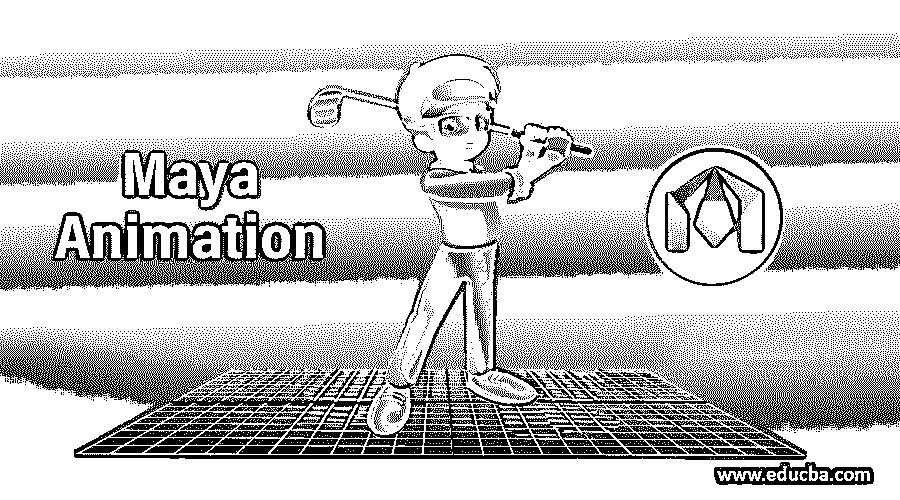

## Maya 动画简介

Autodesk Maya 俗称 Maya，以 3d 计算机图形设计而闻名，并被 3d 建模专业人员广泛用于其图形设计工作。我们可以通过使用这个软件的一些工具和参数来动画制作这个软件中的任何对象。在本文中，我们将通过几个简单的步骤和一个示例来告诉您 Maya 动画，并简要介绍 Maya 动画的一些重要参数，以便您可以毫无问题地处理它。所以让我们在 Maya 软件中开始学习这个主题。

### 如何在 Maya 软件中制作动画？

在这里，我将向您展示一个简单的球撞击一系列长方体的动画示例，以轻松理解 Maya 软件中的这一功能。在这之后，你可以在这个软件中制作一个复杂的动画。开始之前，让我们看一下工作屏幕，以便更好地理解。

<small>3D 动画、建模、仿真、游戏开发&其他</small>

**第一步:** A 顶部，我们有一个菜单栏，用于调整这个软件；这个菜单栏会根据我们的工作方法而改变，在它下面有一个状态行，包含一些快捷命令；在这下面，有一个快速访问工具栏，我们称之为 shell bra(如果您在工作中反复使用它们，您可以根据您的需要在 shell bar 中添加工具)，在左侧我们有操作工具栏，它有选择工具，移动工具等。在中心，我们有我们的透视视口，我们可以在其中看到我们的工作(您可以通过按键盘的空格键按钮同时打开该屏幕中的其他视口)，在右侧，我们有一些选项卡，如通道盒，它显示您当前选择的视口对象的参数，并允许您更改该对象的参数。一旦你开始使用这个软件，你就会理解其他部分；该软件有主要部分。

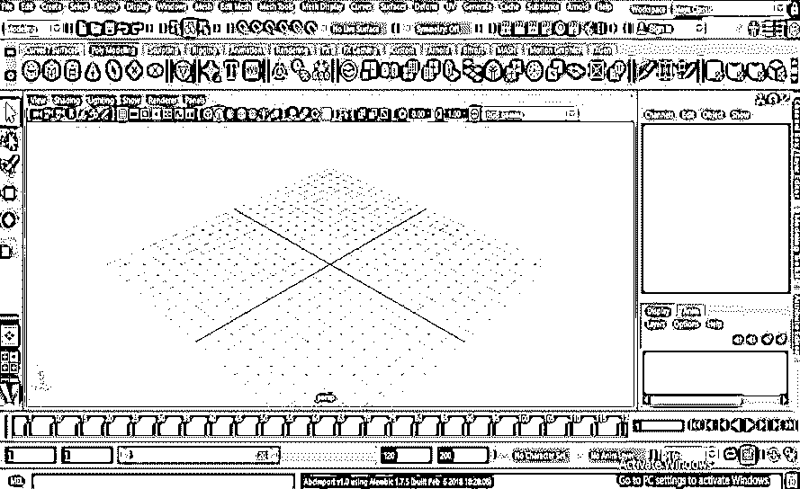

**步骤 2:** 菜单栏选项将根据该列表中工作方法的改变而改变。

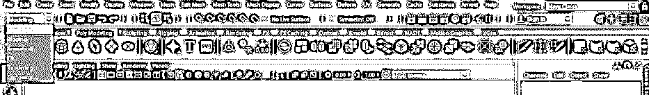

**第三步:**现在，让我们在这个软件中开始我们的动画工作。对于动画，请从视口上方的快速访问工具栏中选择“平面”命令。

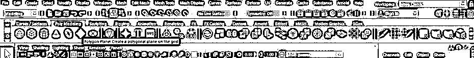

**第四步:**现在，在透视视口中根据你画一个平面。您可以根据自己的需要在任何其他视口中绘制它，方法是在其他视口中按空格键。您可以使用该软件的 Scale 命令来调整平面的大小。对于缩放命令-单击操作工具栏上的缩放图标，或者您可以按下 R 按钮来控制对象上的缩放点命令。

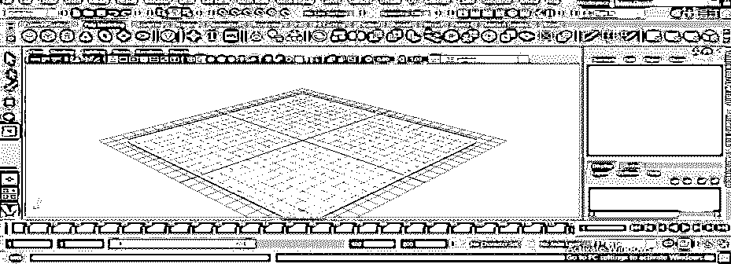

**第五步:**现在，从这个软件的快速访问工具栏中点击一个立方体命令，然后像这样画一个长方体。

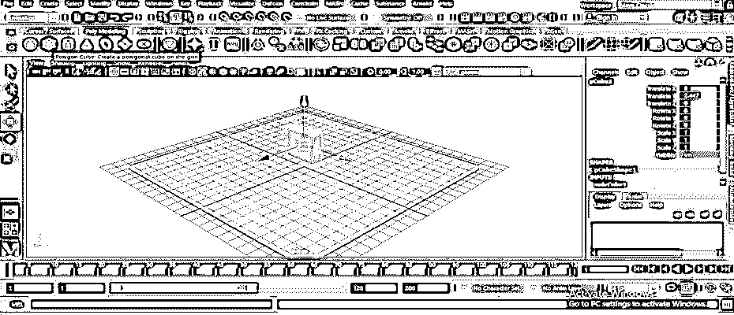

**第六步:**利用本软件的 scale 命令调整这个长方体的边长。

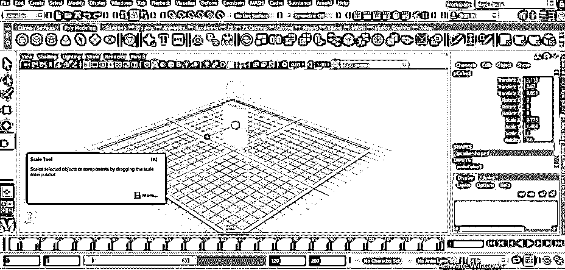

**第七步:**通过 scale 命令调整尺寸——点击任意轴的手柄按钮，向同一个方向拖动。我将按住 Z 轴手柄并在 Z 方向拖动它，以增加它在这个方向的大小。

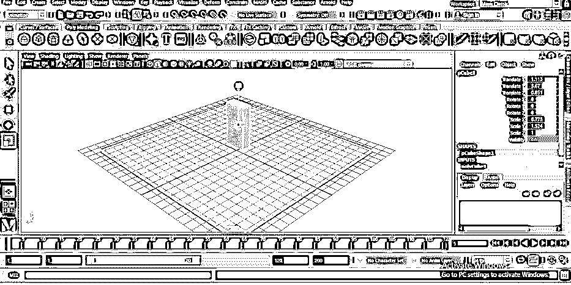

**步骤 8:** 现在，在所有四个视口中按下键盘的空格键，并使用移动工具命令调整平面中心的长方体。对于移动工具，单击操作工具栏上的移动工具图标，或者您可以从键盘上按 W。现在使用此轴的箭头手柄移动对象。

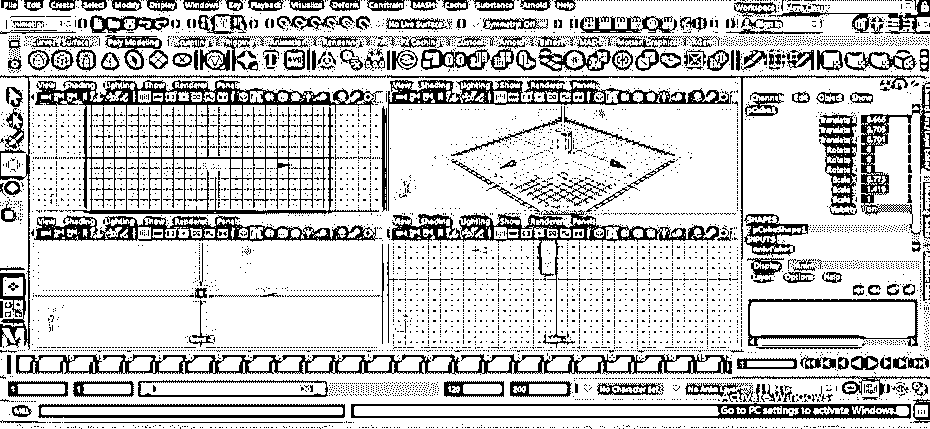

步骤 9: 现在，再次按空格键，全屏显示透视视图。

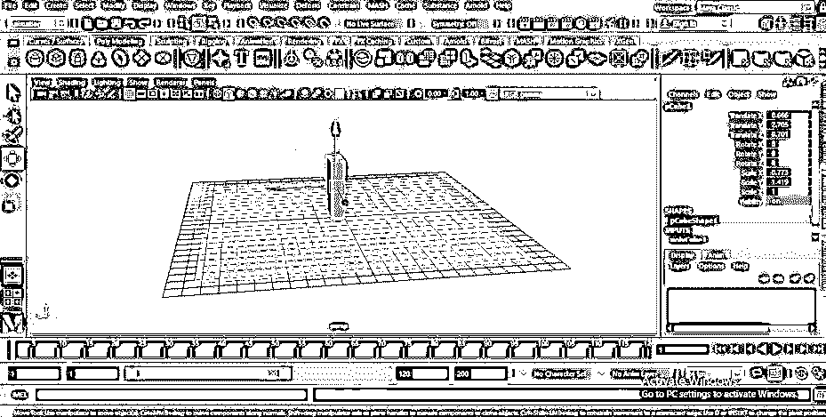

**步骤 10:** 现在按下 Ctrl + D 键，复制这个长方体的一个副本，并向前拖动它。

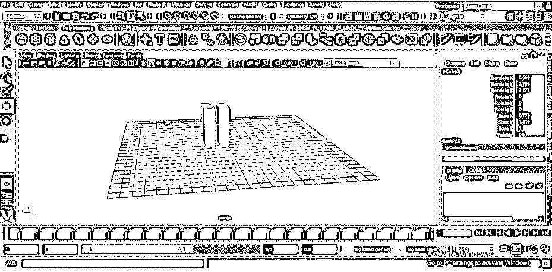

**步骤 11:** 现在选择两个长方体，再次按下键盘上的 Ctrl + D 键，然后拖动两个长方体进行复制，就像这样。

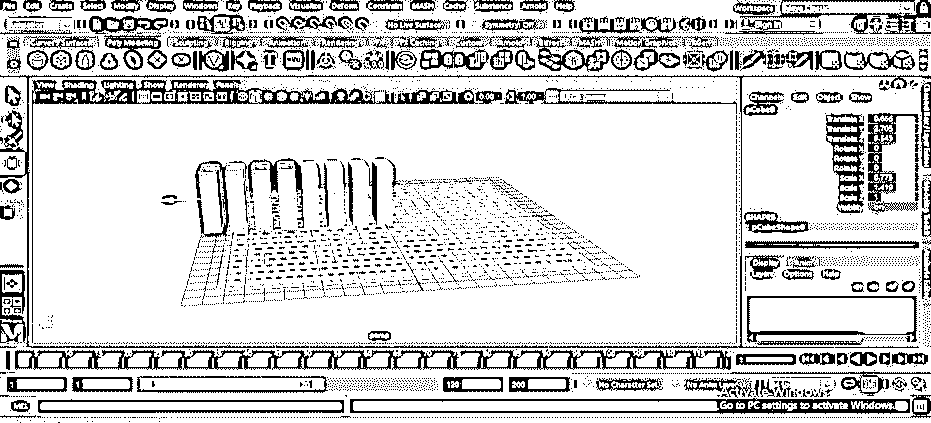

**第十二步:**通过复制这个长方体模型，做出一系列这样的长方体。

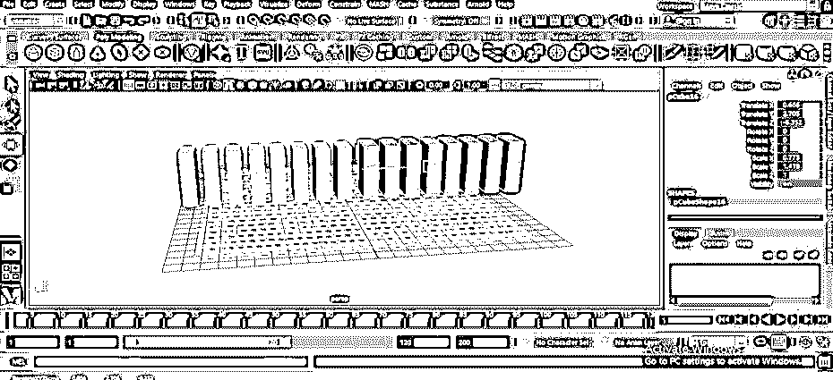

步骤 13: 现在使用这个软件的缩放命令缩放这些长方体。

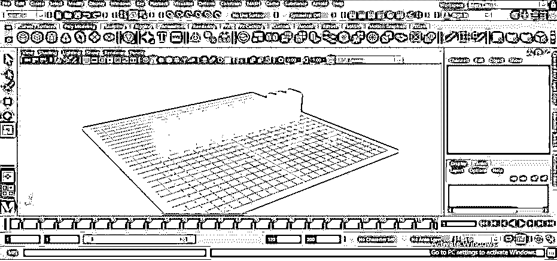

步骤 14: 现在，从快速访问工具栏中点击一个球体工具命令，然后像这样画一个球体。你可以根据你的需要拖动任意大小的球体。

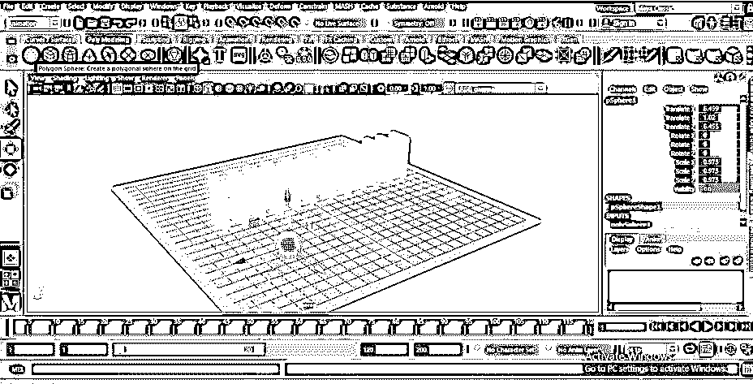

**步骤 15:** 现在按下键盘的空格键进行四个视口，并以这种方式调整这个球体，使其能够击中第一个长方体。

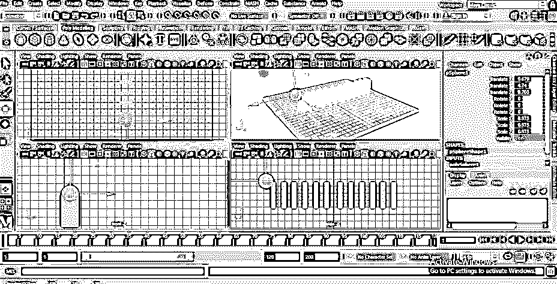

**第十六步:**现在调整到和这个一样的高度。

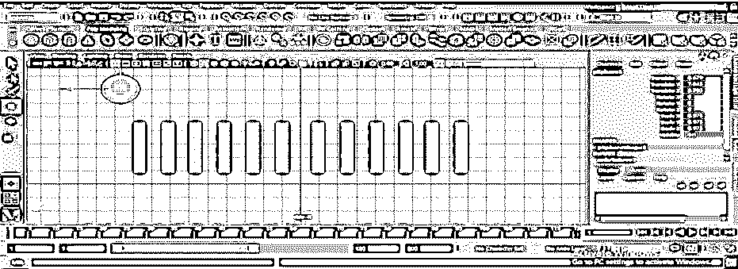

**步骤 17:** 现在点击选择平面，并从列表中选择 FX 方法。

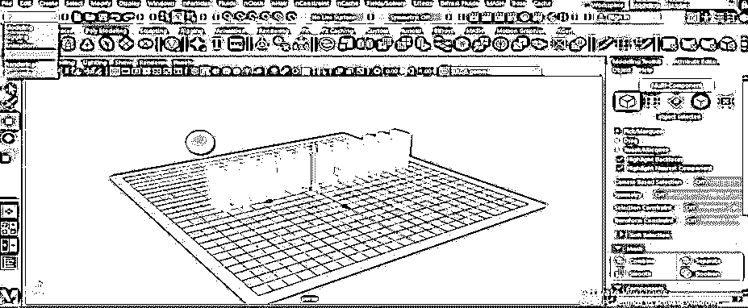

**步骤 18:** 现在进入 FX 方法菜单栏的场/解算器菜单。将打开一个下拉列表；点击列表中的“创建被动刚体”选项。

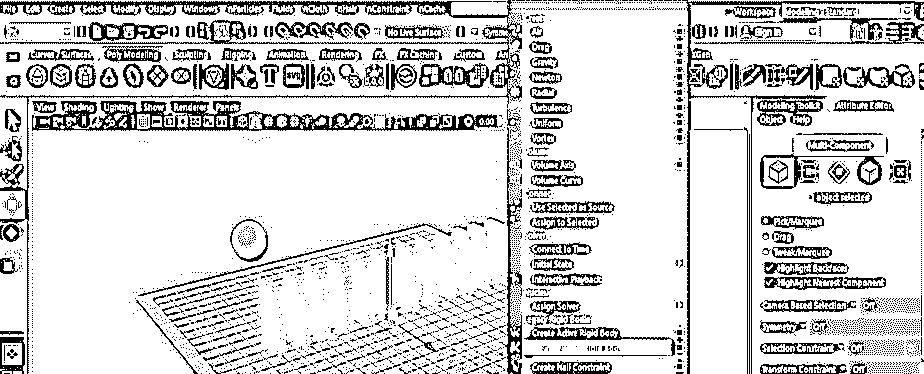

**步骤 19:** 现在，按住键盘的 shift 键选择一系列长方体和球体。

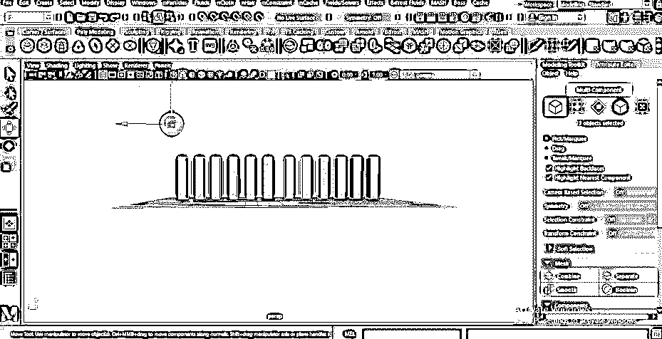

**步骤 20:** 现在进入 FX 方法菜单栏的同一菜单，点击场/解算器菜单下拉列表中的“创建主动刚体”选项。

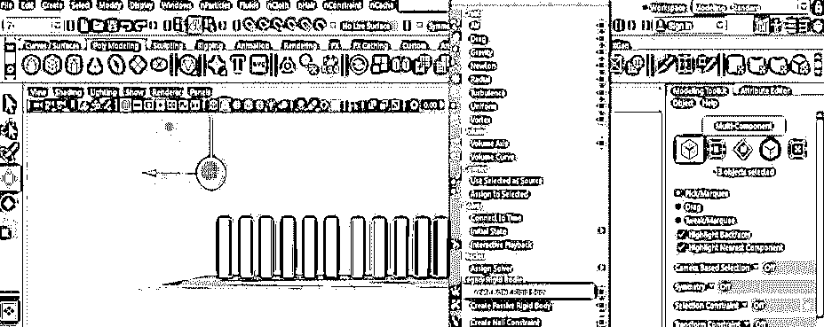

**步骤 21:** 现在，我希望球体放在第一个长方体上，这样我就可以点击菜单栏的场/解算器菜单下拉列表中的重力选项。

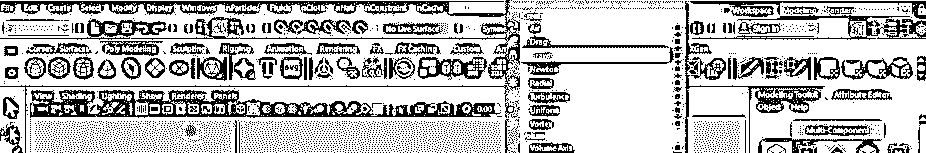

现在，我们需要一个合适的关键帧来播放我们的动画。所以我会把 200 作为关键帧的值。你可以根据你的情况来拿。

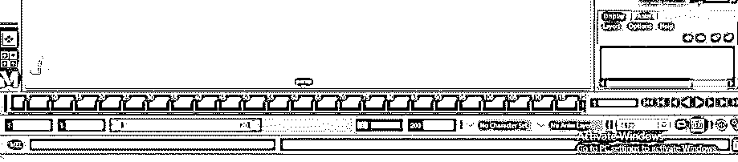

步骤 23: 现在以这种方式调整视窗，这样你就可以正确地看到动画了。我将使用旋转工具像这样调整它。

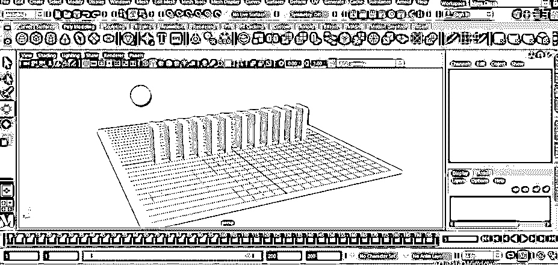

**步骤 24:** 现在按下工作区右下角的播放按钮播放动画。

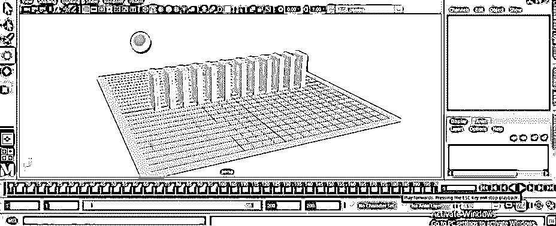

**第 25 步:**一旦你玩了，你的动画就会是这个样子。

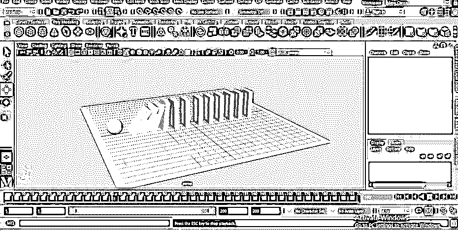

这样就可以在 Maya 软件中制作一个简单的动画。一旦你开始在这个软件上练习，你就可以制作出更好的动画。

### 结论–Maya 动画

现在，在这篇文章之后，你可以理解“什么是 Maya 动画”和“如何处理它的参数”来制作一个好的动画。Maya 的动画还有很多其他特性，你可以通过了解这个软件的动画特性来了解。

### 推荐文章

这是一个玛雅动画指南。在这里，我们讨论如何一步一步地在 Maya 中创建动画。您也可以浏览我们的其他相关文章，了解更多信息——

1.  [安装 Maya](https://www.educba.com/install-maya/)
2.  [玛雅中的标志](https://www.educba.com/logo-in-maya/)
3.  [玛雅替代品](https://www.educba.com/maya-alternatives/)
4.  [Maya 奖励工具](https://www.educba.com/maya-bonus-tools/)

