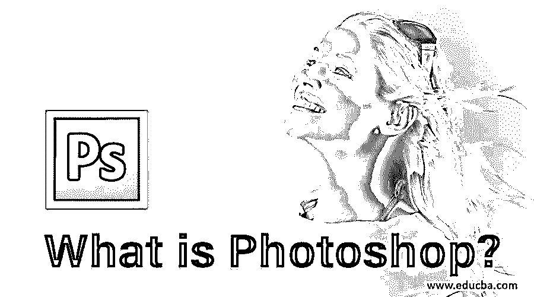

# Photoshop 是什么？

> 原文：<https://www.educba.com/what-is-photoshop/>

## Adobe Photoshop 是什么？

Photoshop 包含与 Adobe 推出的图像编辑软件相关的所有信息，包括关于 Photoshop 的介绍、Photoshop 职业生涯、安装 Photoshop、Photoshop 中使用的插件、Photoshop 中的快捷键、Photoshop 的使用以及许多此类主题，旨在为读者提供关于图像编辑软件的所有知识和技能，并提供易于学习和实践的最新帖子和教程，有助于利用初露头角的设计师和艺术家的职业生涯。

### Photoshop 软件是什么？

这个问题总是浮现在初学图形设计者的脑海中。看完这篇文章，你就不会担心这个问题了。一旦这篇文章结束，你将获得关于 Photoshop 软件的大量知识。所以我们来讨论一下这个问题。

<small>3D 动画、建模、仿真、游戏开发&其他</small>

顾名思义，Photoshop 软件，照片是的，它是一个编辑软件，用于编辑照片，即图像，图像应该是光栅图像。当你搜索 Photoshop 软件时，你会发现它的名称是 Adobe Photoshop 软件。实际上，这个软件最初是在 1988 年由两个人开发的:托马斯和约翰·诺尔，后来被 Adobe systems 接管。目前，它由 Adobe systems 维护，是 Adobe Systems 的 Adobe Creative Cloud 桌面应用程序的一部分。你也见过 Photoshop CS 软件、Photoshop CS6 软件、Photoshop CC 软件等名称。这些不过是 Photoshop 软件的更新版本，增加了一些新功能。

目前，Adobe Photoshop 被认为是最好的光栅图像编辑软件之一，并且是非常用户友好的软件。该软件兼容 Windows 10 及以后的版本，也兼容 MacOS 及以后的版本。你可以在许多不同的语言中找到它，如英语、汉语、日语、荷兰语、波兰语等等。在你的个人电脑上安装这个软件非常容易。要下载 Adobe Photoshop 软件，只需登录 Adobe Systems 的官方网站，在该网站的搜索框中搜索 Adobe Photoshop 软件，即[www.adobe.com](https://www.adobe.com/)。Adobe Systems 为您提供有限时间的免费试用工具，以便您更好地理解特定软件。你可以从这个网站下载免费版本的 Photoshop 软件，一旦你发现这个软件与你的工作相关，那么你就可以从同一个网站购买完整版本的 Photoshop 软件，只需象征性地收取一些费用。从网站下载该软件后，按照一些简单的步骤将其安装到您的个人计算机上，并享受该软件的功能。

### Adobe Photoshop 软件的功能

功能是任何软件最重要的术语。在本文中，我们还将以一种非常有趣的方式了解 Adobe Photoshop 软件的功能。因此，让我们转向 Photoshop 软件的功能。

*   这个软件的用户界面非常友好。在它的界面中，我们在工作区的左角有一个工具面板，这有助于在工作区的右角的相反方向上非常快速地拾取任何工具；我们有颜色面板和图层部分，用于快速检查我们的工作。在工作区的顶部，我们有菜单栏，用于一些设置，在菜单栏下面是属性栏，显示活动工具栏的属性。在底部，我们有时间线面板，将该软件带入下一个编辑级别，也就是说，该时间线面板允许该软件制作光栅图像的动画。这些功能的界面使这个软件非常引人注目，以及用户友好。
*   在工具面板部分，我们有许多令人兴奋的工具，如移动工具，它允许轻松移动图像选择工具，它提供了广泛的自由来选择图像的任何特定部分，以便根据我们的目的操作该部分。最重要的工具是钢笔工具，它在选择工作中起着重要作用。像这些工具一样，我们在该软件中有许多其他工具，这使它不同于其他编辑软件。
*   这个软件的独特之处是一个时间线面板。这个软件允许你编辑你的光栅图像，并在时间轴面板的帮助下动画显示它们的属性。您可以根据自己的需要制作图像位置、图像形状、图像羽化、图像旋转和许多其他图像属性的动画，使您的工作更加有效。

这个软件有许多其他功能；一旦你开始使用这个软件，你很快就会熟悉所有的功能。

### 我们为什么要用 Photoshop？

在了解了 Photoshop 软件的功能之后，在这个软件的上下文中就没有这种类型的问题了，因为它的独特功能使它不同于其他编辑软件，并且你已经准备好使用这个软件作为你的编辑软件。

它还有一个原因，使人们可以使用它作为其编辑软件，原因是它有非常简单和容易的处理工具和术语，使人们可以在最短的时间内学习它，达到完美。在这之后，成为这个软件的专家对任何人来说都不是一个大任务。

### 结论

现在，在本文末尾，您已经对 Adobe Photoshop 软件的各个方面有了很好的了解，您也可以将它用于您的专业工作。在本文中熟悉这个软件后，你可以获得越来越多的操纵你的作品的想法，以应对具有巨大影响的现实世界。

### 推荐文章

这是一个什么是 Photoshop 的指南？在这里，我们讨论 Adobe Photoshop 软件的介绍及其功能和用法。您也可以阅读以下文章，了解更多信息——

1.  [如何安装 Adobe Creative Cloud？](https://www.educba.com/install-adobe-creative-cloud/)
2.  [Adobe Prelude(用途和优点)](https://www.educba.com/what-is-adobe-prelude/)
3.  [在 Photoshop 中创建剪贴蒙版的步骤](https://www.educba.com/clipping-mask-in-photoshop/)
4.  [Photoshop 中的智能对象](https://www.educba.com/smart-objects-in-photoshop/)

