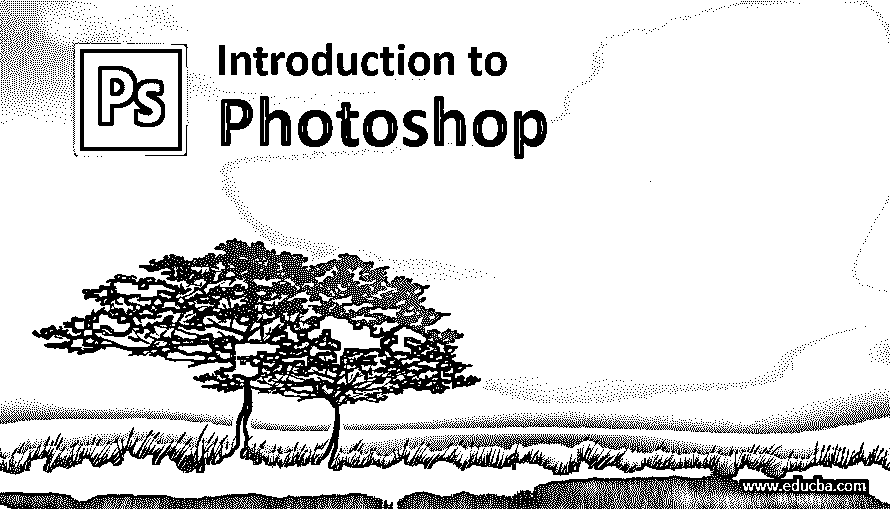
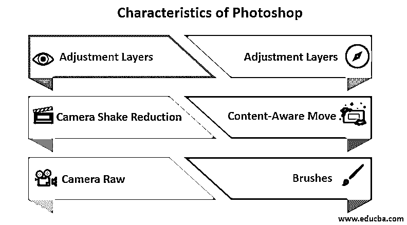

# Photoshop 简介

> 原文：<https://www.educba.com/introduction-to-photoshop/>

## Photoshop 简介

在这个主题中，我们将学习 Photoshop 的入门知识。Photoshop 是 Adobe 为 Mac OS 和 Windows 创建和发布的广泛使用的图形编辑程序。Photoshop 基本上是一个基于光栅的图像编辑器，可以在多个图层中编辑和合成光栅图像，并支持遮罩、Alpha 合成、图像环绕工具、流体相机旋转和文件显示工具等功能，以及更多高级工具和功能。

Photoshop 最基本的版本出现在 1988 年。托马斯和约翰·诺尔发展了它。从那时起，这个强大的应用程序已经升级，并更新了更先进和强大的工具和命令。最新的是 Photoshop CC 版本，它是 Adobe Creative Cloud 品牌的一部分。此外，Photoshop 还与其他软件合作，如 Adobe Bridge、Adobe Fireworks、Adobe Camera Raw 等等。

<small>3D 动画、建模、仿真、游戏开发&其他</small>

Photoshop 和其他一些与之相关的软件统称为 Photoshop 家族。该系列由 Photoshop Elements、Photoshop Lightroom、Photoshop Express、Photoshop Fix 和其他软件组成。

### Photoshop 的主要组件

在上面的章节中，我们已经了解了 Photoshop 的入门知识；有一些人需要的主要组成部分。以下是这些组件:

*   **菜单栏:**这是任何软件的第一个也是最常用的组件。该选项由用于在软件中编辑和合成图像的各种命令组成。文件、编辑、图像、图层、选择、过滤、查看、窗口&帮助是基本命令。

*   **选项栏:**这是一个显示工具面板中特定工具的几个选项的栏。当用户在工具面板中选择某个工具时，选项栏会显示该特定工具的各种首选项。

*   **工具面板:**该面板位于界面左侧。它是用于创建和编辑图像、页面元素和艺术品的图标集合。

*   **文档窗口:**显示用户正在工作的文件的当前状态。这些[窗口可以根据设计者的要求进行分组](https://www.educba.com/adobe-illustrator-for-windows/)和停靠。

*   **图层面板:**这个面板是所有编辑使用最多的面板。此面板帮助用户将画板上的不同项目堆叠在不同的层上，以保持它们的组织性，并使编辑更加容易和快速。

### Photoshop 的特点

在浏览了 Photoshop 的介绍和 Photoshop 的组件之后，我们需要了解一些特性，如下-

#### 1.智能对象

智能对象是 Photoshop 中最强大的[功能之一。这些智能物体本质上是非破坏性的。用户可以编辑它们，创建对象的多个相互链接的副本。这些智能对象是独立于像素的，它允许用户缩放它而不会变得模糊。此外，任何正常层可以转换为智能对象层，只需右键单击任何层。使用这种技术，用户可以在需要时应用各种过滤器并进行编辑。](https://www.educba.com/top-10-features-in-adobe-photoshop/)

#### 2.调整图层

这些图层是 Photoshop 的另一种非破坏性编辑模式。对于这些图层，编辑不会应用于实际图层，但会在像素图层的正上方创建一个新的调整图层。这个特性有利于设计者，因为设计者可以改变混合模式或应用滤镜，改变不透明度，甚至在他觉得合适的时候去掉这一层。

#### 3.减少相机抖动

这个功能对摄影师和编辑来说都非常有用。当用户处理一些抖动的镜头或模糊的图像时，它可以很好地工作。它分析图形并恢复图像的清晰度。

#### 4.内容感知移动

该软件的这一功能为编辑们创造了奇迹。它让用户选择一个单层图像中的对象，并在同一张图片中根据自己的意愿将它移动到其他地方。此外，Photoshop 通过填充移动对象产生的间隙来完成其令人惊讶的工作。

#### 5.相机原始数据

这是最常用的插件，有助于在不使用 Lightroom 和其他文件格式的情况下处理原始图像。这个插件允许用户添加颗粒，执行裁剪后的渐晕和去除图像中的噪声。

#### 6.刷子

该计划中的升级画笔为用户提供了更清晰、更锐利的线条和流畅的笔触。当用户使用铅笔、橡皮擦、混合笔刷或笔刷工具时，他们可以控制笔刷的平滑度。他们有机会输入从 0 到 100 的值来平滑笔刷。

### Photoshop 的应用

Adobe Photoshop 不仅仅是软件，还是一个完整的行业，或者说是编辑、排版、绘图、绘制图像和艺术作品的发电站。如今，Photoshop 不仅被专业人士或有经验的编辑使用，甚至成为一个外行人的日常要求。目前，Photoshop 甚至在教育机构和大学里教授。产品设计、网站设计、各种数字内容、品牌和营销材料设计、名片设计是 Photoshop 在我们日常生活中的常见应用:

*   Adobe Photoshop 用于电子商务网站和在线购物门户。这些门户使用该应用程序来编辑他们的产品和品牌形象。我们还可以设计地图，环境视图，图像展示，卫星视图。这些都是游戏 app 里常用的。
*   传单，书籍封面设计，名片和其他营销和宣传材料也可以在 Photoshop 中设计。
*   网站布局，网站标志，以及网站上使用的其他网页也可以用这个程序来设计。
*   用户界面和 UX 也可以使用 Photoshop 来设计。内部和外部的照片和建筑可视化也可以使用 Photoshop 来实现。
*   产品包装设计和 3D 模型可以在 Photoshop 中创建。

### Photoshop 的优点和缺点

我们已经学习了 Photoshop 的介绍、组件、特点和应用，每样东西都有它自己的优点和缺点。

以下是一些利弊。

1.  Adobe Photoshop 提供了各种各样的工具，能够编辑或设计任何东西。该软件升级如此之多，它不仅仅是用于图像。该程序还可以用来处理视频内容，并以很高的效率进行编辑。它是支持一套强大的视频编辑工具的最佳平台。
2.  Photoshop 允许编辑所有流行和可用的图像文件格式，而不需要任何额外的插件。
3.  可以对图像进行许多小的更改，例如改变肤色、微调亮度、消除红眼、修饰以及其他可以在 Photoshop 中轻松完成的修改。
4.  对于大一新生来说，Photoshop 的学习曲线更加陡峭。
5.  小用户和初学者可能会觉得 Photoshop 有点贵。

### 推荐文章

这是 Photoshop 入门指南；在这里，我们学习了 Photoshop 的组件、特点、优点和缺点。您也可以阅读以下文章，了解更多信息——

1.  [Photoshop 命令](https://www.educba.com/photoshop-commands/)
2.  [如何在 Photoshop 中绘画？](https://www.educba.com/how-to-paint-in-photoshop/)
3.  [安装 Adobe Photoshop](https://www.educba.com/install-adobe-photoshop/)
4.  [扭曲图像 Photoshop](https://www.educba.com/warp-image-photoshop/)

