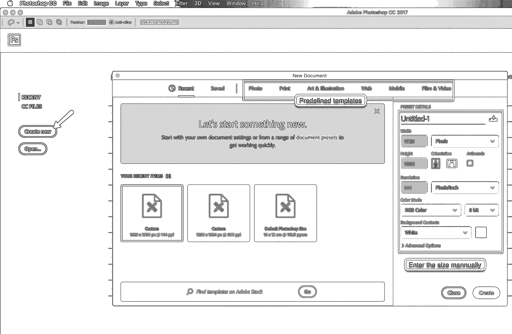
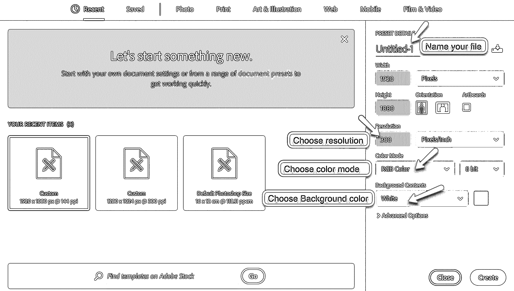
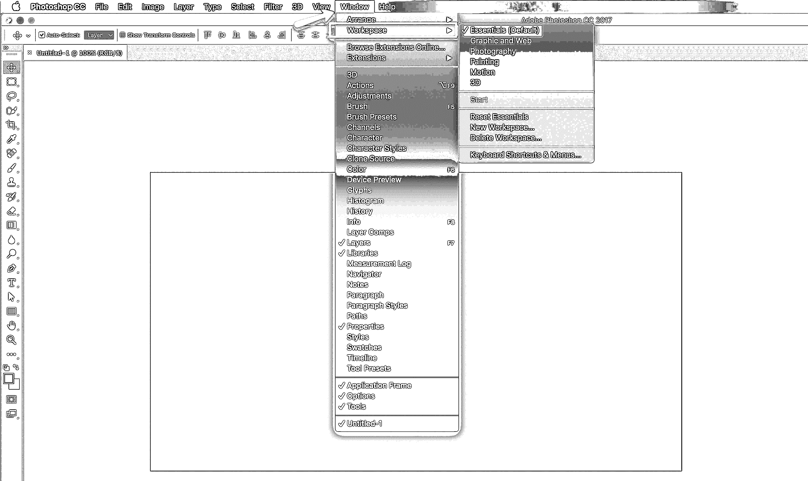
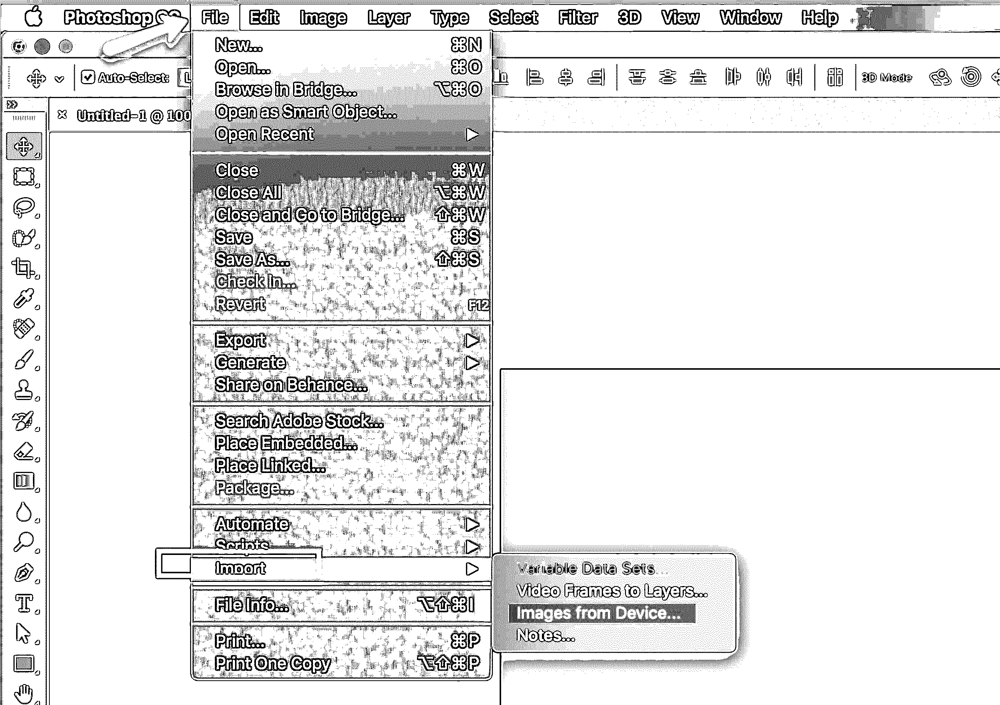
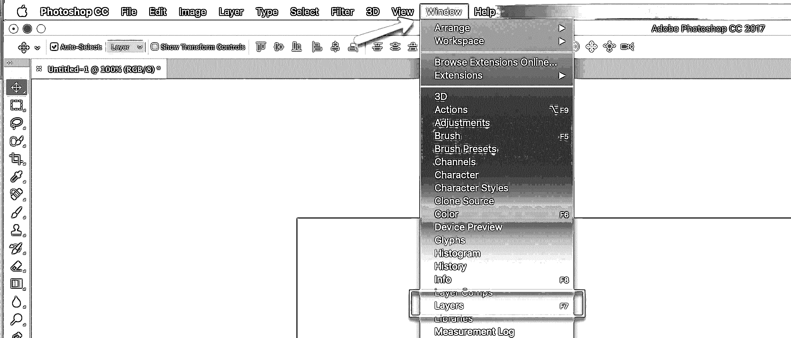
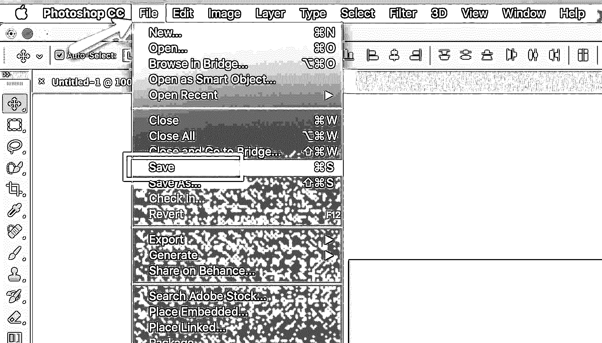
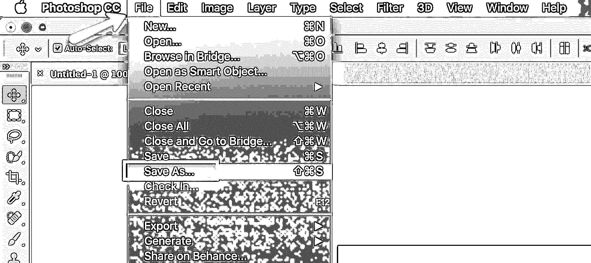
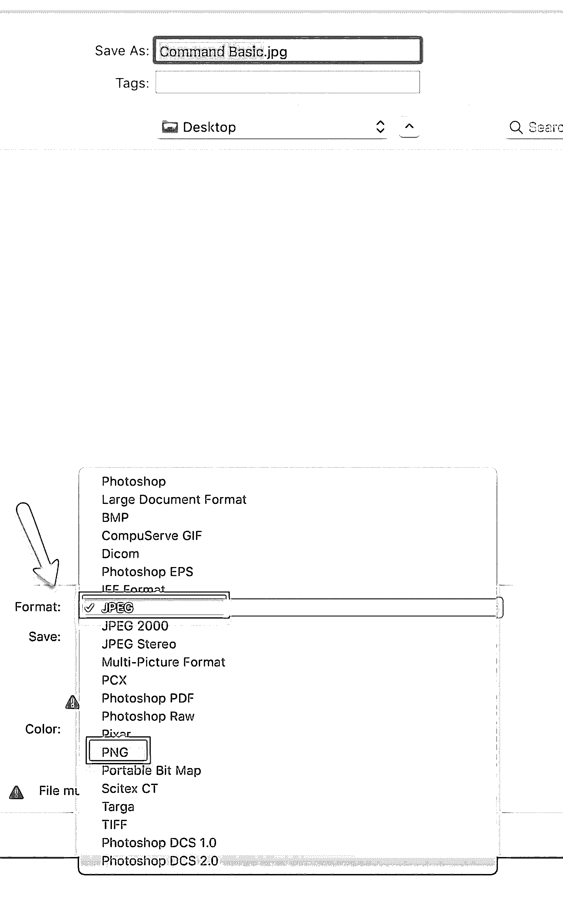
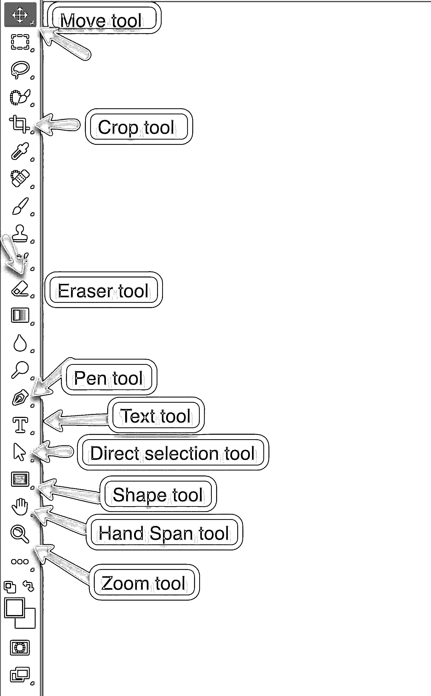

# Adobe Photoshop 命令

> 原文：<https://www.educba.com/photoshop-commands/>

## Adobe Photoshop 命令

如果你想编辑图片或者给你的照片添加新的风格，Photoshop 是你最好的选择。该软件由 Adobe 于 1988 年开发，从那以后，它被认为是编辑光栅图形、重新成像等的最佳工具。理解 Adobe Photoshop 命令并不是什么大的火箭科学。在 Photoshop 上工作时，你真正需要了解的是你的创造力水平。Adobe Photoshop 用于许多方面，甚至用于制作 gif 动画。但最重要和最有效的用途是编辑光栅图形和图像。如果你一直从事软件工作，你可能会意识到这样一个事实:做同样的事情有很多不同的方法。下面是一些最有用的命令，可以让你更容易理解和使用软件。

### 基本 Adobe Photoshop 命令

让我们了解一下基本命令:

<small>3D 动画、建模、仿真、游戏开发&其他</small>

*   **新文件:**不同版本的界面可能有所不同，但基本命令都是相同的。所以当你启动 Photoshop 时，会弹出一个窗口给你不同的选项。您可以从“新建”或“打开”选项中进行选择。“打开”将打开一个已经保存 Photoshop 文件。“新建”将帮助您从新文档开始。您也可以在 windows 中使用 ctrl + n，在 Mac 中使用 command + n 来打开新文件。
*   **选择维度:**当你点击新建时会弹出窗口要求你选择文件的维度。你可以从 Photoshop 提供的模板中选择。或者，如果您需要特定尺寸的产品，也可以手动输入尺寸。

*   **定义其他尺寸:**设置好新文档的高度和宽度后，需要决定分辨率、颜色模式、背景选项。您也可以在预设细节中命名您的文件。您也可以选择在不同的度量尺度上查看尺寸，如像素、英寸、厘米、点等。Photoshop 文件通常以像素为单位保存，但是，这可能取决于您想要什么。分辨率也取决于你正在做的工作的类型，一般来说，最好的分辨率是 300 dpi。颜色模式在 RGB 和 CMYK 之间选择。如果文档要在 web 上使用，您应该选择 RGB。如果要打印，您应该选择 CMYK。背景可以根据你的喜好。

*   **界面:**您可以根据自己设置界面。您可以选择想要查看的工具和栏。通常，该接口保持为基本接口(默认)。您可以通过 Windows–workspace 选项随时更改界面。

*   **文档窗口:**你的文件打开的界面中间的大块区域称为文档窗口。只需按下键盘上的“F”键，就可以在全屏视图和普通视图之间切换。
*   **放置图像:**您可以直接拖放图像，也可以从设备进入文件-导入-图像来导入图像。

*   **图层:**在 Photoshop 中工作时，图层是最需要的工具之一。您可以从窗口-层中打开它。或者直接 f7 打开。

*   **保存:**您可以转到“文件”—“保存”,为您的文件命名(如果尚未命名),然后点击“保存”。这将保存您的文件在默认的 Photoshop 格式是 PSD。或者您可以简单地按 ctrl+s(windows)和 command+s(Mac)来保存文件

*   **另存为—**您还可以选择另存为。在这种情况下，您可以从各种想要保存文件的格式中进行选择。像保存选项一样，您可以从文件菜单中选择另存为，或者您可以按 ctrl + shift + s(对于 windows)和 command + shift + s(对于 Mac)。

*   **格式:**您可以使用不同的默认格式保存文件。通常，最常用的格式是 JPEG 和 PNG。但是，在保存文件时，您可以根据需要从下拉列表中选择格式。

### 即时 Adobe Photoshop 命令

现在我们知道了如何从 Photoshop 命令开始，让我们进一步了解使用该软件的其他命令。

*   **移动工具:**基本工具之一是[移动工具](https://www.educba.com/move-tool-in-photoshop/)。您可以从工具栏中选择它，或者只需按 V 键。
*   **橡皮擦工具:**要擦除任何内容，您可以从工具栏中选择橡皮擦工具或按
*   **钢笔工具:钢笔**工具是 Photoshop 中使用最多的工具之一。你可以从工具栏得到它，或者你可以使用 photoshop 命令，即按 p。
*   **直接选择工具:**主要用于选择特定的节点或区域。从工具栏中选择它或按 A 键选择它。
*   **撤销:**如果你必须撤销某件事或者回到上一步，windows 可以按 Ctrl + z，Mac 可以按 command + z。但是这个 photoshop 命令只会让你后退一步。要后退多步，Windows 需要按 ctrl + alt + z，Mac 需要按 command + option **+** z。
*   **裁剪:**要裁剪图像，您可以通过从工具栏中选择裁剪工具或按直接进行
*   **文本:**要书写任何内容，您可以从印刷机的工具栏中选择文本工具
*   **形状:**要绘制不同的形状，如矩形、正方形、椭圆形、多边形等，您可以从工具栏中选择它们中的任何一个，或者按 U 键在不同的形状之间切换，直到您得到想要的形状。
*   **手形跨度:**如果您希望在工作区上跨度您的图像，您可以通过从工具栏中选择手形工具来实现。或者按住空格键并移动光标。
*   **缩放:**要放大或缩小，您可以从工具栏中选择放大工具，或按 ctrl 和+放大窗口，按 Ctrl 和–缩小窗口。对于 Mac，您可以按下 command 和+来放大，按下 command 和–来缩小。

### 高级 Adobe Photoshop 命令

一些高级命令包括:

*   **切换颜色:**您可以通过按 X 在前景和背景颜色之间切换
*   **新层:**通过按 Cntrl + Alt + Shift + N，你可以在窗口中当前层的上方插入一个新的空层。对于 Mac 用户，命令是 command + option + shift + N
*   **复制图层:【windows 下按 Ctrl + J，Mac 下按 command + J，可以复制选中的图层。如果在活动层上进行任何选择，所选区域将被复制到新层。**
*   **合并图层:**您可以通过选择两个或更多图层并按 Ctrl+e(windows)和 command+e(Mac)来合并它们。
*   **图层分组:**windows 中的 Cntrl **+** g 和 Mac 中的 command + g 会将选中的图层分组。
*   **自由变换:【windows 的 Cntrl + T，Mac 的 command + T，这个 photoshop 命令在你想使用自由变换工具的时候非常得心应手。**
*   **全选:** Cntrl + a 和 command +a，分别在 windows 和 Mac 中选择选中图层的所有可见对象。
*   **选择同色:**可以用吸管工具拾取同色。从工具栏中选择它或简单地按“I”。
*   **取消选择:**要取消选择任何区域，您可以在 windows 中按 Ctrl + d，在 mac 中按 command + d。
*   **反转选择:**如果您想要反转选择，您可以通过按 Ctrl+I(windows)和 command+I(Mac)来完成。

### 推荐文章

这是 Adobe Photoshop 命令的指南。这里我们讨论了基本的和高级的 Adobe Photoshop 命令，以及一些简单易用的 Photoshop 命令。您也可以阅读以下文章，了解更多信息——

1.  [Adobe Photoshop](https://www.educba.com/adobe-photoshop/)
2.  [Adobe Photoshop 的 10 个特性](https://www.educba.com/top-10-features-in-adobe-photoshop/)
3.  [10 款 Photoshop 最佳 UI 套件](https://www.educba.com/10-free-ui-kits-to-download/)
4.  [Photoshop 中的海绵工具](https://www.educba.com/sponge-tool-in-photoshop/)

