# 如何在 Photoshop 中创建一个干净的网站布局

> 原文：<https://www.educba.com/website-layout/>

**在 Photoshop 中创建一个干净的网站布局——**[设计一个网站布局](https://www.educba.com/website-design-layout/)不仅仅是排列彩色图像和在文本框中填充一些文本。这是一种能充分说明你客户业务的方法。网站的颜色和图形定义了企业的性质，而网站的设计质量和简单的导航流程应该将用户与组织联系起来，并把他变成潜在的客户。

设计一个好看且易于访问的网站布局对于每个想成为网站设计师的人来说都是必须的。本教程旨在带你从头开始创建一个布局简单干净的网站。在这个过程中，你会学到一些要点，这些要点将帮助你进一步获得更多关于[网页设计](https://www.educba.com/course/website-layout-design-using-photoshop/)的知识。

## 在设计网站布局之前，写下你的要求。

在你开始设计网站布局之前，你应该知道你的网站将会是什么样子，你应该在网站中包含哪些主题。列出你的客户需要的网站布局元素是至关重要的。除此之外，一个好的设计师的品质是在开始制作最终模板之前准备一个整个网站的模型。

<small>3D 动画、建模、仿真、游戏开发&其他</small>

不同的设计公司采用不同层次的预设计策略，可能包括线框、原型、模型、测试版等等。在本教程中，我们将在开始最初的模板设计之前创建一个模型版本。我使用灰色阴影，这允许识别模型块。

### 帆布

几年前，当只有很少的操作系统和有限的设备来访问网站时，页面的尺寸被固定为一到两个大小。今天的情况完全不同。终端用户通过各种尺寸的台式机、手机、iPads 和平板电脑访问网站。在这种多样化的情况下，你不可能把你的网页固定在一个特定的大小。但是每个设备都有一些行业标准尺寸。你会慢慢找到你最喜欢的尺寸，或者你的客户会推荐你去一个网站模仿这些尺寸。

在这种情况下，我们在以下维度上工作。不要担心高度，因为它会随着时间而变化。你添加到网站上的内容越多，网站的高度就越高。

请记住，垂直向下滚动页面是很常见的，所以您可以不固定网页的特定高度，除非您不想让用户像 Google 一样在您的主页上滚动。但是，有必要不要水平滚动。因此，按照行业标准限制你的宽度，不要在水平滚动上有所创新。

对于 web，分辨率限制为 72。最近在 iPads 和平板电脑上发现了更高分辨率的图像和页面。但这种情况很少见，考虑到全球的网速，最好还是保持 72。

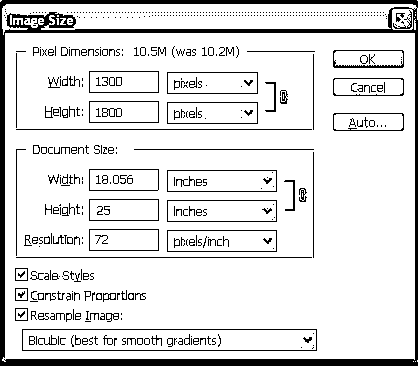

使用 Ctrl+A 命令选择文件，并在整个模板中均匀绘制参考线。一个网站应该组织得井井有条，每一个元素都相互连贯。网站布局指南可以帮助你轻松获得它。

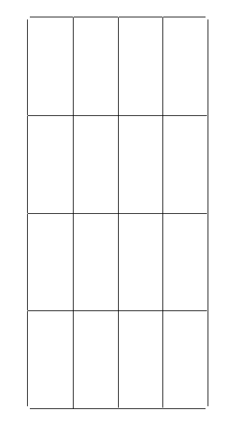

### 准备好你的模型。

将模型文件放在原始模板上有助于节省大量时间。设计你的网站变得如此简单，你将在几分钟内完成框架。然而，模型只会帮助你设计框架。完成细节、字体排列和对齐的设计元素将比绘制网站布局花费更多的时间。

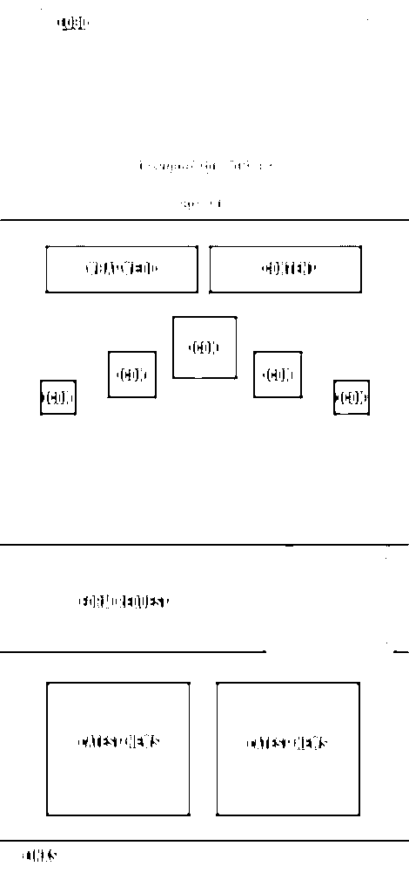

### 配色方案和其他选择

准备好框架后的下一件事是选择配色方案。但是，最好在开始设计之前准备好颜色。

整个事情可以归结为这样一个信息，在开始设计之前准备好你的枪。一切，包括图标、图像和颜色选择，都应该在你开始工作之前准备好。组织和计划你的工作将节省更多的时间，并专注于设计，没有障碍。

如果公司是新成立的，以前没有公司标识，选择颜色可以是设计师的选择。在某些情况下，客户会给出他们想要的标志或背景色调的想法。在现有的公司中，你可能需要重新设计整个网站，你可能需要根据客户的需求选择相同的颜色。

有许多网站可以帮助你从档案中选择数百万种配色方案。尝试以下网站，享受丰富的颜色组合选择。

[**Color.adobe.com**](https://color.adobe.com/)

[**Colourlovers.com**](https://www.colourlovers.com/)

 **

在这里，我选择了一些蓝色的阴影用于网站。整个网站将在以下配色方案内规划。不要忘记选择三到四种不同的颜色组合，因为我们不知道客户会喜欢哪种颜色。一旦客户最终确定了配色方案，保存色调值，并确保颜色在组织的每个垂直领域都发挥着至关重要的作用，尤其是在企业形象中。

### 设计过程

有很多方法可以延续你的设计师。没有硬性的网站布局规则来定义或遵循设计的过程；这主要是设计者为了自己的方便而选择的一个过程。

一些设计师想要建造整个模块和框架，并在第二阶段开始处理细节，然后是打字，最后是对齐和调整。有些人喜欢一次完成页面的一部分，然后进入下一部分。我们遵循第二种风格。

我们将在以下步骤中完成网站

*   页眉和页脚
*   我们做什么
*   服务
*   形式
*   新闻
*   页脚

### 页眉和页脚

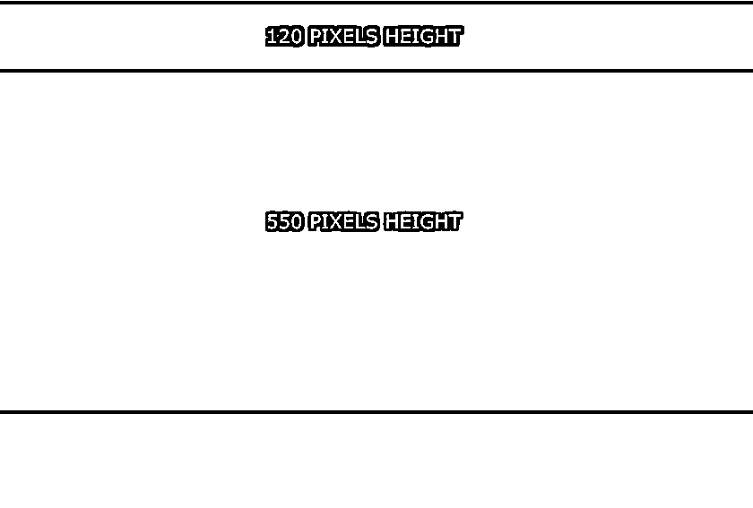

The rule of thumb to define the dimensions of your header or banner is left to your creativity. According to the latest trends, websites appear with a huge image that covers your entire computer screen. The style is referred to as Hero image, which became quite popular recently.

在这个例子中，我们从 120 像素高的标题和 550 像素高的横幅开始。宽度应与文件尺寸相匹配。

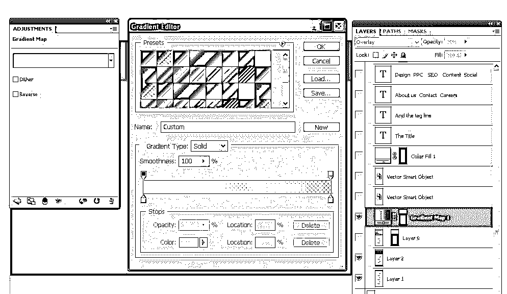

纯色设计看起来很单调，不适合较大的框架或图像。为了避免单调的外观，我在横幅上应用了渐变叠加层。它赋予横幅一种深度，从一种阴影慢慢转变为另一种阴影。

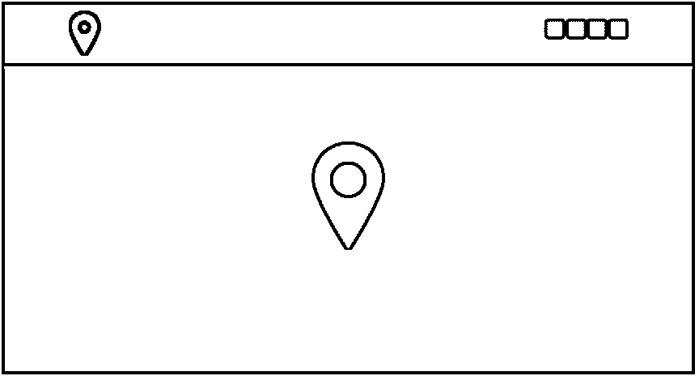

接下来，我们开始[导入 Logo](https://www.educba.com/course/logo-design-course/) 并把它放在页眉的左上角，另一个更大的 Logo 放在横幅的中央。您还可以观察右上角的网站布局矢量形状，用于共享[社交媒体链接](https://www.educba.com/course/social-media-channels/)。

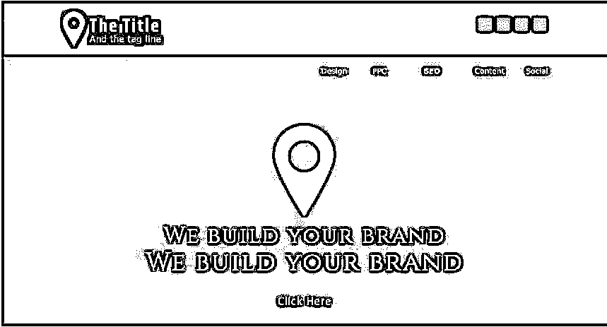

在这个阶段，我完成了在标题和横幅部分添加类型。文本中添加了公司名称、[品牌信息](https://www.educba.com/course/brand-management-module-4-e-branding/)，以及链接和服务。您还可以观察横幅上的透明按钮。

纯文本或太多没有特殊功能的字体会破坏你的网页的外观和感觉；页面很快就会让用户厌烦，这可能会让他很快离开你的网站。看看我添加到横幅右上角的服务链接的矢量形状。风格简单，但它填补了空白，避免了平凡的外观。

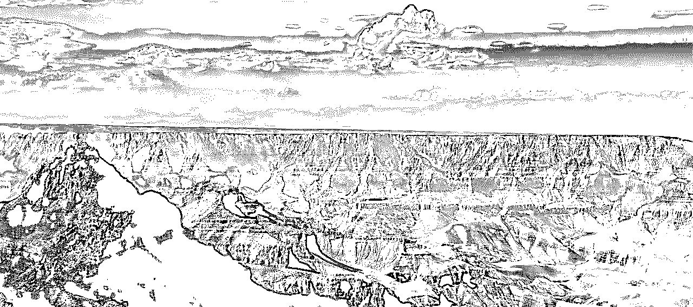

选择适合业务的图像。网上有数百万张图片，找到一张符合你要求的图片不会花太多时间。

就我而言，我找到了一个高质量的图像，我认为它会与我的网站很好地搭配。我没有一个网站的商业主题，所以我可以自由选择任何在横幅帖子上看起来不错的图像。

尝试从下面给出的免费图片网站下载一些高清图片

**www.pixabay.com。**

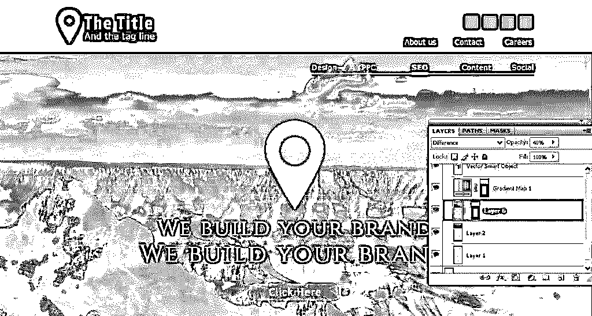

混合是一门艺术，你应该掌握它来制作漂亮的横幅。在这里，我混合了三层，以达到上图所示的效果。以下是我所做的

*   将图像层放在蓝色横幅的顶部
*   将渐变叠加放在图像上方
*   改变图像的不透明度 40 %,改变混合模式为差异。
*   查看上图中的图层面板，了解图层是如何相互堆叠的。

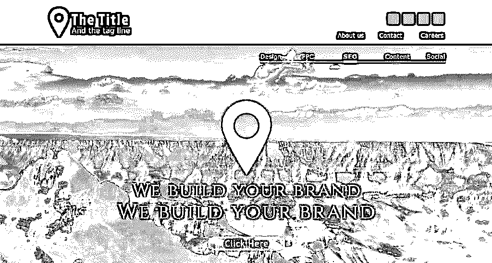

这是我们刚刚完成的标题和横幅的外观。我们正在同时进行一个部分，是时候进入下一个阶段了。

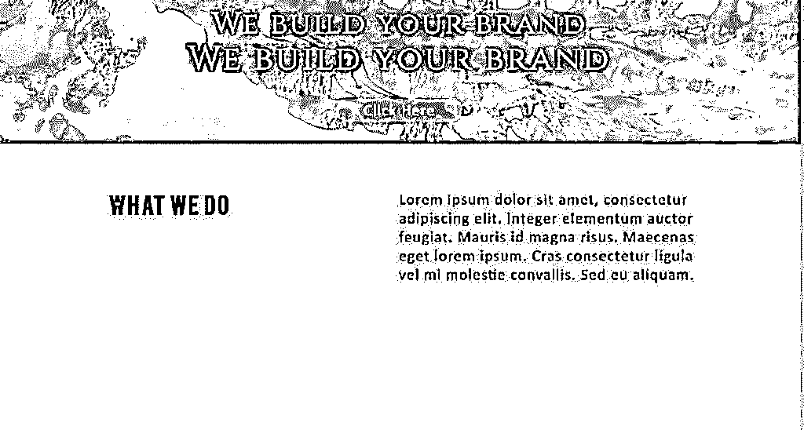

当涉及到类型时，对齐是至关重要的；对你的网站应该是什么样子有一个想法，在你开始之前文本应该对齐。在这个级别，我使用了两个不同的文本框架，都是靠左对齐的。

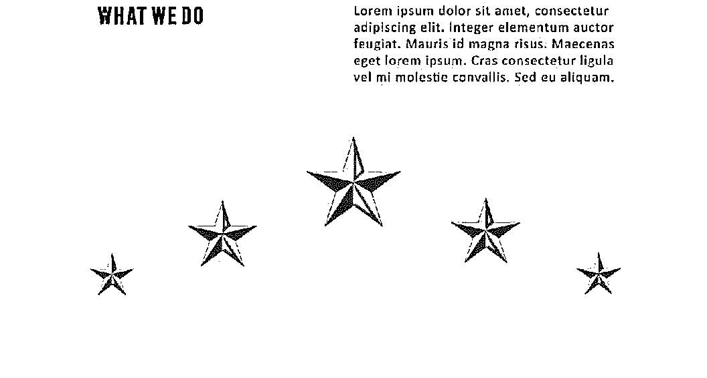

下一步是设计 web 页面的服务部分。我设计了一个灰色金属星星来展示公司的各种服务。使用星级标志的目的是提供五星级服务。

当谈到对齐文本时，参考线是您最好的朋友。通过充分利用设计元素之间的空白和相等的间隙，可以获得类型和对象之间的一致性。我使用了许多网站布局指南，看到框架中的所有对象都应该保持适当的间隙和距离，这带来了相当数量的空白空间。

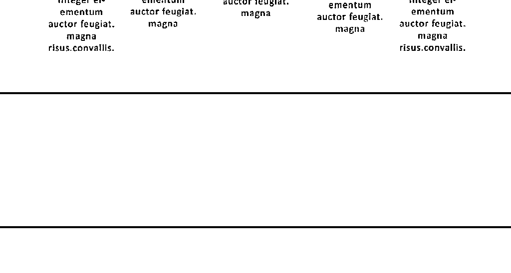

我们设计的下一步是创建表单字段。在这种情况下，我的工作方法与我们设计横幅时使用的方法相反。我们将把图像层放在纯色层的下面，并在这两层上应用渐变层，以获得更好的效果。放置较大的图像时，玩混合模式总是很重要的。

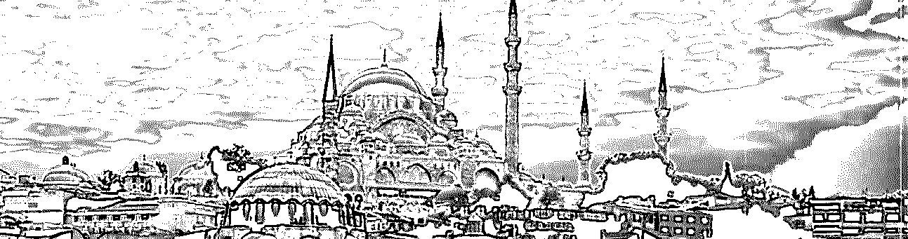

这个网站的图片选择没有特定的主题。我认为这张图片将有助于网站看起来更好。

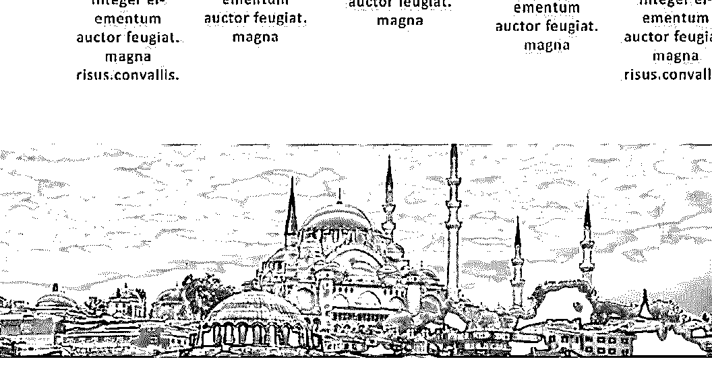

将图像放在彩色背景层下面。要将图像精确固定为彩色图层的大小，请使用图层蒙版选项。

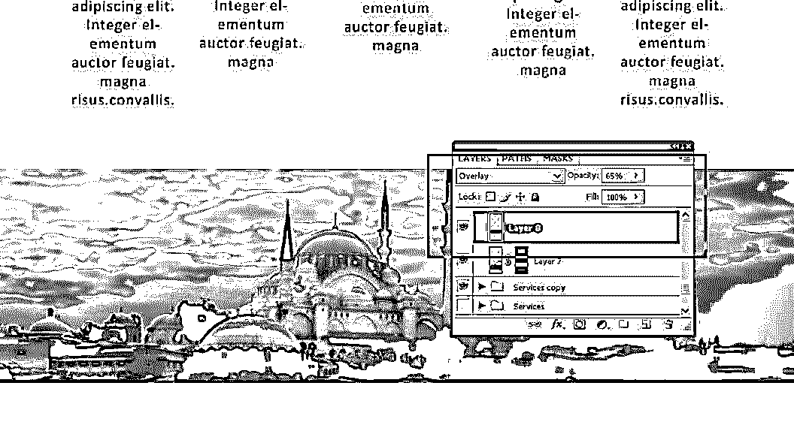

看看上图中的图层面板。纯蓝层在图像的顶部，混合模式转换为叠加，不透明度降低到 65%。

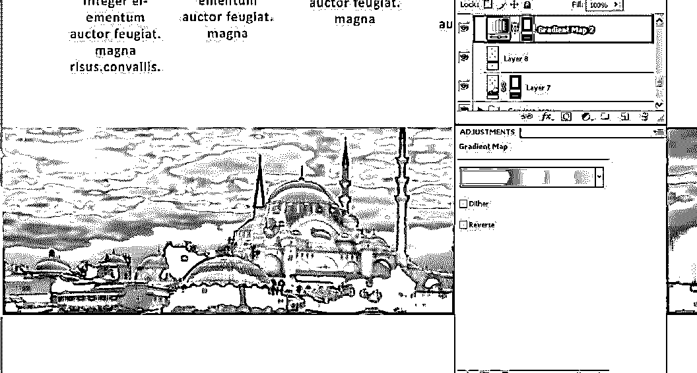

我在两层上面使用了渐变贴图。混合模式更改为色调，不透明度保持不变。

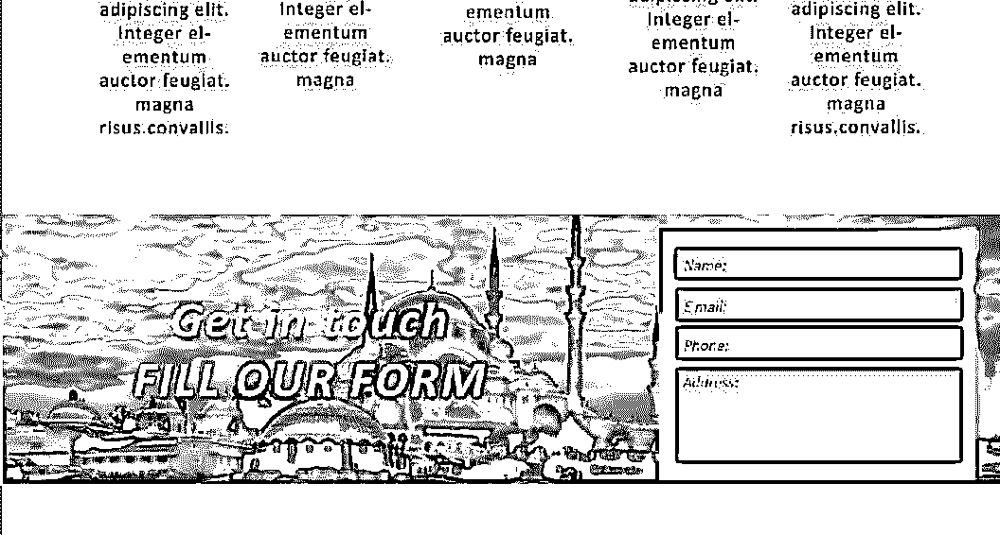

表单框已经准备好了，这就把我们带到了网站设计的第四关的末尾。

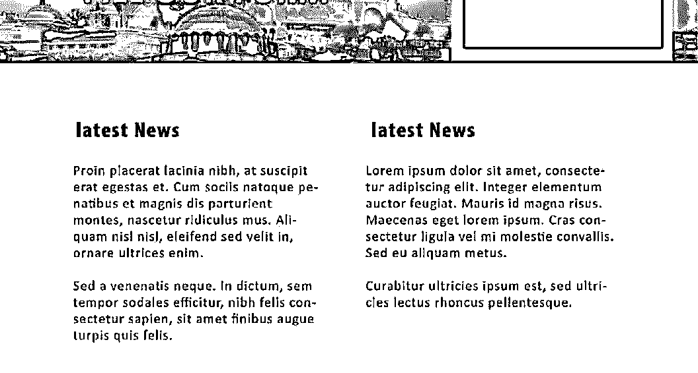

我们的下一个层次由两个简单的文本框组成。它类似于网页的第二层，我使用了类似于顶部的对齐两个框。保持对齐的一致性是使用空白的好方法。

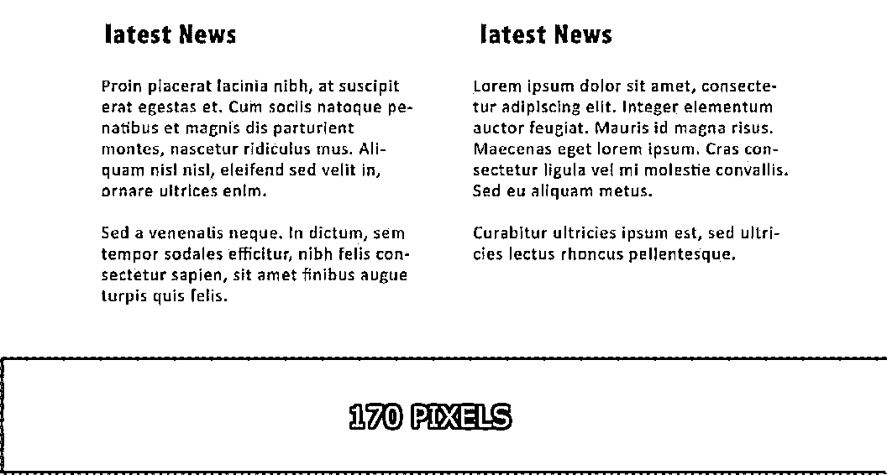

当我们到达页面的最后部分时，是时候再一次看看页脚的尺寸了。设计师必须根据他应该使用的链接来计划页脚的高度。在这个例子中，我给我的页脚设置了 170 像素的高度。宽度与网站保持一致。

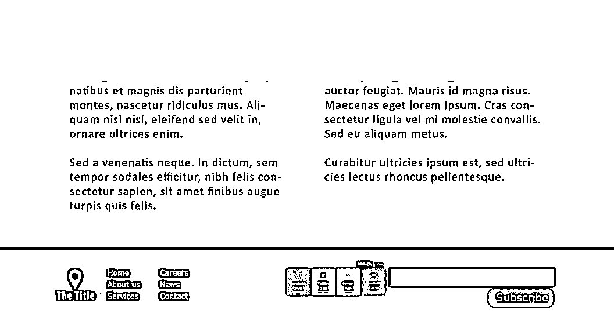

按照您的要求放置链接和图像。

就这样，我们结束了我们网站的设计部分。我们使用的颜色组合是最少的；我们在设计中利用了大量的空白空间，并用最少的字体添加了简单的文字。目的是设计一个干净的网页，我们希望能实现。

请再看一下下面整个页面的设计。

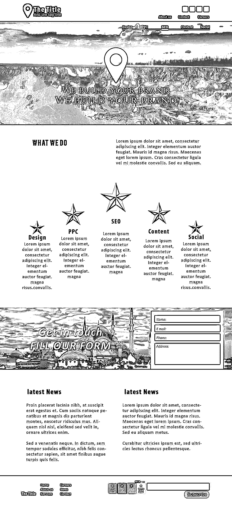

**