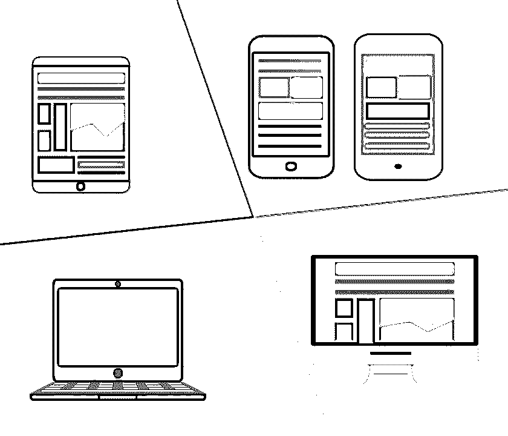

# Photoshop 下载的 10 个最佳免费 UI 套件

> 原文：<https://www.educba.com/10-free-ui-kits-to-download/>

**免费的 Photoshop 用户界面套件—**你是一名设计师，正在为你的网站设计一个模型吗？你的客户是否要求你创建一个模型或概念网站，而你对此的期限很短？[你是一名设计师](https://www.educba.com/freelance-web-graphic-designer/ "How to Be a Successful Freelance Web Designer")吗？你想要一个概念网站来吸引更多的客户？然后，这些免费的 UI 套件作为救星来到你面前，因为它们可以节省你的宝贵时间。时间，这对你赶上设计世界的最新趋势是至关重要的。总是建议您随时准备一个免费的 UI 工具包库。对于一个设计者来说，花很长时间在模拟网页上是显而易见的。当你在[设计你的网站](https://www.educba.com/web-designing-tools/ "A Beginners Guide to Web Designing")的初始阶段，收集一套 UI 套件可以帮助你赶上最后期限。

在过去的几年里，人们发现在网页设计中，炫目的插图、纹理和下拉阴影的使用减少了，但并没有完全脱离。这是因为最小化和扁平化设计的影响越来越大，这是一种以用户为中心的网页设计风格，在 2020 年吸引了许多设计师。设计师现在有一个座右铭，“简单就是牛逼”。

微软、谷歌和现在的苹果已经开始利用这种设计趋势。现在，测试是找到最好的 UI 套件 PSD 文件和[网页模板](https://www.educba.com/web-templates-html/ "How to Use Web Templates to Manage Your Site")。

宏大的 UI 组件和网页设计元素对于新手来说就像发现了一个秘密宝藏。这是因为像这样的属性可以轻松地支持和导航设计人员的工作，并帮助他们轻松、快速、高效地完成工作。

 

这些免费的 UI 工具包显示了基本的 web UI 元素和线框，用于制作 UI 的原型，该原型作为实体模型显示给客户，让他们了解他们的 UI 在完成后的外观。这有助于设计师节省时间，并提供一个令人惊叹的用户界面。

‏UI 的设计有助于创造一个有吸引力的和易于使用的界面。但对于设计师来说，同样是一个巨大的挑战。UI 工具包是用来解决正在出现的设计问题的。它们提供了一个框架和一系列元素来帮助传达功能和基于用户的交互。总之，UI 套件提供了资源，人们可以使用这些资源来开发应用程序的用户界面，无论是在 Photoshop 中，使用 iOS 或 Android 的 T2 开发者工具，还是在网络上。UI 工具包之所以被命名，是因为它提供了用户界面的不同部分，包括小部件和按钮、布局和其他设置，以及用户交互或反馈模块。

‏On 在 web 中，用户界面作为一个 CSS 库出现，其中有许多字体和图像，有时还有一个小的 JavaScript 集合，以提供对早期 web 浏览器不支持的高级功能的支持。每个网页设计师都熟悉 Twitter 的 Bootstrap，它提供了一种快速创建一致的基于网格的布局的方法，而无需开发全新的解决方案。

现在我们在这里列出了 11 个顶级 UI 套件，它们都是基于开发一个有吸引力的、易于使用的、布局方便的网站。让我们来看看吧！

## 10 个免费 UI 套件

1.  ### Get things done as soon as possible.

名字听起来是不是很有趣？是的，顾名思义，这是一个由创意 Tim 建立的时髦 UI 套件，它被命名为 [Get the Shit done](https://demos.creative-tim.com/get-shit-done/index.html "Get the Shit done") 。这是一个比 Bootstrap 更好的定制方案，并且非常容易使用。网站本身的导航功能非常简单和方便，所以设计者可以在几秒钟内找到他们需要的东西。完成的工作是干净的，伟大的功能界面需要伟大的网站。如果你到现在都没试过，那你一定要试一试。这将节省你的时间，并会帮助你在最后期限内创建一个令人敬畏的网站。它在响应式设计中具有魔力，提供易于使用的元素。它为寻求简单、干净和吸引人的界面的用户创造了一个商标。

2.  ### Almost flat user interface

‏If:你是一个初学者，正在寻找一个免费的、易于使用和简单的 UI 套件，那么[几乎扁平的 UI](https://websymphony.net/almost-flat-ui/ "Almost Flat UI") 是你的最佳选择。这是一个在[基金会框架](https://get.foundation/)上创建的很酷且简单易用的 UI。它包含了非常好的高级功能。它不需要实现 [SASS](https://www.educba.com/sass-interview-questions/) 或者开发自己吸引人的方法。几乎平坦的用户界面包括一系列有用和令人惊叹的部件，例如 CSS 面板、面包屑、提醒、标签和工具提示等等。您对创建概念网站的 UI 工具包的搜索到此结束。试试看，我相信你会想出一个很棒的网站。

3.  [T0】 UI suite

如果你一直在寻找一个平板材料设计灵感的 UI 套件，那么你已经登陆到正确的地方。简称 UI kit，是一个轻量级的模块化框架，在 [LESS](https://www.creativebloq.com/netmag/create-faster-fluid-layouts-less-8126159) 中开发。在这里介绍的所有工具包中，UI 工具包有许多方便的元素，如导航栏、按钮、工具提示和模态，可以用来创建一个外观很棒的模拟站点。这些可以在任何设备或屏幕上观看，只需稍加修改。它建立在支持布局的坚固网格系统上。它由一系列预设主题和一个定制工具组成，定制工具类似于 jQuery UI 的主题编辑器。你也可以利用这作为一个 Photoshop PSD 文件。所以，不要浪费你宝贵的时间去寻找这些工具包；使用 UI 套件并投资节省的时间！

4.  ### Boot barrel

如果你正在为一家初创公司设计网站，那么 Bootflat 是你可以使用的最好的免费 UI 套件。它是一个开源的平面用户界面，基于 Twitter 的 [Bootstrap](https://www.creativebloq.com/web-design/create-sleek-custom-page-bootstrap-9134283) 框架。在这里讨论的所有当前 UI 工具包中，它非常有名。由于它是 Bootstrap 的一个[级扩展，你可以得到一个带有加载功能的用户界面，以及一些独特的主题来增强平面美学。它完美融合了美丽纯净的组件、扁平的设计和恰当的色彩搭配。这是一个平面设计爱好者必须尝试的 UI 套件，他们有审美设计的感觉。](https://www.educba.com/bootstrap-vs-jquery/)

5.  ### Another UIV2

你是在寻找平面设计以外的东西吗？你认为反对平面设计的论点能让你设计出一个在众多网站中脱颖而出的时尚网站吗？这又是一个 UI v2 UI 工具包，其最大的优点就是简单。由 Hugo Darby-Brown 开发，它包括一组方便的小部件，强调用户输入，而不是像其他 UI 工具包一样简单的内容显示。这种风格是巨大的和时髦的，提供了一个令人愉快的对立面，以当前的时尚为极简，平面设计。通过另一个用户界面开始一次时尚之旅。

6.  ### brick

顾名思义， [Brick](https://designmodo.com/the-bricks/ "Brick") 在特性和元素上确实很强。Mozilla 开发了一系列独特的用户界面元素。它是为标准爱好者设计和创建的，这些爱好者在考虑了现代网络应用程序后创建了所有的网站。它在一个健壮的跨平台框架中加载了独特的特性和即插即用功能，并以一种非常有趣的方式进行了编码。它有助于设计人员利用目前被认为是 W3C 规范趋势的 web 组件来定义 HTML 文档中新开发的 DOM 元素。设计师们！这里有一个强大的 UI 工具包，可以帮助你创建一个响应迅速、时尚的网站。

7.  ### ink v2 【T1]

‏Hey 设计师！你是否在寻找一种简单的替代网格布局选项的方法来重新格式化你的网站元素以适应任何用户的屏幕尺寸？然后 lo！你在正确的地方。Ink v2 是一个 UI 套件，旨在使用独特而有用的组件来设计响应式网站，帮助网站适应用户的屏幕大小，而无需任何人工干预。如前所述，这是网格布局的一种替代方法，可以帮助您轻松开发一个模拟站点。唯一的要求是对 LESS 有很好的了解，以便利用这个 UI 工具包的好处。使用 INKv2 充分利用这些可能性。

8.  ### Pingtabi swimming

‏The 寻找一个优秀的助手快速创建您的网站或模拟网站到此结束。Flatby UI 是由 Dennis Schipper 设计的一个简单干净的 UI 工具包。这个 UI 工具包，不像其他的，提供了一个简单的方法来创建一个网站。你用过 Twitter 工具包吗？如果是，那么这个 UI 套件将会与您相似，因为它与 Bootstrap 共享一个公共模型。它的主要特点是利用 Codepen.io 作为一个演示和下载平台，并为其他 UI 工具包上的典型功能提供了替代方案。Flatby UI 仍然非常受欢迎，因为它提供了一个平台，设计师可以轻松地提取内容，修改内容并再次上传。它还提供了带有单个套件的页面的预览。

9.  [T0】 Metro-style Web user interface

正如它所说，“这一切都是在名称中，所以这里顾名思义 MetroStyle，是高度现代化的风格。这是一个为设计师提供的平台，他们可以在这里复制微软当前 Windows 用户界面的设计美学。然后可以用简单的特性和功能部件、样式、布局和网格将它应用到站点上。如果你是一个保守的设计师，那么这是你可以方便地选择的最好的和整洁的选择。

‏Do:你在设计中重视纯洁和诚实？如果你的答案是肯定的，那么这里有一个名为 Pure 的 UI 套件。这不仅仅是它的名字，还有它的特点，让它变得非常纯正。它提供了令人难以置信的一系列不同的样式和组件，都打包在小的、响应性强的 CSS 模块中，这些模块的编码非常简单。它在你的设计中描绘了一种稳定和成熟的感觉，因为它是建立在雅虎的 YUI 图书馆上的。在 Pure 中你能得到的最好的特性是它允许你下载一部分需要的工作。

11.  ### Futurico UI HTML 版

‏If:你已经[创建了一个页面布局](https://www.educba.com/web-page-design-layout/ "How To Create a Perfect Web Page Design")并且需要添加一些 UI 元素，那么 Futurico UI HTML edition 可以帮你一把。它允许您在已经创建的页面布局中包含一组用户界面元素。它给你一些易于使用的功能，如标签和滑块，并展示了美丽的视觉效果，给它简约的美感。设计师面临的唯一不利条件是订阅下载。

 

<address>Image source: pixabay.com</address>

### 2020 年接下来会发生什么！

我们在上面看到的都是 UI 工具包，它们是设计的用户界面元素的集合，实际上已经帮助并将帮助设计师快速、轻松、无障碍地创建设计。多年来，这些工具包为设计师创造了奇迹，并将在未来继续这样做。技术也极大地推动了这一领域的发展。你需要做的就是花时间选择适合你的 UI 套件，这样你就可以在很短的时间内创建一个网站。到目前为止，您一定已经决定了适合您的 UI 套件。别等了！只需下载并创建您美丽的网站。

### 推荐文章

这里有一些文章可以帮助你获得更多关于 Photoshop 下载的细节，所以只要浏览链接就可以了。

1.  [Adobe Photoshop](https://www.educba.com/adobe-photoshop/)
2.  [Photoshop 中的网站布局](https://www.educba.com/website-layout/)
3.  [Adobe Photoshop 的十大功能](https://www.educba.com/top-10-features-in-adobe-photoshop/)
4.  [Adobe Photoshop Elements 工具](https://www.educba.com/adobe-photoshop-element-tools/)

