# Photoshop 月亮画笔

> 原文：<https://www.educba.com/photoshop-moon-brushes/>

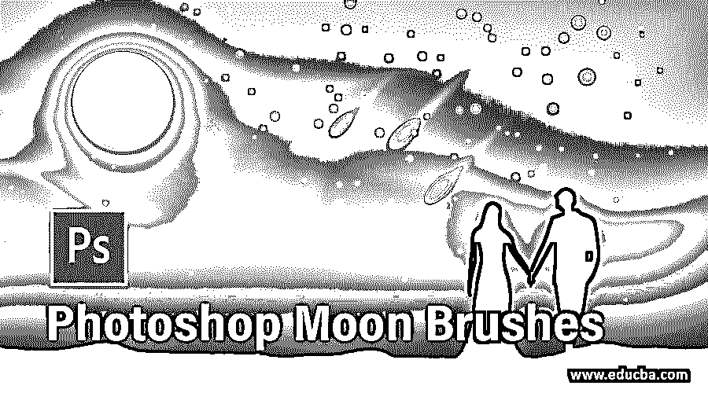

## Photoshop 月亮笔刷简介

Photoshop 是 adobe systems 开发的图像编辑软件，作为其光栅图像编辑软件。我们可以在这个软件中做任何类型的编辑工作，通过它我们可以创造出好的效果。月亮刷是一种刷子，通过它我们可以在你的图像中创建一个假月亮，并在你的图像中获得一个夜晚效果。因此，在这篇文章中，我们将分析所有重要的条款和参数的月亮刷，也了解我们如何可以创建一个假月亮在你的形象。因此，让我们来讨论一下 Photoshop 的这一特性，以便更好地了解它。

### Photoshop 中如何使用月亮刷？

我们可以从不同的网站免费下载月亮刷供我们使用，也可以将它应用到我们的图像上。因此，让我们开始了解它，但在开始之前，我们应该先了解这个软件的用户界面，这样在我们学习这个主题的过程中就不会出现问题。所以让我们看看这个软件的用户界面。

**步骤 1:** 在用户界面的顶部，我们有一个菜单栏，其中包含不同类型的菜单，有助于管理该软件中不同类型的任务。该软件的第二个栏位于菜单栏下方，称为属性栏，您可以在其中查看活动工具或图像的属性。该软件的下一部分位于属性栏的下方，属性栏有三个部分，如左侧的工具面板、中间的显示窗口、右侧的一些选项卡，如颜色选项卡、图层面板等。您可以根据自己的需要更改这些部分的位置。

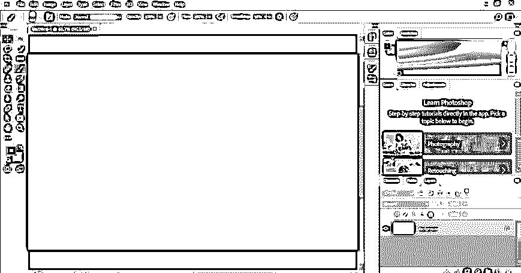

首先，如果你的 Photoshop 软件中没有月亮画笔，那么就从网上下载。在任何浏览器的搜索框中搜索月刷，然后打开任何免费网站。我打开了这个网站。现在点击免费下载按钮。

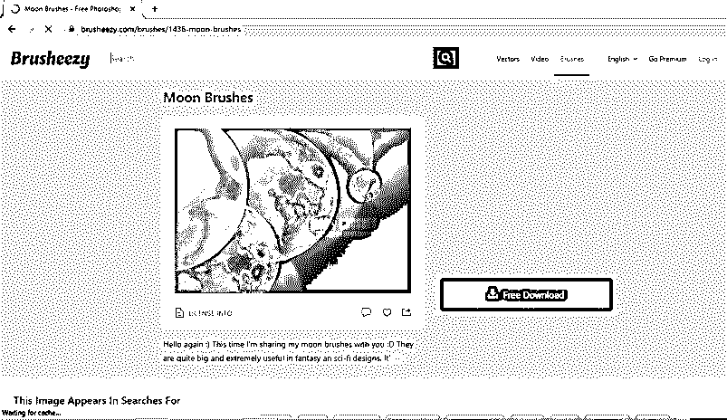

**第三步:**将下载一个 zip 文件。提取它，你会得到月亮刷这种类型的文件。现在从这里复制这个文件。

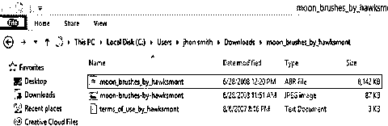

**第四步:**然后去 Photoshop 软件的 Presets 文件夹打开。

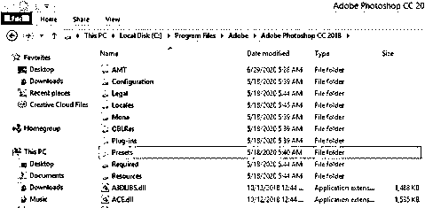

**第五步:**现在点击预置文件夹的笔刷文件夹。

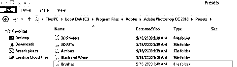

**第六步:**将你复制的月亮刷文件粘贴到这里。

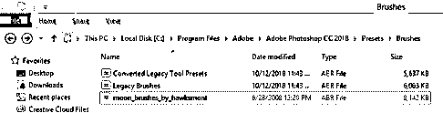

**第七步:**现在打开 Photoshop 软件。让我们对我们的学习有一个形象的认识。所以去菜单栏的文件菜单，点击它，然后点击下拉列表中的打开选项，或者你可以简单地按 Ctrl + O 键作为这个选项的快捷键。

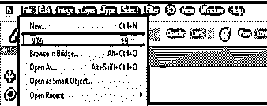

**步骤 8:** 现在转到您个人电脑上保存图像的文件夹，点击您想要的图像进行选择。一旦你选择了它，点击这个对话框的打开按钮。

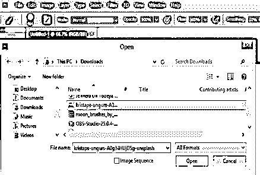

**第九步:**你的图像将会放在这个软件的一个新的窗口标签中。现在转到这个软件的图层面板的底部，点击调整图层按钮。点击此列表中的颜色查找选项，在夜间模式下转换此图像。

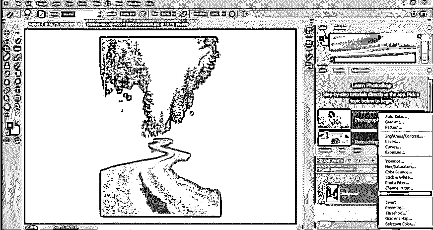

**第十步:**现在点击颜色查找框的文件选项的下拉箭头。

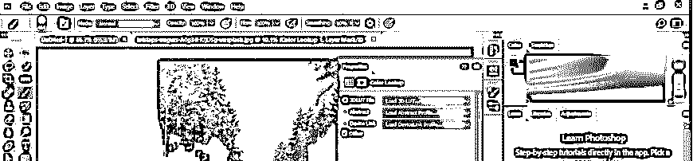

**第十一步:**选择 NightFromDay。列表中的多维数据集选项。

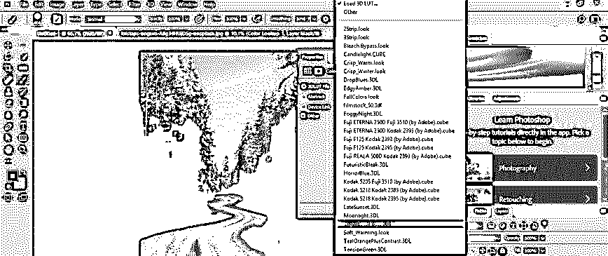

**第 12 步:**你的图像会在夜间模式下转换成这样。

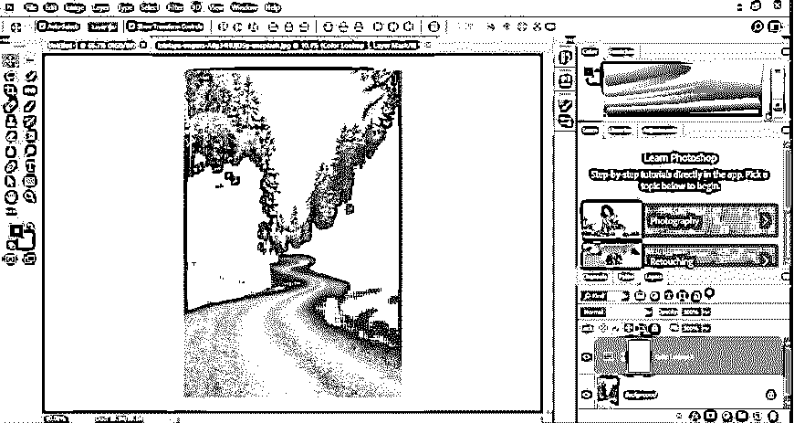

步骤 13: 现在再次转到图层面板的底部，点击“创建新图层”按钮。

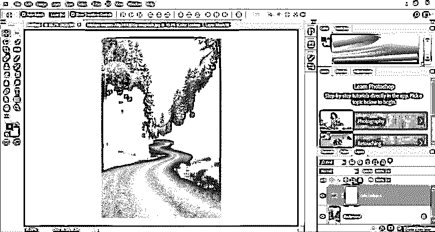

**步骤 14:** 到这个软件的工具面板，从这里拿画笔工具。

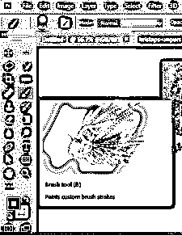

**步骤 15:** 现在点击画笔工具属性栏尺寸选项的下拉箭头，然后点击画笔工具尺寸框的设置图标。将会打开一个下拉列表。在这个列表中搜索月亮刷并点击它。

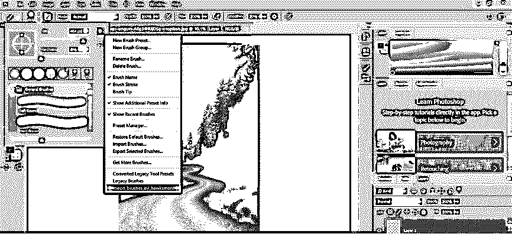

**步骤 16:** 如果你在下载后第一次使用这个月亮刷，那么软件会要求你将这个笔刷恢复到这个软件的笔刷预设中，所以点击这个框中的 Ok 按钮。

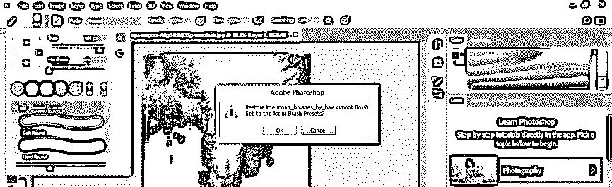

**第十七步:**现在你可以在这个软件的画笔列表中找到月亮画笔的预置。从这里选择你想要的月亮刷类型。

第十八步:我会通过点击来选择这个。

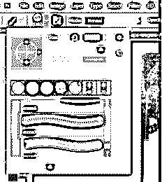

**步骤 19:** 现在在颜色框的前景色中设置白色。

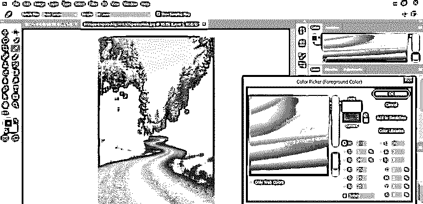

**步骤 20:** 在你想要做月亮的地方点击一下。

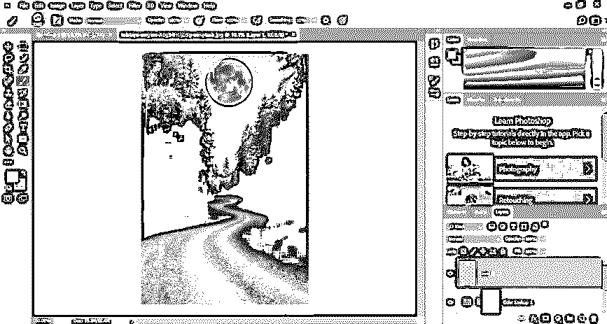

第 21 步:如果你把黑色作为前景色，你会得到这种类型的月亮。

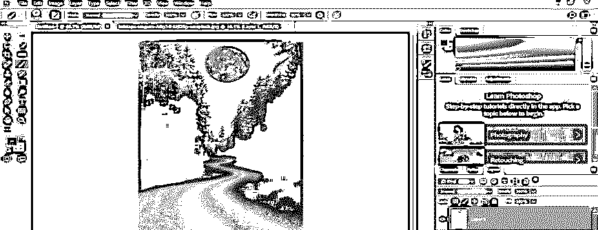

第二十二步:让我们和白月一起工作。现在再次创建一个新层点击'创建一个新层'按钮的层面板。

步骤 23: 现在把这个新图层(图层 2)放到月亮图层下面，从笔刷工具的笔刷大小框中选择一个软笔刷。

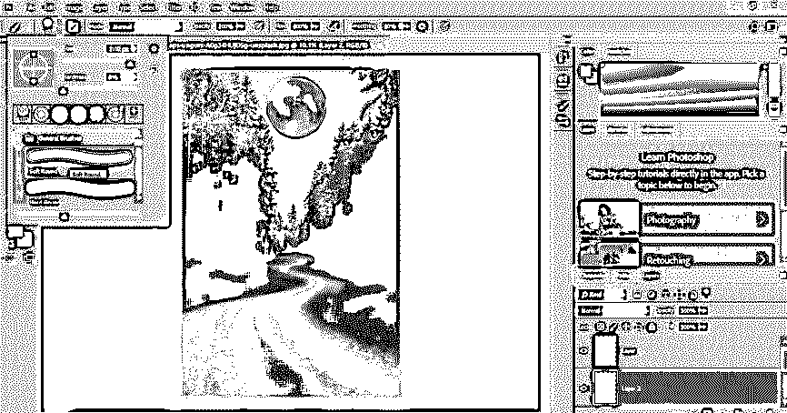

步骤 24: 现在增加软笔刷的大小，使它的大小大于月亮的大小。

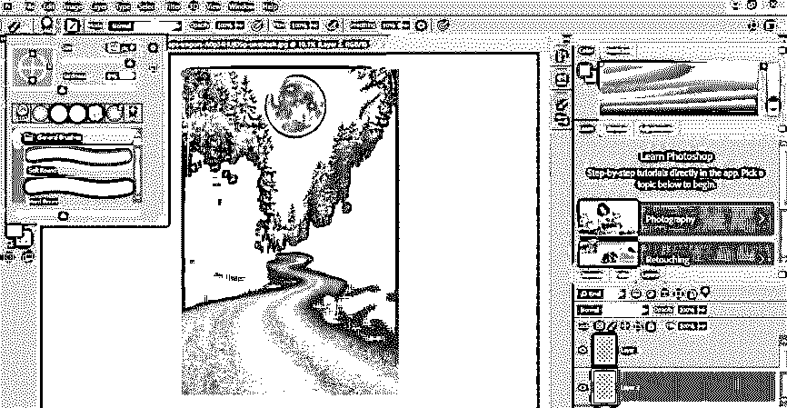

第 25 步:现在用这支笔刷一个接一个地点击月亮三次，你会看到月亮周围像自然的月亮一样发光。

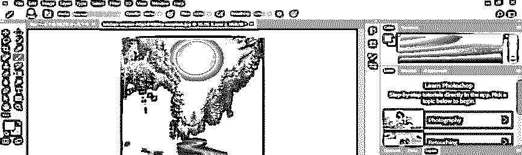

**步骤 26:** 现在在这一层的模式选项中选择叠加选项。

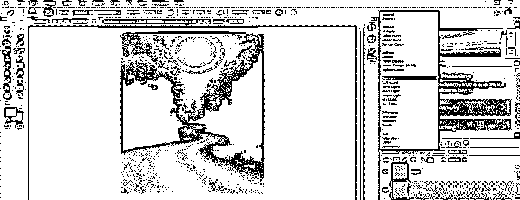

第 27 步:你会在你的月亮周围看到这种蓝色的光。再次调整蓝色调，创建一个新层。

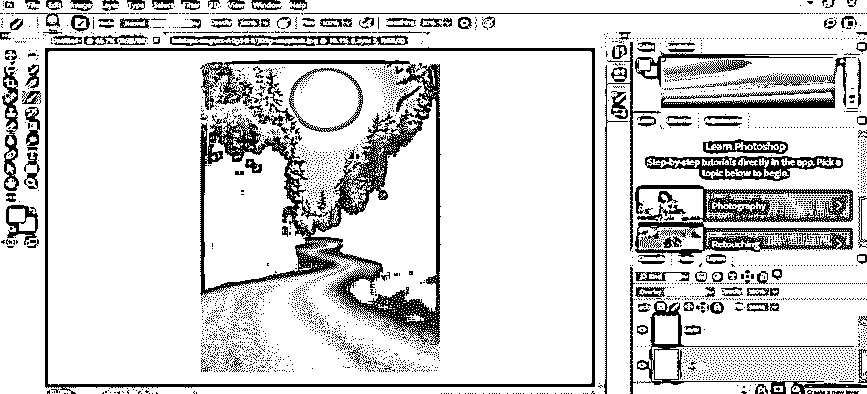

**步骤 28:** 现在点击渐变工具属性栏的渐变比例。

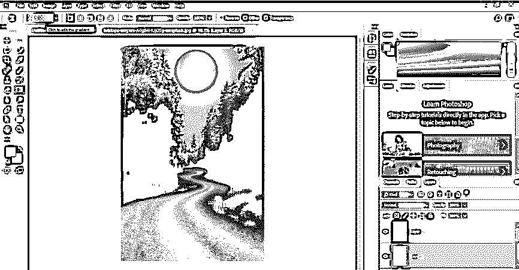

**步骤 29:** 从渐变编辑框的预置中选择这个渐变。

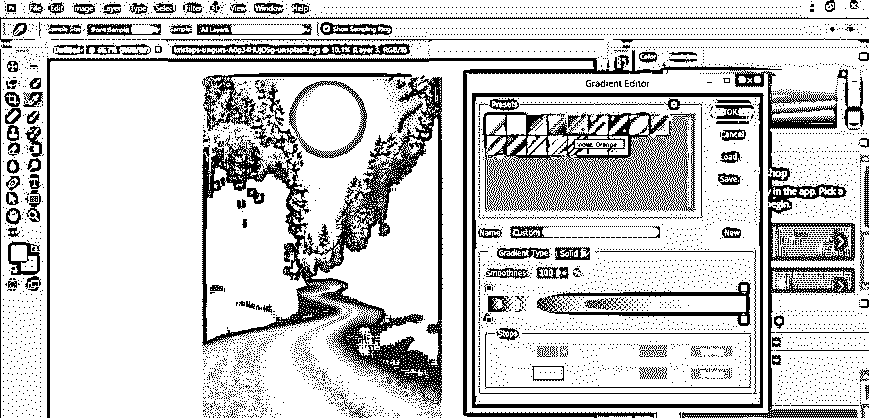

**步骤 30:** 现在点击终点颜色框，从颜色选择器框中选择一个更白的颜色。

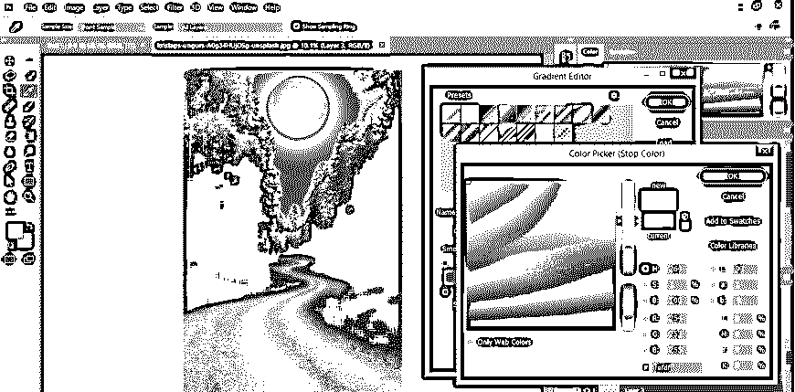

步骤 31: 现在像这样在你的图像上沿对角线方向拖动渐变鼠标指针。

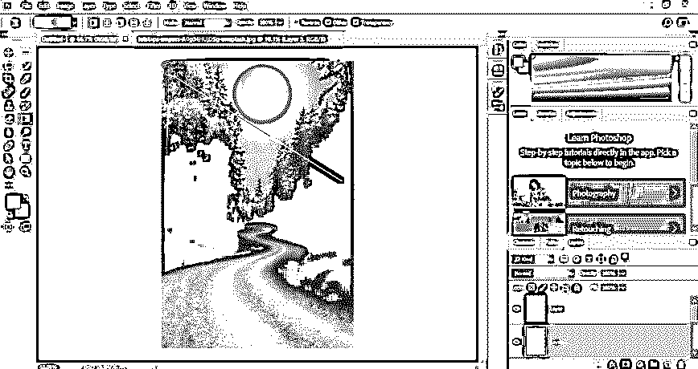

**步骤 32:** 现在在这一层的模式选项中选择叠加选项。

第 33 步:你会在你的月亮周围得到这种类型的光芒，让你的月亮看起来很自然。

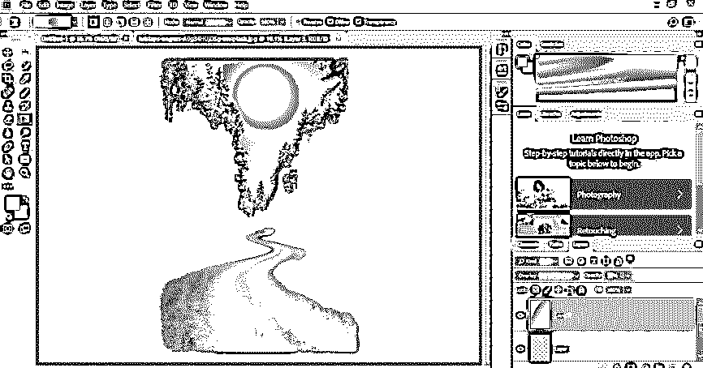

这样，你就可以在 Photoshop 软件中使用月亮笔刷在你的图像中创建一个假月亮。

### 结论

现在看完这篇文章后，你可以理解什么是月亮刷，以及它如何对你的项目工作有所帮助。你可以用 Photoshop 软件的笔刷做许多不同类型的创作，只是在上面练习，然后在你的图像编辑工作中运用你自己的想法。

### 推荐文章

这是一个 Photoshop 月亮刷指南。这里我们讨论一个介绍，如何在 photoshop 中一步一步的创建月亮刷效果。您也可以浏览我们的其他相关文章，了解更多信息——

1.  [Photoshop 混合笔刷工具](https://www.educba.com/photoshop-mixer-brush-tool/)
2.  [Photoshop 中的修复画笔工具](https://www.educba.com/healing-brush-tool-in-photoshop/)
3.  [Photoshop 中的水彩画笔](https://www.educba.com/watercolor-brushes-in-photoshop/)
4.  [树刷 Photoshop](https://www.educba.com/tree-brush-photoshop/)

