# 涟漪效果 Photoshop

> 原文：<https://www.educba.com/ripple-effect-photoshop/>

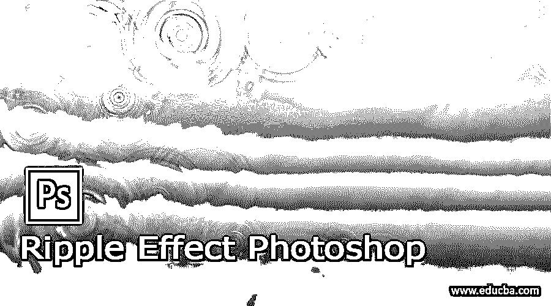

## 涟漪效果 Photoshop 简介

Photoshop 的波纹效果是 Photoshop 的一个滤镜，通过它我们可以为任何图像创建水波纹效果。您可以为图像的任何特定区域或整个图像创建波纹效果；这完全取决于你想在你的图像中做哪种类型的编辑。你可以在这个软件的滤镜菜单中找到涟漪效果，这个效果和滤镜菜单的一些附加滤镜一起使用，比如扭曲滤镜的之字形选项，渲染滤镜的云朵等等。我将借助一些例子向你解释这种效应。所以让我们来看看。

### 如何在 Photoshop 中创建波纹效果？

为了在 Photoshop 中创建波纹效果，我们必须对我们想要创建这种效果的图像进行一些调整。因此，我要做的第一件事就是在 Photoshop 中制作一个图像，为了有一个图像，我将打开那个图像。所以去文件菜单点击它，然后点击打开按钮或向下滚动列表。也可以用它的快捷键，就是键盘的 Ctrl + O 键。

<small>3D 动画、建模、仿真、游戏开发&其他</small>

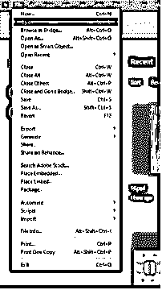

单击此选项后，将会打开一个对话框，您可以在其中选择所需的图像。例如，我将选择此图像来解释此主题，然后单击“打开”按钮。

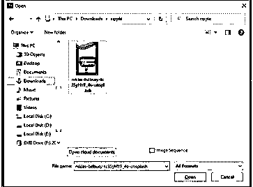

这是我们想要的形象。我将复制它，为了复制它，我将在图层面板中选择这个图层，然后按下键盘上的 Ctrl + J 键。

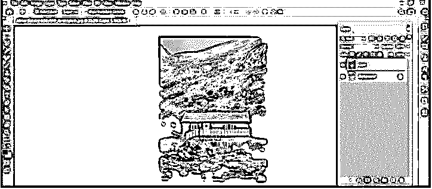

现在，我将把这个副本转换成一个智能对象，所以当我调整它的大小时，它将作为一个非破坏性的层。选择图层，右键单击，然后选择“转换为智能对象”使其成为智能对象。

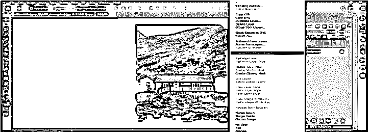

现在按 Ctrl + T 按钮从有这个图像的变换框，然后作出一个右键单击。我将从下拉列表中选择“垂直翻转”选项来向下反射此图像。

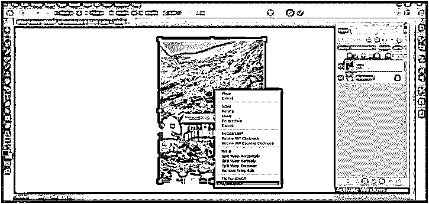

现在，我将向下移动这一层来查看源图像，并按下键盘上的回车键来完成这个转换。

现在我将选择背景层并向上移动一点。以这种方式放置两幅图像，使向下的图像看起来像上面图像的反射。

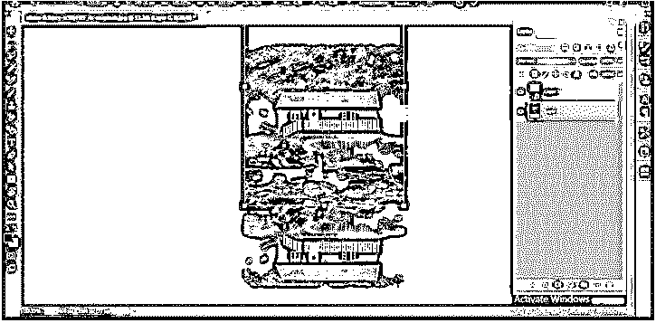

现在我将裁剪这些图像的额外部分，对于裁剪，图像从工具面板中选择裁剪工具；然后，在定义图像区域后，按键盘的 enter 键。

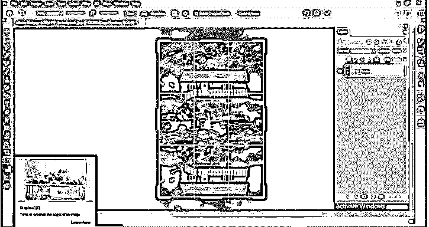

现在拿一个新文档来创建一个新文档的连锁反应；点击文件菜单的新建选项。

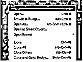

现在，根据您的图像大小选择文档的大小。例如，我将获取一个 500 x 1000 大小的文档。

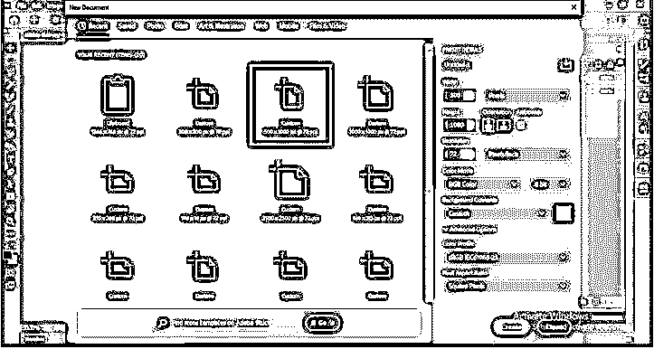

现在转到过滤器菜单并点击它。然后转到这个菜单的下拉列表的渲染选项，然后选择云选项。

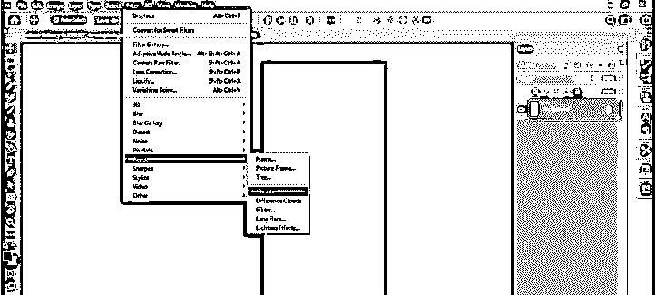

云效果会这样应用。

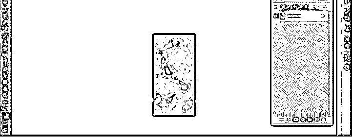

现在再次进入滤镜菜单，这次选择扭曲选项，然后选择波纹效果。

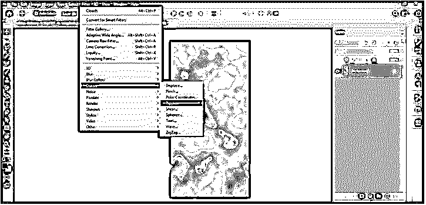

在“涟漪效果”框中，从“数量”滑块中设置涟漪效果的数量。比如我会这样设置。

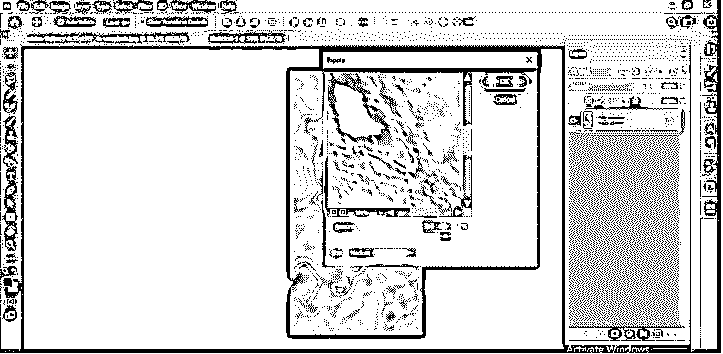

你可以从亮度和对比度调整层调整这个波纹层的亮度和对比度。

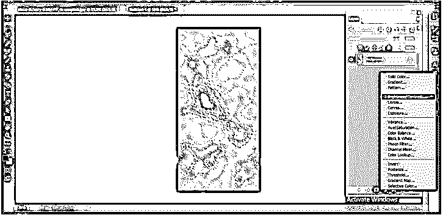

或者，如果您想在高光和阴影之间形成良好的对比，您可以使用色阶调整图层来实现这一目的。

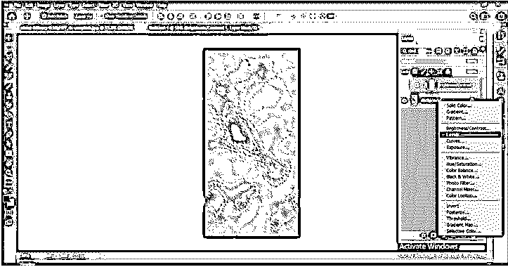

现在我将再次进入滤镜菜单，从下拉列表的扭曲选项中，我将选择锯齿效果。

在锯齿形效果的对话框中，有三个选项可以优化波纹效果:围绕中心、偏离中心和池塘波纹。

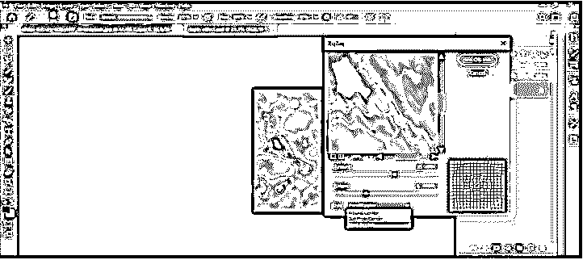

我会选择“偏离中心”选项。

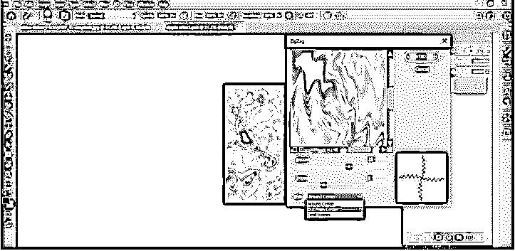

并根据我的选择调整数量滑块的值。

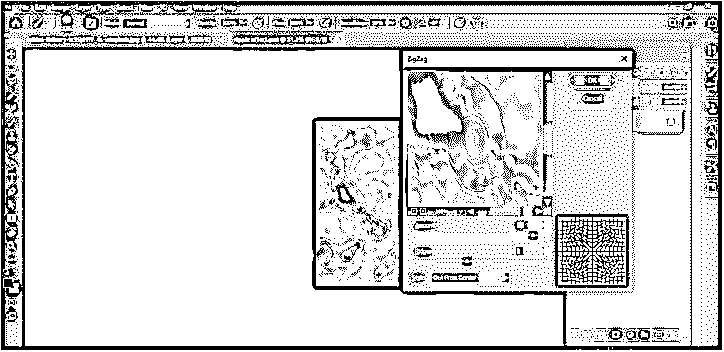

现在保存这个涟漪效应。psd 文件格式。所以转到文件菜单，然后从下拉列表中选择保存选项，或者你可以直接按键盘上的 Ctrl + S 键。

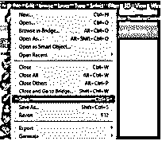

单击“打开”对话框中的“保存在您的计算机上”按钮，因为它想将其保存在我的计算机上。另一个标签是保存你在云服务器上的工作。

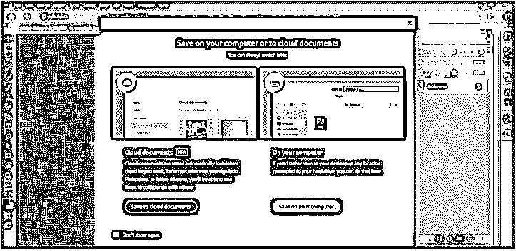

并将其保存在我想要的文件夹中。我会把它命名为涟漪效应。

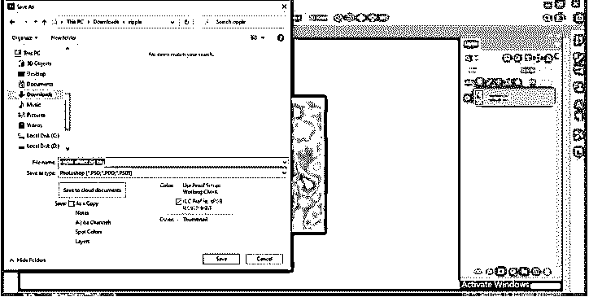

现在我将回到我们的图像标签，在图层面板中选择向下的图层，然后进入滤镜菜单，点击扭曲选项的替换子选项。

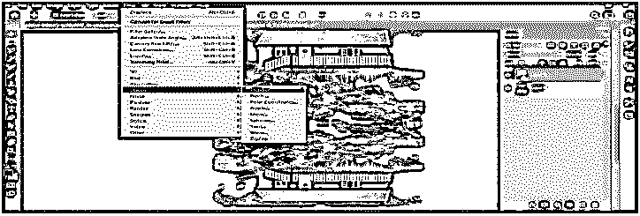

将会打开一个替换对话框。根据您的要求调整水平和垂直刻度值。我将这样设置它们，并点击这个对话框的 Ok 按钮。

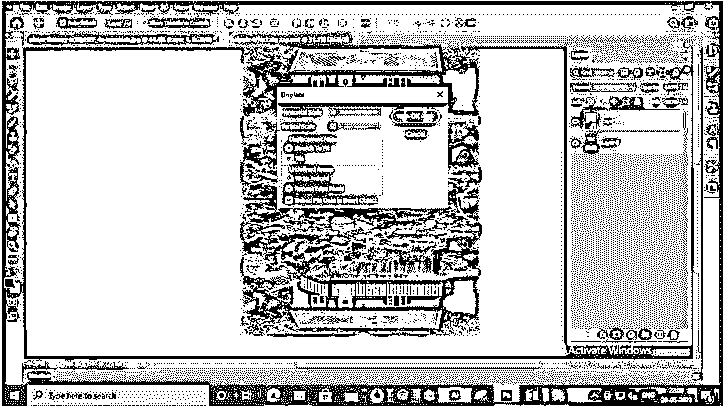

一旦你点击 Ok 按钮，它会要求你选择一个文件进行替换。我将选择这个涟漪效应文件，然后按下这个对话框的打开按钮。

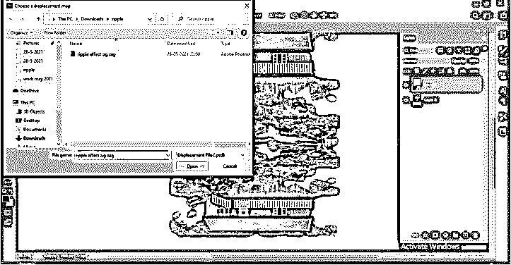

会产生这样的连锁反应。

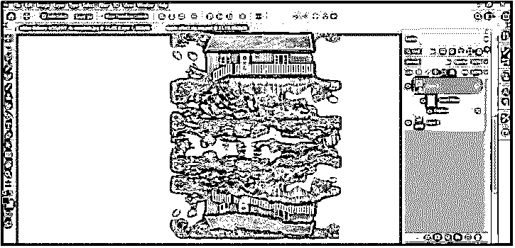

现在将这个波纹效果图层放到图层面板中的源图层下面。

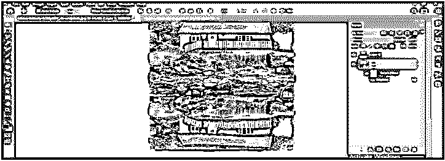

我将选择一个上层，并添加一个面具到这一层，并添加一个面具到这一层，点击添加层面具按钮，这是在层面板的底部。

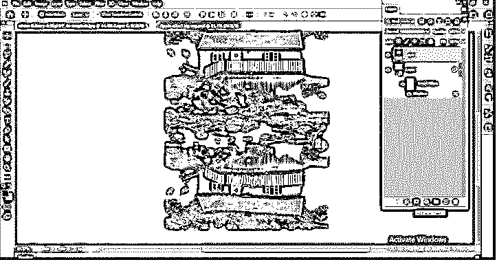

我将从工具面板中取出笔刷工具，像这样刷这个区域，这样上层和下层会有很好的混合。

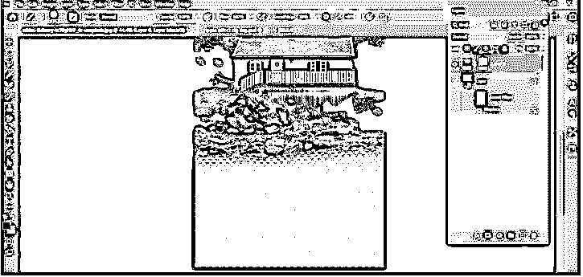

这样，你就可以在这个软件中产生连锁反应。您可以通过调整我们在这里使用的不同滤镜的参数来增加或减少这种效果的强度。

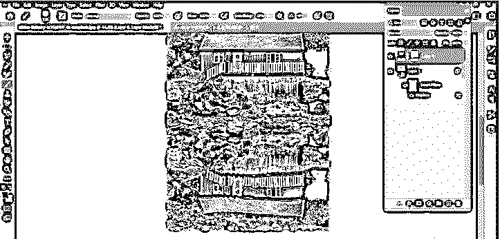

### 结论

你现在可以按照上面讨论的方法为你的图像创建一个波纹效果。然而，有一些其他的方法可以让你的图像产生水波纹效果，我只是告诉你其中的一种，所以试着开始练习这个功能，这样你就可以很好地掌握它。

### 推荐文章

这是一个涟漪效应 Photoshop 的指南。在这里，我们讨论在 Photoshop 中通过使用图像的水波纹效果来创建涟漪效果。您也可以看看以下文章，了解更多信息–

1.  [Photoshop 全息效果](https://www.educba.com/photoshop-hologram-effect/)
2.  [像素效果 Photoshop](https://www.educba.com/pixel-effect-photoshop/)
3.  [Photoshop 中的夜间效果](https://www.educba.com/night-effect-in-photoshop/)
4.  [Photoshop 阳光效果](https://www.educba.com/photoshop-sun-effect/)

