# Photoshop 中的动作

> 原文：<https://www.educba.com/action-in-photoshop/>

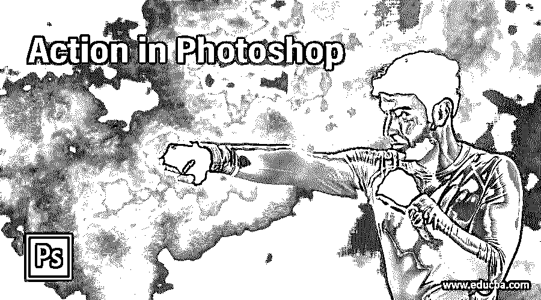

## Photoshop 中动作的定义

动作是 Photoshop 软件的一个功能，通过它你可以为 Photoshop 的任何特定动作创建一个快捷键，这样你就不需要为不同的图像重复做同样的工作。你可以为你重复的工作创建一个动作按钮，这样你就可以为同样的工作节省时间。在本文中，我们将通过对图像进行颜色校正并将其记录为动作按钮来了解 Photoshop 的动作功能。我们还将学习如何一次将这个动作应用于多个图像。所以让我们通过一个例子来理解这个话题。

### 如何在 Photoshop 中创建动作？

我们可以根据自己的选择在 Photoshop 中创建一些动作。我们只需遵循几个简单的步骤，但在开始之前，让我们看看这个软件的工作屏幕，以便在整个学习过程中更好地理解这个主题。

<small>3D 动画、建模、仿真、游戏开发&其他</small>

在工作屏幕的顶部，菜单栏有许多菜单，如文件菜单、编辑菜单、图像菜单等。在这下面，我们有一个活动工具或图像的属性栏，用于更改它们的参数。在这下面，我们在左侧有一个工具栏，在中心有一个显示窗口；在右侧，我们有一些标签，如颜色标签，样本标签，和其他一些。您可以在工作屏幕的任何地方根据您的选择调整所有这些部分。

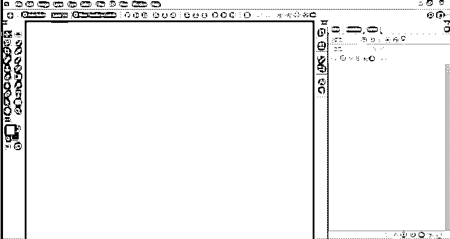

现在让我们有一个形象的学习。为此，我从网上下载了一张图片。你可以有自己的一个。要放置图像，请转到保存图像的目标文件夹，从该文件夹中选择图像，然后将其放入该软件的显示窗口区域。

现在转到菜单栏的窗口菜单，点击它。将会打开一个下拉列表。单击下拉列表中的操作选项。

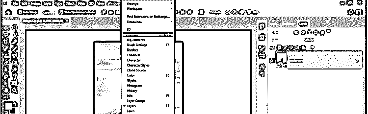

一个动作对话框会这样打开。您可以将它放在工作屏幕上您想要的任何位置。

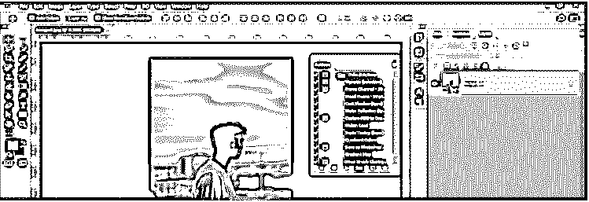

在这个框中有一些预设的动作。你可以使用它们中的任何一个，而不需要在不同的图像上创建任何动作按钮。但是我们将学习如何创建我们自己的操作，所以单击这个框底部的“创建新操作”按钮。

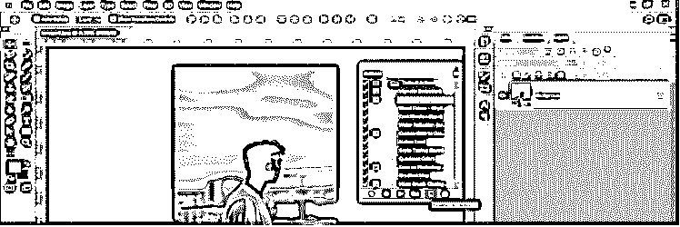

将打开一个新对话框，显示“保存您的操作”按钮。根据你的选择命名你的行动。比如我就把它命名为色彩校正。

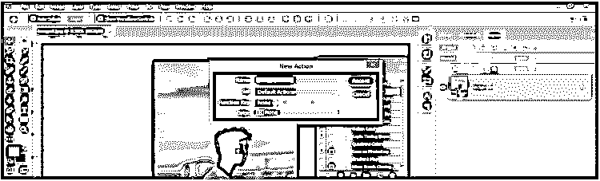

从这个列表中为你的动作按钮定义一个快捷键。你可以从这份名单中选择任何人。

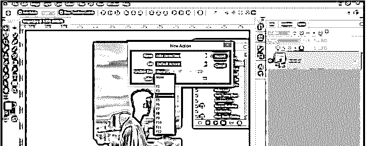

您可以通过单击这些按钮的复选框来启用键盘的 Shift 或 Control 按钮，作为带有快捷键的附加键。现在点击这个对话框的记录按钮。

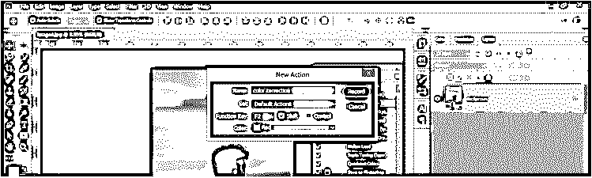

你的行动将开始记录你的每一个修正或改变，你将在这个图像中做。该记录由按钮上动作对话框中的红色按钮指示。

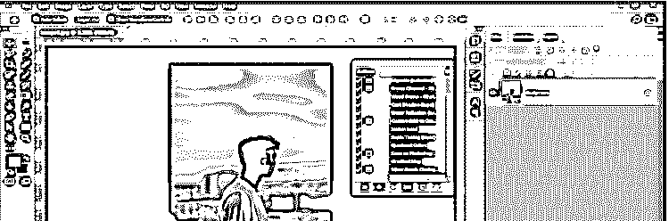

现在让我们对这个图像进行一些修正，它将记录在我们的动作按钮中。首先，进入调整图层按钮，它在图层面板的底部，一个下拉列表将被打开；然后点击列表中的色调/饱和度选项。

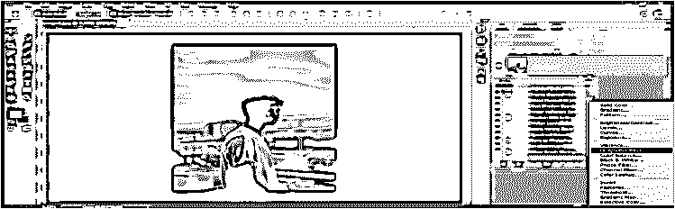

现在对图像的颜色进行一些修正。

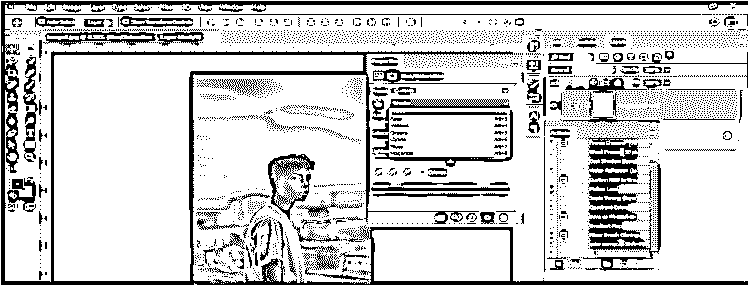

现在创建一个新层，在它的图像上添加渐变。对于一个新层，去图层面板的“创建新层”按钮并点击它。

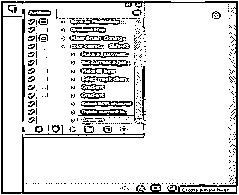

现在从工具面板中点击渐变工具，或者你可以按键盘上的 G 键作为快捷键。

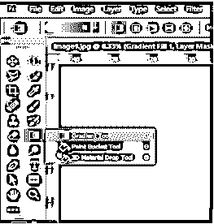

从渐变属性栏的预设中选择一种简单渐变。你可以根据你的情况来选择。

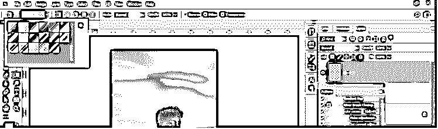

拖动图像上的渐变线，从所需方向在图像上应用渐变。我将像这样从下到上应用渐变。

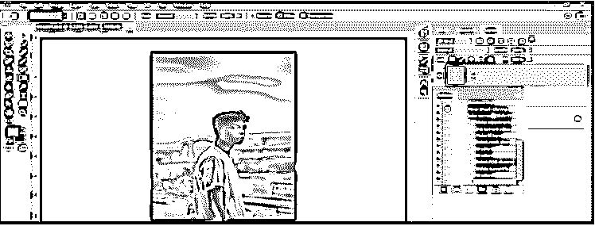

现在它会给底部区域的图像一个淡入淡出的效果，就像这样。

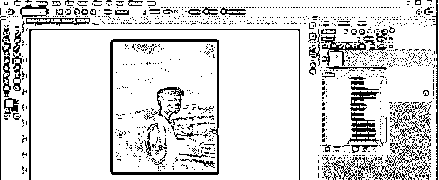

现在点击“动作”对话框中的“停止播放录音”按钮来停止录音。

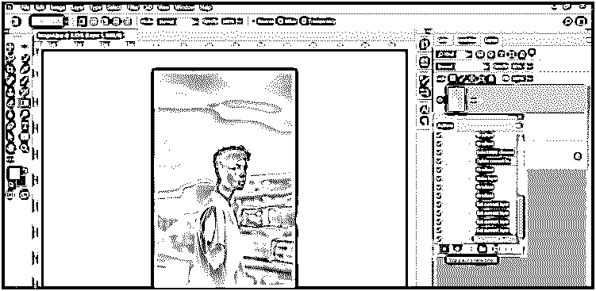

您创建的动作将以您的名字保存在动作框中的动作预设列表中，就像这样。

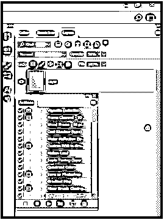

现在让我们通过单击将我们的操作应用到其他图像。为此，请转到菜单栏的文件菜单并单击它。从下拉列表中选择自动选项。再次转到新建下拉列表，并从列表中选择批处理选项。

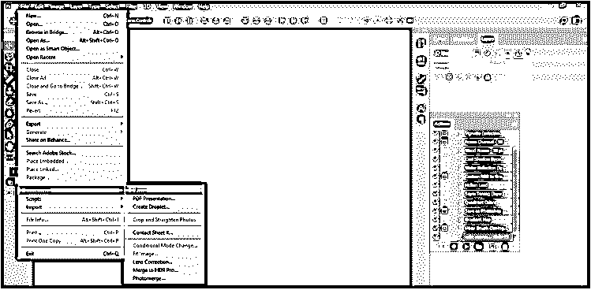

将会打开一个这样的对话框，用于选择您想要应用到其他图像的操作。在此从列表中选择您的操作。比如我会选择‘颜色修正’，这是我创造的，作为我的动作。

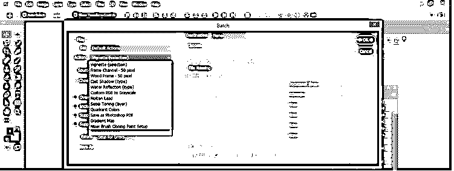

现在选择如何将您的动作应用到不同的图像。我将从列表中选择文件夹选项。

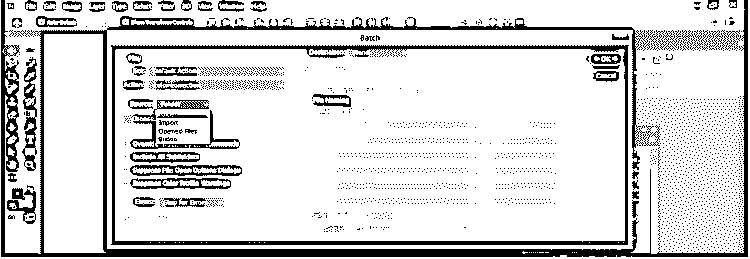

现在点击这个对话框的选择按钮。单击“选择”按钮后，将会打开一个新对话框，用于选择保存图像的文件夹。我会选择这个文件夹。

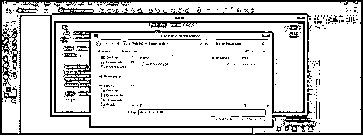

从该列表中选择保存并关闭选项，以便在不同图像上应用您的操作后，它会要求您将编辑过的图像保存到所需的文件夹中。然后单击该对话框的“确定”按钮。

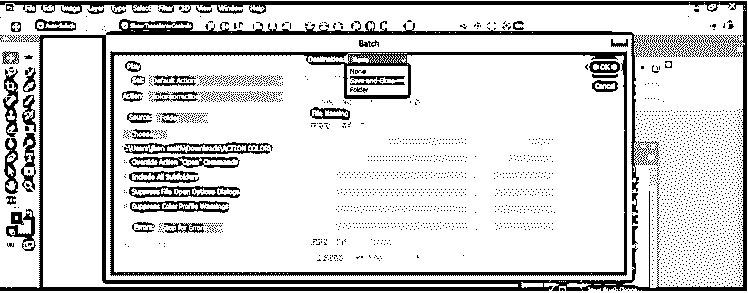

现在在你选择的图片上应用你的动作后，它会问你想把它保存在哪里。所以把它保存在你想要的位置，然后点击这个对话框的保存按钮。

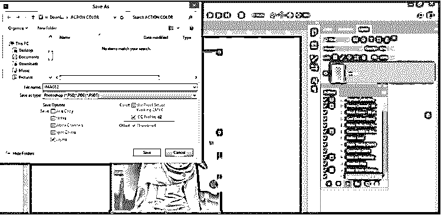

对你选择的文件夹中的每一张图片重复这个步骤。

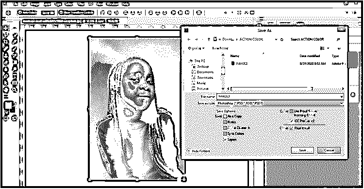

这样，您可以在 Photoshop 中创建动作，并将其应用于不同的图像以节省您的时间。

### 结论

读完这篇文章后，你可以理解什么是动作，以及如何创建动作来节省你在 Photoshop 中处理不同图像的时间。此外，你可以通过练习来增加你对 Photoshop 功能的专业知识。

### 推荐文章

这是一个 Photoshop 的操作指南。这里我们讨论在 Photoshop 中为不同的图像创建动作的步骤。您也可以阅读以下文章，了解更多信息——

1.  [Photoshop 中的雨效果](https://www.educba.com/rain-effect-in-photoshop/)
2.  [Photoshop 中的油彩滤镜](https://www.educba.com/oil-paint-filter-in-photoshop/)
3.  [Photoshop 中的刻录工具](https://www.educba.com/burn-tool-in-photoshop/)
4.  [在特效中塑造图层](https://www.educba.com/shape-layers-in-after-effects/)

