# Photoshop GIF

> 原文：<https://www.educba.com/photoshop-gif/>

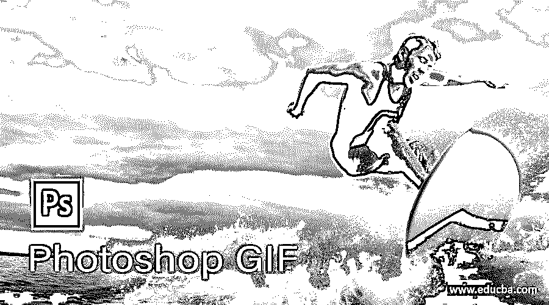

## Photoshop GIF 效果介绍

GIF 代表图形交换格式，这意味着一个图像文件(具有图像文件扩展名或格式)，它给你一个视频文件的效果(当你打开它，然后它有一些运动效果)。它是由美国计算机科学家 CompuServe 于 1987 年开发的。在 Photoshop 中，我们可以通过使用图像的一些属性以及时间轴选项卡上的视频剪辑来创建它。通过在 Photoshop 中制作 GIF 效果，您可以在任何图像上创造奇迹，而无需更改其文件扩展名。你觉得怎么样？你准备好创造这个奇迹了吗？我想是的，所以让我们开始吧。

### 如何在 Photoshop 中制作 GIF 效果？

创建 GIF 是 Photoshop 中一个非常令人兴奋和神奇的功能，今天我们将分析该功能的各个方面，以便正确地浏览这个主题。

<small>3D 动画、建模、仿真、游戏开发&其他</small>

让我们继续学习。首先，我们将放置一个我们想要制作 gif 的图像。所以点击这个屏幕菜单栏的文件菜单的打开选项或者简单的按 Ctrl + O 键作为快捷键。

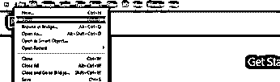

将会打开一个对话框，搜索保存该特定图像的文件夹，单击该图像，然后点击该对话框的打开按钮。

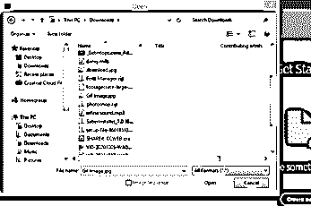

您的图像将在一个新标签页上打开；根据您的选择调整其大小。

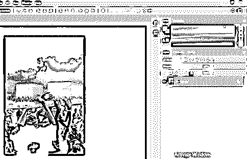

现在我想在我们的作品中放一个视频剪辑。所以，再次进入打开选项，这一次，从打开的对话框中选择一个视频剪辑文件，然后点击打开按钮。

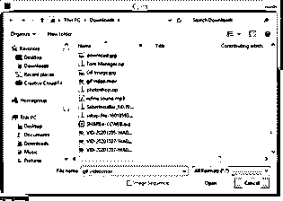

点击“打开”按钮后，将视频剪辑导入 Photoshop 文档选项卡需要一些时间。

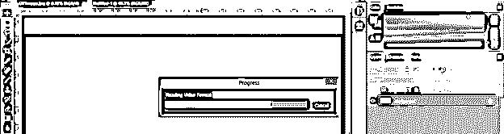

哇！这是一个瀑布视频剪辑。让我们用它来制作我们的 GIF。此视频剪辑将与时间轴部分一起打开，时间轴部分位于此文档选项卡的底部。

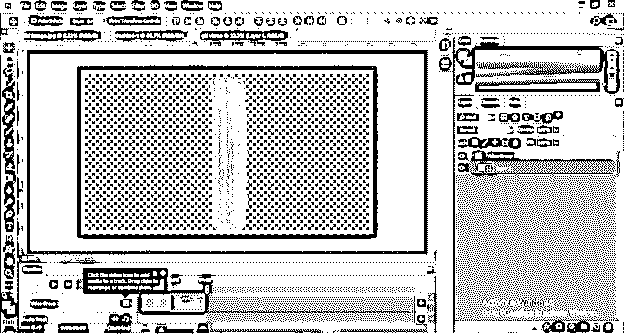

现在转到这个软件的图层面板，右键点击视频组图层；从向上滚动列表中选择“取消层分组”选项，以取消导入视频文件的分组。

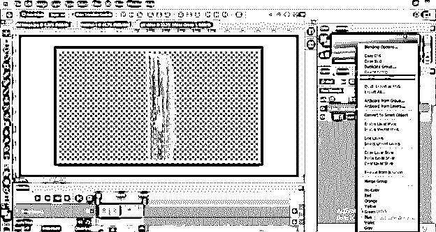

现在转到时间线部分，单击视频剪辑层的播放器图标。从这个方块中降低 50%的视讯播放速度。如果您的视频剪辑很长，并且您想在 GIF 中添加视频剪辑的每一帧，您可以提高速度。

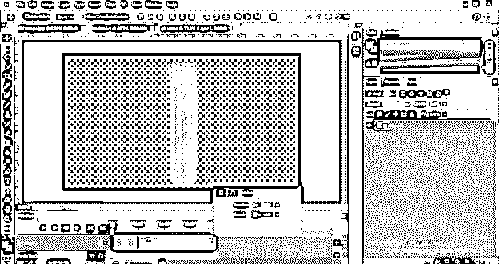

制作此视频剪辑的副本。在图层面板中选择这个图层，按下 Ctrl + J 按钮进行复制。

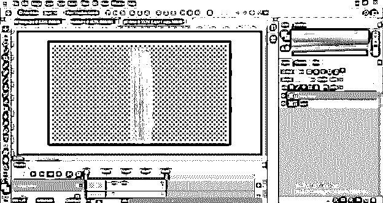

移动复制层到瀑布的右边，增加瀑布的密度。

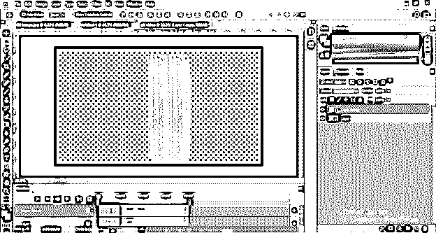

选择这两个层，然后右键单击。单击“转换为智能对象”选项，向上滚动列表。

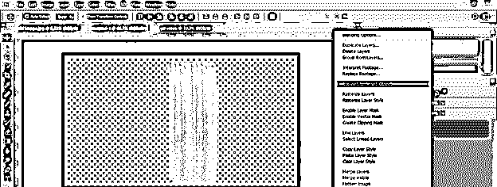

将此视频剪辑重命名为瀑布。

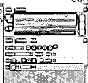

现在，借助鼠标左键将此剪辑拖动到 GIF 图像选项卡。

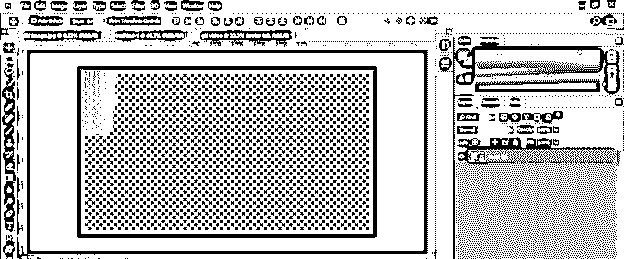

它会像这样放在这里。按下变换框的 Ctrl + t 按钮，并根据您的选择调整瀑布剪辑的大小。我会像这样设置它。

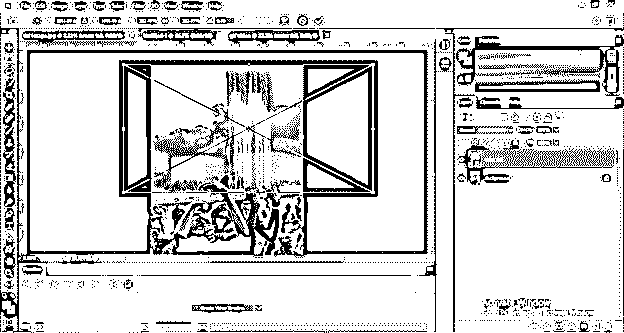

现在双击背景层，使其可编辑。将打开一个对话框；命名这一层根据你，然后点击确定按钮。

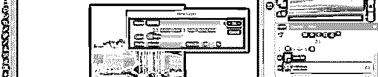

选择这两层，然后点击时间线部分的“创建视频时间线”按钮。一旦你点击，这两个层的层将出现在时间线区域。

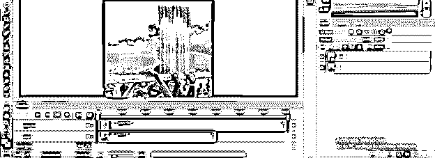

通过拖动，将视频剪辑的长度减少到图像层的长度，或者也可以增加图像层的长度。

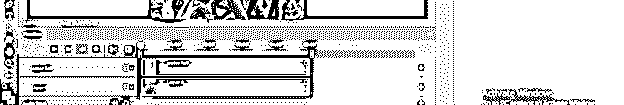

现在选择瀑布层，点击调整层的添加蒙版按钮，在这一层添加蒙版。

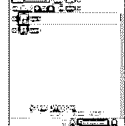

从工具面板中选择笔刷工具，调整大小，选择软笔刷。

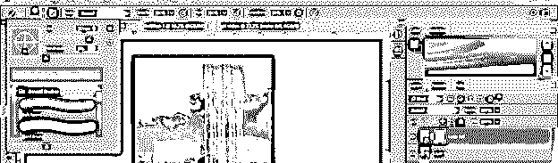

将黑色设置为前景色。

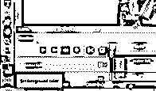

选择这个图层的蒙版缩略图图标，用笔刷工具去除瀑布上部的锐利边缘。

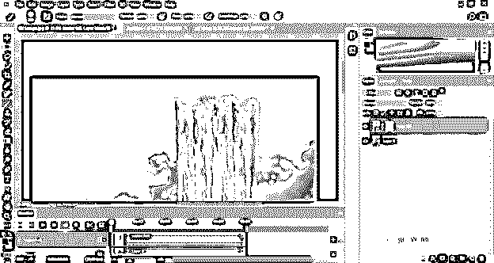

用瀑布底部的笔刷工具做同样的操作。

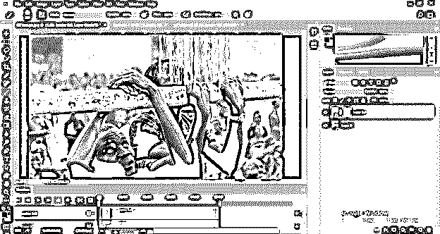

现在添加一个图层蒙版到图像层，并设置笔刷大小。

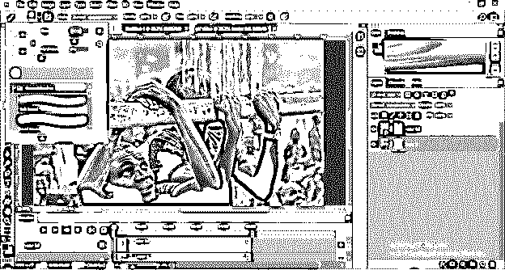

将笔刷工具的不透明度降低到 10%。

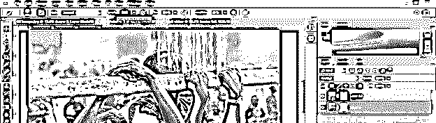

现在点击瀑布后面的男孩的头，让他的脸有真实的水的效果。

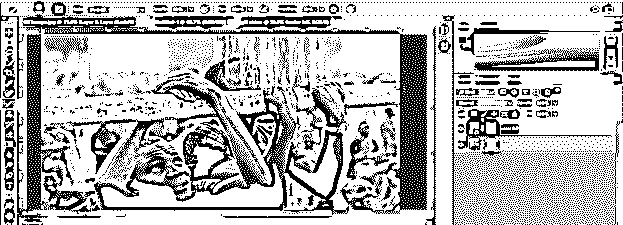

我认为我们应该复制这个视频剪辑，以便有效地观察瀑布。所以选择瀑布图层，然后按 Ctrl + J 按钮，拖动复制的图层到第一个图层的右边。在时间线部分调整拷贝的层长度。

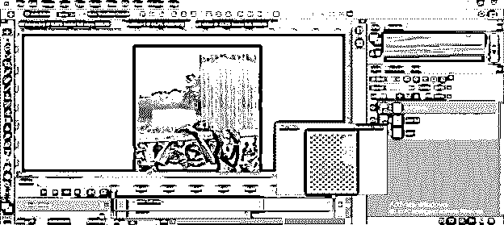

你也可以通过这个选项给你的 GIF 文件添加一个音轨。

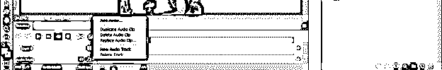

现在让我们将其保存为 GIF。转到文件菜单并点击它，然后转到导出选项。现在点击“保存为网页”选项。

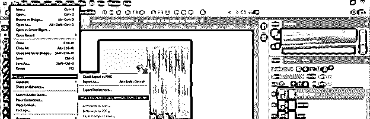

在此对话框中处理 GIF 预览需要一些时间。处理时间取决于计算机系统的 Ram 速度。所以如果你第一次尝试，如果你的电脑内存很慢，我会建议你把图片的尺寸调小一点以获得更快的结果。

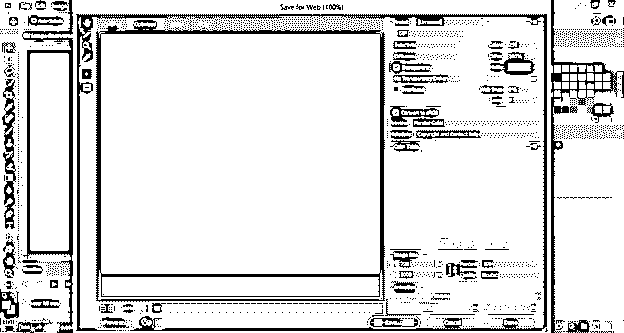

从这里设置预览大小 50%。

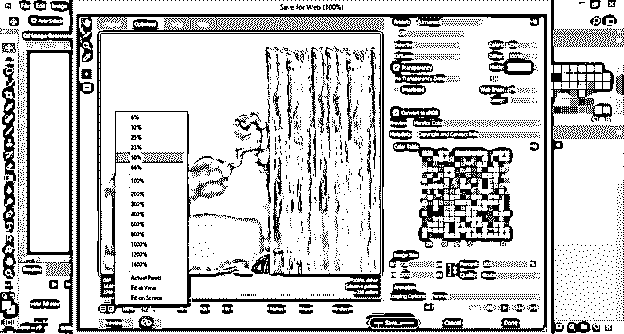

在此列表中选择 GIF 格式。

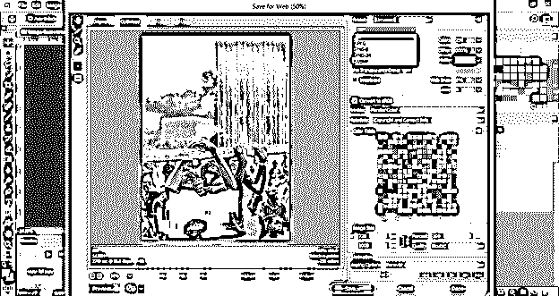

您可以从该选项中选择一个颜色范围。如果您采用颜色范围的最高值，您的图像具有良好的颜色质量，但它可能会使您的文件变大。你可以选择 64 个值，使你的 gif 文件大小超过 5mb 的图像的颜色质量有一点点的变化。

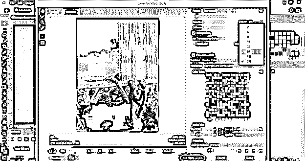

将“有损”选项的值设置为 3，这有助于 GIF 文件的压缩。

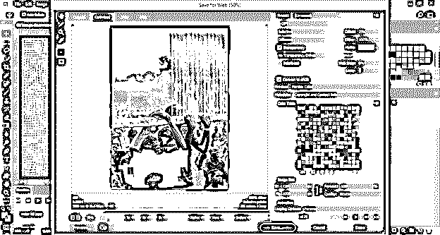

选择“循环选项”中的“永远”选项，这样一旦播放该视频，它将自动重复播放该帧以产生 GIF 效果。

您也可以在这里更改图像的大小。我会把它设置成 50%的大小。

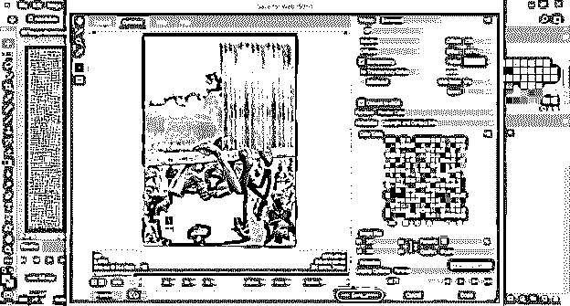

点击预览按钮，在网页上看到这个 GIF。

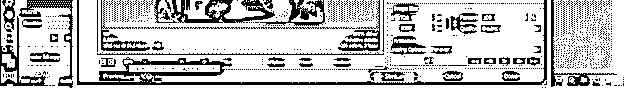

在网页上，您可以看到它的预览文件大小和其他细节。

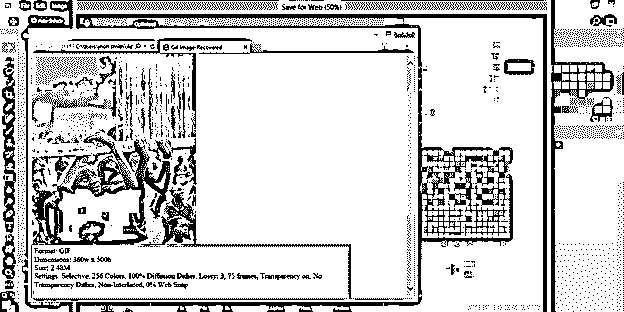

如果你没问题，点击保存按钮，选择 GIF 文件的位置和名称。

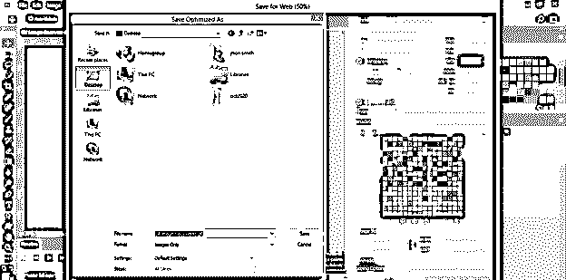

现在您可以通过播放来检查它

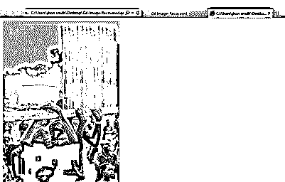

### 结论

你和我们一起学习这个话题的经历如何？我觉得非常好，现在你对 Photoshop 的 GIF 效果有了很大的了解。读完这篇文章后，我相信你可以很容易地掌握在这个软件中创建 GIF 效果的参数。

### 推荐文章

这是 Photoshop GIF 的使用指南。这里我们讨论如何在 Photoshop 中创建 GIF 效果，我们也分析了这个功能的各个方面。您也可以看看以下文章，了解更多信息–

1.  [Photoshop 中的半色调](https://www.educba.com/halftone-in-photoshop/)
2.  [Photoshop 拉直图像](https://www.educba.com/photoshop-straighten-image/)
3.  [Photoshop Cinemagraph](https://www.educba.com/photoshop-cinemagraph/)
4.  [变换工具 Photoshop](https://www.educba.com/transform-tool-photoshop/)

