# Photoshop 扩展背景

> 原文：<https://www.educba.com/photoshop-extend-background/>

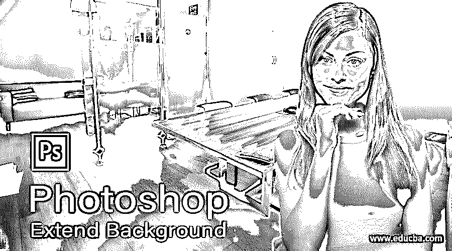

## Photoshop Extend 背景简介

Photoshop 中的扩展背景可以指该软件的一种技术，通过它，您可以扩展任何图像的背景，而不会破坏该图像主要内容的像素。所谓主要内容，我们是指作为我们主要焦点的图像的任何对象。为此，我们将使用该软件的内容感知功能，并了解该功能的主要参数是什么，通过这些参数，我们可以轻松扩展任何特定图像的背景。我们将通过一个例子，使用该软件的一些其他功能和工具来理解这个主题。所以让我们以循序渐进的方式好好讨论一下这个话题。

### 如何在 Photoshop 中扩展背景？

我们可以通过一个例子学习这个主题，只需遵循一些简单而令人兴奋的步骤，但是在开始之前，让我们看一下这个软件的工作屏幕，以便更好地理解本文中的这个主题。

<small>3D 动画、建模、仿真、游戏开发&其他</small>

在工作屏幕的顶部有一个菜单栏，有几个菜单，如文件菜单，编辑菜单，图像菜单，层菜单，和其他一些重要的菜单。在这个菜单栏下面，我们有一个这个软件或图像的活动工具的属性栏，在我们的工作过程中，我们在其上进行不同的调整。在这个属性栏下面，我们在工作屏幕上有三个部分，在左侧我们有一个工具面板，上面有工具的数量，在中心我们有一个文档区域，我们可以在其中看到我们当前的工作，在右侧我们有一些选项卡，如颜色、层和一些其他重要的选项卡。您可以根据自己的选择在工作屏幕的任何地方重新排列所有这些部分。

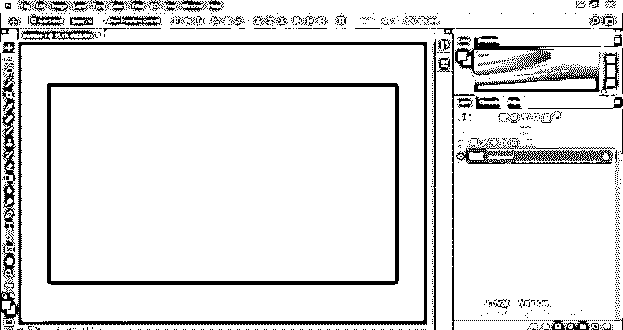

为了我们的学习，让我们在这个软件中有一个图像，我们将在不破坏它的主要内容的情况下扩展它的背景。要在本软件中放置图像，请转到您个人计算机中保存该图像的文件夹，然后从该文件夹中选择图像，并通过释放鼠标左键将其放入本软件的文档区域。为此，您可以拥有自己的图像或任何从互联网下载的图像。我将使用下载的图像。

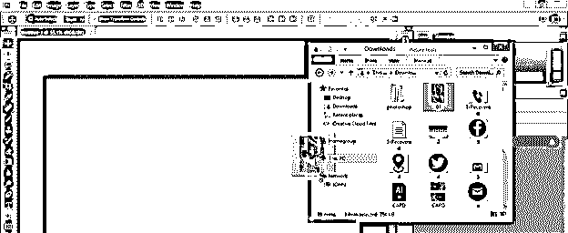

根据您的需要在文档上调整此图像的大小，并按键盘上的 enter 按钮或单击此图像属性栏上的“提交转换”按钮以应用您设置的大小。这张图片的主要内容是一个正在用手机发短信的女孩。

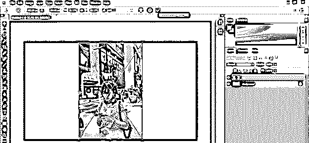

现在按下键盘的 Ctrl + T 键来变换这个图像的一个方框，并在水平方向上增加这个图像的尺寸来扩展这个图像的背景，你会注意到这个图像的女孩的像素会随着尺寸的增加而破坏。让我们通过使用该软件的内容感知功能来解决这个问题。

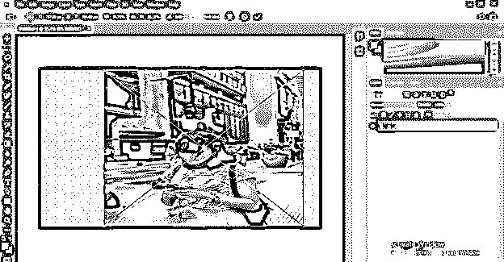

将此图层栅格化。为了使它栅格化，去图层面板，用鼠标右键点击它。将打开一个下拉列表，从列表中选择栅格化图层选项。

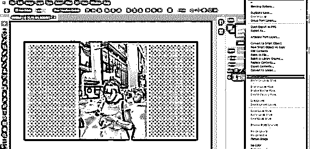

现在转到菜单栏的编辑菜单并点击它。将会打开一个下拉列表。从列表中选择内容感知选项，或者可以按 Alt + Shift + Ctrl + C 作为该选项的快捷键。

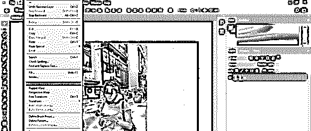

丰富的方框将围绕这个图像，就像变换方框一样。现在，您可以扩展该图像背景的大小，而不会干扰该图像主要内容的像素。

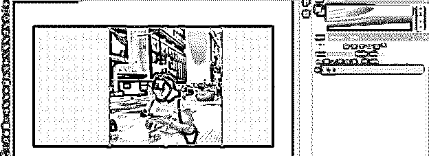

但是你会发现我们的主要内容的像素会在这个图像的背景的延伸的一些限制之后受到干扰。

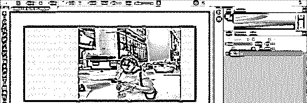

因此，为了避免这一点，让我们使用这个软件的另一种技术。从该软件的工具面板中选择任何选择工具。我将通过点击套索工具来选择这个女孩，这是我们的主要内容。您可以根据自己的选择使用任何其他选择工具进行选择。

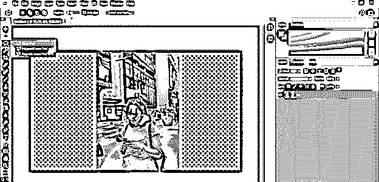

用套索工具在这个女孩周围做一个像这样的粗略选择。

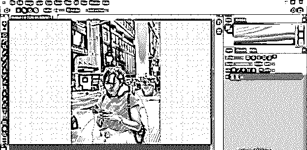

现在转到图层面板旁边的通道选项卡，点击这个选项卡底部的“保存选区为通道”按钮。您会注意到一个频道会添加到频道列表中的这个选项中。

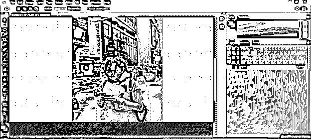

现在转到菜单栏的选择菜单，点击取消选择选项来释放这个女孩周围的选择。您可以按 Ctrl + D 按钮作为该选项的快捷键。

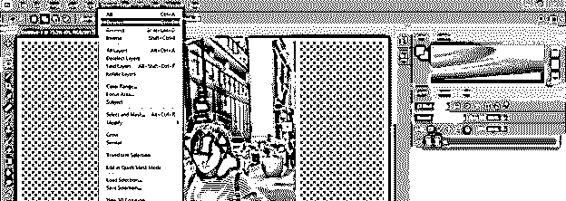

现在，再次单击编辑菜单的内容感知选项或按 Alt + Shift + Ctrl + C

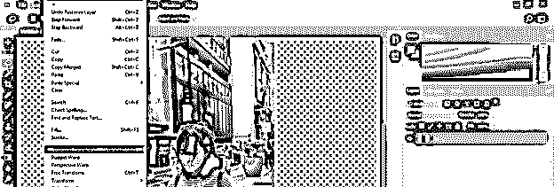

现在转到内容感知选项的属性栏，并在内容感知选项的属性的保护选项中选择 Alpha 1 选项。以便在扩展图像的背景期间，它将保护 Alpha 1 通道的选择。

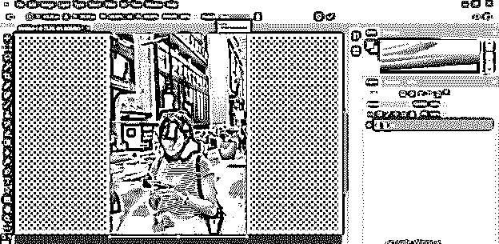

现在你可以扩展这张图片的背景，但也有一些限制，超过这个限制，你的主要内容将再次像素化。

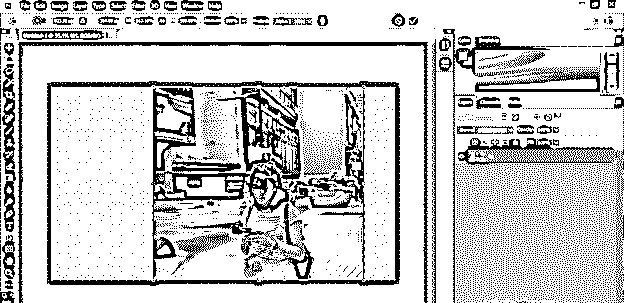

你可以通过同样的过程制作 Alpha 2 通道来避免这种情况。请确保在 Alpha 1 中扩展背景后执行此操作。

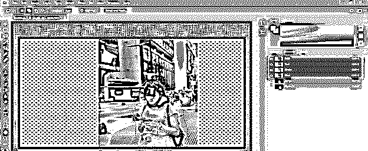

这次在保护选项中选择 Alpha 2。

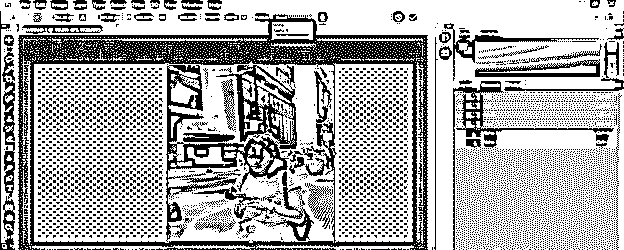

现在你可以比上一个扩展更多的背景。你可以一步一步地重复这个过程，以获得更准确的结果。

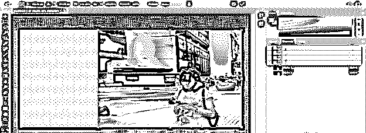

这样，您可以扩展任何图像的背景，而不会干扰图像主要内容的像素。

### 结论

现在，看完这篇文章，你可以理解 Photoshop 中的 Extend Background 是什么，以及你如何做到这一点。您还从这篇文章中了解到如何处理选项的不同参数，通过这些参数您可以在 Photoshop 中完成这项任务。通过实践，您可以很好地掌握 Photoshop 的这一功能，并将其用于您的专业工作目的。

### 推荐文章

这是一个 Photoshop 扩展背景的指南。这里我们讨论一下 Photoshop 中什么是扩展背景，如何扩展背景。您也可以看看以下文章，了解更多信息–

1.  [Photoshop 金色渐变](https://www.educba.com/photoshop-gold-gradient/)
2.  [Photoshop 中的消失点](https://www.educba.com/vanishing-point-in-photoshop/)
3.  [Photoshop 中的毛刺效果](https://www.educba.com/glitch-effect-in-photoshop/)
4.  [Photoshop Cinemagraph](https://www.educba.com/photoshop-cinemagraph/)

