# Photoshop 模板传单

> 原文：<https://www.educba.com/photoshop-template-flyer/>

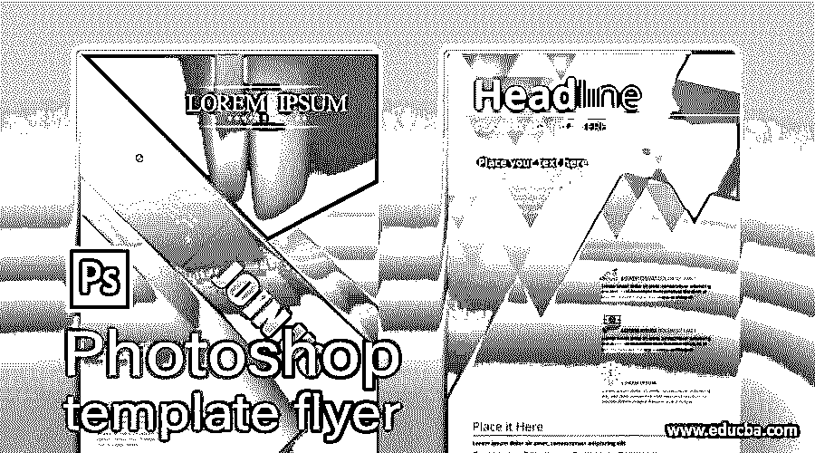

## Photoshop 模板传单介绍

传单是一种模板，它有不同类型的形状、图像、文字设计来表达任何特定公司的商业理念。传单模板没有特定的设计和图案；这完全取决于 Photoshop designThe 的理念。传单模板的标准省道尺寸是 8.5 英寸 x 11 英寸或类似于 A4 纸的尺寸。我们可以通过使用不同类型的形状工具、颜色调整层、不同的图像等来创建传单模板。我们将讨论如何以非常简单的学习方式处理这些特性的所有参数的所有术语。因此，请继续阅读本文，深入了解这个主题。

### 如何在 Photoshop 中制作模板宣传单？

我们可以在这个软件中创建一个模板传单，方法是使用一个基本的形状工具和这个软件中这些形状和图像的颜色校正属性。但是你知道在开始这个话题之前，你必须对这个软件的用户界面的不同部分有一个概念吗？那么我们就开始讨论 Photoshop 软件的用户屏幕吧。

<small>3D 动画、建模、仿真、游戏开发&其他</small>

在这个软件的顶部，我们会发现菜单栏，它有几个菜单。当您从顶部向下移动时，您会发现第二个栏，它是活动工具或活动图像的属性栏。在这下面，你会有三个部分，你会发现一个工具面板在左侧，显示窗口的文件，你会有层面板，颜色面板，和其他一些标签在右侧。如果您不满意用户屏幕各部分的排列，您可以创建自己的用户屏幕。

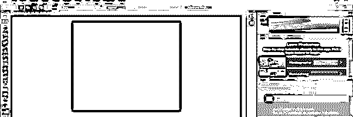

现在让我们有一个 8.5 英寸 X 11 英寸的文档。因此，要获得这份文件，你可以点击 Photoshop 软件欢迎屏幕上的“新建”按钮。

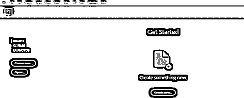

现在输入传单模板的尺寸值，选择白色作为背景层颜色，然后点击打开的对话框中的创建按钮。

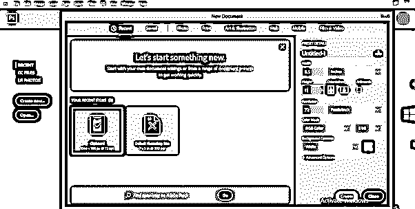

现在，通过点击矩形工具的图标或按键盘的 U 键作为该工具的快捷键，从该软件的工具面板中选择一个矩形工具。

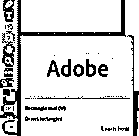

像这样做一个你想要的大小的正方形。

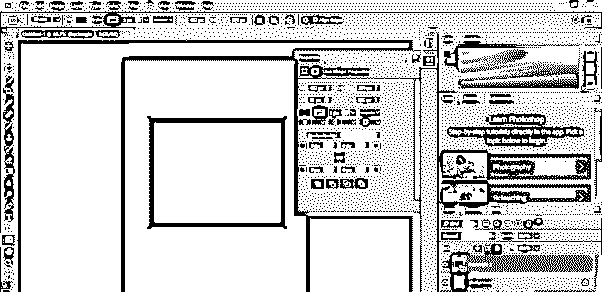

现在，按下键盘上的 Ctrl + T 按钮来变换该形状的结合框，并通过按住键盘上的 shift 按钮将其旋转 45 度。

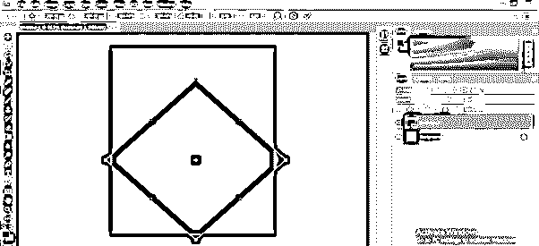

现在设置在这个地方，根据背景图层进行调整。

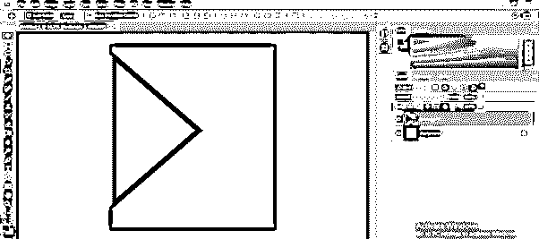

进入图层面板，双击这个正方形图层的缩略图，根据你的选择选择这个形状的颜色。我将从颜色选择框中选择这种颜色，然后点击“确定”按钮。

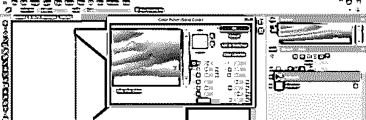

现在，再次使用矩形工具制作这种类型的矩形。

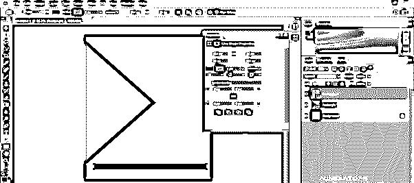

去图层面板，双击这个矩形图层的缩略图。从颜色选择器框中选择所需的颜色。我会选择这种颜色。

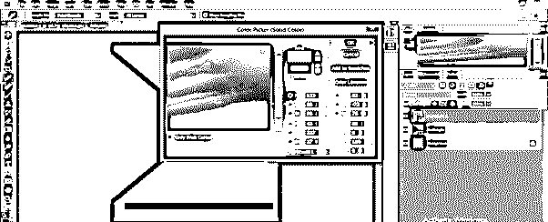

像这样把这个矩形倾斜 45 度。

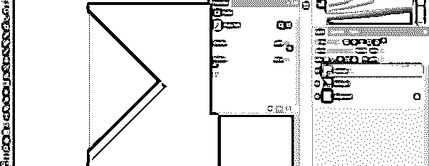

按键盘上的 Ctrl + R 键激活标尺工具，然后在文档中心拖动一条基准线。

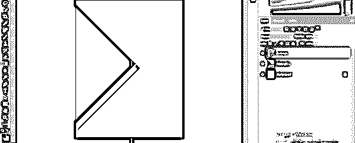

根据指南调整方形。

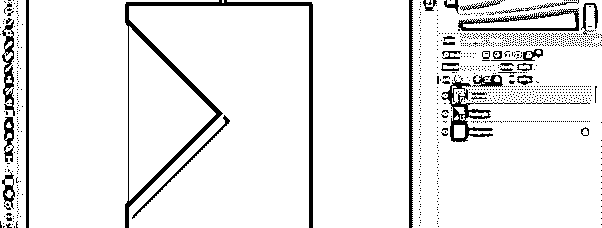

现在选择这个矩形的图层，按下键盘的 Ctrl + J 键复制这个图层，然后将复制的图层移动到这个图层下面一点。

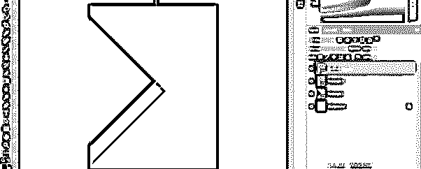

现在进入这个软件的图层面板，选择这两个矩形图层，然后按下键盘上的 Ctrl + J 键来复制它们。

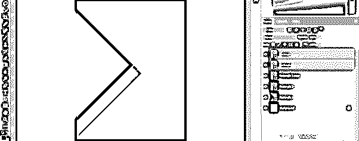

将这两个复制的图层移动到文档区域的顶部并旋转，然后使用该软件的转换绑定框和移动工具将它们放置在这里。

现在，再次从工具面板中选择一个矩形工具，制作这种类型的正方形。

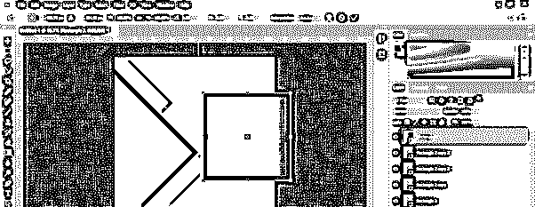

从键盘上按下 Ctrl+ T 按钮来变换该正方形的结合框，并通过按住键盘的 shift 键将其旋转 45 度。

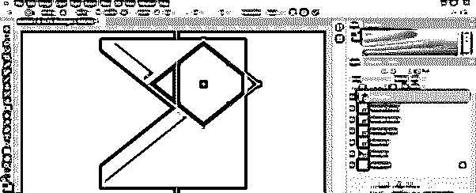

再次，到图层面板，选择这个新的正方形的图层，然后在变换绑定框的键盘上按 Ctrl + T 键。现在缩小这个正方形的尺寸。

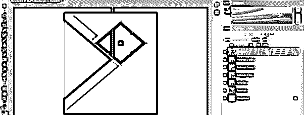

像这样调整它。

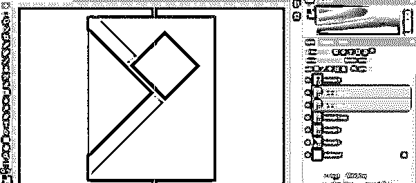

在这个软件中放置一个图像，向你展示你的商业主题的目的。要在该软件中放置图像，请打开保存该图像的文件夹，并将其拖动到作品的文档区域。

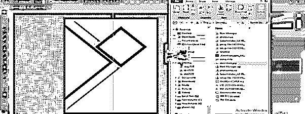

将这个图像层放在正方形图层的上面。现在右击图像层。将打开一个下拉列表，从该列表中选择创建剪切蒙版层选项。

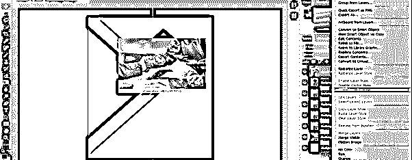

现在调整这个图像，根据你想通过这个正方形显示的图像区域，使用移动工具和变换绑定框。我这样调整。

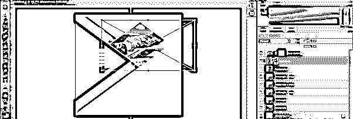

现在选择图像层，并前往调整层按钮，然后点击它。从列表中选择曲线选项。

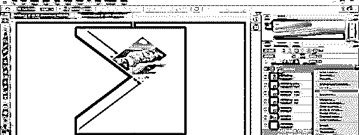

在曲线框中选择蓝色，并调整图像的蓝色调百分比。

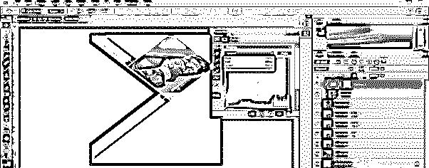

在曲线框中选择红色，并调整图像的红色百分比。

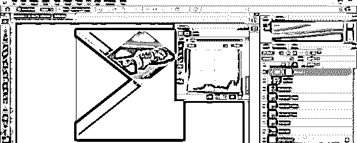

用矩形工具画一个像这样的矩形，选择这个颜色。

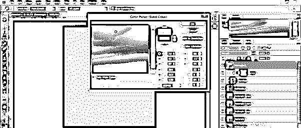

将这一层放在所有层的底部。

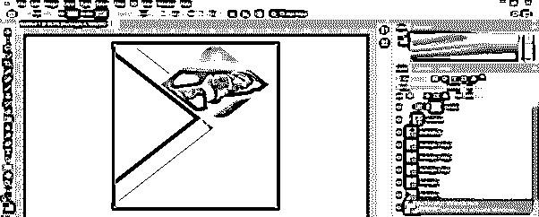

现在从工具面板中选择文字工具，在这里输入一段文字。为文本层选择白色。像这样做标题。

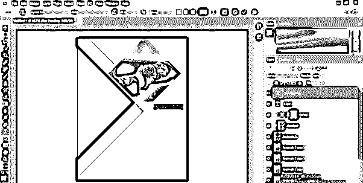

同样，使用文本工具，创建一个这样的段落，在这里输入你的文本，然后从颜色选择器框中选择颜色。

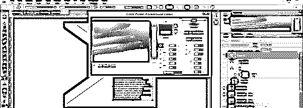

你可以根据你的客户给出的问题来调整文字。

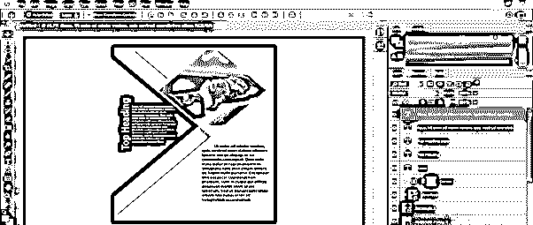

现在去自定义形状工具，选择任何自定义形状。

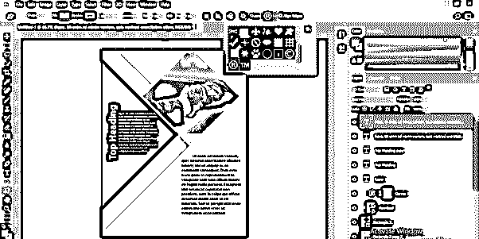

把这个自定义形状放在这里，就可以把公司的 logo 放在这里。

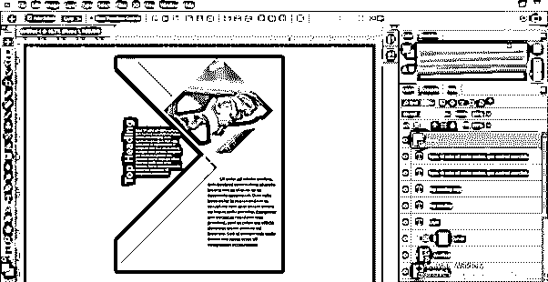

这是创建传单模板的概述。

### 结论

我相信通过阅读这篇文章；你可以非常容易地理解传单和传单设计。你应该用你自己的想法来制作一个传单模板，当你在上面练习的时候，你一定会了解到这个软件的所有重要特性。

### 推荐文章

这是 Photoshop 模板传单的指南。在这里，我们讨论如何在 Photoshop 中创建一个模板传单，并且，你可以很容易地理解传单和传单设计。您也可以看看以下文章，了解更多信息–

1.  [Photoshop 中的木偶扭曲](https://www.educba.com/puppet-warp-in-photoshop/)
2.  [VHS 特效 Photoshop](https://www.educba.com/vhs-effect-photoshop/)
3.  [变换工具 Photoshop](https://www.educba.com/transform-tool-photoshop/)
4.  [Photoshop Cinemagraph](https://www.educba.com/photoshop-cinemagraph/)

