# Photoshop 内容感知填充

> 原文：<https://www.educba.com/photoshop-content-aware-fill/>

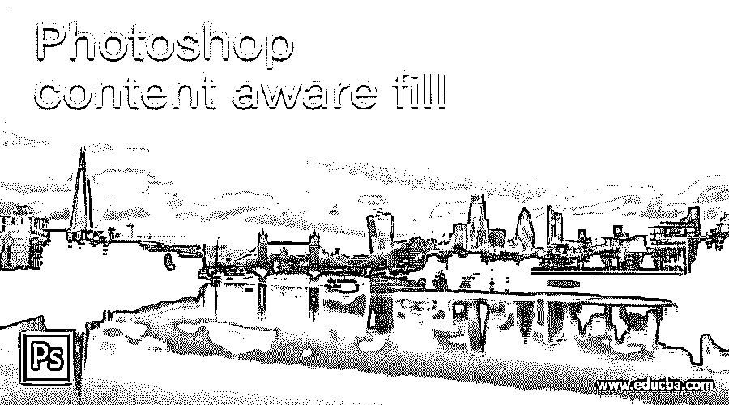

## Photoshop 内容感知填充简介

内容感知通过其名称清楚地表明了它的目的:自动理解任何东西，这里内容感知填充代表通过粘贴图像的其他类似区域来填充采样区域(我们希望通过选择它来从图像中移除的区域)本身。简单地说，您可以使用 Photoshop 的这一功能从图像中删除任何对象，并自动克隆一个类似的区域来代替被删除的对象。在本文中，我们将了解 Photoshop 的内容感知填充功能的所有重要方面，并分析我们可以通过哪些参数来控制该功能。

### 如何在 Photoshop 中使用内容感知填充？

内容感知填充就像魔术一样，通过它你可以从你的图像中移除任何对象，那么你准备好在你的作品中施展这个魔法了吗？.我相信你正在等待，所以让我们开始吧。

<small>3D 动画、建模、仿真、游戏开发&其他</small>

为了了解内容感知填充，我们需要一个图像，所以要在 Photoshop 中打开一个图像，请转到菜单栏的文件菜单，然后单击它。单击后，将打开一个下拉列表，单击该列表的打开选项。

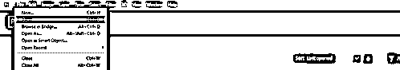

在打开的对话框中找到您想要的文件夹，点击您想要的图像进行选择，然后点击此对话框的打开按钮。

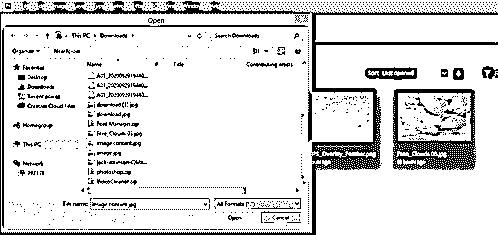

现在制作导入图像的副本。要制作副本，选择图像的背景层，然后按键盘上的 Ctrl + J 键。我们正在复制这一层，因为内容感知是一个破坏性的过程。

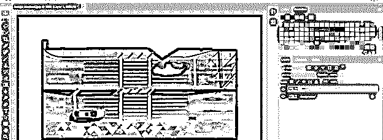

现在选择你想从图像中移除的物体。您可以使用工具面板中的任何选择工具来选择它。我将使用矩形选框工具在红色汽车周围进行选择。

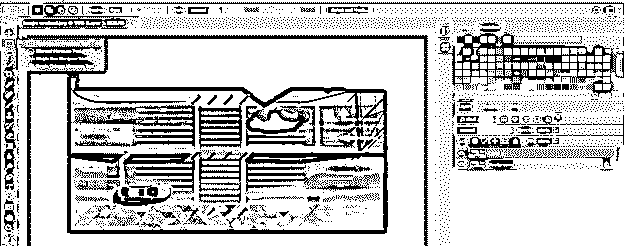

像这样做一个选择。

现在转到菜单栏的编辑菜单并点击它。将打开一个下拉列表，从该列表中选择填充选项或按。您也可以按 Shift + backspace 按钮进行内容感知填充。

填充对话框将会打开。从内容列表中选择一个内容感知选项。

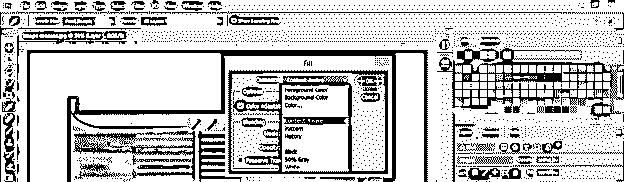

您还可以从该混合模式列表中选择粘贴区域的模式(Photoshop 会自动粘贴该区域来替换移除的对象)。

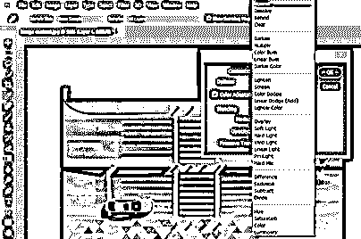

在颜色适应选项的方框中勾选“开”,以便内容感知在此过程中正确匹配颜色。现在点击这个对话框的 Ok 按钮。

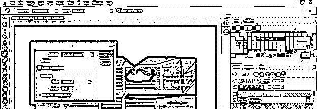

你可以看到 Photoshop 本身粘贴了这个图像的一些区域来代替红色的汽车，但是它没有粘贴准确的区域。那我们现在要做什么？不用担心；对此我们也有解决方案。

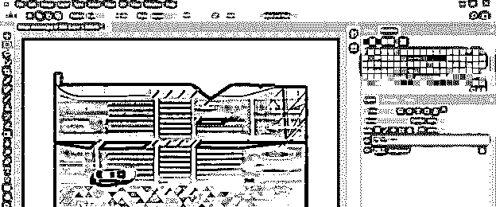

我们必须将这条分隔带从道路的黄色带状线上移除。

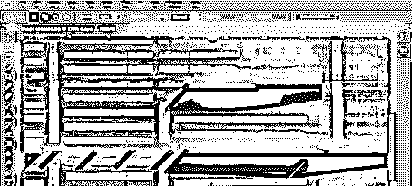

现在使用矩形选框工具，像这样在它周围做一个选择。

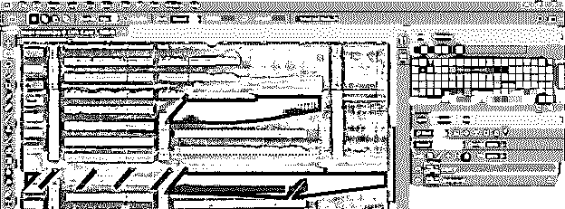

按下键盘上的 Ctrl + J 按钮，复制所选区域。

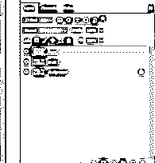

像这样向上移动它，并从图层面板的调整图层按钮中用这个复制的图层添加一个蒙版图层。

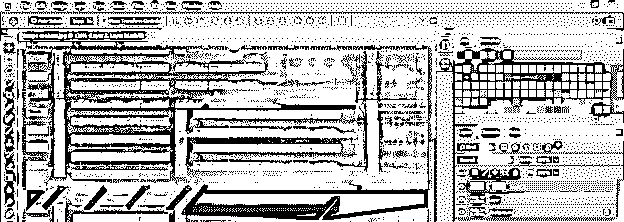

从工具面板中选择画笔工具，在颜色面板框的前景色中选择黑色。现在删除复制和移动层周围的锐利边缘。

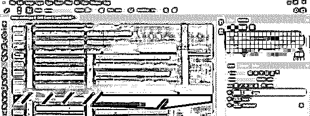

复制图层的多个副本，覆盖所有区域，就像这样。

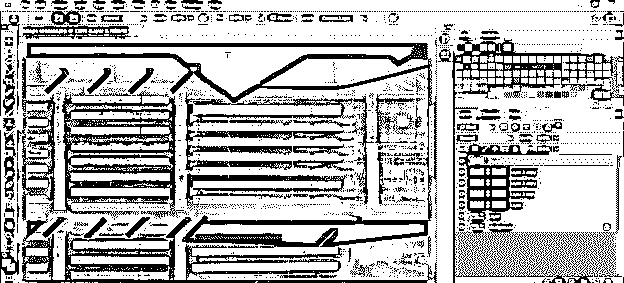

这样，你可以从你的图像中准确地删除任何对象。

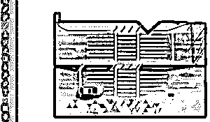

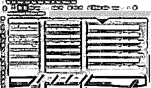

我们可以再做一件事，以便 Photoshop 的内容感知填充功能可以正确选择应该选择哪个区域粘贴到已删除的对象。

选项是，在您想要建议 Photoshop 的区域周围制作一个蒙版，将粘贴区域的区域视为已移除对象的位置。选择图层 1，选择制作蒙版的区域，然后点击图层面板的添加图层蒙版按钮。我使用了矩形选框工具进行选择，并点击了添加图层蒙版按钮。

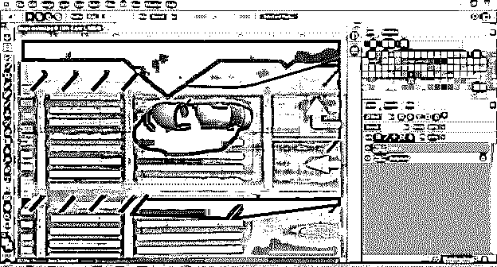

现在 Photoshop 被绑定，用于从这个蒙版图层中选择粘贴区域。现在点击图层 1 的图层缩略图。

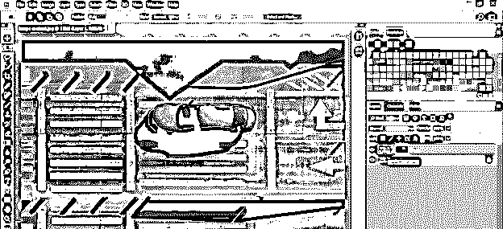

围绕要从图像中移除的对象进行选择。我将使用矩形选框工具在这辆红色汽车周围进行选择。

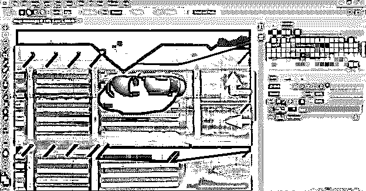

按 shift + Backspace 作为内容感知填充框的快捷键。根据您的需要设置该对话框的参数，并点击该对话框的确定按钮。

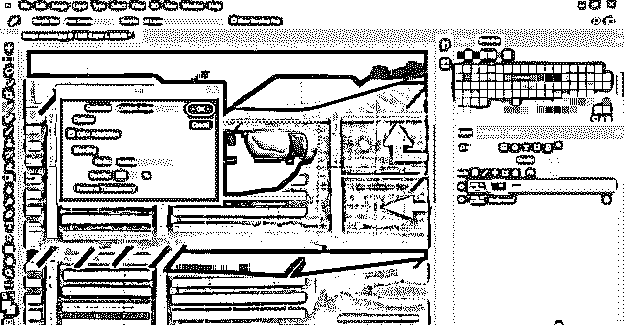

奇迹发生了。你可以看到它只粘贴了蒙版区域的红色汽车，这是我们删除的对象。

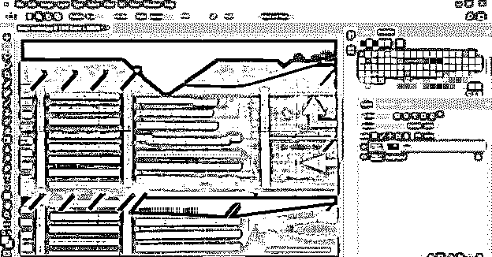

让我们使用克隆图章工具来管理粘贴内容中不需要的区域。转到这个软件的工具面板，并采取克隆印章工具。

在克隆工具中对黄色区域进行采样后，按住 shift 键选择直黄线，使用克隆工具填充黄线。

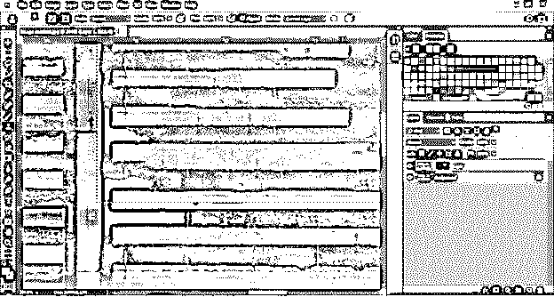

在克隆工具中对道路的黑色区域进行采样，并用克隆工具从黄色区域中移除多余的黄色部分，你可以看到我们做得很好。

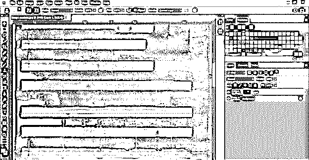

对所有没有管理的黄条做同样的操作，你已经很好地把红色的车从你的图像中去掉了。

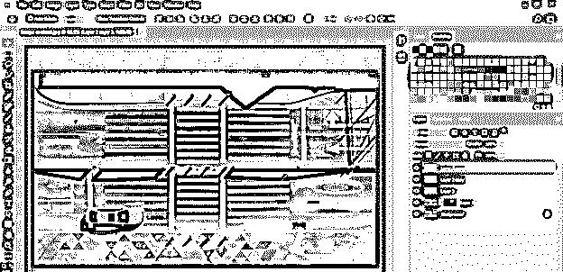

现在让我们看看图像上内容感知功能的魔力，它在您想要移除的对象周围没有复杂的颜色内容。

我想把这个女孩从这张图片中移除，所以我在工具面板的套索工具的帮助下在它周围做了一个选区。始终记住在使用内容感知期间不要做出精确的选择；进行粗略选择，以便它可以很容易地粘贴区域来代替被删除的对象。

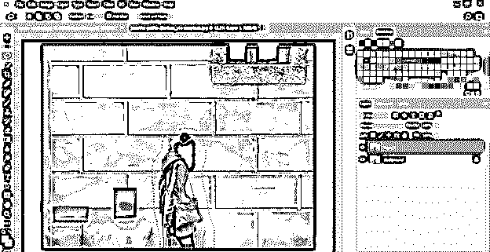

现在在内容感知框中进行设置，然后点击 Ok 按钮。

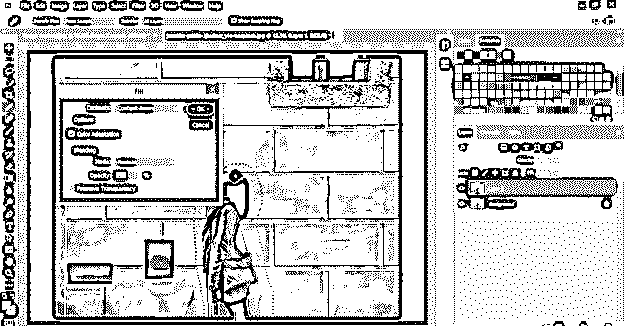

看它把物体恰当地移走了，没有留下任何痕迹。

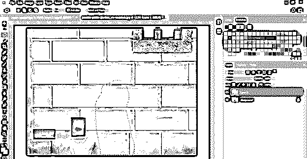

内容感知的准确性取决于图像和要移除的对象的复杂程度。

### 结论

我认为现在内容感知填充对你来说不再是什么新鲜事了，你可以很容易地管理它的参数，在你的项目中使用它来移除任何对象。将此功能添加到您的专业工作中后，您可以更好地掌握您的工作技能。

### 推荐文章

这是一个指南，以照片内容意识是填补。在这里，我们讨论如何使用 Photoshop 中的内容感知填充，并分析我们可以通过哪些参数来控制这个功能。您也可以阅读以下文章，了解更多信息——

1.  [Photoshop 中的夜间效果](https://www.educba.com/night-effect-in-photoshop/)
2.  [Photoshop 中的鱼眼效果](https://www.educba.com/fisheye-effect-in-photoshop/)
3.  [Photoshop 中的毛刺效果](https://www.educba.com/glitch-effect-in-photoshop/)
4.  [Photoshop 中的模板](https://www.educba.com/templates-in-photoshop/)

