# Photoshop 叠加

> 原文：<https://www.educba.com/photoshop-overlays/>

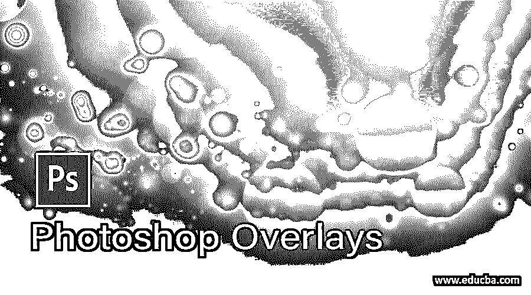

## Photoshop 叠加介绍

叠加只是简单的图像，作为原始照片或图像的附加层，用于在这些简单的照片上添加不同的模式效果，使它们有效。互联网上有几个覆盖图，上面有很多主题集合，你可以自由地用于个人用途。你还会发现一些付费的叠加，所以根据你的选择，你可以和任何人一起去。在今天的这篇文章中，我们将分析如何在我们的照片中使用这些叠加层，使其看起来更自然。你对学习 Photoshop 的这个功能感到兴奋吗？所以不浪费你的时间，让我们开始吧。在这个主题中，我们将学习 Photoshop 叠加。

### 如何在 Photoshop 中创建和使用叠加？

我们可以通过使用 Photoshop 的不同工具来创建它，但为了便于学习，我从网上下载了一些不同主题的叠加图，但在浏览我们的主题之前，你应该对该软件的用户屏幕有所了解，这样你就可以快速地与本文联系起来。

<small>3D 动画、建模、仿真、游戏开发&其他</small>

在工作屏幕的顶部，你会看到一个菜单栏，有文件菜单、编辑菜单、图层菜单等等。在这个菜单栏下面，我们有一个活动工具或活动图像的属性栏，用于对它们的参数进行不同的更改。在这个属性栏下面，我们在左侧有一个工具栏，在这个部分的中心显示窗口；在右侧，我们有一些其他重要的标签，如颜色标签，样本，和其他一些。您可以根据自己的选择将所有这些部分排列在用户屏幕的任何位置。

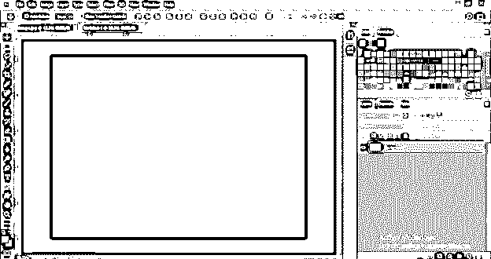

我下载了一张云覆盖图。要下载它，在 google.com 上搜索“Photoshop 的覆盖图”,如果你想要一个好的覆盖图收藏，可以找到任何网站。我去这个网站。

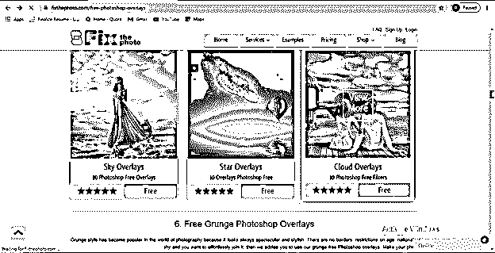

你也可以选择付费叠加收藏。

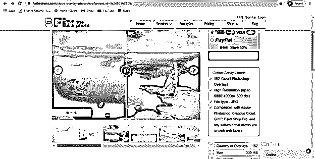

现在让我们先打开照片，我们将使用叠加图像。所以点击 Photoshop 欢迎界面的打开按钮。

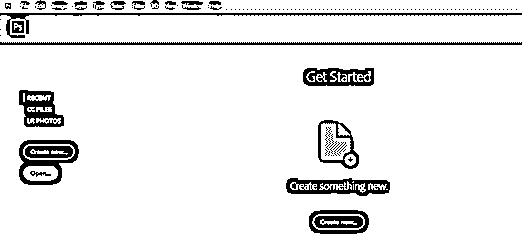

单击后，此对话框将会打开。在您的个人电脑中打开保存照片的所需位置，然后选择它。您可以使用您的个人照片或任何来自互联网的照片进行学习；选择你想要的照片后，点击这个对话框的打开按钮。

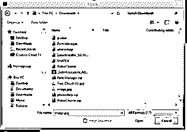

该图像将作为背景层图像打开，双击该层将其转换为普通层。现在将打开一个对话框；根据你的选择给它起一个名字，然后点击 Ok 按钮。

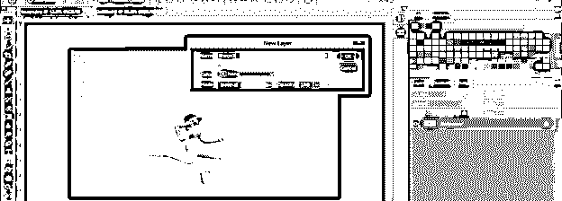

现在，这是一个可编辑的图像。我们现在将打开叠加图像。所以去菜单栏的文件菜单，点击它。从下拉列表中选择打开选项，或者按键盘上的 Ctrl + O 按钮作为快捷键。

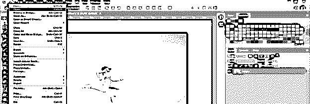

转到打开对话框中覆盖图像的保存位置并选择它，然后点击此对话框的打开按钮。

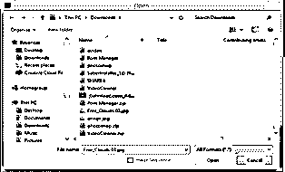

我们这里有一张多云的天空覆盖图，就像这样。一旦你对 Photoshop 的这个功能有了很好的了解，你可以根据自己的选择制作任何其他的叠加图像。

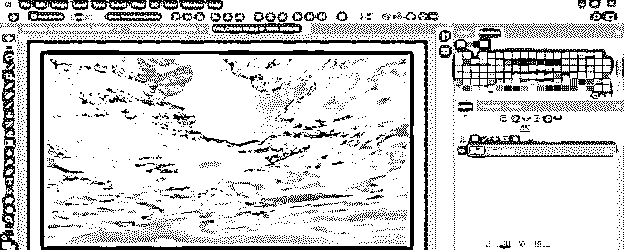

通过双击背景层，并将其拖动到照片窗口标签，我们的主要工作标签，将这一层转换为正常层。

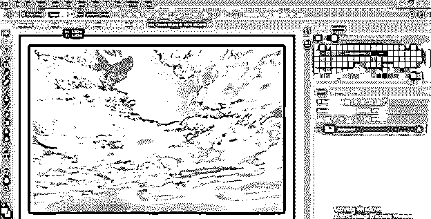

使用此图像的变换结合框调整此云覆盖图像的大小。以这种方式增加它的大小，以便它将覆盖整个照片，然后按键盘上的 Enter 按钮。

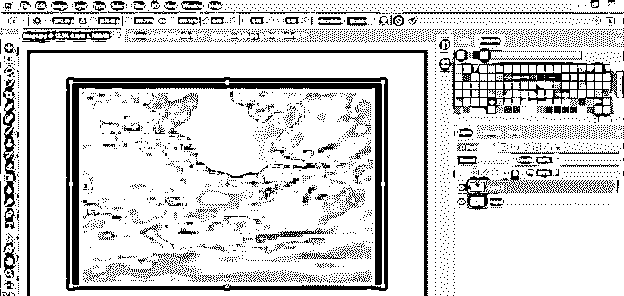

现在点击这一层的模式选项，并确保叠加云层被选中。从下拉列表中选择颜色加深选项，你的照片将与云图融合在一起。您可以根据适合您的图像和您想要的效果类型，从列表中选择任何模式选项。

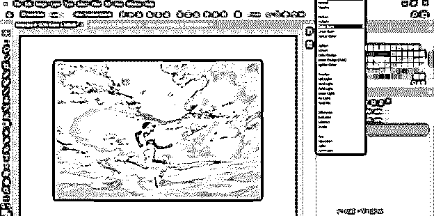

现在，我想增加这个图像的亮度一点点，所以去调整层按钮，这是在层面板的底部。从列表中选择亮度/对比度选项。

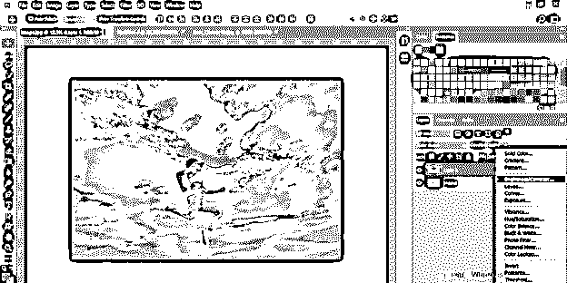

增加亮度值一点点，降低对比度值一点点，给你的照片真实的效果。你可以根据你来调节你照片的亮度。

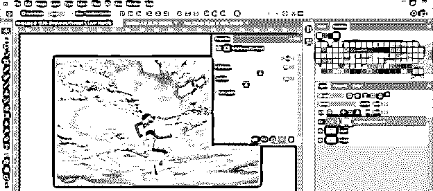

现在让我给你看一个透明的叠加图像。我也是从网上下载的。这是一个羽毛覆盖，它有一个透明的背景。

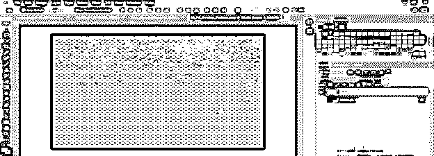

你可以在黑色背景上看得很清楚。

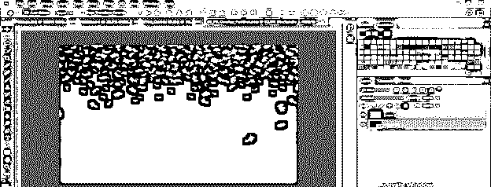

拖动这个羽毛覆盖到主照片标签，并根据你调整大小。我将通过使用此图像的转换绑定框来调整它。

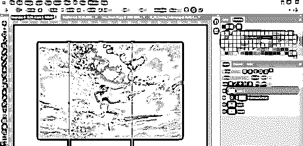

我会像这样旋转一点，并增加它的大小。

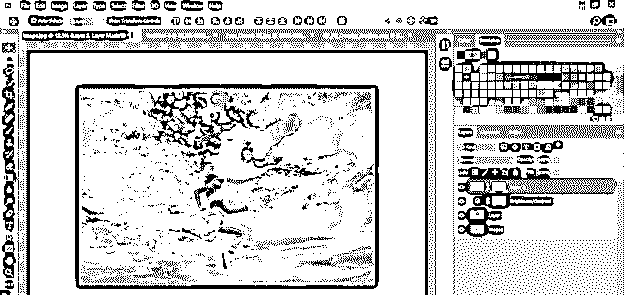

现在添加一个图层蒙版，点击图层面板底部调整图层的添加蒙版按钮。

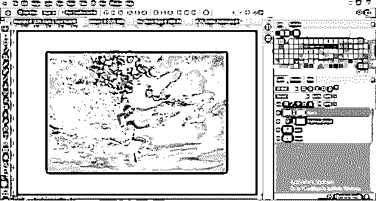

现在转到这个软件的工具面板，拿一个笔刷工具，在颜色面板框中选择黑色作为前景色。点击蒙版缩略图，用笔刷工具从叠加图像中移除不需要的羽毛。

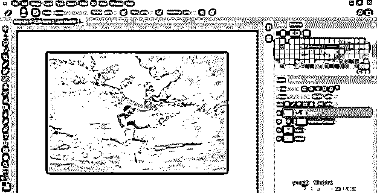

现在选择这个羽毛覆盖图像，并进入模式选项。从列表中选择“变亮模式”选项以增强羽化图像效果。

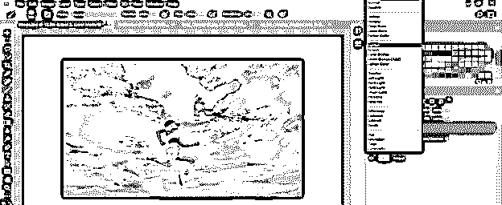

现在，让我们再次采取镜头眩光覆盖黑色背景，以便我们可以添加一个灯光效果的照片。

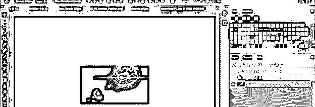

将此覆盖图像拖到主照片选项卡，并根据您想要设置的方向翻转它。

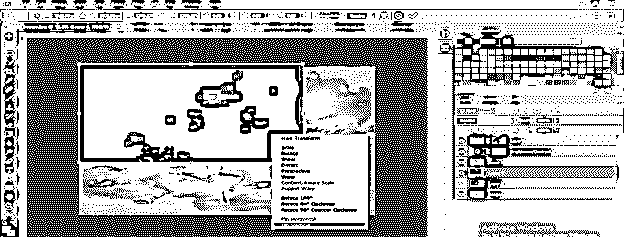

现在选择这个镜头眩光覆盖图像层，并改变其模式选项为屏幕模式。

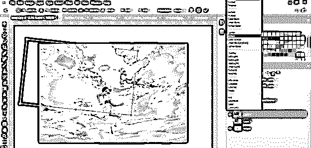

把这个镜头光圈设在这个女孩的头顶。

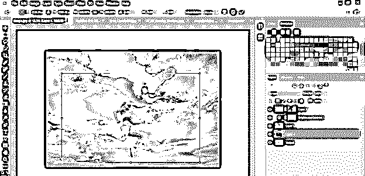

这是我们用不同的图像叠加编辑的最终照片。

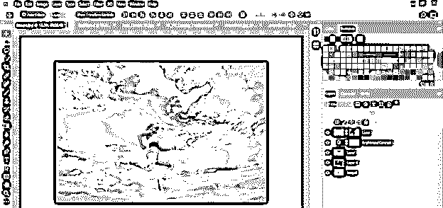

你可以看到两个图像之间的差异。

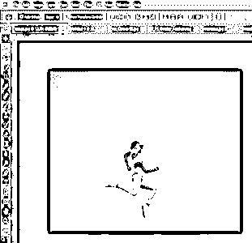

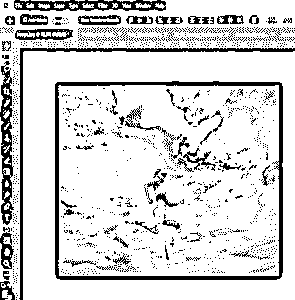

### 结论

你对 Photoshop 的叠加功能了解多少？我想你在通过这篇文章了解这个话题的过程中会发现很大的乐趣。现在你应该去互联网上搜索更多的叠加图像，并在你的照片上使用它们，给你的照片一个不同的外观。我相信通过更多的练习，你一定会很好的掌握这个特性。

### 推荐文章

这是一个 Photoshop 叠加指南。在这里，我们讨论了解叠加功能以及如何在 Photoshop 中创建和使用叠加。您也可以看看以下文章，了解更多信息–

1.  [Photoshop 中的模板](https://www.educba.com/templates-in-photoshop/)
2.  [变换工具 Photoshop](https://www.educba.com/transform-tool-photoshop/)
3.  [Photoshop 中的毛刺效果](https://www.educba.com/glitch-effect-in-photoshop/)
4.  [Photoshop Cinemagraph](https://www.educba.com/photoshop-cinemagraph/)

