# Photoshop 插图

> 原文：<https://www.educba.com/photoshop-vignette/>

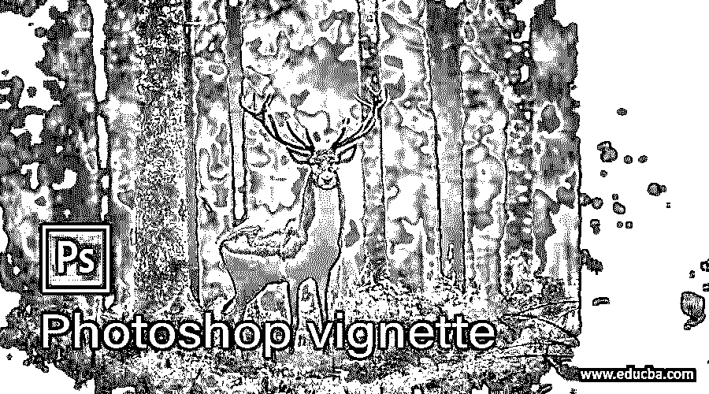

## Photoshop 插图简介

在这篇文章中，我们将学习如何在 photoshop 中创建一个小插图。小插图主要有两个目的。第一是将观众的注意力从边缘转移到主体上。另一个用途是从背景中分离或区分图像。实际上，晕影是相机镜头的限制或意外的副作用。晕影的数量取决于相机的光圈和焦距。在这篇文章中，我们将转换一个完美的图像，给它一个在 photoshop 中的晕影艺术效果。

### Photoshop 插图的步骤

下面是下面提到的步骤

<small>3D 动画、建模、仿真、游戏开发&其他</small>

#### 第一步

让我们从在 photoshop 中从文件菜单打开一个图像或者在应用程序中拖动它开始。你可以从任何库存照片网站下载一张图片来应用这个小插曲，或者你也可以抓拍自己的照片，因为它与现实生活中的照片非常匹配。

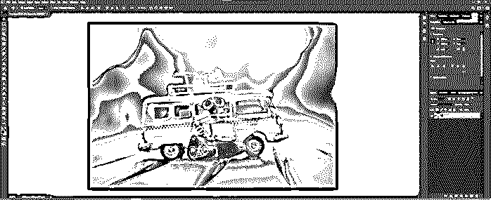

#### 第二步

向“图层”面板添加纯色。

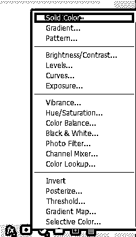

#### 第三步

选择颜色，设置为黑色，选择整个层使用 ctrl + a

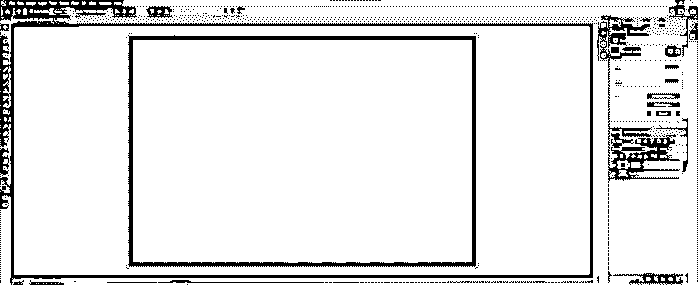

#### 第四步

现在，我们必须选择合同，要做到这一点，去修改->合同

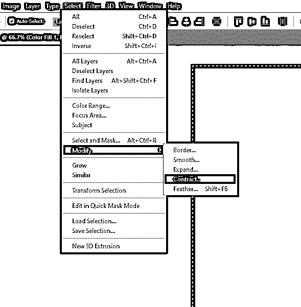

#### 第五步

在合同选择面板中，将其设置为 150 像素，因为图像是 1920 像素乘 1280 像素，并检查画布边界处的应用效果。

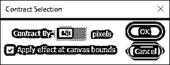

#### 第六步

正如你所看到的，选区从边缘缩小了 150 像素。

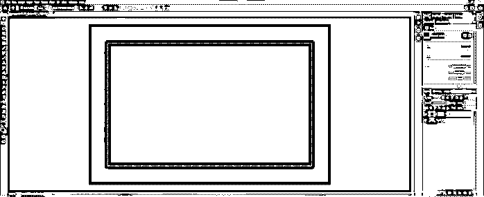

#### 第七步

通过按 Delete 键删除选择。

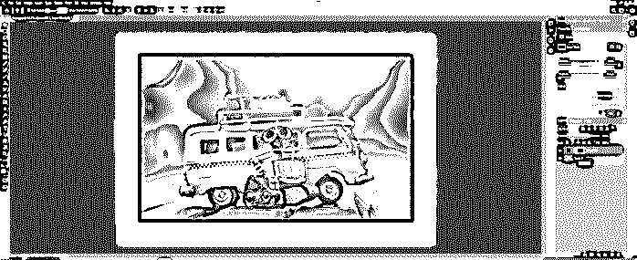

#### 第八步

现在改变羽化值得到渐晕效果。我们已经将该值设置为等于合同值，即 150px，对于这个映像来说，它工作得很好。

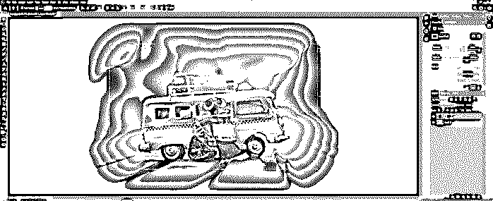

#### 第九步

如果你觉得效果太强烈，那就降低图层蒙版的不透明度。在我们的例子中，我们将其设置为 80%

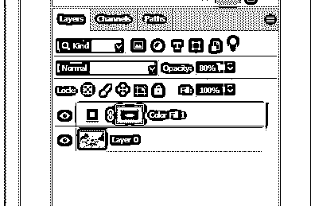

#### 步骤 10

双击黑色，现在我们可以改变晕影效果的颜色，因为我们可以看到现在它是蓝色的。

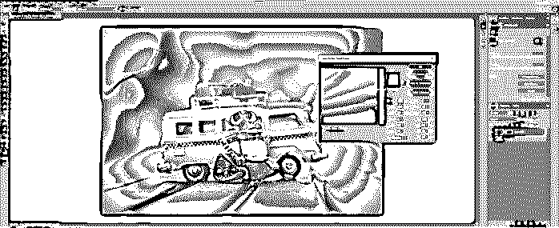

#### 步骤 11

另一种改变渐晕颜色的方法是使用颜色拾取器直接从图像中拾取渐晕，如图所示。

#### 第 12 步

在选择色调或颜色后，如果你想使它变亮或变暗，那么点击 B，这是亮度并拖动滑块使颜色变亮或变暗。

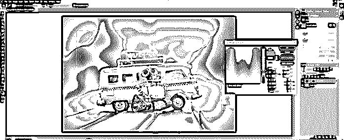

#### 步骤 13

为了创造更艺术的效果，我们接下来可以做的是改变混合模式。将混合模式设置为 divide 会给我们带来不同的效果，如图所示。

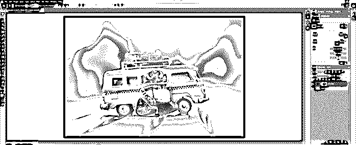

#### 第 14 步

通过设置混合模式为叠加，我们得到了这个效果。因此，正如你所看到的，我们可以通过添加小插图来彻底改变我们的构图。

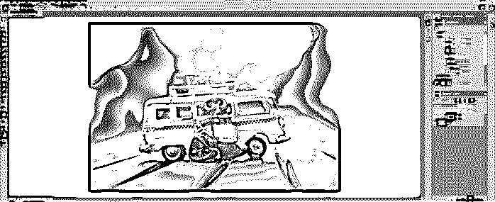

#### 第 15 步

到目前为止，我们已经看到了如何通过使用小插图来赋予一些艺术天赋；现在，我们将看看为什么我们应该使用这个效应的实际应用。为此，让我们分析下图。由于图像有黑色背景，所以看起来不错。

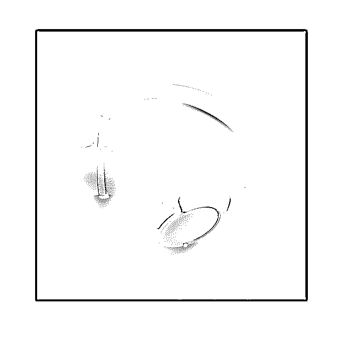

#### 步骤 16

如果背景换成白色，那么对产品或主体的关注就很少了。如果你把它作为产品图片放在网站上，这将是有害的。如果网站的背景是白色的，那么这个产品看起来会很苍白。同样，如果图片是黑色的，网站背景也是黑色的，那么产品就不会被聚焦。所以，这是这个效应的一个实际应用。

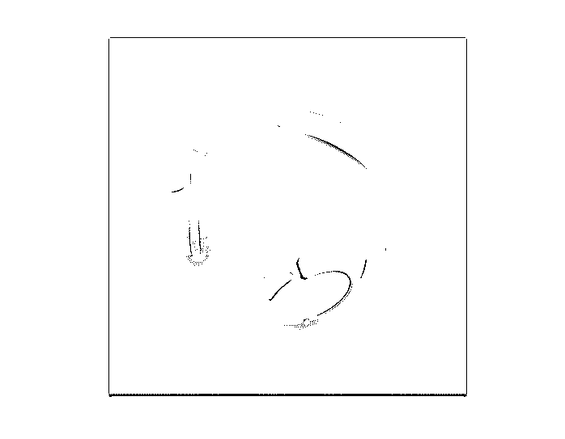

#### 第 17 步

我们已经创建了一个纯色层使用相同的过程，如前所述，然后选择所有和合同的选择。然后删除它，应用羽化；我们得到了如图所示的效果。我们可以在黑色背景上看到这个。

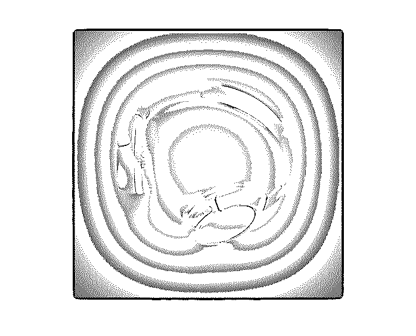

#### 步骤 18

现在让我们在浅色背景上看到同样的图像，像变魔术一样，焦点仍然在产品上。

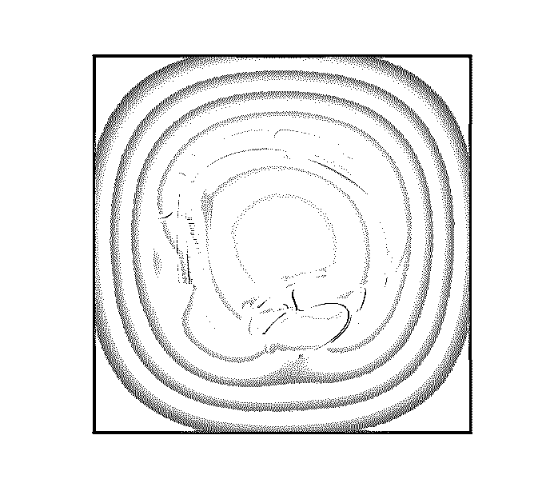

#### 步骤 19

创建这种效果的另一种方法是使用椭圆工具。如图所示，绘制一个椭圆。

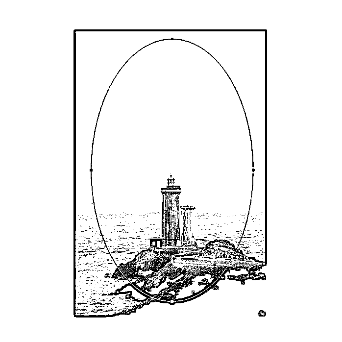

#### 第 20 步

设置填充为黑色，描边为无。

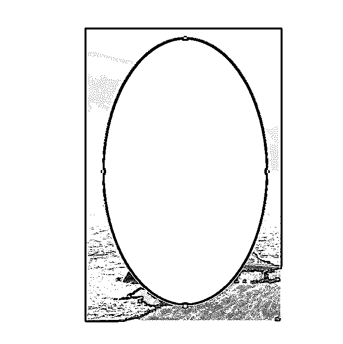

#### 步骤 21

然后使用路径操作减去前面的形状。

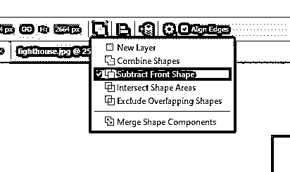

#### 第 22 步

这将创建以下形状。

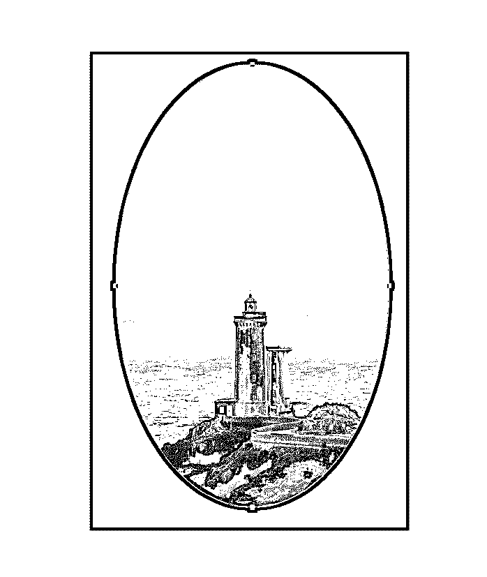

#### 步骤 23

如图所示设置羽化。

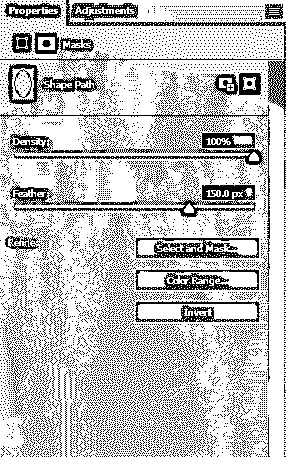

#### 第 24 步

这会产生这种效果。

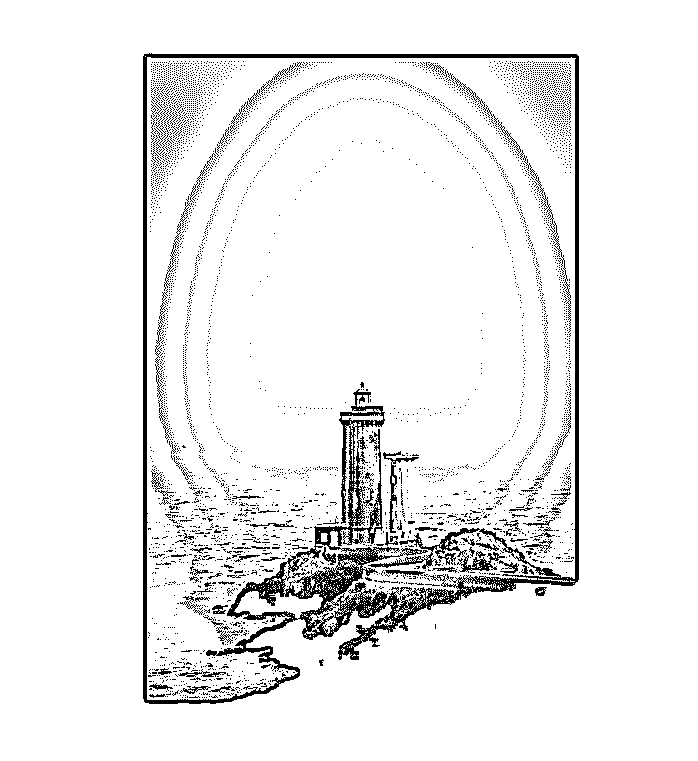

#### 第 25 步

另一种方法是创建一个空层

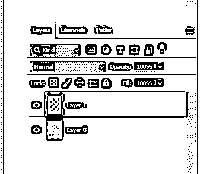

#### 第 26 步

通过按 alt + backspace 填充它会变成黑色

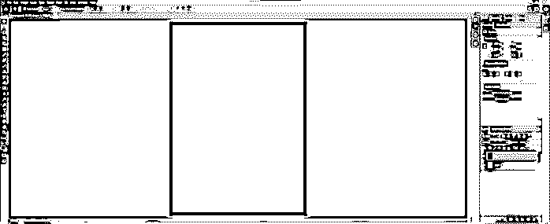

#### 第 27 步

将填充设置为 0

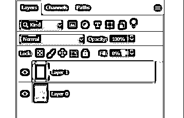

#### 步骤 28

然后右键单击图层，混合选项，勾选内发光，设置颜色为黑色而不是白色。

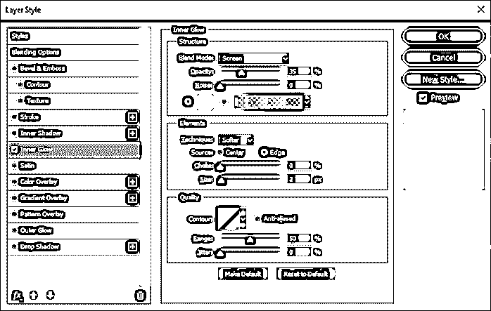

#### 步骤 29

然后改变楔子和大小，得到如下效果。

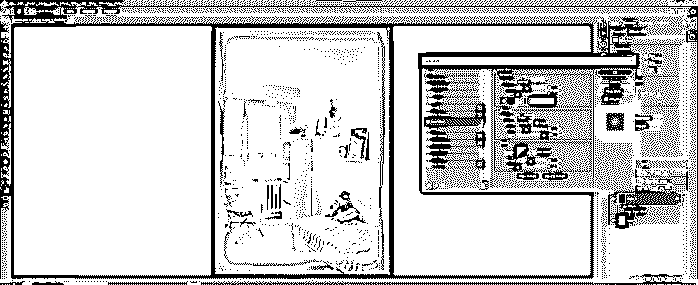

#### 步骤 30

为了增加效果，我们甚至可以添加噪声。

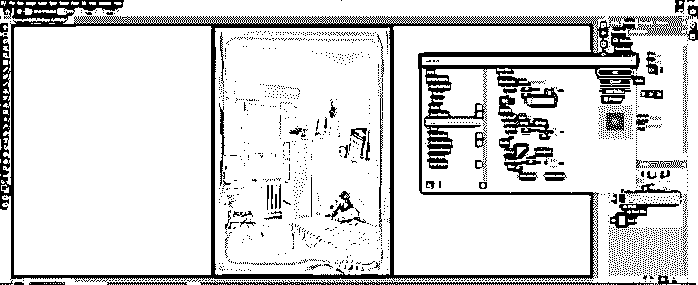

#### 步骤 31

调整不透明度，噪声和扼流圈，以获得一些旧电影的效果。

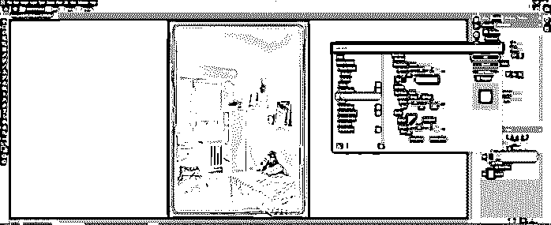

#### 步骤#32

下一个方法是使用滤镜菜单中的相机原始数据滤镜，或者按 Shift + Ctrl + A

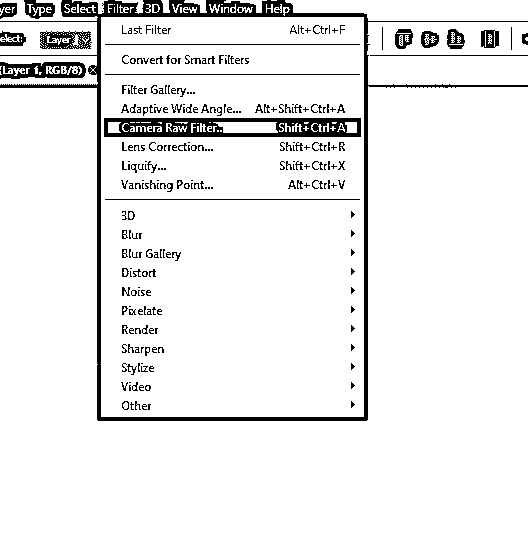

#### 步骤#33

转到效果选项卡，将数量更改为负值，这将使效果更暗。增加数量以使效果更亮。

#### 步骤#34

更改中点以增加或减少晕影的半径。减少中点值会加深效果，增加中点值会使效果变平。

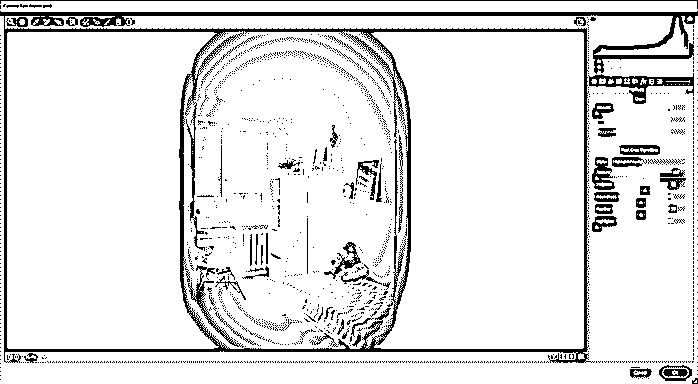

#### 第 35 步

改变圆度。如果你增加，那么它会使晕影更圆，如果你减少值，那么它会更窄。

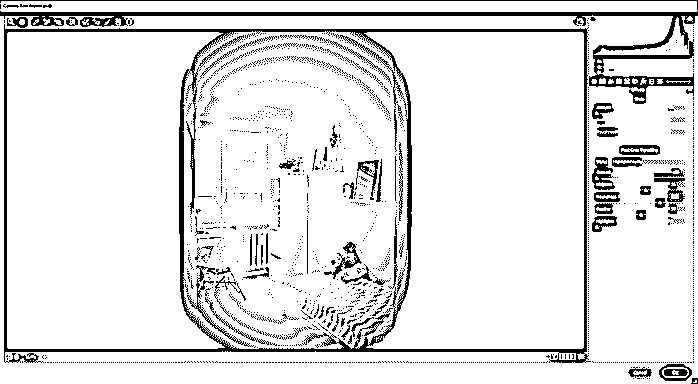

#### 步骤 36

让我们用其他方法来创建一个暗图像。

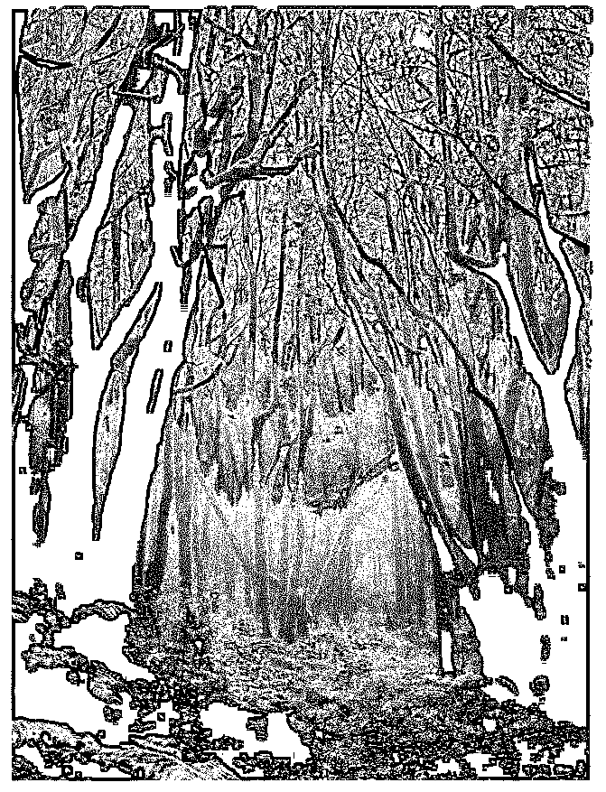

#### 步骤#37

使用椭圆选框工具，绘制一个椭圆，如图所示。

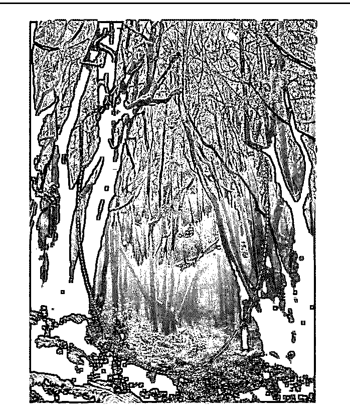

#### 步骤 38

从“图层”面板创建一个曲线图层。

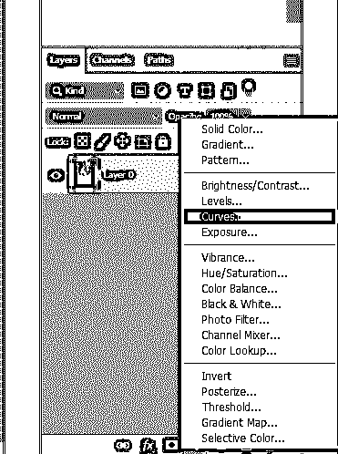

#### 步骤 39

在属性面板中调整曲线

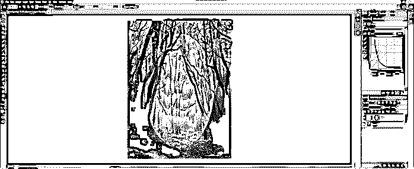

#### 第 40 步

然后在属性面板中使用羽化来创建效果。

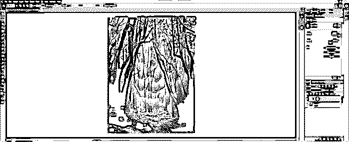

### 结论

在这篇文章中，我们用各种方法在 photoshop 中做了一个晕影效果。第一种方法是收缩纯色。然后，我们已经看到了效果如何在黑白背景上实际使用，最后，使用曲线层。

### 推荐文章

这是一个 Photoshop 插图指南。在这里，我们一步一步地讨论这种效果在黑白背景上的实际应用。您也可以看看以下文章，了解更多信息–

1.  [Photoshop 中的模板](https://www.educba.com/templates-in-photoshop/)
2.  [Photoshop 中的半色调](https://www.educba.com/halftone-in-photoshop/)
3.  [Photoshop 中的夜间效果](https://www.educba.com/night-effect-in-photoshop/)
4.  [变换工具 Photoshop](https://www.educba.com/transform-tool-photoshop/)

