# Photoshop 液化

> 原文：<https://www.educba.com/photoshop-liquify/>

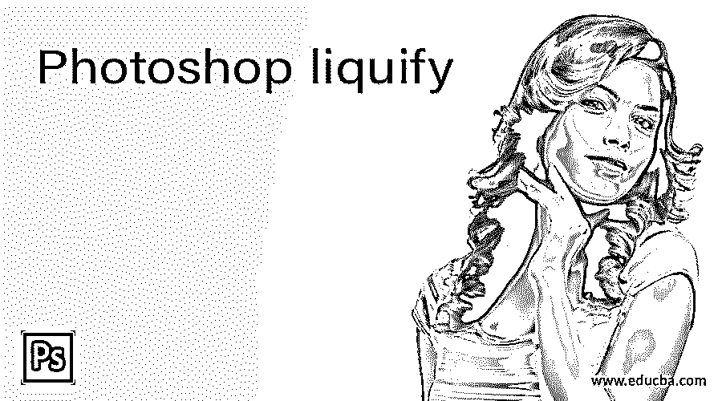

## Photoshop Liquify 简介

Liquify 代表一种功能，可以将您的照片转换为粘性液体，这意味着您的照片可以作为粘稠液体工作，并向您显示粘稠液体的属性。使用液化功能的工具，您可以非常平滑地调整照片中不完美的部分，并以不同的方式进行更改以获得完美。我们需要这个功能，因为在拍摄过程中，由于相机的拍摄角度不同，照片会与真实人物不同。我们有一些重要的工具来液化功能，如向前扭曲工具，重建工具，等等。所以让我们分析一下这个工具的所有参数。在这个主题中，我们将学习 Photoshop liquify。

### Photoshop 中如何使用 Liquify？

Liquify 有助于您在摄影后获得完美的照片。所以你希望你的照片如此完美？让我们找到这个完美游戏的关键。

<small>3D 动画、建模、仿真、游戏开发&其他</small>

为此，你可以拍照。我从网上下载了一张图片。所以让我们用 Photoshop 打开它。为此，只需点击欢迎屏幕上的打开按钮。

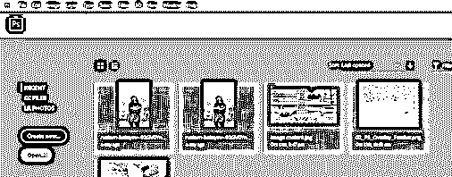

现在从保存的位置选择您想要的照片。

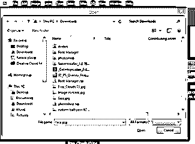

现在复制这张图片；制作一个副本，按 Ctrl + J。选择复制的层，并前往菜单栏的过滤器菜单，并点击它。选择“转换为智能滤镜”选项。此选项会将您的对象转换为智能对象，并且可以在不破坏它的情况下更改其参数。

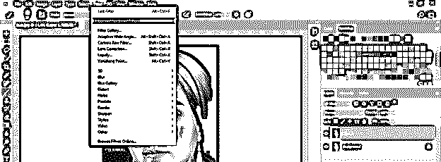

现在你最期待的学期来了，那是什么？是的，现在我们将讨论液化。所以再次进入过滤器菜单，点击下拉列表的液化选项，或者你可以抓住 Shift + Ctrl + X 作为快捷键。

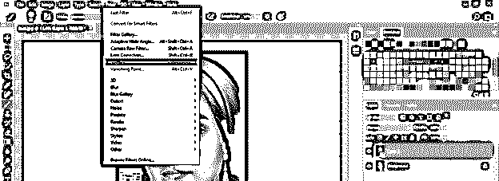

一旦你点击这个选项，一个单独的液化窗口将打开其工具面板和参数。

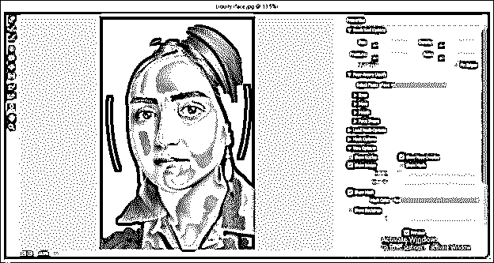

第一个工具是向前扭曲工具。

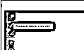

让我们先来看看参数。这个特性的几乎所有工具都有类似光标的笔刷工具，所以在参数部分，我们有笔刷大小，笔刷的密度，笔尖的压力，以及任何工具产生效果的速度。

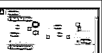

使用向前扭曲工具，您可以移动图像的任何特定部分；例如，我调整画笔的大小，使之与这个女孩眼睛的大小相同，并根据我想要使用的画笔圆形区域的长度来设置密度。现在这里，压力是 100 %,我在眼睛的前方点击一下，所以我得到了眼睛的变化。

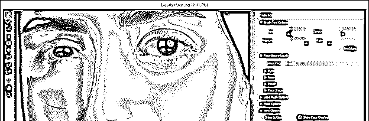

就像我减少了 29%的压力一样，所以我用这个工具一次点击就有了一点点变化。

以前

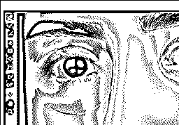

在...之后

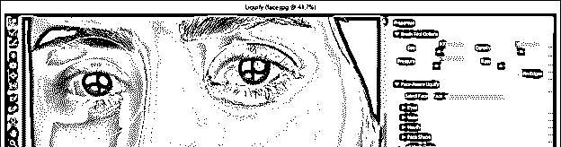

现在下一个工具是重建工具。

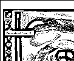

使用此工具，您可以恢复使用其他液化工具所做的更改。这些变化的重建取决于该工具的速率和压力参数。如果压力和速率值很高，它会很快重建，但如果你不想恢复所有的变化步骤，使用较小的压力和较低的速率，它会平滑地恢复你的变化。

我用向前扭曲工具扰乱视线，以便理解下一个工具的目的。现在下一个工具是平滑工具。

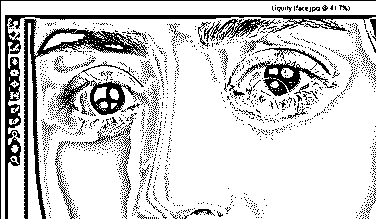

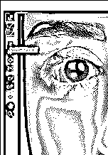

现在用这个工具在眼线上点击并拖动，像这样平滑眼线。再次，平滑将取决于压力和速率参数。

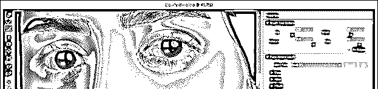

在使用下一个工具之前，您应该知道一件事，那就是“Restore All”按钮。是的，用这个按钮，你可以删除你用液化工具对这个图像所做的所有修改。

以前

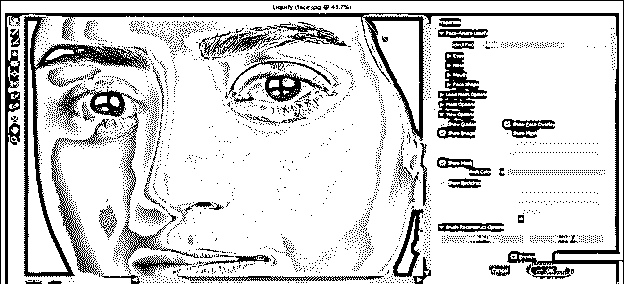

在...之后

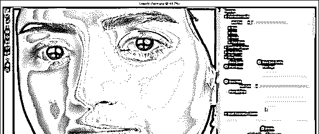

下一个工具是顺时针旋转工具。

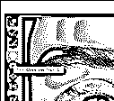

你知道旋转工具的用途；它旋转你用这个工具的画笔笔尖选择的区域。在液化，你可以用它来弯曲或旋转图像的任何区域一点点；例如，我用这个工具在这张脸的鼻子线上画一个小弯。

以前

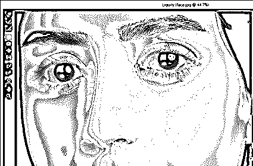

在...之后

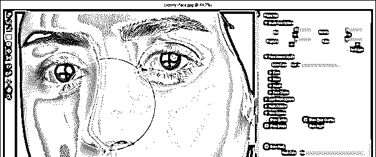

下一个工具是折叠工具。

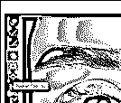

使用此工具，您可以减小使用此工具选择的任何部分的大小。我缩小了这张脸的鼻子。

以前

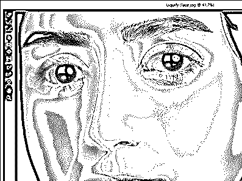

在...之后

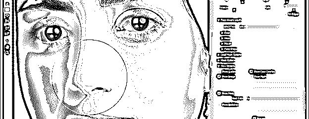

接下来是膨胀工具。

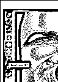

它与折叠工具正好相反。是的，你是对的；它增加选定区域的大小；比如，我把这张脸的嘴唇放大一点。

以前

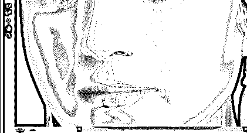

在...之后

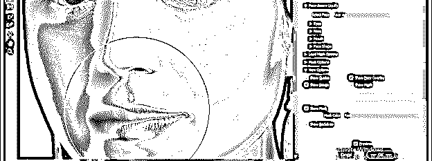

冻结遮罩工具是一个非常重要的工具。

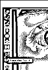

使用此工具，您可以选择在对所选区域的附近区域进行更改时不想打扰的区域。我用这个工具选择头发区域。

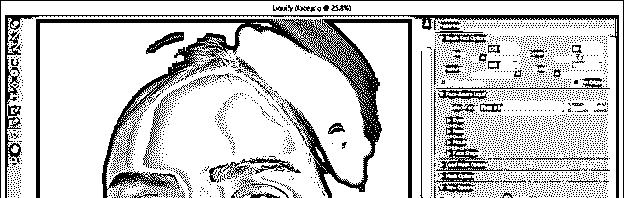

现在我将在选定的区域附近做一些改变，就像这样，你可以注意到它不会干扰选定的区域。

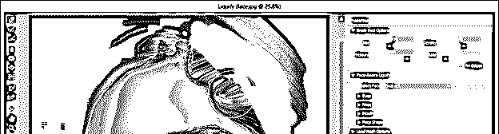

接下来是解冻蒙版工具。

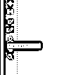

使用此工具，您可以移除使用冻结蒙版工具选择的蒙版区域。

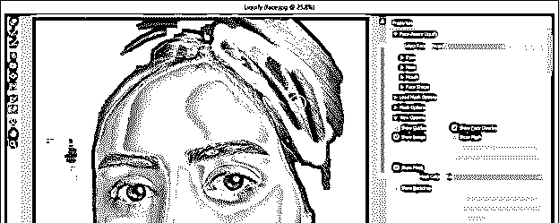

接下来是人脸工具。有时，它检测不到图像上的人脸，即使该图像已经面对。所以不用担心。

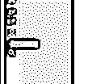

面部工具让您可以完全控制图像的面部。

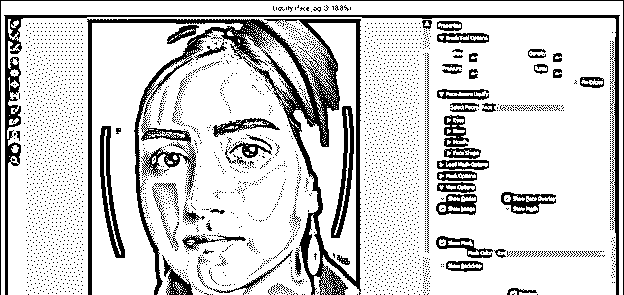

如果你的图像有几个面，那么从这个选项中选择你想要的面。

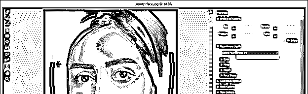

通过眼睛参数，您可以分别设置双眼的大小、高度和其他参数。

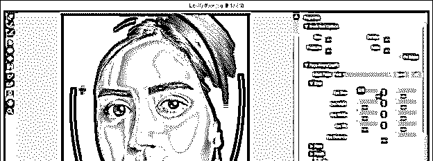

您也可以使用链接按钮链接双眼的参数。

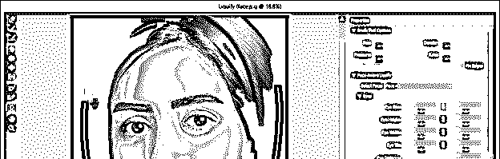

你将对脸部的各个部分进行单独控制，比如嘴、鼻子、脸型等。，在参数部分。

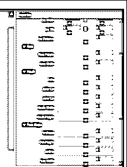

当你在图像的脸部移动光标时，你会在脸部的部位发现一个粘合圈，比如在脸部区域；您可以通过移动该粘合圆的锚点来改变面的形状。

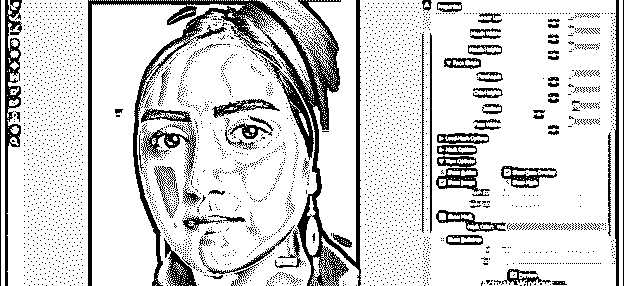

与鼻子、眼睛和其他部位上的锚点相同。

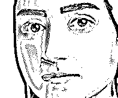

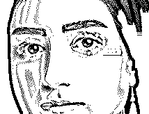

我用液化功能做到这一点。

以前

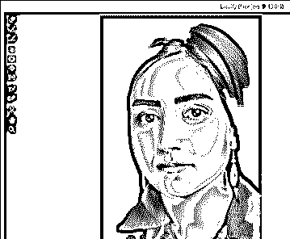

在...之后

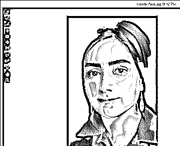

### 结论–Photoshop 液化

我想现在你可以理解为什么我告诉你，对于摄影师来说，拥有完美的照片是一个非常好的特征。您必须分析此功能工具的所有参数，以便在工作中正确使用它们并享受它们的使用。

### 推荐文章

这是一个 Photoshop 液化指南。这里我们讨论如何在 Photoshop 中使用液化，并分析该功能工具的所有参数，以便您可以正确使用它们。您也可以看看以下文章，了解更多信息–

1.  [Photoshop 金色渐变](https://www.educba.com/photoshop-gold-gradient/)
2.  [Photoshop 中的消失点](https://www.educba.com/vanishing-point-in-photoshop/)
3.  [Photoshop Cinemagraph](https://www.educba.com/photoshop-cinemagraph/)
4.  [扭曲图像 Photoshop](https://www.educba.com/warp-image-photoshop/)

