# Photoshop 自动化

> 原文：<https://www.educba.com/photoshop-automate/>

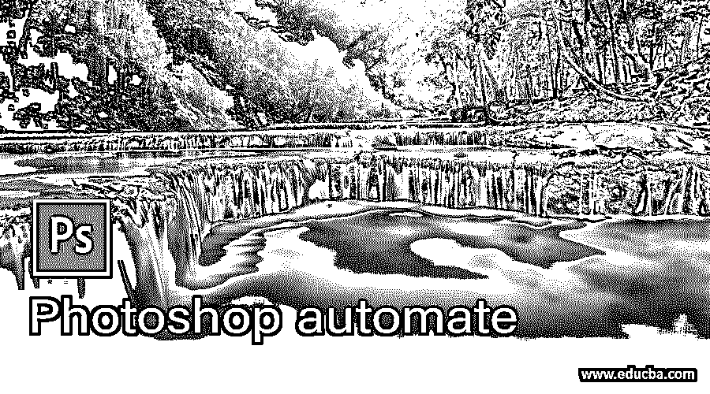

## Photoshop automate 简介

在这篇文章中，我们将学习如何使用 photoshop 来自动化功能。自动化是在 photoshop 中完成的任务，以消除重复的过程，如保存图像或执行其他操作。因此，我们可以使用“文件”菜单中的“自动化”或“脚本”来自动化任务。在脚本中，我们可以使用图像处理器同时处理多个图像。在 automate 中，我们可以使用 batch，它提供了更多选项。除此之外，我们还将了解 fit 图像自动化功能。

### Photoshop 自动化的步骤

下面是下面提到的步骤

<small>3D 动画、建模、仿真、游戏开发&其他</small>

#### 第一步

自动化可以在一个简单的过程中完成，比如将图像保存为不同的格式。如果有几幅图像就好了。但是想象一下，如果有成百上千的图片，那将会非常耗时。这里是我们可以节省时间的地方，让我们从创建一些可用于脚本或自动化的操作开始。让我们从窗口菜单打开动作面板或按 Alt + F9

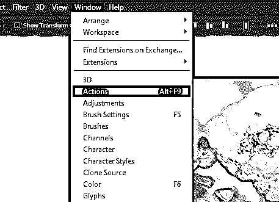

#### 第二步

除了默认动作，你还可以使用其他类似的文本效果。

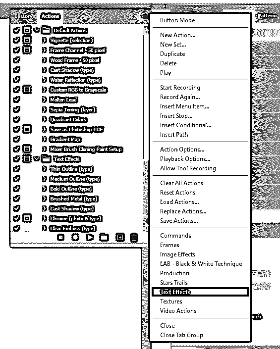

#### 第三步

键入一些文本，然后运行水反射行动，看看如何得到自动化的东西。

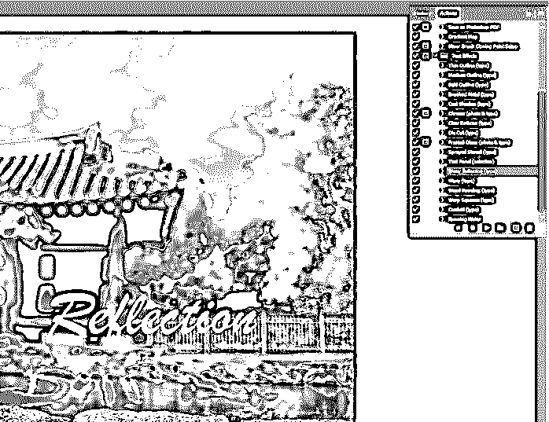

#### 第四步

现在，我们将执行 File->Revert 来获取原始文件，因为在操作中有多个步骤是我们不想撤销的。

#### 第五步

让我们通过单击动作面板右下角的加号图标来创建一个新动作。如果您愿意，您可以设置名称、set 以及快捷键和颜色。当您点按“录制”时，会录制所有动作。

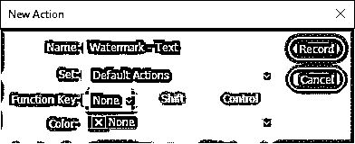

#### 第六步

如我们所见，我们创建的文本现在被记录在动作面板中。

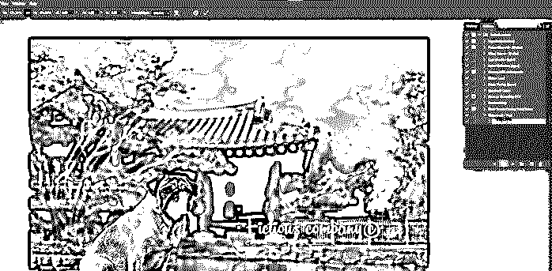

#### 第七步

接下来，给文本添加阴影，这样我们的水印在黑暗和光明的表面都是可见的。

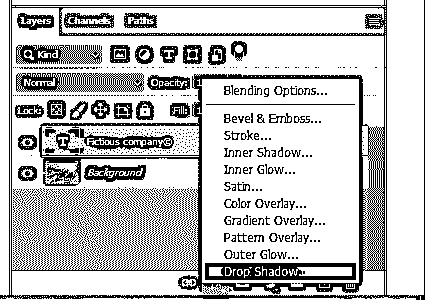

#### 第八步

因此，我们已经通过设置距离，扩散和大小完成了投影，如图所示。

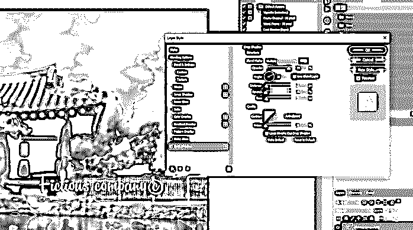

#### 第九步

现在点击停止按钮，这将保存我们的水印文本动作。

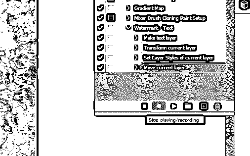

#### 步骤 10

现在，我们可以在其他图像上使用这个录制的操作，但请确保您首先选择水印文本，而不是最后选择的操作，否则它将从那里运行。

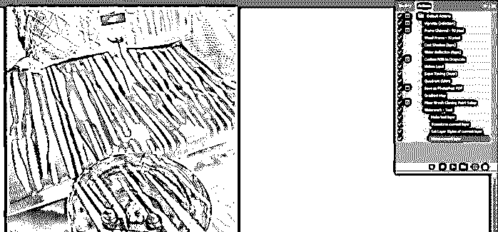

#### 步骤 11

我们可以看到，水印文本被添加。

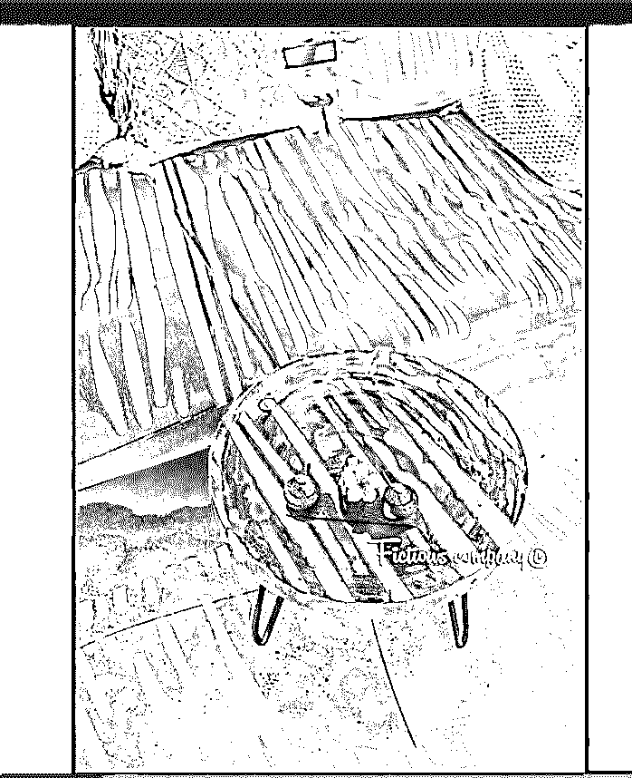

#### 第 12 步

让我们在 photoshop 中使用文件菜单中的脚本->图像处理器来开始我们的自动化过程。

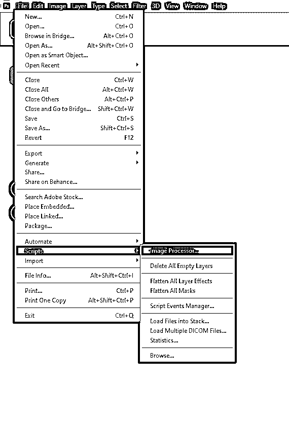

#### 步骤 13

我们想要处理的批处理文件夹中有五个图像。所以，我们先来选择文件夹。

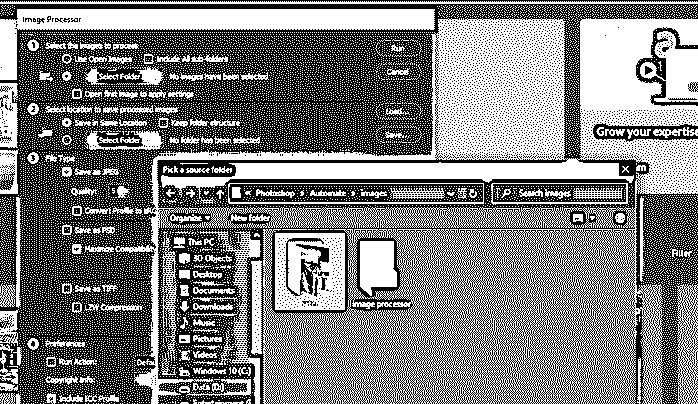

#### 第 14 步

然后让我们选择保存图像的文件夹；在我们的例子中，我们选择了图像处理器。你甚至可以保存在同一个位置。

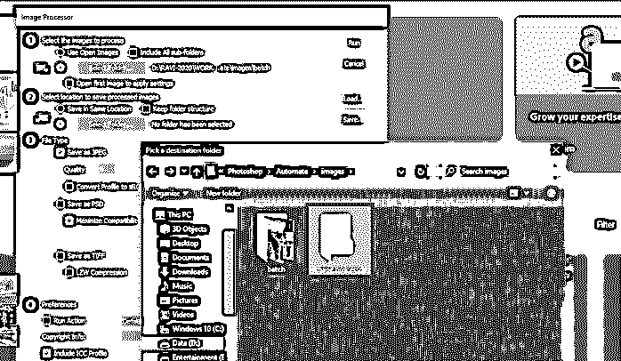

#### 第 15 步

如果您只想更改文件类型或调整大小并优化图像，您可以选择 jpeg 或您想要的文件类型，并调整大小以适应所需的尺寸。

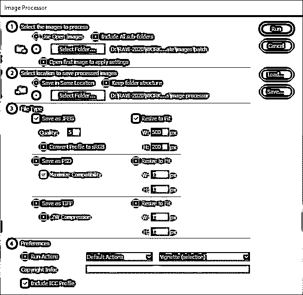

#### 步骤 16

我们要做的是，我们将运行操作，并从我们之前创建的下拉列表中选择水印文本的操作。然后点击运行，放松一下，因为这需要一些时间，这取决于图像的数量和你运行的机器的性能。此外，请确保您没有运行任何后台任务，因为这会减慢此过程。

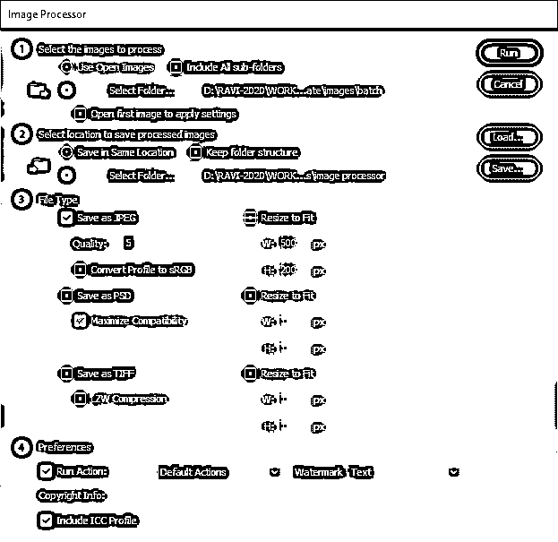

#### 第 17 步

正如我们所看到的，我们所有的图像都在图像处理器文件夹中添加了水印。

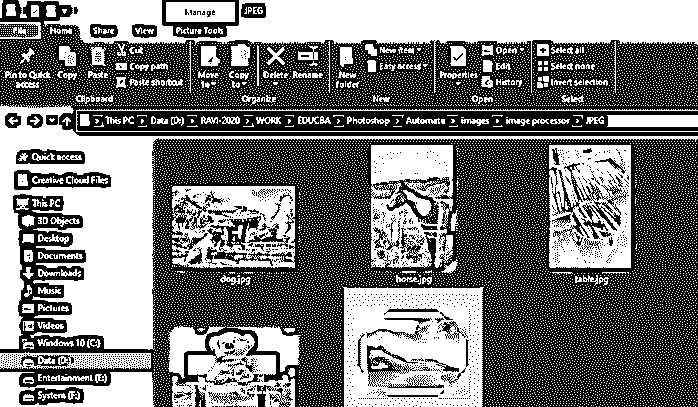

#### 步骤 18

接下来，我们将查看文件菜单中的自动化->批处理。它类似于图像处理器，但这都是关于动作的，它们是由不同的人在不同的时间创建的，所以它们都在那里。

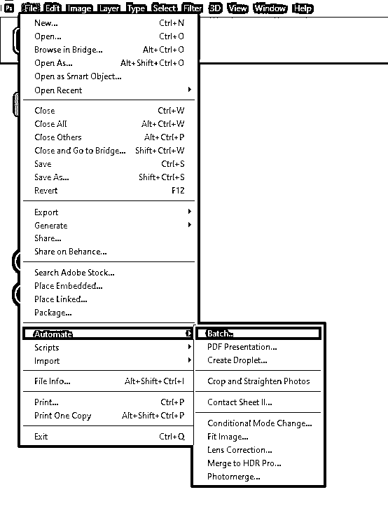

#### 步骤 19

同样，您可以选择一组动作，然后选择实际的动作，在我们的例子中，它是水印文本。

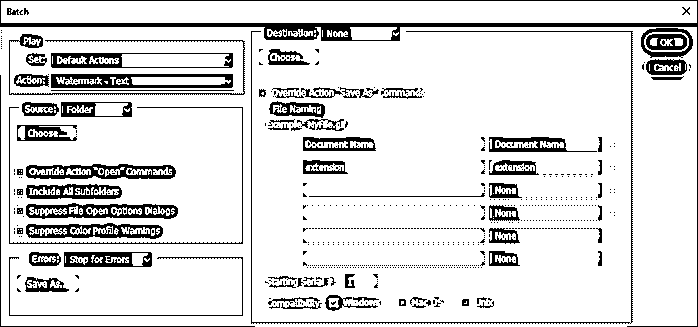

#### 第 20 步

然后，让我们选择将用于批处理的源文件夹。

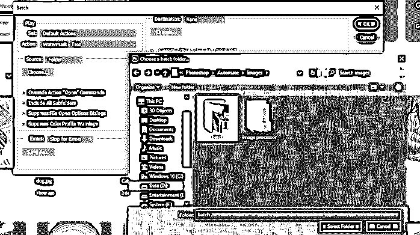

#### 步骤 21

然后，您有一些选项来抑制颜色配置文件警告，文件打开选项对话框。此外，如果您的源文件夹中有子文件夹，您可以包含所有子文件夹。还有一个如何处理错误的选项，比如您希望因错误而停止，或者您希望将错误记录到文件中。

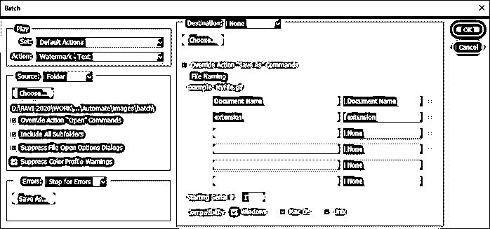

#### 第 22 步

然后，我创建了一个自动化批处理文件夹，将处理过的文件放入其中。

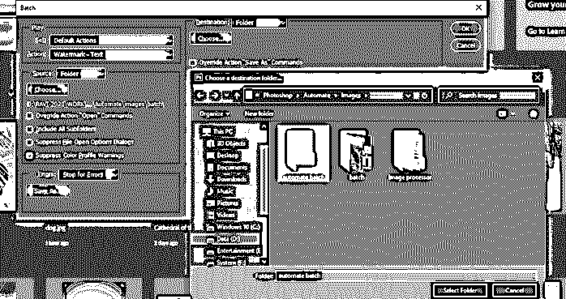

#### 步骤 23

然后是文件命名选项，您可以使用其他选项自定义文件名。另一个选项包括将文档名设置为大写或小写。然后，您可以追加多达 4 个序列号。您也可以添加大写或小写的连续字母。甚至有一个选项，以多种格式添加日期。最后，还有一个扩展选项。例子给你的样本文件名，也可以设置起始序列号。

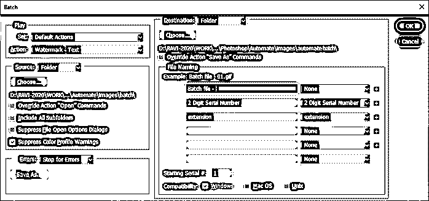

#### 第 24 步

这种方法的一个怪癖是它会要求你以你需要的格式保存。

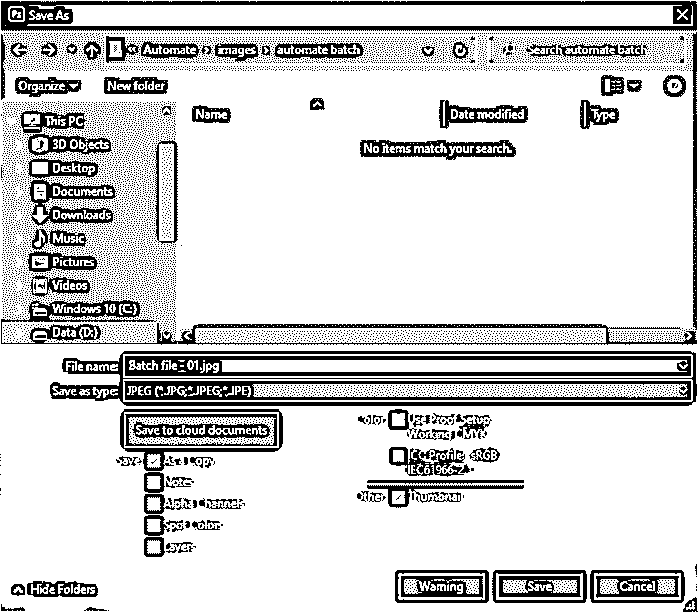

#### 第 25 步

现在，删除所有图像保存弹出窗口，打开任何图像，然后运行水印文本。选择它里面的最后一个动作并记录下来，当我们第一次做的时候，让我们降低不透明度。

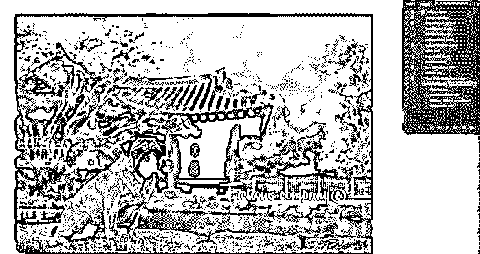

#### 第 26 步

将不透明度降低到文本层的 50%，并从图层面板选项中展平图像。然后停止动作，关闭图像。

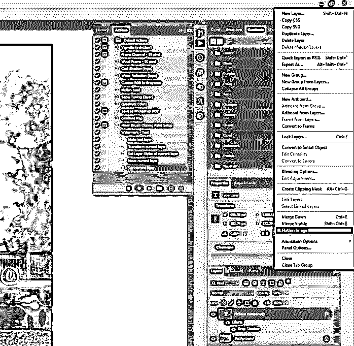

#### 第 27 步

再次，打开文件，自动化，批处理，所有前面的选项应该填满，然后单击确定。现在你不必保存为 jpeg 格式，因为它已经被保存了。

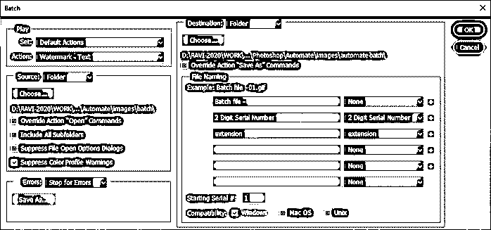

#### 步骤 28

假设您想要将图像的大小限制在某个维度，您可以从 automate 中调整图像。

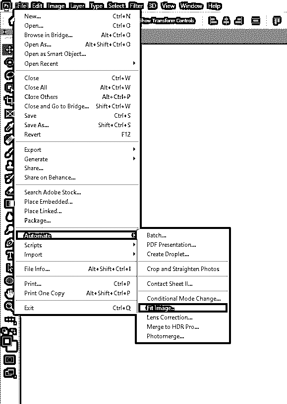

#### 步骤 29

这将把它限制在 800 px 以内，以较高者为准

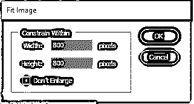

#### 步骤 30

让我们再次使用相同的选项运行批处理，我们将维度限制在 800 px 以内。

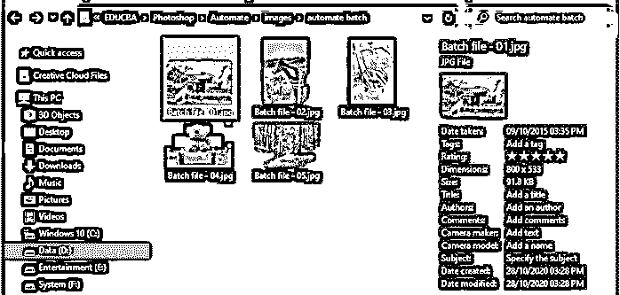

### 结论

在这篇文章中，我们看到了如何在 photoshop 中使用自动功能。首先，我们已经看到了脚本图像处理器，这是一个简单而通用的工具，可以快速运行一些动作。然后我们看到了批处理程序和适配图像功能，它让我们对如何处理和命名图像有了更多的控制。

### 推荐文章

这是 Photoshop automate 的指南。在这里，我们讨论如何使用自动化 photoshop 功能，并看到批处理和适合图像功能。您也可以看看以下文章，了解更多信息–

1.  [Photoshop 中的模板](https://www.educba.com/templates-in-photoshop/)
2.  [Photoshop 中的半色调](https://www.educba.com/halftone-in-photoshop/)
3.  [变换工具 Photoshop](https://www.educba.com/transform-tool-photoshop/)
4.  [Photoshop Cinemagraph](https://www.educba.com/photoshop-cinemagraph/)

