# Photoshop 全息效果

> 原文：<https://www.educba.com/photoshop-hologram-effect/>

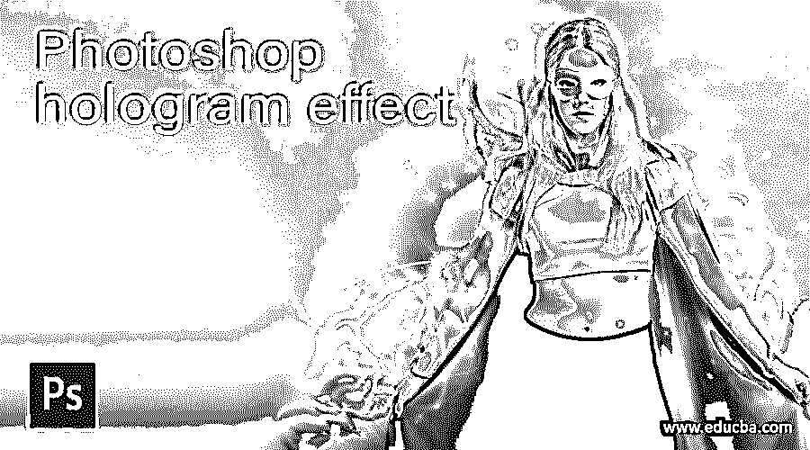

## Photoshop 全息图效果介绍

我们可以把全息图理解为由激光或聚焦光源的光束产生的三维虚像。在 Photoshop 中，我们使用这种效果来创建任何带有光源的图像的虚拟表示。为了创造全息效果，我们应该遵循两到三个主要步骤，比如我们必须有一个具有全息效果主要特征的光源图像。我们还将设置一些重要的参数来获得这种效果，其中一些是改变图层的混合模式，使用图层蒙版和笔刷工具。因此，让我们开始介绍这个软件的所有这些东西，来创建一个好的全息图效果。在这个主题中，我们将学习 Photoshop 的全息效果。

### 如何在 Photoshop 中创建全息图效果？

我们在从这篇文章中学习这个主题的过程中获得了很大的乐趣，因为我们将使用这个软件的一些重要工具和功能来获得这种类型的效果。读者们，你们会怎么说呢？你想玩这个游戏吗？如果是，那么让我们开始吧。

<small>3D 动画、建模、仿真、游戏开发&其他</small>

我想我们首先介绍一下用户界面的主要部分，这样在这个主题中，您可以很容易地捕捉到该软件的不同术语。在顶部，你会发现菜单栏有助于这个软件的许多不同的工作。接下来，我们看到菜单栏下面的属性栏，它具有活动工具或图像的属性。在左边第二个栏的下面，你会发现工具栏，在中间的显示窗口，在右边的一些标签，如层，通道，和其他一些。如果你不喜欢这个用户界面，那么你可以根据自己的选择自由调整所有部分。

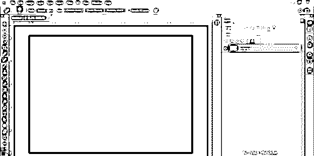

这是这个软件的欢迎屏幕。现在单击 Create New 按钮创建一个文档。选择文档的大小，然后单击此框中的“创建”按钮。

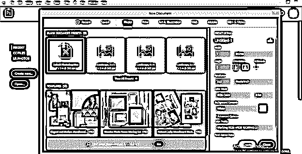

现在选择黑色作为前景色。

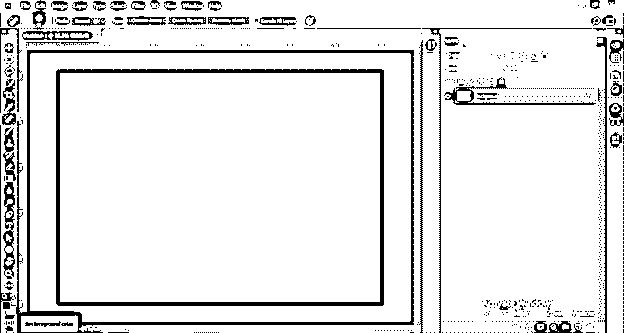

并按下键盘的 Alt + backspace 键来填充黑色。

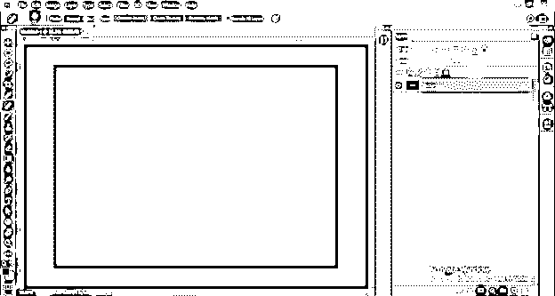

为了制作全息效果，我们需要一些图像。我已经从网上下载了它们。你也可以在网上找到它们。进入菜单栏的文件菜单，点击列表中的打开按钮。

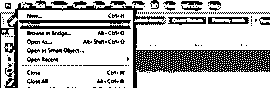

从打开的对话框中选择所需的图像。我将打开角色的图像。可以有自己的形象。

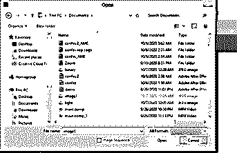

现在使用任何去除背景的方法将这个字符从背景中分离出来。

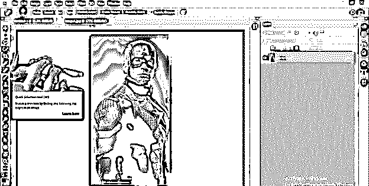

像这样。

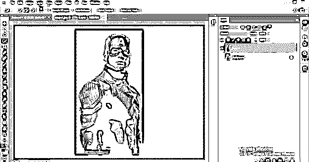

对要在其中制作光源的数字图像对象执行相同的操作。我有一张数码手表的图片。

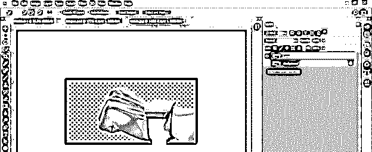

现在，将数字手表的图像拖动到我们的主文档选项卡中，并使用转换绑定框根据您的选择调整图像的大小。对于变换框，请按键盘上的 Ctrl + T 按钮。

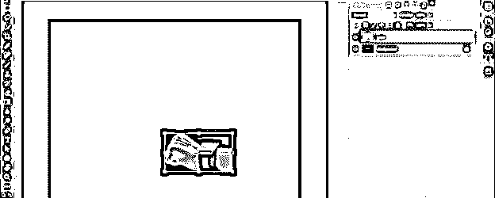

让我们把背景的颜色稍微改成灰色，这样我们可以更容易地管理我们的工作。

现在将光束图像放入这个文档窗口。我从网上下载了这张光束图像。

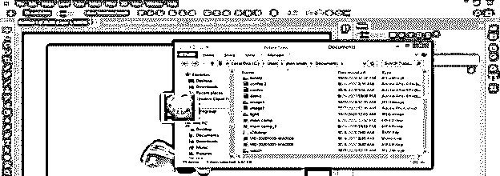

它会像这样放置。

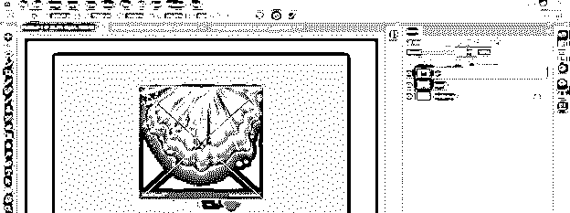

右键单击此图像，并从下拉列表中选择垂直翻转选项。

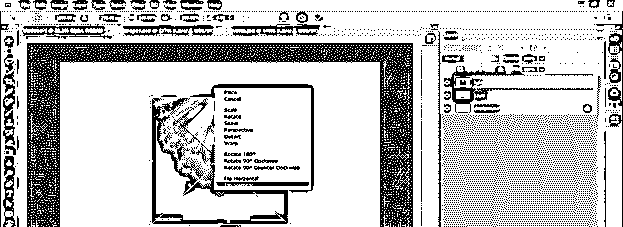

现在添加一个图层蒙版在这个图像层从调整层按钮。

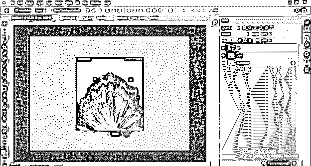

添加图层蒙版后，将此图像设置在手表屏幕的正上方，然后选择图层蒙版的缩略图，从工具面板中选择笔刷工具。

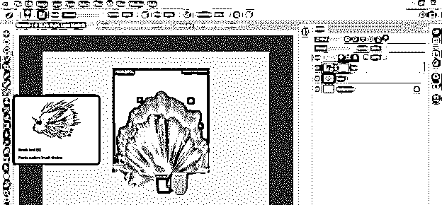

降低图层的不透明度到 50%,这样你就可以正确地编辑它，并在颜色面板框中选择黑色作为前景色。

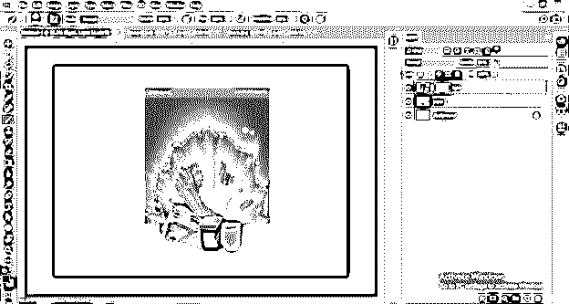

现在用笔刷工具移除光线图像中的锐利边缘和多余部分。

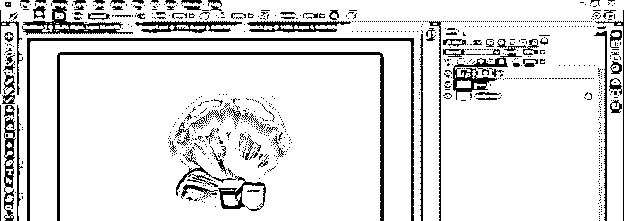

现在将这个字符图像拖动到主文档选项卡中。

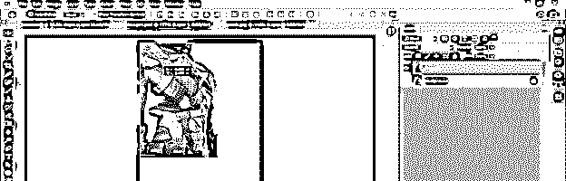

根据光束扩散调整该图像的尺寸。

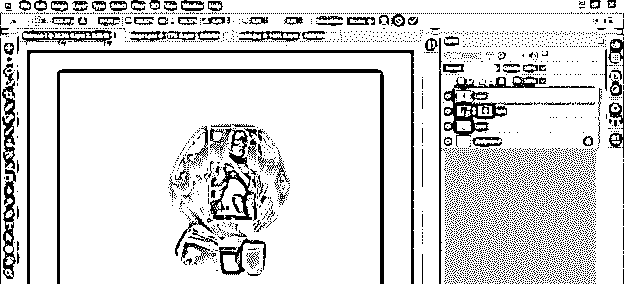

添加一个图层蒙版到这个图层也是通过调整图层按钮。

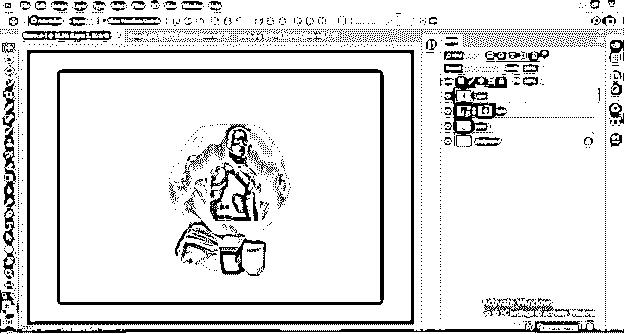

将光束层的不透明度恢复到 100%。然后去一个角色层，选择蒙版的缩略图。用笔刷工具去除这个角色底部的锐边，让它产生一个角色来自光束的错觉。

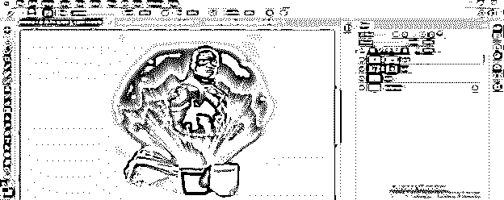

现在在你的作品中再放一个图像，这是一个二进制代码的虚拟图像。

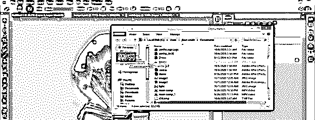

调整这个图像的大小，右键单击这个图像的图层。从下拉列表中选择“创建剪辑蒙版”选项。

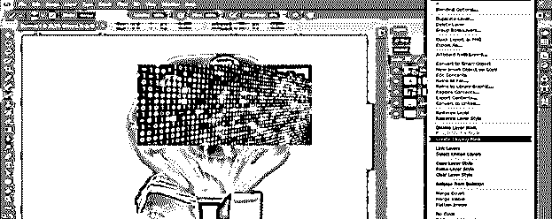

现在，按下键盘上的 Ctrl + T 按钮，缩小二进制代码图像的大小，以获得更精细的外观。

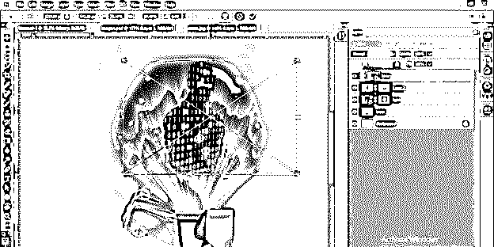

转到这一层的混合模式选项，并从列表中选择“精简减淡”选项。

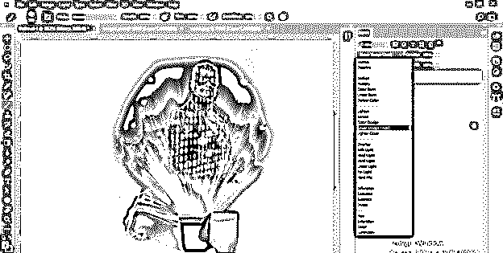

再次进入图层蒙版，使用笔刷工具根据字符大小设置光束。

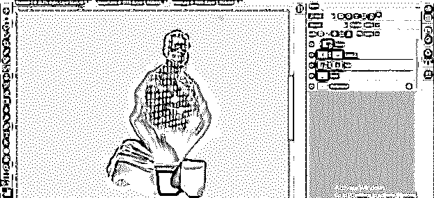

选择这三个图层，将不透明度降低到 70%，这样你就可以得到一个真正的全息图效果。

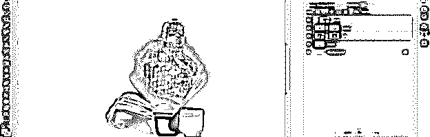

现在使用 Ctrl + G 快捷键将全息效果的图层分组。

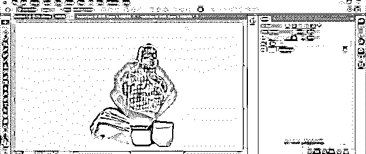

现在让我们在文档中有一个背景图像，用于测试我们的全息图在真实背景上的效率。

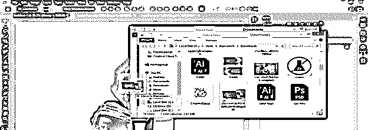

调整它的大小。

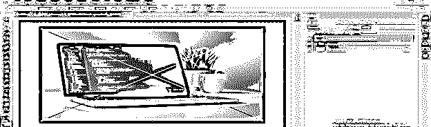

把它放在下面的第一组层。

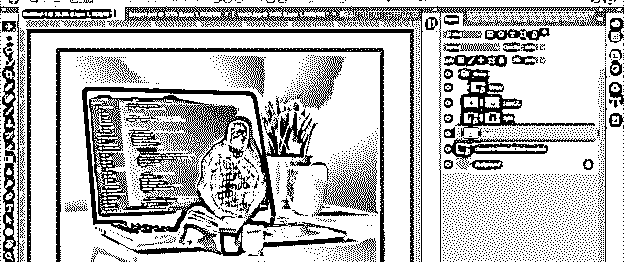

现在选择离开手表主屏幕的手表图像的手部区域，选择后点击右键。从列表中通过剪切选项选择图层，然后删除提取的图层。

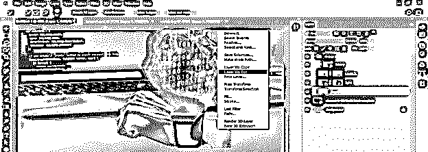

添加阴影到手表的主屏幕层混合模式选项。在添加投影之前，选择混合模式选项中的蓝色选项。

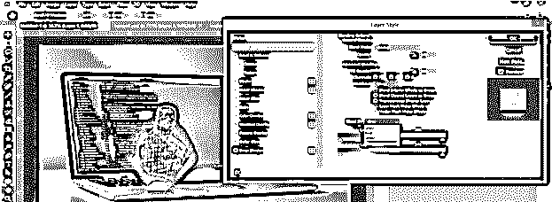

根据您的选择调整该层的距离、扩散和阴影大小，以使观看屏幕看起来更真实，就像光源的支架一样。

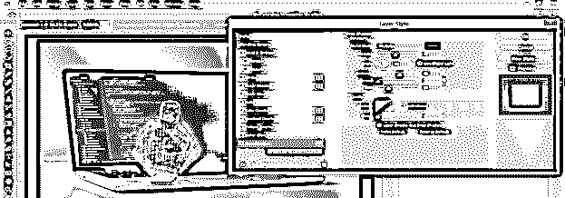

我将给出距离值为 26，扩散值为 6，大小值为 24，角度值为 83 度。

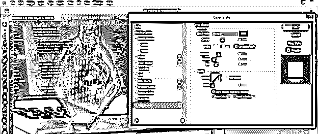

这是你创建全息效果的最终输出。

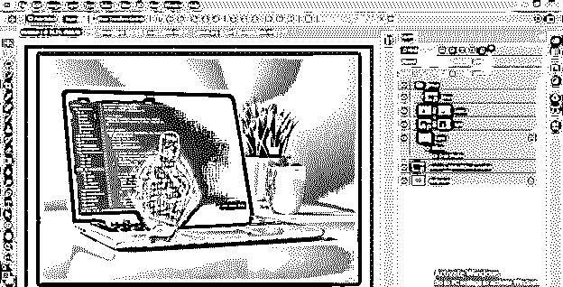

### 结论

现在我想你已经对全息效应有了很好的了解，并且在通过这篇文章学习这个话题的过程中产生了极大的兴趣和乐趣。现在你应该在参数特征上做一个变化，我们已经包括了获得不同类型或独特结果的全息效果。

### 推荐文章

这是一个 Photoshop 全息效果的指南。在这里，我们讨论如何在 Photoshop 中创建一个全息图效果以及参数功能。您也可以看看以下文章，了解更多信息–

1.  [Photoshop 阳光效果](https://www.educba.com/photoshop-sun-effect/)
2.  [Photoshop 中的模板](https://www.educba.com/templates-in-photoshop/)
3.  [Photoshop 金色渐变](https://www.educba.com/photoshop-gold-gradient/)
4.  [扭曲图像 Photoshop](https://www.educba.com/warp-image-photoshop/)

