# Vaporwave Photoshop

> 原文：<https://www.educba.com/vaporwave-photoshop/>

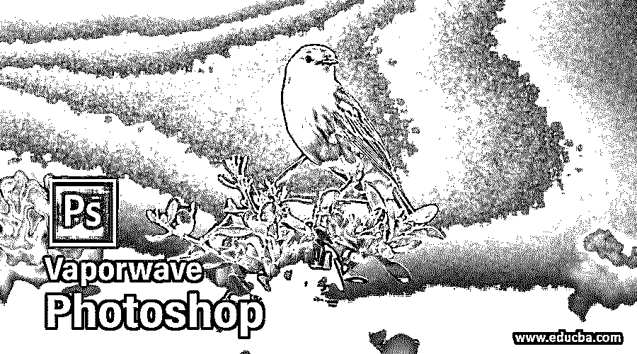

## Vaporwave Photoshop 简介

Photoshop 是光栅图像编辑软件，它有不同的技术，通过它我们可以制作一些旧的视觉效果。Vaporwave 是 20 世纪 90 年代后期的一种视觉效果，它与 glitch art、音乐视频和不同类型的艺术品一起出现。借助 Photoshop 软件的不同功能，我们可以在我们的图像上创建这种效果。在本文中，我们将学习如何使用该软件的功能创建 vaporwave，并分析这些功能的不同参数。那么就让我们开始关于这款软件中的 Vaporwave Photoshop 话题的讨论吧。

### 如何在 Photoshop 中创建 Vaporwave？

我们应该遵循一些简单的步骤在我们的图像上应用这种效果，但是我认为在我们开始学习这个主题之前，我们应该看看这个软件的工作屏幕，这样我们就可以在这篇文章中更好地理解这个主题。

<small>3D 动画、建模、仿真、游戏开发&其他</small>

在顶部，我们有一个菜单栏，它有不同的菜单，如文件、编辑、图像和其他一些菜单。这些菜单帮助我们在使用该软件的过程中管理该软件的不同参数。在这个菜单栏下面，我们有一个活动工具或图像的属性栏，通过它我们可以管理这些工具或图像的参数。在这个栏的下面，我们有一个工具面板，左侧有一个不同类型的工具，使我们在这个软件中的工作变得容易，在中心我们有一个显示窗口，我们可以在其中看到我们的工作，在右侧我们有一些面板，帮助管理这个软件的不同功能。您可以根据自己的选择在不同的位置重置所有部分。

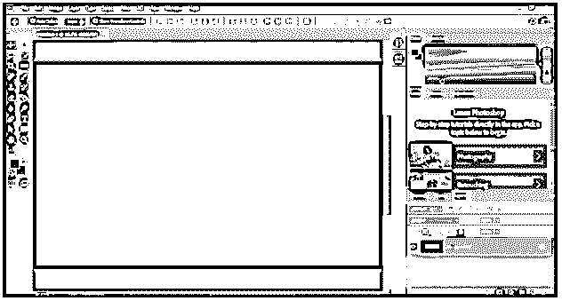

现在让我们有一个图像，我们将应用蒸汽波效应。要获得图像，请转到菜单栏的文件菜单，然后单击它。一旦你点击它，一个下拉列表将被打开，点击“打开”下拉列表的选项。

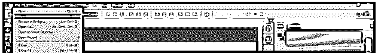

一旦你点击打开，一个放置图片的对话框将会打开。进入你个人电脑的目标文件夹，点击选择你想要的图像。选择后，按下此对话框的打开按钮。

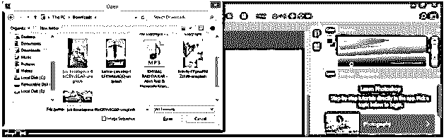

一旦你点击你的图像将作为背景层打开，使其可编辑，进入图层面板，双击这个图层。一旦你双击一个“新层”框将被打开。根据你的名字命名这个图层，然后点击这个框的 Ok 按钮。

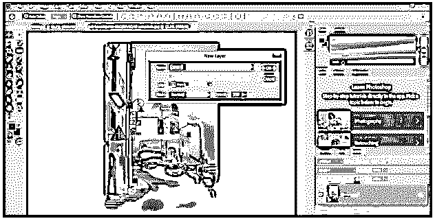

现在按 Ctrl + J 按钮来复制这个图层。

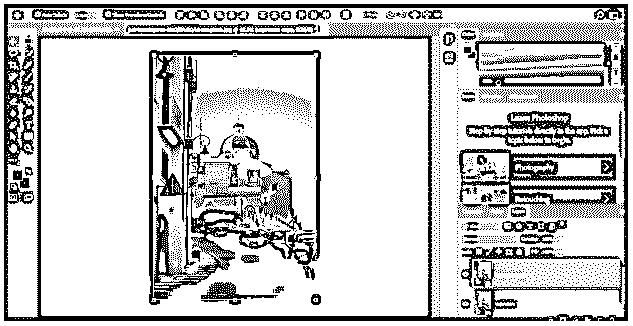

现在选择复制层点击它，并按 Ctrl + I 按钮，这种类型的影响你的形象。

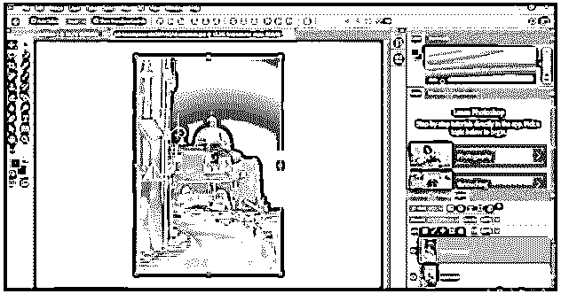

现在点击这一层的模式选项的下拉箭头。通过单击从列表中选择一个颜色选项。

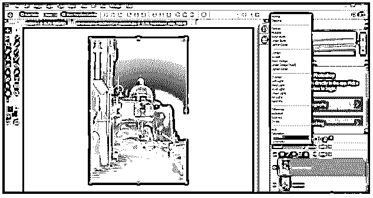

现在它看起来会像这样。

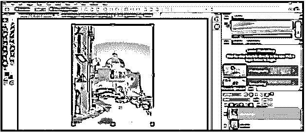

现在到图层面板的底部，点击调整图层按钮。将打开一个下拉列表，从这里选择“通道混合”选项。

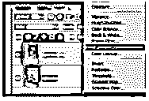

在打开的对话框的输出通道选项中选择红色，使红色值为 0，蓝色值为 100。

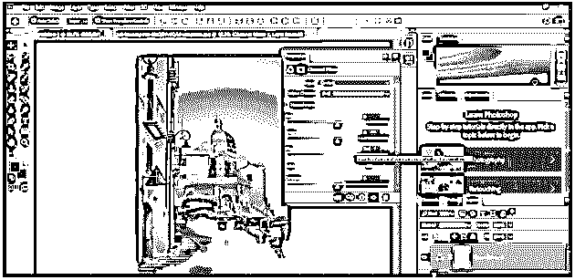

在打开的对话框的输出通道选项中选择蓝色。

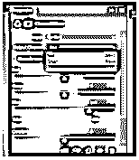

并将红色值设为 100，蓝色值设为 0。

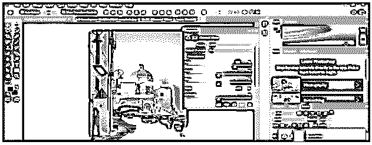

现在右键单击图层面板中的通道混合器图层，从下拉列表中选择“创建剪贴蒙版”选项。

现在再次点击图层面板的调整图层按钮，从列表中选择色调/饱和度选项。

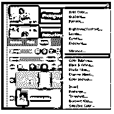

右键点击色相/饱和度层，再次点击列表中的“创建剪贴蒙版”选项。

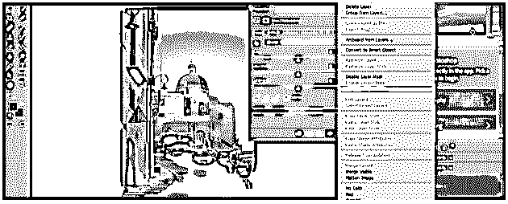

现在从色调/饱和度框的列表中选择红色选项。

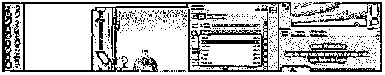

将红色的色调值降低到-40。你可以看到对你形象的影响。

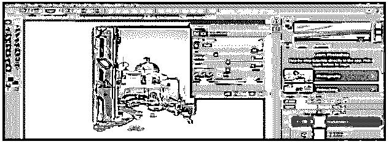

现在从色调/饱和度框的列表中选择黄色选项。

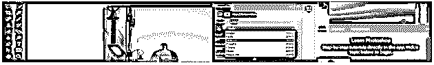

将黄色的色调值降低到-45。你可以看到对你形象的影响。

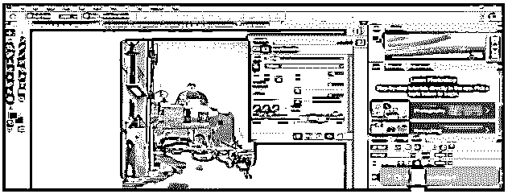

现在从色调/饱和度框的列表中选择蓝色选项。

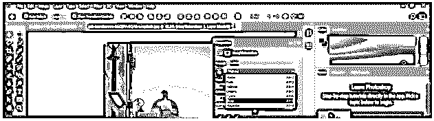

将蓝色的色调值降低到-60。你可以看到对你形象的影响。

现在在这个软件中放置一个旧电视效果的图像。我已经从网上下载了。

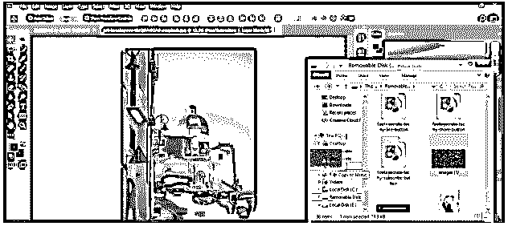

调整这个图像的大小，因为它像这样覆盖了你的背景图像，然后按下回车键。

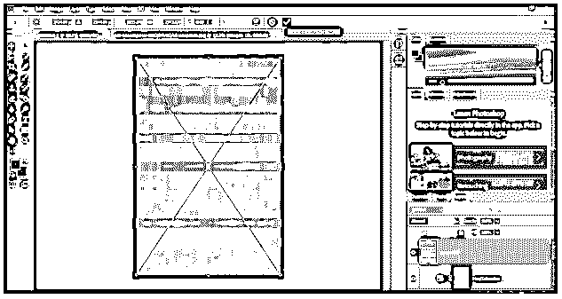

现在点击模式选项的下拉箭头，从这里选择柔光选项。

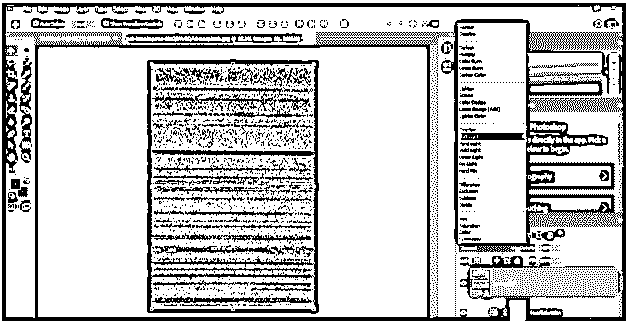

减少这一层的不透明度高达 45 %。

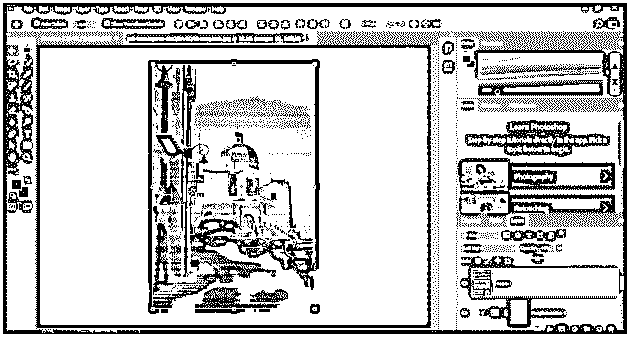

现在转到菜单栏的过滤器菜单，并点击它。从列表中选择液化选项。

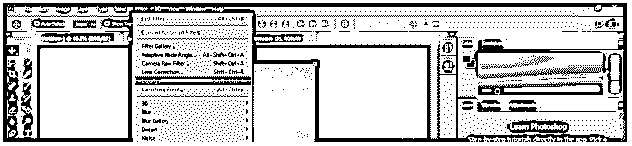

现在一个液化选项对话框将被打开。根据你自己调整画笔的大小。

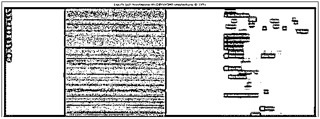

用这样的笔刷扭曲这张图片，然后点击对话框中的 Ok 按钮。

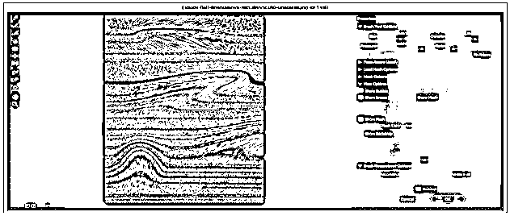

一旦你按下确定按钮，你会看到你的图像扭曲的效果。现在点击图层面板按钮上的新建图层选项。

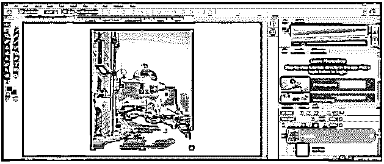

转到编辑菜单并点击它。从下拉列表中选择填充选项。

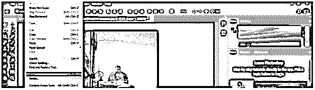

现在从填充框列表中选择 50 %灰色选项，并按下此对话框的确定按钮。

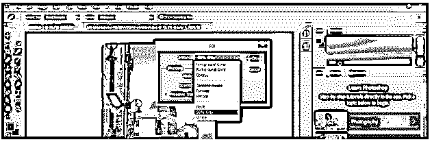

再次进入菜单栏的过滤器菜单并点击它。转到下拉列表的噪波选项，并从新建下拉列表中选择添加噪波选项。

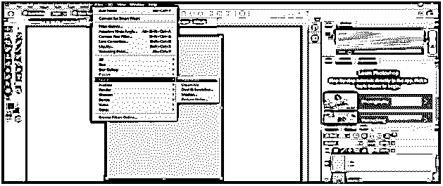

在添加噪声框中将噪声值设置为 70 %,然后按下该框的确定按钮。

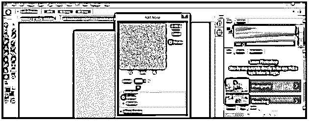

从该层的模式选项中选择柔光选项。

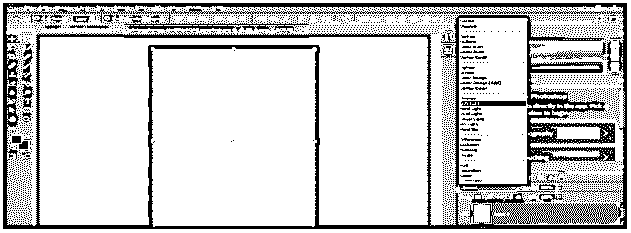

减少这一层的不透明度高达 53 %。

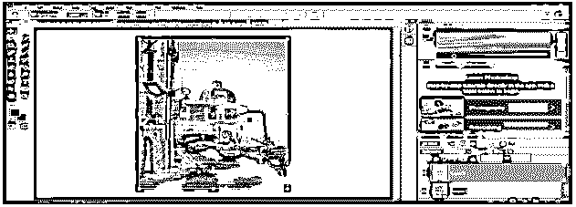

这是你的蒸汽波效果的最终结果。

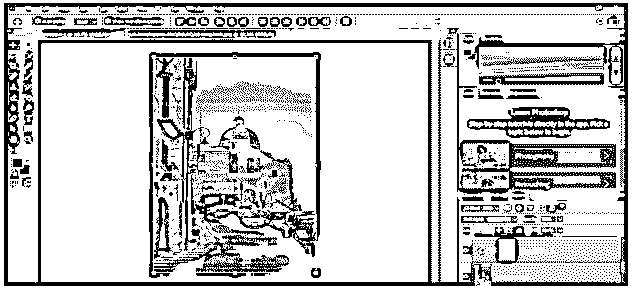

### 结论

看完这篇文章后，你可以理解 Photoshop 中的 Vaporwave 效果，并且可以很容易地在你的图像上使用这种效果来获得 20 世纪 90 年代的旧视觉效果。你可以通过花越来越多的时间练习这个功能来很好地掌握它。

### 推荐文章

这是 Vaporwave Photoshop 的使用指南。这里我们讨论如何使用 Photoshop 的特性来创建 Vaporwave，并分析这些特性的不同参数。您也可以看看以下文章，了解更多信息–

1.  [VHS 特效 Photoshop](https://www.educba.com/vhs-effect-photoshop/)
2.  [Photoshop 中的半色调](https://www.educba.com/halftone-in-photoshop/)
3.  [扭曲图像 Photoshop](https://www.educba.com/warp-image-photoshop/)
4.  [Photoshop 中的毛刺效果](https://www.educba.com/glitch-effect-in-photoshop/)

