# Photoshop 宝丽来

> 原文：<https://www.educba.com/photoshop-polaroid/>

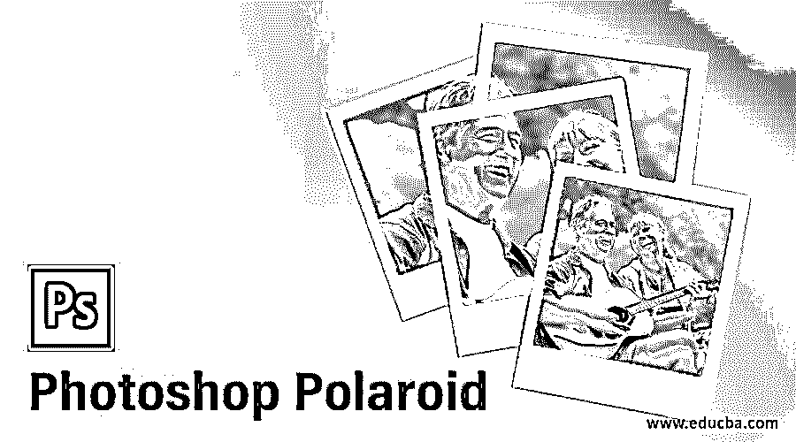

## Photoshop 宝丽来简介

宝丽来是一种效果，通过它你可以用这个软件的一些功能和工具，比如上色，淡入淡出一些区域，调整一些极化工具的参数，在你的照片上创造出老照片的样子。你可以创建这种效果原谅你的照片不同的外观取笑它，所以让我们学习如何为我们的照片创建这种类型的效果，并分析一些重要的参数这种效果。我们将通过一个例子来理解它，并学习色彩校正的管理、混合模式的管理以及其他一些重要的图形管理。让我们开始吧。在这个主题中，我们将学习 Photoshop 宝丽来。

### 如何在 Photoshop 中创建宝丽来效果？

我们可以在 Photoshop 中创建一个宝丽来效果，只需进行一些着色，也可以使用该软件的一些工具。但是在开始之前，我认为我们应该看看这个软件的工作界面，这样我们就可以更好地理解这篇文章中的主题。

<small>3D 动画、建模、仿真、游戏开发&其他</small>

在工作屏幕的顶部，有一个菜单栏，其中有几个菜单用于管理该软件的不同参数。在此栏下面，我们有一个活动工具或活动图像的属性栏，用于更改该工具或图像的参数。在此栏下面，我们有三个部分，其中左侧是工具面板，中间是显示窗口，右侧是一些选项卡，如颜色选项卡、色板选项卡、图层面板等。您可以根据自己的选择，在该软件的工作屏幕上的任何地方调整所有这些部分。

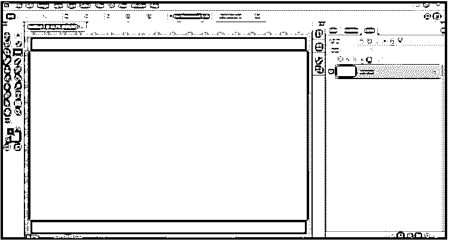

现在让我们对这个话题有一个形象的了解。我会为此下载一个图像，你可以为这项工作拍摄你的图像。要放置图像，请转到菜单栏的文件菜单，然后单击它。从该菜单的下拉列表中选择打开选项。

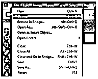

这种类型的对话框将被打开。进入你想要的文件夹，点击选择你想要的图片。选择 make 后，单击此对话框的打开按钮。

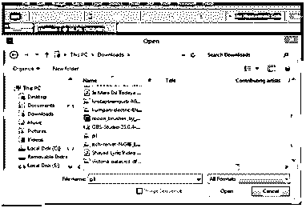

如果您已经打开了任何文件，您的图像将像这样放在该软件的新标签中。现在，让我们制作一份该图像的副本，这样我们的原始文件就不会在工作过程中损坏。选择背景层，按键盘上的 Ctrl + J 键进行复制。为了更好的理解，我们把这个复制层命名为。我将把它命名为极地。可以根据你来命名。

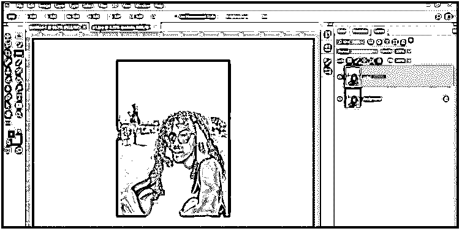

现在进入这个软件的窗口菜单，点击它，然后从列表中选择调整选项。

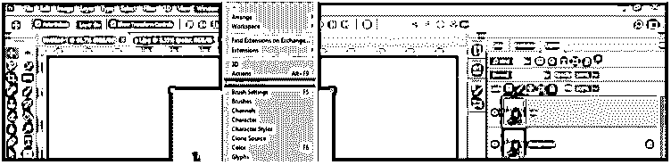

现在调整标签将在这个软件的图层面板部分打开。点击“创建一个新的曲线调整层按钮”这个标签的颜色曲线值这张照片。

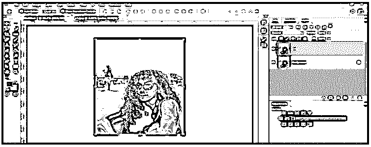

现在像这样调整这个曲线框的曲线，使你的照片稍微褪色。

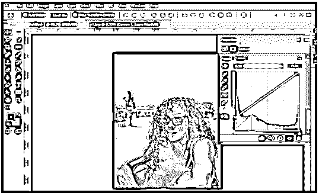

现在在曲线的下部添加一个点，在曲线的上部添加两个点，然后像这样调整它们。

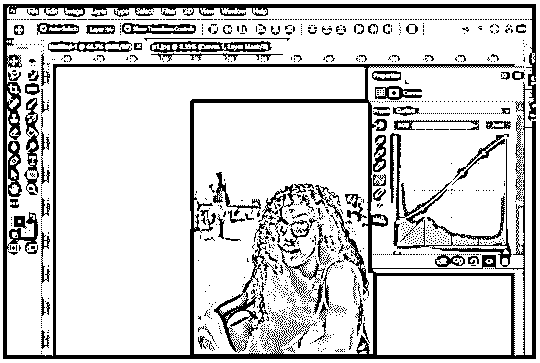

根据您的选择命名该层。

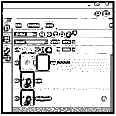

现在再次从调整图层按钮选择曲线选项。

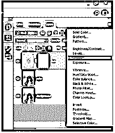

在这个曲线框中，我们将逐个设置所有的颜色曲线。

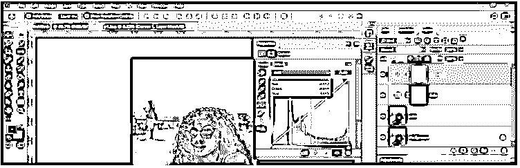

现在在选项中选择红色，并像这样调整这个颜色的曲线，给这张照片一点红色的效果。

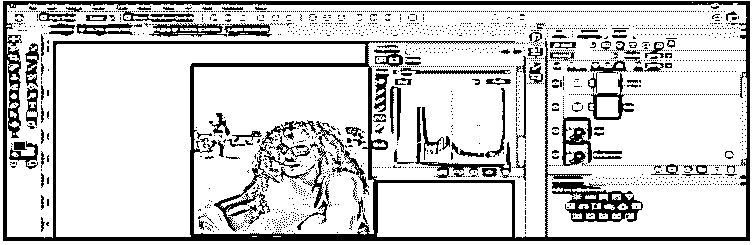

现在选择选项中的绿色，对这一层的曲线做同样的操作，就像我们在红色曲线中做的一样。

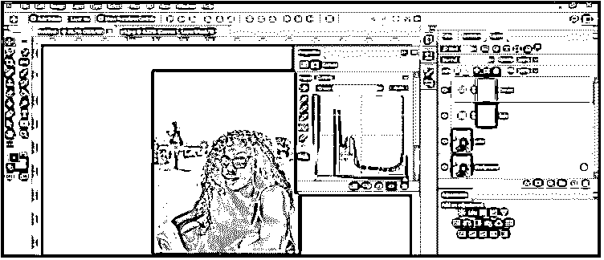

现在选择颜色选项中的蓝色，像这样调整这层的曲线。

现在命名这一层为颜色调整。可以根据你来命名。

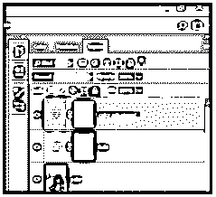

现在再次点击图层面板的调整图层按钮，从列表中选择纯色选项。

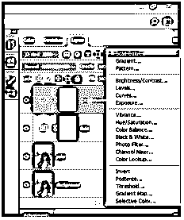

现在选择一个明亮的粉红色作为这一层的纯色。

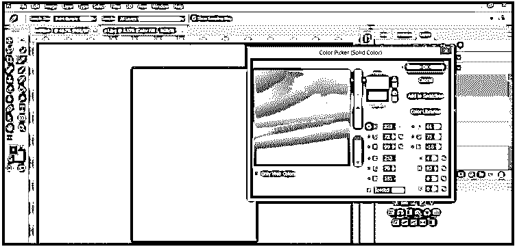

现在减少这一层的不透明度为 50 %，并选择柔光选项在这一层的模式选项。

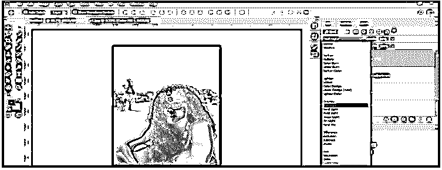

现在，确保在工具面板的颜色框中使用黑色作为前景色。

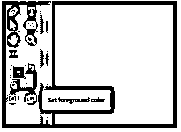

现在从工具面板中选择一个笔刷工具。

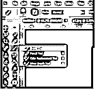

现在选择图层蒙版的固体层点击它。

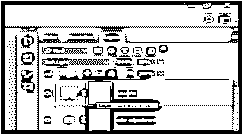

拿一个软笔刷，增加笔刷的大小。

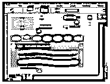

现在用笔刷在你的照片上随意点击一下，用这样的笔刷给它上色，在点击的时候得到这个固体层的清除效果。

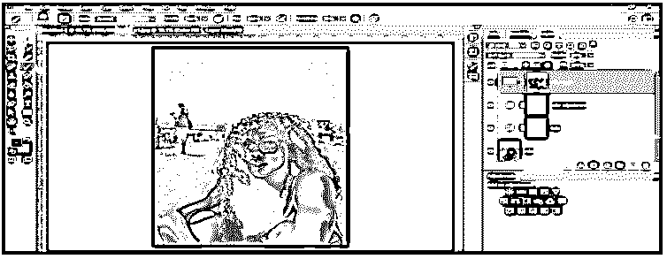

再次选择一个纯色图层，选择亮黄色作为纯色图层的颜色。

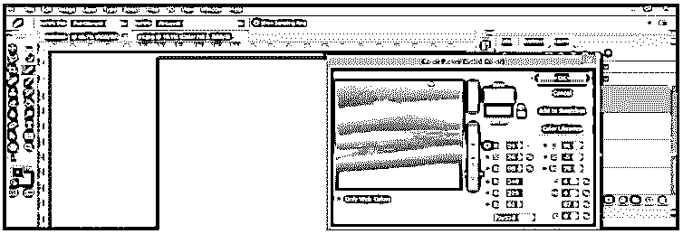

减少这一层的不透明度为 50%，并选择柔光选项作为这一层的模式选项。

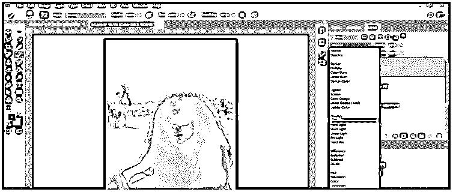

现在选择这一层的图层蒙版，用笔刷工具做同样的事情，就像我们对之前的实体图层做的一样，这意味着用笔刷工具在你的照片上随机点击一下，在点击时获得这个实体图层的清除效果。

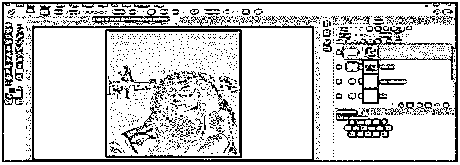

现在复制极地层。选择这一层并按下键盘的 Ctrl + J 键进行复制。

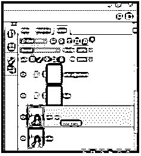

现在选择这个复制层，进入菜单栏的过滤器菜单，然后点击它。转到列表的模糊选项，并从新列表中选择高斯模糊选项。

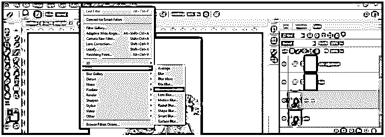

现在设置模糊半径的值为 8.0。

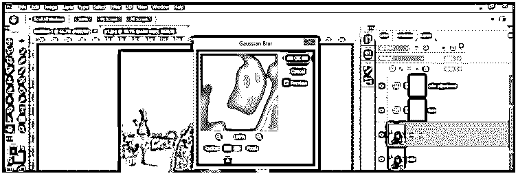

现在根据你想要的图像平滑度来调整这个模糊层的不透明度。我会根据自己的选择将其设置为 60 %。

现在在图层面板中选择图层，按下键盘上的 Ctrl + E 键将它们一个一个地合并到一个图层中。

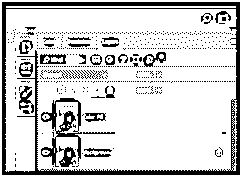

这是你最后的宝丽来效应图像。您可以根据自己的选择将它设置在相框中，让它看起来更真实。

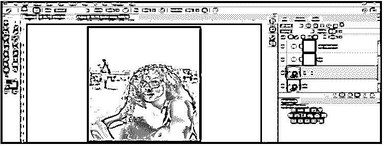

### 结论

现在看完这篇文章，你可以理解 Photoshop 中的宝丽来效果，以及如何在你的照片上创建它，让你的图像看起来更复古。你可以从这篇文章中获得灵感，为你的形象尝试一下。

### 推荐文章

这是一个 Photoshop 宝丽来指南。这里我们讨论如何使用不同的工具在 Photoshop 中创建宝丽来效果。您也可以看看以下文章，了解更多信息–

1.  [Photoshop 扭曲效果](https://www.educba.com/photoshop-distort-effect/)
2.  [Photoshop 中的变形](https://www.educba.com/morphing-in-photoshop/)
3.  [Photoshop 中的毛刺效果](https://www.educba.com/glitch-effect-in-photoshop/)
4.  [变换工具 Photoshop](https://www.educba.com/transform-tool-photoshop/)

