# 像素效果 Photoshop

> 原文：<https://www.educba.com/pixel-effect-photoshop/>

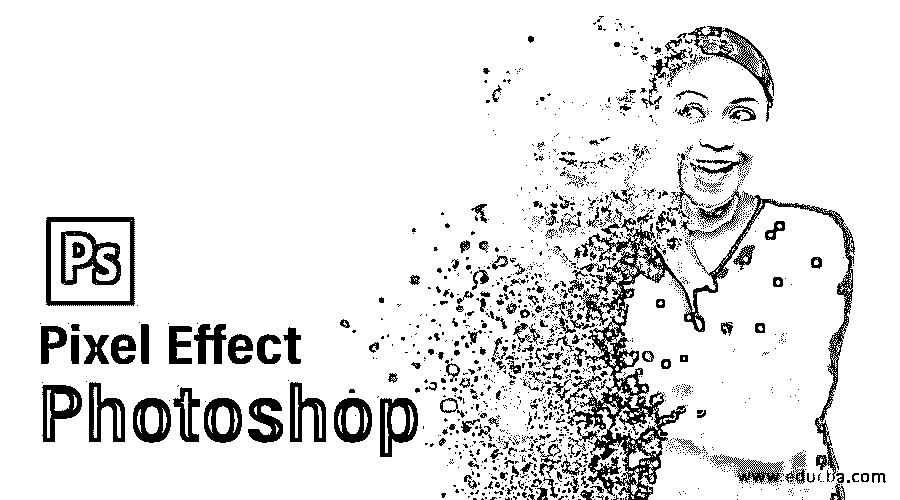

## Photoshop 中的像素效果介绍

Photoshop 是由 adobe systems 开发的图像编辑软件。我们可以通过使用该软件的一些功能和技术在该软件中创建不同类型的效果。像素是一种效果，通过使用该软件的一些功能，您可以创建一个图像像素散射的幻觉。在这篇文章中，我们将学习如何在我们的图像上添加像素效果，也学习如何处理像素效果创建的不同功能的参数。所以让我们开始讨论这个话题。在这个主题中，我们将像素效果 Photoshop。

### 如何在 Photoshop 中创建像素效果？

我们可以通过使用创建这种效果的不同特征的几个步骤来在我们的图像上创建这种效果。但在开始之前，我们应该有一个这个软件的工作屏幕的概述，以便我们可以更好地理解这个主题。

在工作屏幕的顶部，有一个称为菜单栏的功能区，它有一些菜单，如文件、编辑、图像和其他一些菜单。在这个栏下面，我们有另一个栏，我们称之为活动工具或活动图像的属性栏。在第二个栏下面，我们有一些部分，在左侧我们有一个工具面板，在中心我们有一个显示窗口，在右侧我们有一些面板，如颜色，层面板和其他一些。您可以在本软件用户界面的任何位置根据您的选择重置所有这些部分。

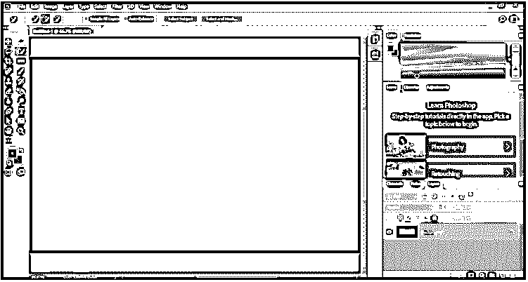

现在让我们有一个形象的学习。你可以拍摄你的照片或者从网上下载。我从网上下载了一张图片。所以去文件菜单点击它。点击文件菜单下拉列表中的打开选项，在该软件中放置图像。

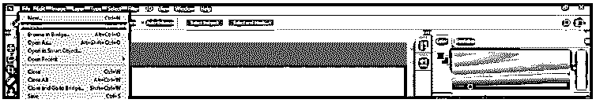

现在将会打开一个对话框。转到您个人计算机上保存图像的文件夹，单击选择您想要的图像。选择 make 后，单击此对话框的打开按钮。

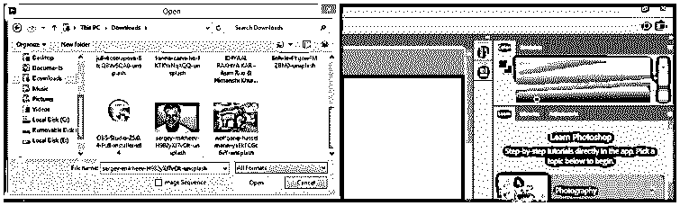

放置图像后，从该软件的工具面板中选择快速选择工具，在图像中进行选择。

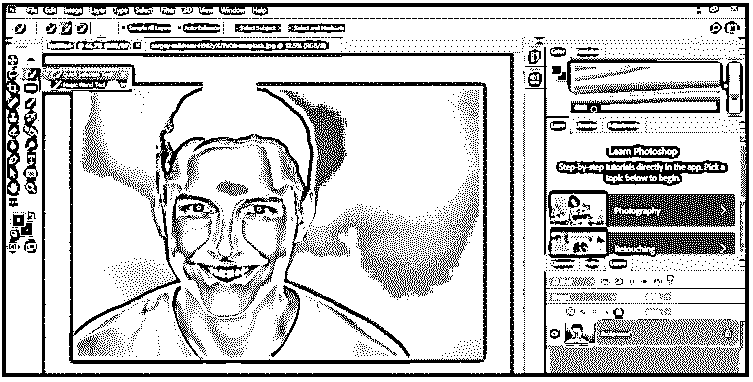

在这个人的周围做一个合适的选择，然后在选择区域用鼠标右键点击。点击下拉列表中的“复制图层”选项。

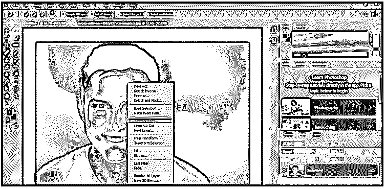

一旦你点击它，一个带有透明背景的拷贝将会在图层 1 中创建。现在转到这个软件的工具面板，点击矩形选框工具。

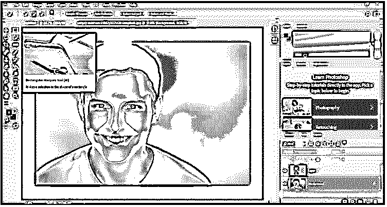

现在去图层面板，选择背景层，然后在这个人的周围做一个这样的选择。一旦你有了选择，用鼠标右键在选择区域点击右键，从下拉列表中选择填充选项。

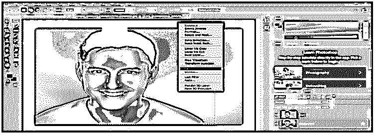

现在将打开一个填充对话框，从该框的内容选项中选择内容感知选项，然后按下该框的确定按钮。

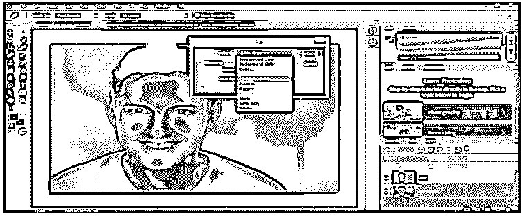

现在拖动图层 1 到图层面板的“创建新图层”按钮，复制一个图层。

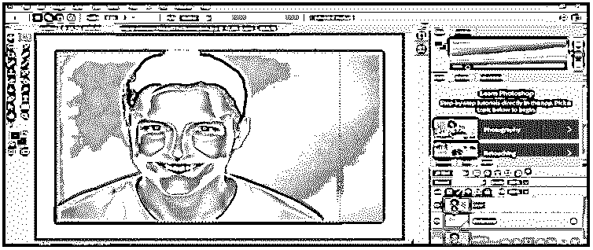

现在选择层 1，并再次在选择区域右键单击。从下拉列表中选择“自由变换”选项。

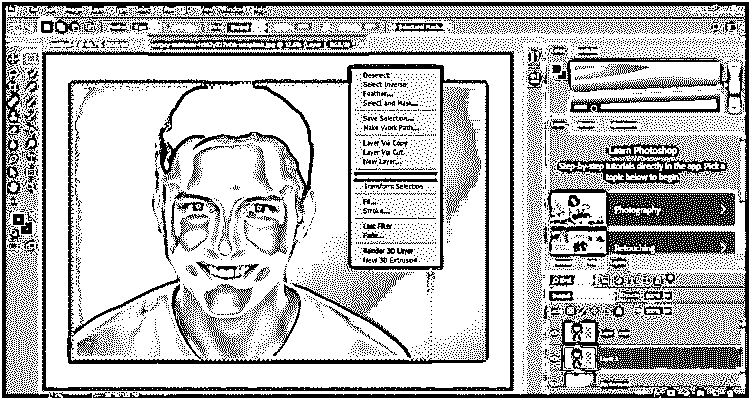

现在，一个变换框将出现在这个图像的周围，所以像这样拖动变换框的边界来增加这个图像的大小。

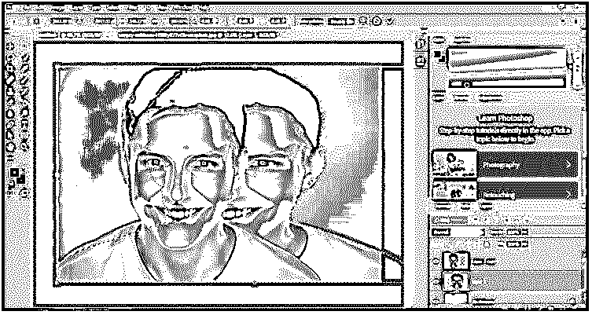

现在转到这个软件的图层面板的底部，点击添加图层蒙版按钮，在图层 1 上添加蒙版。

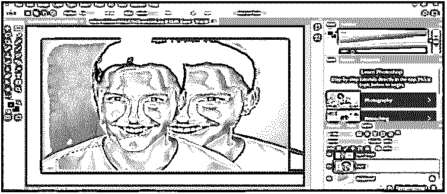

现在在工具面板的颜色框中设置前景色为黑色，背景色为白色。

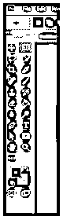

现在点击这层的蒙版，进入工具面板，然后使用油漆桶工具。

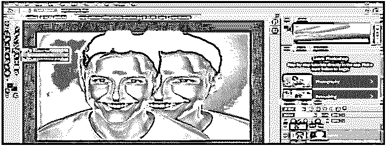

现在用桶工具在蒙版图像上涂上颜色，它会像这样覆盖你的图像。

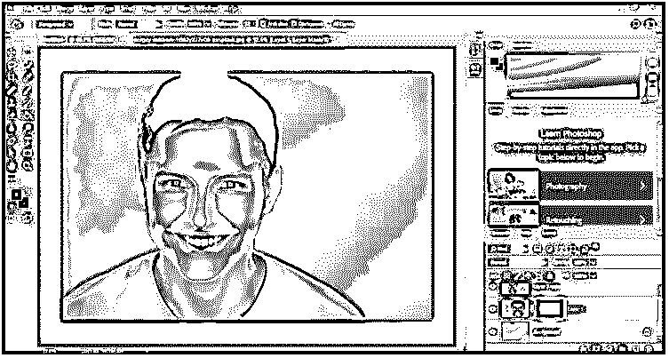

现在在图层部分选择图层副本 1，点击图层面板的添加蒙版按钮，在图层中添加蒙版。

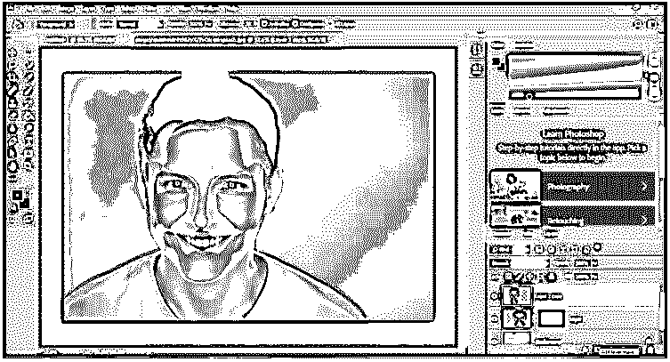

现在点击这层的蒙版，从这个软件的工具面板里拿一个笔刷工具。

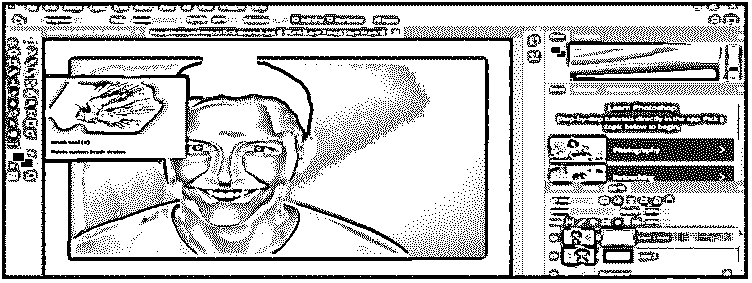

现在从笔刷大小框中选择硬笔刷或软笔刷。

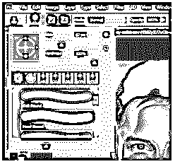

现在点击“切换笔刷设置面板”选项。

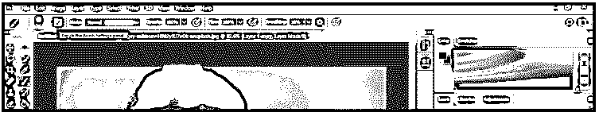

现在在笔刷设置框中选择散射选项，设置散射值为 1000%。

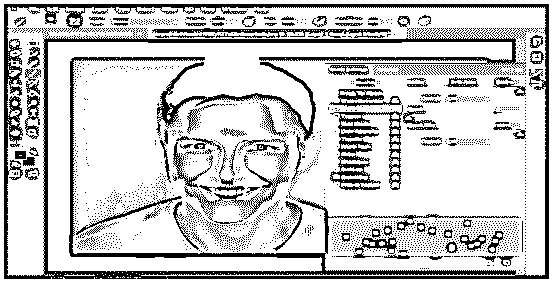

现在点击形状动态选项，设置尺寸抖动选项值高达 90 %。

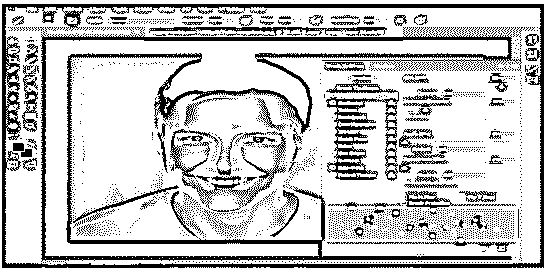

现在根据你的要求调整笔刷的大小，在笔刷属性栏的笔刷大小选项中，用这样的笔刷在图层蒙版上涂抹颜色。确保前景色是黑色。

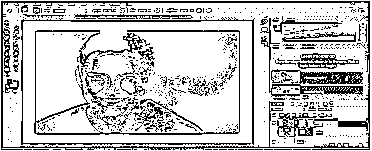

现在选择另一层的黑色蒙版。

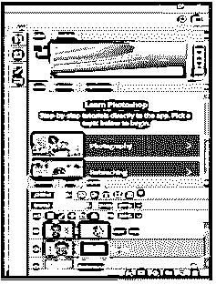

改变前景色为白色，然后像这样刷。

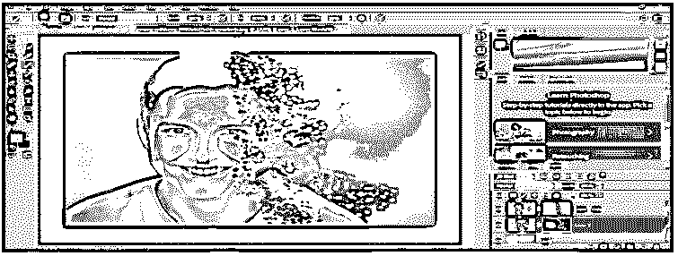

现在选择图层 2，点击图层面板的功能按钮。从列表中选择混合选项。

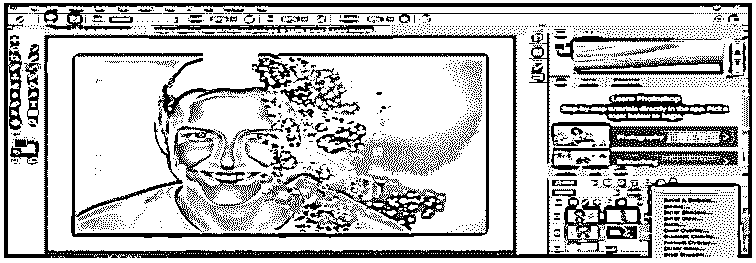

点击打开的对话框的投影选项。减少阴影选项的不透明度到 50%,并通过在图像区域拖动这个图层来调整像素的阴影。

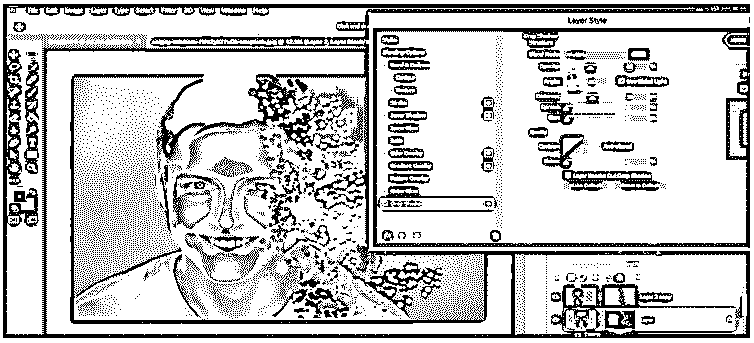

现在再次复制第二层。

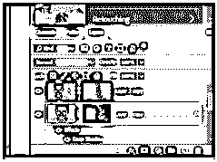

选择图层 2 的蒙版，然后点击菜单栏的滤镜菜单。转到下拉列表的风格化选项，并从新建下拉列表中选择风选项。

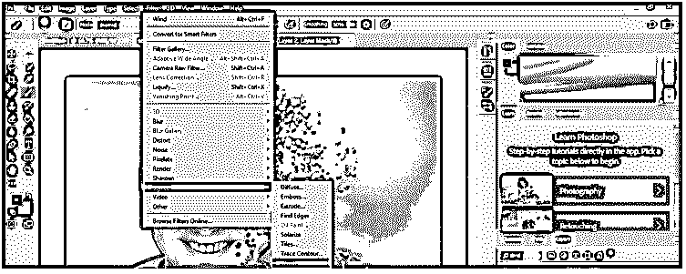

一盒风会被打开。从该框的方法选项中选择风选项，并按下该框的确定按钮。

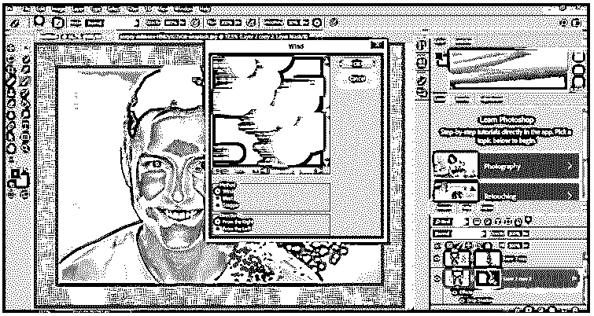

你可以看到风对图像像素的影响。

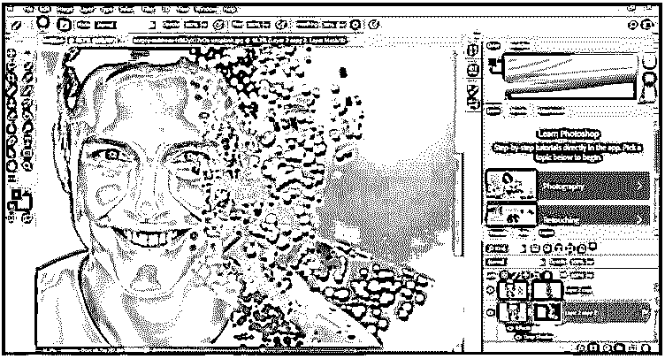

这样，你就可以在你的图像上做出像素效果。

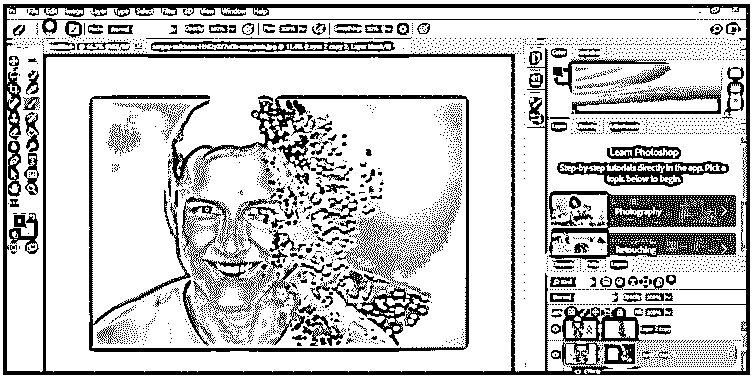

### 结论

现在看完这篇文章，你可以理解什么是 Photoshop 中的像素效果，以及如何为你的图像创建像素效果。通读本文后，您也可以轻松处理此效果的参数。通过实践，你可以很好地掌握这个特性。

### 推荐文章

这是一个像素效果 Photoshop 的指南。在这里，我们讨论如何在 Photoshop 中创建一个像素效果，并概述了该软件的工作屏幕。您也可以看看以下文章，了解更多信息–

1.  [Photoshop 中的消失点](https://www.educba.com/vanishing-point-in-photoshop/)
2.  [变换工具 Photoshop](https://www.educba.com/transform-tool-photoshop/)
3.  [如何在 Photoshop 中打印？](https://www.educba.com/how-to-print-in-photoshop/)
4.  [Photoshop 扭曲效果](https://www.educba.com/photoshop-distort-effect/)

