# Photoshop 创意

> 原文：<https://www.educba.com/photoshop-creative/>

## Photoshop Creative 简介

创意是一种技术或功能，通过这种技术或功能，您可以在编辑图像时探索您的想法，使其看起来比通常更有创意，并使其与专业图形设计作品相关。在 Photoshop 中，我们可以通过使用该软件的不同工具和功能对图像进行创造性编辑来理解它。为了获得关于这个主题的知识，我们将对我们的图像进行创造性的工作，并理解我们学习中包含的不同参数。那么让我们开始学习 Photoshop 这个话题，通过一个激动人心的例子来了解它。

### 如何在 Photoshop 中进行创意工作？

你可以应用你的想法在这个软件中用图像编辑做任何创作工作，并一次又一次地对那个创作工作的参数做不同的改变，以获得最好的结果。因此，我将在本文中给你一个创造性工作的概念，但在开始之前，你必须先了解这个软件的工作屏幕，这样你才能更好地理解我在本文中对这个主题的解释。

<small>3D 动画、建模、仿真、游戏开发&其他</small>

在工作屏幕的顶部，有一个不同菜单的菜单栏，有助于处理本文的不同参数，该屏幕的第二部分是属性栏，向您显示活动工具或图像的参数，您可以在工作的任何时候更改它们的参数。该软件的第三部分有三个部分，在左侧我们有一个工具面板，在中心我们有一个显示窗口，在右侧我们有一些标签，如颜色标签，图层面板和其他一些重要的标签。您可以根据自己的选择重新排列所有这些部分。

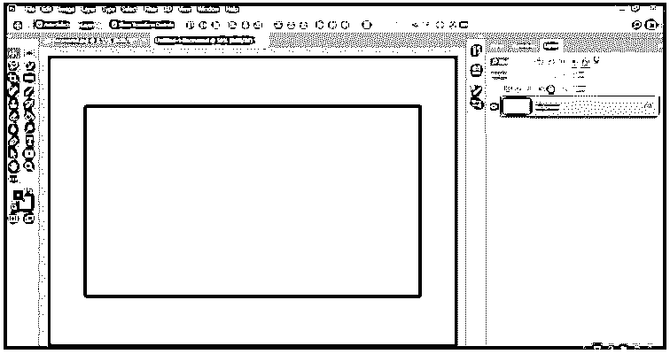

现在让我们在这个软件中有两个图像来学习这个主题。要放置图像，请转到该软件菜单栏的文件菜单并单击它，从下拉列表中选择打开选项。

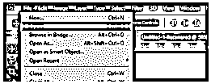

将打开一个放置图像的对话框。转到您个人计算机中保存图像的目标文件夹，从那里单击选择您想要的图像，然后单击此框中的打开按钮。

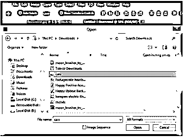

现在我在这个软件里放了两张图片。有一个手机图像是这样的。我们将从这张图片开始，从这个软件的工具面板中选择一个钢笔工具，点击它的图标。

在钢笔工具的帮助下，围绕手和移动进行选择，完成后，用鼠标右键单击图像，然后单击下拉列表中的“进行选择”选项。

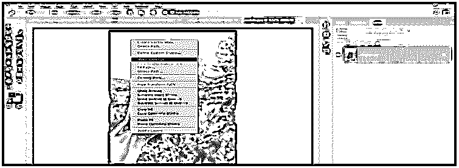

单击此选项后，将打开一个选择对话框，可对选择参数进行一些更改。按下此框的“确定”按钮。

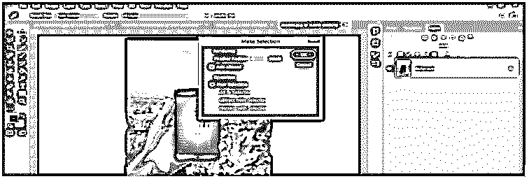

一旦您按下“确定”按钮，您的选择将变成这样。

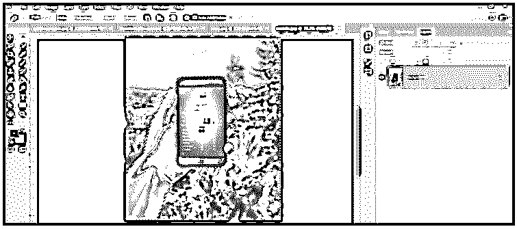

现在转到本软件菜单栏的选择菜单，点击下拉列表中的反向选项，选择带移动选择区的手。然后按下键盘上的 Ctrl + C 键来处理你所选择的手的区域并移动这个图像。

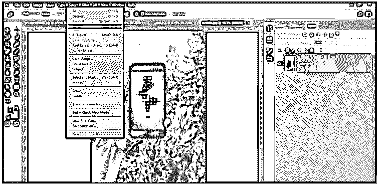

转到该软件的另一个图像标签，按下键盘上的 Ctrl + V 键，将移动图像的选定区域粘贴到这里，就像这样。

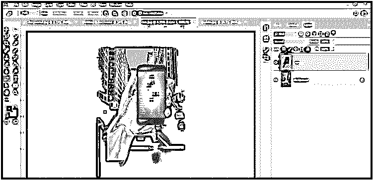

现在按下键盘上的 Ctrl + T 键，在这个图像的变换框上点击右键。将打开一个变换框的下拉列表，通过单击从列表中选择倾斜选项。

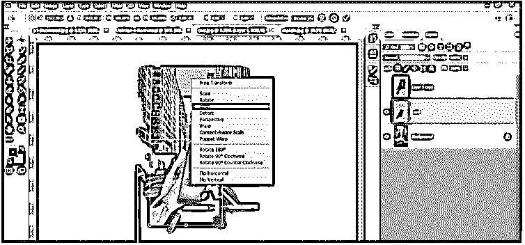

现在像这样调整移动图像，在倾斜工具的帮助下调整变形框的定位点，再次点击工具面板上的钢笔工具。

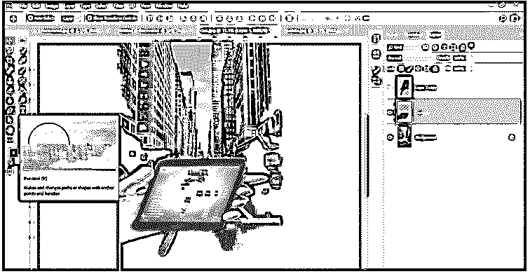

现在用钢笔工具在手机屏幕上做一个选择，就像这样。

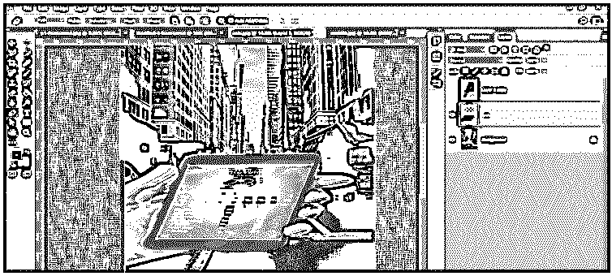

然后点击右键。将打开一个下拉列表，通过单击从列表中选择“进行选择”选项。

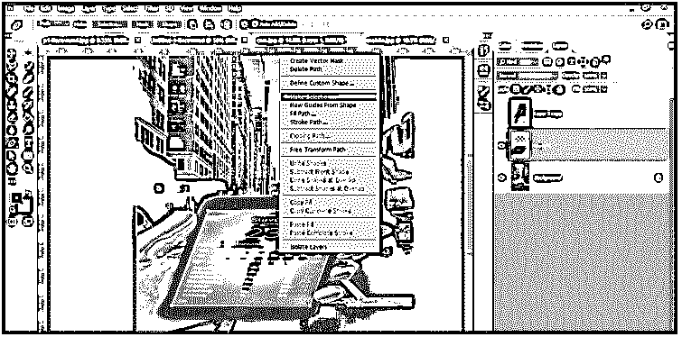

现在将打开一个选择对话框，按下该选择框的确定按钮。

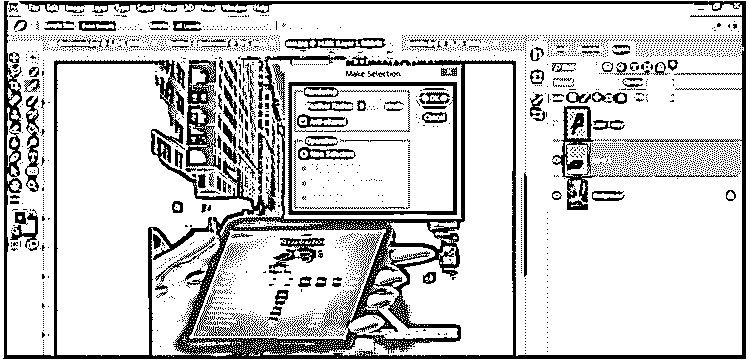

要再次反转选择，请转到该软件菜单栏的选择菜单，并单击下拉列表中的反转选项进行选择。

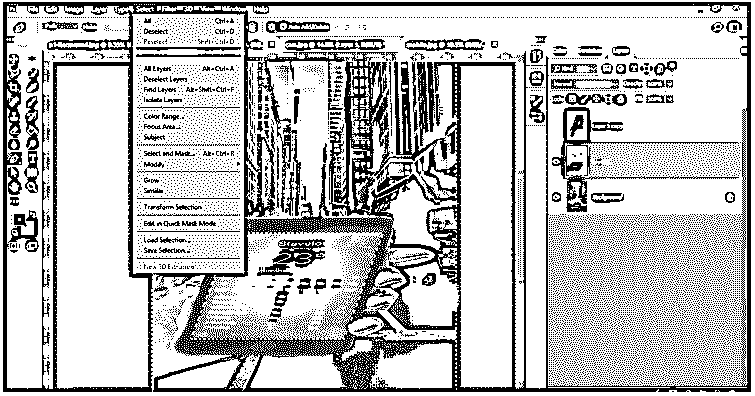

现在按下键盘上的 Ctrl + X 键，进入手机的剪切屏幕。

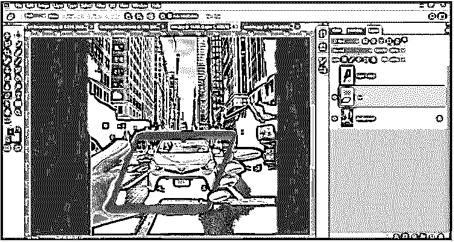

再次使用倾斜工具，像这样调整移动图像的角度。然后在工具面板的颜色框中设置黑色为前景色，白色为背景色。

现在到这个软件的图层面板的底部，点击添加蒙版按钮，在图层 1 中添加蒙版。

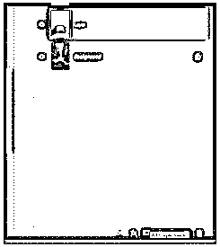

现在从这个软件的工具面板中点击一个笔刷工具。

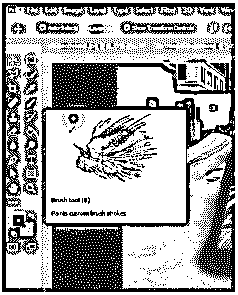

如果没有选中图层蒙版，点击它来选择图层蒙版。

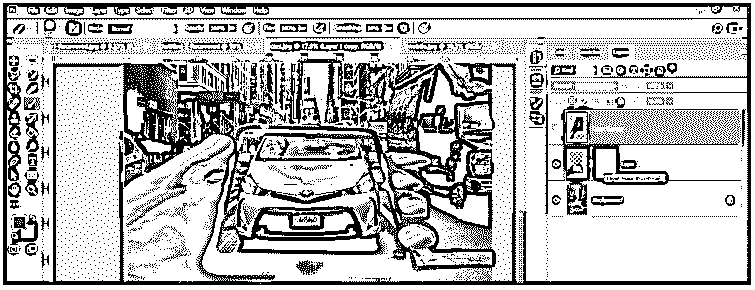

然后选择一个软笔刷，从笔刷工具属性栏的大小选项中调整笔刷的大小。

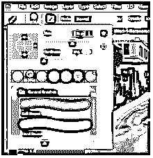

在笔刷工具的帮助下，画出移动图像边界的上部区域，从这里开始擦除，就像这样。

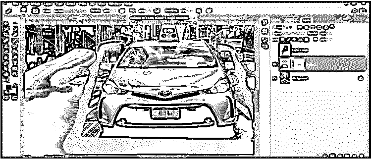

如果你不小心擦掉了更多的区域，不要担心。转到工具面板，切换前景色为白色。

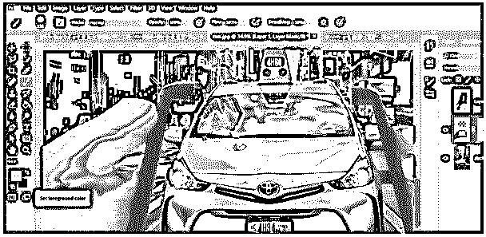

并用画笔工具再次绘制您想要恢复已擦除区域。

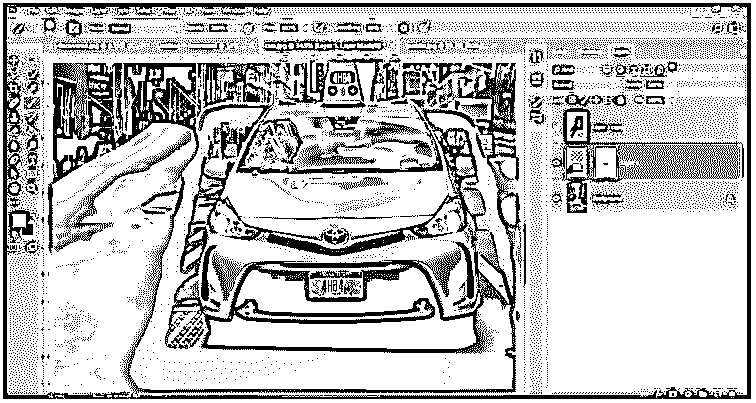

通过这种方式，你可以通过对你的图像进行这种类型的创造性编辑来为观众创造一种错觉。

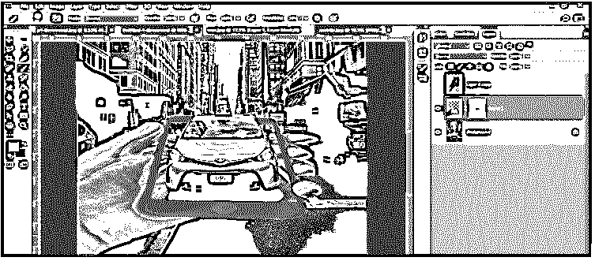

现在我认为你可以理解创造性的工作，并能够用你的想法在你的图像上进行创造性的工作。

### 结论

现在看完这篇文章，你可以理解什么是 Photoshop 中的创造性工作，以及你如何用一个创造性的想法编辑你的图像。从这篇文章中得到一个想法，你可以使用这个软件的其他工具来创作你的图像。在这篇文章中，我们只是讨论了创造性工作的一个例子，作为创造性工作，你可以做更多的好事。

### 推荐文章

这是 Photoshop 创意指南。在这里，我们讨论如何在 Photoshop 中进行创造性的工作，并用一个激动人心的例子来更好地理解。您也可以看看以下文章，了解更多信息–

1.  [变换工具 Photoshop](https://www.educba.com/transform-tool-photoshop/)
2.  [如何在 Photoshop 中绘画？](https://www.educba.com/how-to-paint-in-photoshop/)
3.  [Photoshop 中的鱼眼效果](https://www.educba.com/fisheye-effect-in-photoshop/)
4.  [在 Photoshop 中调整对象大小](https://www.educba.com/resize-object-in-photoshop/)

