# MP4 转 GIF Photoshop

> 原文：<https://www.educba.com/mp4-to-gif-photoshop/>

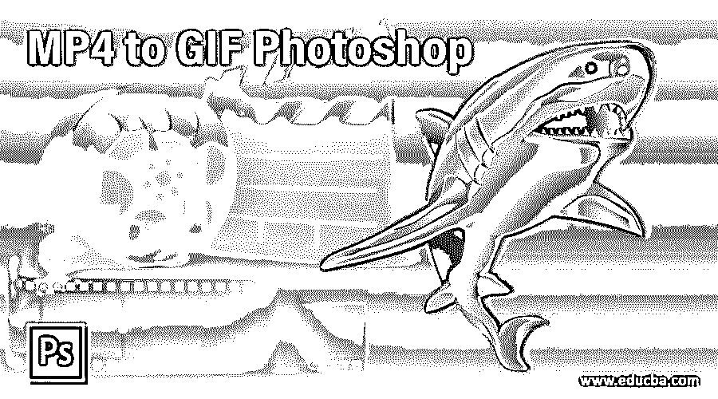

## MP4 转 GIF Photoshop 入门

mp4 转 GIF 是我们通过设置该软件的不同参数将 MP4 文件转换成图像文件的过程，GIF 作为视频文件工作，即使它有图像文件扩展名。为了在这个软件中将 mp4 文件转换成 GIF，我们必须管理这个软件的一些重要功能，并且通过使用这个软件的一些工具，我们可以为我们的项目工作制作一个好的 GIF。通过选择 GIF 视频素材的帧范围，您可以将任何 mp4 视频素材转换为 GIF。我们将通过一个激动人心的例子来讨论将 mp4 转换成 GIF 的过程，让我们开始吧。

### 如何在 Photoshop 中将 MP4 转换成 GIF？

我们可以在这个软件中完成这项工作，只需遵循几个简单的步骤，并对一些重要的参数进行更改。但是在开始之前，我们应该看一下这个软件的工作屏幕，以便更好地理解这篇文章中的主题。

<small>3D 动画、建模、仿真、游戏开发&其他</small>

**步骤 1:** 在用户界面的顶部，菜单栏有许多菜单，通过这些菜单，我们可以在本软件中进行不同类型的参数管理。在这个菜单栏下面，我们有一个属性栏，通过它您可以更改活动工具或图像的参数。在这个条的下面，我们在这个软件的用户屏幕的左侧有三个部分；我们有一个工具面板，其中有不同的工具，使我们在这个软件中的工作变得容易，在中心，我们有一个显示单元，我们可以在其中看到我们当前的工作，在右侧，有一些标签，如颜色，样本和图层面板。你可以在这个软件的用户界面的任何地方根据你的选择管理所有这些部分。

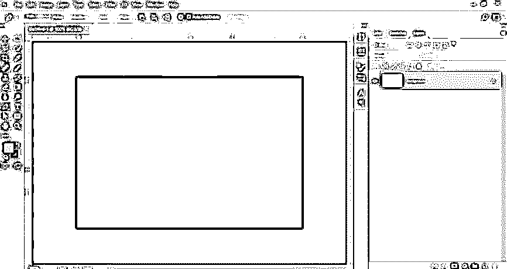

**第二步:**为了学习这个话题，我们必须在这个软件中导入视频素材。所以为了导入视频素材，去这个软件菜单栏的文件菜单，点击它。将会打开一个下拉列表。转到此列表的导入选项。点击新下拉列表中的“视频帧到层”选项。

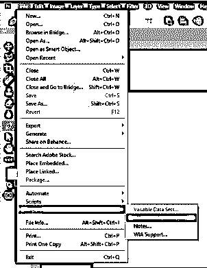

**步骤 3:** 开始导入视频素材需要一些时间。

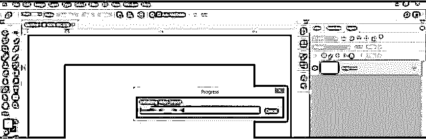

**第四步:**现在会打开一个对话框。转到保存视频素材文件夹，单击选中它。一旦你选择点击这个对话框的打开按钮，在这个软件中导入这个视频。

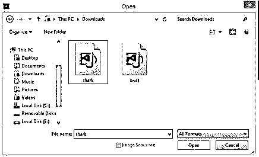

**第五步:**现在“将视频导入图层”对话框将会打开。单击“仅选定范围”选项的单选按钮，从此视频素材中为 GIF 选择一个范围。我从网上下载了这段视频。您也可以下载它供您学习或为此拍摄自己的视频片段。

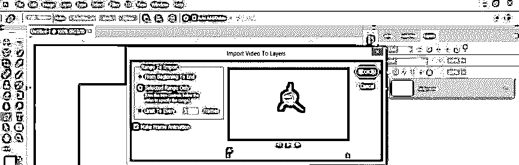

**第六步:**现在，移动视频播放比例的滑块来选择范围。我将在这一点上设置结束滑块。可以根据你来设置。一旦你设置好了，就按这个框的 Ok 键。

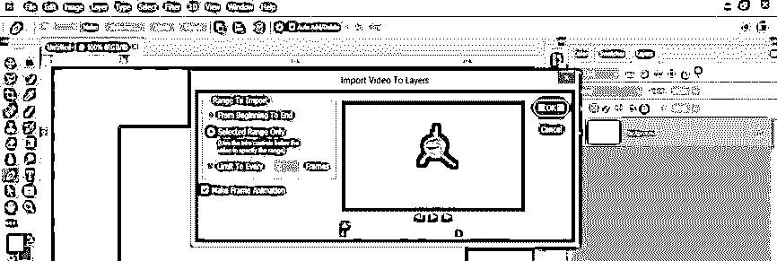

**第 7 步:**再次显示一个对话框，询问您是否要继续，点击该对话框的继续按钮。

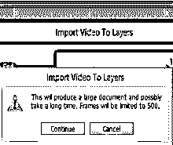

第八步:为你选择的框架范围制作图层需要一些时间。

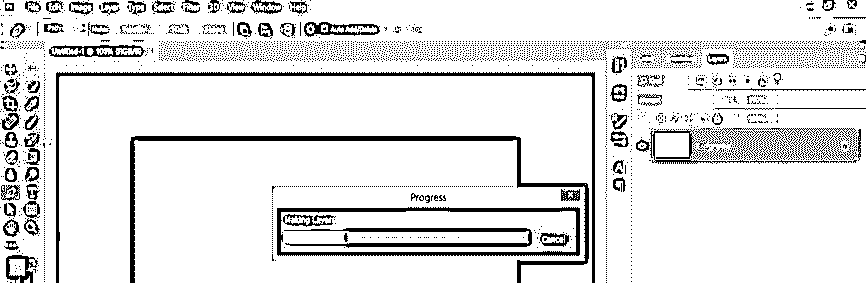

**第九步:**完成这个过程后，它会像这样在这个软件的图层面板里把你选中的范围分割成每一帧。我的视频素材有一个透明背景，因此它将以透明背景导入。你可以拍一段有背景的视频。

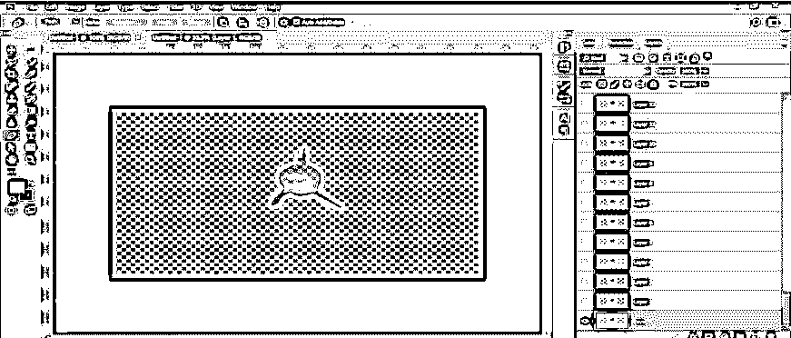

第十步:或者你可以根据自己的选择添加背景，并将下面的背景放置到这段视频的所有图层中。

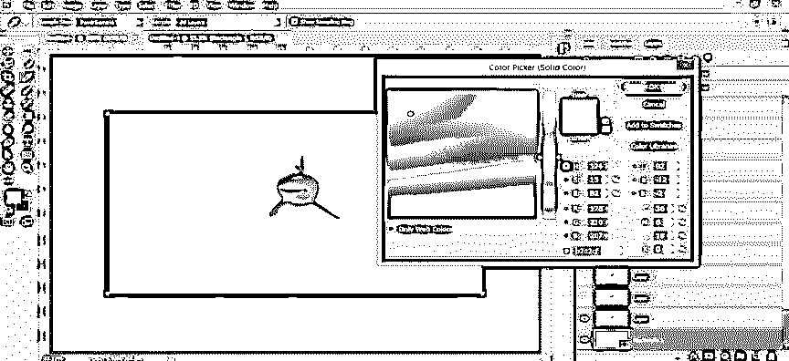

**步骤 11:** 现在再次进入菜单栏的文件菜单，点击它。转到下拉列表的导出选项，选择“保存为 Web 格式”“新建”下拉列表中的选项。

**第十二步:**会这样打开一个对话框。打开此对话框可能需要一些时间。

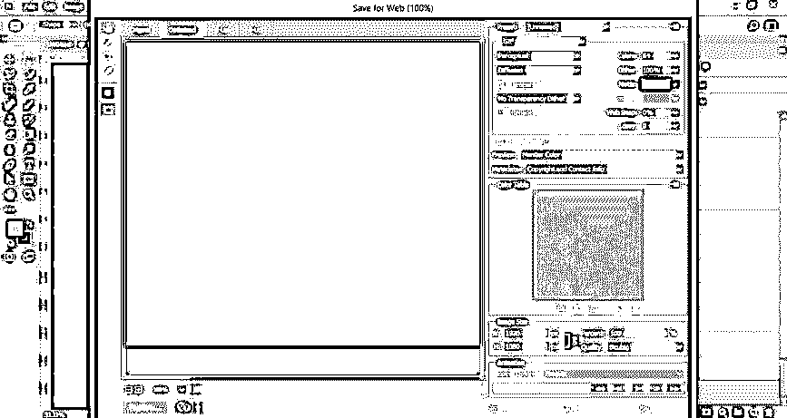

**步骤 13:** 在根据您的选择设置 GIF 参数的过程中，您可以从该选项中减少视频素材的百分比，以便正确显示视频和快速处理。

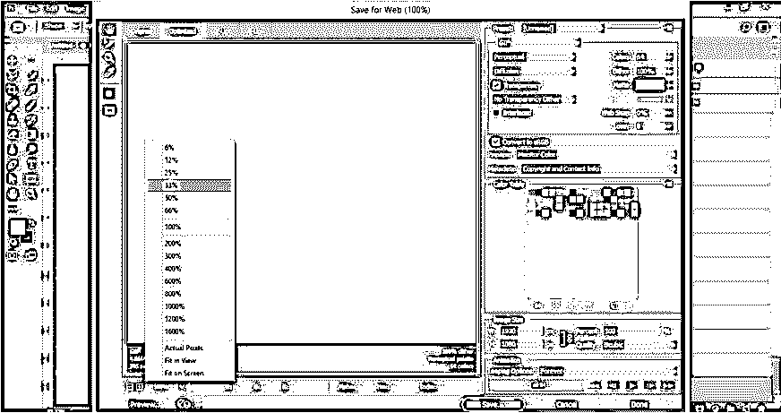

**步骤 14:** 现在，在这个选项中选择 GIF，将这个视频制作成 GIF。

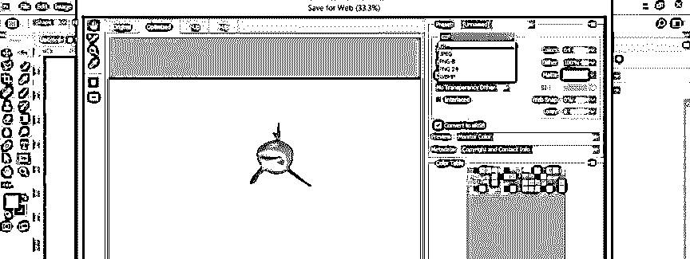

**步骤 15:** 您可以通过此选项最小化视频素材的颜色范围，以减小文件大小。比如，我会选择 32 个值，然后让我们看看会发生什么。

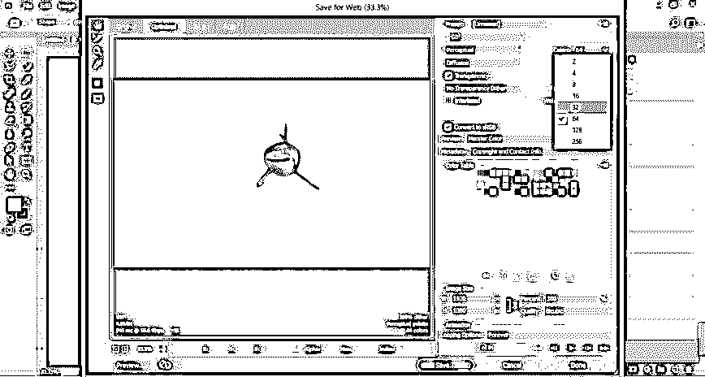

**步骤 16:** 再次改变到这个值需要几秒钟。现在 GIF 图像会变得模糊成这样。所以要根据自己 GIF 的质量来选择合适的色彩范围。

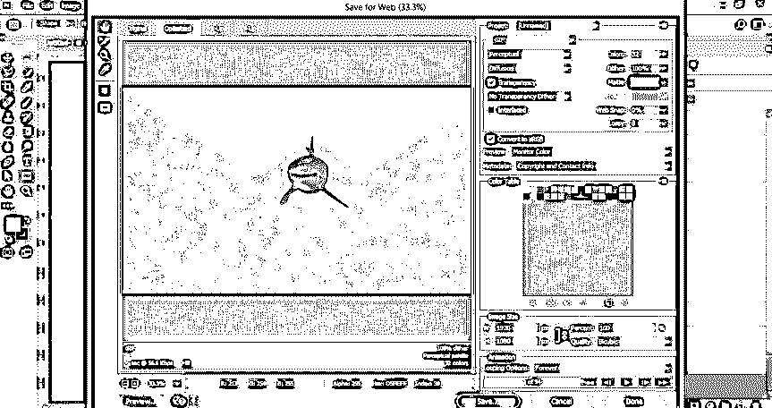

**步骤 17:** 点击这个对话框的预览按钮，可以看到你的 GIF 的预览。这意味着它会显示你的 GIF 在网页上的样子。

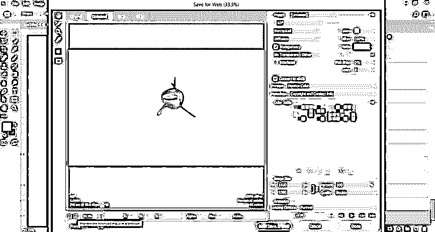

**第十八步:**一旦你点击预览按钮，就会打开这样一个窗口，你可以在这里看到所有的参数和你的 GIF 的预览。

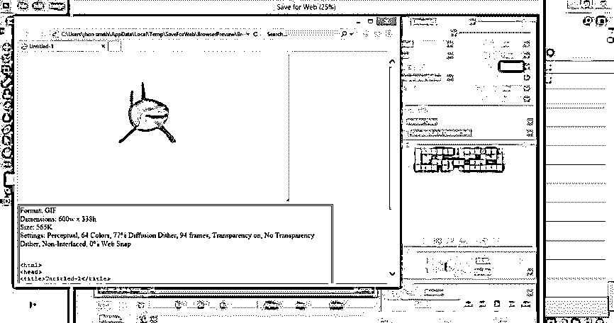

**第 19 步:**您可以通过此选项更改 GIF 图像的大小。

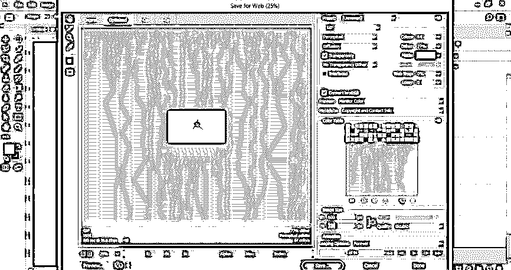

**步骤 20:** 根据 GIF 文件要求设置好所有对话框参数后，点击该对话框的保存按钮，将其保存为 GIF 文件。

第 21 步:会打开一个对话框，让你在你的个人电脑中选择一个位置来保存你的 GIF，所以选择你想要的位置，并根据你的名字来命名。我将它命名为 Shark，然后点击 Save 按钮将其保存为 GIF。

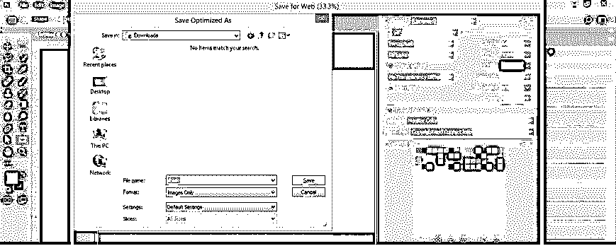

**步骤 22:** 现在去你保存的位置打开。你现在可以看到一个 GIF 文件。

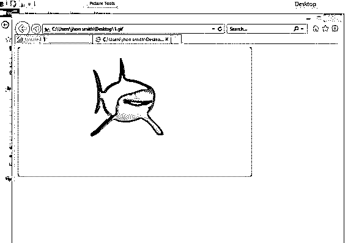

这样，您可以在 Photoshop 软件中将 mp4 文件转换为 GIF，并以不同的方式用于您的项目工作。

### 结论

通读这篇文章之后，你就可以理解如何将 mp4 文件转换成 GIF，以及如何处理从 MP4 获取 GIF 的不同参数。通过反复练习 Photoshop 的这些功能，你可以用 mp4 制作出高质量的 GIF。

### 推荐文章

这是一个 MP4 转 GIF Photoshop 的指南。这里我们讨论一个介绍，在 Photoshop 中把 MP4 转换成 GIF 的简单步骤。您也可以浏览我们的其他相关文章，了解更多信息——

1.  [Photoshop 中的消失点](https://www.educba.com/vanishing-point-in-photoshop/)
2.  [Photoshop 中的变形](https://www.educba.com/morphing-in-photoshop/)
3.  [Photoshop 中的 3D 文本](https://www.educba.com/3d-text-in-photoshop/)
4.  [您必须探索的 Adobe Photoshop 十大功能](https://www.educba.com/top-10-features-in-adobe-photoshop/)

