# Photoshop 中的模板

> 原文：<https://www.educba.com/templates-in-photoshop/>

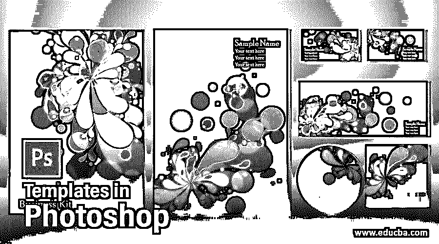

## Photoshop 中模板的介绍

Photoshop 中的模板是任何文档的预定义形状，以便更好地理解该模板的最终目的。你也可以换一种方式来理解，模板被用作任何网站、企业、个人以及一些其他官方用途的代表卡。在本文中，我们将通过一个专业卡片设计的例子来了解模板，并了解 Photoshop 模板的不同预设及其参数，这些参数是我们在使用模板之前必须了解的。所以让我们以一种非常有趣的学习方式开始我们关于 Photoshop 这个话题的讨论。

### 如何在 Photoshop 中使用和创建模板？

我们可以在 Photoshop 中制作一个不同用途的模板，只需要使用这个软件的一些工具和功能，并且我们必须了解那些工具和功能的一些参数。但是在我们开始我们的主题之前，我想我们应该看一下这个软件的用户界面，这样我们就可以很容易地理解我们在这篇文章中使用的这个软件的不同术语。

<small>3D 动画、建模、仿真、游戏开发&其他</small>

**步骤 1:** 在用户屏幕的顶部，我们有一个菜单栏，它有不同的菜单，如文件菜单、编辑菜单、图像菜单和其他一些菜单。在这下面，我们有活动工具或图像的属性栏，用于更改它们的参数。在这个条下面，我们在左侧有一个工具面板，在中心有一个显示窗口，我们可以在其中看到我们当前的工作；在左侧，我们有不同的标签，如颜色标签，样本标签，图层面板，以及其他一些。您可以根据自己的选择在工作屏幕的任何地方调整所有这些部分。

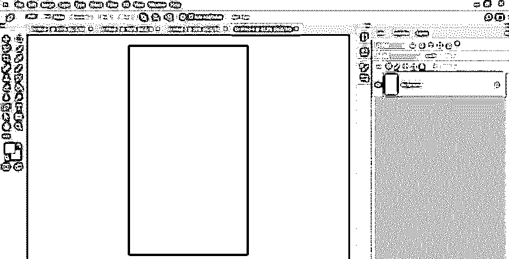

**第二步:**现在，让我们有一个制作专业模板设计的新文档。对于新文档，单击此窗口的“新建”按钮，或者您可以单击“打开”按钮打开已保存的文档。

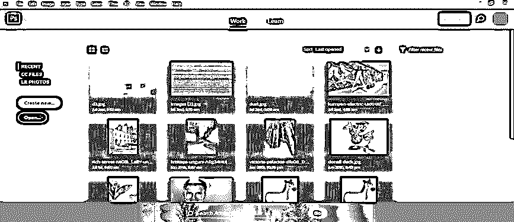

**第三步:**或者你可以点击本软件菜单栏的文件菜单新建一个文件。现在点击下拉列表中的新选项或按 Ctrl + N。

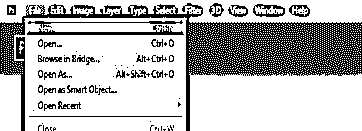

**步骤 4:** 现在，您可以从该列表中选择不同的模板尺寸，或者在宽度和高度框中输入所需的模板尺寸。现在选择你的模板的方向，如横向或波特兰，然后点击这个对话框的创建按钮。

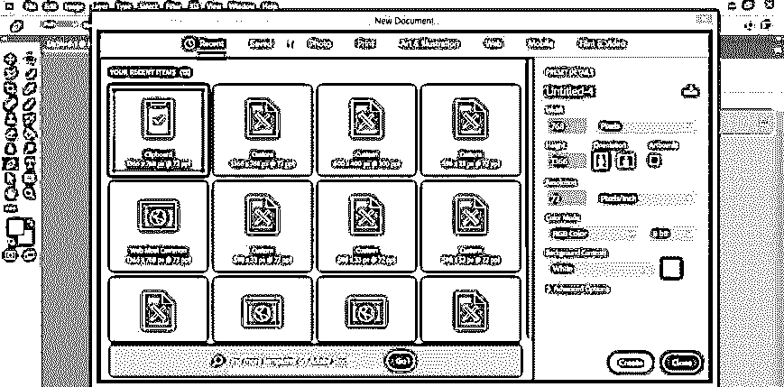

**第五步:**你选择的模板尺寸会像这样出现在这个软件的显示窗口上，作为图层部分的背景图层。

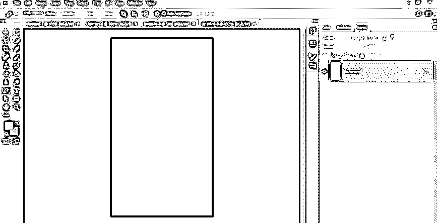

步骤 6: 现在到图层面板的底部，点击新建按钮新建一个图层。

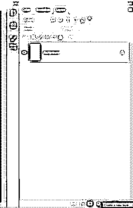

第七步:现在进入工具面板，从这个软件的工具面板中点击一个矩形工具。

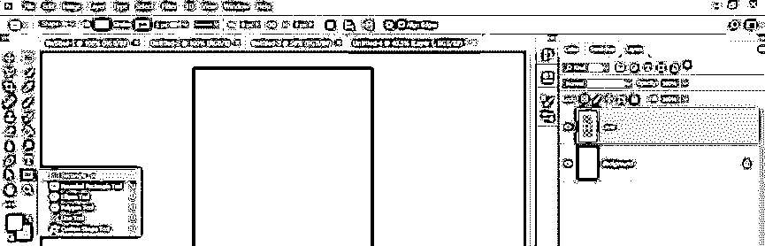

**第八步:**现在，用这个矩形工具做一个这样的矩形。

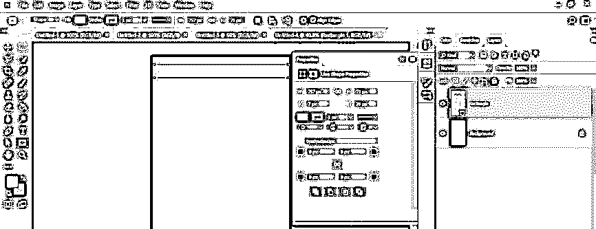

**第九步:**现在在图层部分双击这个矩形的一个图层中的矩形，一旦你点击它，一个颜色选择器框就会打开。从这个盒子里选择你想要的颜色。我将为这个矩形选择一种黄色，然后按下这个对话框的确定按钮。

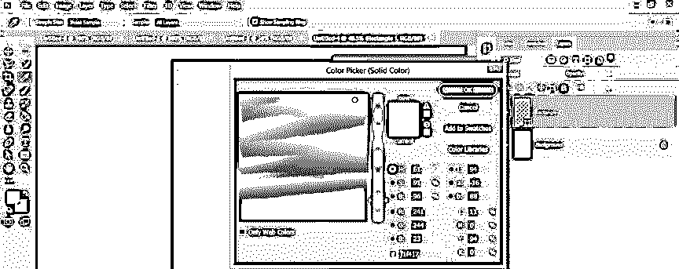

**第十步:**现在，把这个矩形做多个副本。为了制作一个副本，选择这个矩形层，并按下键盘的 Ctrl + J 键。为其他副本重复它。我将复制这一层 3 份。

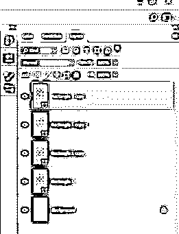

**步骤 11:** 现在，点击特定图层的名称，根据您的需要重命名所有复制图层，以便您更好地理解。我将这些层命名为 r1、r2、r3、r4。

**步骤 12:** 现在使用工具面板的移动工具将它们排列成这样。

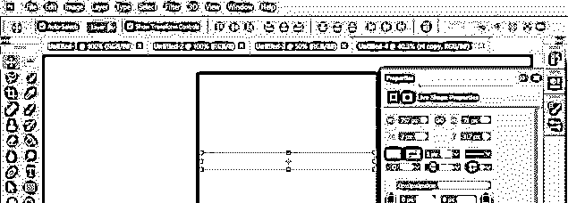

步骤 13: 现在，用同样的方法再复制一个这个矩形。现在我将把它命名为 V1。

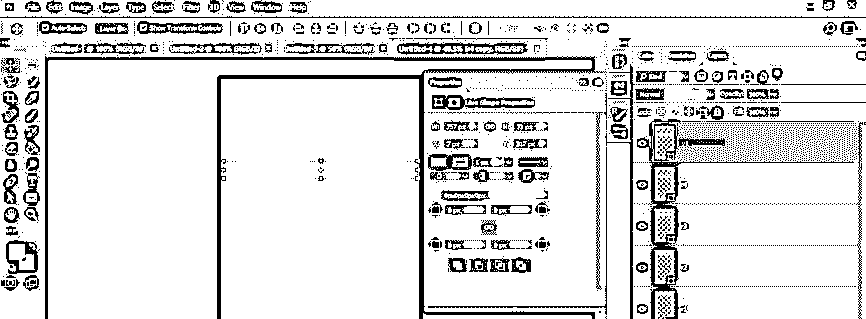

步骤 14: 点击 V1 图层，按下键盘上的 Ctrl + T 键，弹出一个自由变换框。现在右键点击这个图层，选择“顺时针旋转 90 度”选项，将其旋转 90 度。

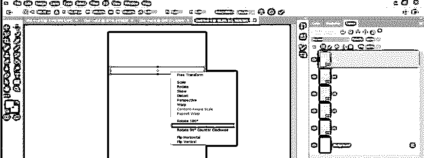

**步骤 15:** 现在，改变这个矩形的颜色。要改变颜色，双击 V1 图层中的矩形。将打开一个颜色选择器框；从这个盒子里选择你想要的颜色。我将选择这种颜色，然后按下这个框的“确定”按钮。

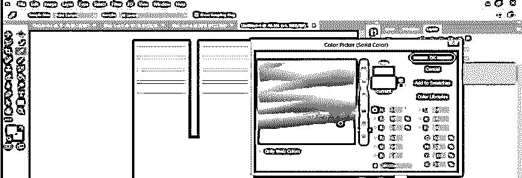

**第十六步:**再次，通过按键盘的 ctrl + J 键，将这个 V1 矩形复制多份，我将它们命名为 v2、v3、v4，以便使用时更好理解。为了更好的测量，你可以从这个软件的窗口菜单中打开标尺。点击标尺选项，或者你可以使用快捷键 Ctrl + R。

第十七步:现在像这样排列这些矩形。

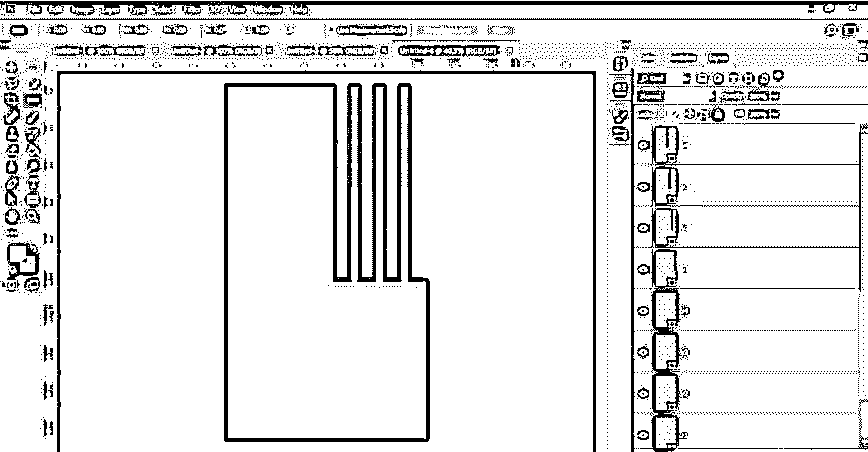

**步骤 18:** 现在按住 shift 键选择所有黄色矩形图层，按下键盘的 ctrl + G 键全部分组。

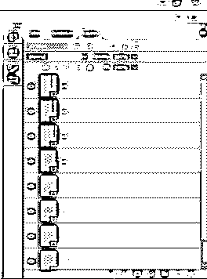

**步骤 19:** 对 v1 矩形图层做同样的操作，全部分组。现在选择 v4 矩形，并按 ctrl + T 的自由变换框周围，使右键单击，然后选择扭曲选项从列表中点击它。

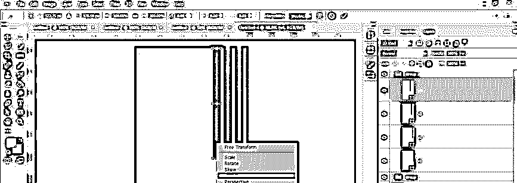

**步骤 20:** 并像这样一个一个扭曲这些矩形。现在，再次从工具面板中点击一个矩形工具。

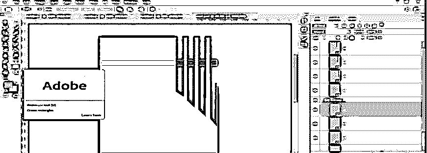

**步骤 21:** 用矩形工具做一个这样的矩形。

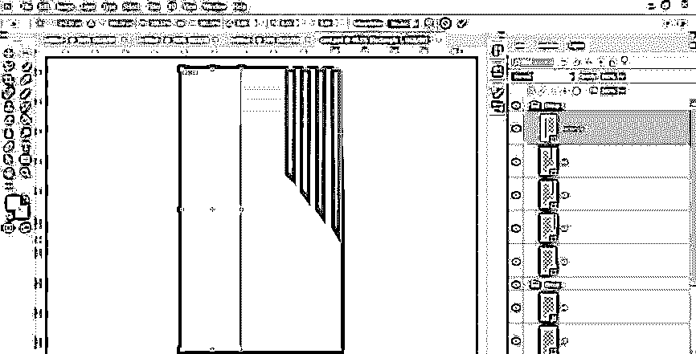

步骤 22: 现在，改变这个矩形的颜色，和 v1 矩形的颜色一样。

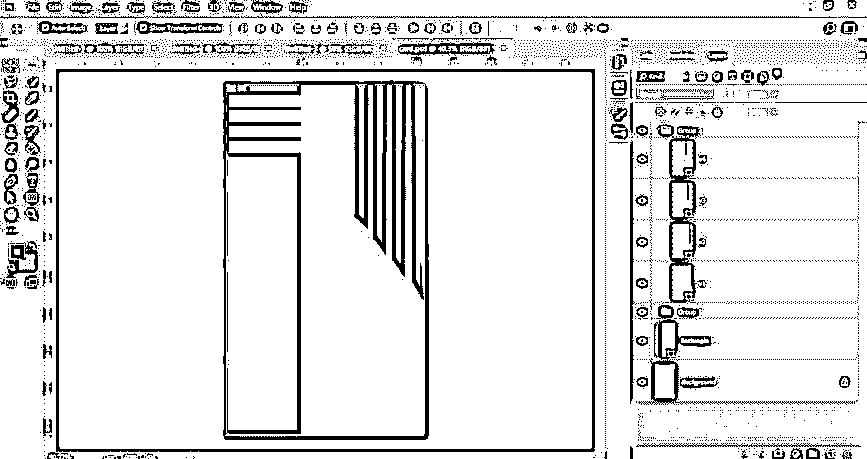

步骤 23: 现在，再次到图层面板的底部，点击图层面板的新建按钮新建一个图层。

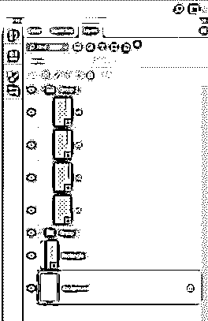

**第 24 步:**现在，从这个软件的工具面板中，通过点击画笔工具。

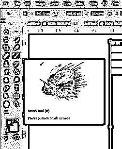

**步骤 25:** 在画笔工具属性栏的大小选项中，根据自己的选择调整大小。

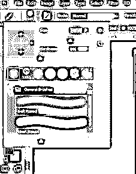

**步骤 26:** 现在，像这样用笔刷工具点击一下。

步骤 27: 现在，点击工具面板中的文字工具。

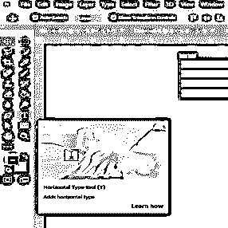

**步骤 28:** 从文本工具属性栏的字体样式选项中选取任意专业字体样式。

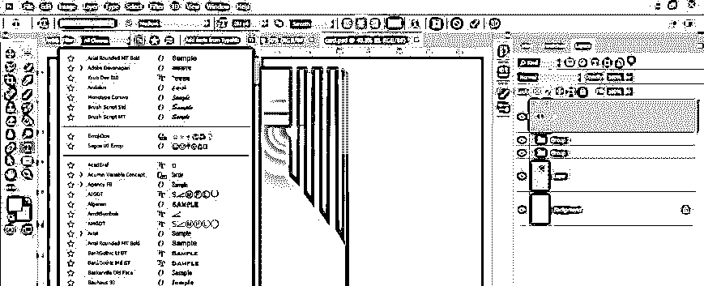

第 29 步:在这里输入你想要的文字，然后把它们排列在一个合适的位置，就像这样。

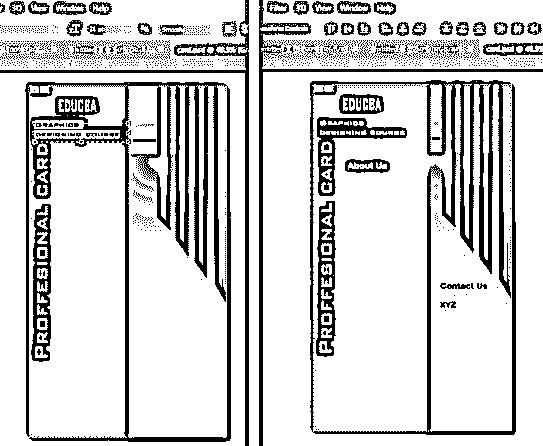

您可以根据客户的要求在卡片上添加不同类型的内容。您也可以在这张卡片上添加您公司的徽标。你的卡片的设计完全取决于你的想法。

### 结论

现在，看完这篇文章，你可以了解 Photoshop 中的模板是什么，以及如何为不同的专业用途创建模板。您可以使用自己的想法为您的项目工作制作专业模板。

### 推荐文章

这是 Photoshop 中的模板指南。这里我们讨论一下入门，如何一步一步的在 Photoshop 中创建模板。您也可以浏览我们的其他相关文章，了解更多信息——

1.  [树刷 Photoshop](https://www.educba.com/tree-brush-photoshop/)
2.  [变换工具 Photoshop](https://www.educba.com/transform-tool-photoshop/)
3.  [如何在 Photoshop 中制作 Logo？](https://www.educba.com/how-to-make-logo-in-photoshop/)
4.  [在 Photoshop 中填充颜色](https://www.educba.com/how-to-fill-color-in-photoshop/?source=leftnav)

