# Photoshop 中的夜间效果

> 原文：<https://www.educba.com/night-effect-in-photoshop/>

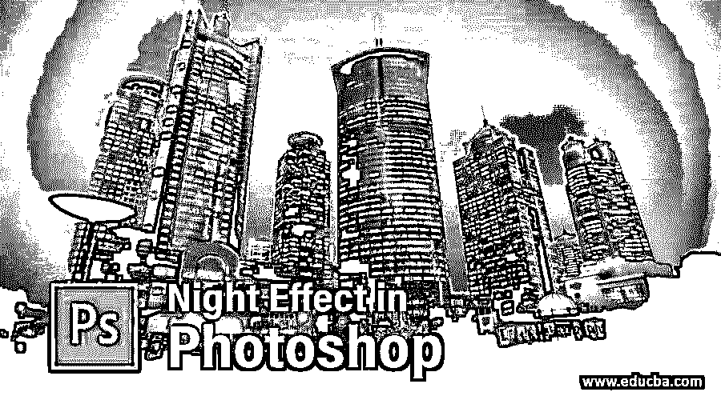

## Photoshop 中的夜间效果介绍

夜晚效果是一种假效果，我们可以在 Photoshop 软件中创建我们的图像，通过使用该软件的不同类型的功能，工具和参数，在我们的图像上获得夜晚模式。为了在 Photoshop 中创建一个夜晚效果，你只需要管理一些参数，如 Hus/饱和度，色彩平衡，以及其他一些参数，并为它创建一些遮罩和一个新层。因此，让我们讨论所有这些参数和步骤，通过这些参数和步骤，我们可以在我们的图像上创建一个夜间模式的夜间效果。我们通过一个例子来理解这个话题。

### 在 Photoshop 中应用夜间效果

我们应该按照一些步骤在 Photoshop 中创建这种类型的效果，并对不同的参数进行一些更改。所以让我们以一种非常令人兴奋的方式来学习这个话题。但是在开始之前，让我们先了解一下这个软件的用户界面，这样你就可以理解我们将在本文中使用的不同术语。

<small>3D 动画、建模、仿真、游戏开发&其他</small>

**第一步:**在用户界面的顶部，我们有一个菜单栏，里面有一些重要的菜单；在这下面，我们有一个活动工具或图像的属性栏，在这下面的左侧，我们有一个工具面板，它有一个不同类型的工具，在中心我们有显示窗口，在右侧，有一些标签，如颜色标签，层面板，和其他一些。您可以根据自己的选择更改所有部分的位置。

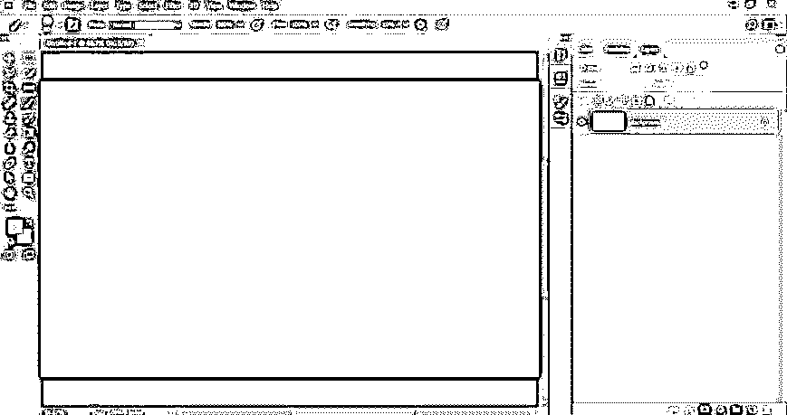

第二步:现在，让我们有一个图像，我们将转换为夜间模式。要在这个软件中拥有图像，请转到菜单栏的文件菜单并点击它。单击后，将会打开一个下拉列表。从列表中选择打开选项。

**第三步:**现在会打开一个对话框。转到您想要的文件夹，选择您想要的图像。一旦您选择点击此框的打开按钮，将您选择的图像放入此软件。

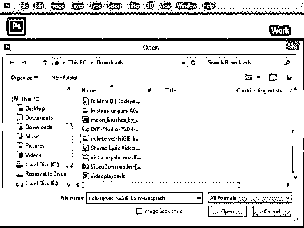

第四步:你的图像会这样放置。现在到图层面板的底部，点击调整图层按钮。将打开一个弹出列表。从列表中选择色调/饱和度选项。

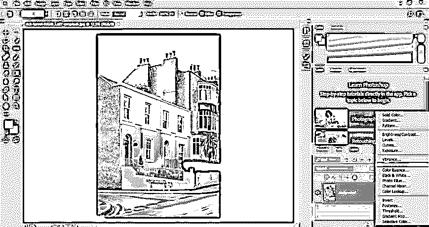

**第五步:**现在，从色调/饱和度框的饱和度滑块中减少饱和度的值。

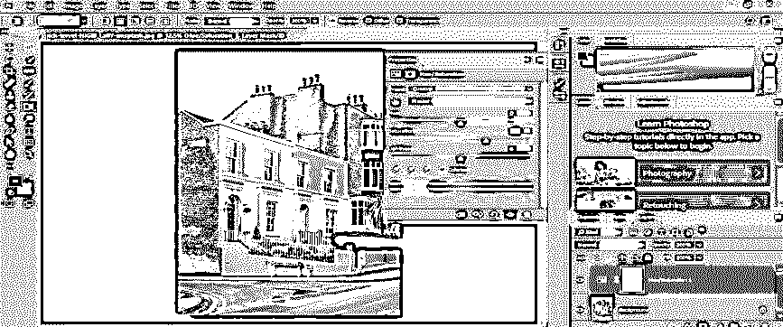

再次点击调整图层按钮，然后从列表中选择亮度/对比度选项。

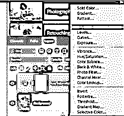

**步骤 7:** 现在从亮度/对比度框中将亮度和对比度值增加到 40 %，以增加该图像的亮度和对比度。

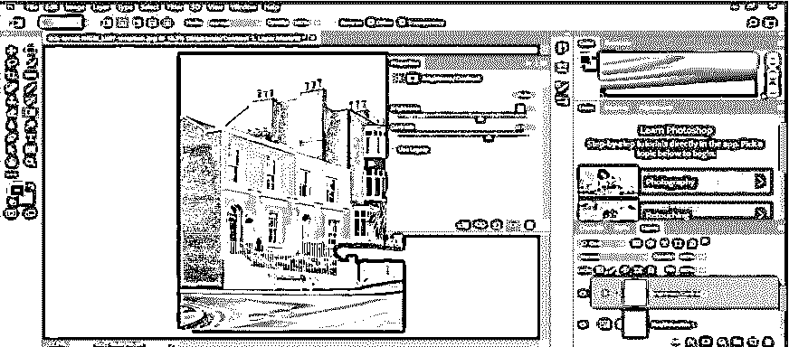

再次点击调整图层按钮，选择列表中的色彩平衡选项。

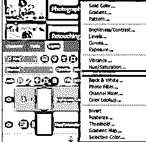

**第九步:**现在调整黄色调值到 30%，青色调值到 10%。

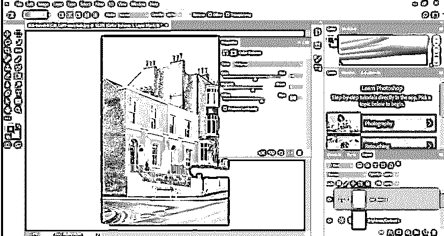

步骤 10: 现在拖动背景层到新建按钮，复制这个层。

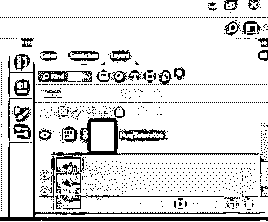

**步骤 11:** 用鼠标键拖动这个复制图层，将其放在所有图层的顶部。

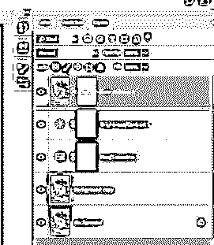

步骤 12: 现在选择这个复制图层，点击调整图层按钮。从列表中选择颜色查找选项。

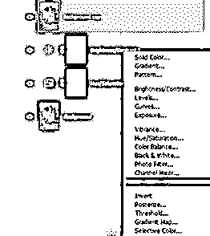

**步骤 13:** 一个颜色查找框将被打开。点击此框第一个选项的下拉箭头，从列表中选择月光选项，也可以从列表中选择夜间模式的 NightFromDay 选项。

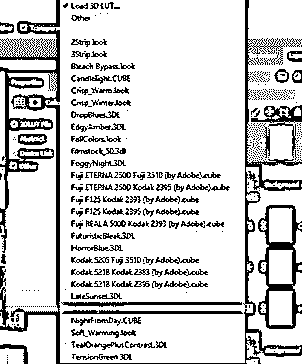

**第十四步:**我选择月光选项，你的形象就这样转换了。

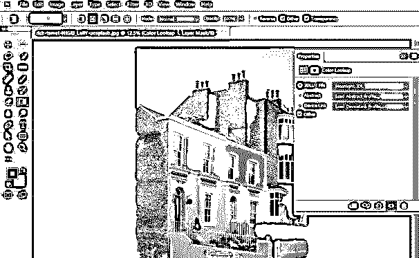

步骤 15: 再次点击调整图层按钮，从列表中选择亮度/对比度选项来增加图像的暗度。

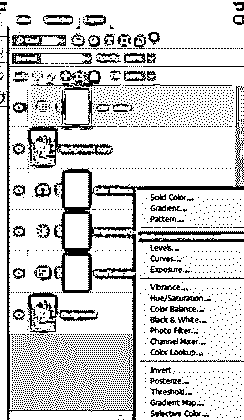

**步骤 16:** 现在，降低亮度选项上的亮度值，增加该框对比度选项中的对比度值。

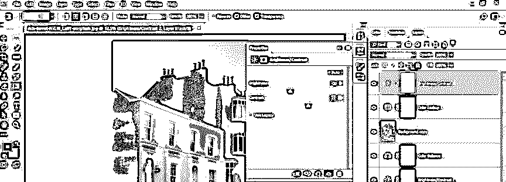

**步骤 17:** 现在按住键盘的 shift 键选择这些图层。

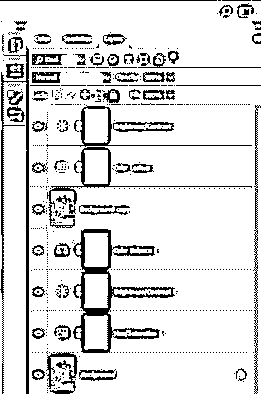

**步骤 18:** 按 Ctrl + G 按钮，将它们分组到一层。

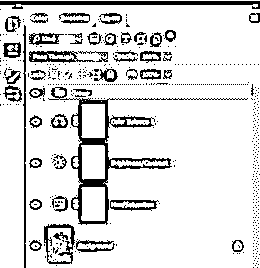

**步骤 19:** 现在点击添加蒙版按钮，该按钮位于该软件图层面板的按钮，用于在图层组中添加蒙版。

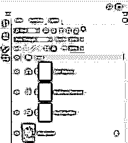

**步骤 20:** 现在到这个软件的工具面板，拿多边形套索工具。

**步骤 21:** 像这样在这个图像的窗口周围做一个选择。按住键盘的 shift 键进行选择。

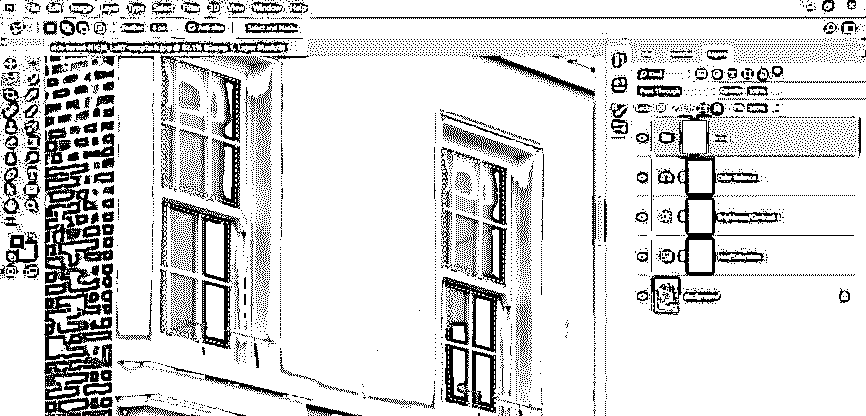

**第 22 步:**你可以这样根据自己的选择进行多种选择。

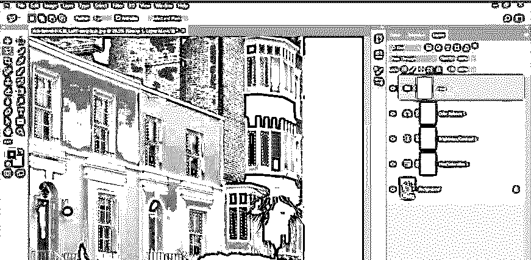

**第 23 步:**现在，从工具面板上取下画笔工具。

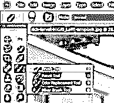

**步骤 24:** 从画笔工具属性栏的大小选项中调整画笔的大小。

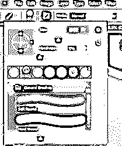

第 25 步:确保你已经在颜色框中选择了黑色作为前景色。现在在窗口区域拖动画笔，它会像这样突出显示窗口。

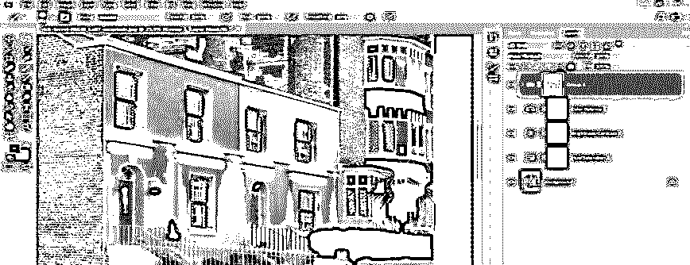

**步骤 26:** 现在转到调整图层按钮，点击列表中的纯色图层选项。

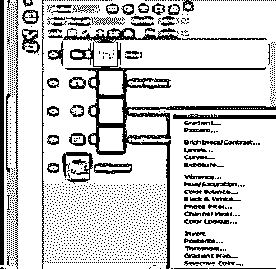

**步骤 27:** 选择黄色作为纯色，然后按下此框的 Ok 按钮。

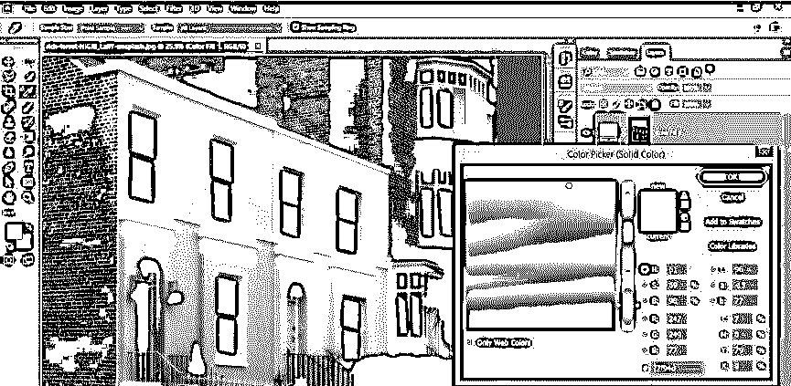

**步骤 28:** 现在，在这个实体图层的模式选项中选择叠加选项。

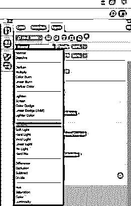

步骤 29: 现在，你将在窗口上得到这种类型的效果。

步骤 30: 现在选择图层组 1，用笔刷工具点击灯光，你会得到这样的灯光效果。

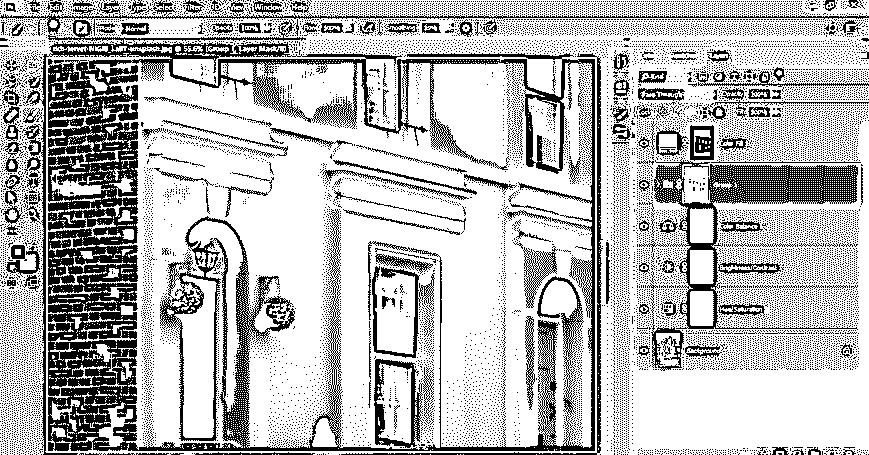

步骤 31: 现在双击这个图层，一个图层样式框会打开。从框中选择外部发光选项。根据你想要的图像窗口的灯光效果，在外发光参数中做一些调整。

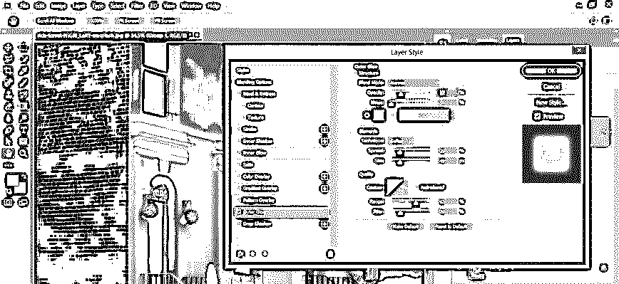

步骤 32: 现在到图层面板的底部，点击创建新图层按钮，这样创建一个新图层。

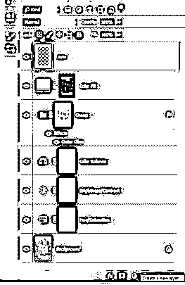

**步骤 33:** 现在再次拿一个笔刷工具，这一次确保你在颜色框中有白色作为前景色。现在点击图片的灯光来添加更多的发光效果。

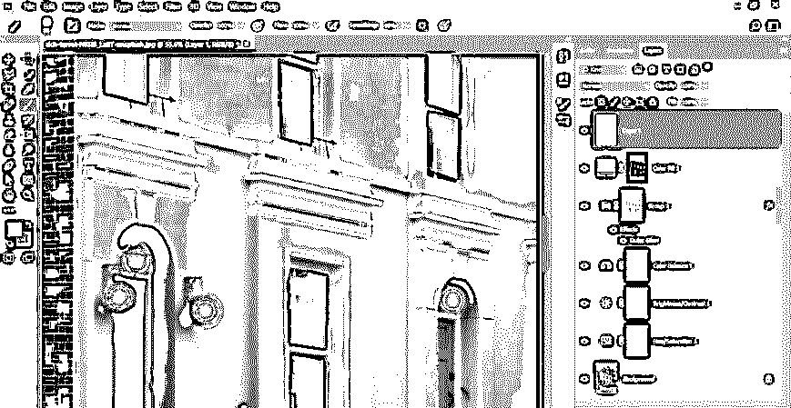

第 34 步:这是你最后的夜晚效果。您可以在图像的天空区域添加月亮和星星，以在图像中添加更多细节。

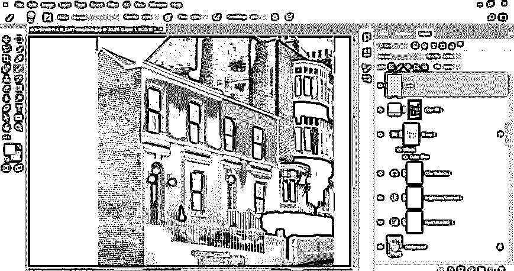

这样，你就可以在这个软件里制造一个夜晚的效果。

### 结论

现在看完这篇文章，你就能明白什么是 Moon brush，它对你的项目工作有什么帮助了。你可以用 Photoshop 软件的笔刷做许多不同类型的创作；只是对它们进行练习，并在你的图像编辑工作中应用你自己的想法。

### 推荐文章

这是 Photoshop 中的夜间效果指南。这里我们讨论一下在 Photoshop 中应用夜景效果的介绍和各个步骤。您也可以浏览我们的其他相关文章，了解更多信息——

1.  [在 Photoshop 中改变颜色](https://www.educba.com/change-color-in-photoshop/)
2.  [Photoshop 中的反射效果](https://www.educba.com/reflection-effect-in-photoshop/?source=leftnav)
3.  [Photoshop 中的雨效果](https://www.educba.com/rain-effect-in-photoshop/?source=leftnav)
4.  [闪亮效果 Photoshop](https://www.educba.com/shiny-effect-photoshop/?source=leftnav)

