# Photoshop 阳光效果

> 原文：<https://www.educba.com/photoshop-sun-effect/>

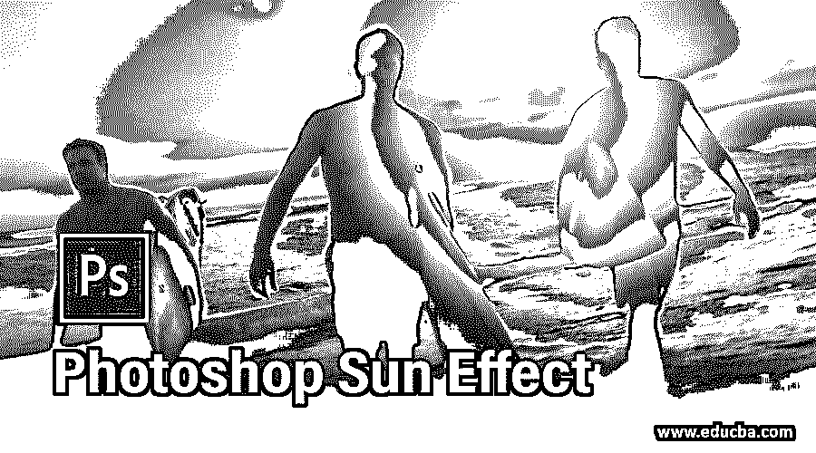

## Photoshop 阳光效果简介

Photoshop 是一种图像编辑软件，用于处理光栅图像，并被专业的图像编辑人员广泛用于他们的专业工作。我们可以在这个软件上创建一个非常好的效果，给我们的图像一个自然的外观。阳光效果是一种效果，通过它你可以在你的图像上添加太阳光或者阳光效果，给它一个非常自然的阳光效果。所以在这篇文章中，我们将学习如何在我们的图像中创建阳光效果，以及创建这种类型的效果需要什么参数。所以让我们开始学习这个话题。

### 如何在 Photoshop 中创建阳光效果？

我们可以很容易地在我们的图像上创建这种类型的效果。我们只需要遵循一些简单的步骤。所以让我们来讨论它们，但是在开始之前，我认为我们应该看看这个软件的工作屏幕来非常容易地理解这个话题。因此，让我们先了解一下这个软件的用户界面。

<small>3D 动画、建模、仿真、游戏开发&其他</small>

**步骤 1:** 在工作屏幕的顶部，菜单栏有多个菜单，用于处理该软件的不同类型的参数。在该菜单栏下方，有一个活动工具或图像的属性栏，用于更改它们的参数。在这个属性栏下面，我们在这个软件中有三个部分，在左侧我们有工具面板，在中心我们有显示窗口，你可以在其中看到你的工作，在右侧我们有一些标签，如颜色标签，层面板，和其他一些。你可以根据你的需要调整所有这些部分。

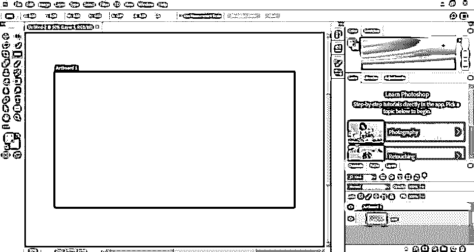

第二步:现在，让我们对这个话题有一个形象的了解。要在该软件中放置图像，请转到菜单栏的文件菜单并单击它。单击下拉列表中的打开选项。

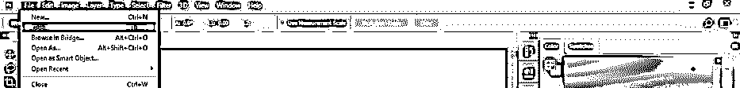

**第三步:**点击此选项，会打开一个对话框。转到您个人电脑的目标文件夹，然后点击您想要的图像。选择您想要的图像后，单击此框的打开按钮，在 Photoshop 中打开此图像。

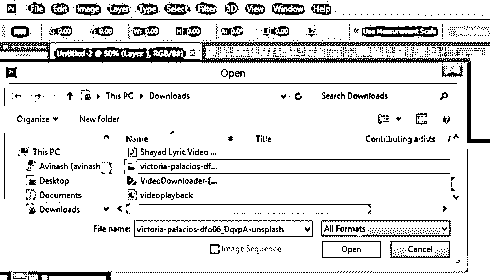

**第四步:**它会像这样在这个软件的一个新标签页中打开。您可以通过变换框来调整此图像的大小。现在转到这个软件的图层面板的底部，点击“创建一个调整图层”按钮。从下拉列表中选择渐变选项。

**第五步:**现在，一个渐变框会打开。点击盒子的渐变比例，一旦你点击了盒子的渐变比例，一个渐变编辑框就会像这样打开。现在，将此框渐变刻度的右侧颜色停止滑块拖动到此刻度的左端。

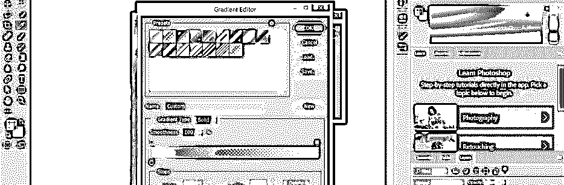

**第六步:**现在点击该比例尺下方的颜色框。将会打开一个颜色选择器框。从这里选择这种颜色，这样你可以创建一个阳光效果。现在逐个按下两个框的 Ok 按钮。

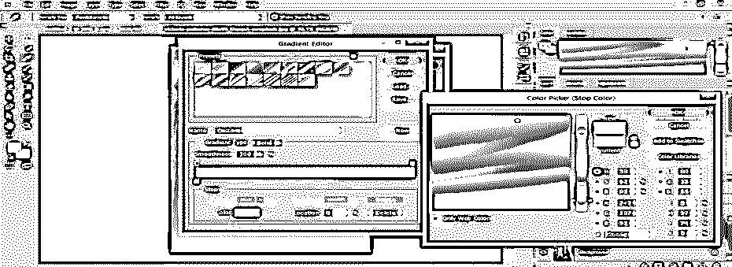

**第七步:**现在，在渐变框中选择径向渐变。

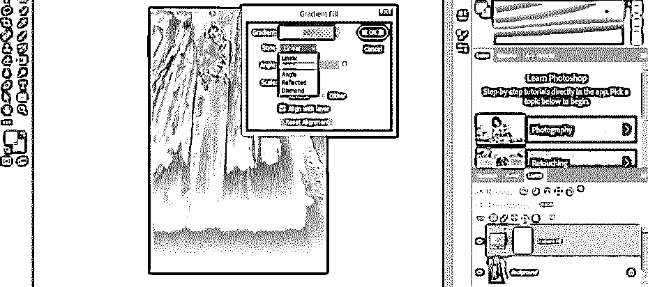

**第八步:**将你图像中的这个渐变移动到你想要的地方。

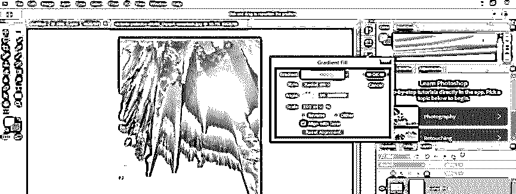

**第九步:**您可以放大或缩小这种渐变效果，以增加或减少它的扩散面积。

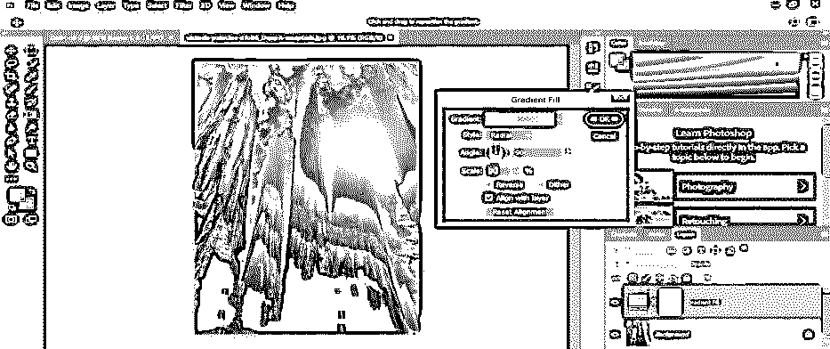

**第十步:**现在在这一层的模式选项中选择柔光选项。

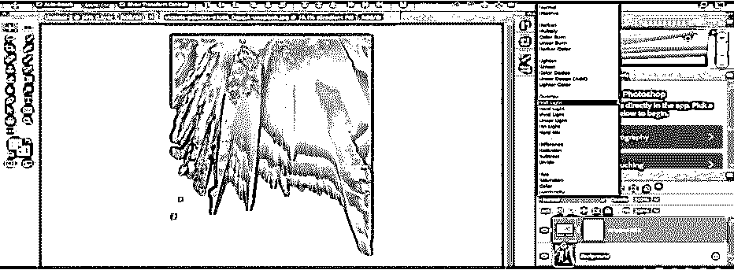

**步骤 11:** 现在，右键点击渐变图层，点击复制图层选项，进行复制。

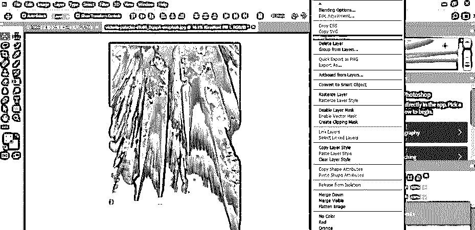

**第十二步:**现在，在这个复制图层的模式下，选择屏幕选项。

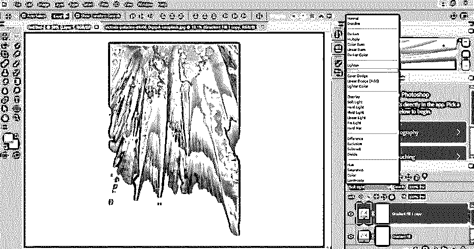

**步骤 13:** 现在双击这个复制图层的渐变框，将渐变比例降低到 70%，点击这个框的确定按钮。

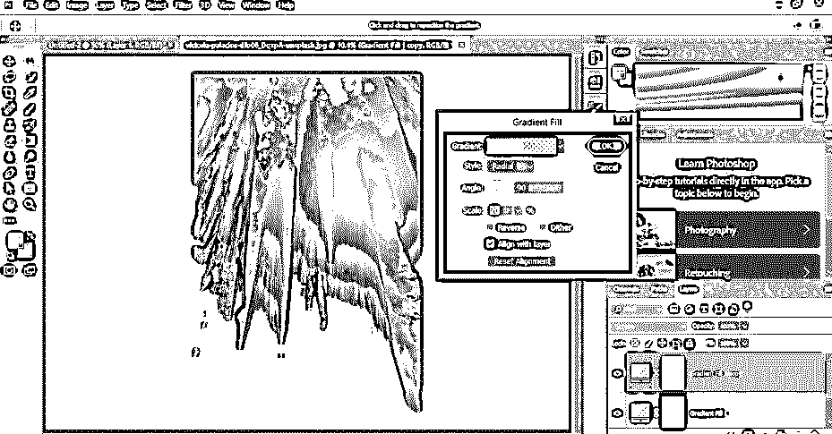

现在，再次从这个列表中选择渐变选项。

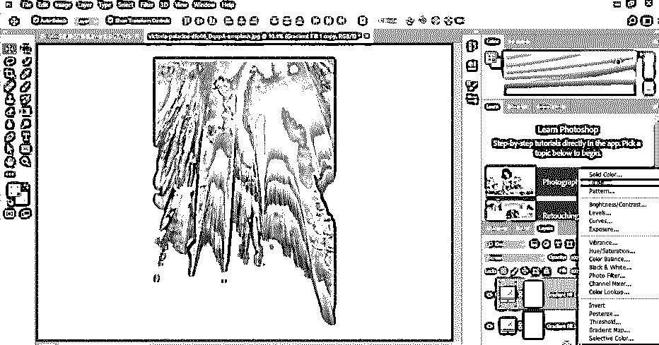

**步骤 15:** 并在渐变编辑框的渐变类型中选择噪波选项。

现在，从颜色模式选项中选择 HGB 选项。

**步骤 17:** 将饱和度标尺的右滑块滑动到左侧。

步骤 18: 现在反复点击这个框的随机按钮来获得这种类型的噪声效果，然后按下确定按钮。

**步骤 19:** 现在，在渐变风格中选择角度选项。

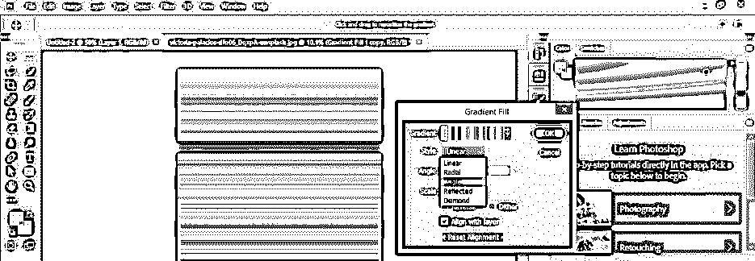

**步骤 20:** 现在在和之前渐变相同的地方调整这个渐变。

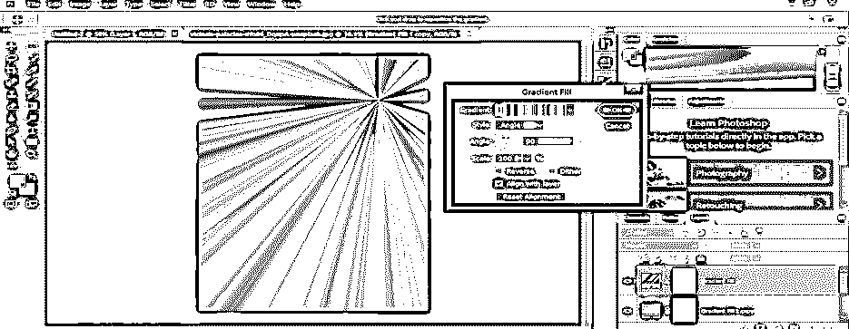

**步骤 21:** 现在，在这一层的模式选项中选择屏幕选项。

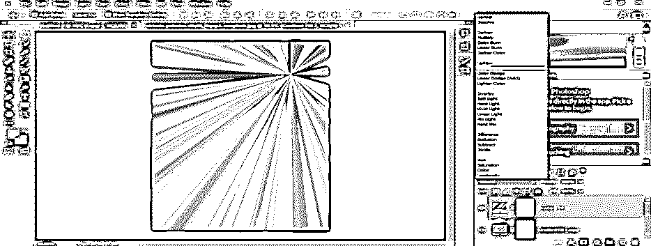

**步骤 22:** 现在再次打开这一层的渐变框，根据你调整角度。

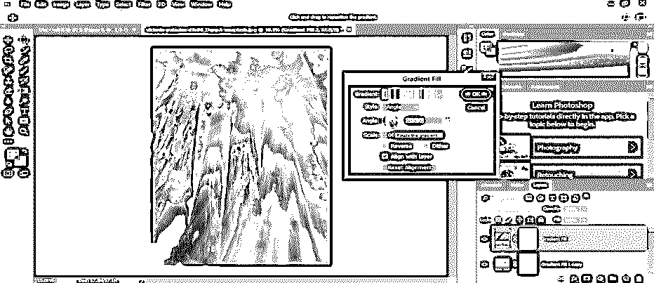

**步骤 23:** 现在，拿一个笔刷工具，调整笔刷的大小。在前景色框中选择黑色。

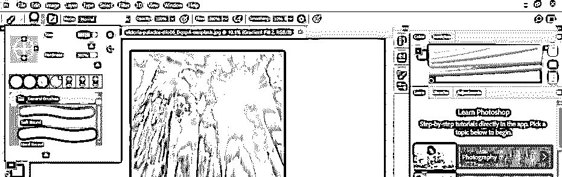

步骤 24: 现在清除图像中不想要的区域的渐变。

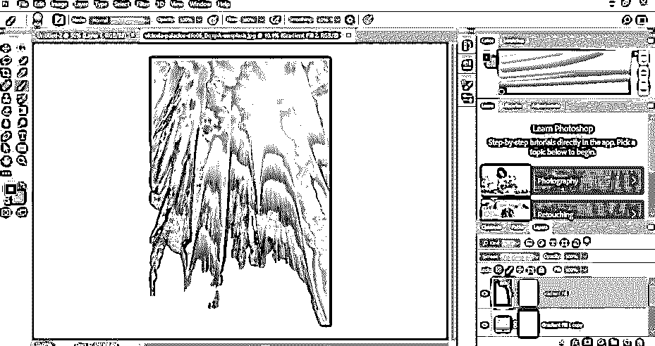

第 25 步:现在，从列表中选择级别选项。

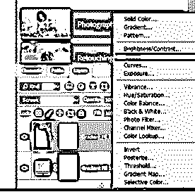

**步骤 26:** 移动水平标尺的滑块，增强阳光效果。

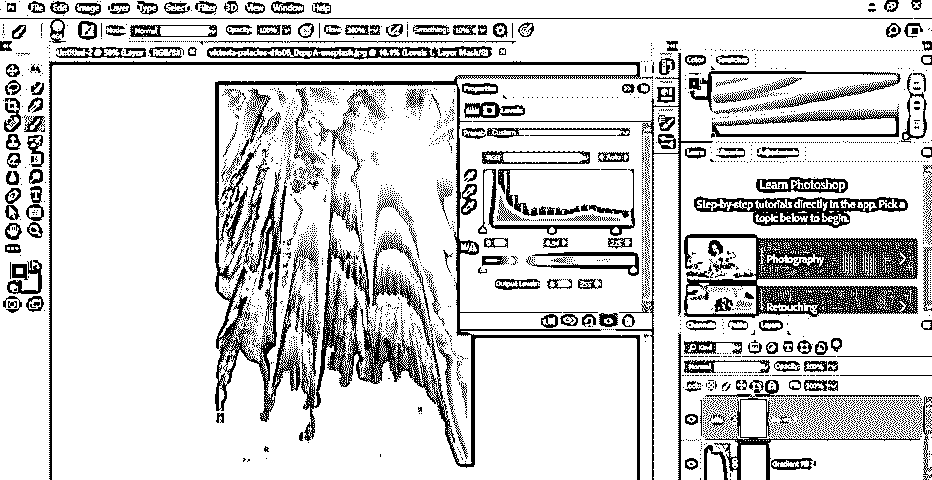

**步骤 27:** 现在，从列表中选择渐变贴图选项。

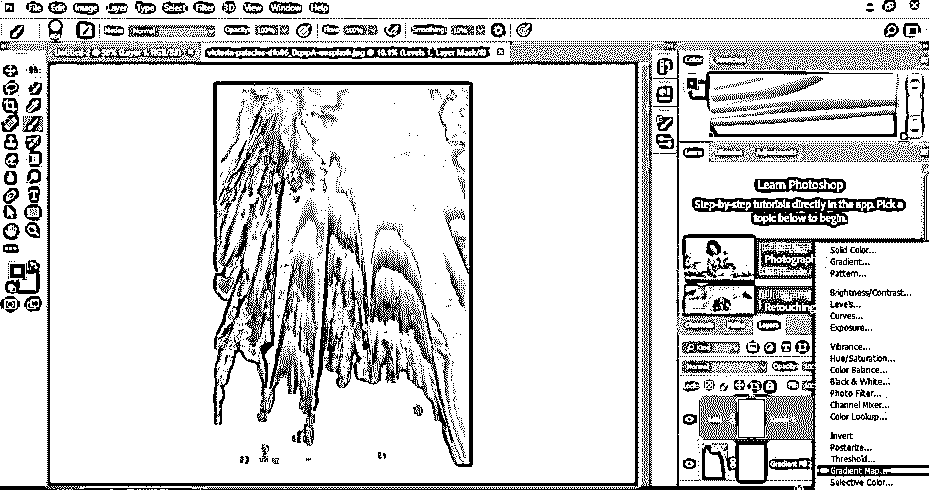

**步骤 28:** 点击打开框的渐变比例，然后从渐变编辑框中选择这种渐变类型。

**步骤 29:** 现在，在这个渐变贴图层的模式选项中选择柔光选项。

步骤 30: 现在，将这一层的不透明度降低到 75%。

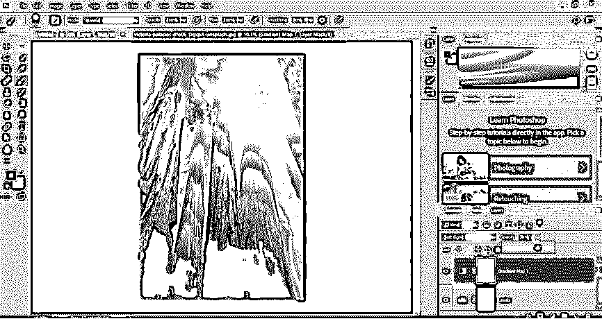

步骤 31: 点击图层面板的“新建图层”按钮，新建一个图层。

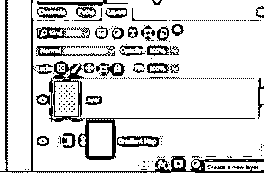

**步骤 32:** 现在转到菜单栏的图像菜单，点击下拉列表的应用图像选项。

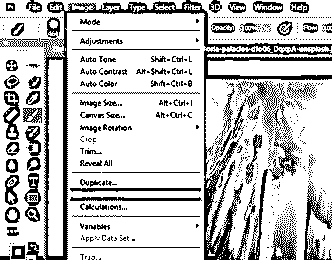

**步骤 33:** 现在，一个框将被打开，点击这个框的 Ok 按钮。

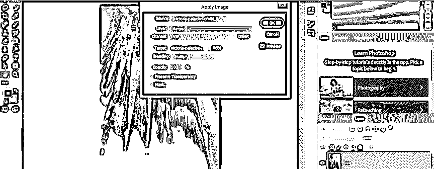

**步骤 34:** 现在进入菜单栏的滤镜菜单，点击列表中的‘相机原始数据滤镜’选项。

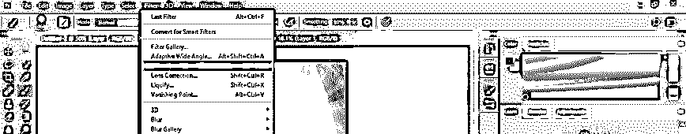

**步骤 35:** 现在相机原始数据盒将被打开。根据您的需要，在此框中调整参数以获得最佳的阳光列表效果。您可以通过更改参数值来查看该框中每个参数的效果。

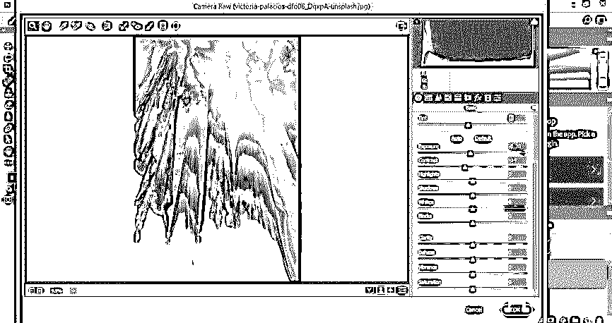

第 36 步:现在按下这个框的 Ok 按钮。

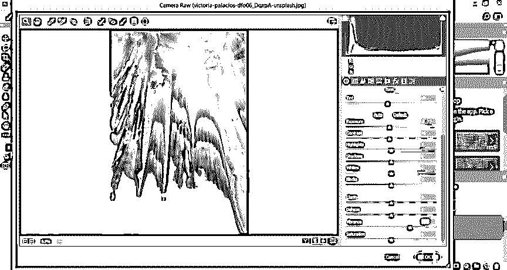

第 37 步:你最终的阳光效果会是这样的。

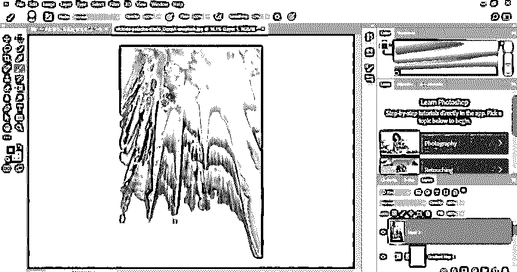

这样，你就可以在 Photoshop 软件中创建一个阳光效果。

### 结论

现在，看完这篇文章，你可以理解 Photoshop 中的太阳效果是什么，以及如何在你的图像中创建它。你可以通过使用这个软件的这种效果使你的图像非常有效，也可以通过练习这种效果来提高你的编辑技巧。

### 推荐文章

这是一个 Photoshop 阳光效果的指南。这里我们讨论一下入门，如何一步一步的应用 Photoshop 的太阳效果。您也可以浏览我们的其他相关文章，了解更多信息——

1.  [Photoshop 拉直图像](https://www.educba.com/photoshop-straighten-image/)
2.  [Photoshop 中的雪景效果](https://www.educba.com/snow-effect-in-photoshop/)
3.  [Photoshop 中的镜像效果](https://www.educba.com/mirror-effect-in-photoshop/)
4.  [Photoshop 中的运动效果](https://www.educba.com/motion-effect-in-photoshop/)

