# VHS 效果 Photoshop

> 原文：<https://www.educba.com/vhs-effect-photoshop/>

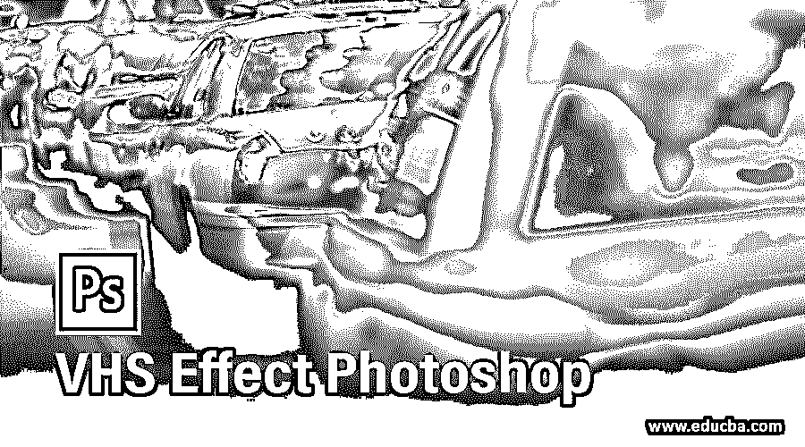

## VHS 特效 Photoshop 简介

Photoshop 是光栅图像编辑软件之一，被图像编辑专业人员广泛用于他们的专业工作。我们可以在我们的形象上做任何类型的效果，给它一个旧的外观。VHS 效果是一种老式的电视 VCR 效果，通过这种效果，你可以编辑你的图像，这使你看起来像是老式的电视效果。所以在这篇文章中，我们将讨论如何将这种效果应用到我们的图像中，并分析应用这种效果的不同参数。因此，让我们以一种非常令人兴奋的方式开始学习这个话题。

### 如何在 Photoshop 中应用 VHS 效果？

我们可以通过使用该软件的一些功能和工具在我们的图像上应用这种效果，但我们应该通过该软件的用户屏幕来正确理解这个主题。那么让我们来看看这个软件的工作界面。

<small>3D 动画、建模、仿真、游戏开发&其他</small>

**步骤 1:** 在顶部，我们有一个菜单栏，其中有一些菜单，帮助我们管理该软件的不同功能。在这个菜单栏下面，我们有一个不同工具的属性栏和这个软件的图像，这有助于在我们的工作中改变它们的参数。在这个栏下面，我们有三个部分:左侧的工具面板，该部分中心的显示窗口，右侧的一些面板有助于管理我们的工作。您可以在本软件用户界面的任何位置根据您的要求调整所有部分。

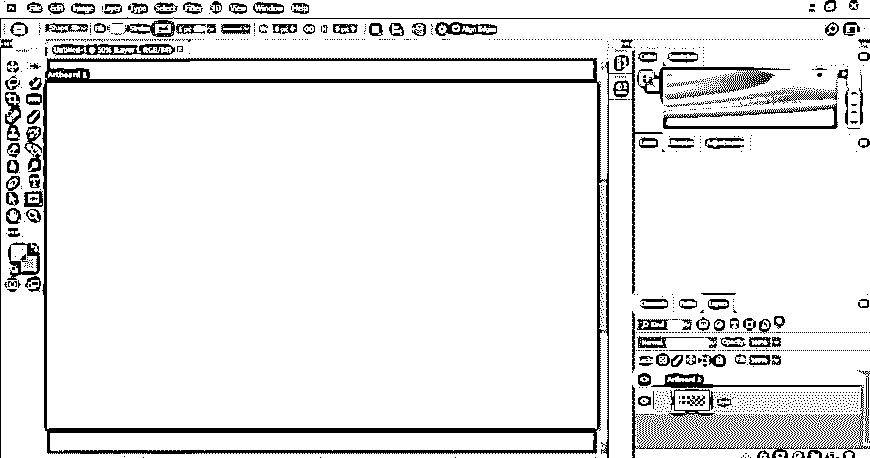

**第二步:**让我们在这个学习这个题目的软件中放置一个图像。要放置图像，请打开保存图像的文件夹，并借助鼠标左键将其放置在该软件的显示窗口区域。你可以有自己的图像，也可以从网上下载。

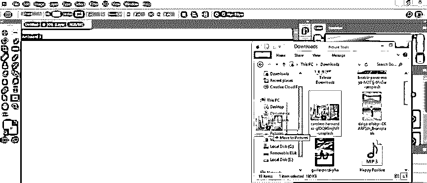

**第三步:**现在通过调整变换框的处理点来根据你来调整这张图片的大小。

第四步:现在根据你的选择给这张图片重新命名。对于重命名，双击该图像的名称。我会把它命名为 VHS。

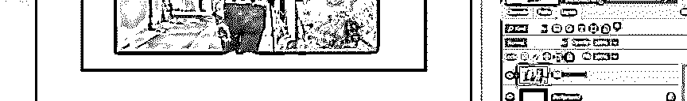

第五步:现在到图层面板的底部，点击调整图层按钮。从下拉列表中选择亮度/对比度选项，以调整图像的亮度和对比度。

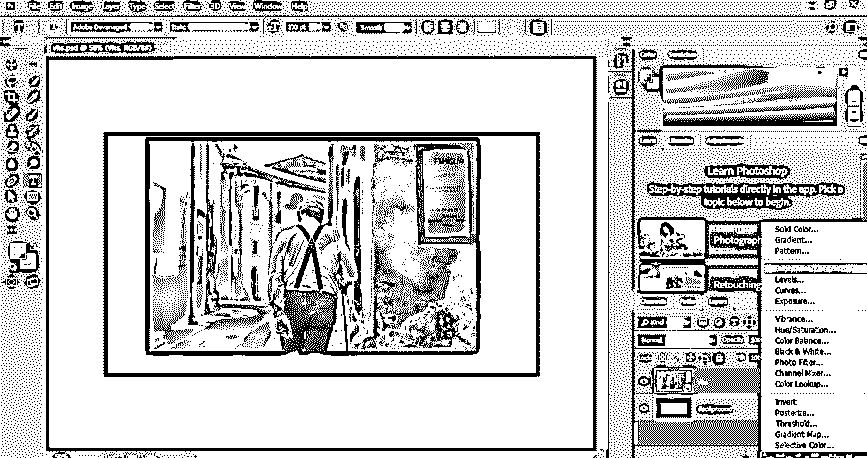

**第六步:**用这种方法调整亮度和对比度的值，使图像看起来有点暗淡。

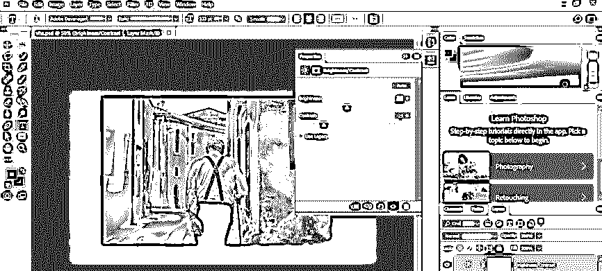

现在，再次点击调整图层按钮，从列表中选择曲线选项。

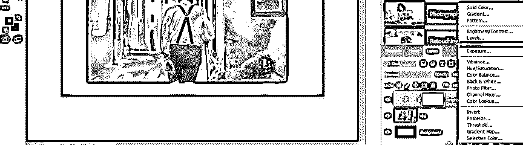

第八步:现在向下弯曲一点，让你的图像更加清晰。

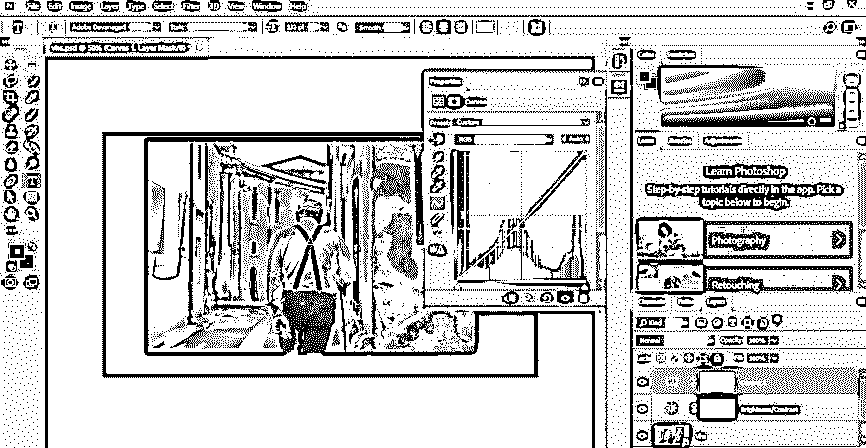

再次点击调整图层按钮，从下拉列表中选择一个纯色选项。

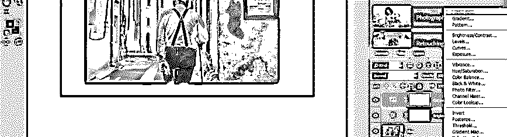

**步骤 10:** 现在，将打开一个颜色框，从该框中选择一种白色，然后按下该框的 Ok 按钮。

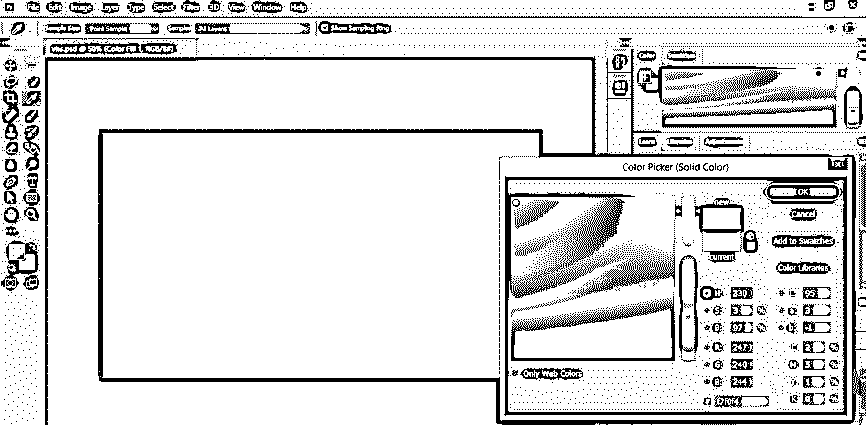

**步骤 11:** 现在在这个软件的图层面板中选择这个实体图层，从这个图层的不透明度选项中减少它的不透明度值。

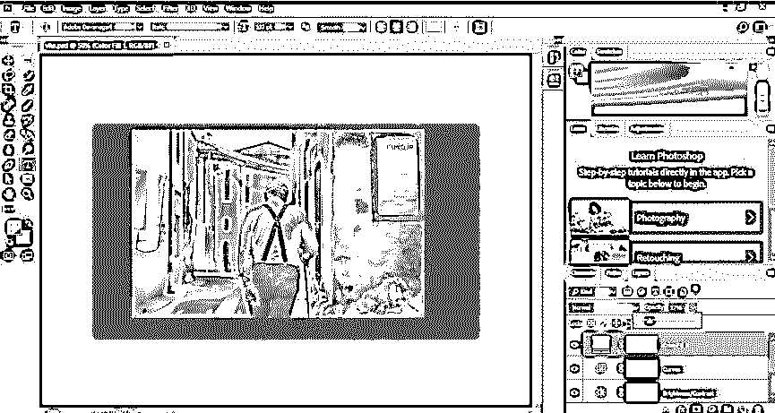

**步骤 12:** 现在用鼠标左键点击选择 VHS 图像层，进入该软件菜单栏的滤镜菜单。转到下拉列表的噪波选项，并通过单击它从新的下拉列表中选择添加噪波选项。

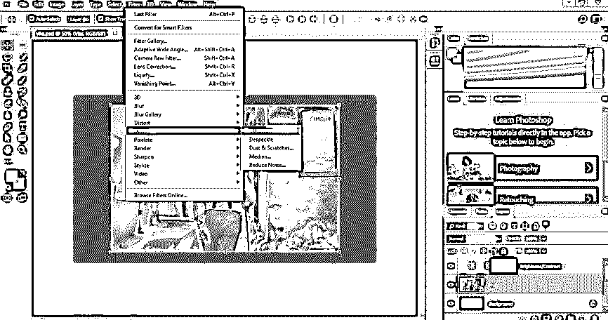

**第十三步:**一个添加噪音的盒子就打开了。将噪声值设置为小于 20 %,然后按下此框中的确定按钮。

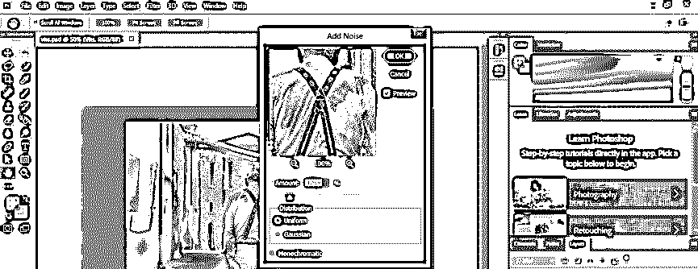

**第十四步:**现在进入菜单栏的文件菜单，点击。单击此下拉列表中的打开选项。

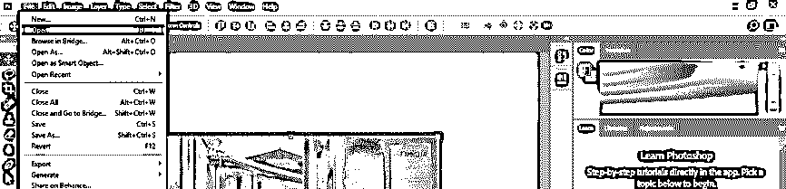

**步骤 15:** 一个对话框将会打开，你可以通过点击从这个对话框中选择你想要的图像。一旦你选择了，点击这个框的打开按钮。

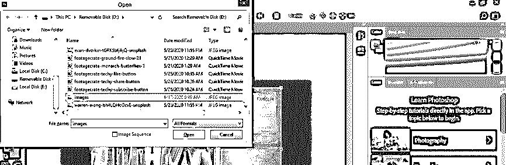

**第十六步:**现在，这张图片将在 Photoshop 软件的一个新标签页中打开。我已经从 Shutterstock 下载了 VCR 效果的图像。你也可以从那里下载。

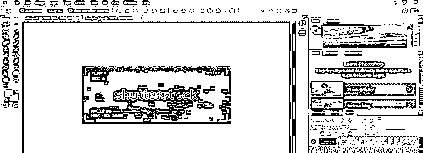

**步骤 17:** 现在，借助鼠标左键拖动该图像，将其放入您的原始图像的标签中。

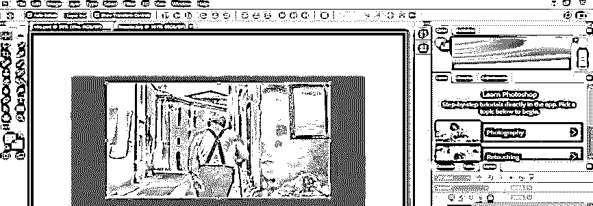

步骤 18: 现在这样调整它的大小，让它像这样覆盖你的原始图像。

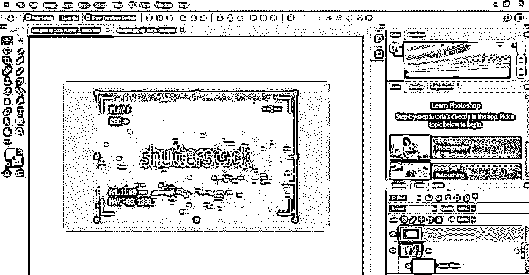

**步骤 19:** 现在转到这一层的模式选项，点击模式选项的下拉箭头。从下拉列表中选择屏幕选项。

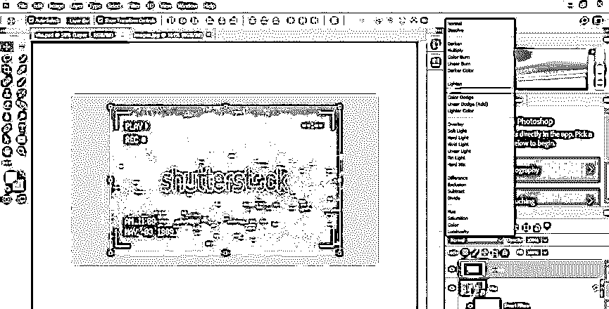

第 20 步:一旦你选择了这个选项，这个图像就会像这样和你的原始图像融合在一起。

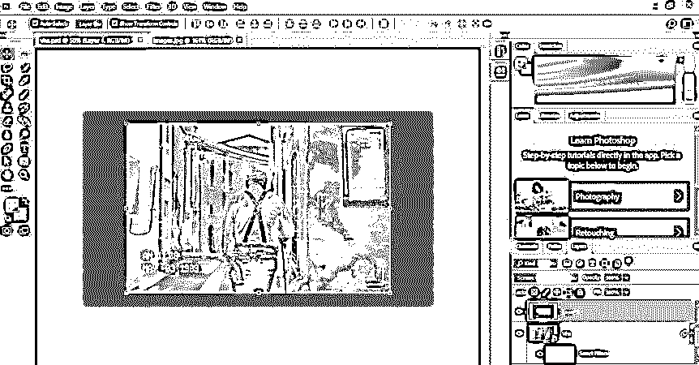

**步骤 21:** 现在点击选择 VHS 图像层，并按下键盘上的 Ctrl + J 按钮，复制该图像。

**步骤 22:** 现在选择 VHS 的复制层，进入菜单栏的滤镜菜单。转到下拉列表的噪波选项，并从新建下拉列表中选择添加噪波选项。

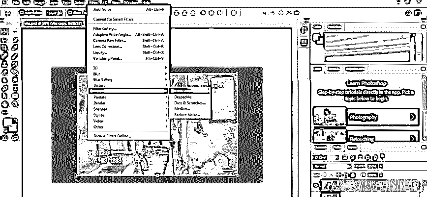

**步骤 23:** 一个“添加噪声”对话框将会打开。将噪波值增加 150%以上，然后按下此框的“确定”按钮。

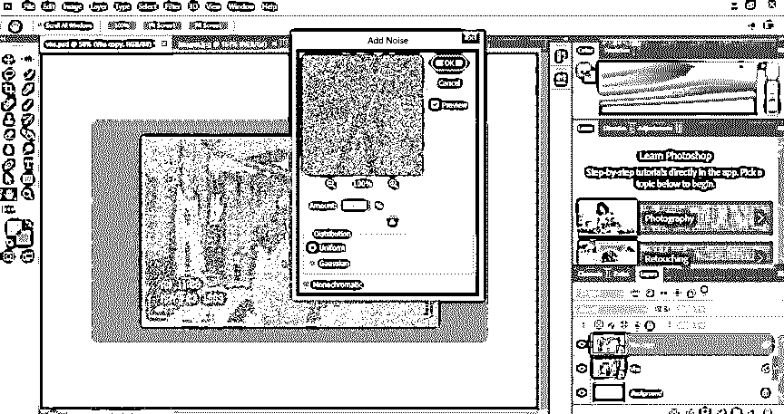

步骤 24: 现在，再次进入这一层的混合模式，点击一个下拉列表的柔光选项。

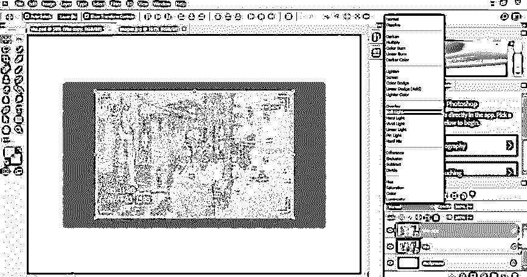

**第 25 步:**现在就这样和原图融合。

第 26 步:现在再次复制这张图片。

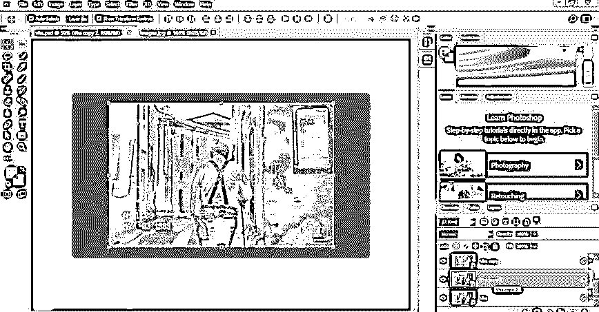

**步骤 27:** 现在双击这个图层，一个图层样式框就会打开。取消选中该层通道的 R 值。

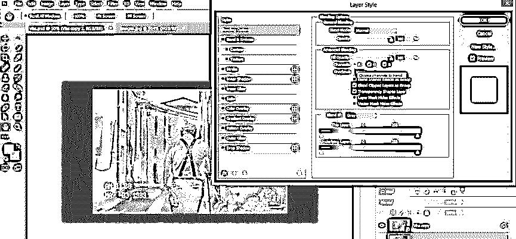

步骤 28: 现在按下键盘的左箭头按钮，将这一层向左移动一点，给它 VHS 效果。

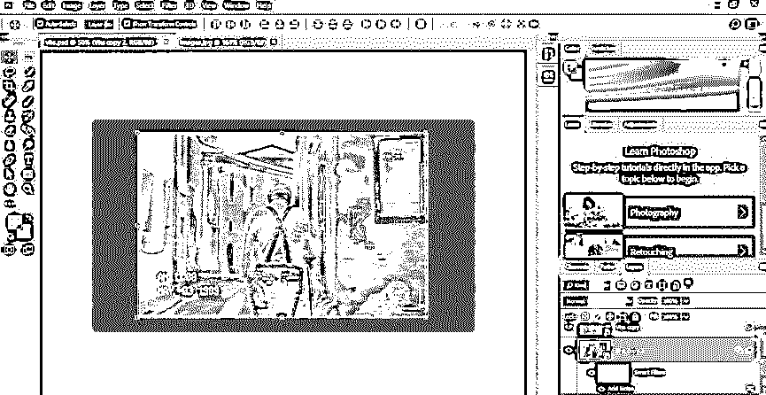

步骤 29: 现在到工具面板，选择一个矩形选框工具。

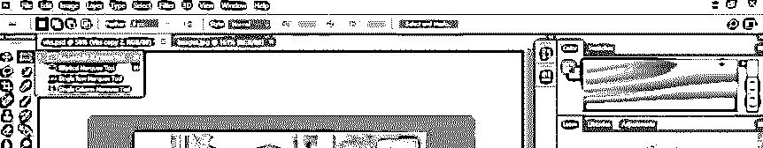

步骤 30: 现在，像这样做一个矩形选区。

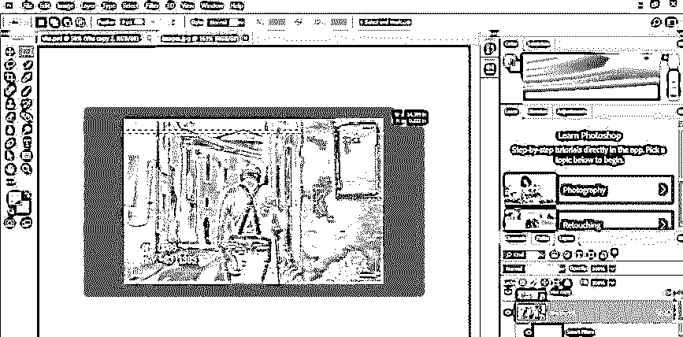

**步骤 31:** 然后进入移动工具，反复向左或向右按键盘箭头键，在那个方向上移动图像的这个选定区域。

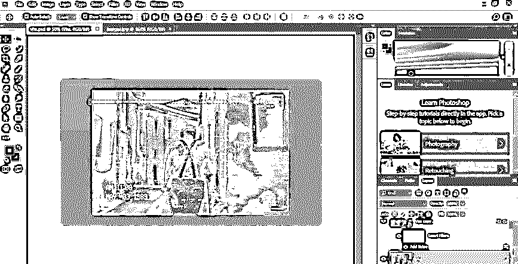

**步骤 32:** 现在重复这个步骤，像这样添加更多的移位区域。

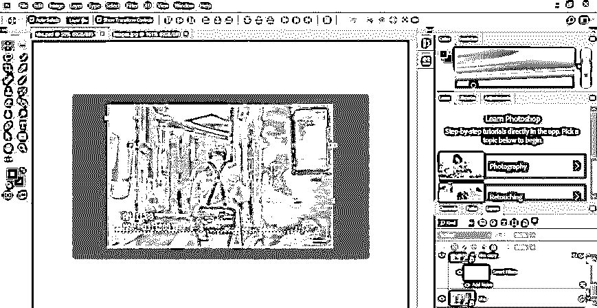

**步骤 33:** 这样，你的形象就可以有 VHS 的效果了。

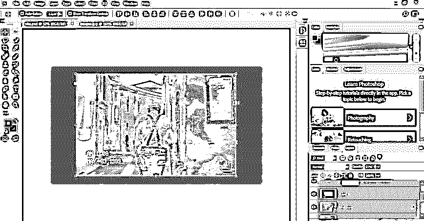

### 结论

现在看完这篇文章，你就可以了解 Photoshop 软件中的 VHS 效果，并为自己的形象制作了。您还可以非常轻松地处理应用此效果的过程的参数。因此，为了更好地掌握 Photoshop 的这一功能，请坚持练习。

### 推荐文章

这是一个 VHS 效果 Photoshop 的指南。这里我们一步一步的讨论一下 Photoshop 中 VHS 效果的介绍和应用。您也可以浏览我们的其他相关文章，了解更多信息——

1.  [Photoshop 中的图章效果](https://www.educba.com/stamp-effect-in-photoshop/)
2.  [Photoshop 中的火焰效果](https://www.educba.com/fire-effect-in-photoshop/?source=leftnav)
3.  [Photoshop 中的冰效果](https://www.educba.com/ice-effect-in-photoshop/?source=leftnav)
4.  [金属效果 Photoshop](https://www.educba.com/metallic-effect-photoshop/?source=leftnav)

