# Photoshop 中的半色调

> 原文：<https://www.educba.com/halftone-in-photoshop/>

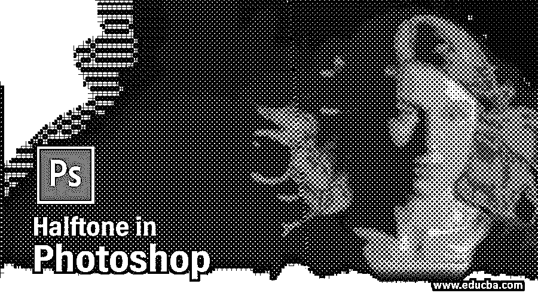

## Photoshop 中的半色调介绍

Photoshop 是一款处理光栅图像的图像编辑软件。图像编辑专业人员在其专业编辑工作中广泛使用它。我们可以在这个软件中为我们的形象创造一个非常好的效果。半色调是一种效果，通过这种效果，我们可以在分解像素的图像上创建一种错觉。本文将讨论如何在我们的图像上创造这种效果，并在我们的项目工作中使用它们。我们还分析了这种效果的创建参数，以非常容易地使用它，并用我们自己的想法将其应用于我们的图像。让我们开始讨论吧。

### Photoshop 中如何使用半色调效果？

我们可以通过几个简单的步骤在我们的图像上使用这种效果，并了解这个特性的参数处理。但在开始之前，让我们快速浏览一下这个软件的工作屏幕，以便更好地理解这个主题。

<small>3D 动画、建模、仿真、游戏开发&其他</small>

**第一步:**在工作屏幕的顶部，菜单栏有多个菜单，用于处理该软件的参数；在这个栏下面，我们有另一个栏，它是活动工具或活动图像的属性栏。在这个属性栏下面，我们有三个部分，其中在左上角有一个工具栏，在中心，我们有一个显示窗口，在右上角，我们有一些面板，如颜色，层面板，以及其他一些面板。

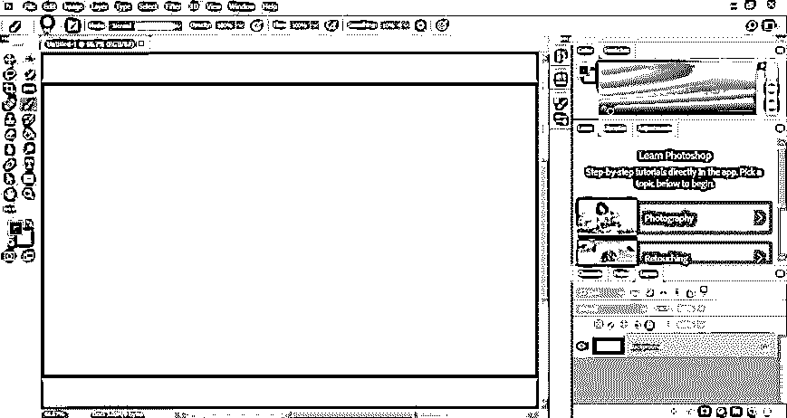

**第二步:**我们已经在这个软件中创建了一个文档，它是一个背景层，所以为了使它成为一个可编辑的层，双击它，一个对话框将会像这样打开。您可以通过在“名称”( name)框中输入名称来命名该层。现在，按下该对话框的“确定”按钮。

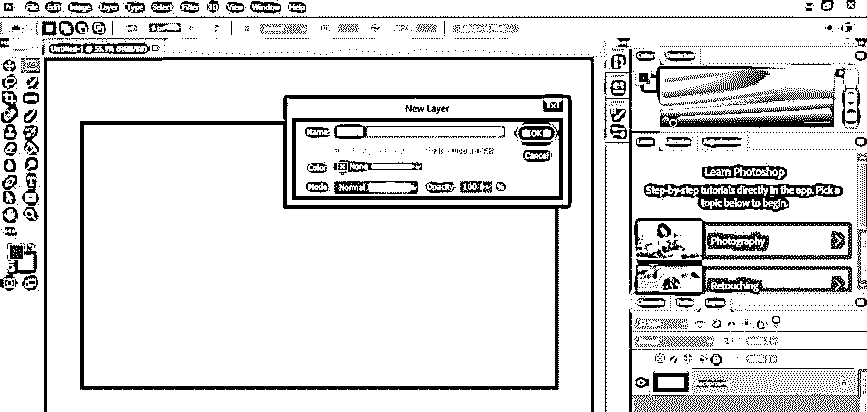

**步骤 3:** 现在转到图层面板的底部，点击“创建新图层”按钮，在图层面板中创建新图层。

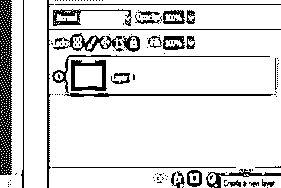

**步骤 4:** 现在在图层部分点击这个新图层，命名为图层 1，进入这个软件的工具面板。点击矩形选框工具的图标。

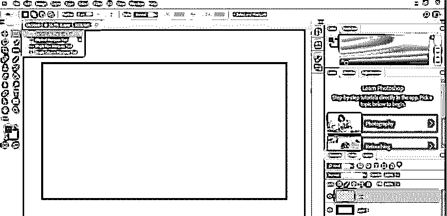

第五步:现在，用选框工具在图层 1 上做一个这样的选择。

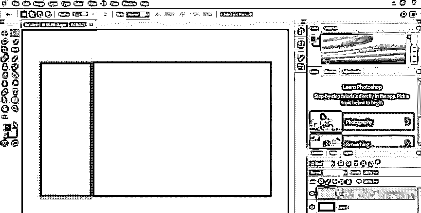

第六步:现在再次打开这个软件的工具面板，点击渐变工具。

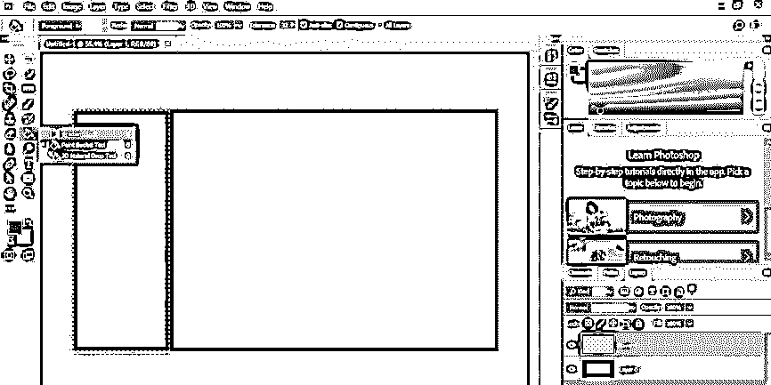

**步骤 7:** 进入渐变工具的属性栏，用鼠标点击‘点击编辑渐变选项’。

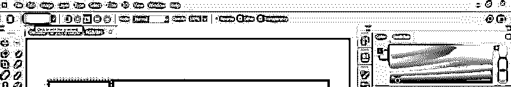

第八步:一旦你点击它，一个渐变编辑框将被打开。

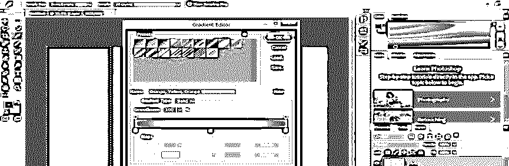

**第 9 步:**现在，通过向下拖动删除渐变刻度上的中间色标，并点击不透明度色标。

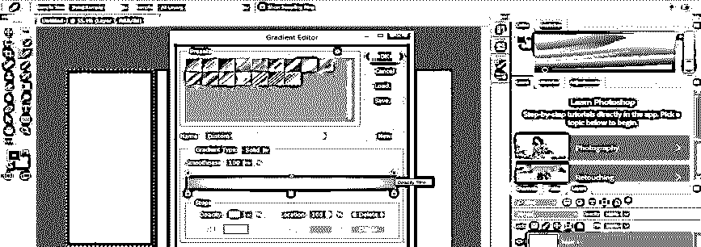

**第十步:**将此光圈的不透明度值减少为 0。这样渐变的一边就变成这样透明了。

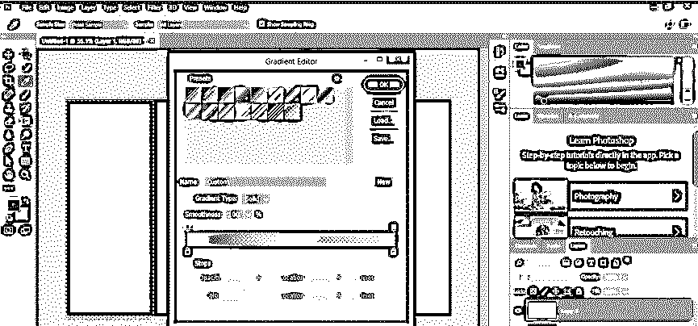

**步骤 11:** 现在水平方向拖动渐变工具在选区上的点，在选区工具中填充这种渐变。

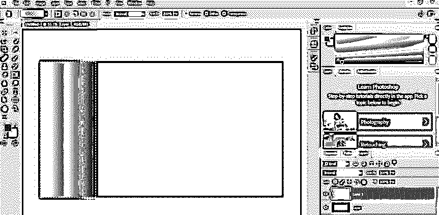

**步骤 12:** 当你从这个软件的图层面板中关闭背景图层(图层 0)时，通过点击这个图层的眼睛按钮，你可以看到你所在图层的渐变效果。

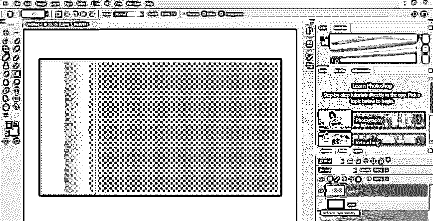

**第十三步:**现在进入这个软件菜单栏的滤镜菜单，进入下拉列表的像素化选项。现在从新的下拉列表中选择颜色半色调选项。

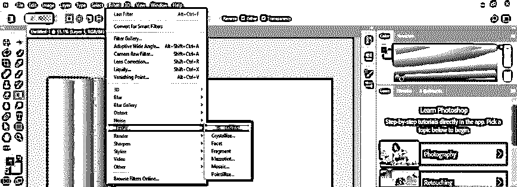

**步骤 14:** 现在，一个半色调的对话框将被打开。从该框的最大半径选项中设置半色调的像素半径，并保持其他设置不变。现在按下这个框的 Ok 按钮。

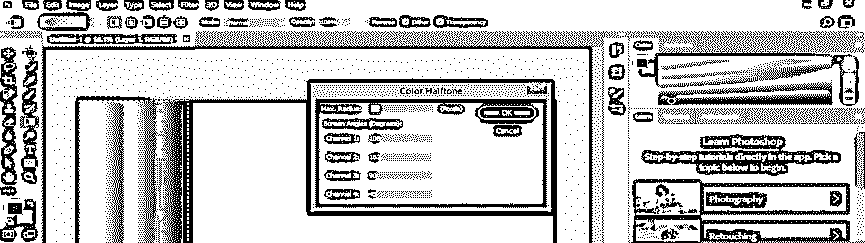

步骤 15: 半色调效果将在你选择的区域上创建，就像这样。

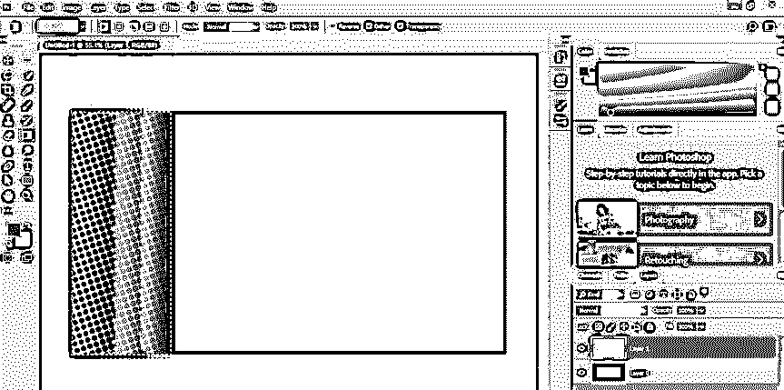

第 16 步:你可以在你工作的任何时候通过使用它的 transforms 属性移动或旋转它来改变这个选择。

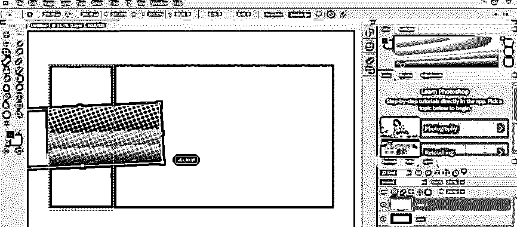

**第 17 步:**你也可以按照同样的步骤，用黑白两色打造这种效果。

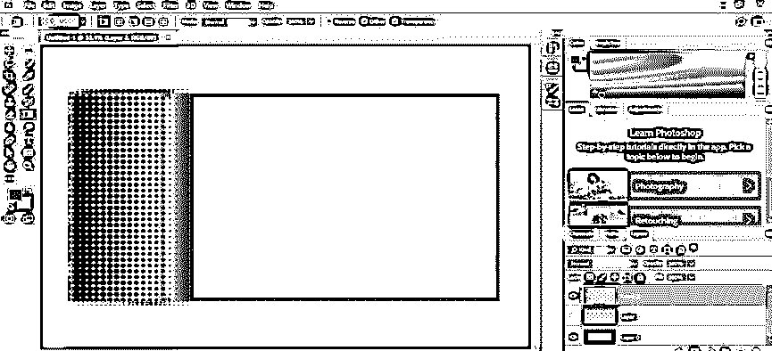

**第 18 步:**现在，让我们来了解一下这种对任何图像的影响。所以让我们在这个软件中放置一个图像。进入文件菜单并点击它。从下拉列表中选择打开选项。

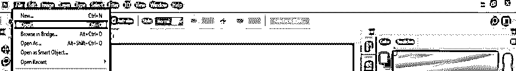

**步骤 19:** 现在，将打开一个对话框，从保存图像的文件夹中单击选择所需的图像，然后单击该对话框的打开按钮。

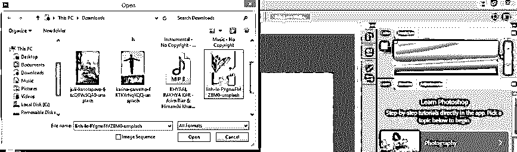

步骤 20: 现在，你的图像将作为背景层在这个软件的一个新标签中打开。现在去图层面板，双击这个图层，使它成为一个可编辑的图层。一个对话框将打开，根据你的名字命名你的层，然后按下这个对话框的 Ok 按钮。

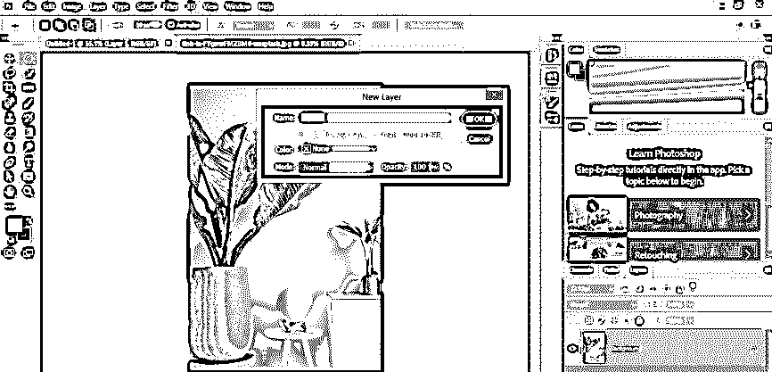

步骤 21: 现在到图层面板的底部，点击调整图层按钮。从下拉列表中选择色调/饱和度选项。

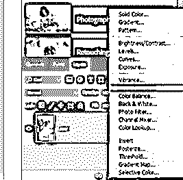

**步骤 22:** 在这个色调/饱和度框的饱和度选项的滑块上，将饱和度值设为负值，使我们的图像变成黑白。

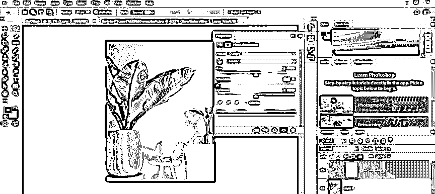

第 23 步:现在再次打开图层面板的调整图层按钮，点击它。从这里选择亮度/对比度选项。

**步骤 24:** 在“亮度/对比度”框中，将对比度值设置为 50，以便半色调效果可以清楚地显示其结果。

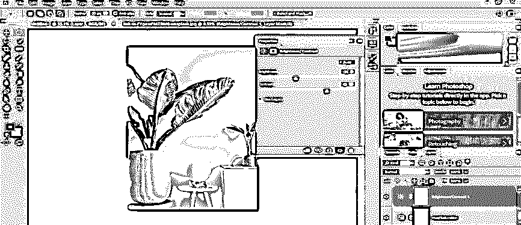

**步骤 25:** 现在进入图层面板，点击选择图层 0，这是图像图层，然后进入菜单栏的滤镜菜单，点击它。转到下拉列表的像素化选项，然后单击新下拉列表的颜色半色调选项。

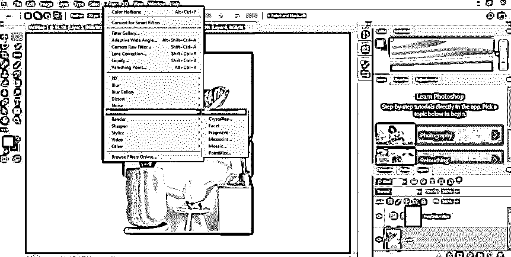

**步骤 26:** 一个彩色半色调框将被打开。将半径值设置为 10，然后按此对话框的确定按钮。

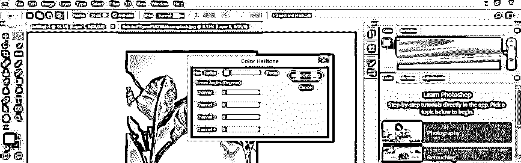

**第 27 步:**一旦点击，你的图像就会像这样以像素为单位解体。

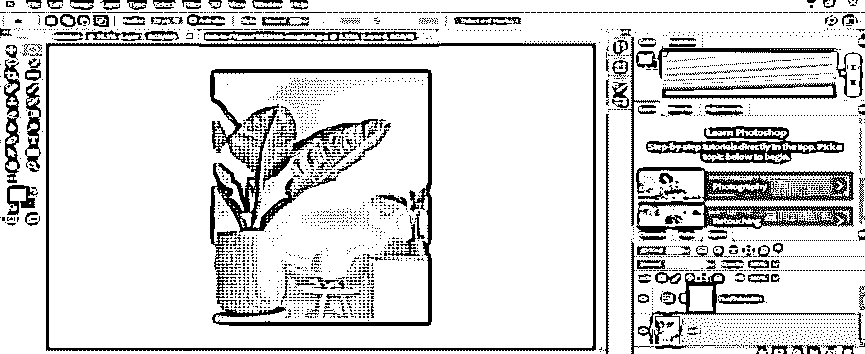

第 28 步:像这样放大你的图像，你可以看到像素效应。

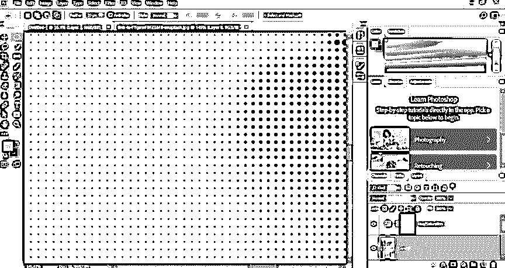

这样，您可以在图像上创建半色调效果，并在项目工作中用于不同的目的。

### 结论

现在，看完这篇文章后，你可以理解什么是 Photoshop 软件中的半色调效果，以及如何轻松地处理在你的图像上创建这种效果的参数。继续练习这个软件的这些类型的效果，这样你就可以为你的图像编辑技能加分。

### 推荐文章

这是 Photoshop 中的半色调指南。这里我们讨论一个介绍，如何循序渐进地在 Photoshop 中使用半色调。您也可以浏览我们的其他相关文章，了解更多信息——

1.  [Photoshop 中的排版](https://www.educba.com/typography-in-photoshop/)
2.  [Photoshop 中的塑料效果](https://www.educba.com/plastic-effect-in-photoshop/?source=leftnav)
3.  [Photoshop 中的雨效果](https://www.educba.com/rain-effect-in-photoshop/?source=leftnav)
4.  [Photoshop 中的金色文字效果](https://www.educba.com/gold-text-effect-in-photoshop/?source=leftnav)

