# Photoshop 备忘单

> 原文：<https://www.educba.com/photoshop-cheat-sheet/>

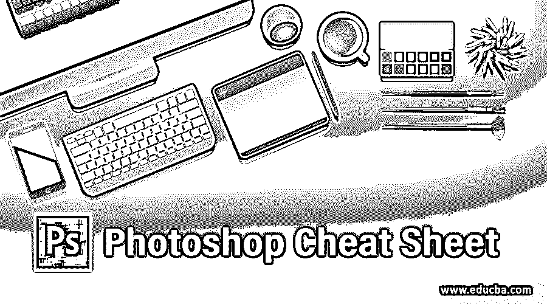

## Photoshop 备忘单介绍

Photoshop 是由 adobe systems 开发的光栅图形编辑软件，作为他们的图像编辑软件。我们可以在这个软件中做许多不同类型的编辑工作，为了在这个软件中快速工作，Photoshop 为不同的命令和菜单提供了不同类型的快捷方式。备忘单是一张表格，您可以在其中找到 Photoshop 软件的不同命令和菜单的许多快捷键，并使用它们来节省您在该软件中工作的时间。本文将 Photoshop 软件的一些重要命令和菜单做一个备忘单。所以，让我们做一份对我们有帮助的小抄。

### Photoshop 的不同备忘单

我们将在这里做一个这个软件的不同命令的备忘单，用一个例子来理解所有的欺骗。那么就让我们开始吧，逐一讨论这些秘籍。

<small>3D 动画、建模、仿真、游戏开发&其他</small>

#### 1.文件菜单作弊

在这里我们将讨论这个软件的文件菜单的一些欺骗。你可以在这个软件的菜单栏找到文件菜单。

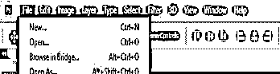

**1。新建命令:**新建命令用于在 Photoshop 软件中创建新文档。你可以使用 Ctrl + N 作为这个命令的欺骗。

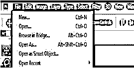

**2。打开命令:**打开命令用于打开你在 Photoshop 软件中保存的文件，或者打开该软件中任何不同的文件。你可以使用 Ctrl + O 作为这个命令的一个欺骗。

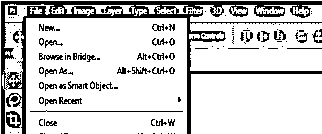

**3。关闭命令:**关闭命令用于关闭 Photoshop 软件中的任何文档。你可以使用 Ctrl + W 作为这个命令的欺骗。

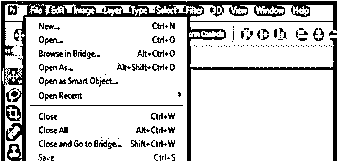

**4。关闭全部命令:**关闭全部命令类似于关闭命令，但是通过这个命令，你可以通过按 Ctrl + Alt + W 一次性关闭 Photoshop 软件的所有 tab，作为这个命令的一个秘籍。

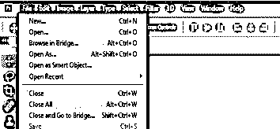

**5。保存命令:**用于将本软件的任何文件保存到您个人电脑的不同位置。你可以按下键盘的 Ctrl + S 键作为这个命令的一个欺骗。

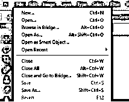

#### 2.编辑菜单

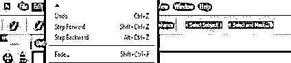

我们使用该菜单在该软件中使用编辑命令。所以让我们来讨论其中的一些。

**1。剪切命令:**用于从图像中剪切任何选定的部分，该图像将保存在该软件中供您下次使用，直到您复制或剪切任何其他对象。你可以从键盘上按 Ctrl + X 或 F2 键作为这个命令的一个欺骗。

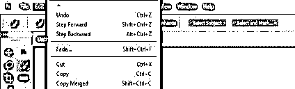

**2。复制命令:**用于复制图像的任何选定部分，它将保存在本软件中供您下次使用，直到您复制或剪切任何其他对象。你可以从键盘上按 Ctrl + C 或 F3 键作为这个命令的一个欺骗。

**3。粘贴命令:**用于将您剪切或复制的任何图像对象粘贴到本软件中您想要的位置。你可以从键盘上按 Ctrl + V 或者 F4 键作为这个命令的一个欺骗。

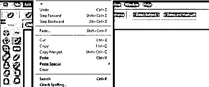

#### 3.查看菜单

该菜单有一个不同的命令，通过该命令，您可以启用一些指导工具，以便更好地使用该软件。

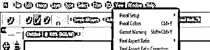

**1。标尺命令:**通过这个命令，你可以在你的显示窗口区域启用一个标尺，以便更好地测量你在这个软件中的编辑工作。你可以按键盘上的 Ctrl + R 键来使用这个命令。

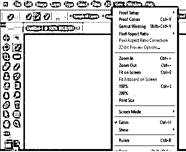

**2。Snap 命令:**用于在网格上捕捉任何图像或工具的定位点，以便更好地设计工作。可以按 Ctrl+Shift+；按钮来获得这个命令。

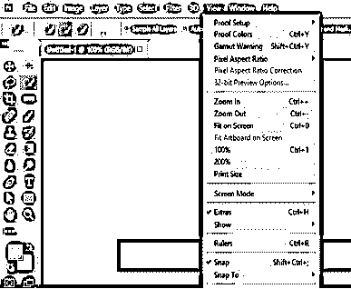

#### 4.选择菜单

这个菜单有不同类型的选择图像方法的命令。所以让我们来讨论一下。

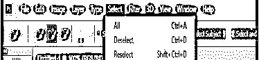

**1。取消选择命令:**我们可以使用这个命令来释放任何工具在我们的图像上所做的选择。你可以按 Ctrl + D 键作为这个命令的一个欺骗。

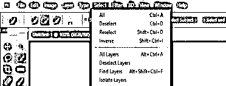

**2。重新选择命令:**我们可以根据上一步选择使用该命令再次选择我们的对象。你可以按下 Shift + Ctrl + D 键作为这个命令的一个欺骗。

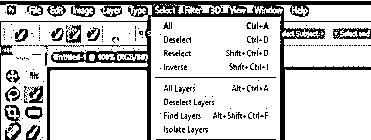

#### 5.工具面板

现在让我们来讨论一下这个软件的工具面板的不同工具的一些秘籍。

**1。移动工具:**通过此工具，您可以将任意图像或图像的选定区域移动到本软件文档区域的任意位置。你可以按下键盘的 V 键作为这个工具的作弊器，你的工具就会被激活。

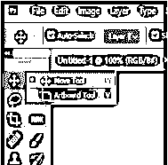

**2。** **矩形选框工具:**该工具用于对图像区域进行矩形选择，以便在其中进行一些修改。你可以按下键盘的 M 键作为这个工具的作弊器，按下这个键之后就会变成激活状态。

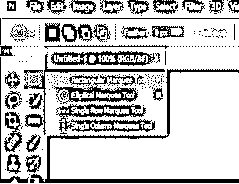

**3。快速选择工具:**与钢笔工具相比，该工具用于非常快速地选择您想要的图像对象。你可以按下键盘上的 W 键来使这个工具成为这个工具的一个欺骗。

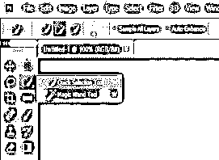

**4。裁剪工具:**这个工具用于根据我们的要求裁剪图像区域，或者我们图像中的任何特定部分。你可以按键盘上的 C 键让这个工具作为这个工具的一个欺骗。

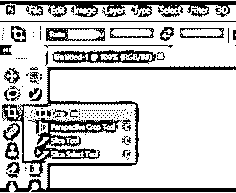

**5。吸管工具:**这个工具用于将你想要的颜色放在你选择的图像区域。你可以按下键盘上的 I 键作为这个工具的一个欺骗。

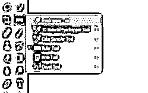

**6。笔刷工具:**这个工具有很多不同的用途；在你开始从事软件工作后，你会了解到这方面的知识。你可以按键盘上的 B 键让这个工具作为这个工具的一个欺骗。

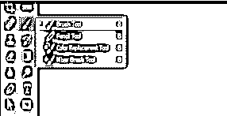

7 .**。克隆工具:**这个工具用于复制你的图像的任何区域，并在同一张图像的另一个地方复制这个区域。你可以按下键盘上的 S 键，让这个工具作为这个工具的一个欺骗。

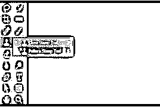

以上是 Photoshop 软件重要工具的一些秘籍。如果你想的话，你可以找到更多的秘籍。

### 结论

看完这篇文章，你就能明白什么是备忘单，以及如何在这个软件中使用它来提高你的工作速度。你可以通过在这个软件上一次又一次地使用它们来学习这些欺骗，而不是通过鼠标点击来使用这些命令。

### 推荐文章

这是一个 Photoshop 备忘单的指南。这里我们讨论 photoshop 中的简介和不同类型的备忘单，并做简要说明。您也可以浏览我们的其他相关文章，了解更多信息——

1.  [Photoshop 的使用](https://www.educba.com/uses-of-photoshop/?source=leftnav)
2.  [Adobe Photoshop 快捷键](https://www.educba.com/adobe-photoshop-shortcut-keys/?source=leftnav)
3.  [Adobe Photoshop 命令](https://www.educba.com/photoshop-commands/?source=leftnav)
4.  [Photoshop 中的插件](https://www.educba.com/plugins-in-photoshop/?source=leftnav)

