# 在 Photoshop 中调整对象大小

> 原文：<https://www.educba.com/resize-object-in-photoshop/>

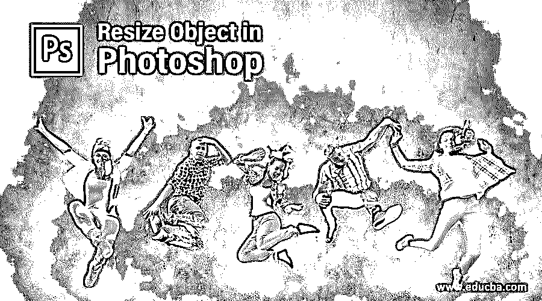

## Photoshop 中调整对象大小的介绍

Photoshop 是由 adobe systems 开发的光栅图像编辑软件，作为其图像编辑软件，被图像编辑专业人员广泛用于他们的专业工作。我们在这个软件中有不同类型的功能，为我们提供一个用户友好的工作环境。Resize 是其令人兴奋的功能之一，通过它你可以改变任何图像的对象的大小或图像本身的大小。在本文中，我们将以非常简单的方式讨论该软件的调整大小功能，并了解其不同的处理参数。让我们开始讨论吧。

### 如何在 Photoshop 中调整对象的大小？

在这个软件中，我们可以按照调整大小程序的一些步骤来调整任何对象的大小。所以在开始之前，我们应该看一下这个软件的用户界面，这样我们才能理解本文中的这个主题。

<small>3D 动画、建模、仿真、游戏开发&其他</small>

第一步:在这个软件用户界面的最顶端，有一个我们称之为菜单栏的功能区。该功能区有许多菜单，帮助我们管理该软件的不同参数；在这下面，我们有活动工具或活动图像的属性栏，通过它我们可以改变工具的参数；在此工具栏下方；我们有三个部分，在左侧我们有工具面板，其中有一些工具，使我们的工作在这个软件中变得容易，在这个部分的中心，我们有显示窗口，我们可以在其中看到我们当前的工作，在右侧我们有一些面板，使我们的工作进行一些调整，是颜色面板，图层面板，和其他一些。您可以根据需要在工作屏幕的任何位置调整所有这些部分。

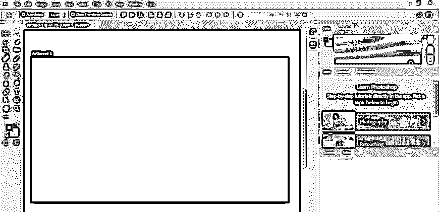

**第二步:**让我们在这个软件里有一个形象，供我们学习。为了在这个软件中有一个图像，去你想要的文件夹。打开该文件夹，然后使用拖放方法将其导入该软件。对于 pick，借助于鼠标左键将图像拖放到该软件显示窗口区域中。

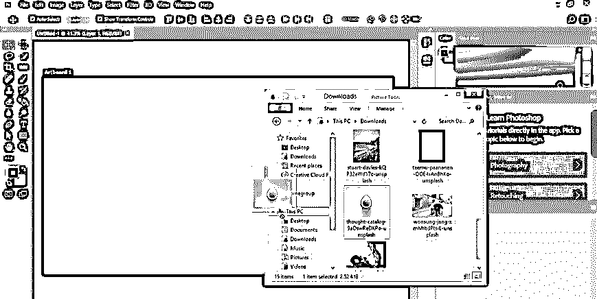

第三步:一旦你放置了任何一张图片，你的图片周围就会出现一个调整大小的边框。根据您的需要调整图像的大小，一旦调整完毕，请单击该图像属性栏的对勾标记来应用您的设置，或者您也可以简单地按下键盘上的 enter 键来应用您的设置。

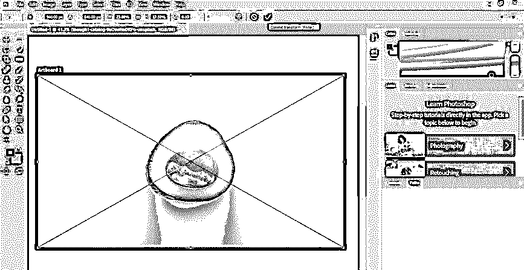

**第四步:**从这个软件的工具面板里拿一个快速选择工具来选择这个水果对象，因为我想调整它的大小。

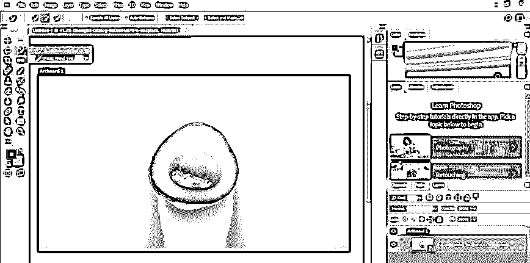

第五步:现在，像这样做一个选择。

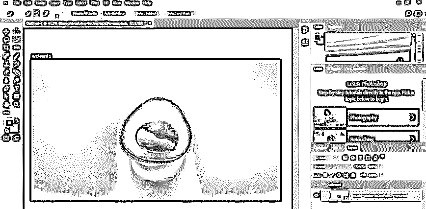

**第六步:**在使用这个快速选择工具的过程中，你可以通过按住 Alt 键从你的选区中减去不想要的区域。

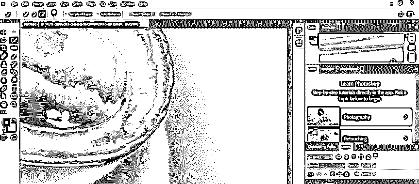

**第七步:**进入这个软件的图层面板，在工作屏幕的右侧，然后用鼠标右键在这个图像图层上点击右键。一旦你点击，一个弹出列表将打开点击'光栅化层'选项。

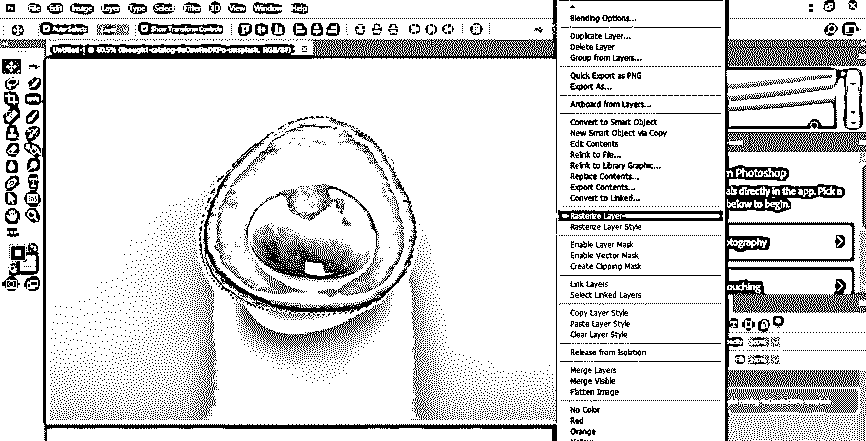

**第八步:**进入编辑菜单栏的菜单，菜单栏在工作屏幕的顶部，点击即可。将打开一个弹出列表。转到此列表的变换选项，然后单击新下拉列表的缩放选项。

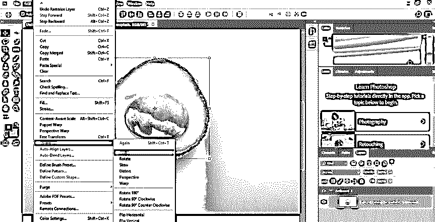

**第九步:**或者你可以用鼠标右键点击你选中的对象。一旦你点击，一个下拉列表将被打开；您也可以在这里通过单击来选择缩放选项。

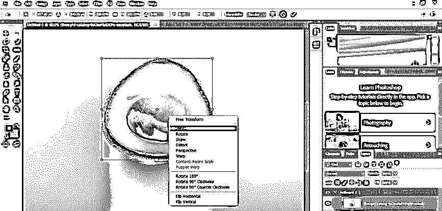

**第十步:**现在按住包围盒的锚点，增加这个水果的大小。在调整对象大小时按住键盘的 shift 键，以保持对象的宽度和高度的比例。

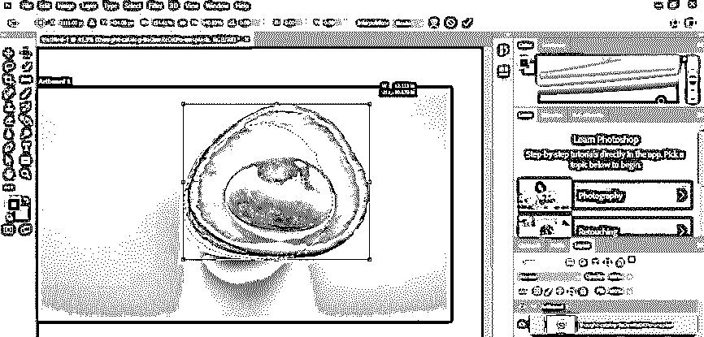

**步骤 11:** 现在，你可以将这个物体替换到你图像中的任何其他地方，或者将它留在原来的位置，以覆盖它之前的形状。

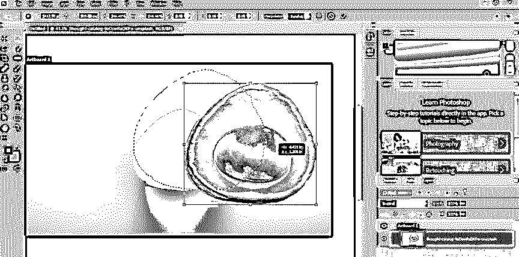

**第十二步:**如果你想把它放在别的地方，那么就借助这个软件的移动工具把它移动到那个地方。

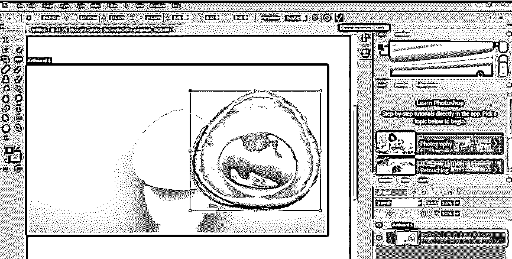

**步骤 13:** 现在转到位于工作屏幕顶部的该软件菜单栏的选择菜单。将打开一个弹出列表。通过单击从列表中选择取消选择选项。

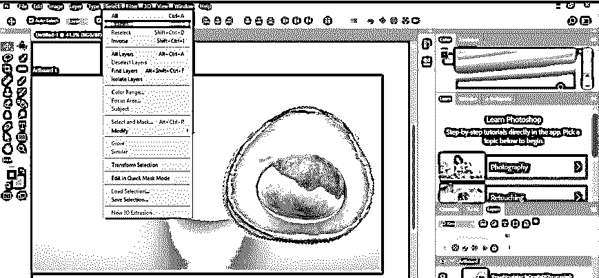

**第 14 步:**一旦取消选择，你的对象就会像这样放在你选择的地方。现在，再一次，到这个软件的工具面板，通过点击它的图标选择克隆工具。

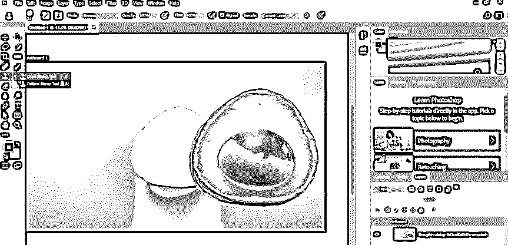

**第十五步:**现在借助这个软件的克隆工具，隐藏你的物体之前的形状。通过提供此软件的克隆工具笔刷大小的期望值，从克隆工具属性栏的大小选项中调整克隆工具形状的大小。

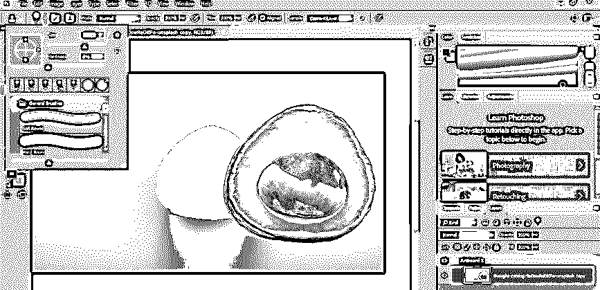

**步骤 16:** 现在用这个软件的这个克隆工具的笔刷复制背景色。复制时，按住键盘上的 Alt 键并单击要复制的图像区域。然后松开键盘的 Alt 键，将鼠标光标放在图像中水果的空白区域。现在按住鼠标左键，然后像这样拖动鼠标光标覆盖这个区域。

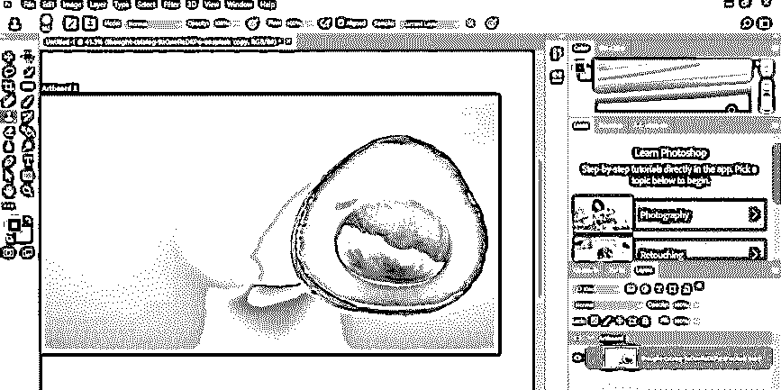

**第十七步:**一旦为你覆盖了所有不需要的区域，你的形象就变成这样了。如果需要，您可以使用相同的方法再次调整对象的大小，将对象放在图像中的任何其他位置。你可以自由地一次又一次地调整你的对象的大小。

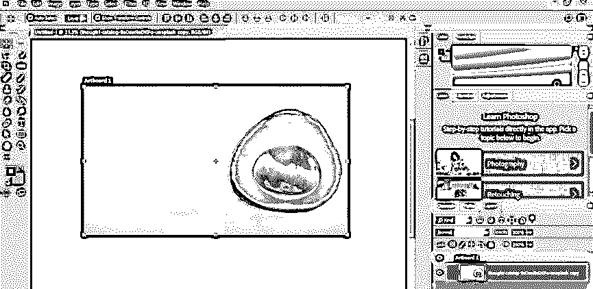

通过这种方式，您可以按照几个简单的步骤在 Photoshop 软件中调整任何图像的大小，并在您的项目工作中很好地利用它。

### 结论

现在，看完这篇文章，你可以理解什么是调整对象的大小，以及如何使用 Photoshop 软件的一些功能来调整对象的大小。经过实践，你可以很好地掌握 Photoshop 软件的这种大小调整功能。

### 推荐文章

这是一个在 Photoshop 中调整对象大小的指南。这里我们讨论一个介绍，如何在 photoshop 中一步一步地调整对象的大小。您也可以浏览我们的其他相关文章，了解更多信息——

1.  [Photoshop 中的智能对象](https://www.educba.com/smart-objects-in-photoshop/)
2.  [Photoshop 中的排版](https://www.educba.com/typography-in-photoshop/?source=leftnav)
3.  [Photoshop 中的图章效果](https://www.educba.com/stamp-effect-in-photoshop/?source=leftnav)
4.  Photoshop 中的[滤镜](https://www.educba.com/filters-in-photoshop/?source=leftnav)

