# 扭曲效果 Photoshop

> 原文：<https://www.educba.com/distortion-effect-photoshop/>

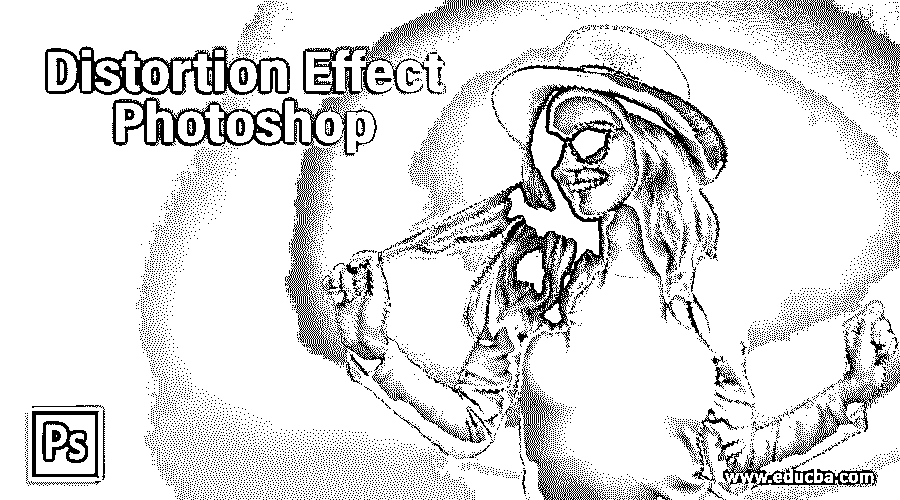

## 扭曲效果 Photoshop 简介

Photoshop 是一款图形编辑软件，由 Adobe systems 开发，作为其图像编辑软件。借助这个软件的不同功能，我们可以在我们的图像上制作不同类型的效果。扭曲是一种效果，通过它你可以对你的图像进行创造性的扭曲，并从中获益。本文将讨论扭曲效果的不同参数，并介绍如何在你的图像上应用这种效果并从中获得最佳效果的不同步骤。所以让我们开始讨论 Photoshop 软件的论文题目。

### Photoshop 中如何使用扭曲效果？

我们可以在 Photoshop 中使用这个功能的一些步骤，以一种非常简单的方式在我们的图像上应用扭曲效果。但是在开始之前，让我们先了解一下这个软件的用户界面，这样我们就可以更好地理解这个主题，并且毫无问题地掌握这个主题的知识。

<small>3D 动画、建模、仿真、游戏开发&其他</small>

**步骤 1:** 在工作屏幕的顶部，我们有一个称为菜单栏的栏。该栏有一些菜单，帮助我们管理该软件的不同参数。在这个栏下面，我们有另一个栏，我们称之为属性栏。该栏显示您工作期间该软件的活动工具的参数。在这个属性栏下面，我们在这个软件中有一些部分，在左侧我们有工具面板，它有一些使我们的工作变得容易的工具，在中心我们有显示窗口来查看我们当前的工作，在右侧我们有一些选项卡，如颜色选项卡，图层面板和其他一些不同的选项卡，它们在我们的项目工作期间帮助我们的工作。您可以在本软件用户界面的任何地方根据您的要求进行调整。

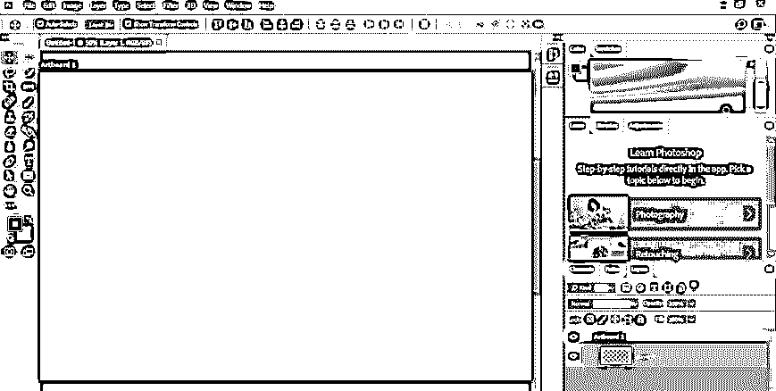

**第二步:**让我们在这个软件中有一个图像，用于我们对这个话题的学习。要在 Photoshop 中放置图像，只需打开您个人电脑中保存图像的文件夹，从该文件夹中选择您想要的图像，然后转到 Photoshop 软件的显示窗口，松开鼠标按钮将其放置在此处。

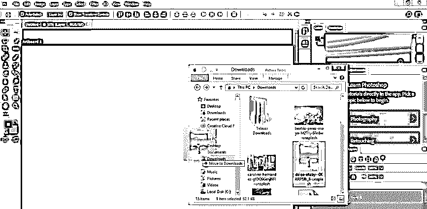

**第三步:**现在，通过调整图像的宽度和高度，根据您的要求调整图像的大小。完成调整后，单击软件图像属性栏中的提交选项或勾选标记选项。您也可以按键盘上的 Enter 按钮来应用您的设置。根据你给这个形象重新命名。我会把它命名为我的照片。要命名您的图像，请双击图像的名称区域。

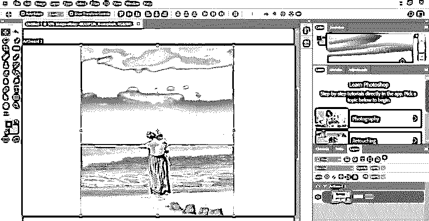

**第四步:**进入该软件的图层面板，该面板位于工作区的右侧，点击该图像图层，鼠标左键选中该图像。现在按下键盘上的 Ctrl + J 键来复制这张图片。

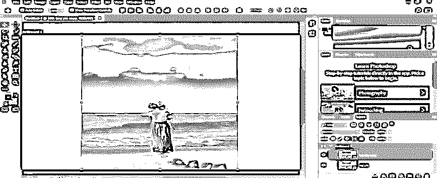

**第五步:**进入该软件的工具面板，在左侧，用鼠标左键点击快速选择工具，激活该工具。

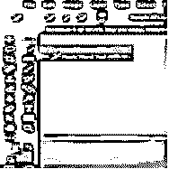

第六步:现在点击图层面板中我的图片图层的副本，然后在这个快速选择工具的帮助下选择图片中的女士。

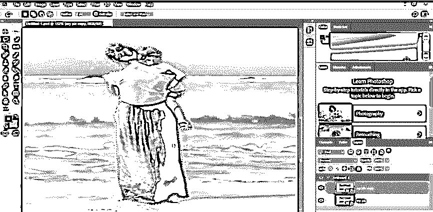

**第七步:**一旦你做出了正确的选择，按下键盘上的 Ctrl + J，将这位女士从原始图像中分离出来。

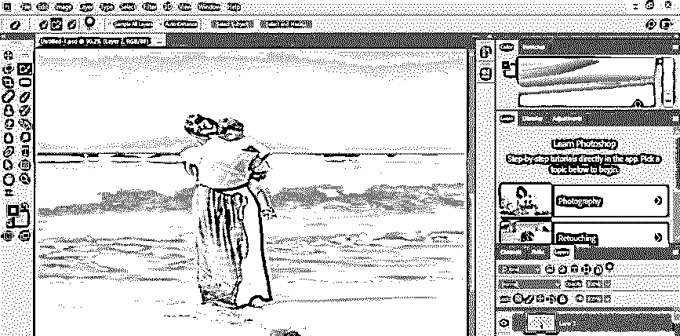

**第 8 步:**现在，再次进入我的 Pic 图像层的副本，在显示窗口区域的该图像上用鼠标右键单击。将打开一个弹出列表。选择“反向选择”选项，从列表中反向选择。

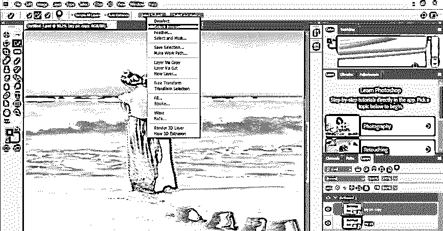

**第九步:**再次按下键盘上的 Ctrl + J 键，将该图像的背景与原始图像分离。

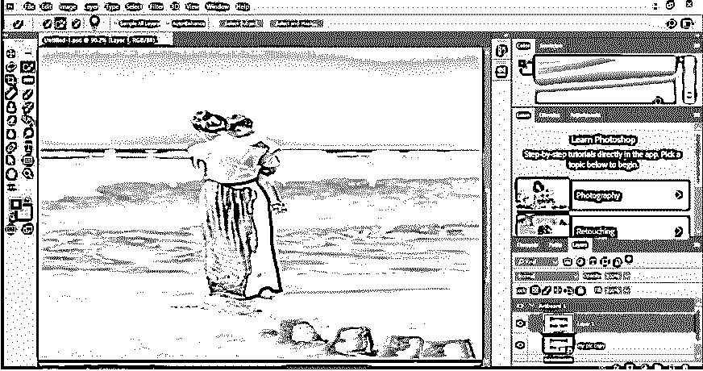

**步骤 10:** 将上面女士的分离图像(命名为图层 2)放置到这个背景图层上，然后点击选择这个分离的背景图层(图层 1 副本)。

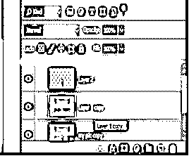

**第十一步:**进入本软件菜单栏的滤镜菜单，点击。一旦你点击过滤器菜单，一个弹出列表将被打开，转到列表的扭曲选项，并点击新的下拉列表的波纹选项。您可以从列表中选择任意一个扭曲效果选项。我将使用 Photoshop 软件扭曲效果的波纹选项向你解释扭曲。

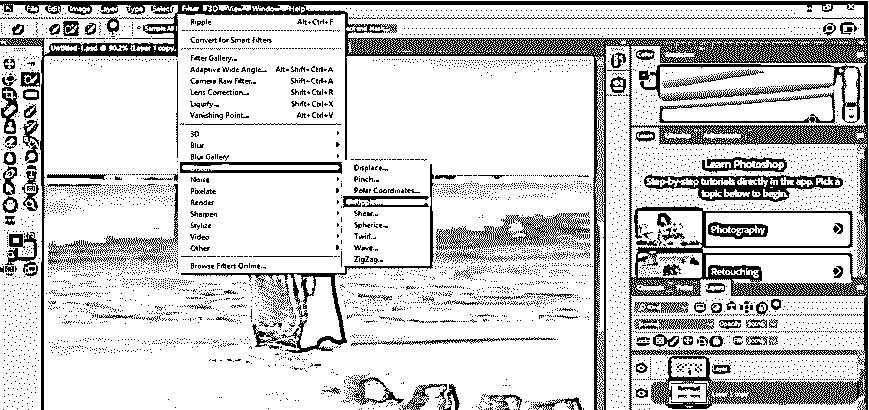

**第十二步:**现在，一个涟漪效果的对话框会这样打开。通过增加或减少“数量”选项滑块上的值来调整波纹的数量。您可以使用键盘输入方法直接输入任何值。完成后，单击此框中的“确定”按钮。

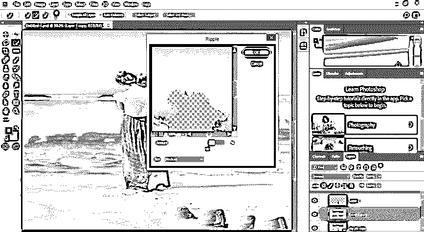

步骤 13: 一旦你点击了确定按钮，这种类型的效果将使用扭曲选项来创建。

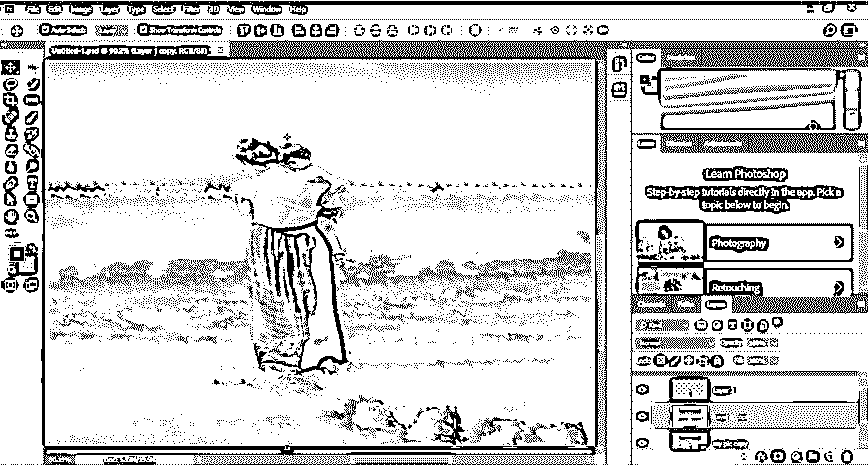

**步骤 14:** 再次进入该软件的工具面板，用鼠标左键点击工具列表中的克隆图章工具。

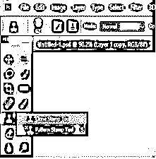

**第十五步:**根据你的需要，通过这个克隆工具的属性栏设置克隆工具的大小。我将它的大小设置为 18 px。

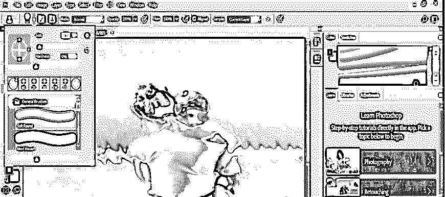

**步骤 16:** 现在按住键盘上的 Alt 键，复制你想要覆盖的图像区域。我想删除女士周围不需要的区域，所以我将通过按住键盘的 Alt 键来复制这附近的区域，并在女士的边缘周围克隆它。

第 17 步:一旦我在图像的女士边缘做了所有的克隆，它看起来就像描绘的一样。

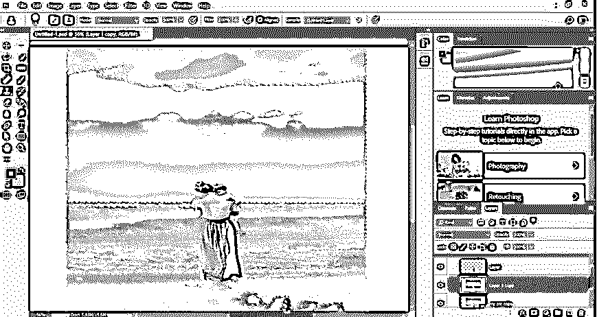

这样，你就可以利用这个软件的失真效果，在你的图像中进行不同类型的创意编辑。

### 结论

现在，在这篇文章之后，你可以理解什么是 Photoshop 软件中的失真效果，以及你如何处理它的参数来在你的图像上获得失真效果。通过一个一个地练习，你可以很好地掌握一个带有 Photoshop 扭曲效果选项的应用程序。

### 推荐文章

这是一个扭曲效果 Photoshop 的指南。这里我们讨论一个介绍，如何一步一步的在 Photoshop 中使用扭曲效果。您也可以浏览我们的其他相关文章，了解更多信息——

1.  [如何在 Photoshop 中绘画？](https://www.educba.com/how-to-paint-in-photoshop/)
2.  [Photoshop Cinemagraph](https://www.educba.com/photoshop-cinemagraph/)
3.  [Photoshop 中的刻录工具](https://www.educba.com/burn-tool-in-photoshop/)
4.  [Photoshop 中的红眼工具](https://www.educba.com/red-eye-tool-in-photoshop/)

