# Photoshop 中的鱼眼效果

> 原文：<https://www.educba.com/fisheye-effect-in-photoshop/>

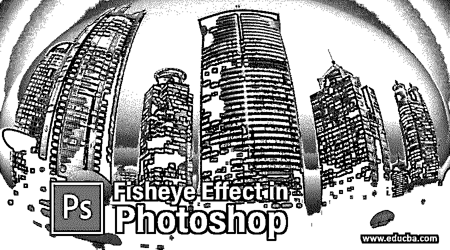

## Photoshop 中的鱼眼效果介绍

Photoshop 是由 Adobe Systems 开发的光栅图形编辑软件，被图像编辑专业人员广泛使用。我们可以利用这个软件令人兴奋的功能和技术，在这个软件中做出好的和创造性的效果。鱼眼是一种效果，通过它，你可以将镜头类型的效果应用到你的图像上，并用你自己的创意制作出有效的图像。在这篇文章中，我们将看看鱼眼效果的参数，并了解如何在我们的图像上应用这种效果，使它不同于正常的图像。所以让我们以一种非常激动人心的方式来讨论这个话题。

### 如何在 Photoshop 中应用鱼眼效果？

您可以将这种效果应用到您的图像上，只需遵循这种效果的几个简单步骤，就可以在工作中获得最佳效果。所以为了更好的理解这个话题，让我们来看看这个软件的用户界面，这样在我们学习的过程中就不会有问题了。

<small>3D 动画、建模、仿真、游戏开发&其他</small>

**步骤 1:** 从用户屏幕的顶部开始，有一个名为菜单栏的栏，其中包含许多用于管理不同软件参数的菜单。在此栏下，我们有一个活动工具或活动图像的属性栏，通过它我们可以管理该工具或图像的参数，以便对它们进行更改。在这个栏下面，我们有一些部分，在左侧我们有一个工具栏，上面有一些工具，在中心我们有一个显示窗口，我们可以在其中看到我们的工作，在右侧我们有一些标签，如颜色，层，和其他一些。您可以根据自己的需要对所有这些部分进行设置。

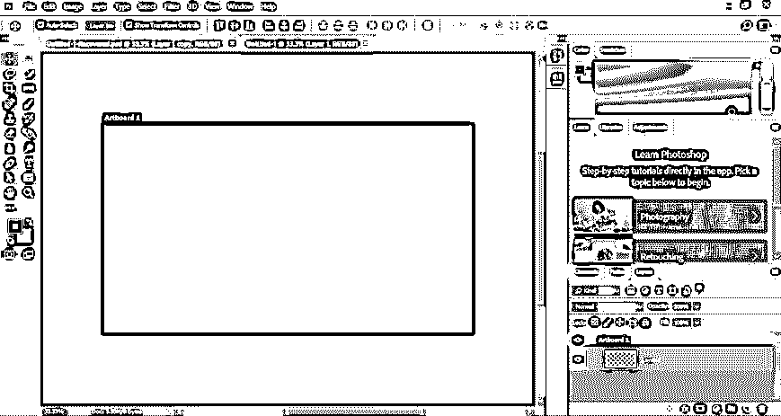

**第二步:**首先让我们对这个话题的学习有个形象的认识。为此你可以有自己的图像，也可以从网上下载。我会从网上下载。现在打开保存图像的文件夹，然后用鼠标左键从那里选择它，并转到 Photoshop 软件的显示窗口区域，释放鼠标按钮将其放在那里。

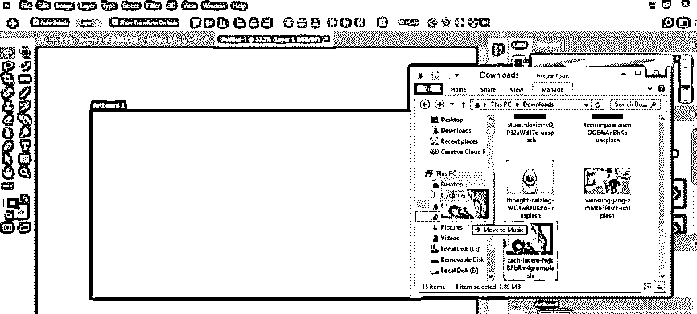

**第三步:**或者你可以去菜单栏的文件菜单点击。用鼠标左键单击打开的下拉列表中的放置嵌入选项。

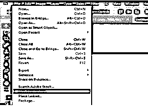

**第四步:**点击后，会打开一个放置嵌入框，用于将图像放置在该软件中。通过单击选择您想要的图像，然后单击此对话框的放置按钮来放置图像。

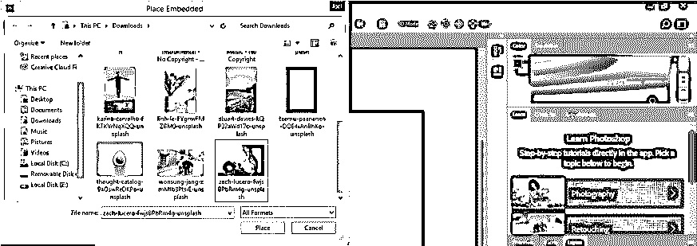

**第五步:**根据你调整你的图像大小；单击此图像属性栏的提交转换按钮，或按键盘的 enter 按钮。

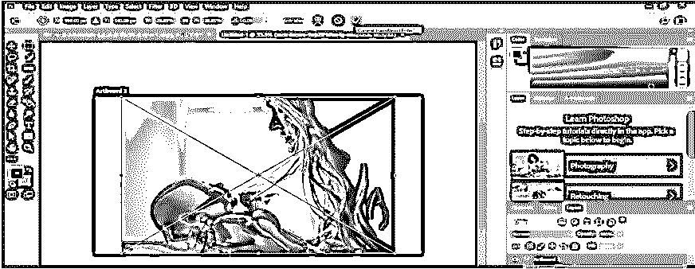

**步骤 6:** 现在进入菜单栏的图像菜单，点击下拉列表中的图像尺寸选项，进一步改变图像的尺寸。

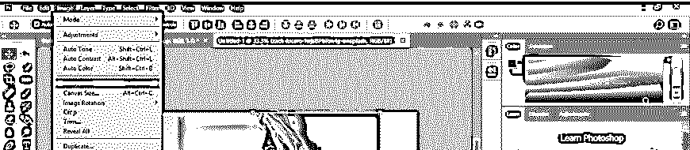

**第七步:**我想制作一个正方形的图像，所以我会在这个图像的宽度和高度的框中给一些值，然后按下这个图像大小框的 Ok 按钮。我把这个图像做成正方形，这样这个软件的鱼眼功能就能正确地给出它的效果。

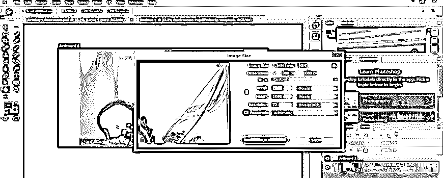

**第八步:**现在，我将重命名这张图片。要重命名，请双击图像名称，并根据您的选择进行命名。我将它命名为图片 1。

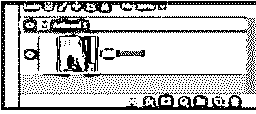

**第九步:**现在按 Ctrl + J 复制该图像以备将来使用。

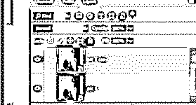

**步骤 10:** 现在按下键盘上的 Ctrl + T 按钮，这样旋转该图像，点击该图像属性栏上的勾号，应用该变换。

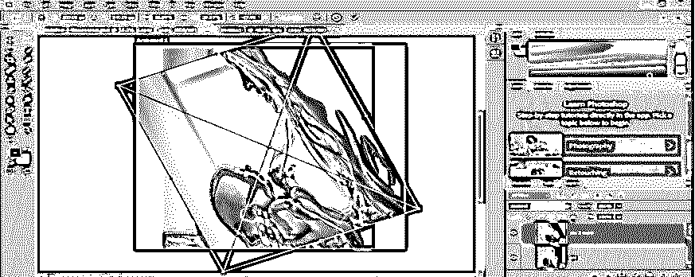

**步骤 11:** 现在进入这个软件的图层面板，点击 Pic 1 图层的眼睛按钮将其隐藏。

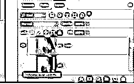

**步骤 12:** 现在再一次，按 Ctrl + T 在这个图像周围的变换框。用鼠标右键点击，从变换框的下拉列表中选择扭曲选项。

**第十三步:**或者你可以到这个软件菜单栏的编辑菜单，到下拉列表的变换选项。通过点击从新的下拉列表中选择扭曲选项。

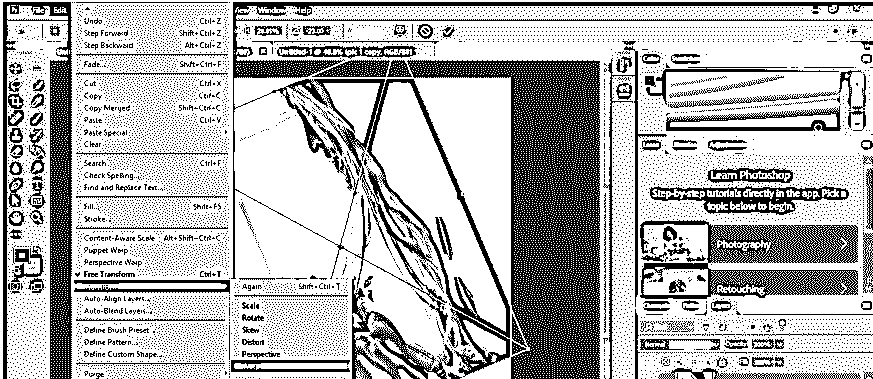

第 14 步:一旦你点击了一个扭曲，一个边界框就会像这样围绕着你的图像。

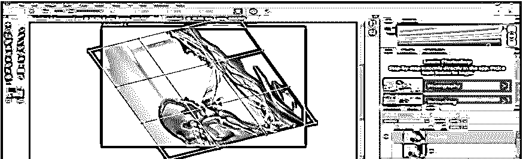

**第十五步:**现在点击 warp 属性栏自定义选项的下拉箭头，点击 Warp 下拉列表的鱼眼选项。

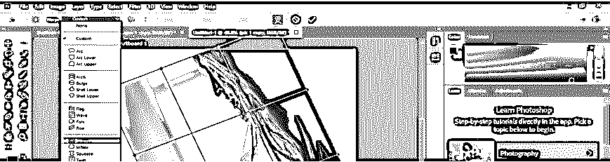

**第 16 步:**一旦你点击鱼眼选项，扭曲边界框就会这样变化。

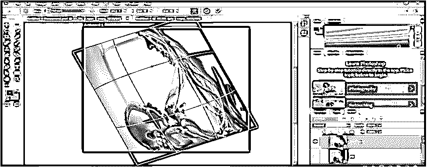

**步骤 17:** 你可以增加 warp 属性栏的 Bend 选项的值，这样可以增加你的图像上眼睛的效果。

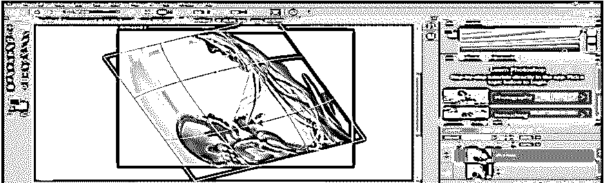

**步骤 18:** 你可以通过改变 warp 选项属性栏的 H 选项的值来改变这张图片的水平比例值。

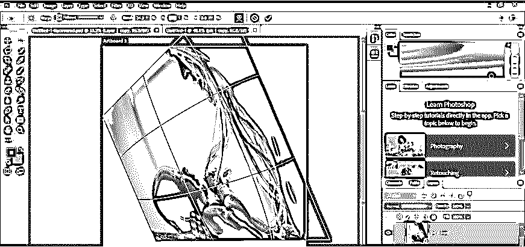

**第 19 步:**你可以改变 warp 选项属性栏的 V 选项的值来改变该图像的垂直比例值。

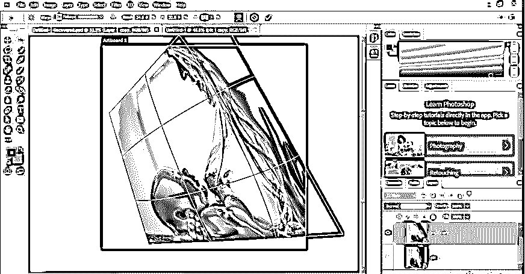

**步骤 20:** 一旦你做了，点击 warp 属性栏的“提交变换”标签或者按键盘的回车键。

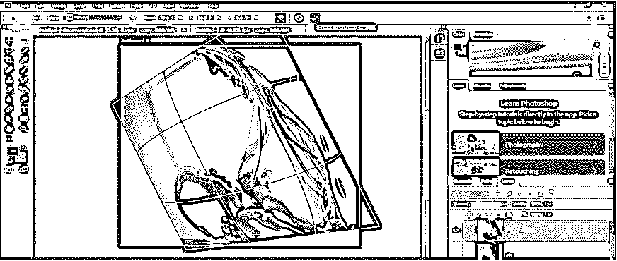

第 21 步:你的形象会是这样的。您可以看到之前的图像和编辑后的图像之间的差异。

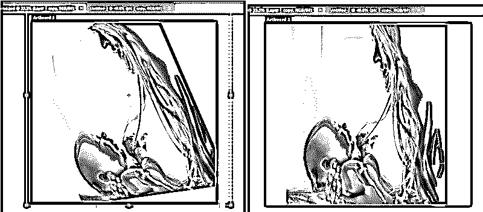

步骤 22: 现在，从这个软件的工具栏上点击一个矩形工具。

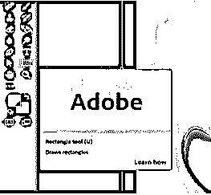

**步骤 23:** 并借助矩形工具画出这样一个矩形。你可以根据自己改变这个矩形的颜色。

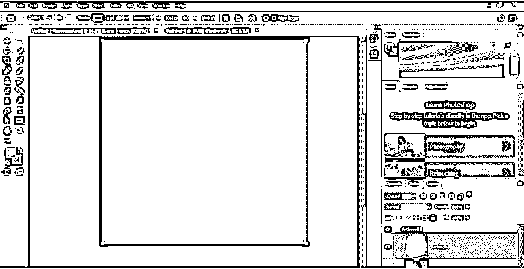

**步骤 24:** 现在进入这个软件的图层面板，借助鼠标左键将上面的图像图层拖动到这个矩形图层上。

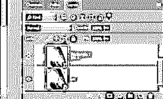

**第 25 步:**一旦拖动，你的图像就会来到这个矩形图层的上方，你会发现一个带背景的有效图像。你可以用你自己的想法来处理你的形象。

### 结论

在 Photoshop 软件的这篇鱼眼效果文章之后，你可以了解鱼眼效果，并分析如何将这种效果应用到你的图像中，以便在工作中获得有效的结果。通过练习，你可以很好地掌握你的工作。

### 推荐文章

这是 Photoshop 中鱼眼效果的指南。这里我们讨论一个入门，如何一步一步的在 photoshop 中使用鱼眼效果。您也可以浏览我们的其他相关文章，了解更多信息——

1.  [金属效果 Photoshop](https://www.educba.com/metallic-effect-photoshop/)
2.  [Photoshop 中的人像效果](https://www.educba.com/portrait-effect-in-photoshop/)
3.  [Photoshop 中的运动效果](https://www.educba.com/motion-effect-in-photoshop/)
4.  [Photoshop 中的火焰效果](https://www.educba.com/fire-effect-in-photoshop/)

