# Photoshop 中的消失点

> 原文：<https://www.educba.com/vanishing-point-in-photoshop/>

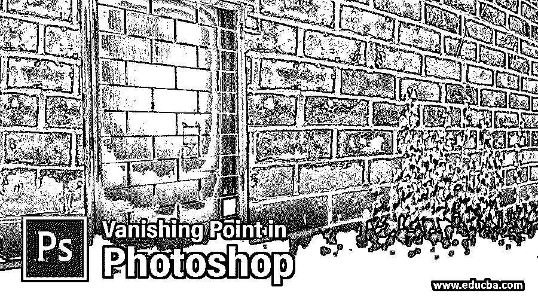

## Photoshop 中消失点的介绍

Photoshop 是一款光栅图形编辑软件，由 Adobe systems 开发，作为其图像编辑软件。我们有许多不同类型的功能在这个软件中，通过它我们可以根据我们的要求制作一个有效的编辑图像。Photoshop 中的消失点是这个软件的一个重要特点；通过使用这些功能，我们可以在任何平面图上应用我们的图像。我们可以将我们的形象印在任何包装材料的每一面。所以让我们用几个例子来讨论本文中的消失点。我们还会看看 Photoshop 软件中处理消失点的参数。

### Photoshop 中如何使用消失点？

我们可以通过遵循一些步骤以非常简单的方式使用该软件中的消失点功能，并且处理参数也非常容易。但是在开始之前，让我们看一下这个软件的工作屏幕，以便我们可以更好地理解这篇文章中的主题。

<small>3D 动画、建模、仿真、游戏开发&其他</small>

**步骤 1:** 在工作屏幕的顶部，我们有一个菜单栏，其中有许多菜单，用于在该软件中进行不同类型的调整；在这个工具栏下面，我们有一个属性栏，我们可以在其中看到活动工具的属性，并在使用该工具的过程中对我们的工作进行不同类型的更改，在这个工具栏下面，我们在左侧有三个部分，我们有工具面板，其中有不同类型的工具，在中心，我们有显示窗口，我们可以在其中看到我们当前的工作， 在这一部分的右侧，我们有一些标签，如颜色标签，图层面板和其他一些在我们的工作中进行不同类型的更改。 您可以根据自己的需要调整各部分的位置。

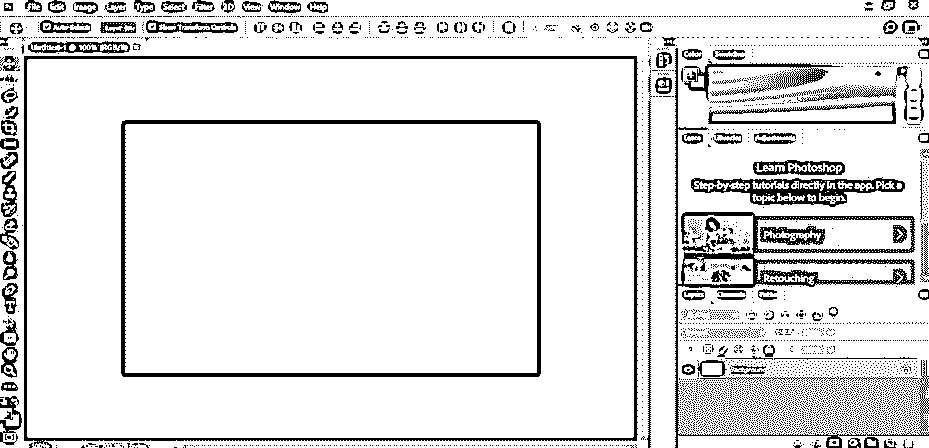

**第二步:**首先，让我们借助本学习软件的矩形工具，制作出这种必须在不同轴平面上呈现的形状。

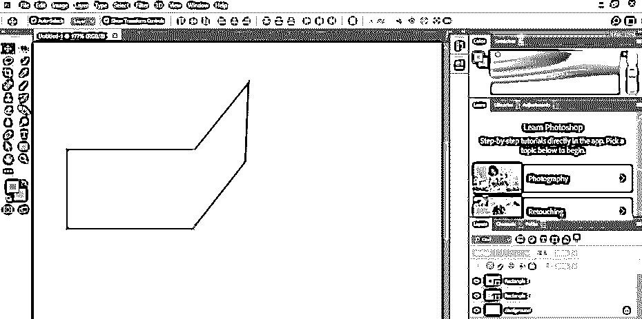

第三步:现在，让我们将一幅图像导入该软件。要导入图像，只需打开您个人电脑中保存图像的文件夹，然后在鼠标左键的帮助下，将图像从那里拖放到该软件的显示窗口区域。

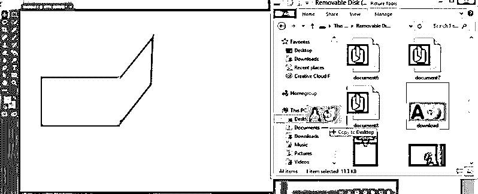

**第四步:**现在根据您的要求调整导入图像的大小，然后单击该图像属性栏上的勾选标记，将您的设置应用到导入的图像上。

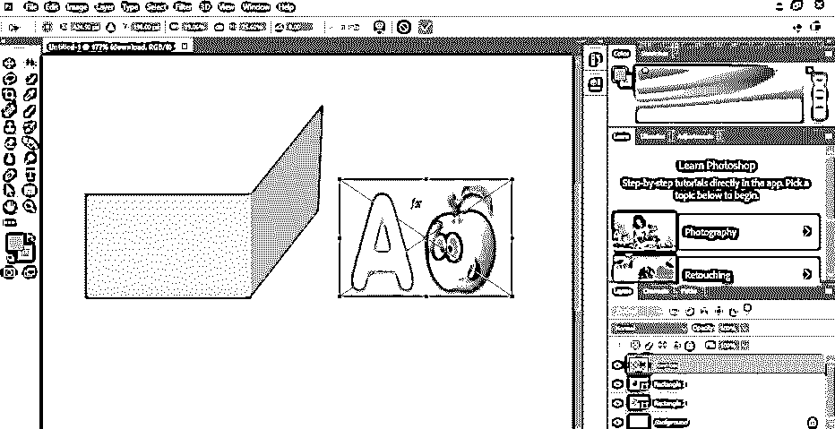

**第五步:**要使用这个软件的消失点选项，你的图像应该在栅格化图层上。因此，为这个软件去层面板，使鼠标右键点击图像层。将打开一个下拉列表，从列表中选择栅格化图层选项，单击该选项可使该图层栅格化图层。

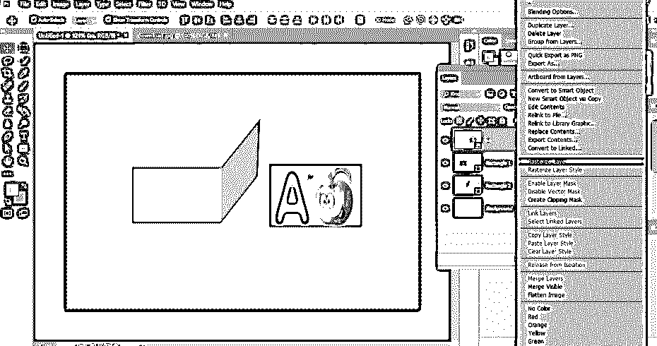

**第六步:**现在选择这一层，按 Ctrl + A 键选择所有选项。

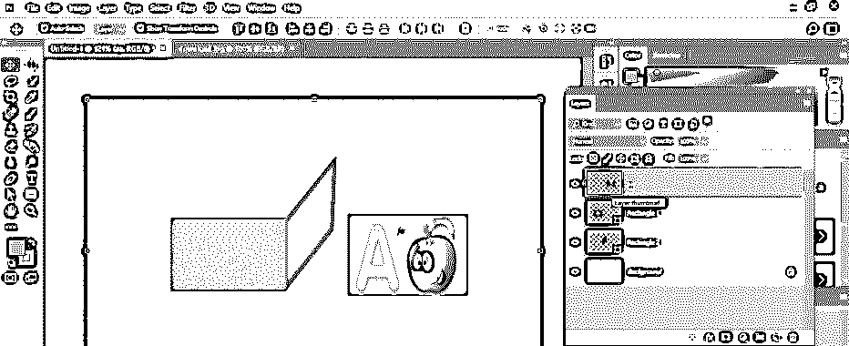

**第七步:**然后按下键盘上的 Ctrl + X 键，将这张图片从这一层剪切下来。

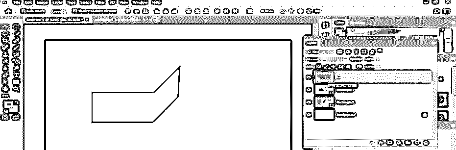

**步骤 8:** 现在转到该软件的菜单栏，该菜单栏位于工作屏幕的顶部，点击过滤器菜单。将打开一个下拉列表；点击列表中的消失点选项，或者你可以使用快捷键 Alt + Ctrl + V 来选择消失点。

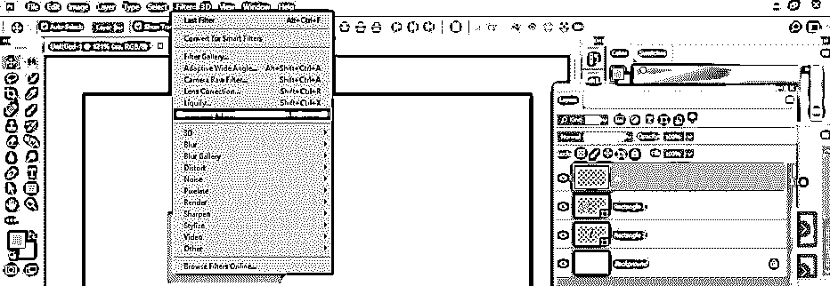

第九步:一旦你点击了这个选项，一个消失点窗口将在一个新的窗口中打开。现在，从窗口左侧的窗口工具中选择网格选项，用鼠标选择你想要应用图像的形状平面。我将单击此平面图的第一个角，然后将鼠标光标逐个拖动到所有三个角，因为它希望将我的图像应用到此平面图。

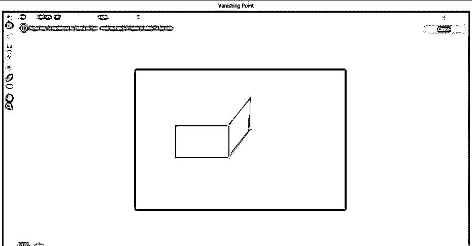

第十步:如果你在你选择的区域看到一条红线，这意味着你的选择不正确。因此，为了做出正确的选择，请将选择框的锚点拖动到形状的右侧。

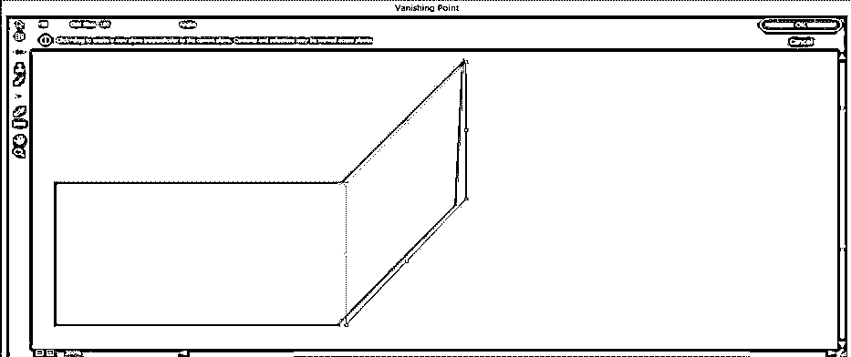

**步骤 11:** 如果你的选择正确，选择线的颜色会变成蓝色。所以在选择的时候要小心。

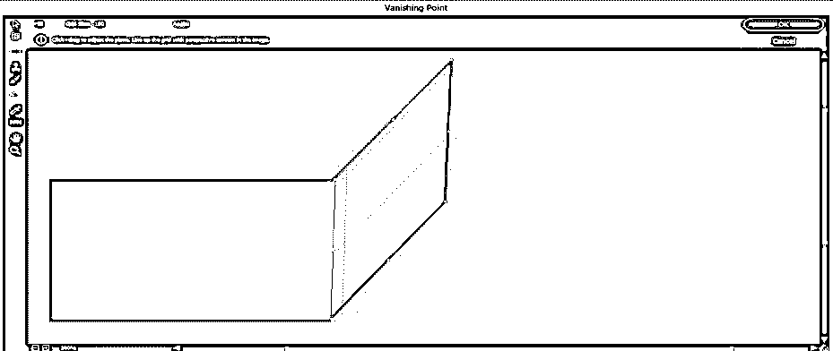

**第 12 步:**现在按下键盘上的 Ctrl + V 键，在这个消失点窗口屏幕的区域粘贴你的图像，你的图像就会这样粘贴。

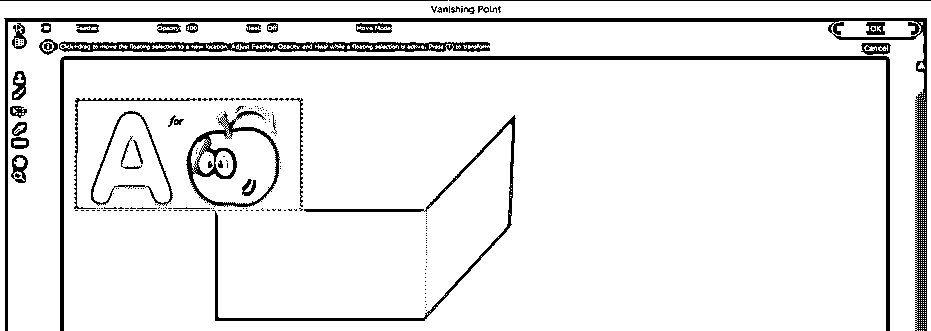

**步骤 13:** 现在，一旦你把你的图像拖到你画了一个消失点的平面附近，它就会像这样变成那个平面的方向。

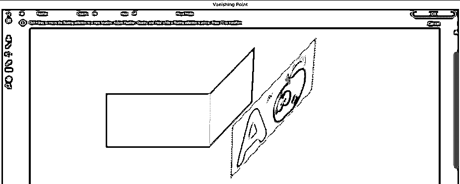

**步骤 14:** 将该图像拖动到您的计划内，并根据您的设置要求进行调整。您可以使用此窗口的矩形选框工具来调整图像的大小。

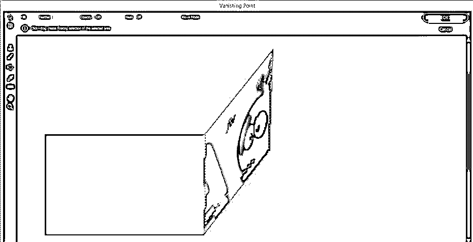

**第 15 步:**现在，当您按下消失点窗口屏幕的 Ok 按钮时，您的图像将像这样设置在您的项目工作中所需的计划中。

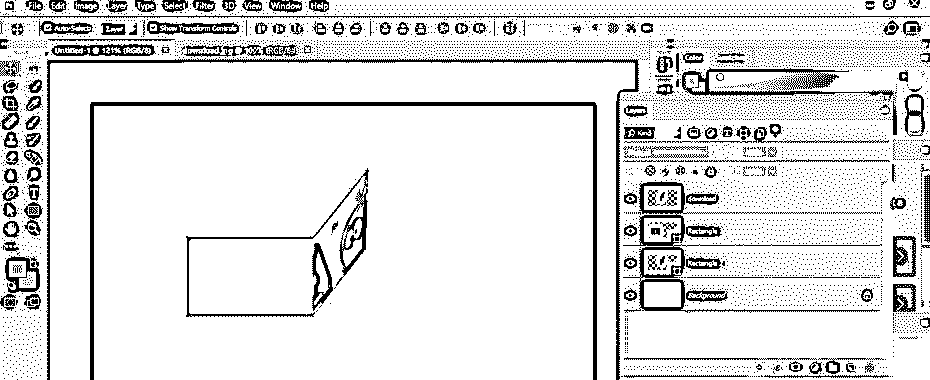

第十六步:你也可以调整墙上的任何图像。

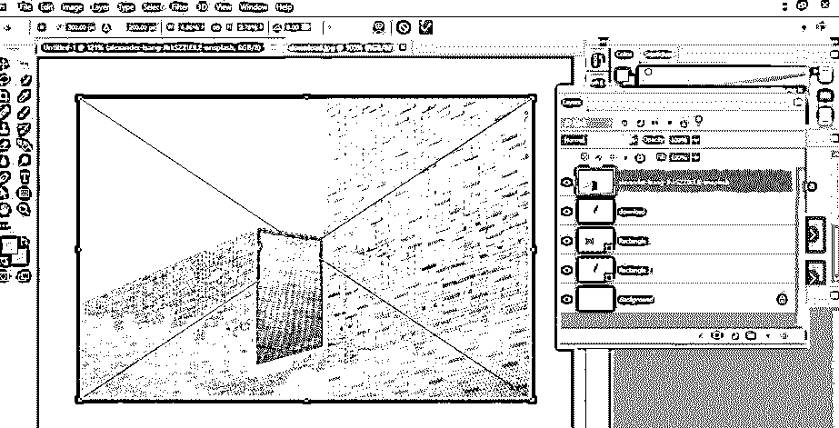

步骤 17: 为此，只需取一张图片，按照和前面相同的步骤将它栅格化。

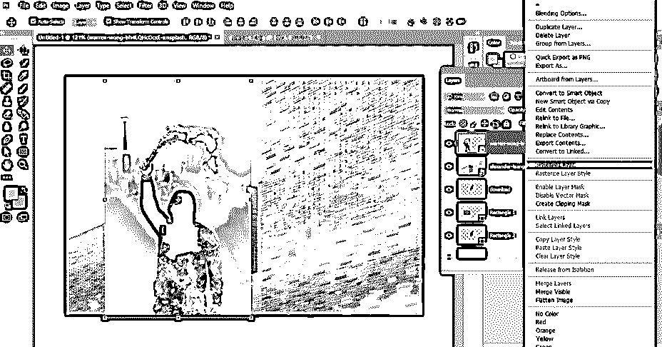

步骤 18: 现在重复我们之前做的消失点的所有步骤，然后根据你的要求调整消失框的锚点。我将这样设置它，然后按下键盘上的 Ctrl + V 按钮来粘贴我的图像。

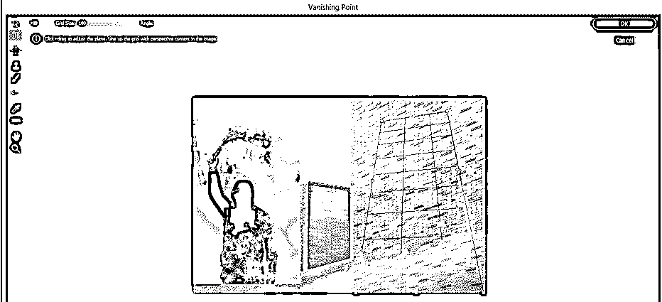

第 19 步:现在在这个消失框中拖动你的图像，像这样调整到你想要的位置。

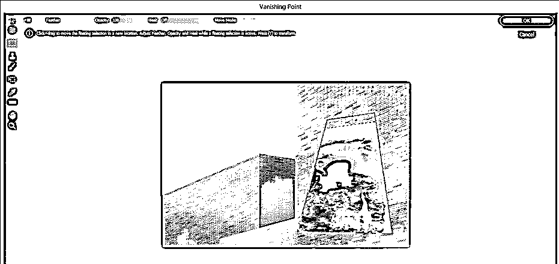

### 结论

在这篇文章之后，你可以理解什么是 Photoshop 中的消失点，以及如何使用它根据你的要求制作一个有效的图像，并在任何平面上调整该图像。练习后，您可以很好地掌握这一功能。

### 推荐文章

这是 Photoshop 中的消失点指南。这里我们讨论一下入门，如何一步一步的在 Photoshop 中使用消失点。您也可以浏览我们的其他相关文章，了解更多信息——

1.  [如何在 Photoshop 中绘画？](https://www.educba.com/how-to-paint-in-photoshop/)
2.  [Photoshop 中的 3D 文本效果](https://www.educba.com/3d-text-effect-in-photoshop/?source=leftnav)
3.  [在 Photoshop 中剪辑蒙版](https://www.educba.com/clipping-mask-in-photoshop/?source=leftnav)
4.  [在 Photoshop 中删除背景](https://www.educba.com/how-to-delete-background-in-photoshop/?source=leftnav)

