# 在 Photoshop 中修复透视

> 原文：<https://www.educba.com/fix-perspective-in-photoshop/>

## Photoshop 中固定透视的介绍

Photoshop 是图形编辑专业人员用于专业工作的光栅图像编辑软件之一。我们可以通过使用不同的软件功能对我们的照片进行任何类型的修改。固定视角是其中一个特征。通过这些特征，我们可以根据需要调整图像中物体的透视点，从而得到我们想要的结果。在这篇文章中，我们将讨论如何固定我们的图像的角度，并了解在这个过程中使用的技术的不同处理参数。所以让我们以一种非常激动人心的方式开始我们的讨论。

### Photoshop 中如何使用固定透视？

我们可以使用 Photoshop 中的修复透视功能，只需遵循几个简单的步骤，在我们的图像对象的透视视图中进行更改。但是在我们开始学习这个主题之前，让我们看一下这个软件的工作屏幕，以便更好地理解整篇文章。

<small>3D 动画、建模、仿真、游戏开发&其他</small>

**步骤 1:** 在工作屏幕的顶部有一个菜单栏，其中有许多菜单，用于在软件工作期间处理不同类型的参数，下面是活动工具的属性栏，用于在整个工作过程中处理工具的参数，在属性栏下面，左侧有三个部分，工具面板中有许多工具。 在这个部分的中心，我们有一个显示窗口，我们可以在其中看到我们当前的工作，在这个显示窗口的右侧，我们有一些面板，如颜色面板，图层面板和其他一些用于管理我们在这个软件中的工作。 您可以在工作屏幕的任何位置根据您的要求调整所有这些部分。

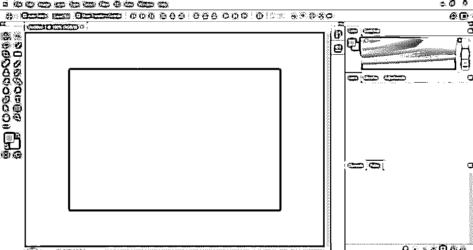

第二步:现在，让我们有一个图像，我们有一个扭曲的透视图。要在本软件中放置图像，只需转到您个人电脑中保存图像的文件夹，然后打开该文件夹。现在从那里选择那个图像，然后在鼠标左键的帮助下把它放到这个软件的显示窗口区域。

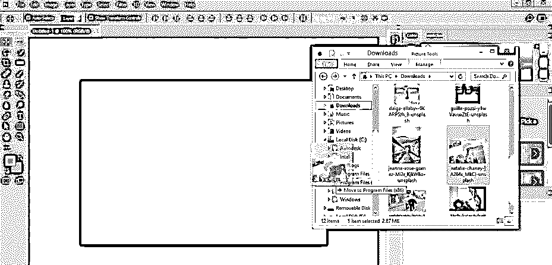

**第三步:**现在，根据您的需要，在本软件的文档屏幕上调整您的图像尺寸，并点击“提交转换”按钮或按下键盘上的 enter 按钮，将您的设置应用到该图像上。

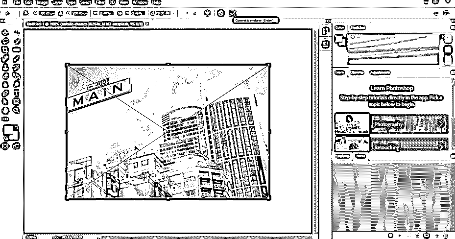

**第四步:**现在进入这个软件的图层面板，用鼠标左键点击选择图像图层。现在用鼠标右键点击这个图像层。将打开一个下拉列表，从下拉列表中选择“转换为智能对象”选项。

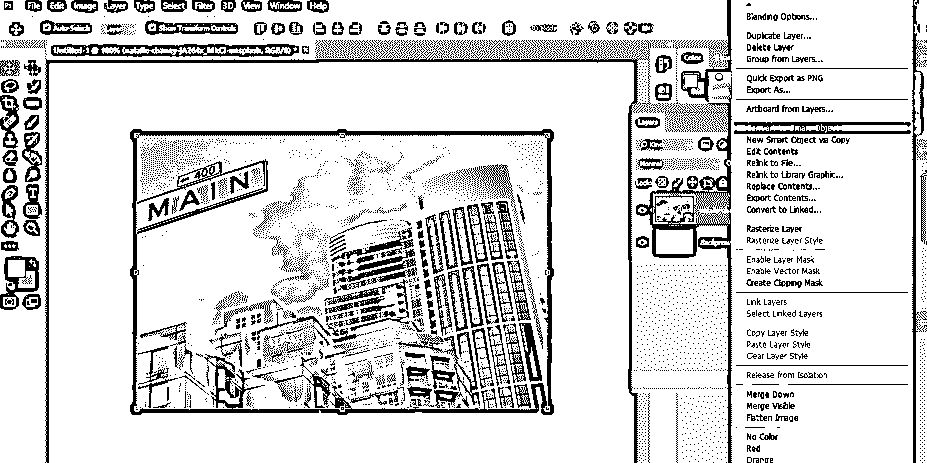

**步骤 5:** 现在转到该软件的菜单栏，它位于工作屏幕的顶部。现在点击菜单栏的过滤器菜单。将打开一个下拉列表；从该列表中选择相机原始数据滤镜选项，或者您可以按 Shift + Ctrl + A 作为键盘上的快捷键。

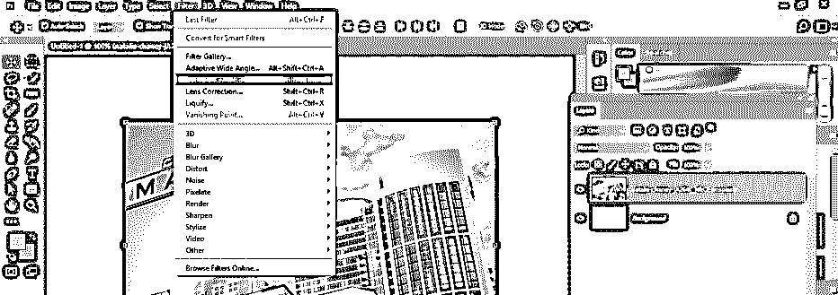

第六步:一旦你选择了这个选项，相机原始数据窗口就会像这样在一个单独的窗口中打开。

**第七步:**现在点击这个窗口的变换工具选项，也可以按键盘上的 shift + T 键进行透视设置。

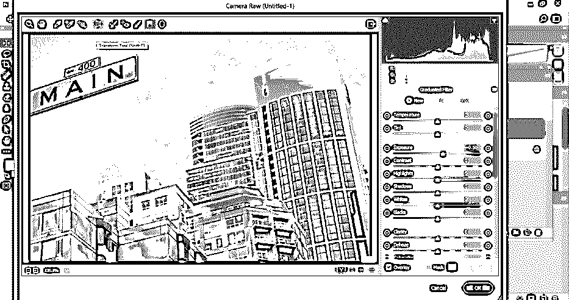

**第 8 步:**点击此选项后，视角设置的参数会在此窗口右侧的参数区打开，如下图所示。

**第九步:**在这里，你可以点击这个自动校正图标，一旦你点击这个自动校正图标，它就会自动调整你的图像的扭曲透视，并像这样垂直和水平对齐。

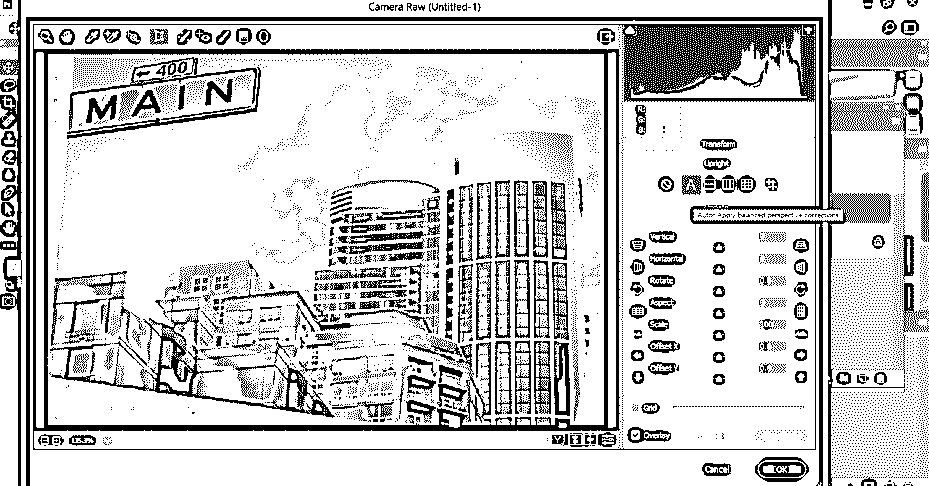

**步骤 10:** 你可以点击这个层次选项，当你点击这个，它会调整你的图像的层次，以调整你的图像的视角点。

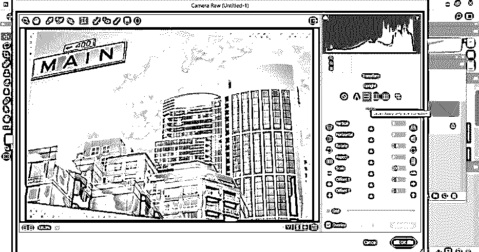

**步骤 11:** 如果你想只在图像的垂直方向上固定透视点，你可以点击这个垂直选项。

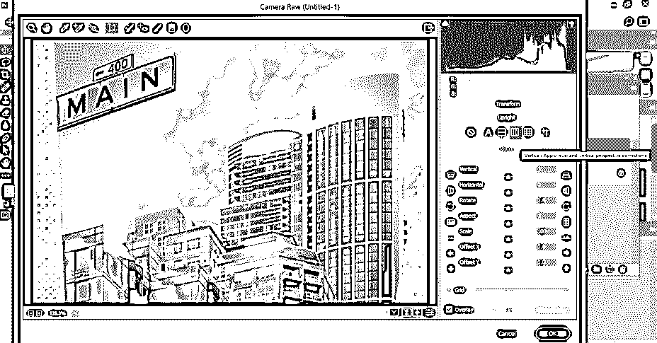

**步骤 12:** 如果您点击完整选项，它将使用水平、垂直和水平三个选项对您的图像进行透视校正。

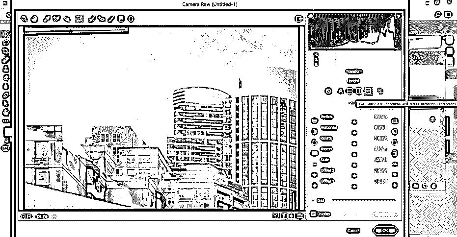

**步骤 13:** 通过向导选项，你可以制作一条指引线，它将沿着这条指引线校正你图像中的透视点。只要用鼠标点击这个选项。

**步骤 14:** 并根据你的图像的任意一条垂直线或水平线做指引。我会像这样做两条垂直线，它会以这两条线为参考线来改变我的图像的透视点。

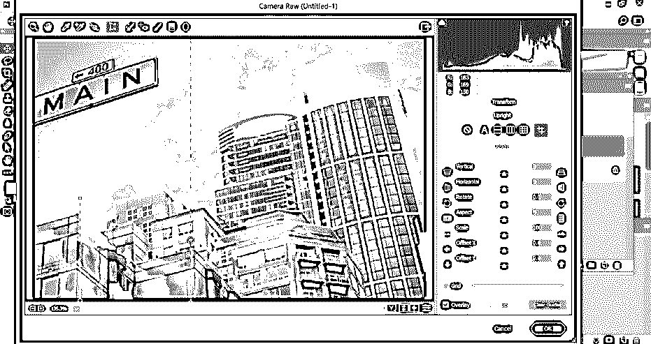

**第 15 步:**在这下面，我们有一些不同参数的值，可以手动调整。通过更改垂直选项的值，您可以像这样更改此图像的垂直比例。

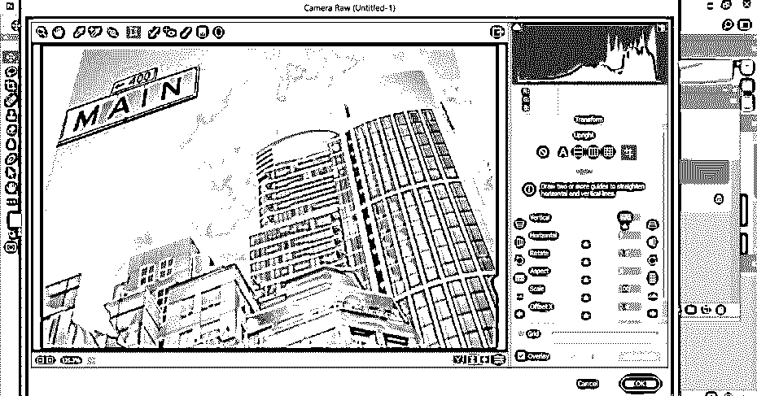

**第 16 步:**通过改变水平选项的值，可以像这样改变这张图片的水平比例。

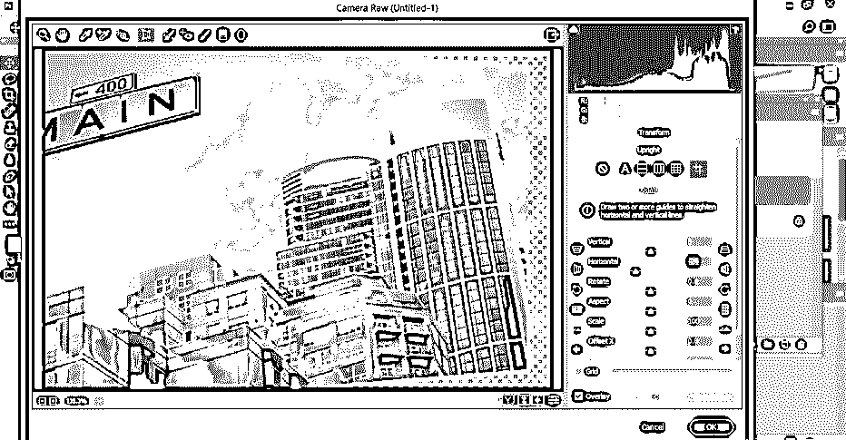

步骤 17: 通过改变旋转选项的值，你可以像这样以任何特定的角度旋转你的图像。

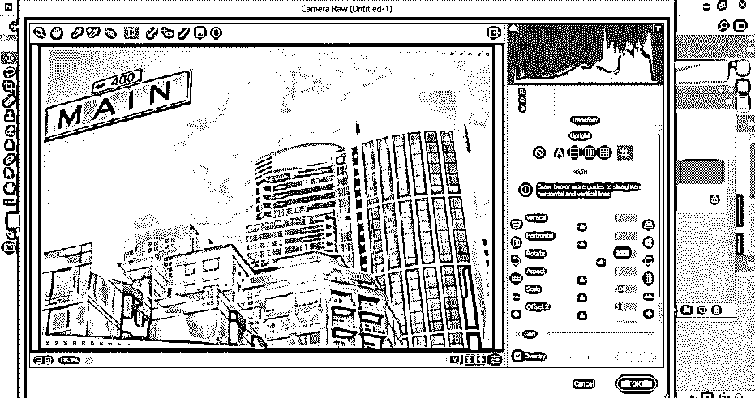

**步骤 18:** 通过这些参数的缩放选项，您可以根据自己的需要放大或缩小图像。您可以在网格上通过网格选项查看图像上的网格线，并通过拖动网格滑块增加网格选项的值来增加网格的数量。

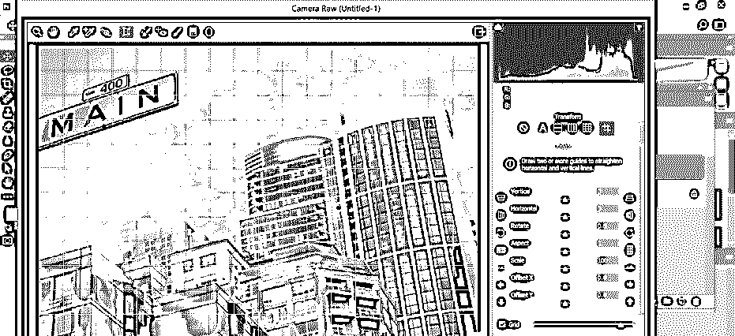

**第 19 步:**一旦你完成了所有的设置，点击这个 Ok 按钮将你的设置应用到你的图像上。

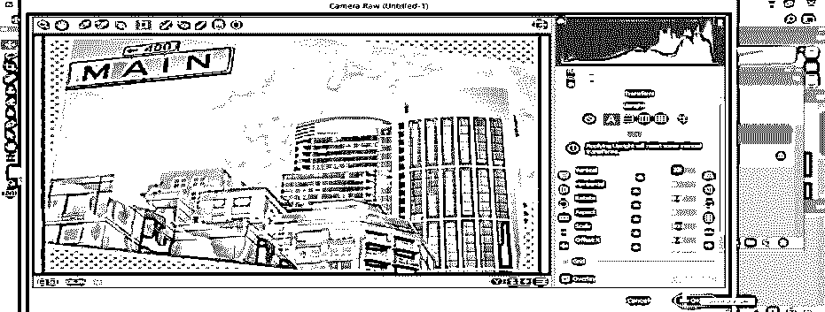

步骤 20: 现在，你可以使用这个软件的裁剪工具来裁剪你图像中不想要的区域。

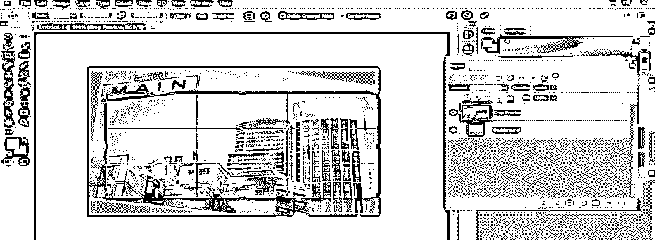

**第 21 步:**你的透视点改变后的图像会是这样的。

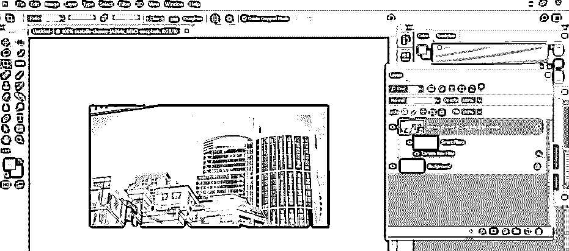

### 结论

现在，读完本文后，您可以理解什么是 fix 透视图，以及如何处理它的参数以在编辑工作中获得最佳结果。通过实践，你可以很好地掌握该软件的这些类型的功能。

### 推荐文章

这是一个在 Photoshop 中修复透视的指南。这里我们一步一步地讨论 Photoshop 中的固定透视的介绍和使用。您也可以浏览我们的其他相关文章，了解更多信息——

1.  [Photoshop 中的排版](https://www.educba.com/typography-in-photoshop/)
2.  [Photoshop 中的 3D 文本](https://www.educba.com/3d-text-in-photoshop/?source=leftnav)
3.  [Photoshop 中的 3D 文本效果](https://www.educba.com/3d-text-effect-in-photoshop/?source=leftnav)
4.  [在 Photoshop 中剪辑蒙版](https://www.educba.com/clipping-mask-in-photoshop/?source=leftnav)

