# 变换工具 Photoshop

> 原文：<https://www.educba.com/transform-tool-photoshop/>

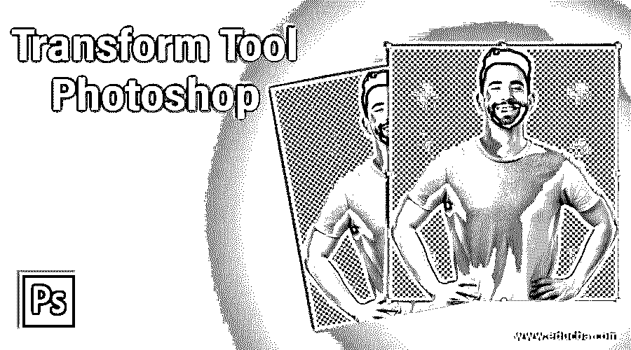

## 变换工具 Photoshop 简介

Photoshop 是由 adobe systems 开发的光栅图像编辑软件，作为其光栅图形编辑软件，被图形编辑专业人员广泛使用。我们在这个软件中有不同类型的令人兴奋的功能，使我们在项目工作中的工作变得容易。转换工具是其中的一个功能，通过它我们可以在这个软件中顺利地工作。变换工具是一个工具，通过它我们可以放大，旋转，翻转，并可以在 Photoshop 软件中对我们选择的图像进行不同类型的变换。本文将讨论如何在该软件中使用变换工具，以及我们如何处理 Photoshop 软件这一功能的不同参数。所以让我们开始讨论这个话题。

### 如何使用 Photoshop 中的变换工具？

我们可以使用这个工具在特定的图像中进行不同类型的转换，但是在开始之前，让我们看一下这个软件的工作屏幕，以便更好地理解整篇文章中的这个主题。

<small>3D 动画、建模、仿真、游戏开发&其他</small>

**步骤 1:** 在工作屏幕的顶部，有一个我们称之为菜单栏的功能区，它有许多菜单，用于在我们工作期间处理该软件的不同参数；在这个菜单栏下面，我们有活动工具的属性栏，通过它我们可以更改活动工具的参数，在这个属性栏下面，我们有三个部分，在左侧我们有工具面板，它有许多用于在这个软件中进行不同类型的编辑工作的工具，在中心我们有显示窗口，我们可以在其中看到我们当前的工作，在这个部分的右侧我们有一些面板，如颜色面板，图层面板和其他一些有助于我们工作的面板。您可以根据自己的需要在需要的地方调整所有的部分。

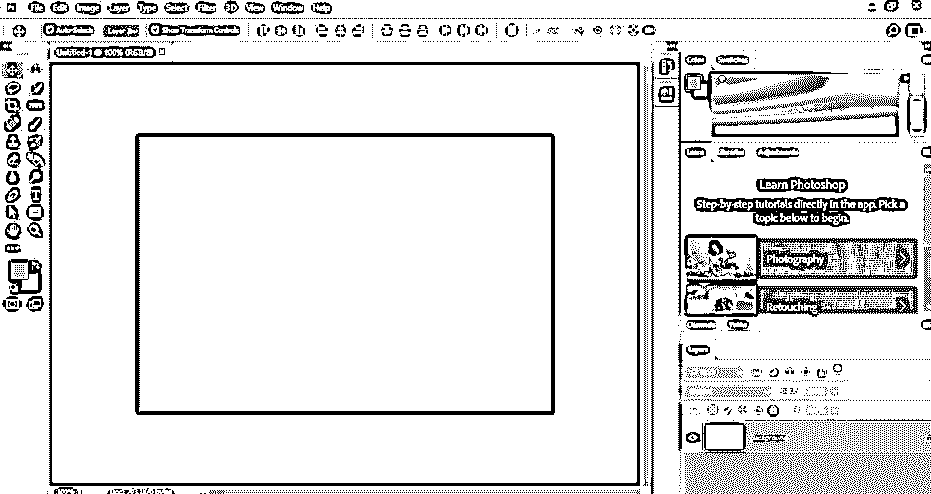

**第二步:**现在，让我们在这个软件中有一个形象，供我们学习。要在该软件中放置图像，只需转到保存图像的文件夹，然后打开该文件夹。在鼠标左键的帮助下从该文件夹中选择您想要的图像，然后通过释放鼠标按钮将其放入该软件的显示窗口区域。

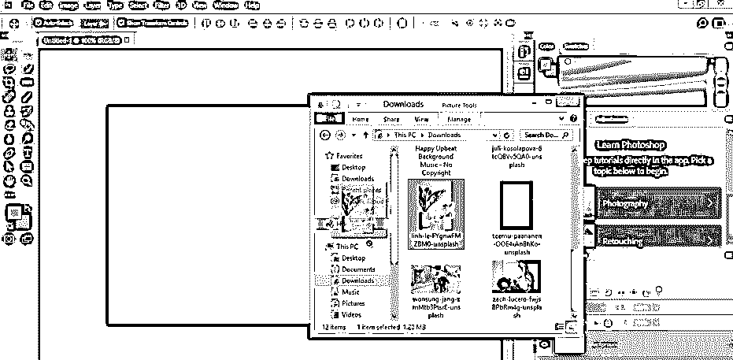

**步骤 3:** 一旦您将图像放入显示窗口区域，图像将会与一个变换处理锚点的边界框一起下降，如下所示。通过移动此边界框的锚点，您可以放大或缩小此图像。如果您想保持该图像的宽度和高度的比例，那么在移动该图像的定位点时按住键盘的 shift 键来缩放该图像。完成后，单击此图像的复选标记或属性栏以应用您的设置。

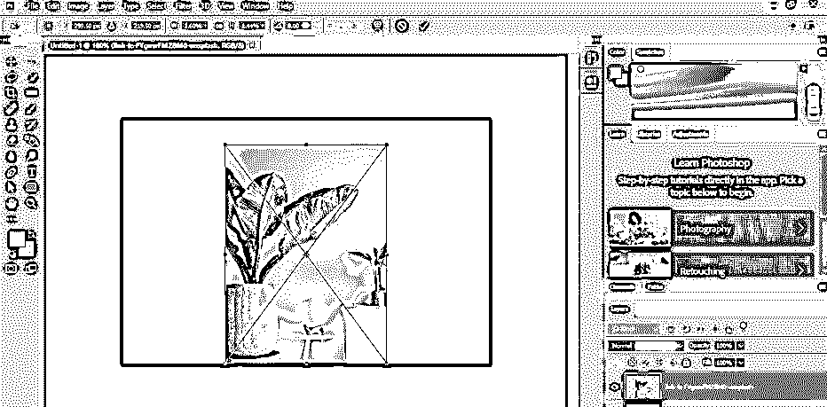

**第四步:**现在进入变形工具菜单栏的编辑菜单。一旦你点击编辑菜单，一个下拉列表将被打开；通过点击选择自由变换选项。

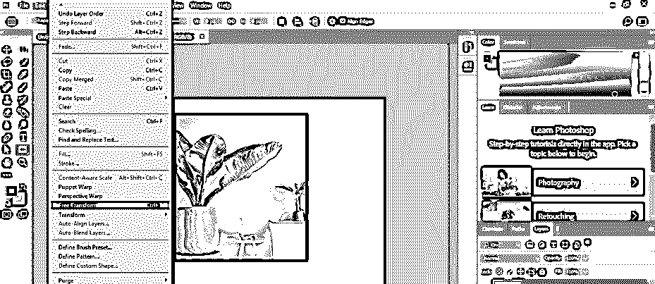

**第五步:**或者你可以进入转换选项，从新的下拉列表中选择你想要的转换选项。

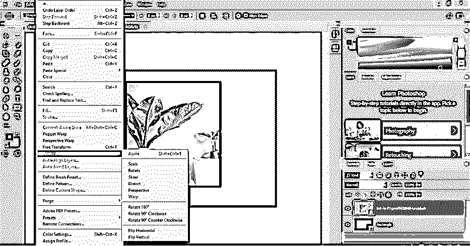

**第六步:**或者你可以按下键盘上的 Ctrl + T 键，一旦你点击，一个变换边界框就会出现在你的图像上，就像这样。

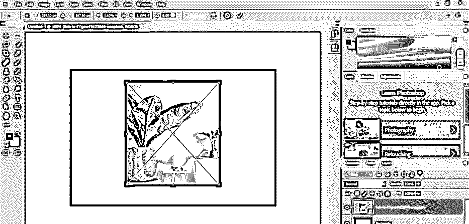

**第七步:**你会在这张图片的属性栏上发现不同的变换属性。您可以更改 x 的值，以更改图像在 x 轴上的位置。

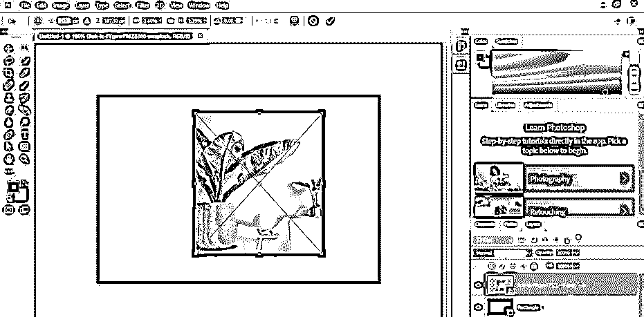

**步骤 8:** 您可以更改 Y 值，以改变图像在 Y 轴上的位置。

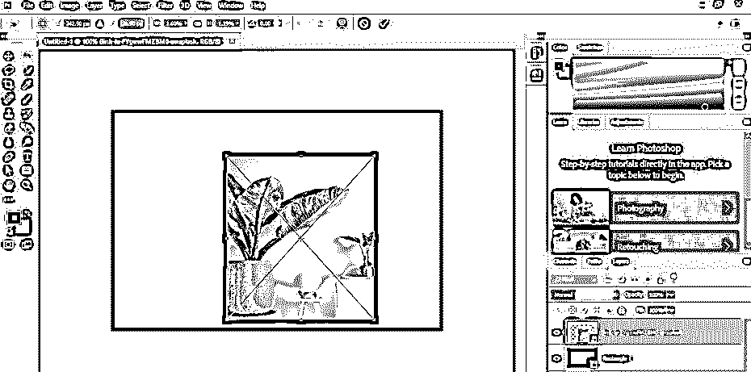

**第九步:**你可以改变 W 的值来改变你的图像的宽度。

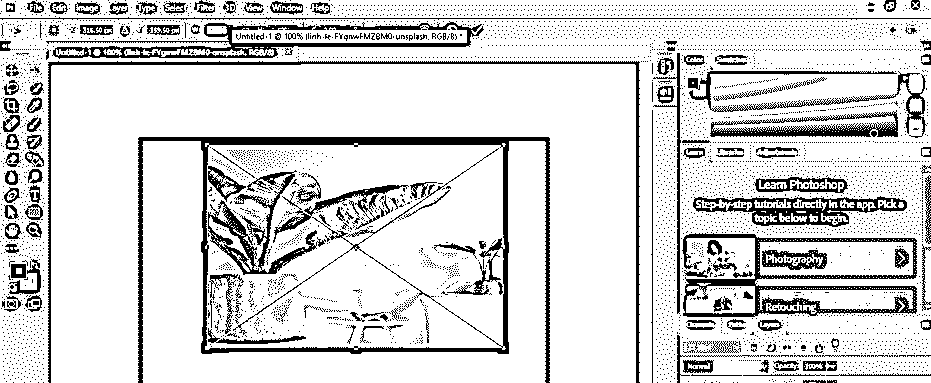

**第十步:**你可以改变 H 的值来改变你的图像的高度。

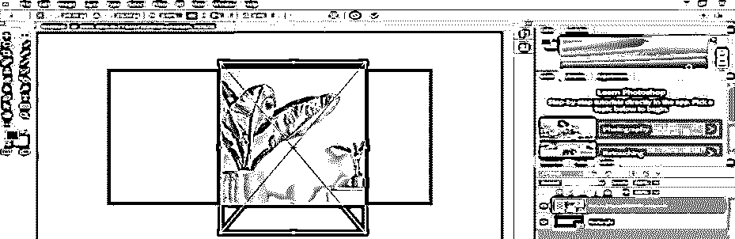

**步骤 11:** 您可以更改图像在特定角度旋转的角度值。

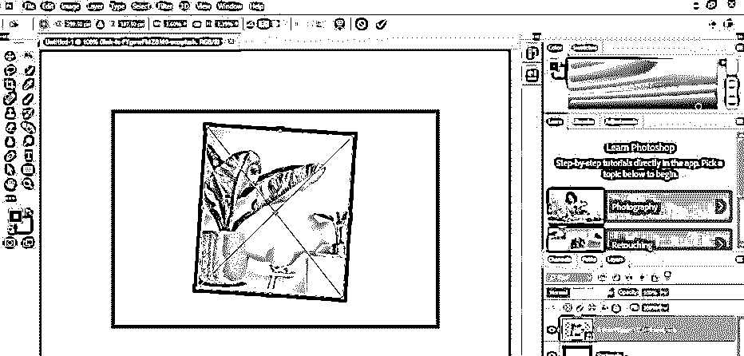

**步骤 12:** 完成后，点击该图像属性栏的复选标记，或者按键盘上的 enter 键。

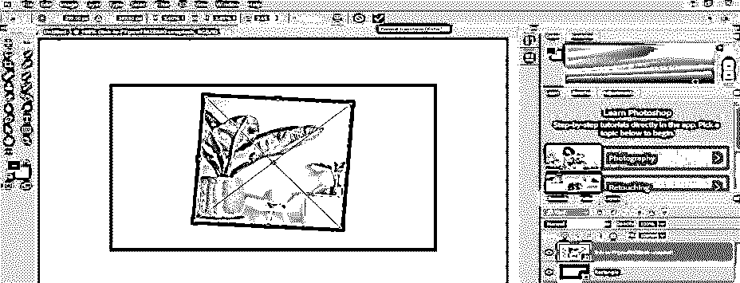

**步骤 13:** 如果您不想将此变换应用到您的图像，请单击“取消变换”选项或按键盘上的 Esc 键。

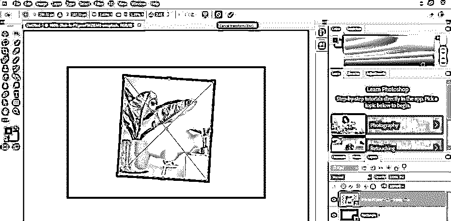

**第 14 步:**现在，处理变换工具选项的另一种方法是从键盘上按下 Ctrl + T 按钮后，在图像上进行右键单击。现在你可以选择任何一个转换选项。您可以点击缩放选项来缩放您的图像；你可以点击旋转选项来旋转你的图像。

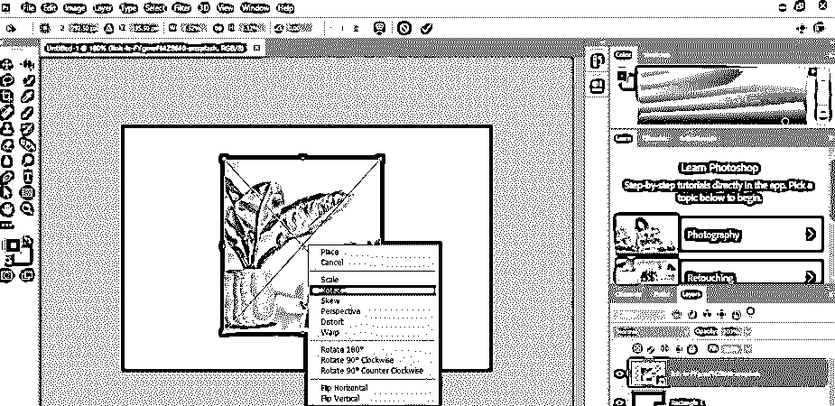

**第 15 步:**现在点击歪斜选项。

**步骤 16:** 通过倾斜选项，您可以根据自己的需要移动该图像的任意定位点。

**第 17 步:**现在点击透视选项

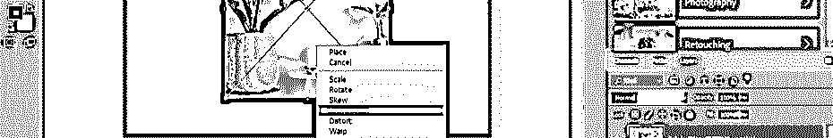

**步骤 18:** 通过透视选项，当你移动这张图片的任何人锚点时，你所选择的锚点的对面锚点也会反方向移动。

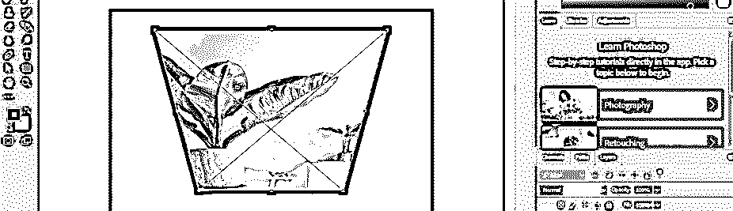

步骤 19: 现在点击扭曲选项。

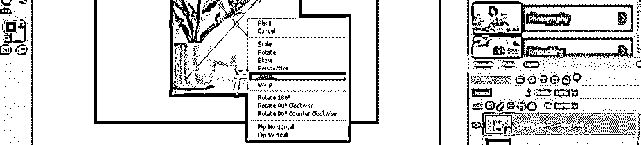

**步骤 20:** 通过扭曲选项，你可以像这样移动边框线来移动你的图像。

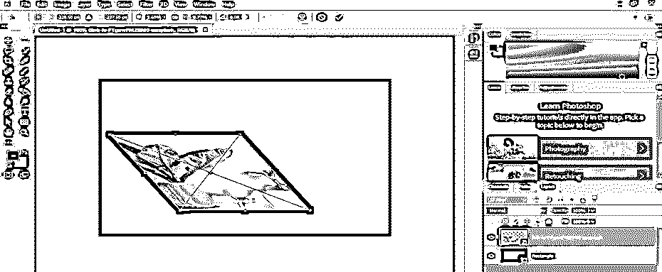

**步骤 21:** 现在点击这个列表的 Warp 选项。

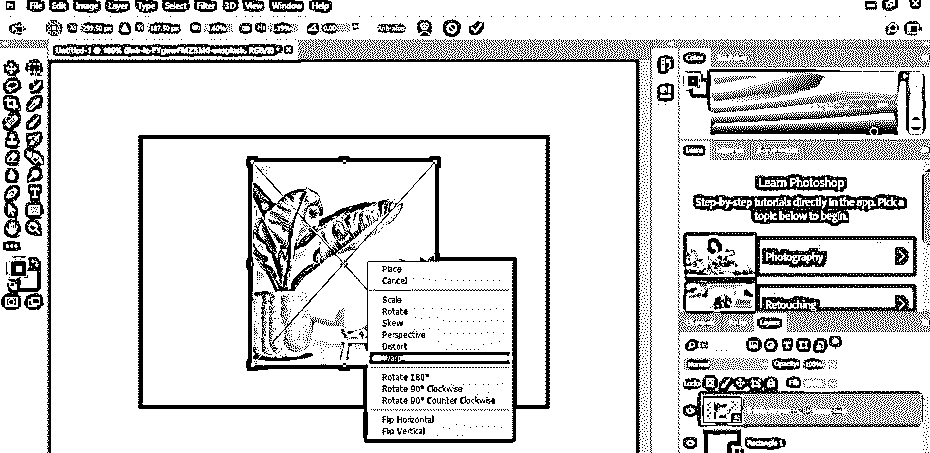

**步骤 22:** 通过这个 warp 选项，你会得到一个带有不同曲线处理点的粘合框，你可以借助锚点做出改变来改变图像的形状。

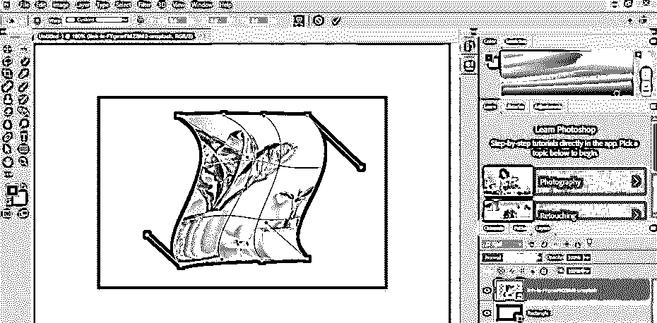

第 23 步:通过这个选项，你可以将你的图像旋转 180 度。

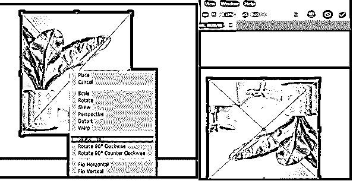

**步骤 24:** 通过此选项，您可以将图像顺时针旋转 90 度，而无需使用键盘的 shift 键。

**步骤 25:** 通过此选项，您可以将图像逆时针旋转 90 度，而无需使用键盘的 shift 键。

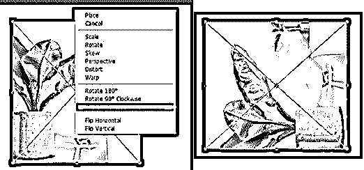

第 26 步:点击此选项，您可以在水平方向翻转您的图像。

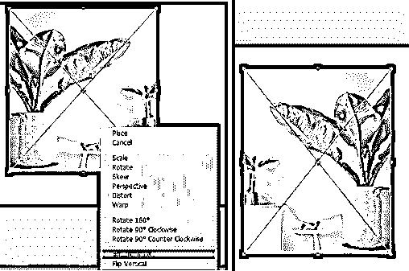

第 27 步:你可以通过点击这个选项在垂直方向翻转你的图像。

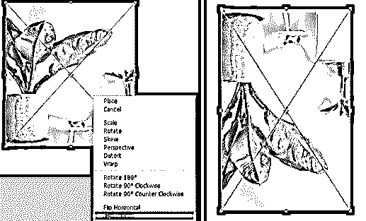

这样，您可以使用 Photoshop 软件中的变换工具，根据项目工作在图像中进行不同类型的变换。

### 结论

现在，在这篇文章之后，你可以理解什么是变换工具，以及你如何处理它的不同参数，以在你的工作中获得最佳结果。通过实践，你可以很好地掌握 Photoshop 软件的这一功能。

### 推荐文章

这是一个转换工具 Photoshop 的指南。这里我们讨论一个介绍，如何一步一步地使用 Photoshop 中的变换工具。您也可以浏览我们的其他相关文章，了解更多信息——

1.  [Photoshop 中的镜像效果](https://www.educba.com/mirror-effect-in-photoshop/?source=leftnav)
2.  [Photoshop 中的运动效果](https://www.educba.com/motion-effect-in-photoshop/?source=leftnav)
3.  [Photoshop 中的油彩滤镜](https://www.educba.com/oil-paint-filter-in-photoshop/?source=leftnav)
4.  [Photoshop 中的塑料效果](https://www.educba.com/plastic-effect-in-photoshop/?source=leftnav)

