# Photoshop 拉直图像

> 原文：<https://www.educba.com/photoshop-straighten-image/>

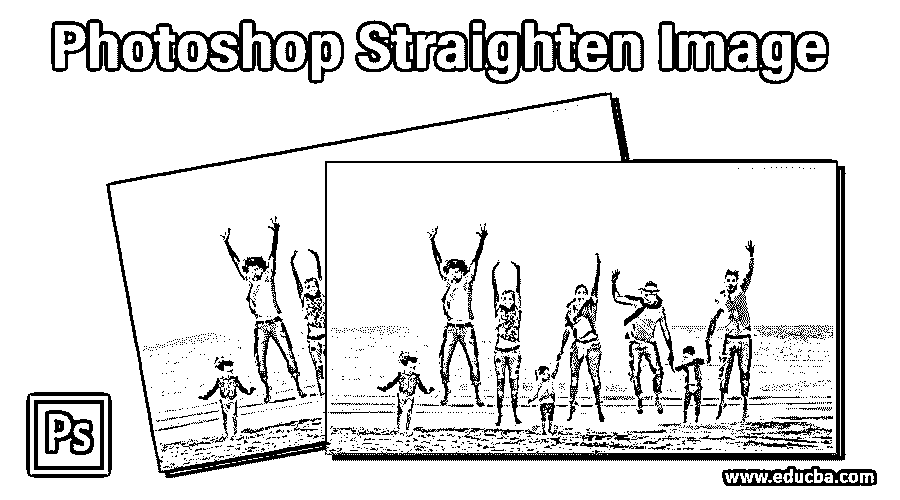

## Photoshop 图像拉直简介

Photoshop 是由 adobe systems 开发的光栅图形编辑软件，作为其光栅图像编辑软件。图像编辑专业人员在他们的专业工作中广泛使用它。我们在这个软件中有许多不同类型的功能，用于处理这个软件中不同类型的工作。拉直图像是一个程序，通过它我们可以使我们的图像在水平方向或垂直方向上变直，如果它在任何角度有任何倾斜部分，使用该软件的一些工具和功能。因此，在这篇文章中，我们将讨论所有的重要参数，我们使用，使我们的形象直，我们也看看在这个过程中使用的工具。所以让我们以一种非常激动人心的方式开始我们对这个话题的讨论。

### 如何在 Photoshop 中拉直图像？

我们可以根据我们的要求拉直图像，但在开始之前，让我们看看这个软件的工作屏幕，以更好地理解这个主题。

<small>3D 动画、建模、仿真、游戏开发&其他</small>

**步骤 1:** 在工作屏幕的顶部，有一个菜单栏，其中有许多菜单，使我们在该软件中的工作变得简单，如文件菜单、编辑菜单、图像菜单等；在这个菜单栏下面，我们有一个活动工具的属性栏，用于在使用该工具的过程中处理特定工具的参数，在这个栏下面，我们有三个部分，在左侧，我们有一个工具面板，其中有执行不同类型任务的工具数量，在这个部分的中心，我们有一个显示窗口，可以在其中看到我们当前的工作，在这个部分的右侧，我们有一些选项卡，如颜色选项卡，层部分和其他一些有助于我们的工作。您可以根据自己的需要重置所有这些部分。

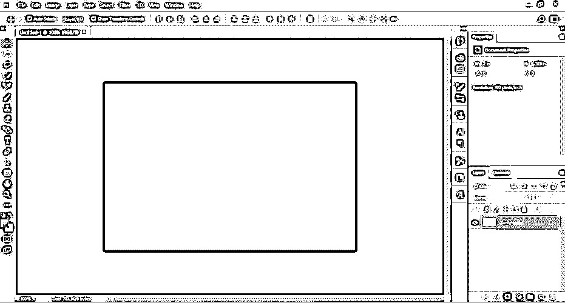

**第二步:**现在，让我们有一个形象的学习。要在本软件中放置图像，请转到您个人计算机中保存该图像的文件夹，然后从该文件夹中选择该图像，并借助鼠标按钮将其放入本软件的显示窗口区域。为了理解这个主题，你可以自己拍照或者从网上下载。

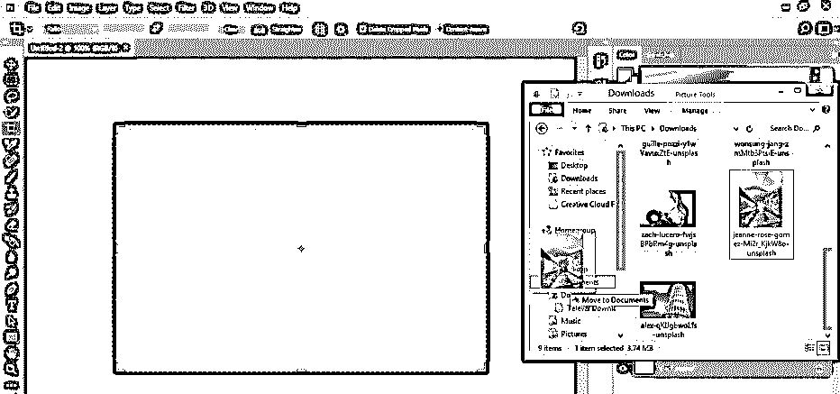

**第三步:**你可以用同样的方法在这个软件中放置多张图片，供有倾斜部分的你学习。

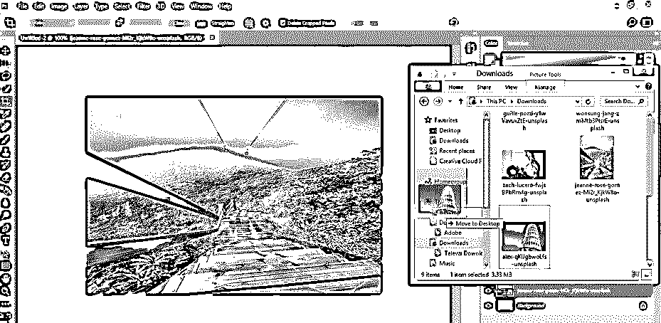

**步骤 4:** 现在，一旦您将图像正确地放置在该软件的显示窗口区域，单击该图像属性栏上的勾号，将该图像放置在您想要的设置中。

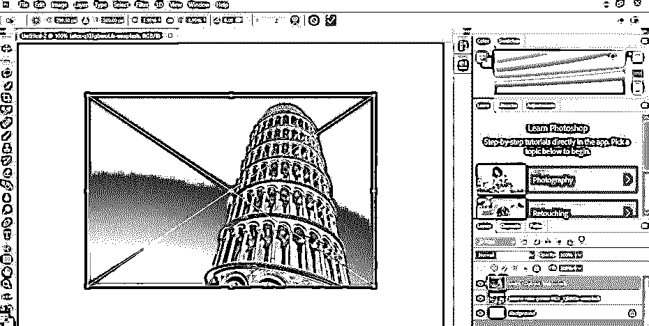

**步骤 5:** 现在转到该软件的工具面板，在显示窗口的左侧，用鼠标左键点击裁剪工具图标。

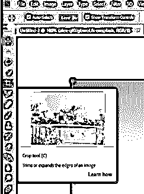

**步骤 6:** 现在转到该软件菜单栏下面的裁剪工具的属性栏，用鼠标点击该裁剪工具的“在图像上画线拉直图像”选项。

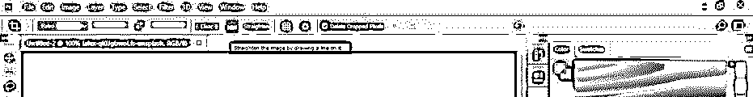

第七步:现在，在你的图像上画一条线，你要用它来调整你的图像。你可以在水平方向或垂直方向画一条直线。这里我将画一条这样的线，使这个建筑在水平方向上是直的。

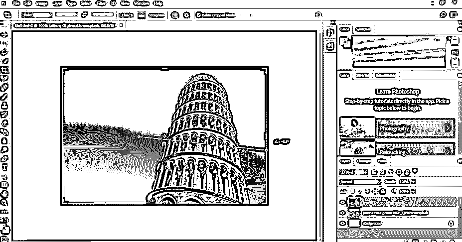

**第八步:**一旦你离开鼠标点击，它会像这样把你的图像向你选择的方向拉直。现在，您可以按下键盘上的 enter 按钮来应用此更改，或者您可以单击位于此工具属性栏的裁剪工具的勾号。

**步骤 9:** 如果您想在图像的选择区域中进行一些其他更改以获得想要的结果，您可以借助鼠标按钮拖动裁剪工具的边框，从而增加或减少其区域。

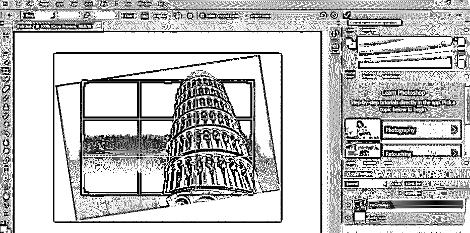

**步骤 10:** 现在，一旦您按下键盘上的 enter 键，应用图像中的更改，裁剪工具将像这样拉直您的图像，并裁剪图像的额外部分。您可以根据需要管理作物面积。

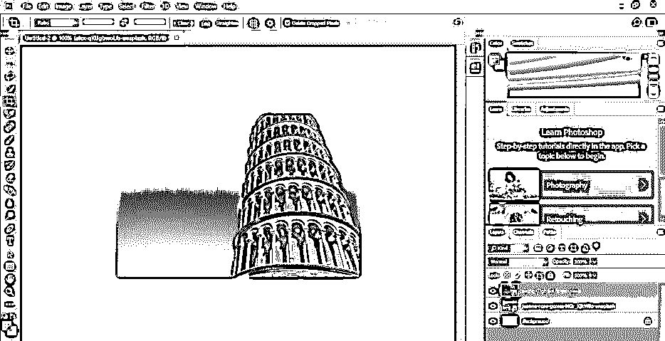

步骤 11: 现在，让我们在这个软件的标尺工具的帮助下，把我们的图像弄直。对于标尺工具，请转到工具面板，右键单击该软件的吸管工具的图标。下拉列表会像这样打开。点击标尺工具图标获得它。

步骤 12: 现在用这个工具画一条线，就像我们用裁剪工具一样。我将画一条这样的线，使图像在水平方向变直。

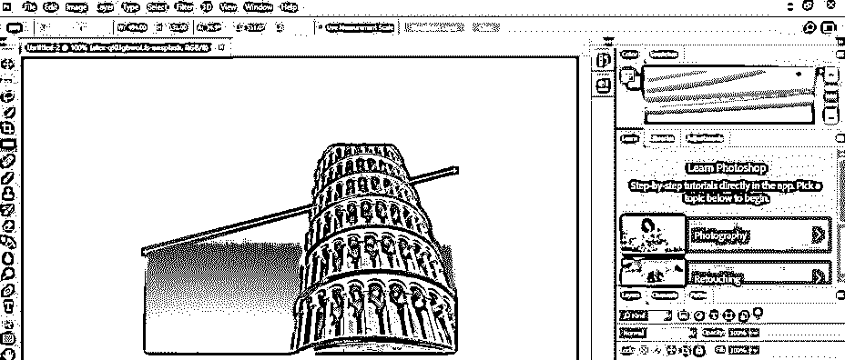

**步骤 13:** 现在转到标尺工具的属性栏，在这个软件的菜单栏下面，用鼠标左键点击这个工具的‘拉直图层’选项。

**第十四步:**现在，它会这样改变你的形象。

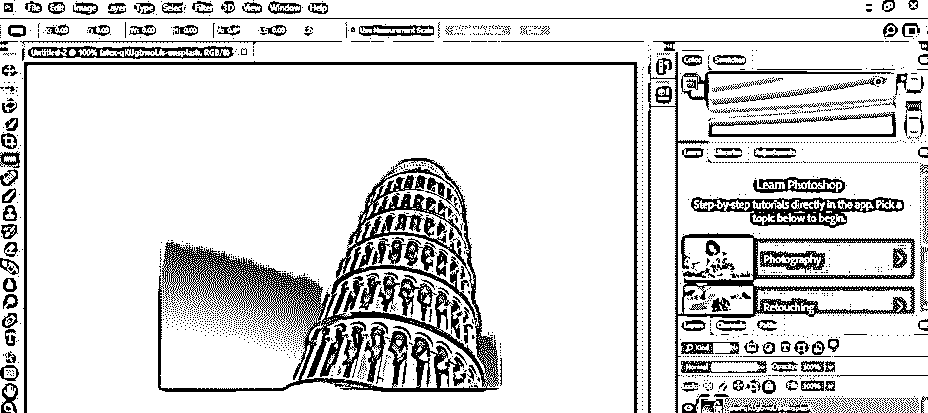

步骤 15: 现在，让我们使它在垂直方向变直。对于垂直方向，用标尺工具画一条这样的线。你也可以选择垂直方向的裁剪工具。

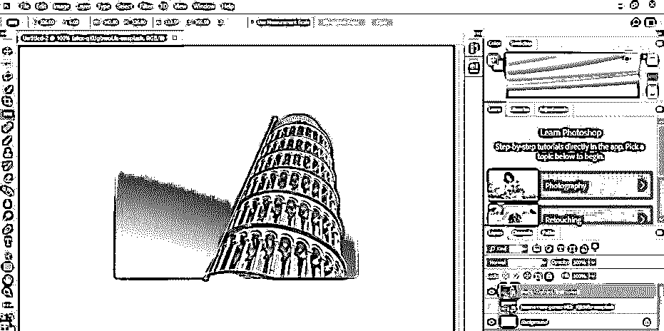

**步骤 16:** 一旦你点击这个标尺工具的“拉直图层”选项，它会像这样垂直拉直，但是用标尺工具，你不能得到一个裁剪的图像。如果您想要裁剪它，您可以再次使用裁剪工具来得到您想要的拉直图像部分。

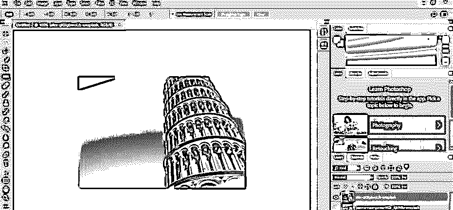

这样，您就可以借助本软件的裁剪工具或标尺工具在水平或垂直方向拉直您的图像，以达到您想要的目的。

### 结论

现在，看完这篇文章，你就能明白 Photoshop 中的图像拉直是什么，以及如何在水平方向或垂直方向拉直你的图像。经过实践，你可以很好地掌握 Photoshop 软件的这一技巧。

### 推荐文章

这是一个 Photoshop 拉直图像的指南。在这里，我们讨论了介绍以及如何使用一步一步地在 photoshop 中拉直图像。您也可以浏览我们的其他相关文章，了解更多信息——

1.  [Photoshop 中的图章效果](https://www.educba.com/stamp-effect-in-photoshop/)
2.  [在 Photoshop 中改变颜色](https://www.educba.com/change-color-in-photoshop/)
3.  [在 Photoshop 中高亮显示文本](https://www.educba.com/how-to-highlight-text-in-photoshop/)
4.  [在 Photoshop 中更改文本颜色](https://www.educba.com/how-to-change-text-color-in-photoshop/)

