# Photoshop 影院图

> 原文：<https://www.educba.com/photoshop-cinemagraph/>

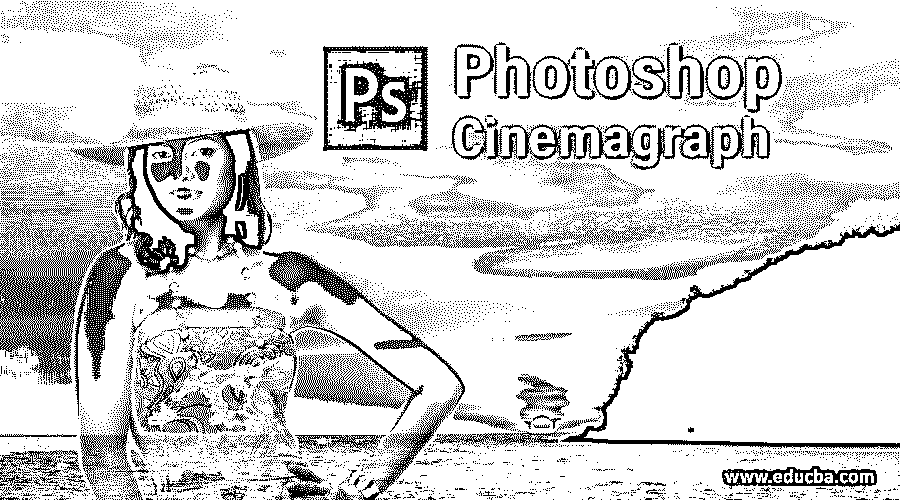

## Photoshop Cinemagraph 简介

Photoshop 是一种光栅图像编辑软件，图像编辑专业人员广泛用于他们的专业工作。我们可以在这个软件中使用不同类型的效果，借助其激动人心的功能进行有效的图像编辑。Cinemagraph 是通过使用该软件的一些技术和工具在任何图像上添加运动效果的效果之一。在这篇文章中，我们将讨论电影摄影及其重要参数，以便我们可以使用 Photoshop 的这一技术在我们的图像上制作出良好的电影效果。所以让我们开始讨论这个话题。

### Photoshop 中的 Cinemagraph 是什么？

通过遵循 cinemagraph 效果的一些简单步骤，我们可以在该软件中的稳定图像中制作出良好的影院效果，但在开始之前，让我们看看该软件的工作屏幕，以便在本文的整个学习过程中更好地理解该主题。

<small>3D 动画、建模、仿真、游戏开发&其他</small>

**步骤 1:** 在工作屏幕的顶部，有一个菜单栏，菜单栏中有多个菜单，用于调整我们在该软件中工作的不同参数；在这下面，我们有我们选择的工具的属性栏，通过它你可以改变你选择的工具的参数，在这个属性栏下面，在工作屏幕的左侧，我们有一个工具栏，它有不同类型的工具，帮助照片编辑工作，在这个工作屏幕的中心，我们有一个显示窗口，我们可以在其中看到我们当前的工作，在工作屏幕的右侧，我们有一些部分，如颜色框，层面板和其他一些。

**步骤 2:** 现在，让我们在该软件中导入一张图像，以便学习 cinemagraph。我从网上下载了一张图片。你可以自己拿，也可以从网上下载。要在该软件中放置图像，只需打开保存该图像的文件夹，然后用鼠标按钮从该文件夹中选取图像，然后通过释放鼠标按钮将其放入该软件的显示窗口区域。

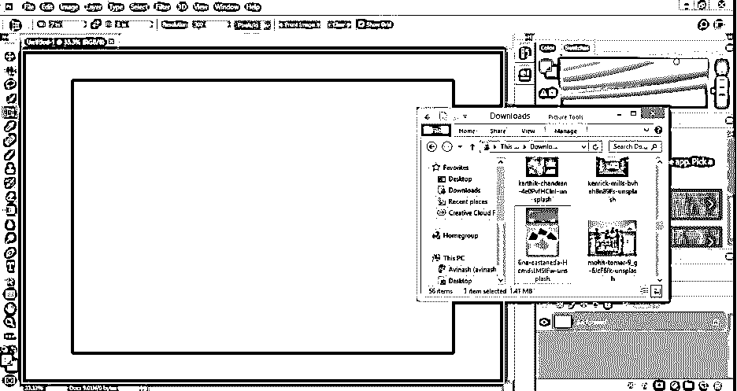

**步骤 3:** 现在点击该图像属性栏上的复选标记按钮，将其放置在显示窗口区域中您想要的位置。

**第四步:**现在，我来拍一个火的视频效果；您可以根据您的图像使用任何其他效果来制作 cinemagraph 效果。我已经从网上下载了。你可以自己拿，也可以从网上下载。要放置视频素材，请转到保存您的效果的文件夹，然后用鼠标按钮从那里选取它，然后通过释放鼠标按钮将其放入该软件的新文档中。

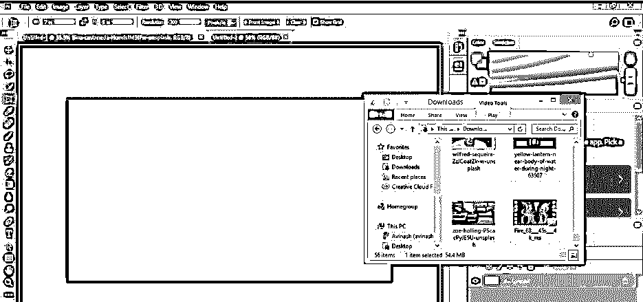

**第五步:**现在点击该软件工作屏幕顶部菜单栏的窗口菜单。单击此菜单后，将会打开一个下拉列表。点击此列表中的时间线选项，在视频素材窗口中打开时间线面板。

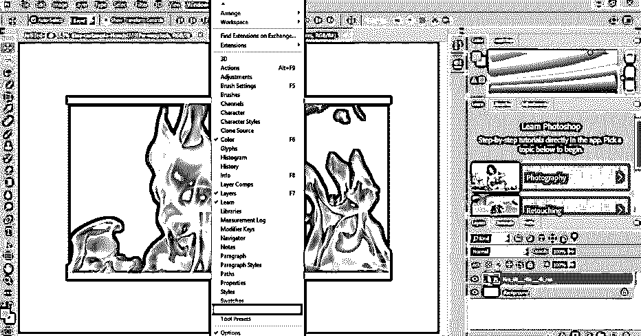

**步骤 6:** 现在用鼠标点击时间线面板的创建视频选项，你的视频素材的帧将在此部分打开。你可以拖动视频效果的播放头到你想要的火焰运动效果的地方，为任何特定区域的火焰效果选择它。

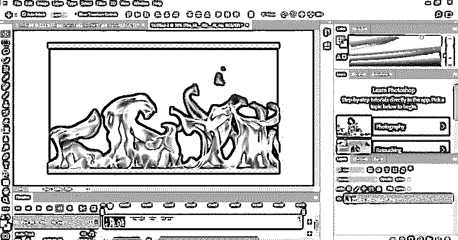

**第七步:**现在，借助这样的鼠标按钮，将这段视频拖到该软件的图像选项卡上，放在我们的图像上。

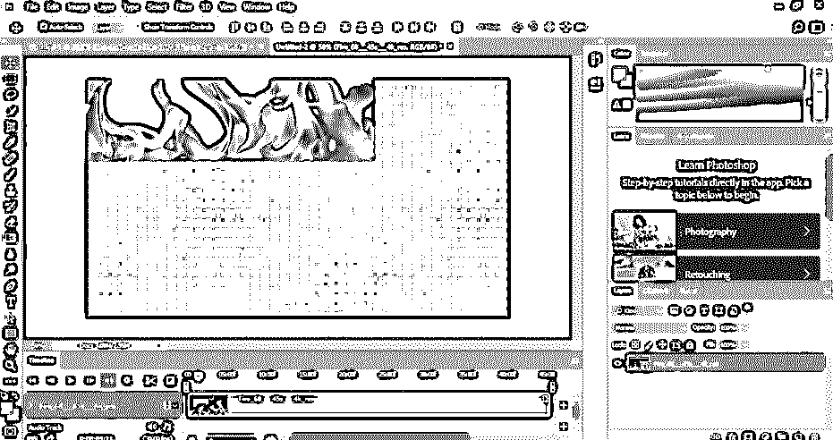

第八步:现在，它会像这样放在我们的图像上。您可以借助移动工具移动它，使其适应您的图像。

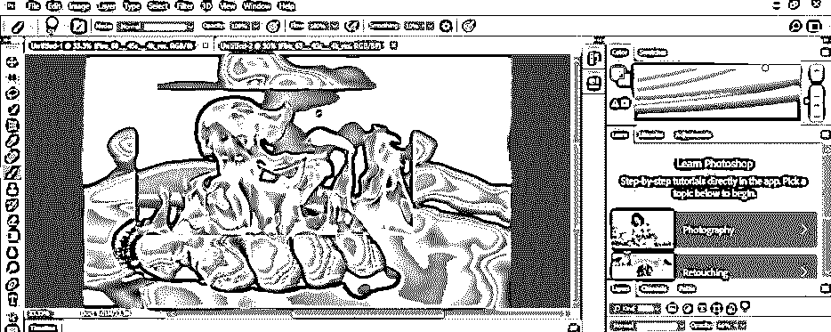

**步骤 9:** 现在点击图层面板中的这个视频素材图层，然后点击这个图层的混合模式的下拉按钮，将其与我们的图像混合。一个下拉列表会这样打开；通过单击从列表中选择屏幕选项。

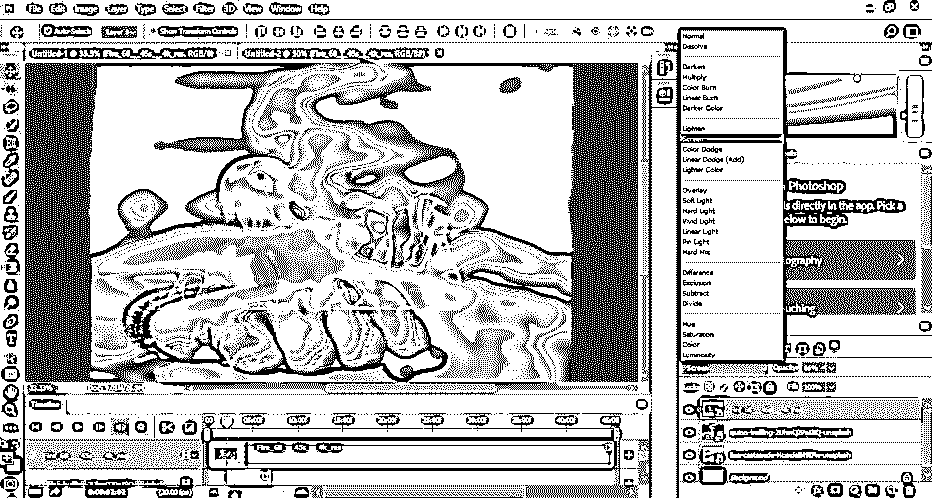

**步骤 10:** 您可以看到从视频素材中移除的图像的黑色背景，并且在您的视频素材中有一个锐利的边缘，因此要移除它，请进入图层面板并通过单击选择该素材图层，然后单击图层面板底部的图层面板的添加蒙版按钮。

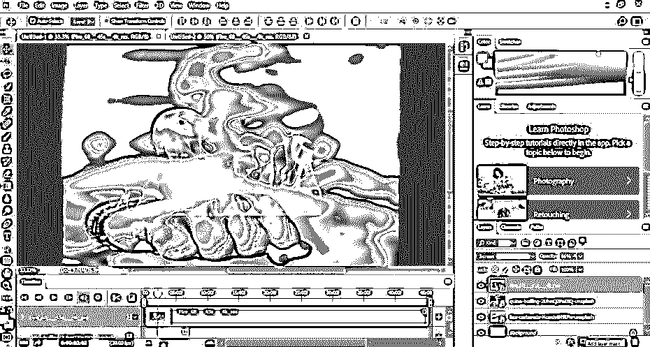

**步骤 11:** 现在，一个蒙版将被添加到这一层。现在用鼠标键点击蒙版，进入这个软件的工具面板，在这个软件的显示窗口的左侧。然后用鼠标点击笔刷工具，或者你也可以从图层面板中选择笔刷工具；只需点击图层面板中的笔刷图标，就可以使用笔刷工具。

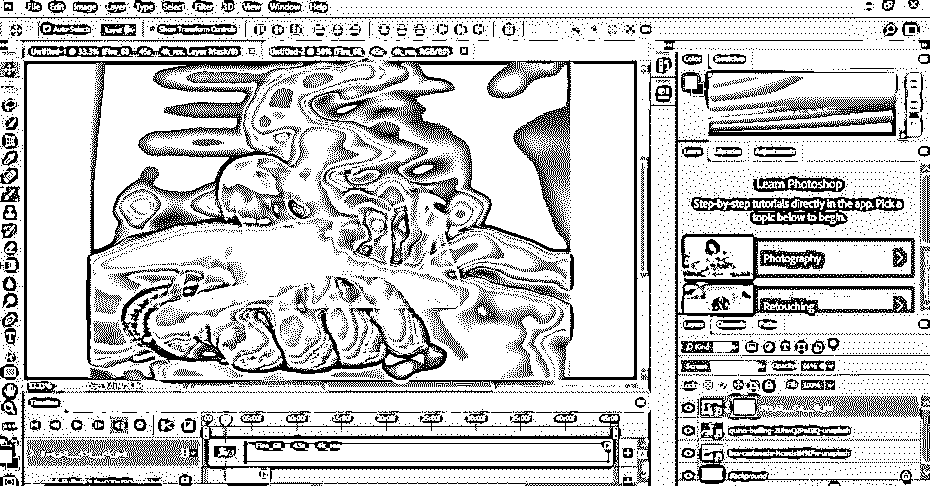

**第十二步:**现在根据你的需要调整笔刷工具的参数，比如笔刷的大小，笔刷的硬度从笔刷工具的属性栏，也就是下面的，到这个软件的菜单栏。

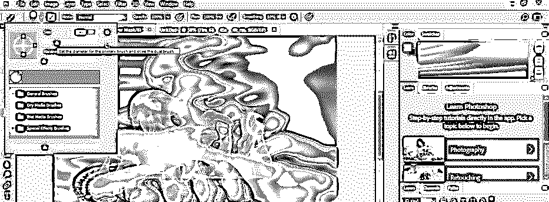

**步骤 13:** 现在转到显示窗口右侧的这个软件的颜色框，点击颜色的小方框。一旦你点击它，一个颜色选择框将被打开，从这里选择一个黑色作为画笔颜色，从我们的视频素材中删除多余的部分，并为我们的效果添加细节。

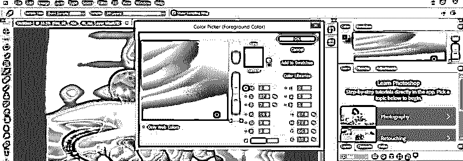

步骤 14: 现在，使用笔刷工具移除图像中多余的部分。您可以根据自己的选择从视频素材中删除不需要的部分。现在当你从时间轴上播放时，你会在你稳定的图像上看到一个火的效果。

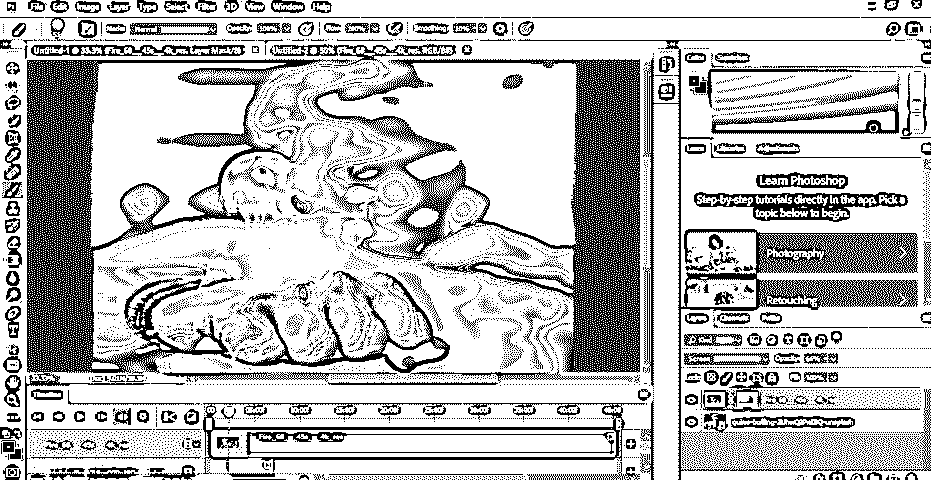

### 结论–Photoshop Cinemagraph

现在，看完这篇文章后，你可以了解什么是 Photoshop 中的 cinemagraph，以及如何调整它的不同类型的参数。你可以在实践之后很好地掌握 Photoshop 的这一功能，并在你的图像编辑技能中增加一分。

### 推荐文章

这是 Photoshop Cinemagraph 的使用指南。这里我们介绍一下，在 photoshop 中使用 Cinemagraphin，并调整它的不同类型的参数。您也可以浏览我们的其他相关文章，了解更多信息——

1.  [Photoshop 混合笔刷](https://www.educba.com/photoshop-mixer-brush-tool/)
2.  [在 Photoshop 中更改头发颜色](https://www.educba.com/change-hair-color-in-photoshop/)
3.  [Photoshop 中的修复画笔工具](https://www.educba.com/healing-brush-tool-in-photoshop/)
4.  [Photoshop 中的图章效果](https://www.educba.com/stamp-effect-in-photoshop/)

