# Photoshop 中的图章效果

> 原文：<https://www.educba.com/stamp-effect-in-photoshop/>

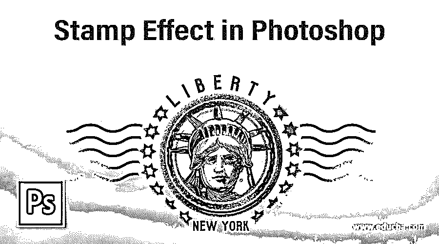

## Photoshop 中的图章效果介绍

游戏设计师或哥特式电影制作，甚至各种主题派对和其他几个领域都是这种冲压效果的地方，虽然很小，但用途非常广泛。新企业和各种广告传单也试图在他们的广告中创造一个邮票效应，给它“这是合法的影响”。信不信由你，这只是通过使用形状工具和图层蒙版创建的。我决定向你展示如何创建一个像维多利亚时代的老式邮票，因为它更有趣的学习。

### 在 Photoshop 中创建旧的图章效果

下面是用 photoshop 制作一枚老式维多利亚邮票的步骤:

<small>3D 动画、建模、仿真、游戏开发&其他</small>

**第一步:**转到文件，新建。打开将在其中创建橡皮戳的新文档。

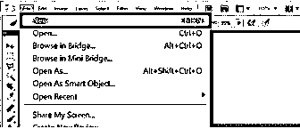

**步骤 2:** 新文件创建完成后，转到文件和放置。

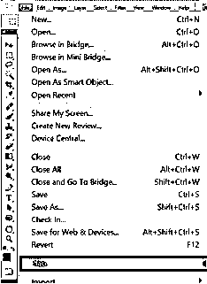

**第三步:**选择要放置印章的垃圾纸纹理图像。点击位置按钮。通过用鼠标拖动来根据你的喜好调整图像，然后一旦你对形状感到满意，就按回车键。

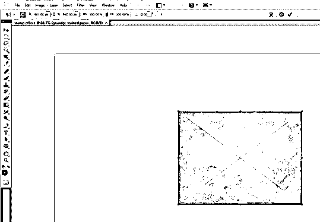

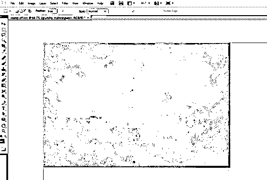

**第四步**:正常情况下，我们可以用油漆桶工具和拾色器工具改变颜色，然后降低不透明度；让我告诉你另一个有趣的方法。转到图层>新建调整图层>渐变贴图。

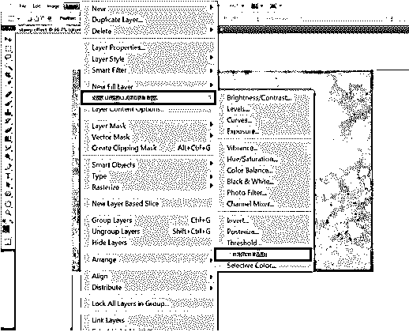

**第五步:**点击 Ok 后，你会看到一个黑白(默认阴影)的渐变被放置在我们的图像上。我们可以通过点击渐变的颜色来改变阴影，然后使用渐变编辑器进行修改，如下所示。

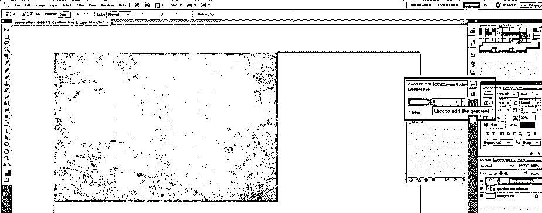

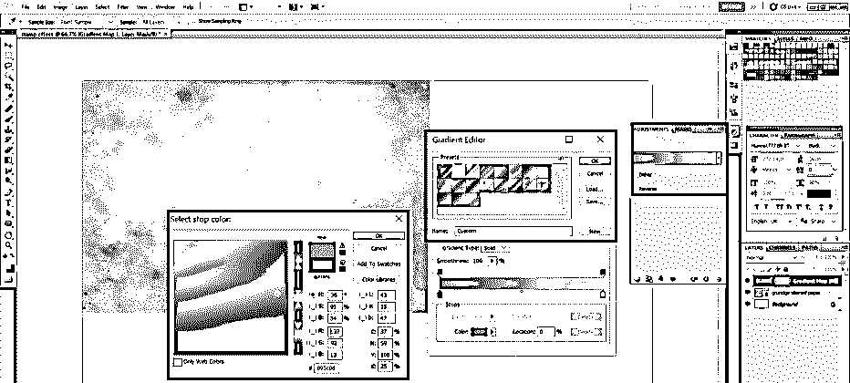

**第六步:**选择椭圆工具。现在，为了有一个完美的圆形，拖动鼠标，同时按住键盘上的 Shift 键，一旦你的外圆创建，层的名称圆 1。

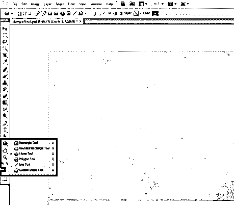

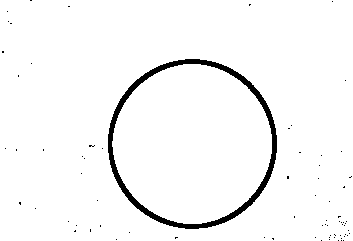

**步骤 7:** 创建圆形 1 图层的边框，选择圆形 1 图层，填充设置为 0 %。然后双击图层，设置描边为 6 Px。

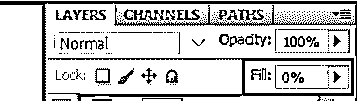

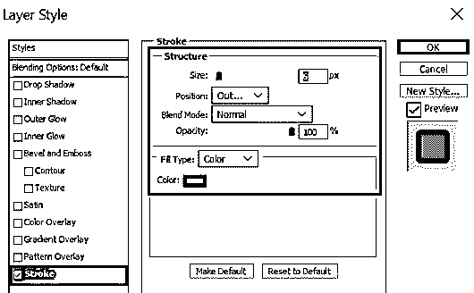

它看起来会像这样。

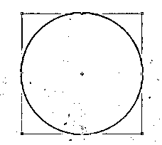

第八步:让我们有 2 个边界的邮票。因此，我们将需要一个圆 1 层的副本。因此，双击圆 1 层，执行复制层，并命名为第二层圆 2。

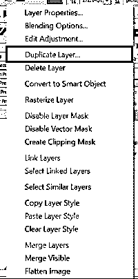

**第九步:**选择圆形 2 层。选择移动工具。按下 Shift 按钮的同时，调整圆形 2 的大小，使其在保持纵横比的同时调整大小。一旦调整了边框的大小，选择圆形 1 和圆形 2 图层，点击对齐垂直中心按钮，如下图所示。

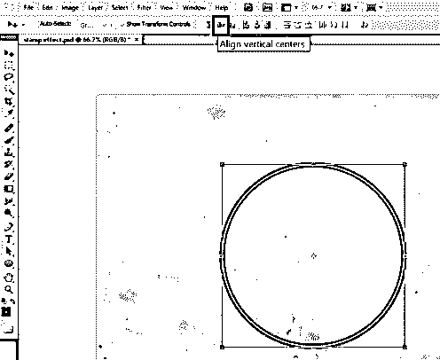

步骤 10: 或者，你也可以选择将圆形 2 层的描边改为 4 PX，给它一个真实的外观。选择圆 1 和圆 2 层在一起，并执行复制层。分别将层命名为 Circle 3 和 Circle 4。

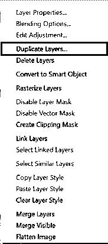

**步骤 11:** 选择圆 3 和圆 4 图层。选择移动工具。当按下 Shift 键一起调整圆 3 和圆 4 的大小时，它将在保持纵横比的情况下调整大小。

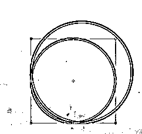

**步骤 12:** 调整好边框后，选择所有图层，点击水平居中按钮，如下图所示。它看起来会像这样。

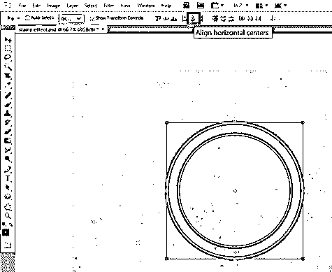

步骤 13: 为了给它更多的图章边框效果，我们可以使用自定义形状工具。转到编辑>预设管理器。选择自定义形状>加载。加载。CSH 文件到 Photoshop。击中完成。

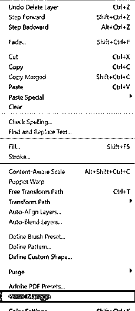

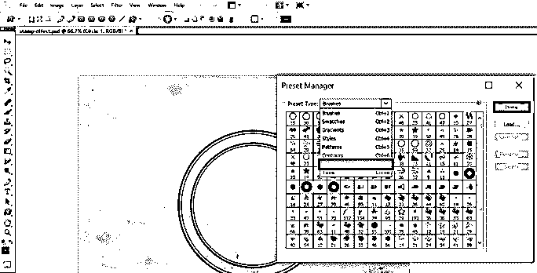

**步骤 14:** 现在选择自定义形状工具。确保您已经选择了“定义比例”选项。这个选项将确保边界保持与我们的形状完美地对齐。选择你选择的形状，并绘制如下图。

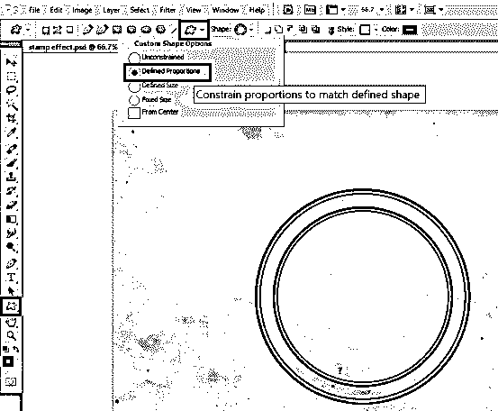

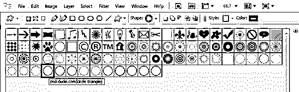

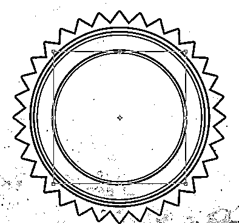

**步骤 15:** 在图章边框之间添加文本是可选的。一种方法是选择水平类型工具。写任何你喜欢的文字。现在选择属性栏中的创建扭曲文本选项。选择类型弧和弯曲到 100%。相应地调整圆 3 层的圆弧上的文本，然后按 Enter 键。

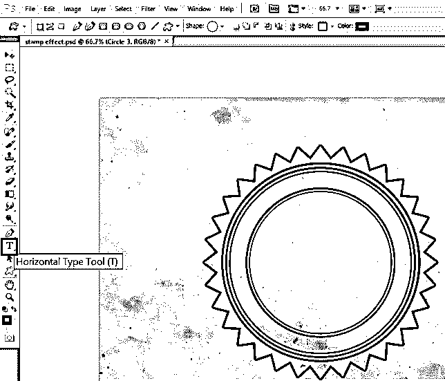

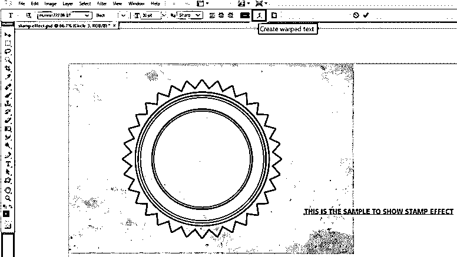

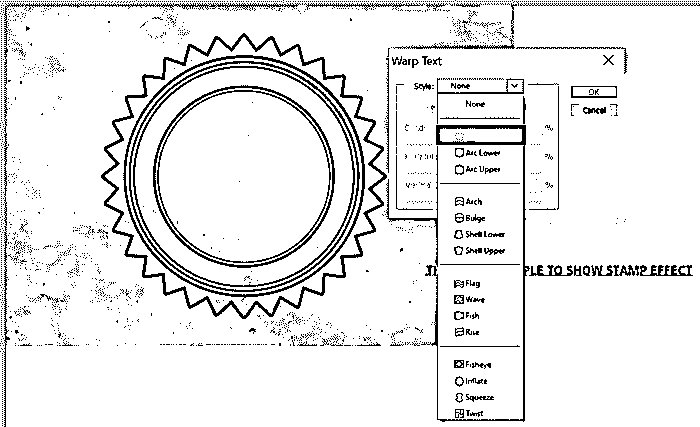

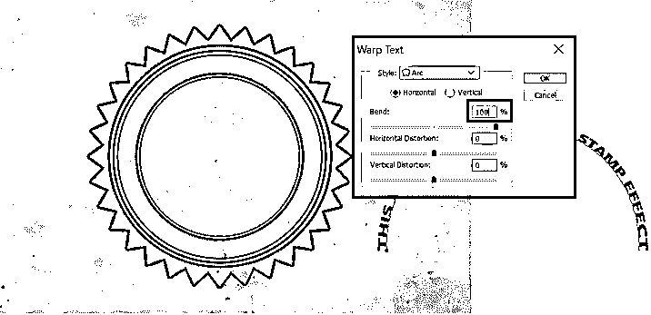

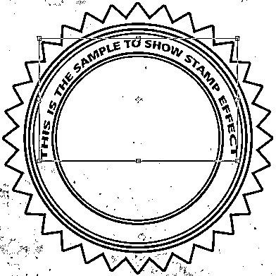

**第 16 步:**添加人像图片，转到文件>处。如下图所示添加肖像图像。确保该层位于所有层的顶部。

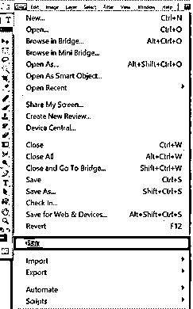

**步骤 17:** 现在，按住键盘上的 Ctrl 键，选择圆形 4 图层的矢量蒙版缩略图，这样图层蒙版剪切的选择就完成了。

**步骤 18:** 使用添加图层蒙版给圆形 4 图层添加蒙版。然后把这个蒙版拖到人像层，得到一个完美切割的图像。

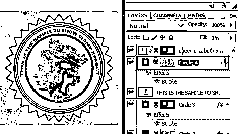

**步骤 19:** 给图像添加特效。转到滤镜>草图>图章，设置明暗平衡为 5，平滑度为 1。

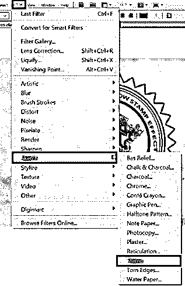

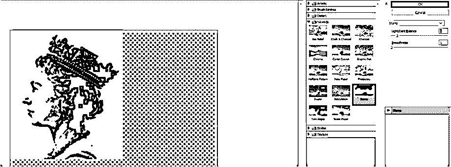

**步骤 20:** 右键点击人像图层，进入混合选项。在最后，你会发现这一层的选择。将白色滑块移动到值 180。

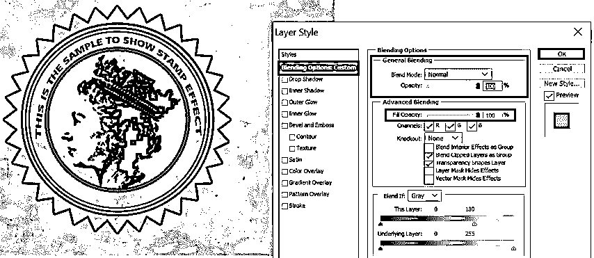

**步骤 21:** 添加一个磨破的效果，一起选择所有图层。右键单击并选择转换为智能对象。这将合并所有到 1 层。

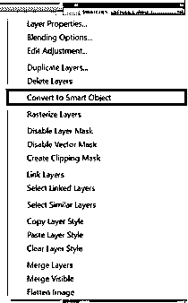

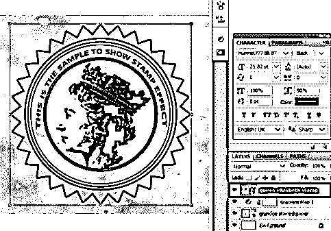

步骤 22: 选择我们的肖像，添加图层蒙版。现在选择笔刷工具。选择你选择的任何扭曲的笔刷，设置大小为 100 像素，不透明度为 22 %，流动为 20%，开始在图章上添加补丁。效果会是这样的。确保前景色是黑色。

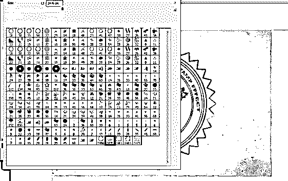

**第 23 步:**我们来添加一些图章线条。程序是相似的。创建一个新层。背景颜色保持黑色。选择画笔工具，并选择我已经下载的邮票线刷。将大小设置为 800 像素。不透明度为 70 %，流动性为 100 %。

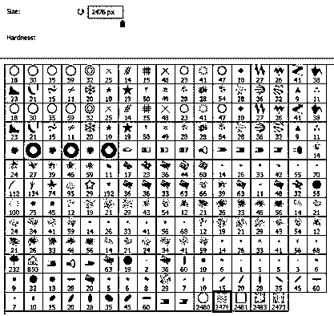

**步骤 24:** 为了让这些也穿破，给笔刷层加一个图层蒙版。保持前景色为黑色，从笔刷工具中选择一个扭曲的笔刷，并进行修补。

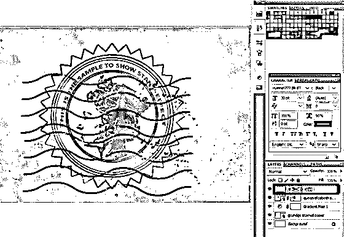

**步骤 25:** 让它看起来老一点选择人像图层。右键单击，在混合选项中选择颜色叠加。如图所示，用颜色选择器设置所需的颜色，然后点击确定。

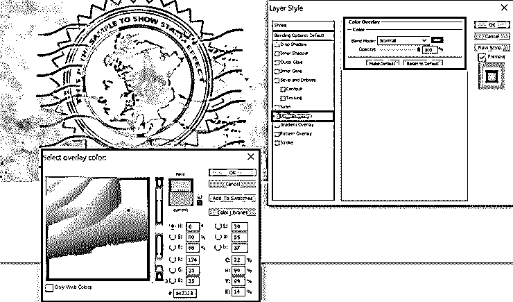

步骤 26: 你甚至可以用移动工具改变一点形状。最后会是这个样子。

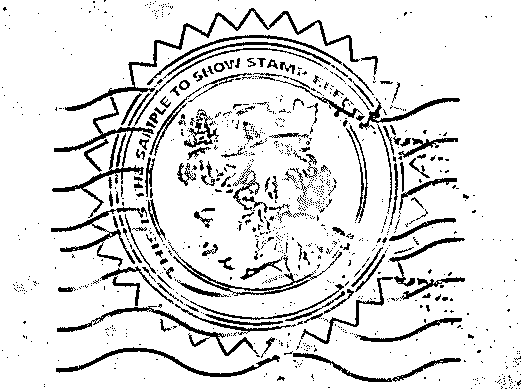

### 结论

这是一个非常有趣的话题。这里我们看到了如何在 Photoshop 中创建图章效果。有各种类型的邮票可以定制。可以加橡皮章，日期章，公司章，学校章等。

### 推荐文章

这是 Photoshop 中图章效果的指南。在这里，我们讨论创建一个老式的维多利亚邮票在 photoshop 中一步一步的方式。您也可以浏览我们的其他相关文章，了解更多信息——

1.  [树刷 Photoshop](https://www.educba.com/tree-brush-photoshop/)
2.  [Photoshop 中的排版](https://www.educba.com/typography-in-photoshop/)
3.  [闪亮效果 Photoshop](https://www.educba.com/shiny-effect-photoshop/)
4.  [Photoshop 字体效果](https://www.educba.com/photoshop-font-effects/)
5.  [Illustrator 中的图章效果|创建步骤](https://www.educba.com/stamp-effect-in-illustrator/)

