# Photoshop 中的排版

> 原文：<https://www.educba.com/typography-in-photoshop/>

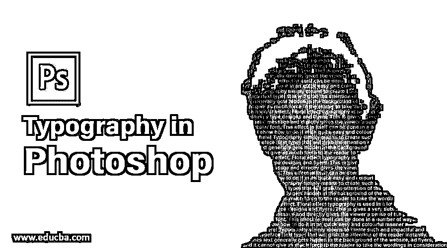

## Photoshop 中的排版介绍

字体设计简单地说就是创造出一种有冲击力和强调性的字体(文字类型),能够立刻抓住读者的注意力。很多时候，文字通常隐藏在网站、广告传单、促销的背景中，它不能给读者足够的力量去考虑文字。因此，印刷术，也就是创造有利可图的字体的艺术，使设计师能够让观众停下来观看重要的信息。我们可以随心所欲地对字体进行创新，我将展示两个适合初学者的非常简单的例子。

### 在 Photoshop 中创建版式的示例

以下是在 Photoshop 中创建版式的示例:

<small>3D 动画、建模、仿真、游戏开发&其他</small>

#### 示例 1–花卉字体排版

这是一个受欢迎的效果。花卉效果印刷被用于许多节日、婚礼类型的设计和传单。这给出了一个非常微妙而强大的主题信息，并直接给观众一种特殊字体的目的感。这种效果本身可以通过多种方式实现。我将展示如何以一种快速、简单和丰富多彩的方式做到这一点。

**第一步:**试着在网上下载一张玫瑰的美图。按文件，然后按新建打开一个新文档。现在转到文件>位置，如下图所示放置我们的玫瑰图像。

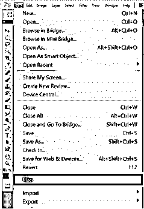

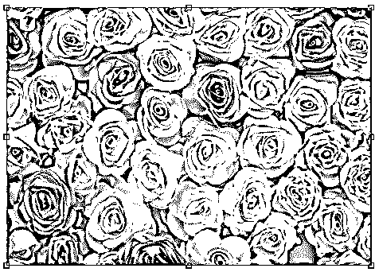

**第二步:**转到横排文字工具。键入您想要编辑的文本。按回车键。您可以选择自己喜欢的任何字体。我选择了字体:万磁王和字体大小:320。

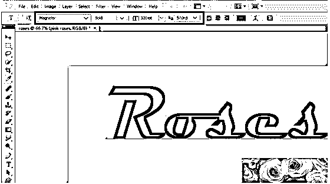

**第三步:**这是重要的一步。确保玫瑰图像层在文本层之上。现在右键单击图像层，并选择创建剪贴蒙版选项。你会看到文本获得了玫瑰的效果。我们可以进一步使用混合选项进行大量的编辑，但是只有在需要的时候。

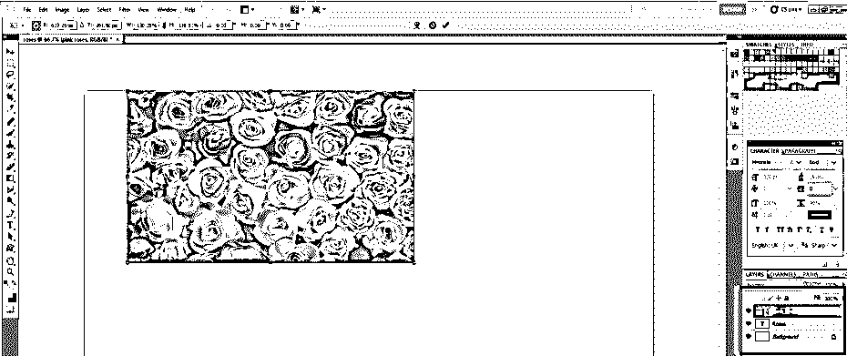

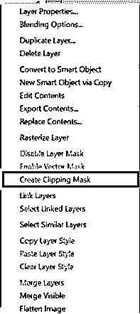

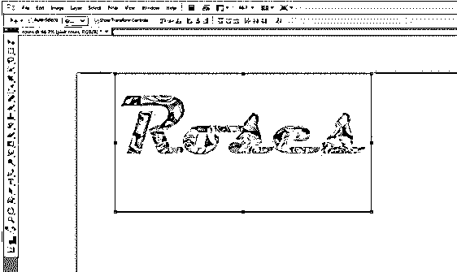

#### 示例 2–流行的陌生事物字体排版

这是一种受欢迎的效果，我相信你们很多人都想知道我们是如何创造出这样一种印刷效果的。让我们看看！

**步骤 1:** 进入文件点击新建。由于字体是黑色背景，使用油漆桶工具将背景层填充为黑色。

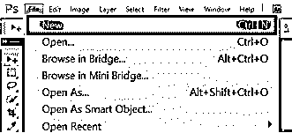

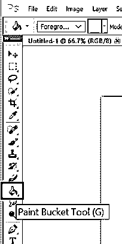

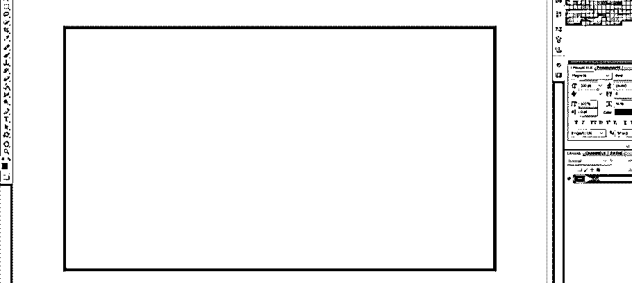

**第二步:**选择横排文字工具，键入比较陌生的东西。现在剩下的就是使用混合选项给出效果。

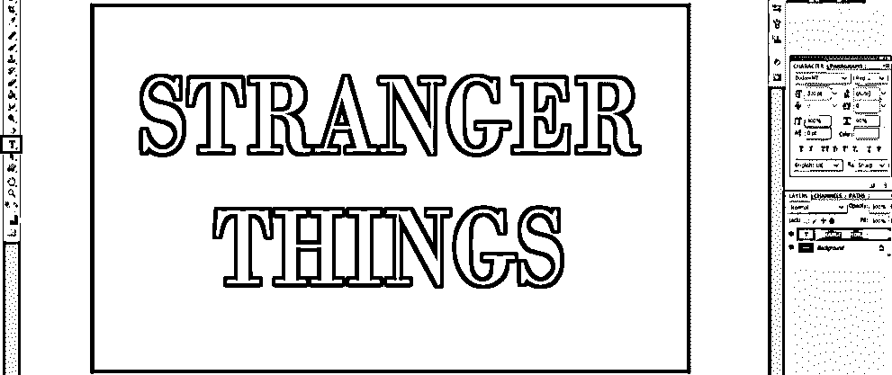

**第三步:**让字体为大写加粗。选择字体样式和大小，如图所示。

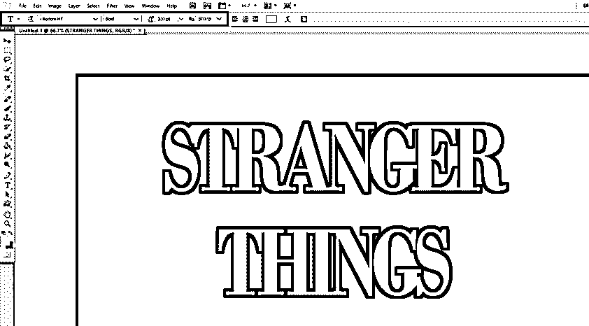

**第四步:**保持文本层选中，在字符面板的帮助下开始更改文本的放置，如下图。首先，将跟踪值更改为-100。

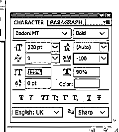

第五步:垂直拉伸文本，设置垂直比例值，比如 115%。你也可以根据自己的喜好来设置。

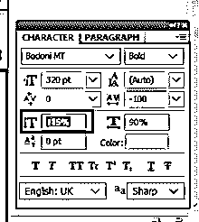

**第六步:**现在，实际字体中的第一个和最后一个字母有点大。要像这样设置，选择单词的第一个字母，并将其字体大小更改为，比如说，400。

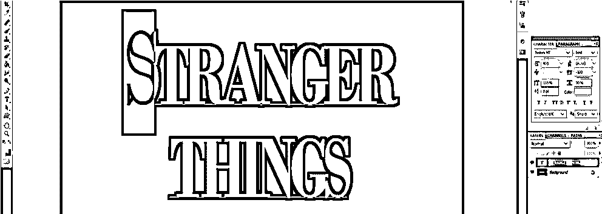

**第七步:**现在，我们也知道这些大字母是对齐在一起排成一行的。使用“字符”面板中“垂直缩放”选项正下方的“基线移动”选项可以很容易地做到这一点。选择字母并将基线偏移值更改为，比如，-50 磅或任何您觉得合适的值。

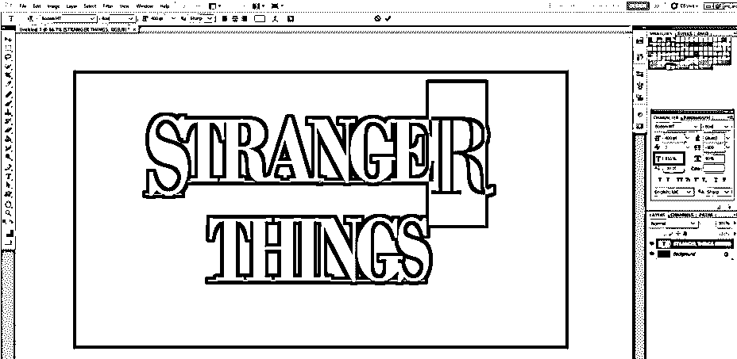

**第八步:**现在，我选择调整字母之间的字距或间距，以获得一些额外的效果。我通过改变字体大小选项下面的字距或字符间距选项的值来做到这一点。将该值更改为 50。在这里，我想指出的是，我不得不再次改变字体大小，因为我对我的文本样式的新值感到满意。

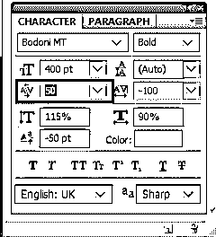

**第 9 步:**调整好所需的间距和字母后，让我们开始对文本进行样式化。选择陌生人事物层的填充值为 0%。

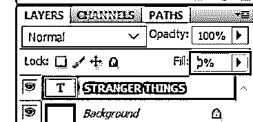

**第十步:**双击图层。在图层样式选项中，选择斜面和浮雕。我不得不做大量的点击和尝试值，以达到预期的输出。这些是我改变的效果；请设置以下值。

*   样式:描边浮雕
*   深度:220
*   尺寸:3
*   取消选中使用全局灯箱
*   角度:156°
*   海拔:37
*   光泽轮廓:锥形–倒置
*   选中抗锯齿框
*   高光模式–不透明度:35%
*   阴影模式–不透明度:50%

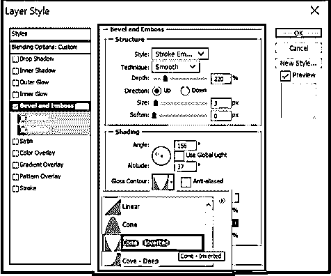

**步骤 11:** 点击斜面和浮雕下的轮廓选项，设置以下值。

*   **等高线:**凹地——深
*   勾选**抗锯齿**框。

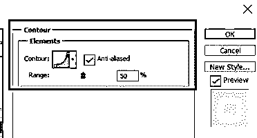

**步骤 12:** 选择描边选项，设置以下值，并使用颜色编辑器更改颜色值，如下图所示。

*   **尺寸:** 3
*   **位置:**内部

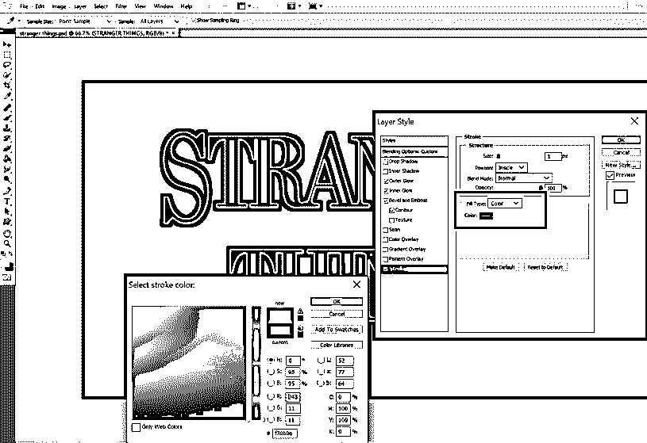

**步骤 13:** 选择内发光选项，设置以下数值。

*   **不透明度:** 50%
*   **噪音:** 5%
*   **颜色:** #ea0f0f
*   **尺寸:** 17

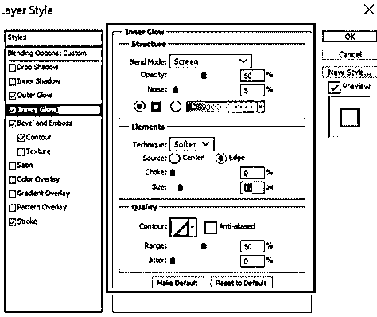

**步骤 14:** 选择外发光选项，设置以下数值。

*   **不透明度:** 50%
*   **噪音:** 5%
*   **颜色:** #ea2314
*   **尺寸:** 12
*   **范围:** 60%

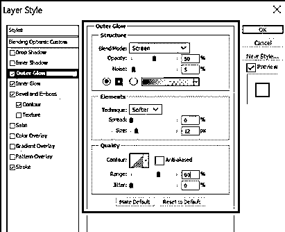

步骤 15: 一旦我们对样式和编辑感到满意，选择文本层。右键单击文本图层并选择复制图层样式。这将有助于以后直接设计小矩形的样式。

步骤 16: 选择圆角矩形工具，创建 3 个圆角矩形，如图所示。

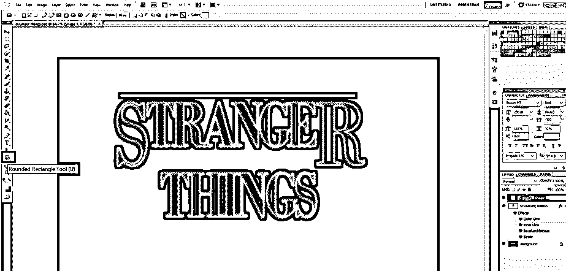

**步骤 17:** 现在选择每个图层，逐一右键点击每个图层，选择粘贴图层样式选项。这将自动风格化的形状根据我们的文字层。如有必要，调整图层；我们已经准备好了受新奇事物启发的印刷字体。

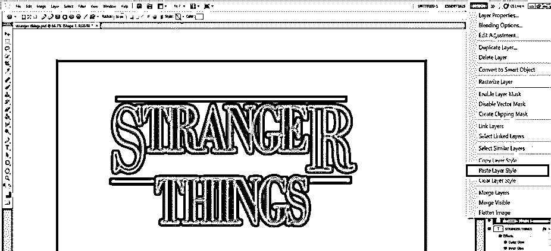

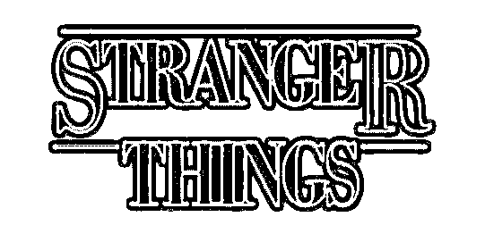

### 结论

选择下面的例子是为了向设计者展示印刷效果不必复杂或困难。更重要的是要理解它们被创造出来的目的，以及排版将如何影响我们的设计。休息都只是创意！

### 推荐文章

这是 Photoshop 中的排版指南。在这里，我们讨论两个不同的例子和艺术和技术安排类型，包括类型设计。您也可以浏览我们的其他相关文章，了解更多信息——

1.  [闪亮效果 Photoshop](https://www.educba.com/shiny-effect-photoshop/)
2.  [Photoshop 字体效果](https://www.educba.com/photoshop-font-effects/)
3.  [树刷 Photoshop](https://www.educba.com/tree-brush-photoshop/)
4.  [Photoshop 中的变形](https://www.educba.com/morphing-in-photoshop/)

