# Photoshop 扭曲效果

> 原文：<https://www.educba.com/photoshop-distort-effect/>

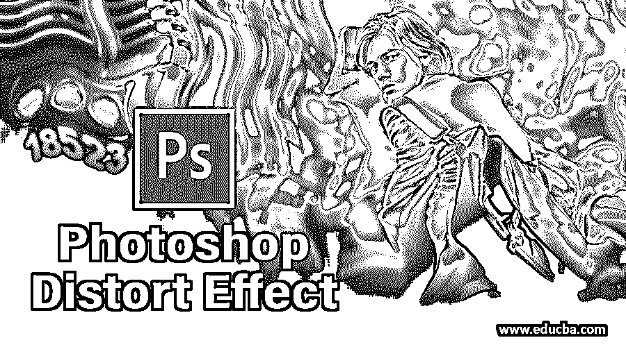

## Photoshop 扭曲效果简介

扭曲效果有助于扭曲、弯曲和变形像素。它可以用来扭曲人物的面部表情，甚至是肢体动作。它们还可以用来扭曲物体，如旗帜、衣服、烟囱烟雾或水面，以模仿运动，如在风中飘动。像这样扭曲的物体可能有利于将哑光画带入现实。扭曲效果也可以用在简单的几何物体上，使它们栩栩如生，这样它们就可以用作运动图形元素。

### 在 Photoshop 中应用扭曲效果

以下是在扭曲效果下工作的所有效果:

<small>3D 动画、建模、仿真、游戏开发&其他</small>

**第一步:**在 Adobe Photoshop 中选择你的图像文件。在这里，我们将使用考拉熊的形象。首先，右键单击您的图像并选择转换为智能对象或点击层，然后智能对象和转换为智能对象。

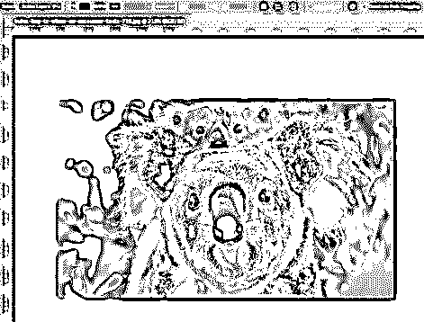

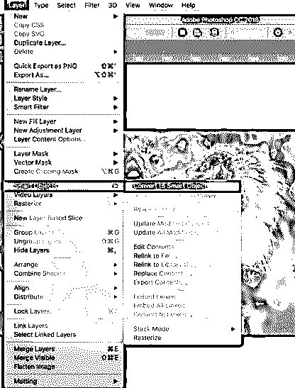

**第二步:**右键点击当前图层，选择复制图层，复制当前图层，这样你就有了一个原始图层。将该层命名为“考拉”,另一层命名为“原始”。

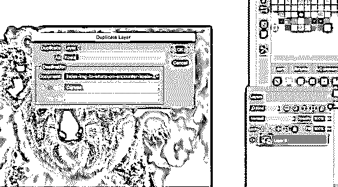

第三步:现在，选择树袋熊图层，点击过滤和扭曲，然后波浪。对于这一层，我们将产生一个微妙的影响。

#### 1.波浪效应

选择波浪效果后，会出现一个对话框。在这里，您可以根据需要修改任何选项，但是对于本例，选择生成器的数量为 2。接下来，将波长设置为最小值 100，最大值 120，振幅设置为最小值 10，最大值 30。然后选择水平和垂直比例分别为 50%。您可以选择正弦、三角形或正方形类型。这里我们将选择正弦。对于未定义的区域，选择重复边缘像素。一旦所有这些设置完成，你可以点击随机，直到你决定你想使用的预览。这仅仅给考拉熊提供了一个微小的锯齿效果，如下图所示。

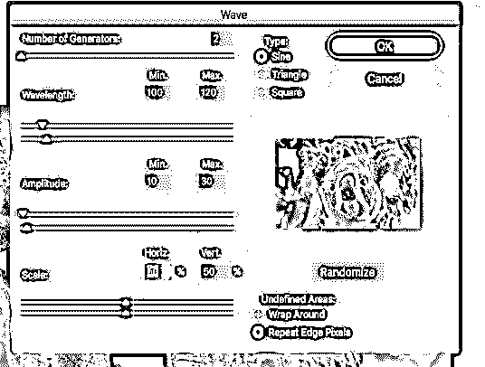

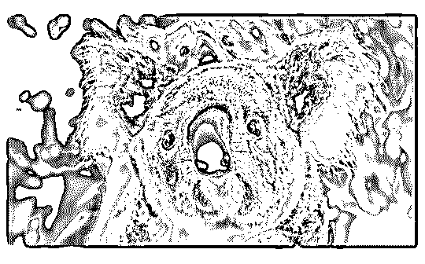

*   这样，你就可以扭曲一幅图像。在扭曲效果下，你有很多效果可以应用到你的图像上。下面我们会一一看到。

#### 2.箍缩效应

我们将为这个效果使用相同的图像。

**第一步:**复制原图层，命名为考拉捏。

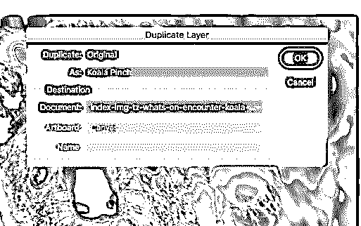

第二步:复制图层后，选择这个图层，点击滤镜扭曲，然后捏。一旦你这样做，你会得到捏对话框。将该值设置为 60%,给图像一个细微的收缩效果。

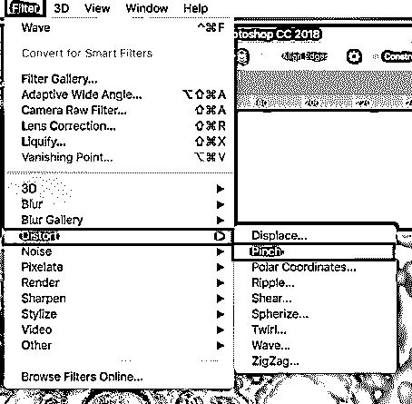

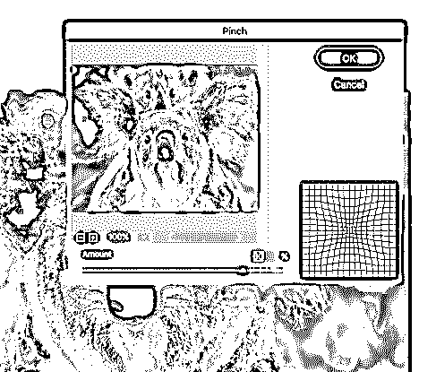

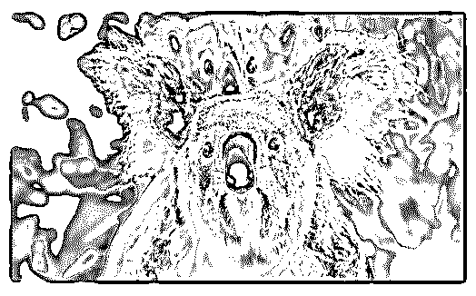

#### 3.涟漪效应

我们将为这个效果使用相同的图像。

**第一步:**复制原图层，命名为考拉波纹。

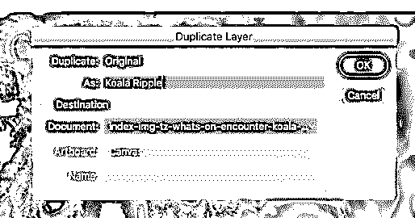

第二步:复制图层后，选择这个图层，然后点击过滤和扭曲，然后波纹。一旦你这样做，你会得到波纹对话框。将数量设置为 150%,选择大小为中等。

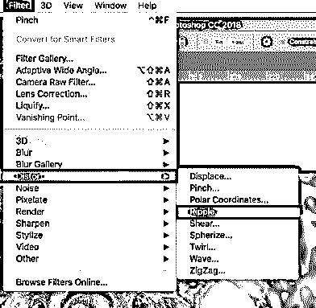

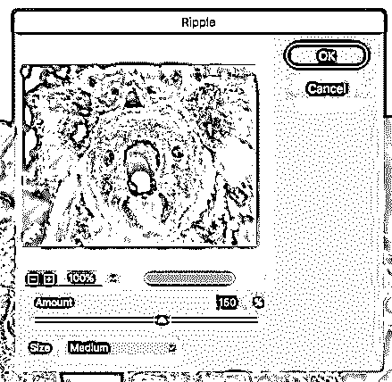

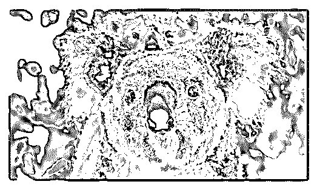

#### 4.球形化效应

我们将为这个效果使用相同的图像。

**第一步:**复制原始图层，命名为考拉球化。

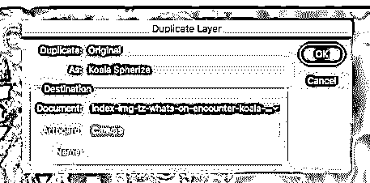

**第二步:**复制图层后，选中这个图层，点击滤镜扭曲，然后球形化。一旦你这样做了，你将得到球形化对话框。将数量设置为 70%，并将模式选择为正常。其他可用模式只有水平和垂直。您可以根据自己的需求选择任何一种。

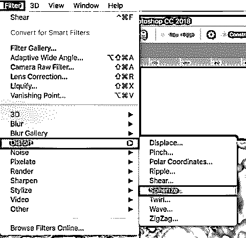

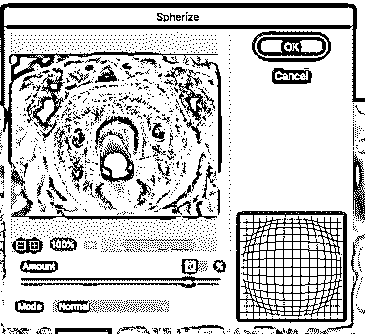

**第三步:**从对话框中选择水平和垂直模式。才能看到最终的图像。

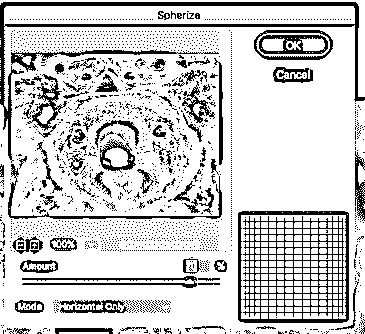

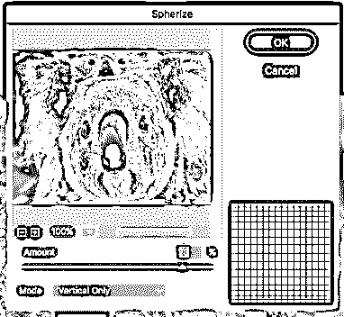

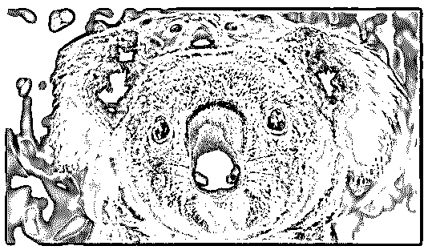

#### 5.旋转效应

我们将为这个效果使用相同的图像。

**第一步:**复制原图层，命名为考拉水袖。

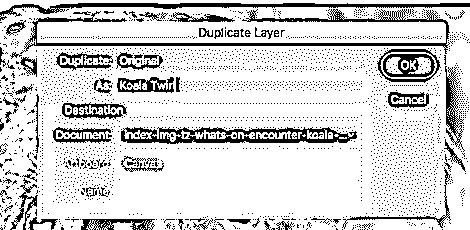

第二步:复制图层后，选择这个图层，点击过滤和扭曲，然后旋转。一旦你这样做，你将得到旋转对话框。将角度设置为 60 度。

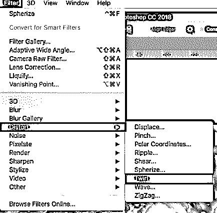

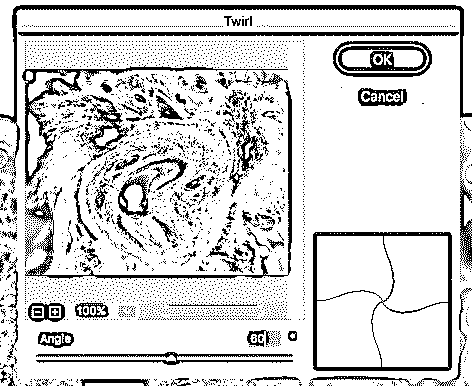

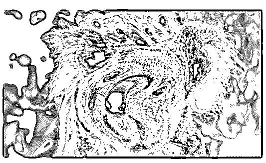

#### 6.之字形效应

我们将为这个效果使用相同的图像。

**第一步:**复制原图层，命名为考拉之字形。

第二步:复制图层后，选择这个图层，然后点击过滤和扭曲，然后锯齿。一旦你这样做，你会得到之字形对话框。将“数量”设置为 15，“脊”设置为 10，然后选择“池塘波纹”样式。其他可用的样式选项有“居中”和“不居中”。您可以根据自己的需求选择任何一种。

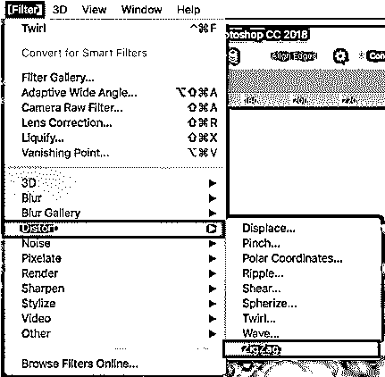

**第三步:**池塘波纹样式的锯齿形对话框。

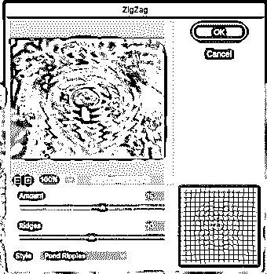

**第四步:**左右居中和不居中样式的锯齿形对话框。

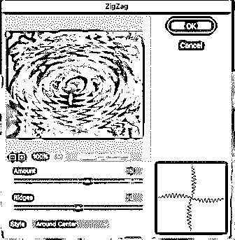

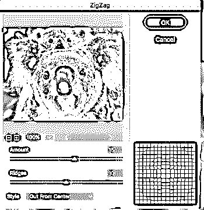

**第五步:**池塘波纹风格的图像。

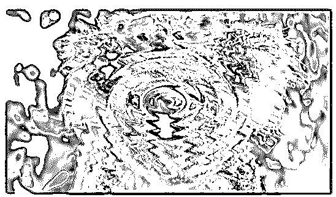

### 如何在文本上使用扭曲？

下面的步骤将解释如何在文本上使用扭曲效果:

**第一步:**先选择一张图片(这里我们用的是橙色的图片)。在图像上添加文本。

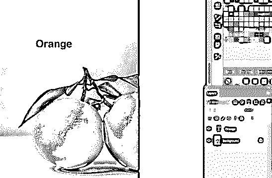

**第二步:**将文本和图像转换为智能对象，根据需要进行转换，而不会损失任何质量，因为智能对象是非破坏性的。文本层(橙色)现在出现在智能对象(橙色图像)内，表明我们可以在需要时展开智能对象并修改文本。

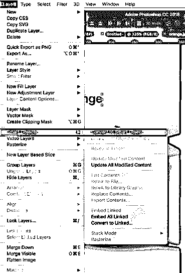

第三步:一旦你把它们转换成智能对象，选择文本，然后点击编辑和转换，然后扭曲。然后你可以拉伸文本，给它一个扭曲的外观。

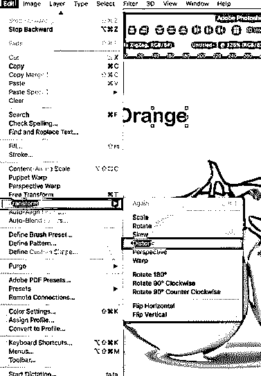

**第四步:**拉伸文字。

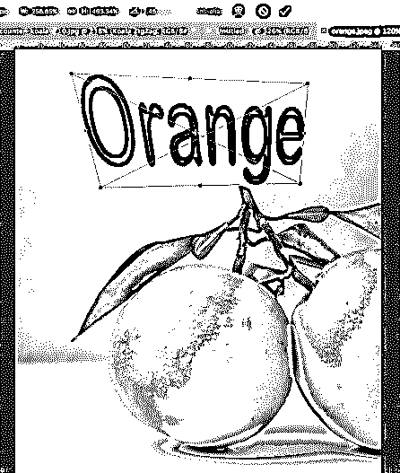

**第五步:**最终图像。

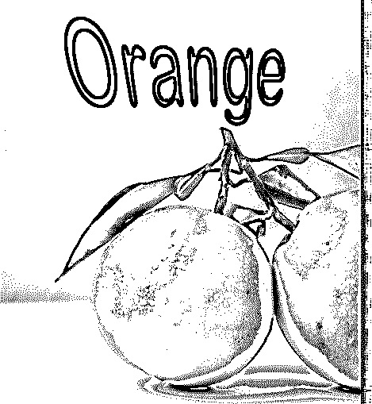

*   这样，您可以在 Adobe Photoshop 中扭曲文本。

### 结论 Photoshop 扭曲效果

虽然标准的图像效果仍然受到青睐，设计师们试图做一些新的事情来保持他们的网站的吸引力。许多设计师回避的虚构的失真效果，现在发现自己很有用。尽管它暗示了一种毁容和扭曲的印象，但即使是现在也无处不在。它恰当地融合了不同的信息。扭曲效果与依赖鼠标光标连接和常规滚动的解决方案完美地融合在一起。这种效果让平常的事情看起来更有力量，更有动力。

### 推荐文章

这是一个 Photoshop 扭曲效果的指南。在这里，我们讨论了介绍，扭曲效果的各种效果和在 photoshop 中增强扭曲效果的各种步骤。您也可以浏览我们的其他相关文章，了解更多信息——

1.  [如何用 Photoshop 创建闪亮效果？](https://www.educba.com/shiny-effect-photoshop/)
2.  [Photoshop 中的 3D 文本效果](https://www.educba.com/3d-text-effect-in-photoshop/)
3.  [后效中的毛刺效应](https://www.educba.com/glitch-effect-in-after-effects/)
4.  [Photoshop 中的弥散效果](https://www.educba.com/dispersion-effect-in-photoshop/)

