# Photoshop 中的 3D 文本效果

> 原文：<https://www.educba.com/3d-text-effect-in-photoshop/>

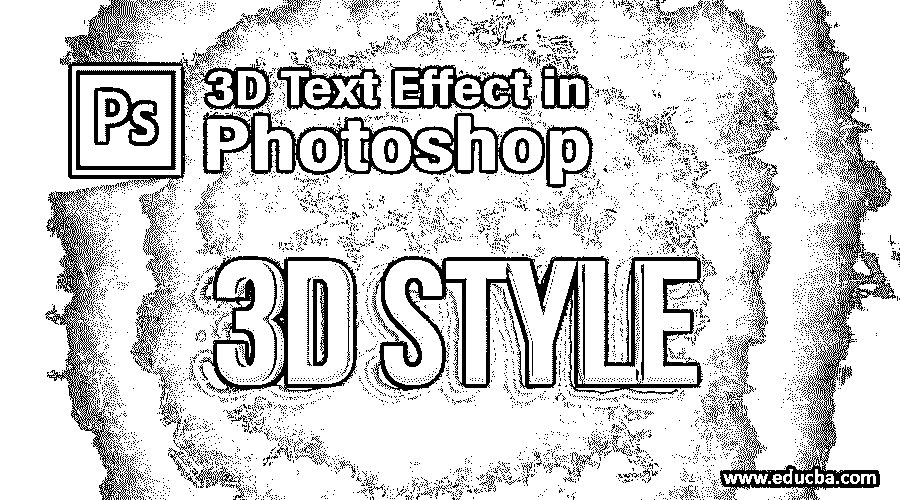

## Photoshop 中的 3D 文本效果介绍

Photoshop 是由 Adobe Systems 开发的光栅图像编辑软件，被图形编辑专业人员广泛用于在项目工作中获得高质量的结果。在本文中，我们将讨论 Photoshop 中的 3d 文本效果。在 Photoshop 中，3d 文本效果是指图形设计师在任何文本中创建的一种效果，通过使用不同类型的工具、设置一些参数、应用 Photoshop 软件的一些预设效果，以及使该文本与真实世界兼容而不干扰其最终使用目的，从而为该文本提供三维外观。

### 如何在 Photoshop 中创建 3D 文本效果？

在 Photoshop 软件中创建 3d 文本效果并不是一个非常大的任务。你可以很容易地在这个软件中创建一个三维文本；从头到尾坚持这篇文章就行了。让我们以一种非常有趣的方式开始我们的学习:

<small>3D 动画、建模、仿真、游戏开发&其他</small>

**第一步:**首先新建一个背景层。对于新的背景，层去菜单栏，这是在这个软件的顶部，并点击文件菜单。将会打开一个下拉列表。从该下拉列表中选择“新建”选项。

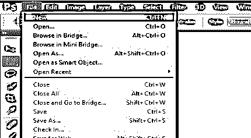

**第二步:**一个“新建背景”图层的对话框将会打开。可以根据你来命名。根据你的要求进行这一层的设置。我将把白色作为背景层的颜色。你可以把黑色作为背景层的颜色。

**第三步:**现在，在工具面板的下端，从这个软件的工具面板中取出文字工具。

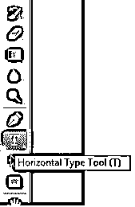

**步骤 4:** 从文本工具的属性栏中选择“Blackoak Std”作为该文本的字体样式，该属性栏位于工作屏幕的顶部。您可以选择更适合您的文本的任何其他字体样式。

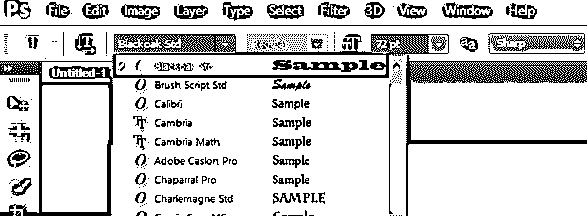

第五步:现在，根据你的需要输入一段文字，在上面你想要给出一个 3d 的文字效果。我将键入“3”作为我的文本。

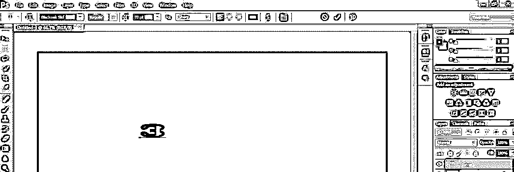

第六步:按下这个勾选标记，使这个文本成为一个图层。

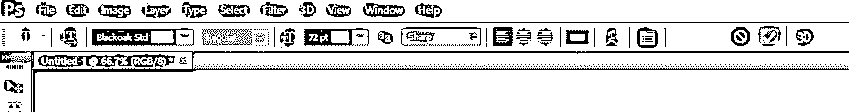

**第七步:**现在按键盘上的**键 Ctrl + T** 来选择这段文字。

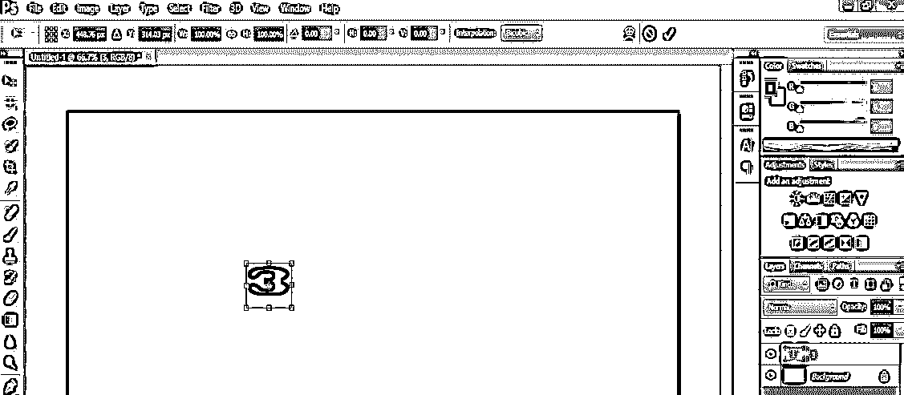

**第八步:**按住 shift 键，根据你的需要增加文字的大小。

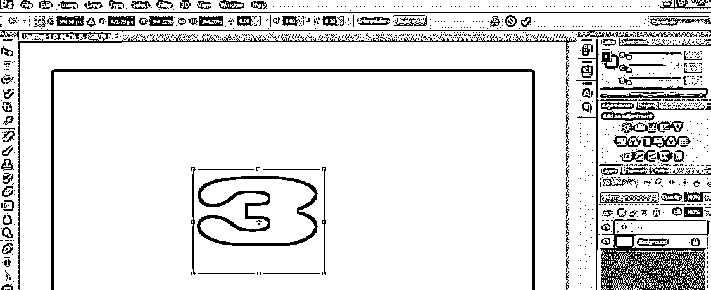

**第九步:**现在进入工作区右侧的软件图层部分，点击选择该文本图层。按下键盘上的 CTRL + J 键来复制这个图层。

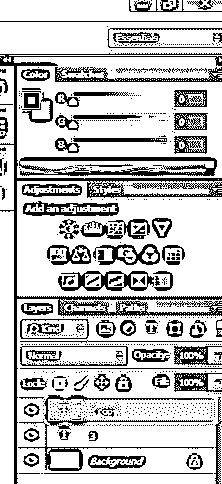

**步骤 10:** 点击选择这个“复制层”，来到工作区点击文本“3”，按住键盘的 shift 键拖动文本“3”到其他地方进行复制。

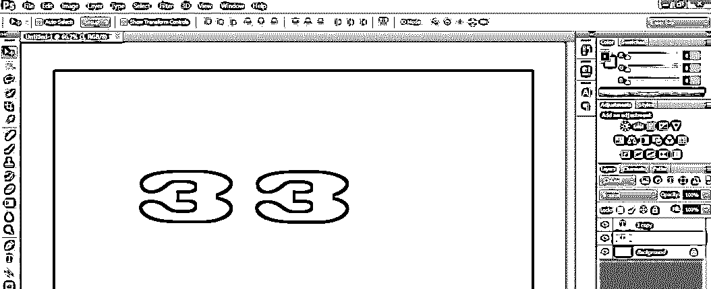

**步骤 11:** 双击图层部分的图层‘3’将其选中。点击该层后，选择将在工作屏幕上激活。

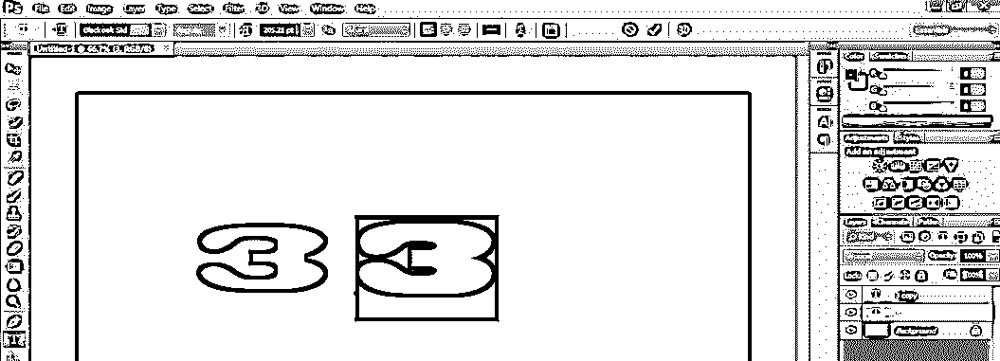

**第 12 步:**现在从键盘上键入“D”来代替文本“3”。

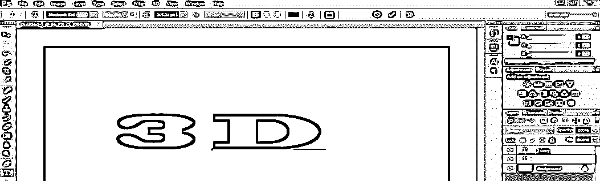

**步骤 13:** 现在选择两层，并使用 align 命令将它们对齐在文档区域的中心，align 命令位于工作屏幕的顶部，即属性栏。

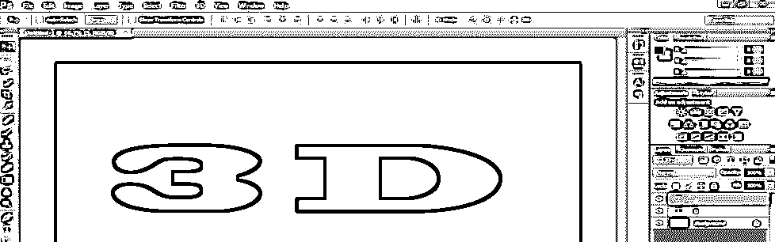

**步骤 14:** 再次进入图层区，点击图层区底部的“添加图层样式”图标。我们使用图层样式来增加文本的效果。

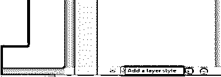

**第 15 步:**一个下拉列表会打开。从这个下拉列表中选择“渐变叠加”效果选项。

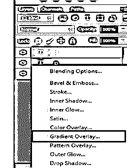

**步骤 16:** 图层样式框打开。点击这个框的渐变选项的比例。将打开一个渐变颜色框。

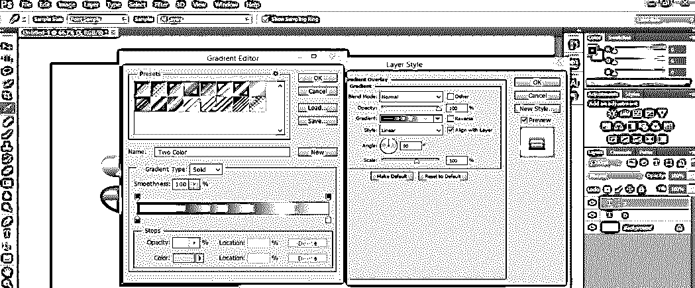

**步骤 17:** 从渐变编辑框的预设中选择渐变颜色的黑白组合，然后点击该框的确定按钮。

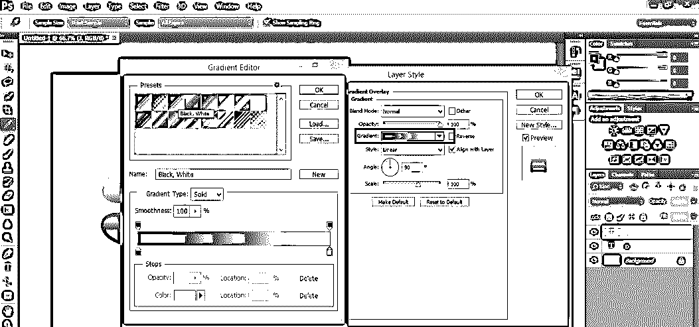

**步骤 18:** 从渐变的样式中选择线性渐变选项。

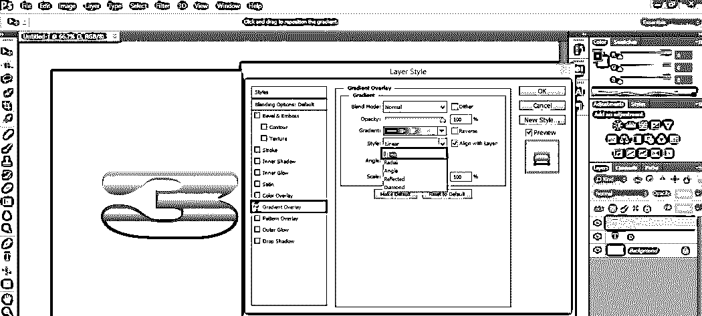

**步骤 19:** 将渐变角度做成 360 度。

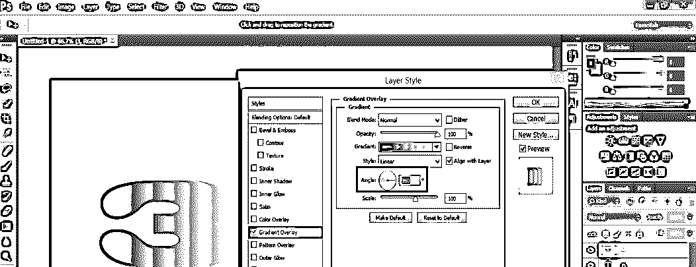

**步骤 20:** 按下这个对话框的 Ok 按钮，将渐变叠加效果的设置应用到我们的文本。

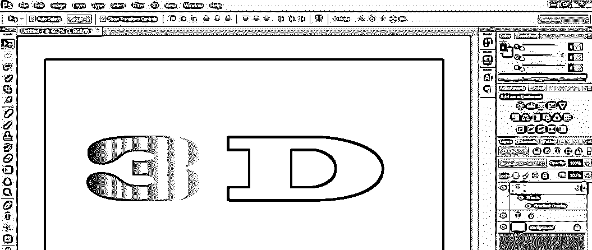

步骤 21: 现在，我将复制这个效果到图层 D。

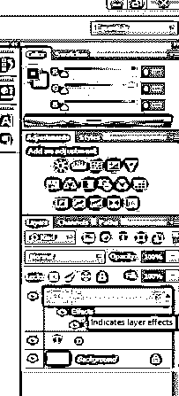

**步骤 22:** 要复制这个效果，按住键盘的 Alt 键，用鼠标键拖动这个效果到‘D’层。

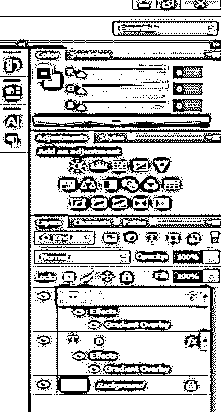

**步骤 23:** 用鼠标键点击层段中的层‘D’，并借助鼠标键拖动层‘3’附近的文本‘D’。

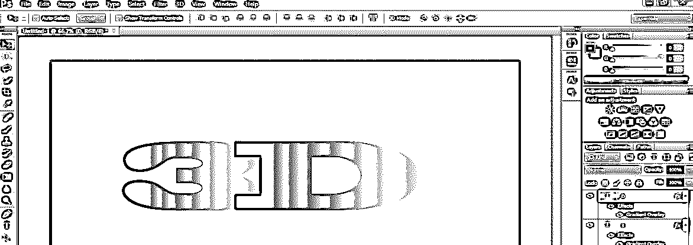

**步骤 24:** 双击“背景”层，使其成为普通层。当你双击这个背景层时，会打开一个对话框。按下此框的确定按钮，使背景层成为一个普通层，用于在此层应用样式和效果。

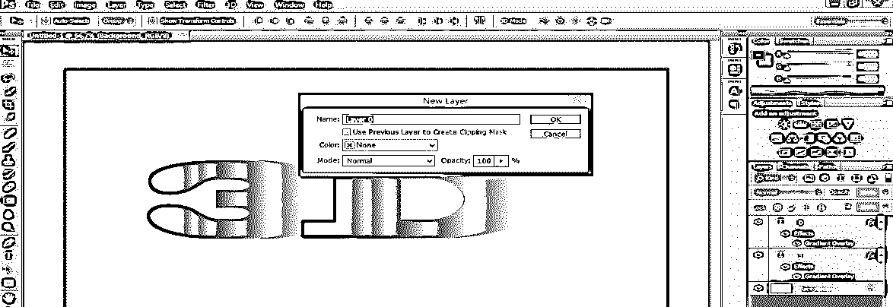

步骤 25: 现在选择这个图层，点击图层底部的图层样式图标。将会打开一个图层样式对话框。在这一层应用这个框中的“渐变叠加”样式。

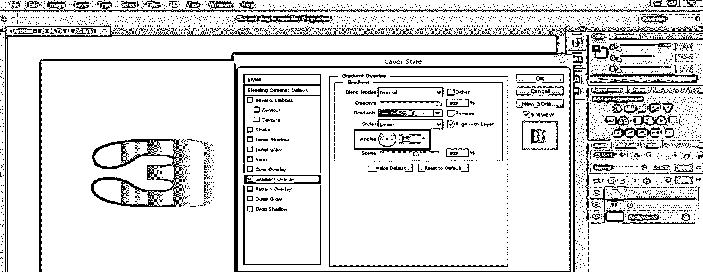

**步骤 26:** 现在点击渐变颜色的刻度。当你点击渐变色标时，渐变编辑框将被打开。从这里根据你选择第一个渐变头的颜色。我会选择红色的深色组合。

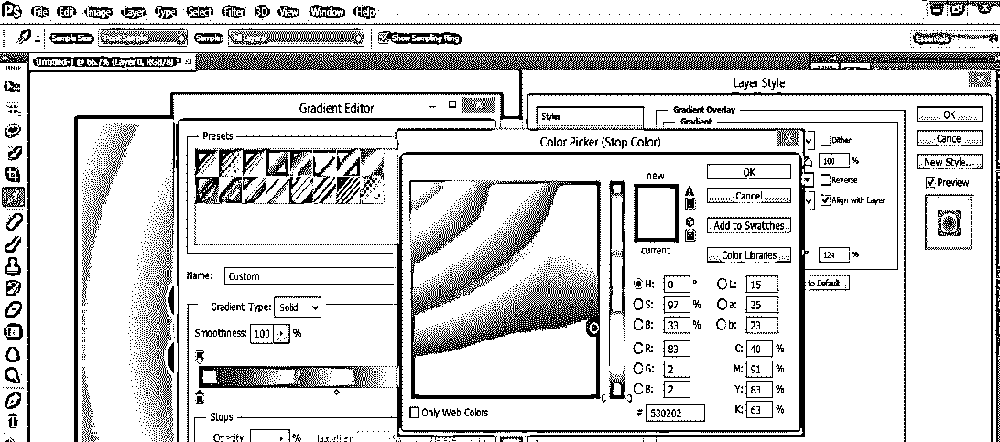

**步骤 27:** 现在，选择第二个渐变头的颜色。我会选择红色的浅色组合。现在，按下此对话框的“确定”按钮来应用此设置。

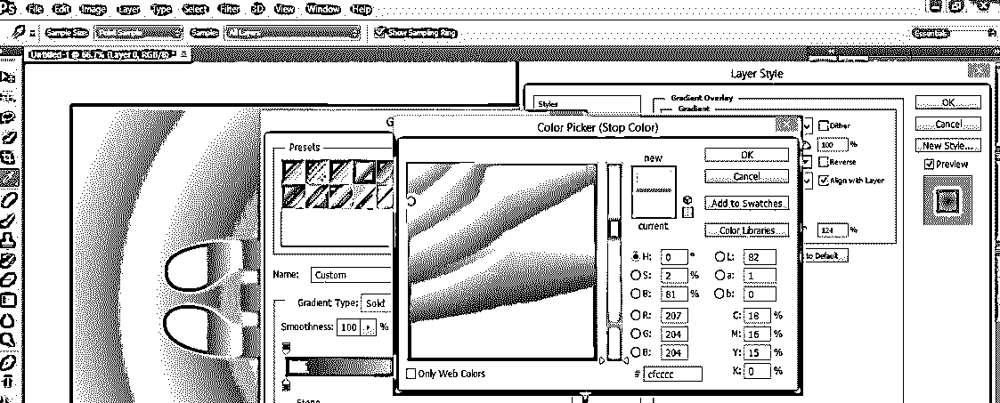

**步骤 28:** 现在再次用鼠标点击选择图层‘3’，双击这个图层的效果选项。一个图层样式框将会打开。

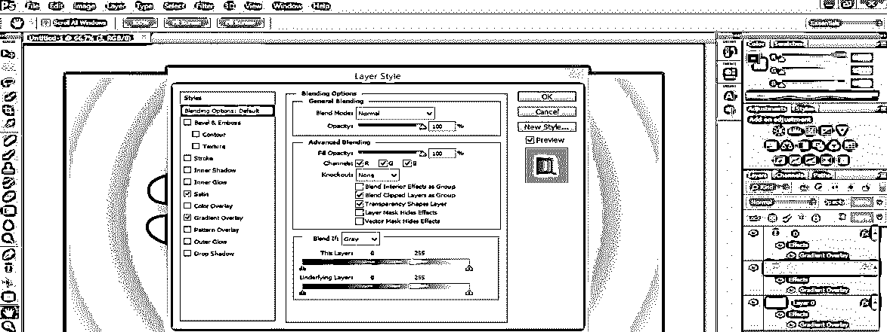

步骤 29: 现在，从这个图层样式对话框中选择“缎子”效果选项，保留其他设置。

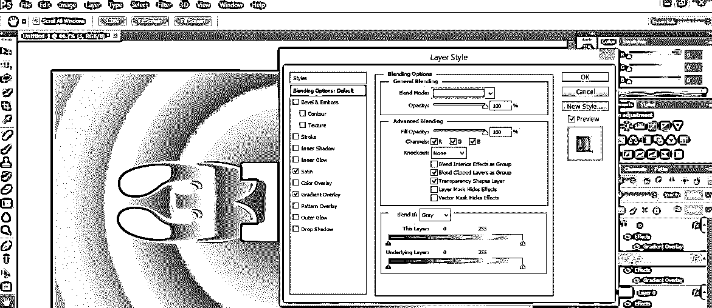

步骤 30: 现在复制这个效果到图层 D。效果会是这样的。

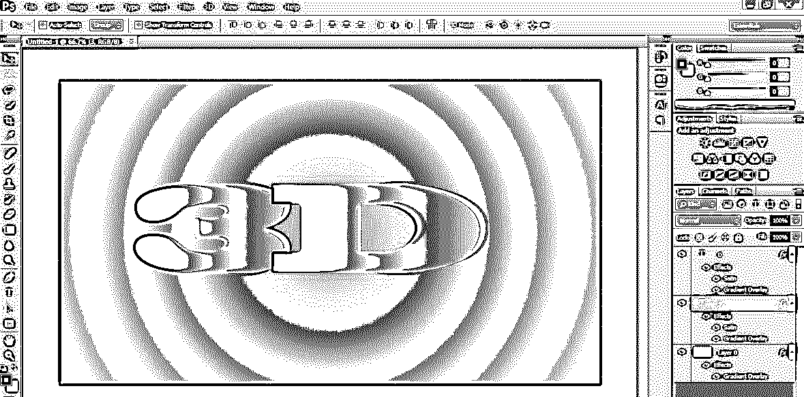

这样，您可以在文本中应用 3d 文本效果，并使您的项目吸引观众的眼球。一旦你很好地掌握了这个软件的有效功能，制作高度专业的项目对你来说将变得很容易。

### 结论

现在你可以理解“什么是 Photoshop 中的 3d 文本效果？”这篇文章之后。您可以轻松应用这种效果，使您的文本更加真实。您还可以在此文本效果功能中进行不同类型的变化。通过练习 Photoshop 软件的这一功能，你将了解文本效果的变化。

### 推荐文章

这是 Photoshop 中 3D 文本效果的指南。在这里，我们讨论的基本概念，创造一个三维文字效果，在一个简单的一步一步的方式。您也可以浏览我们的其他相关文章，了解更多信息——

1.  [在 Photoshop 中创建简单的 3D 文本](https://www.educba.com/3d-text-in-photoshop/)
2.  [如何在 Photoshop 中添加运动效果？](https://www.educba.com/motion-effect-in-photoshop/)
3.  Photoshop 中令人惊叹的文字效果
4.  [在 After Effects 中创建 3D 文本的方法](https://www.educba.com/3d-text-in-after-effects/)

