# 闪亮效果 Photoshop

> 原文：<https://www.educba.com/shiny-effect-photoshop/>

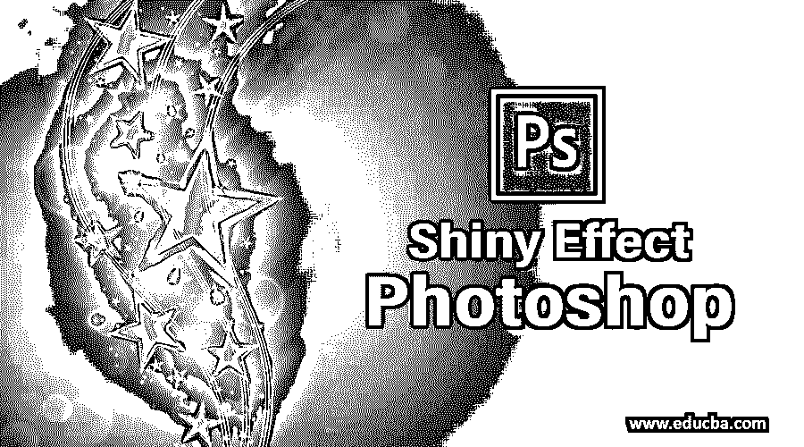

## 闪亮效果 Photoshop 简介

有了 Photoshop 的闪亮效果，你可以把一个沉闷灰暗的图像变成一个闪亮的。您可以通过更改绘画的图层属性来使绘画突出并发光。让我们讨论一下“如何在 Photoshop 中创建闪亮的效果？”以一种非常简单有趣的方式。要在任何文本上应用这种效果，你只需要遵循一些简单的步骤。

### 在 Photoshop 中创建闪亮的效果

在 Adobe Photoshop 中创建闪亮的效果并不是一个很大的任务。你只需要按照这些简单的指示，并按照这些步骤的指示，你一定会得到一个闪亮的效果很好的结果。所以让我们开始学习吧。

<small>3D 动画、建模、仿真、游戏开发&其他</small>

第一步:首先，我们要做一个新的学习文档。对于新文档，请转到菜单栏，然后单击“文件”菜单。将会打开一些选项的下拉列表。从这里选择“新建”选项。

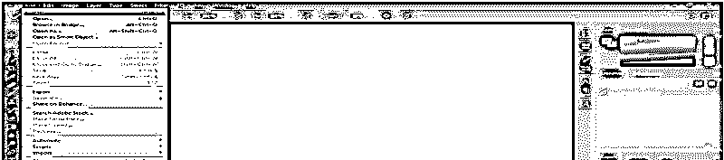

第二步:一个新的文件盒将打开。根据您的需要进行页面设置，并以白色作为本文档的背景色。现在点击这个对话框的创建标签来应用这些设置。

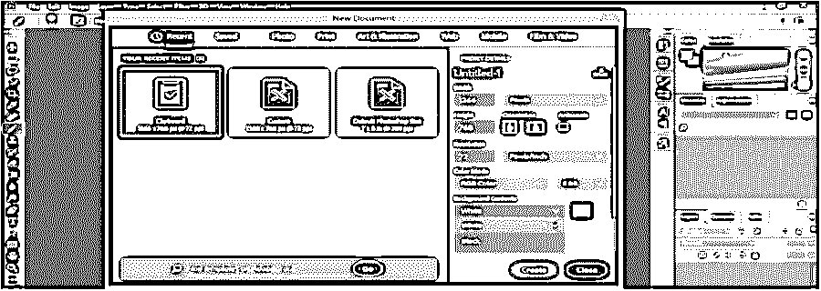

**第三步:**现在点击该软件工具面板的文字工具，该工具位于左上角，用于输入文字:

**第四步:**取‘Arial’为字体样式，黑色为 Arial 字体的样式。

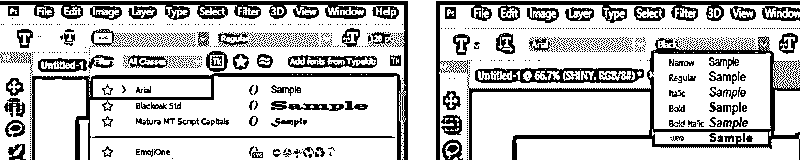

**第五步:**从文字工具的属性栏中取黑色作为文字颜色。

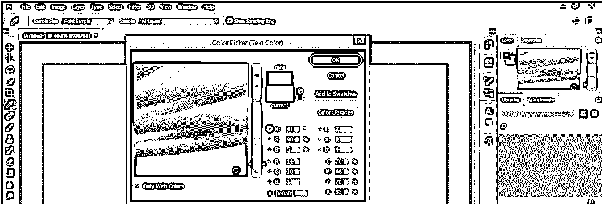

第六步:现在，输入一段你想给它闪亮效果的文字。我将键入“闪亮”作为闪亮效果的文本，并使用移动工具在工作区的中心进行调整。按下**Ctrl+Shift>T3 增大文本尺寸，或按下【Ctrl+Shift+】T5 减小文本尺寸，根据您的需要调整文本尺寸。**

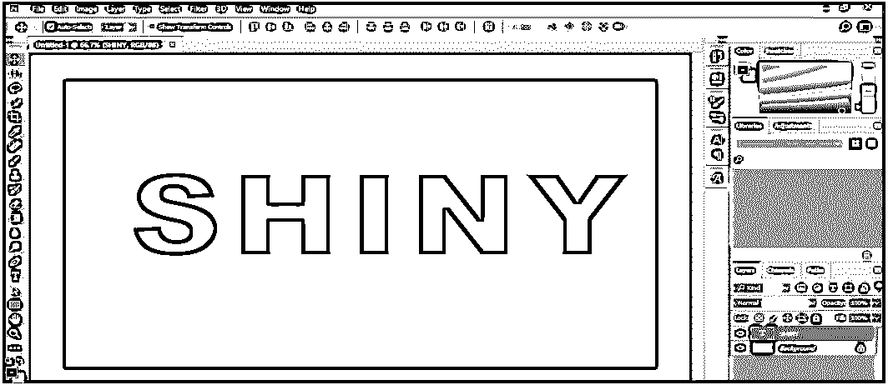

**第七步:**现在转到这个软件的图层部分，在右上角，双击文字图层。将会打开一个图层样式对话框。

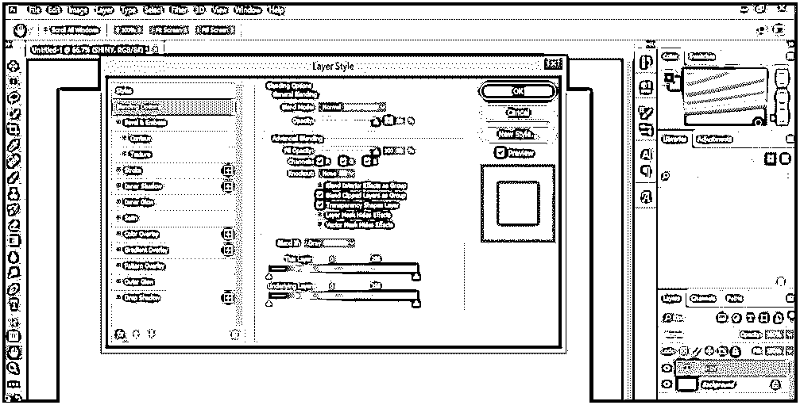

**步骤 8:** 你也可以通过点击图层样式图标打开图层样式框，该图标位于图层部分的底端。

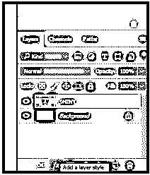

步骤 9: 现在点击图层样式对话框的“颜色叠加”效果选项。

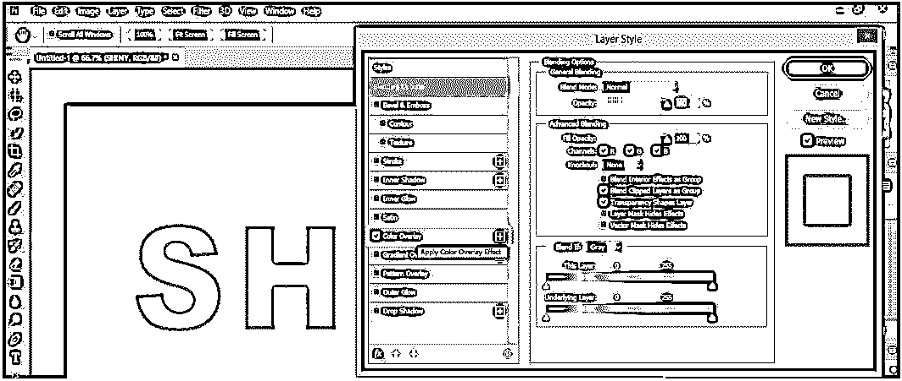

**第十步:**并点击这个效果的颜色框。将会打开一个颜色选择器框。从这里选择您想要的颜色，您可以在文本中使用，或者您可以在颜色代码框中输入特定颜色的代码。

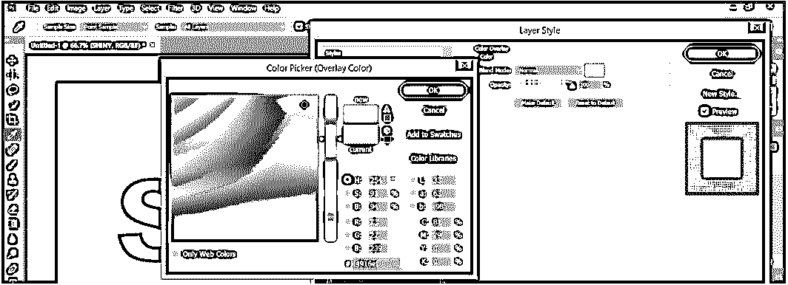

步骤 11: 现在点击这个图层样式框的“内发光”效果。

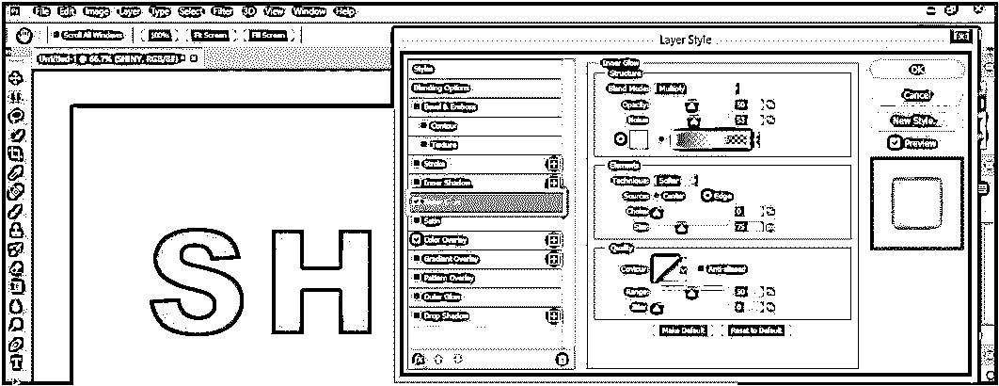

**第十二步:**在这里，我们将设置这个效果的一些参数。选择混合模式中的“乘”选项，不透明度设置为 55%，噪点设置为 0%:

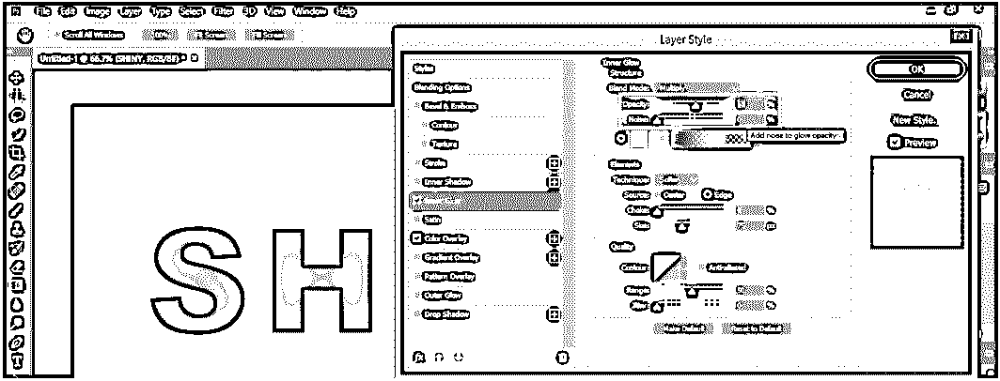

**步骤 13:** 点击这个效果的颜色框，从颜色选择器对话框中选择内部发光的黑色。按此颜色选择器对话框的“确定”选项卡:

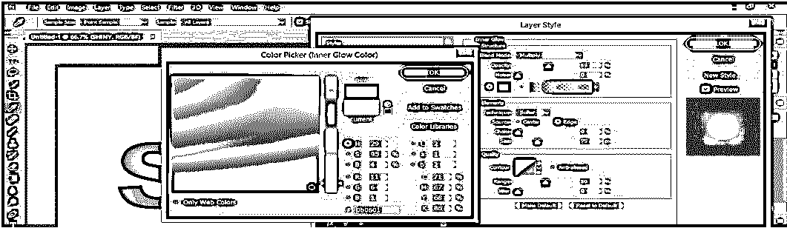

**步骤 14:** 在元素部分，将扼流圈设为 10%，尺寸设为 30 px:

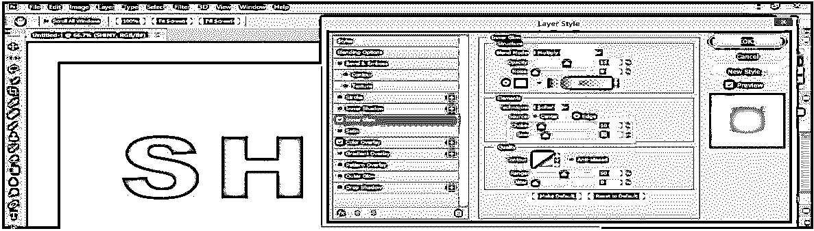

步骤 15: 现在，让我们移动到下一个效果，是斜面&浮雕，我们在这个效果中做一些设置，也是为了增强我们文本的闪亮效果。在这个效果的样式中使用“内斜面”,在技术选项中使用“平滑”,设置深度为 20%,大小为 25 像素，柔化为 8 像素。在“阴影”部分，将角度设为 120 度，高度设为 46 度。现在在阴影模式下使用“线性加深”，不透明度为 0%。

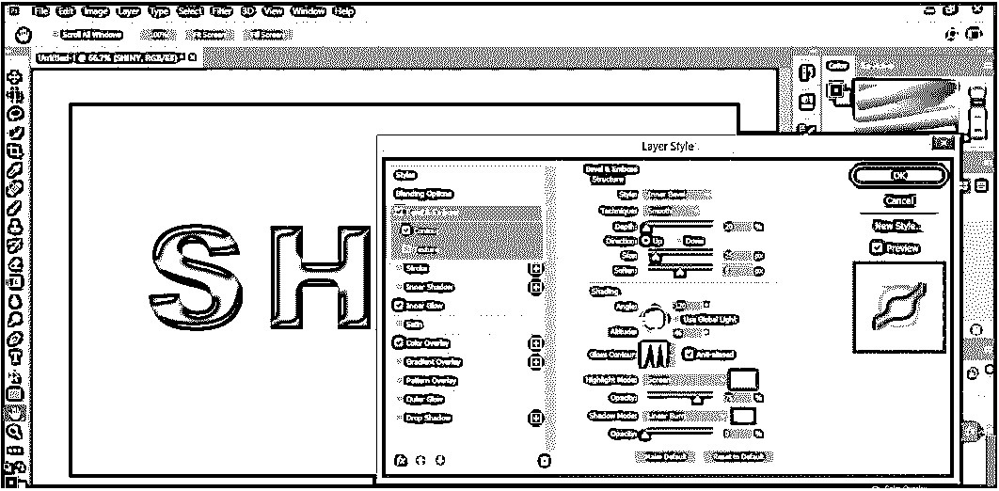

**步骤 16:** 现在点击斜面&浮雕效果的“轮廓”选项，点击轮廓选项中的“圆形台阶”选项，可以清楚地看到闪亮的效果。

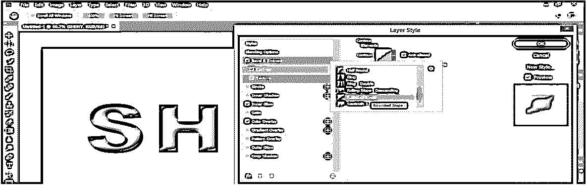

步骤 17: 现在，点击这个图层样式框的 Ok 标签来应用这些效果。当我们按下“确定”选项卡时，我们的文本将如下所示。

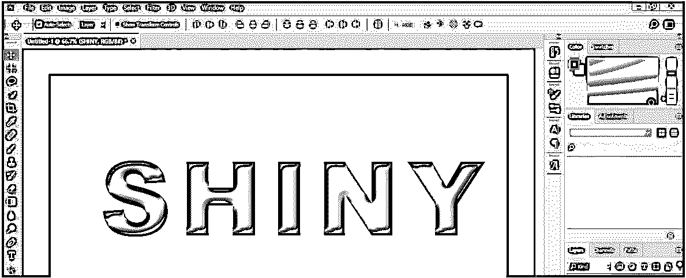

步骤 18: 现在进入这个软件的图层部分，复制这个文字图层。要制作一个复制层，选择文本层，然后按键盘上的 Ctrl + J 键。

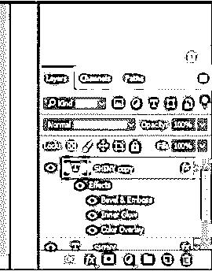

步骤 19: 现在选择我们的文本层的复制层，双击这层的“斜面&浮雕”效果。将打开“斜面&浮雕效果”的图层样式对话框。

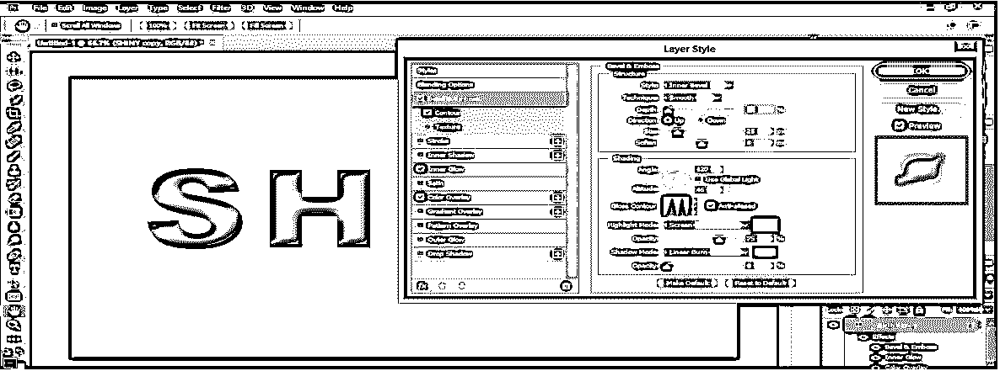

步骤 20: 现在，我们将改变文字图层的斜面&浮雕效果，高度为 45 度。

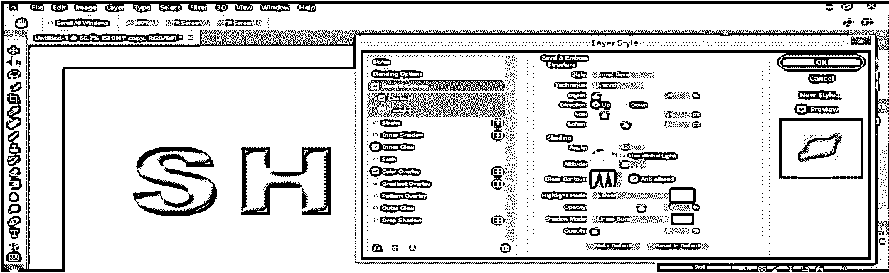

**步骤 21:** 现在转到图层部分，双击背景图层，使其成为简单图层。将打开一个新图层对话框。根据您的需要为该层命名，并按下该对话框的“确定”选项卡:

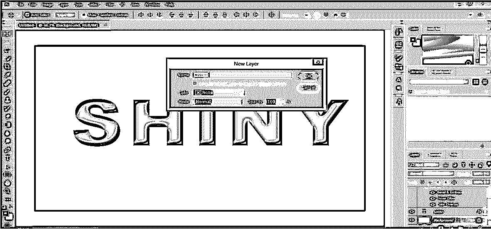

**步骤 22:** 现在双击图层样式框的背景图层(0 层):

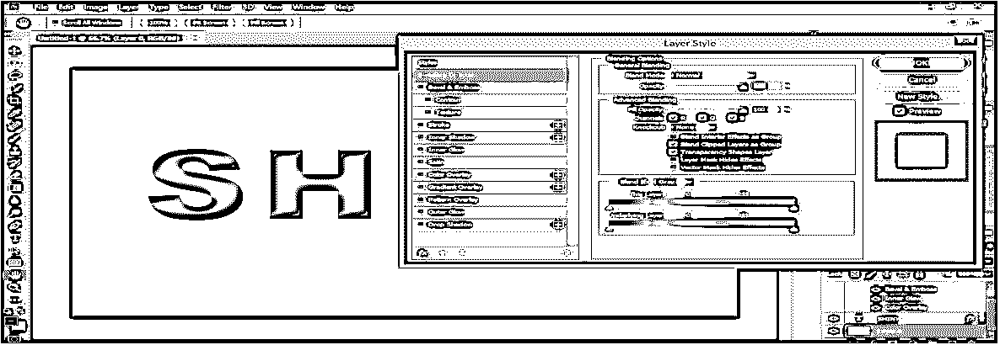

**步骤 23:** 点击此对话框的‘渐变叠加’效果，增加文字闪亮效果的平滑度，并根据自己选择渐变颜色。我将为我的渐变效果选择黑白色的组合。现在选择“反映”渐变风格。您可以选择任何适合您的文本的样式:

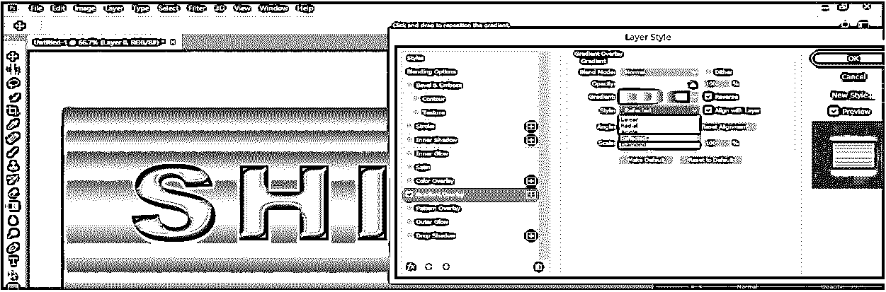

**步骤 24:** 现在点击该对话框的确定选项卡，应用设置。这是 Photoshop 软件中文字最后的闪亮效果。

您可以将这种闪亮的效果应用到 Photoshop 软件中项目的任何对象上，使其看起来更有效。

### 结论

看完这篇文章，你很容易理解‘什么是闪亮效应？’以及“如何在 Photoshop 软件中将其应用到项目的任何对象上”？学习 Photoshop 的这些类型的效果功能将有助于你提高图形设计技能。

### 推荐文章

这是一个闪亮效果 Photoshop 的指南。在这里，我们讨论的介绍，以及如何可以应用光泽效果 photoshop 的一步一步的方式。您也可以浏览我们的其他相关文章，了解更多信息——

1.  [Photoshop 中的修复画笔工具](https://www.educba.com/healing-brush-tool-in-photoshop/)
2.  [Photoshop 中的裁剪工具](https://www.educba.com/crop-tool-in-photoshop/)
3.  [Photoshop 中的快速选择工具](https://www.educba.com/quick-selection-tool-in-photoshop/)
4.  [在 Photoshop 中改变颜色](https://www.educba.com/change-color-in-photoshop/)
5.  [Photoshop 中的发光效果指南](https://www.educba.com/glow-effects-in-photoshop/)

