# Photoshop 中的冰效果

> 原文：<https://www.educba.com/ice-effect-in-photoshop/>

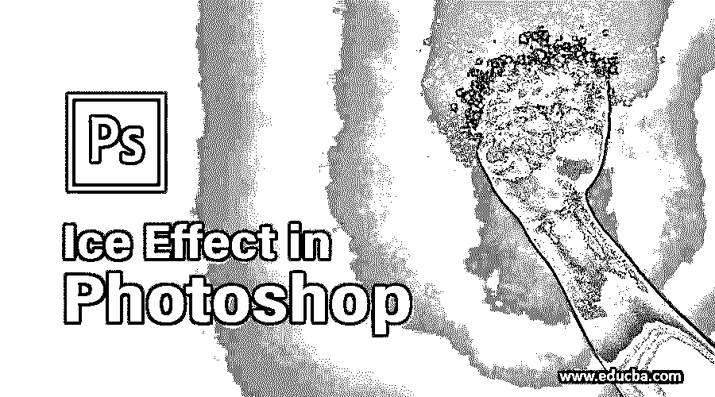

## Photoshop 中的冰效果介绍

Adobe Photoshop 是一个庞大而强大的程序，用于创建图像效果，并使用最流行和最常用的工具和功能编辑原始图像。该计划也有一个有效的过滤器画廊，用于应用效果和创造惊人的水，火，冰云，以及更多这样的效果。在本文中，我们将学习如何在 Adobe Photoshop 中创建冰的效果。虽然，程序是创建效果最常用的程序。但是，它没有任何特定的效果或功能来帮助用户创建任何特定的效果。在一个连续的过程中，在同一图像上使用多种功能来创建效果，以实现所需的输出。

### 如何在 Photoshop 中创建一个冰的效果？

我们将学习和理解使用本主题中的任何图像来创建一个真实的冰效果的基本程序和技术。如前所述，在软件上创建的冰效果不是使用单一的效果，而是使用一组过滤器按顺序创建的。

<small>3D 动画、建模、仿真、游戏开发&其他</small>

如果任何步骤没有完成或互换，那么我们将不会得到想要的真实的冰效果。该计划有一套广泛的工具，使过程更容易和更简单的用户。

**第一步:**在 Photoshop 中打开一个新文档。

**第二步:**从网上下载任意一张图片，将效果应用到图片的部分。在这里，我下载了一张汽车的图片。

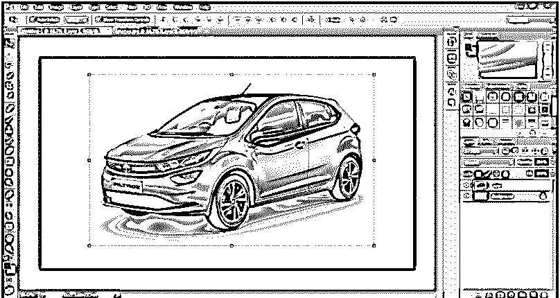

**第三步:**使用工具箱中的快速选择工具，选择图像中需要应用效果的部分。

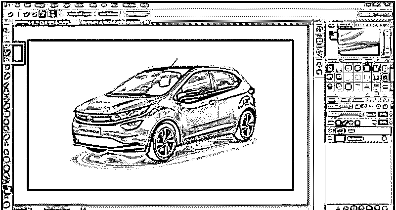

**第四步:**接下来，将这部分图片复制粘贴到另一层。如下图所示。

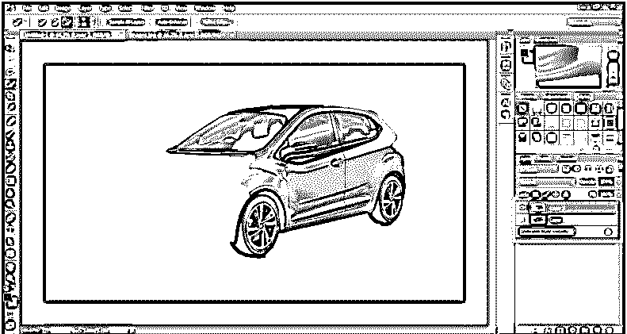

第五步:现在，创建这个图层的副本，点击图层旁边的眼睛按钮。因此该层在屏幕上不可见。

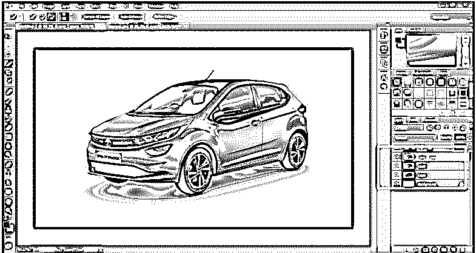

**第六步:**现在，从菜单栏进入图像选项，点击调整。在调整中，面板在所选图层上使用去饱和选项。

**步骤 7:** 现在，进入滤镜，点击滤镜库，使用塑料包装选项，如下图所示。

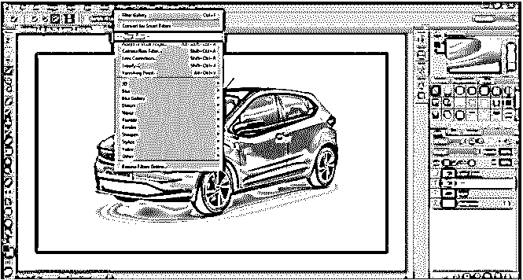

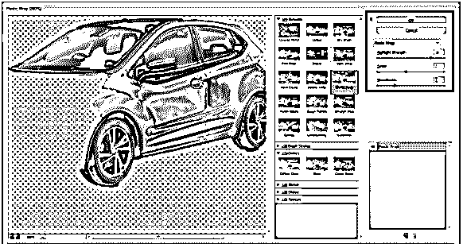

**第 8 步:**保鲜膜滤镜用于创建塑料效果，这是创建冰效果的第一步。

现在，我们将反转图层的效果。为此，使用键盘上的 **Ctrl + I** 选项。

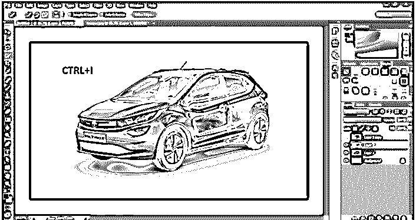

**步骤 10:** 接下来，在图层面板中选择图层混合模式的屏幕选项。如下图所示。

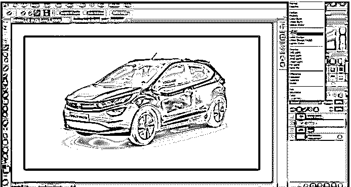

现在，从图层选项中，点击新的填充或调整图层选项，选择色调和饱和度选项。

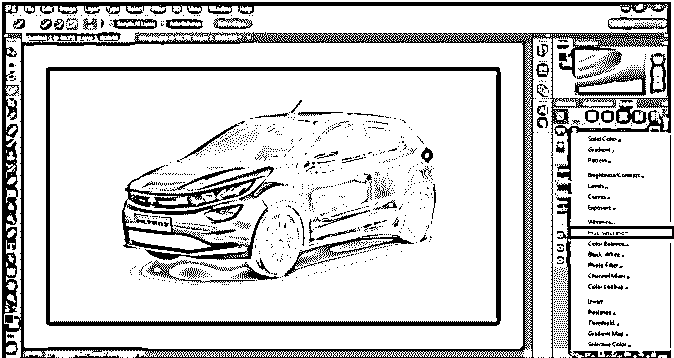

步骤 12: 调整色调和饱和度的设置，使效果看起来呈蓝色。此外，使用着色选项，色调/饱和度。

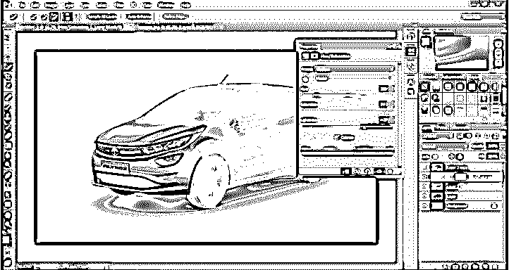

步骤 13: 现在，在已经创建效果的同一图层上创建另一个副本。

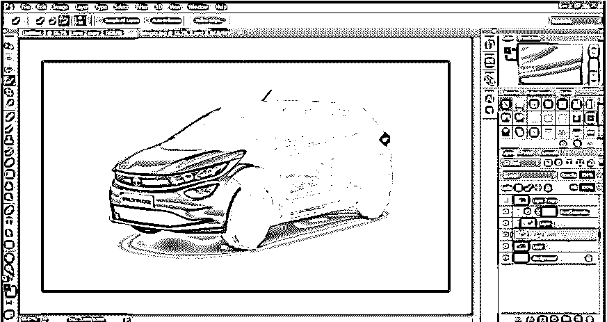

**步骤 14:** 现在，进入滤镜库，使用同一个滤镜库的玻璃选项。

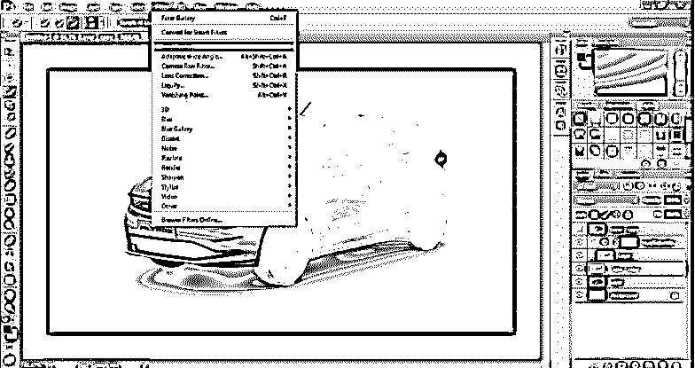

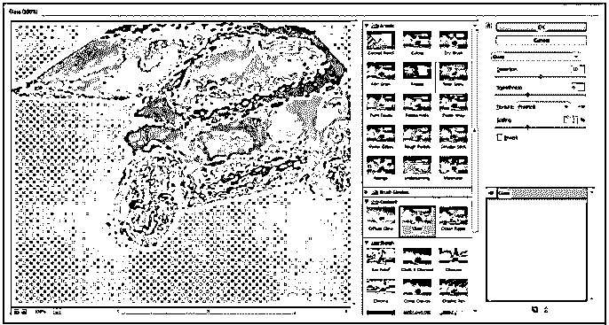

**步骤 15:** 在玻璃选项中，使用磨砂选项，调整效果的设置，如下图所示。

**第十六步:**现在，效果准备好了。尽管仍有一些调整需要进行。

**步骤 17:** 选择图层，点击蒙版选项。使用笔刷工具创建遮罩，使效果看起来更真实。创建遮罩的目的是使效果看起来非常真实和自然。

步骤 18: 接下来，我们可以在图层上添加光晕和阴影效果。我们需要使用混合模式，并使用外部发光和阴影选项，以获得更真实的外观。

**第 19 步:**这是在 Adobe Photoshop 上创建的最终 ice 效果。类似地，我们可以在任何图像上创建冰效果，并通过调整创建冰效果过程中使用的效果设置来赋予它逼真的外观。

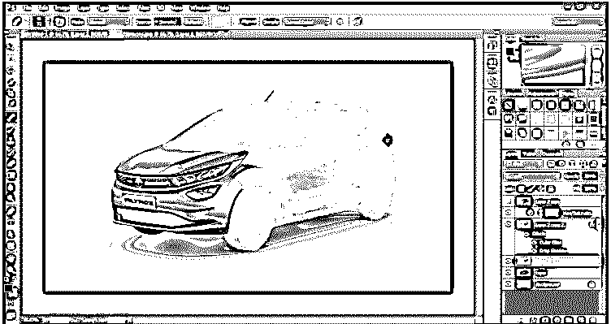

*   虽然，这个过程对初学者来说似乎是一个漫长的任务。但是，总的来说，这个过程很容易理解并在给定的项目中使用。就像火的效果或雨的效果一样，冰的效果也是用耐心和创造力创造出来的。用户应该有创造性的想象力和想法来创建一个使用软件的现实效果。软件在用户和他们创建的项目之间起到了桥梁的作用，他们可以从中学到很多东西。

### 结论

在这篇文章中，我们学习了创建冰效果的不同步骤和技术。文章还包括一个详细的例子，使用户了解创建效果的主要和基本过程。由于 Photoshop 的出现，随着时间的推移和程序本身的不断更新，创建这样的效果变得更加容易和简单。

### 推荐文章

这是一个 Photoshop 中的冰效果指南。在这里，我们讨论一个介绍，不同的步骤和技术用于创建冰的效果。您也可以浏览我们的其他相关文章，了解更多信息——

1.  [在 Photoshop 中的分散效果](https://www.educba.com/dispersion-effect-in-photoshop/)
2.  [Photoshop 中的画板](https://www.educba.com/artboard-in-photoshop/)
3.  [Photoshop 中的水彩画笔](https://www.educba.com/watercolor-brushes-in-photoshop/)
4.  [如何在 Photoshop 中填充颜色？](https://www.educba.com/how-to-fill-color-in-photoshop/)

