# Photoshop 中的弥散效果

> 原文：<https://www.educba.com/dispersion-effect-in-photoshop/>

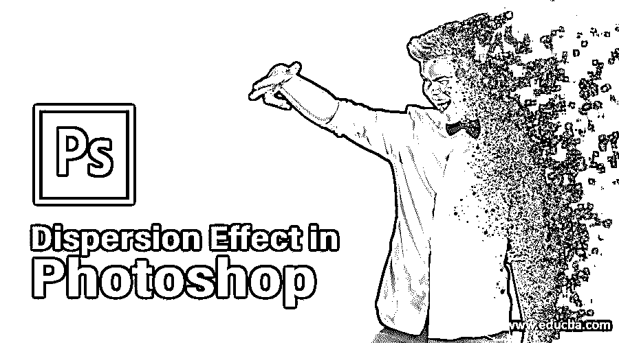

## Photoshop 中色散效果介绍

您可以使用 Photoshop 中的扩散效果来创建引人入胜的效果。只需选择你想要处理的图像，然后将它们转换成令人惊叹的艺术品。您可以使用各种画笔类型来创建惊人的分散效果。在下面的教程中，我使用了一辆汽车的图像，并添加了弥散效果。通过这些步骤，你会发现在 Photoshop 中添加扩散效果的一切。

### 如何在 Photoshop 中创建弥散效果？

以下是在 photoshop 中创建扩散效果的步骤。

<small>3D 动画、建模、仿真、游戏开发&其他</small>

**第一步:**第一步，在 Photoshop 中加载图片。为此，您可以将图像拖到文档窗口上，或者直接从 Photoshop 中放入图像。

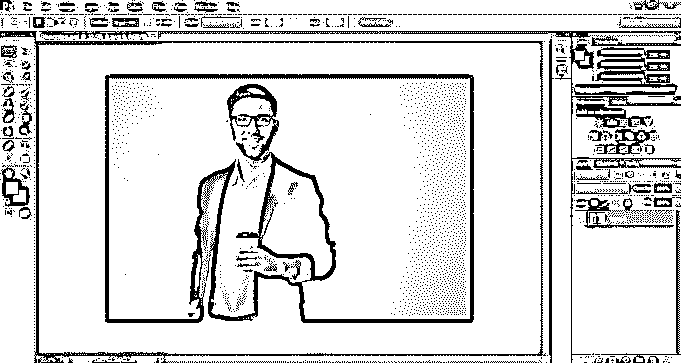

第二步:接下来，使用快捷键 **Alt+ J** 或者 **Cmd + J** 复制图像中的图层，如果你使用 Mac 的话。

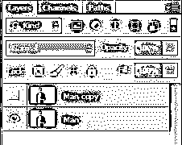

**第三步:**在 Photoshop 中打开你的图像，复制图层(Mac 上 Alt + J 或 Command + J)。接下来，通过点击眼睛图标隐藏新层。

第四步:在第四步中，我们将使用套索工具。大致围绕图像中的主体进行绘制。选择需要涵盖整个主题。

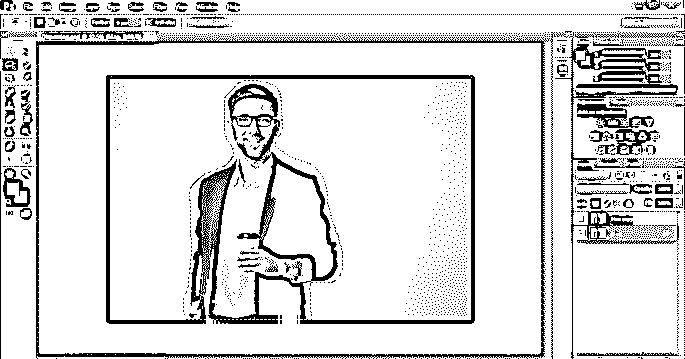

**第五步:**选择完成后，点击右键，选择填充。

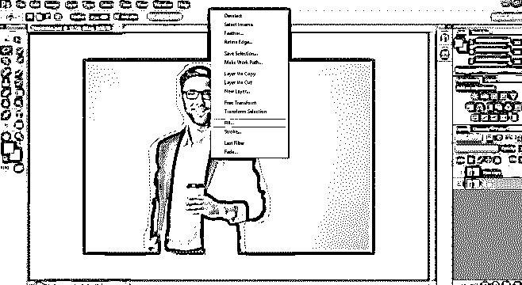

**步骤 6:** 选择内容感知选项并点击确定。

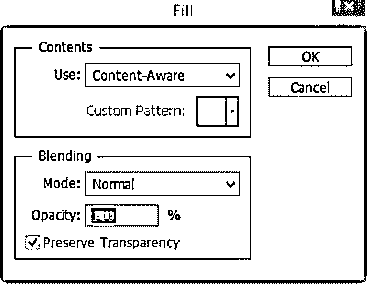

第七步:现在，你就有了图像背景。如果最后一个仍处于活动状态，您可以将其禁用。同样的快捷键是 **Ctrl+D** ，Mac **CMD+D** 。或者，顶部也有一个选择菜单，您可以在其中选择取消选择选项。

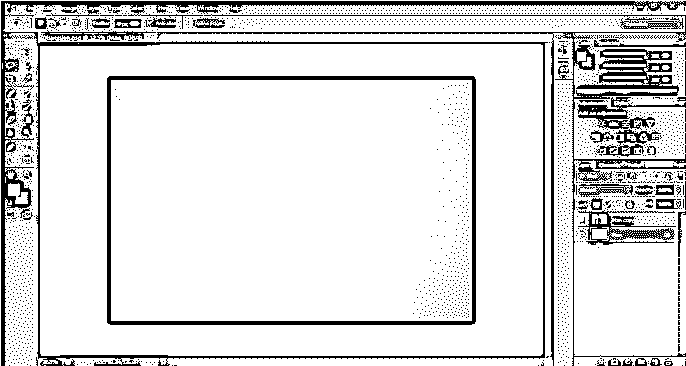

之后，我将在图层面板中选择新建图层选项。之后，选择左侧菜单中的快速选择工具。它选取图像的整个主体。

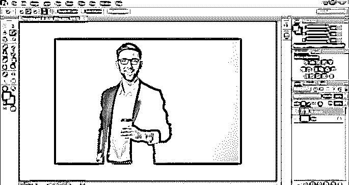

**第九步:**如果觉得选区没问题，可以选择上方的选择和蒙版。在旧版本的 Photoshop 中，选项是细化边缘。

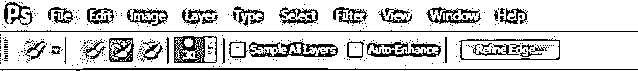

**第十步:**在左侧，你会发现细化边缘按钮，可以用来遮罩更深层次的细节。现在我们将从图片中选择边缘。您可以在“优化边缘”对话框中给定值，并创建适当的效果。

**步骤 11:** 从底部的属性面板中选择图层蒙版。选择确定。现在图层蒙版被应用。我们将复制蒙版层。

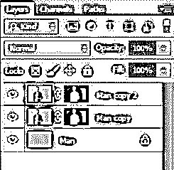

**步骤 12:** 右键点击复制图层蒙版，选择“应用图层蒙版”。

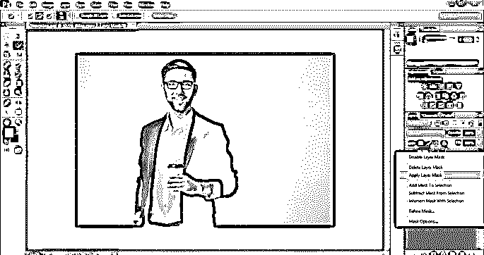

**步骤 13:** 最上面一层会有一辆车在隔离。为了更容易理解，可以将其重命名为分散。

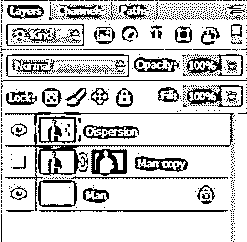

接下来，通过选择眼睛图标关闭图层的可见性。

**步骤 14:** 创建弥散层的副本，命名为前景。

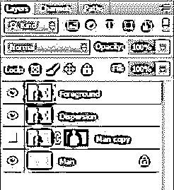

**步骤 15:** 选择色散层，进入顶部菜单选项。现在选择过滤器选项，并点击液化。

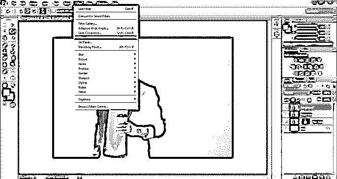

第十六步:选择向前扭曲工具，你在左边找到的第一个选项。之后，开始拖动图像区域以获得分散的效果。

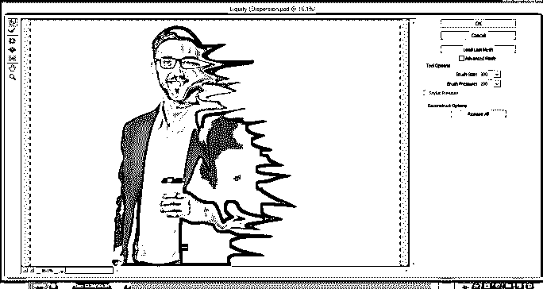

PS:你可以试试增大或者减小笔刷半径。为此，请使用左括号“[”来减小半径。要增加半径，请使用右括号“]”。相应地，根据你的创造力调整扭曲量。最后，单击确定。

第 17 步:这会给你留下一些模糊的图像。保持分散层选中，按住 Alt/Option 并激活遮罩按钮。

**步骤 18:** 现在，我们将选择前景层，点击蒙版。

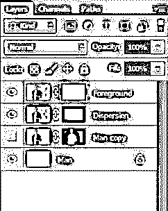

现在你会注意到扩散层有一个黑色的封面，而前景层有一个白色的封面。一个隐藏面具，而后者显示面具。

**步骤 19:** 保持前景蒙版活跃，从工具面板中选择一个笔刷。除了默认的 Photoshop 笔刷之外，您可以尝试安装笔刷来获得更好的效果。

笔刷的前景在“前景”层应该是黑色的。这将从所选层中剪切出零件。使用笔刷工具改变扩散的效果。

第 20 步:你可以从顶部菜单中改变笔刷设置。您可以更改选定画笔的大小、类型和方向。

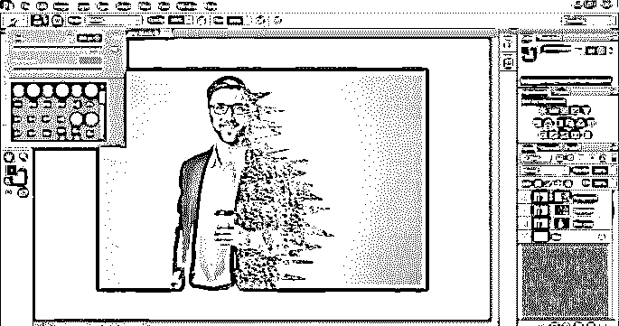

步骤 21: 现在，我们将通过揭开之前创建的液化扭曲来创建类似灰烬的效果。这里画笔的前景色需要是白色。

**步骤:22:** 选择“弥散”图层蒙版。继续使用笔刷工具，添加不同的笔刷效果。

步骤 23: 在“扩散”和“前景”层之间切换，以更好地控制效果的范围。只是要注意根据选择的图层改变前景色。花些时间来获得你能得到的最好的结果。

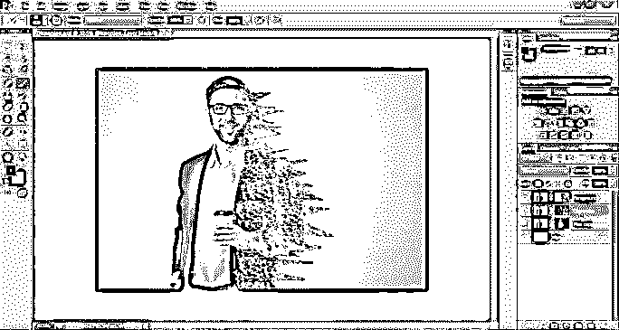

**步骤:24:** 接下来，点击 **Ctrl+Shift+Alt+E** ，合并所有可见图层。生成的层是层 1。

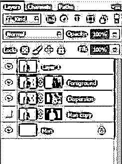

接下来，选择层 1，并通过右键单击它将其转换为智能对象。

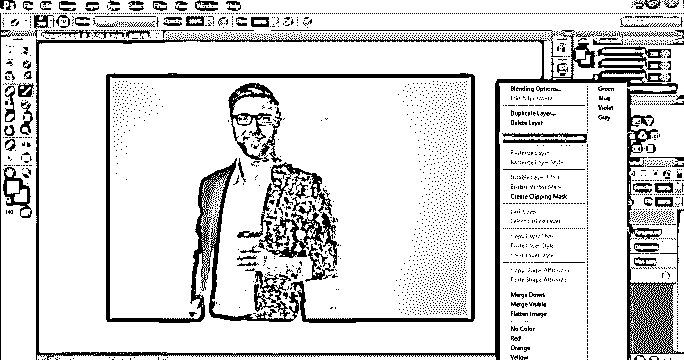

第 25 步:之后，进入顶部的滤镜菜单，选择锐化，然后选择反锐化掩模。

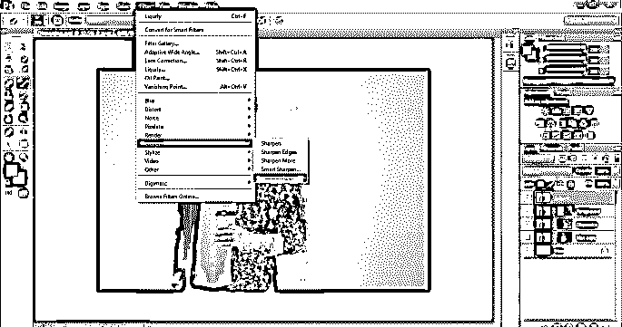

**步骤 26:** 选择你想要锐化的量的最佳值。在这个例子中，我将数量设置为 85%。

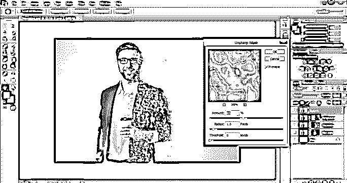

### 结论

Photoshop 为将单纯的图像转换为艺术形式提供了许多效果和功能。分散就是这样一个惊人的效果。从这篇文章中，你可以学习如何为你的图像创建令人惊叹的扩散效果。今天就试试吧，看看你如何在照片中运用这种新技术。如果你想了解更多这样的技术，请访问我们类似的博客。

### 推荐文章

这是 Photoshop 中弥散效果的指南。在这里，我们讨论了介绍和如何创建一个在 photoshop 的扩散效果及其步骤。您也可以阅读以下文章，了解更多信息——

1.  [如何在 Photoshop 中高亮显示文字？| 2 方法](https://www.educba.com/how-to-highlight-text-in-photoshop/)
2.  [在 Photoshop 中创建反射效果](https://www.educba.com/reflection-effect-in-photoshop/)
3.  [在后效中创造降雪的方法](https://www.educba.com/snowfall-in-after-effects/)
4.  [后效构图指南](https://www.educba.com/composition-in-after-effects/)

