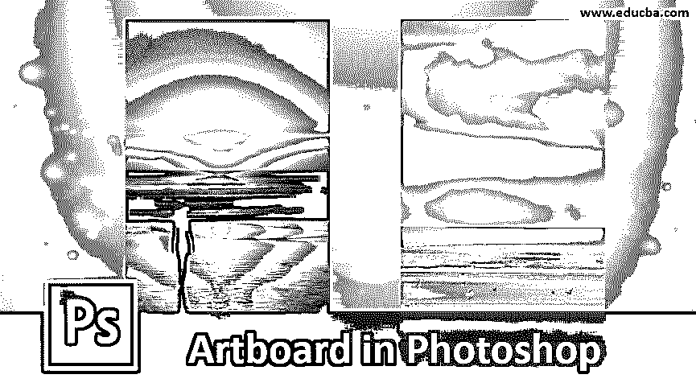
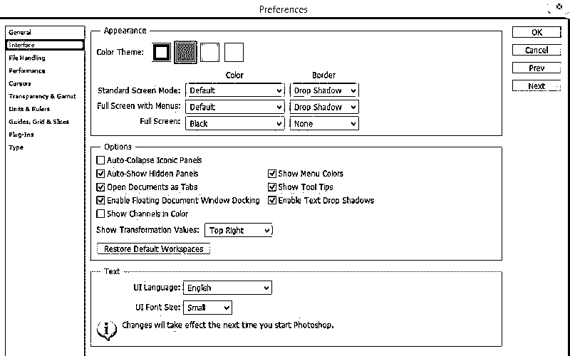
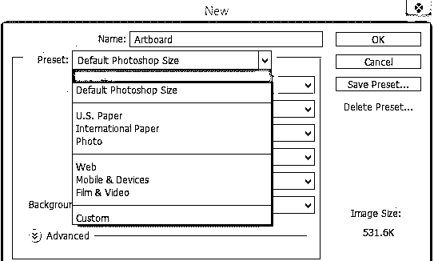
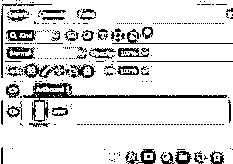
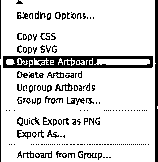
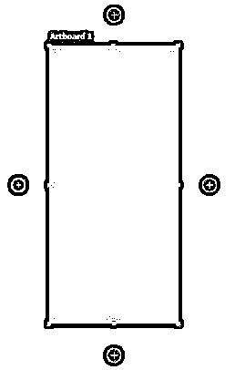
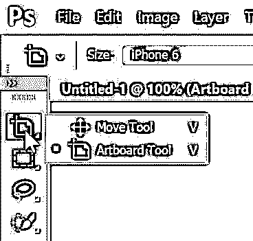
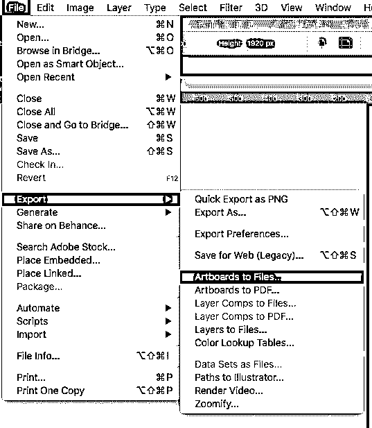
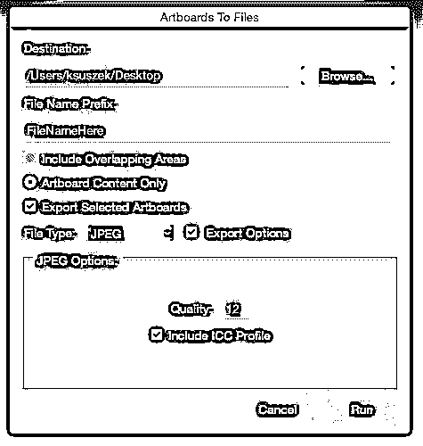

# Photoshop 中的画板

> 原文：<https://www.educba.com/artboard-in-photoshop/>

## Photoshop 中的画板介绍

Photoshop 中的画板主要用于简化 Adobe Photoshop 中的整个设计过程，因为它提供了各种各样的默认预设大小以及设置您自己的自定义大小的选项，并且根据您是为网站还是印刷媒体创建元素，您可以选择首选大小的画板，在同一文档中创建多个画板并开始工作，因此，画板的用途是无限的，并且画板有许多好处，可以帮助您转变在 Photoshop 中的体验。

### Photoshop 中的画板是如何工作的？

如果您熟悉在 Adobe Illustrator 中使用画板，这与您在 Photoshop 中使用画板的情况大致相同。在这里，画板被视为分层文档。如果我们使用多个画板，除了 Photoshop 效果和功能之外，每个元素都可以包含自己的单独图层、智能对象、文本、图层组。此外，使用“图层”调板，您可以进一步重新排列每个画板中的图层。

<small>3D 动画、建模、仿真、游戏开发&其他</small>

### 设置画板首选项

您可以选择和设置首选画板遮罩颜色，还可以选择希望画板边框可见还是隐藏。为此，选择编辑，然后选择首选项并单击界面。

### 如何在 Adobe Photoshop 中使用画板？

下面是在 Photoshop 中创建画板的步骤。

**步骤 1:** 打开 Adobe Photoshop 后，在尝试创建新文档时，您将可以选择预设的画板尺寸。

**第二步:**打开 Photoshop，选择新建；根据您需要的画板大小，您可以从美国纸张、国际纸张、照片、web、手机、电影和视频中进行选择。

**第三步:**在最新的 Adobe Photoshop CC 版本中，你会发现类似 iPhone、Android、微软 Surface 等设备。

**步骤 4:** 从上述预设列表中选择一个选项，开始工作。

### 如何在 Photoshop 中命名和复制画板？

要重命名画板，请遵循以下说明。

*   选择画板并单击图层，然后重命名画板。
*   给画板取一个合适的名称，然后点击 Return。

#### 在 Photoshop 中复制画板

*   转到图层面板，选择要复制的画板。

*   之后，使用鼠标右键单击并选择复制画板选项。

*   接下来，您可以命名新的画板，并单击确定。

#### 向文档中快速添加新画板

有一种简单的方法可以将新画板添加到现有文档中。选择画板后，您必须单击出现在画板周围的+图标。如果要保留画板中的所有方面，可以使用 Option/Alt 并单击加号(+)图标。

*   在移动工具下，选择画板工具。
*   选择需要复制的画板。
*   您会注意到画板周围有一个+图标。在需要创建新画板的方向上选择+号。

#### 在第二个画板中创建设计

*   在第二个画板上添加图像，并选择移动工具。

*   按住 shift 键，按比例缩放图片

**Note:** Be careful not to overlap or cut the other artwork even though they are in the same document

#### 将元素从一个画板移动到另一个画板

如果您想将一个画板中的元素用于另一个画板，只需单击对象并将其拖到所需的画板上即可。默认情况下，Photoshop 将根据标尺的原点来定位对象。

#### 导出画板

您也可以将文件存储为 Photoshop 文件，以保留所有图层。完成工作后，最后一步是导出设计。您可以从一长串文件格式中选择要用来导出 Photoshop 文档的格式。

下面我们将看到将画板导出为文件的方法:

**第一步:**选择文件并选择导出。然后选择画板到文件。

**第二步:**在弹出的对话框中，按照以下步骤操作:

*   选择您希望文件在 PC 上本地保存的位置。
*   为文件选择一个前缀名。
*   接下来，您必须说明您是只需要画板中的元素，还是也需要与它们重叠的元素。
*   之后，您可以选择需要导出的画板数量。
*   接下来是导出背景和画板的选项。如果您需要 bg，请选择它。
*   现在是画板导出的文件格式。Photoshop 支持各种文件格式，如 BMP、JPEG、PDF、PSD、Targa、TIFF、PNG-8 或 PNG-24。
*   选择导出所需的格式。
*   决定是否需要在导出的文件中保留画板名称。您也可以在此设置中选择字体、大小或颜色。

**第三步:**选择运行。现在，Photoshop 将按照您选择的首选项导出画板。

### 结论

它可以让数字艺术家的工作变得更加容易。画板提供了一个灵活的平台，他们可以在那里创建设计。一旦你开始在工作中使用画板，你会注意到事情是如何按照你需要的方式进行的。通过实践利用上面讨论的方法，改变你的 Photoshop 体验。

### 推荐文章

这是 Photoshop 中的画板指南。在这里，我们讨论介绍，如何使用它，它是如何工作的，以及如何命名和复制 Photoshop 中的画板与适当的解释。您也可以浏览我们的其他相关文章，了解更多信息——

1.  [如何在 Photoshop 中改变文字颜色？](https://www.educba.com/how-to-change-text-color-in-photoshop/)
2.  [Photoshop 混合笔刷工具](https://www.educba.com/photoshop-mixer-brush-tool/)
3.  [如何在 Photoshop 中填充颜色？](https://www.educba.com/how-to-fill-color-in-photoshop/)
4.  [Photoshop 中的插件](https://www.educba.com/plugins-in-photoshop/)

