# Photoshop 中的火焰效果

> 原文：<https://www.educba.com/fire-effect-in-photoshop/>

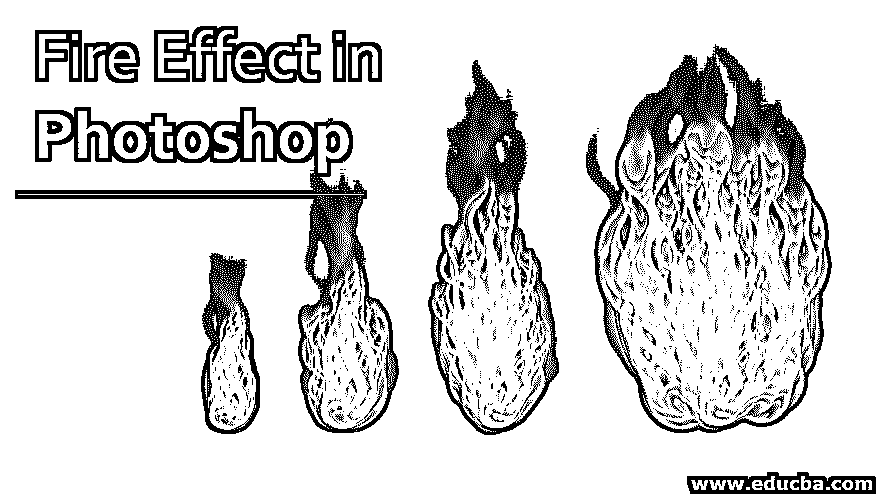

## Photoshop 中的火焰效果介绍

Adobe Photoshop 用于创建许多令人惊叹的效果和模型。一个最真实和完美的例子是在 Photoshop 中创建一个火的效果，它有各种各样的工具和过滤器用来创建完美的效果。诸如风效果和高斯模糊效果的过滤器以及色调和饱和度的组合被用于创建这种没有任何误差的效果。这些滤镜可能不会出现在每个图像编辑程序中，这就是为什么 Photoshop 被称为所有图像编辑器之父的原因。

### 如何在 Photoshop 中创建火的效果？

Photoshop 是一个功能强大的程序，它包含许多创建效果和实现特定结果的过程。其中一个效果是在程序上创建一个火焰效果。虽然没有直接的功能效果或工具来创建相同的效果，但我们使用一个过程来实现结果。创建这种效果似乎并不容易，也不直接，因为创建这种效果需要大量的滤镜和技术。但是，一旦创建，效果看起来真实而有吸引力。

<small>3D 动画、建模、仿真、游戏开发&其他</small>

**第一步:**在软件中创建新文档。

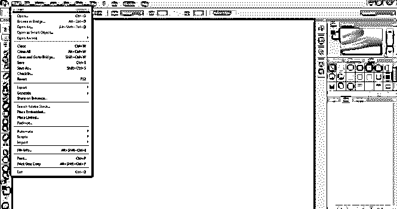

**步骤 2:** 使用出现的对话框调整文档的属性。使用 640 * 480 像素的宽度尺寸。

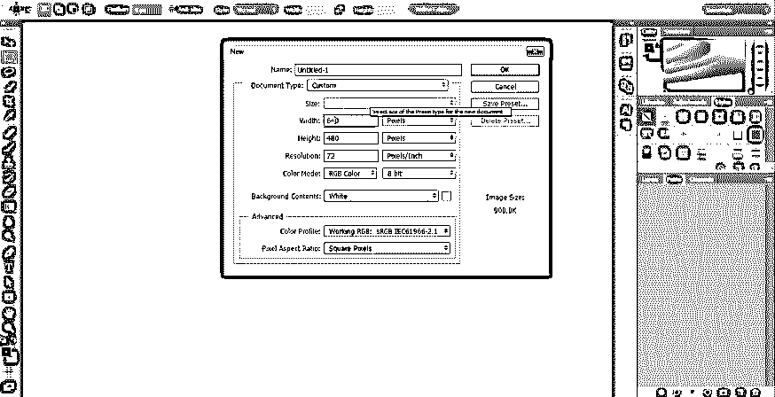

**第三步:**点击文字工具，在页面上书写红火。

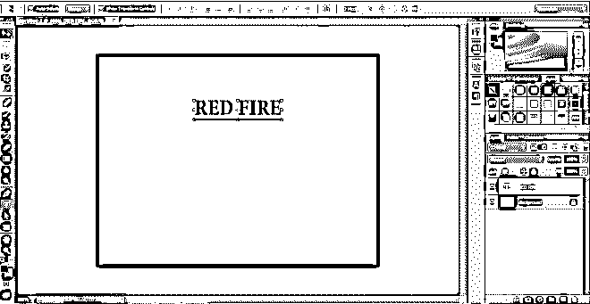

**步骤 4:** 将文本加粗，使用 Arial 黑色字体，如图所示。

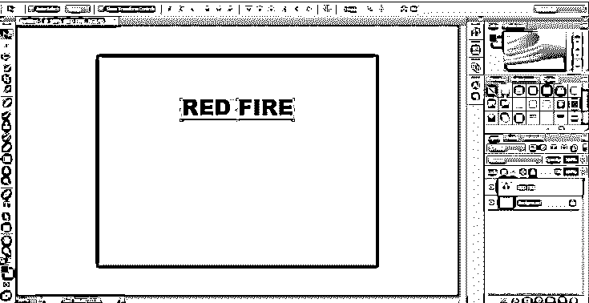

**步骤 5:** 一旦文字写好，使用箭头键将文字向下移动。接下来，进入图层菜单，点击栅格化。

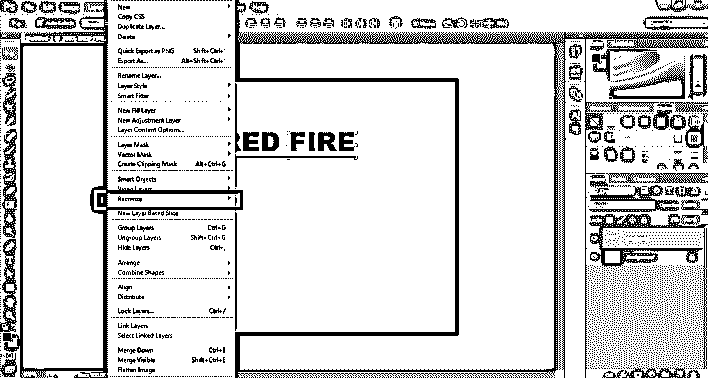

**第六步:**接下来，从菜单中点击 Type。

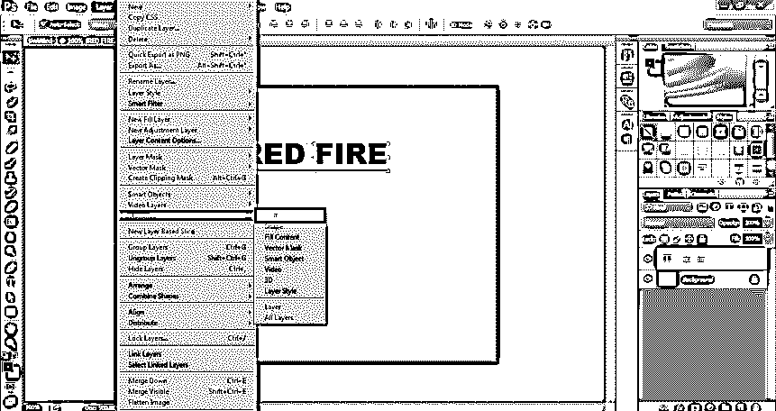

**第七步:**一旦图像被栅格化，用户就不能更改文本属性或编辑文本本身。Photoshop 中的栅格化过程是将文本层更改为图像层，并对其进行处理。这将锁定文本属性，并将图层完全更改为图像图层。

**步骤 8:** 现在，右键点击图像，选择复制图层，复制图像图层。

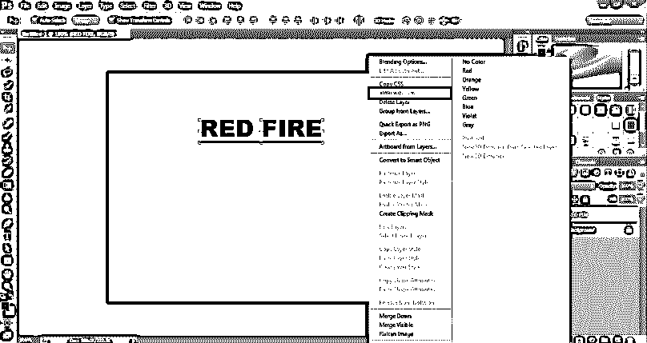

**第九步:**现在，选择原始图层，进入图像菜单，选择旋转画布。在此选项中，选择顺时针旋转 90 度。此选项会将画布顺时针旋转 90 度。

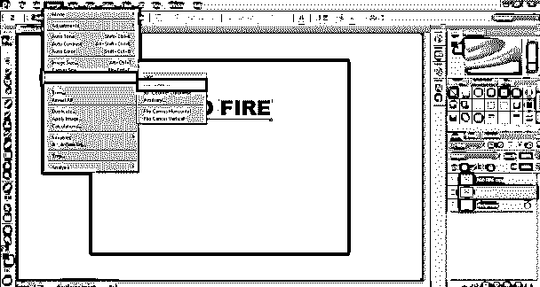

第十步:现在，点击滤镜，进入风格化菜单。

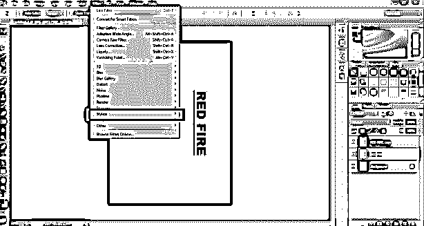

**步骤 11:** 使用菜单中的风选项。

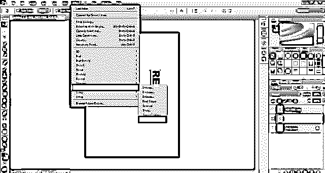

**第十二步:**会出现一个对话框。在属性菜单中选择水平和从左。单击确定保存设置。wind 命令用于从文本生成尖峰，如图所示。

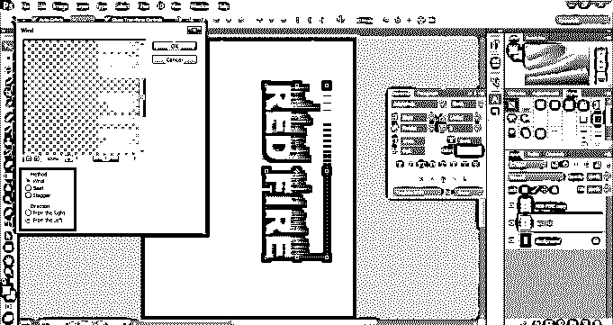

**步骤 13:** 现在，要给文本添加更多的尖峰，要么从滤镜库选择风选项，要么使用 CTRL+F 命令重复最后添加的滤镜。使用这种方法两次，看看结果。

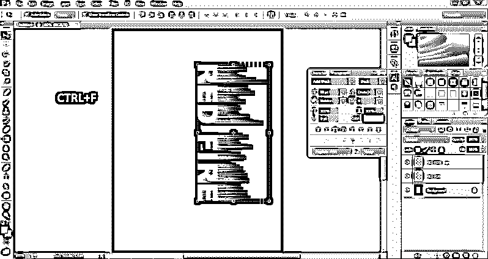

**步骤 14:** 接下来，再次进入图像菜单，选择旋转画布。现在，选择逆时针旋转 90 度。这将使画布回到原来的位置。

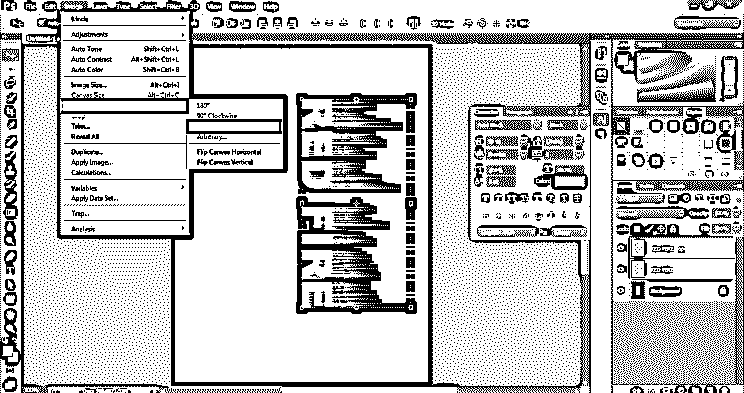

**第十五步:**给一个逼真的效果。现在，点击滤镜选项，从菜单中选择模糊>高斯模糊。

**第十六步:**会出现一个对话框。选择“3”作为模糊效果的数量，然后单击“确定”保存设置。

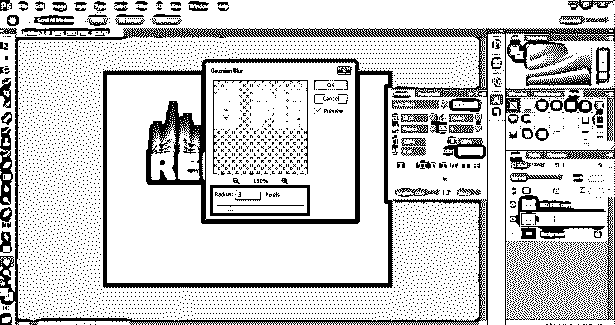

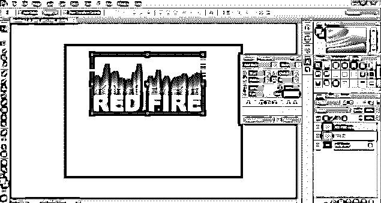

**步骤 17:** 接下来，右键点击背景图层，选择复制图层。

**步骤 18:** 接下来，将复制的背景图层和原图一起选中，然后右键点击相同的，点击合并图层。

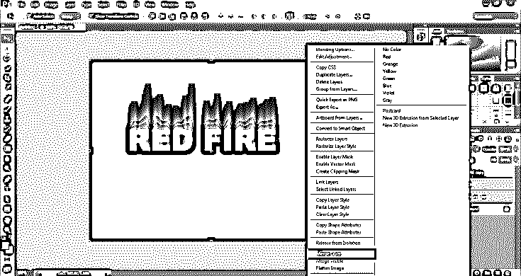

**第 19 步:**现在，进入过滤器菜单，选择液化选项。液化工具用于旋转、反射、推、拉和膨胀图像的像素。

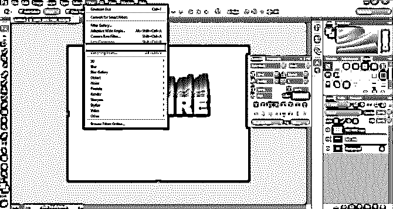

**第 20 步:**现在会出现如图所示的对话框。从菜单中相应地改变笔刷大小、密度和压力。

步骤 21: 现在，选择向前环绕工具，用这个工具在文字上创建一个火的效果，如图所示。

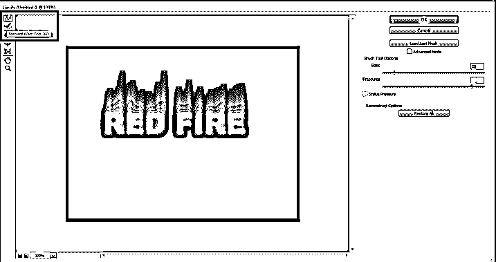

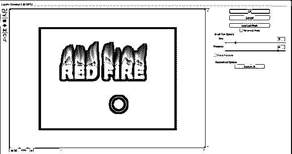

**第 22 步:**现在，点击图像，进入调整。点击色调/饱和度。

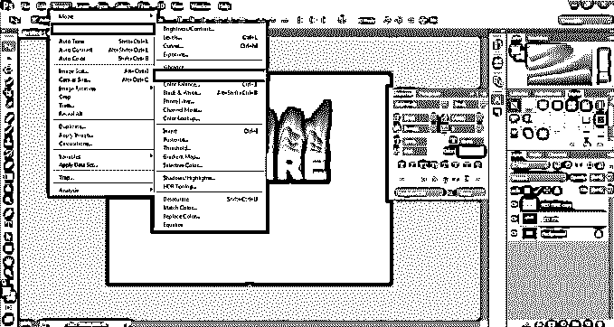

**步骤 23:** 会出现一个对话框。选择着色选项。然后，在色调选项，写值 50 和饱和度，写值 100，并按下确定。

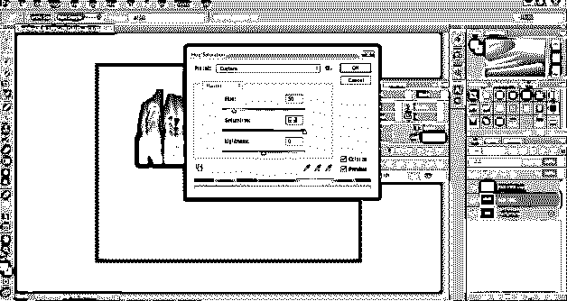

步骤 24: 现在，复制如图所示的这个图层。

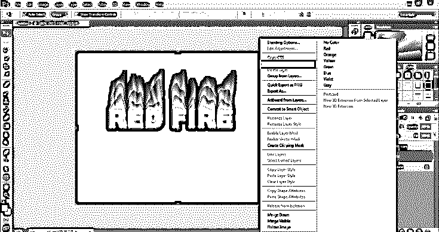

步骤 25: 现在，再次进入图像>调整>色调和饱和度。在色调中，写-30 作为值，然后单击确定。

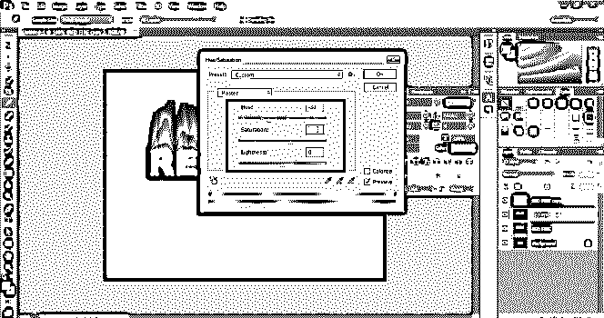

**步骤 26:** 现在，点击复制图层的模式样式，选择叠加，如下图所示。

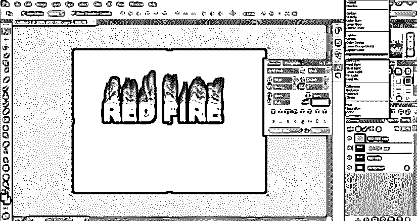

**步骤 27:** 现在，锁定第一个 st 图层，使用渐变工具更改第二个图层的颜色模式，如下图所示。

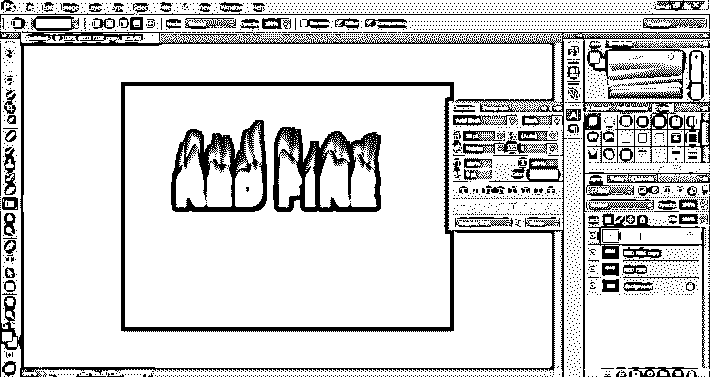

步骤 28: 现在，右键点击图层，进入混合选项。使用投影菜单、内阴影菜单和外发光，如图所示。

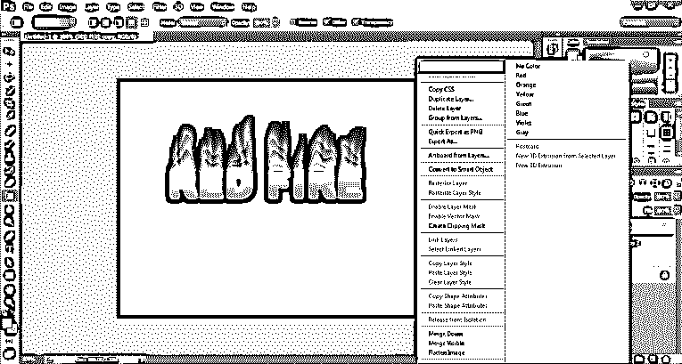

**步骤 29:** 火焰效果的最终图像如下图。

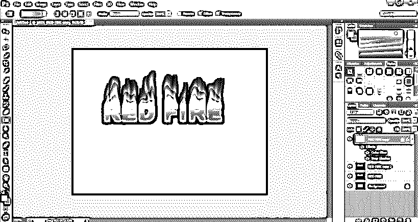

### 结论

在上面的例子中，我们使用了各种工具和过滤器来帮助用户创建完美和真实的火焰效果。但是，用户必须了解该过程中使用的所有过滤器和工具的用途和技术。试图创造这样的效果需要努力和决心。用户必须练习软件以获得程序并理解工具的技术。

### 推荐文章

这是一个 Photoshop 中的火效果指南。在这里，我们讨论一些有用的技巧和工具，在 photoshop 中创造出逼真的火焰效果。您也可以浏览我们的其他相关文章，了解更多信息——

1.  [Photoshop 中的创意人像效果](https://www.educba.com/portrait-effect-in-photoshop/)
2.  [如何在 Photoshop 中使用滤镜？](https://www.educba.com/filters-in-photoshop/)
3.  [Photoshop 中的快速选择工具](https://www.educba.com/quick-selection-tool-in-photoshop/)
4.  [如何在 Photoshop 中填充颜色？](https://www.educba.com/how-to-fill-color-in-photoshop/)

