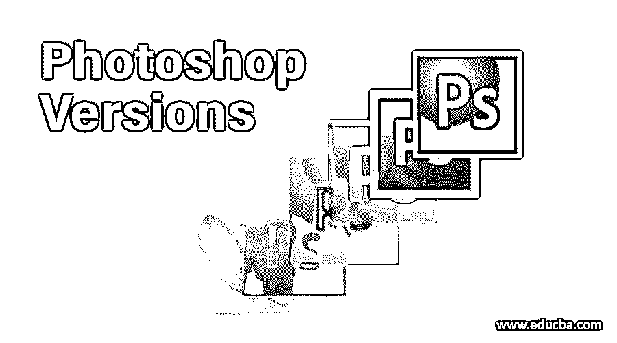

# Photoshop 版本

> 原文：<https://www.educba.com/photoshop-versions/>

## Photoshop 版本介绍

每一个软件都是独一无二的，而且随着时间和技术的发展，它的领域也在不断发展和升级，Adobe Photoshop 就是一个例子。Adobe Photoshop 有其版本的历史，最老的版本是以 numbers 命名的版本。Photoshop 的第一个数字版本被称为 0.07 版。2003 年，版本号被捐赠出来，Photoshop 的官方和市场版本作为 Creative Suite (CS)发布。从那以后，CS 已经被更新和升级了无数次，最后一个版本是 2012 年发布的 CS6。最后，Photoshop 在 2013 年升级为 [Creative Cloud](https://www.educba.com/what-is-adobe-creative-cloud/) 版本，被称为 Creative Cloud (CC)。Photoshop CC 的最新版本是 CC20，于 2019 年 11 月发布，采用了最新的工具和技术。

### Adobe Photoshop 的版本

以下是 adobe photoshop 目前发布的所有版本，并附有简要说明:

<small>3D 动画、建模、仿真、游戏开发&其他</small>

#### 1.Photoshop CS

这个版本的 Photoshop 在无数次尝试创建一个用于图像处理和编辑的官方程序后，于 2003 年发布。早期版本缺乏流畅的用户界面和对工作空间的控制。虽然，这个版本推出了新的功能和改进。配色方案是这一版本 Photoshop 的最新发展。

#### 2.Photoshop CS2

这个版本的 Photoshop 是在 2005 年发布的，它迅速席卷了整个行业和市场。CS 版本的一个更加开发和升级的部分来自于程序的这个版本。一些新添加的工具，如图像环绕工具和消失点，给了程序一个更新的外观和结构。此外，这个版本推出了 Camera Raw 3.0，可以帮助用户同时编辑多个原始图像。

#### 3.Photoshop CS3

这个版本的 Photoshop 是在 2007 年发布的，为用户提供了对程序界面的流畅控制和管理。在这个升级版本中增加的新工具是补光工具、[快速选择工具](https://www.educba.com/quick-selection-tool-in-photoshop/)和细化边缘工具。像智能滤镜和相机原始数据支持方面的改进一样，一些功能也根据用户的需求和要求进行了更新和开发。在此版本中，用户还了解了克隆选项和属性。界面也进行了更新，在任何时间点都不会崩溃。

#### 4.Photoshop CS4

该版本于 2008 年发布，与 CS3 版本相比没有太多升级和增强。对程序的工作流程和工作引擎做了一些小的改进。此版本中引入了内容感知缩放和遮罩面板等功能。

#### 5.Photoshop CS5

这个版本是在 2010 年发布的，有很多改进和发展。这个版本还引入了对 64 位版本 Photoshop 的支持。这个版本主要只关注工具的开发。这个版本中一些新增加的工具是混合笔刷、[木偶包裹](https://www.educba.com/puppet-tool-in-after-effects/)、自动图像拉直器和颜色选择器工具。此外，这个版本引入了 adobe mini bridge，它可以方便地帮助用户管理和组织他们的文件和文档。

#### 6.Photoshop CS6

这个版本的 Photoshop 是在 2012 年发布的，在工具集和功能上做了一些小的改进。这个版本中引入了自动保存选项。Camera Raw 也相应更新，其第 7 th 版本与 CS6 一同发布。一些矢量和[颜色工具](https://www.educba.com/how-to-fill-color-in-photoshop/)也相应更新。一个新的界面和工作空间被设计出来，并被这种类型的 Photoshop 所取代。

#### 7.Photoshop CC

现在使用的是 CS 版本，它将文件保存在特定的计算机上，并且是为一次性购买选项而设计的。但是，Creative Cloud 版本的 CC 版本是在订阅的基础上发布的。用户可以订购一个月或一年的软件。对于用户和编辑来说，这是一个重大的突破性版本。此外，文件可以保存在云服务上，可以在任何时间点用任何随机机器访问。

这个版本引入了图像的智能上采样，并提供了 Camera Raw 功能作为程序本身新添加的过滤器。智能对象及其与其他对象的链接也是这个版本的亮点。这个版本还引入了一个智能功能，可以减少和消除相机拍照时产生的抖动。

#### 8.Photoshop CC 2014

2014 年发布的 CC 2014 确实有很多增强功能。它基本上改善了以前版本的 Photoshop 所面临的界面和速度问题。这个版本**中引入了一些新工具，比如旋转模糊和路径模糊。**

#### 9.Photoshop CC 2015

该版本于 2015 年 6 月发布，引入了 Camera raw 9.1 版本，并添加了 Adobe Stock。它还介绍了将文件导出到各种其他程序的导出选项。

#### 10.Photoshop CC 2018

这个版本的 Photoshop 于 2017 年发布，对工具集和功能库进行了许多改进和升级。添加了更多的笔刷，并且提高了遮罩能力。使用内容感知填充工具进行了高效且有效的修改，这促进了无错误的更改和编辑。这个版本的 Photoshop 中还引入了[混合选项](https://www.educba.com/how-to-blend-images-in-photoshop/)的实时预览[。](https://www.educba.com/introduction-to-photoshop/)

#### 11.Photoshop CC 2019

这个版本出现在 2018 年，它不再支持 32 位版本的 Windows。引入了一些新工具，如框架工具和多重撤销工具。更具体地说，这个版本是 CC 2018 的扩展版本，重点是与 Photoshop 和其他平台一起工作。

#### 12.Photoshop 2020

这是 2019 年出现的最新版本。它支持框架工具的增强功能，并引入了全新的工作空间和设计。这是第一个可以在 iPad 上安装和使用的 Photoshop 版本。

### 结论

Adobe Photoshop 是最古老的图像编辑程序。今天，即使是外行和非编辑也很熟悉它。理解这个庞大而超级有用的程序的开发过程需要很长的历史。

### 推荐文章

这是 Photoshop 版本指南。在这里，我们详细讨论 photoshop 的最新版本以及最老的版本。您也可以浏览我们的其他相关文章，了解更多信息——

1.  [Photoshop 中的快速选择工具](https://www.educba.com/quick-selection-tool-in-photoshop/)
2.  [如何在 Photoshop 中应用滤镜？](https://www.educba.com/filters-in-photoshop/)
3.  [Adobe Photoshop 软件介绍](https://www.educba.com/what-is-photoshop/)
4.  [如何在 Photoshop 中改变文字颜色？](https://www.educba.com/how-to-change-text-color-in-photoshop/)

