# Photoshop 中的人像效果

> 原文：<https://www.educba.com/portrait-effect-in-photoshop/>

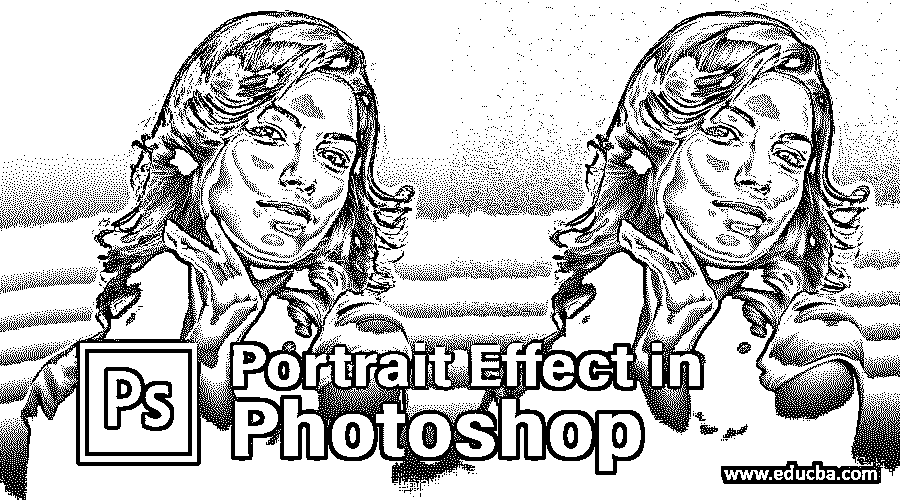

## Photoshop 中的人像效果介绍

Adobe Photoshop 是一个巨大的程序，加载了一组惊人的工具和功能，用于创建一些令人惊叹的效果。通常在 Adobe Photoshop 的帮助下创建的一个这样的效果是肖像效果。肖像效果可以在程序上创建，使用程序中的神奇工具和画笔。当使用不同的背景拍摄照片、更改背景类型以及添加效果时，该效果非常有用。任何图像都可以转换为具有真实外观和效果的肖像样式的图像。

当用户需要将所拍摄的图像改变为肖像格式或者给出基于该效果的效果时，使用这种类型的效果。

<small>3D 动画、建模、仿真、游戏开发&其他</small>

### 什么是人像效果？

人像效果就像其他效果一样，也是使用许多工具和功能创建的。这是用户的选择，他想如何创造一个效果，使用什么工具和方法。尽管如此，在 Photoshop 中有无数的方法和技巧来创造一种效果。

人像效果不是像[火效果](https://www.educba.com/fire-effect-in-photoshop/)那样的直截了当的直接效果。肖像是在垂直方向上创建的任何图片，带有一些赋予肖像的随机效果。类似地，也可以使用多种工具创建肖像效果。对于这种效果没有合适的定义。因此，我们可以在肖像模式下创建任何效果，这可以被称为肖像效果。

### 给图像添加肖像效果

以下是在 photoshop 中以非常简单的方式创建肖像效果的示例:

**第一步:**打开 Photoshop。打开需要创建和编辑的肖像图像。

**第二步:**在 Photoshop 中创建新文档。这个文档应该有 72 像素的分辨率。这个分辨率是给文档的，这样我们可以在文档中创建更大的云作为背景。如果我们为文档提供 100%的像素数量，我们将无法生成示例中所需的大云。因为我们将应用的过滤器是云过滤器，并且该过滤器取决于文档的分辨率。

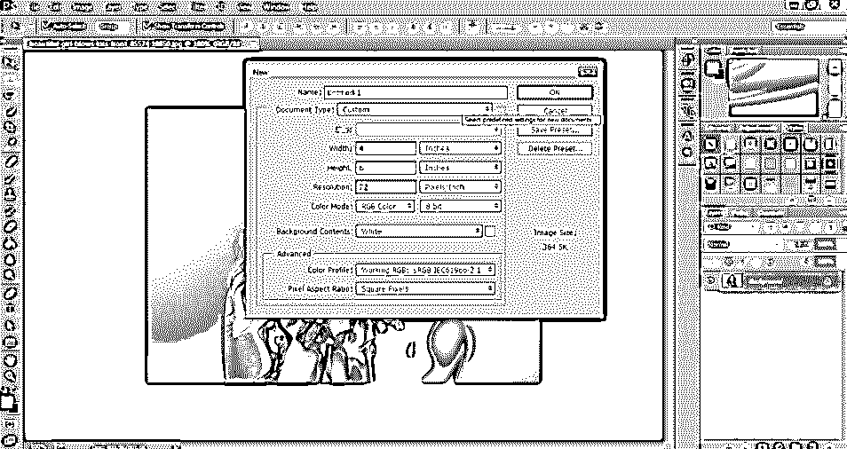

**第三步:**接下来，背景色需要黑色。因此，改变背景如下图所示，并按下**Alt+退格键**来填充黑色的文件。

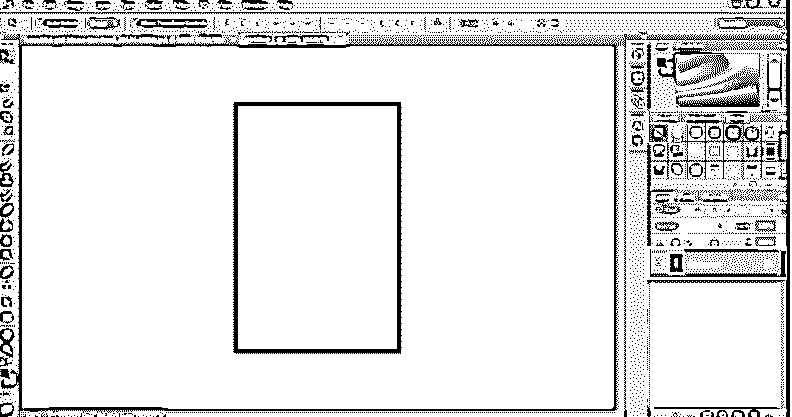

步骤 4: 现在，进入图层选项，新建一个空白图层，如下图所示。

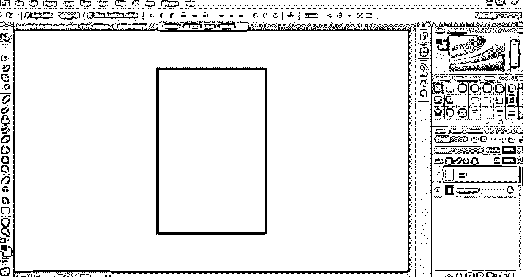

**第五步:**现在，保持新图层选中，进入滤镜库。

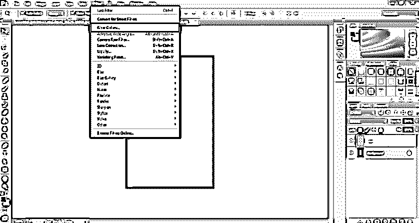

第六步:从滤镜库，选择渲染选项，然后从菜单中选择云。每次应用此滤镜时，它都会给图像带来新的不同外观。我们可以根据需要尝试使用过滤器。

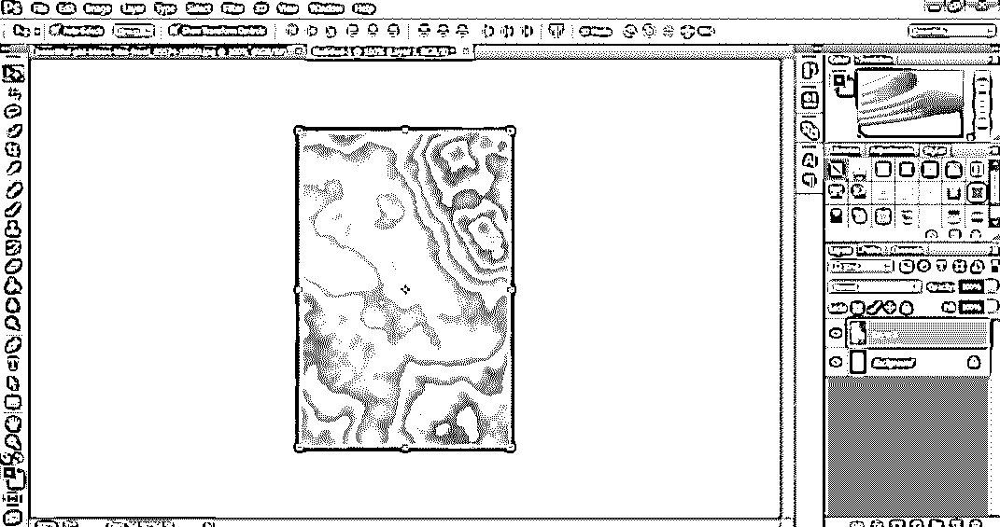

**第七步:**现在，最小化云层的透明度。如下图所示。

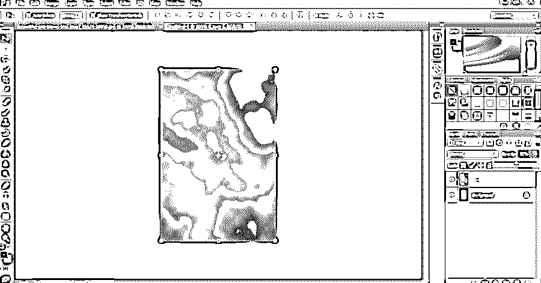

**第八步:**接下来，将背景层和云层合并，如下图所示。

第九步:接下来，我们将应用另一个效果的背景。转到滤镜选项，选择笔刷笔画和使用飞溅到相同的。

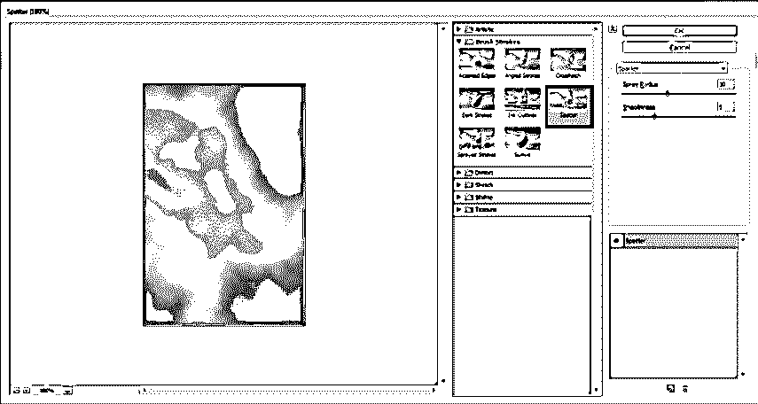

**第十步:**会出现一个对话框；使用 10 作为喷射半径，使用 5 作为对话框的平滑度。这个滤镜会给背景图像增加更多的模糊和纹理。

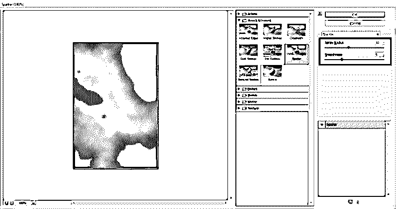

步骤 11: 一旦应用了滤镜，另一个叫做“淡化飞溅”的选项可以降低飞溅的不透明度。用户不应点击任何其他地方；否则，用户将看不到该选项。所以，去编辑选项，使用淡化飞溅。

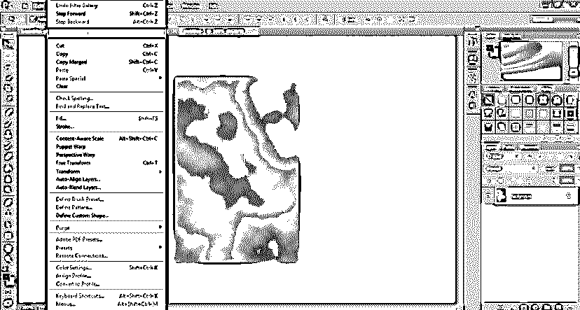

第 12 步:接下来，我们应用滤镜库的另一个滤镜。所以，点击滤镜，从菜单中选择笔刷。

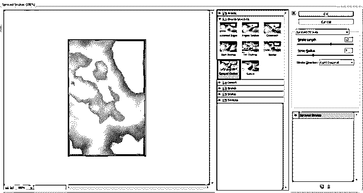

**步骤 13:** 使用菜单中的喷涂笔画。将出现一个对话框。使用 15 作为冲程长度，9 作为喷射半径，在冲程方向，使用右对角线选项。

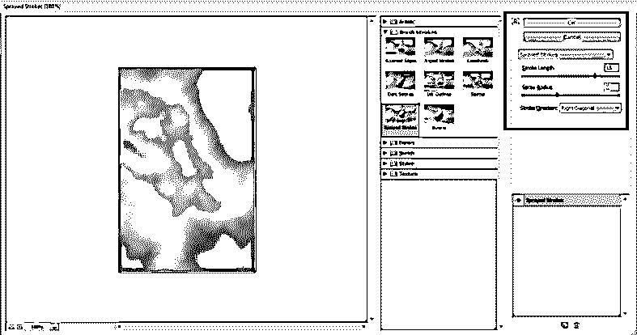

步骤 14: 再一次，进入编辑菜单，使用淡入淡出选项来降低透明度。

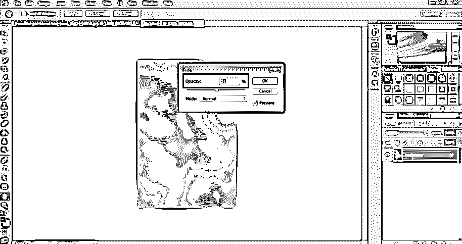

**第十五步:**现在，自云朵效果完成。我们可以提高图像像素的质量。因此，使用图像菜单和图像大小如下图所示。

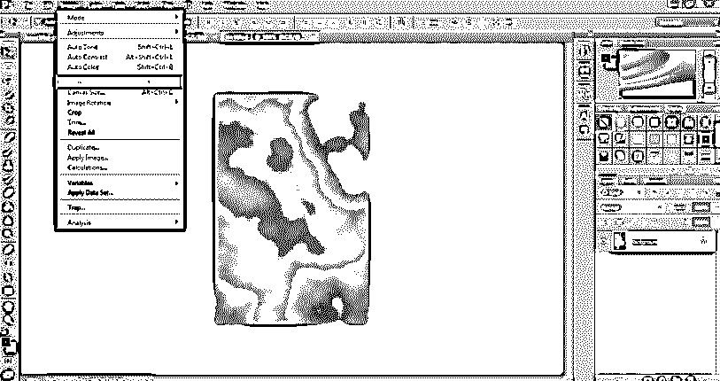

**第十六步:**会出现一个对话框；使用 300 作为图像的分辨率。并选中图像重采样选项。图像的分辨率直接取决于打印质量和图像平滑度。因此，如果用户不是为了打印而创建任何东西，他们也可以使用较低的分辨率。

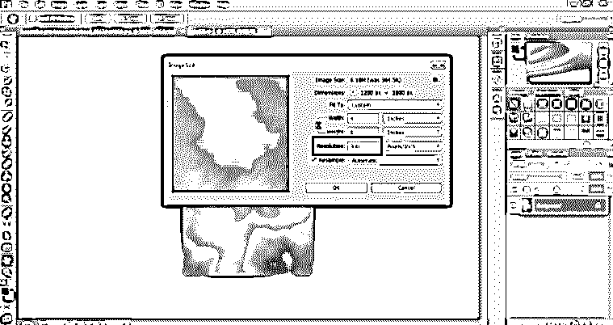

步骤 17: 现在，进入图层选项，使用新的调整图层选项创建一个色调和饱和度图层。这种效果将有助于控制图像的亮度和暗度，

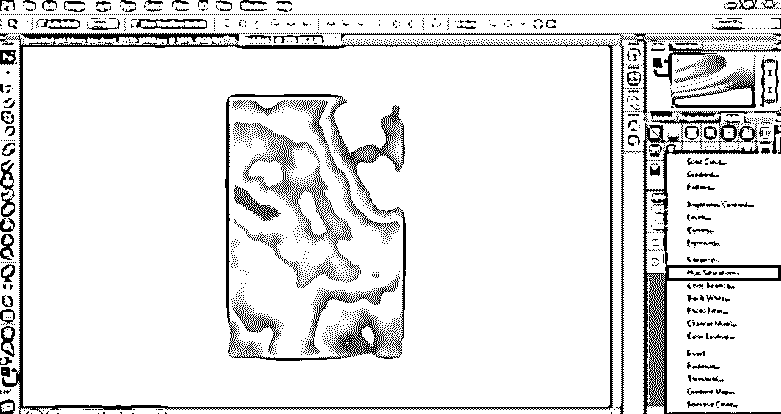

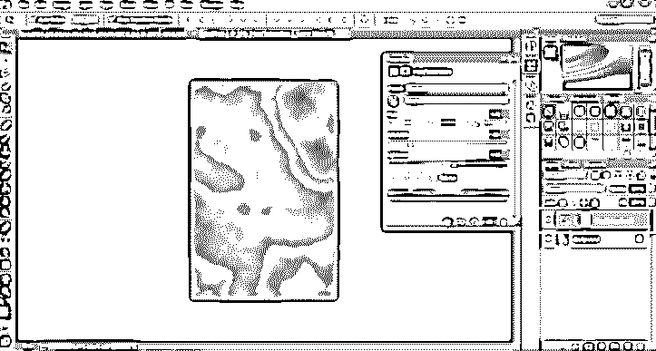

**步骤 18:** 现在，保存这个文档，如下图所示。

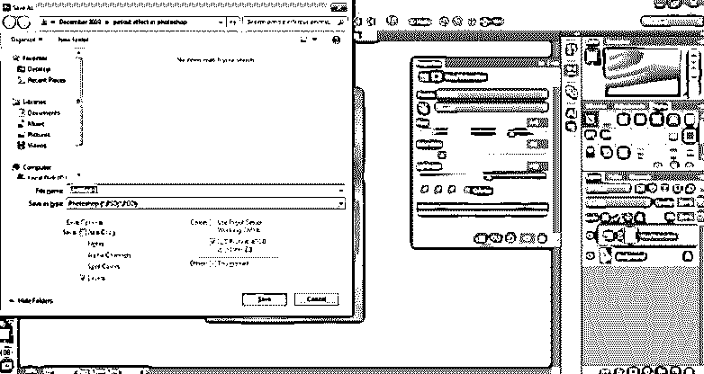

*   现在，打开需要放置在新创建的背景中的肖像图像。
*   使用选择工具从图像中提取人像并移除背景，如下图所示。

**第 19 步:**将肖像放在该文件上，并按照下图所示进行调整。

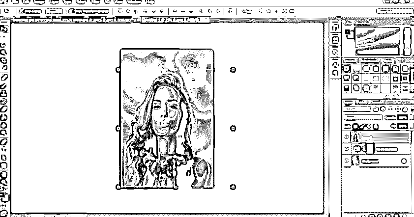

**步骤 20:** 你可以给人像再添加一些效果，如下图所示。新创建的肖像如下图所示。

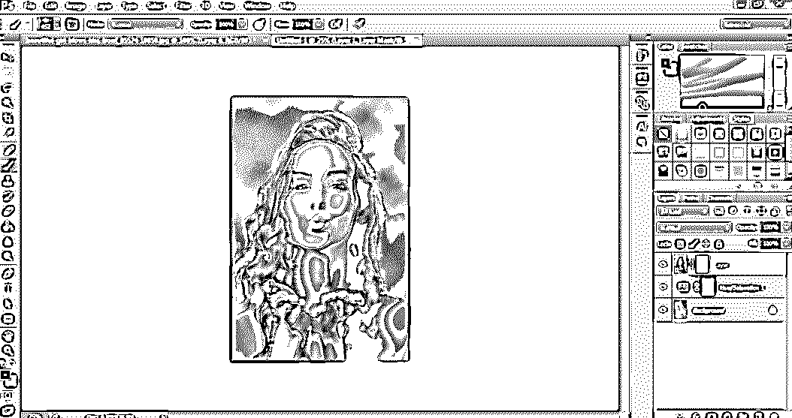

### 结论

肖像效果可以使用一些惊人的过滤器和效果。肖像效果没有直接的定义。因此，我们可以播放和添加任何数量的影响肖像创建。

### 推荐文章

这是 Photoshop 中的人像效果指南。这里我们讨论一个介绍，人像效果，以及如何一步一步的在 Photoshop 中创建人像效果。您也可以浏览我们的其他相关文章，了解更多信息——

1.  [在 Photoshop 中更改头发颜色](https://www.educba.com/change-hair-color-in-photoshop/)
2.  [如何在 Photoshop 中融合图像？](https://www.educba.com/how-to-blend-images-in-photoshop/)
3.  [Photoshop 中的水彩画笔](https://www.educba.com/watercolor-brushes-in-photoshop/)
4.  [Photoshop 中的标尺工具](https://www.educba.com/ruler-tool-in-photoshop/)

