# Photoshop 中的快速选择工具

> 原文：<https://www.educba.com/quick-selection-tool-in-photoshop/>

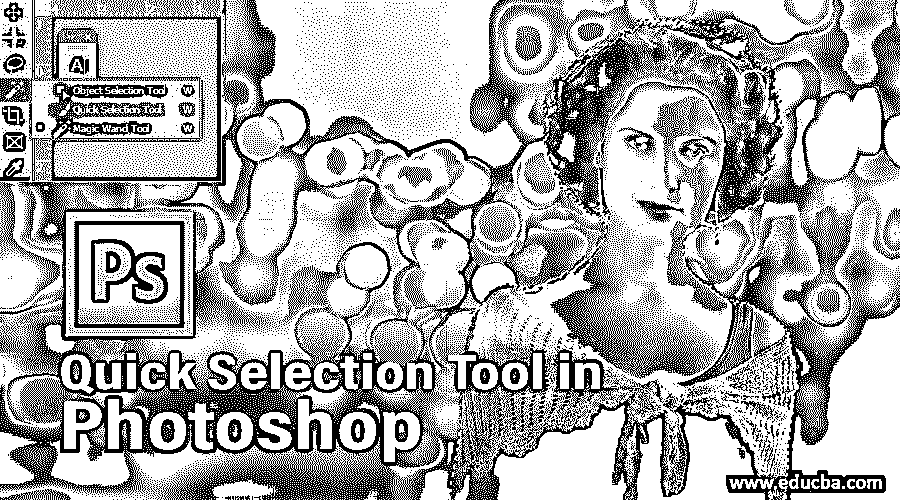

## 快速选择工具简介

快速选择工具是 Adobe Photoshop 应用程序的工具面板的重要组成部分，用于选择光栅对象的特定部分以进行更改，该工具因其省时元素和高分辨率光栅图片的精度而广为人知，用户可以了解快速选择工具的使用和应用，轻松完成选择图像特定部分的错误任务，节省宝贵的时间。

### 如何使用快速选择工具？

在这篇文章中，我们将以一种非常有趣的方式了解快速选择工具的基础和重要性。然而，在开始我们关于快速选择工具的文章之前，让我们简单地看一下 Adobe Photoshop 软件的用户界面:

<small>3D 动画、建模、仿真、游戏开发&其他</small>

*   这是 Adobe Photoshop 的用户界面。我们有不同的部分。它是 Photoshop 工作屏幕左侧的工具面板，Photoshop 工作屏幕顶部的菜单栏，Photoshop 工作屏幕右侧的颜色面板和图层面板。

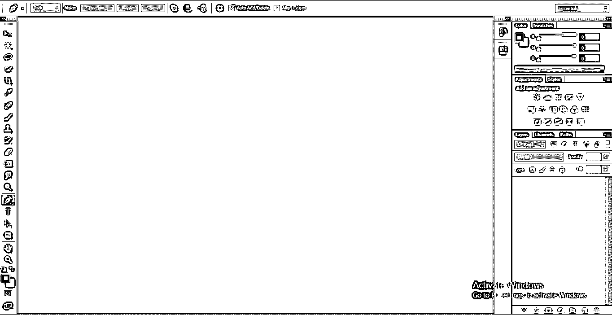

*   让我们在这里取一个新的画布或剪贴板，用于取新的画布去菜单栏的文件菜单。将会打开一个下拉列表。点击此处的新选项。

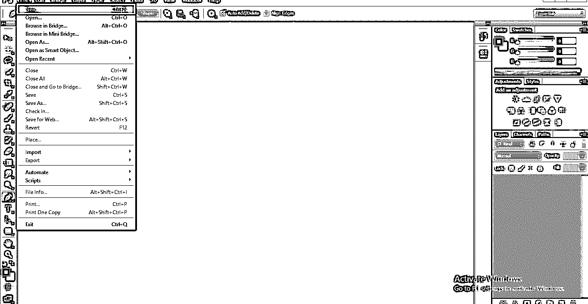

*   将打开一个新对话框，其中包含画布或剪贴板的参数设置。在这里，您可以从该对话框的名称框中任意命名您的画布。

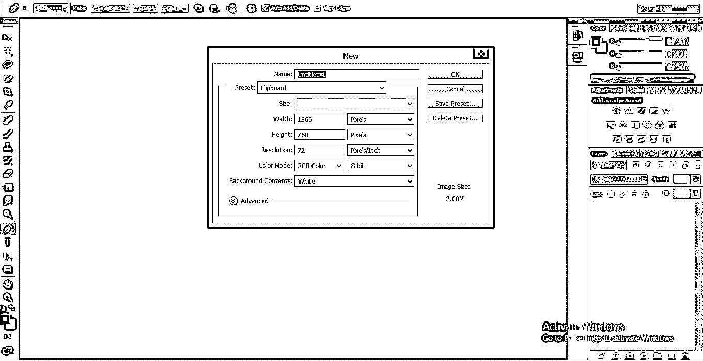

*   我们这里有不同类型的画布风格，你可以选择其中任何一种，或者你可以用你想要的参数制作你自己的画布。点击这里的自定义选项，根据你的需要设置参数。

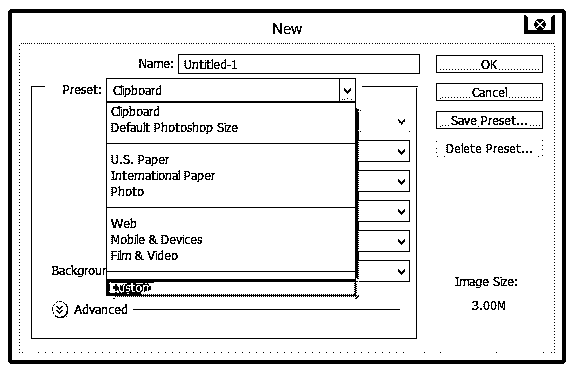

*   您还可以在这里更改画布的颜色。

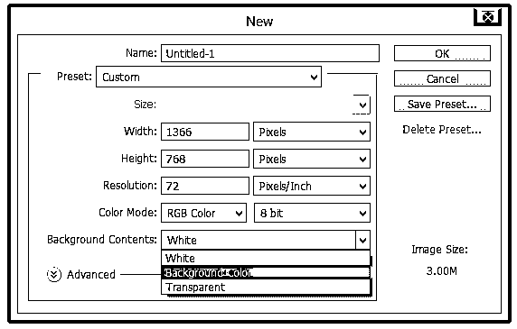

*   然后在此对话框中单击确定。

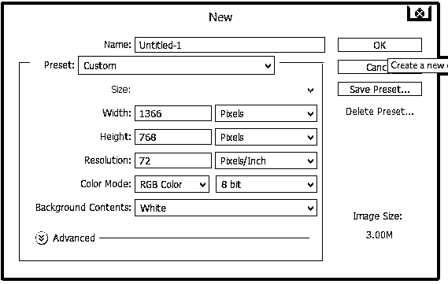

*   我们在 Photoshop 软件中有不同的选择工具，矩形选框工具，椭圆选框工具，套索工具，磁性套索工具，快速选择工具等。

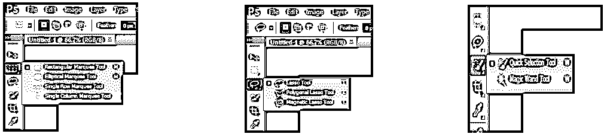

*   我们将在本文中看到快速选择工具。此工具出现在工具面板中，带有画笔符号的图标。

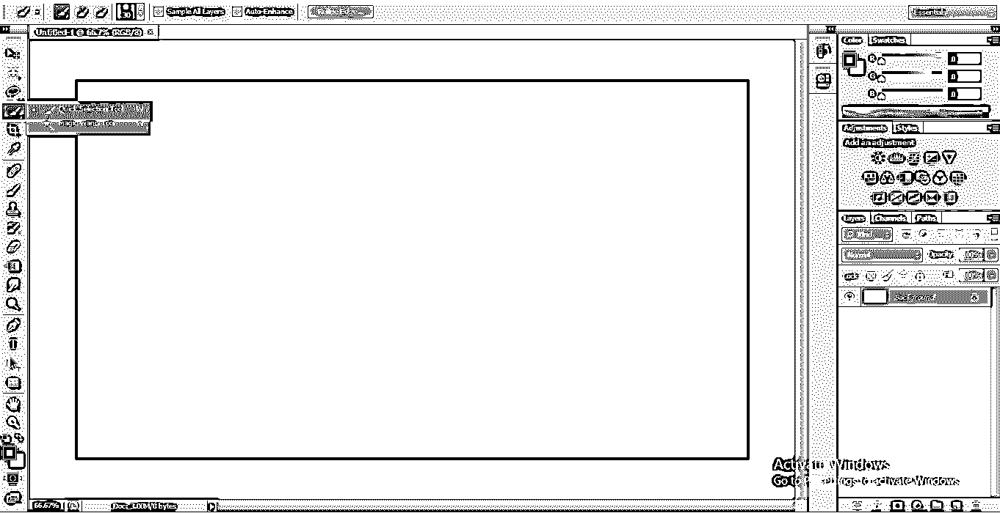

*   首先，我们会从网上下载任何图像供我们学习，你可以拍摄任何图像，无论是从网上下载的还是自己拍摄的。在使用此工具的过程中，请确保图像应该是高分辨率质量的，因为此工具根据色差原理来选择任何对象。
*   现在，我们将图像放置在我们的 Photoshop 软件中，要放置图像，请转到菜单栏中的文件菜单，将会打开一个下拉列表。点击此处的放置选项。

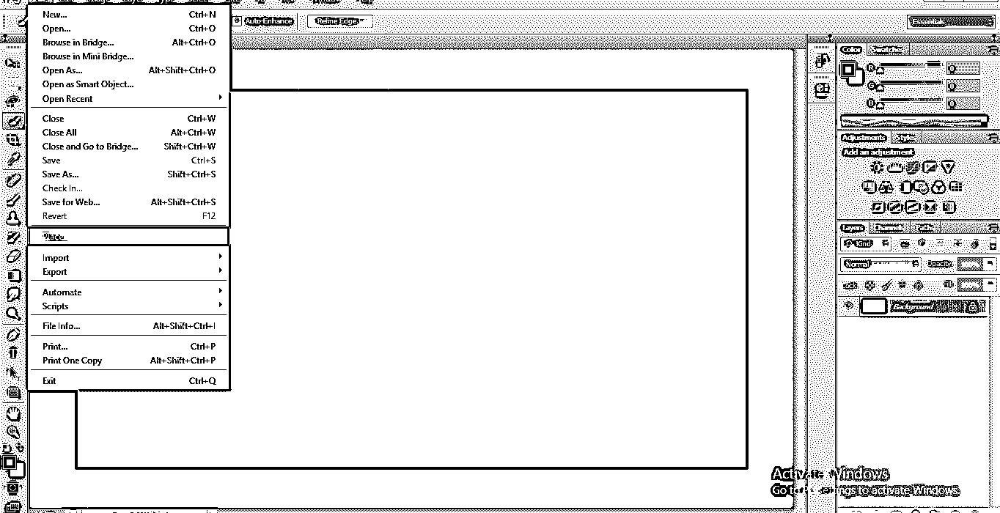

*   将会打开一个对话框。转到保存图像的位置，单击该图像，单击此对话框的“放置”按钮来放置图像。

*   您的图像将被放置在工作区。现在当点击任何工具时，它会问你是否放置这个图像？通过显示这个消息框。单击此对话框的“放置”按钮，或者双击图像以取消链接。

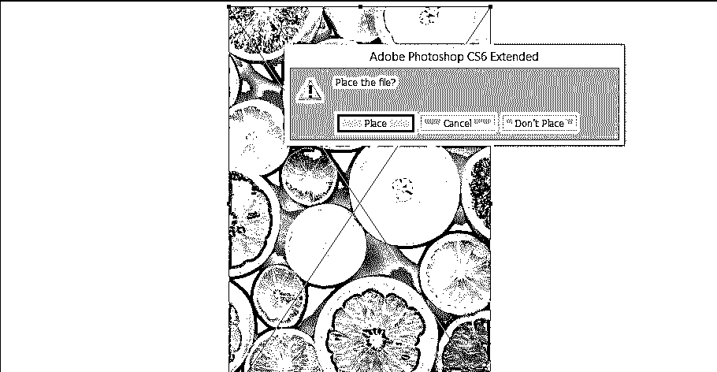

*   或者您可以通过拖放过程直接放置该图像。首先，打开保存图像的文件夹。点击它并将其拖入 Photoshop 工作屏幕，然后放下。

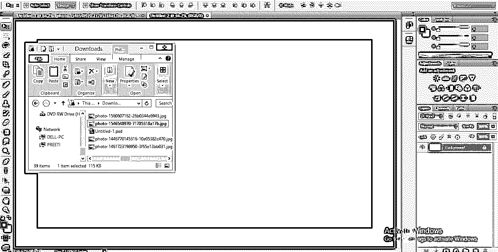

*   现在按住 Alt 键，向上滚动鼠标滚轮放大图像，向下滚动缩小图像。

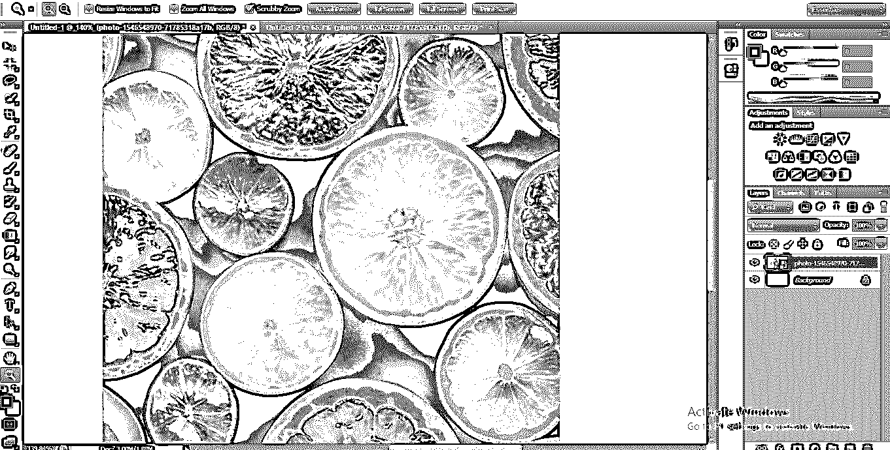

*   现在从工具面板中点击快速选择工具的图标。

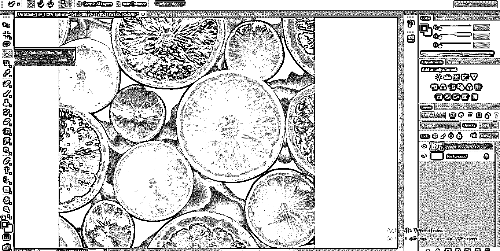

*   我们可以通过按下关闭方括号按钮，即键盘上的“]”来增加快速选择工具的画笔大小，并通过按下打开方括号按钮，即键盘上的“[”来减小快速选择工具的画笔大小。然后，单击要选择的对象，并将鼠标指针向截面区域的方向移动。

*   如果您错误地选择了超过需求的区域，如下图所示。

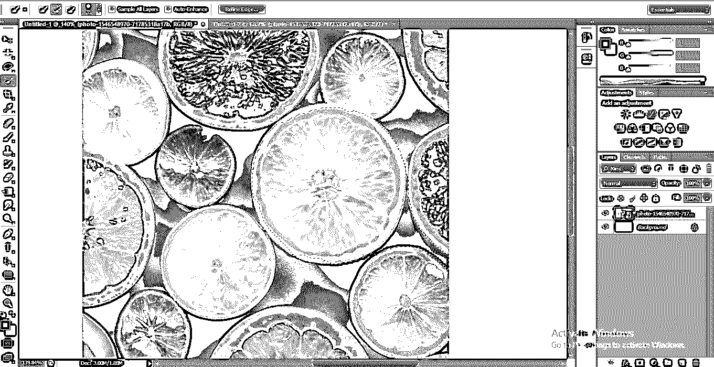

*   首先，我们将通过按下左方括号“[”来减小快速选择工具的大小，然后从键盘上按下 Alt 键并按住 Alt 键，以便该工具将剪切不需要的区域。现在我们将拖动鼠标指向我们想要删除额外选择的方向。

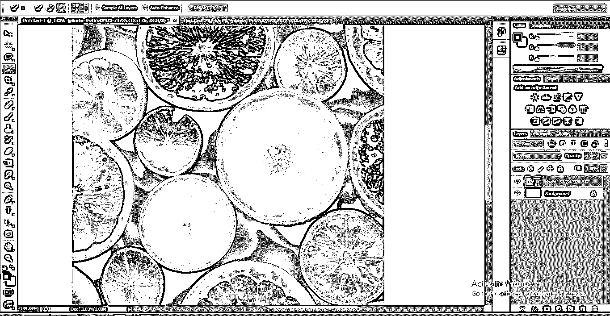

*   现在你可以看到这个对象的选择已经完成。

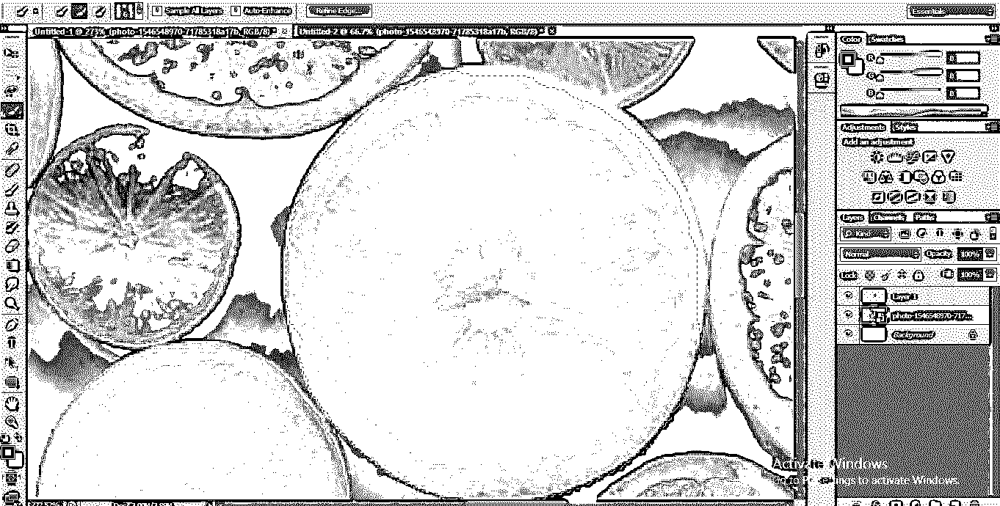

*   现在转到图层部分，按下键盘上的 Ctrl+J，使这个选区与这个图像的其他对象分开。

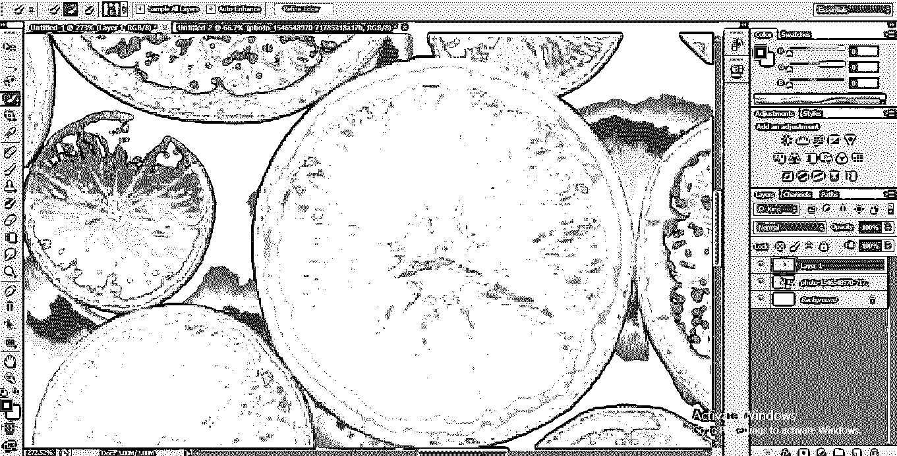

*   当你隐藏原始图像时。你可以看到我们的选择成为一个单独的层。

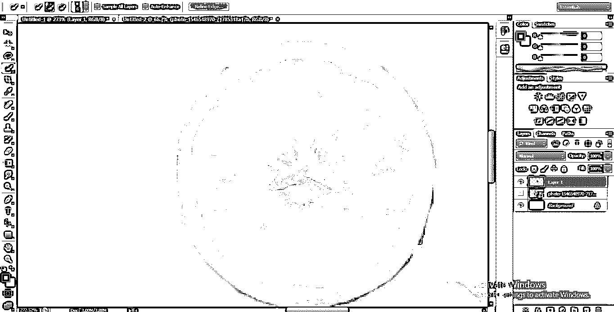

*   您可以通过按住键盘上的 shift 键同时选择许多对象，并且可以将这些选定的对象用于不同的目的。

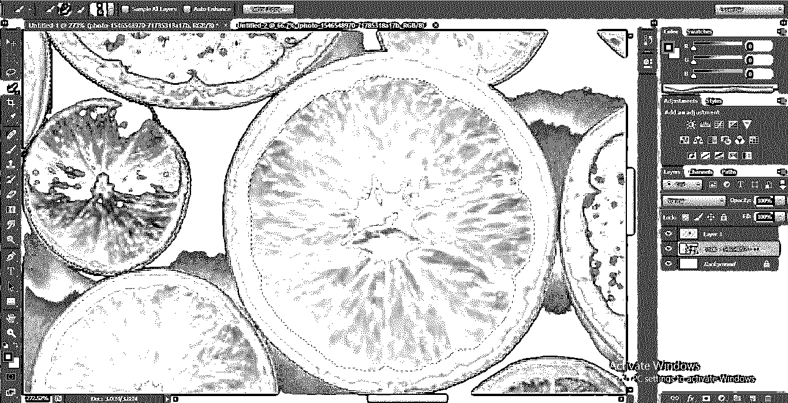

*   您可以移动此选择，单击所选对象，按住鼠标左键，并拖动它进行移动。

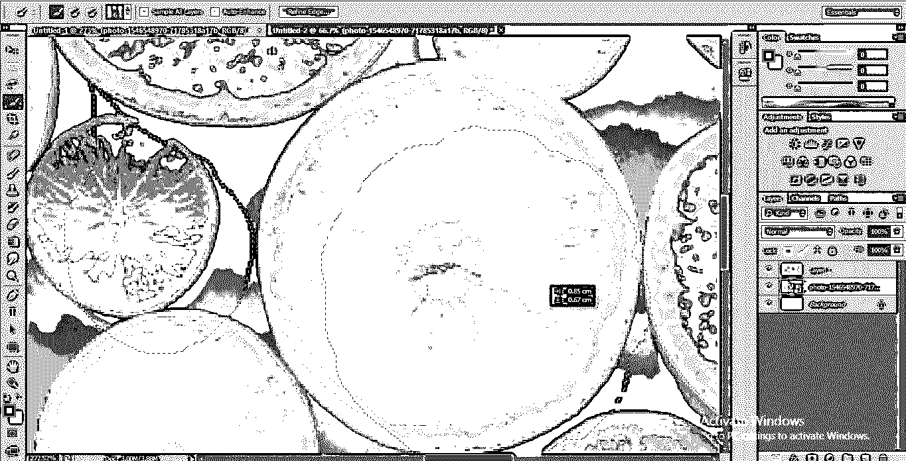

*   我们必须添加截面，并删除工作区顶部的截面按钮；通过添加选择选项，您可以一次添加多个选择。通过减去选择，可以移除任何不需要的选定零件。

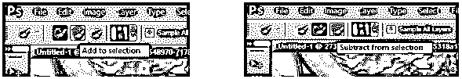

*   你可以在这里通过改变参数来改变笔刷。

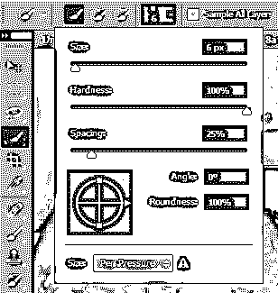

*   您可以轻松理解 Adobe Photoshop 软件中快速选择工具的功能，并使用它来完善您的工作。

### 结论

在这里你看到了本文中关于 Adobe Photoshop 的工具面板的快速选择工具，现在你可以很容易地理解这个工具在 Photoshop 中的重要性了。在很好地掌握了快速选择工具之后，你可以节省时间，并且可以准确无误地完成工作，而不会有任何烦躁。

### 推荐文章

这是 Photoshop 中的快速选择工具指南。这里我们讨论一下入门和如何使用快速选择工具？分别是。您也可以浏览我们的其他相关文章，了解更多信息——

1.  [Illustrator 中选区工具介绍](https://www.educba.com/selection-tool-in-illustrator/)
2.  [什么是直接选择工具 Illustrator？](https://www.educba.com/direct-selection-tool-illustrator/)
3.  [在 Photoshop 中使用选择工具的基础知识](https://www.educba.com/selection-tool-in-photoshop/)
4.  [Adobe After Effects 的顶级插件](https://www.educba.com/adobe-after-effects-plugins/)

