# 如何在 Photoshop 中高亮显示文本？

> 原文：<https://www.educba.com/how-to-highlight-text-in-photoshop/>

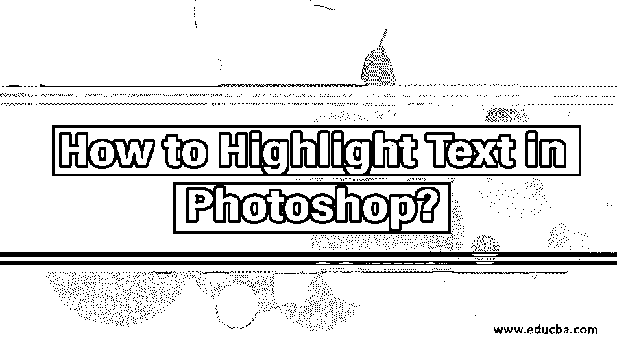

## Photoshop 中高亮显示文本的介绍

在本文中，我们将学习如何在 Photoshop 中高亮显示文本？.Adobe Photoshop 是最著名和最流行的图像编辑软件，用于在拍摄和创建图像后编辑和修改图像。Adobe Photoshop 是一个光栅程序，取决于需要修改的图像质量。由于 Photoshop 是一个庞大的程序，它包含了一个巨大的工具集，其中包含许多用于编辑图像的工具，如钢笔工具、形状工具、文本工具、[选择工具](https://www.educba.com/selection-tool-in-illustrator/)和其他各种工具。

该程序还具有大量的功能，可以轻松有效地执行动作和任务。使用 Photoshop，我们可以确保结果是没有错误和现实的。Photoshop 中的每一个工具都有自己的功能，并且可以用于多种用途。程序中最常用的是选择工具和文本工具。

<small>3D 动画、建模、仿真、游戏开发&其他</small>

### 在 Photoshop 中突出显示文本的示例

突出显示文本和创建文本一样重要。如果用户需要突出显示 Photoshop 文本，他必须使用各种其他方法和选项来实现目标结果。由于 Photoshop 中没有直接用来高亮显示[文本的工具，我们使用其他方法来做同样的事情。](https://www.educba.com/text-effects-in-photoshop/)

通常，创建荧光笔是为了从整体文本中引起对突出显示的文本的某种关注和聚焦。有些用户使用荧光笔效果来突出文本。Adobe InDesign 有一个特殊的工具，可以创建高亮显示的文本，效果令人惊叹。在 Photoshop 中我们有两种不同的方法可以达到同样的效果。第一种方法是在文本后面用不同的颜色创建矩形。而另一种方法涉及修改使用文本副本创建的下划线。

#### 示例 1–在 Photoshop 中高亮显示文本

**步骤:1** 打开 Photoshop

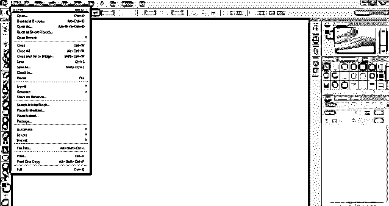

**第二步:**在 Photoshop 中创建新文件。

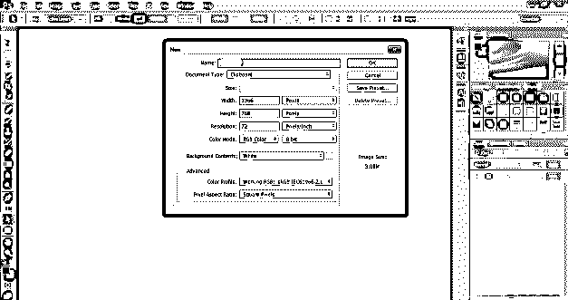

**第三步:**使用文字工具，写出文字“在 Photoshop 中创建高亮文本有两种方法”

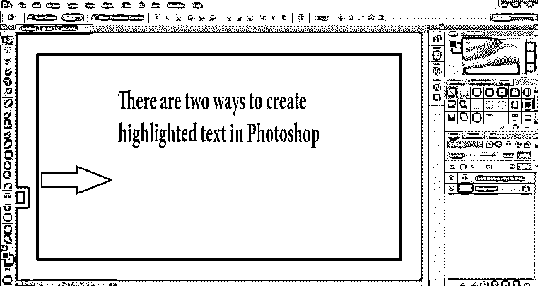

**第四步:**接下来，使用选择工具在创建的文本后面创建一个矩形，看起来好像文本已经被高亮显示。

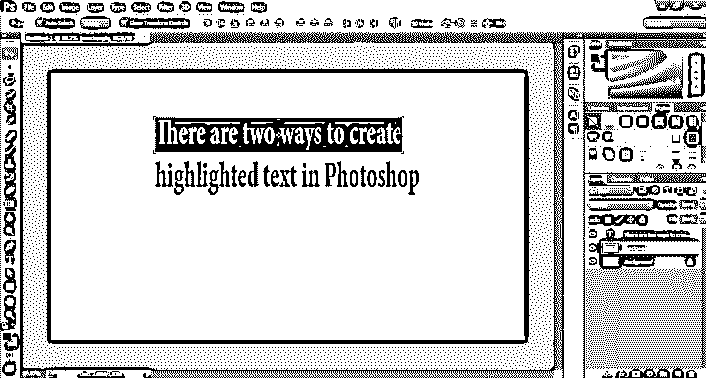

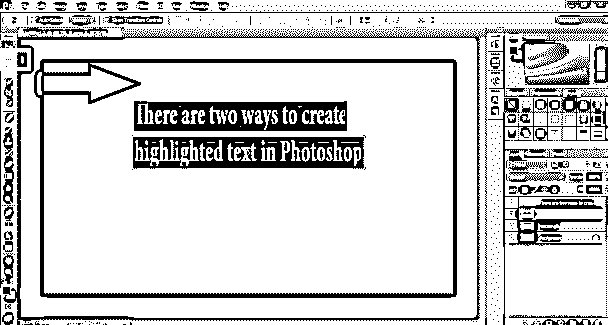

**第五步:**我们可以随时改变矩形的颜色。

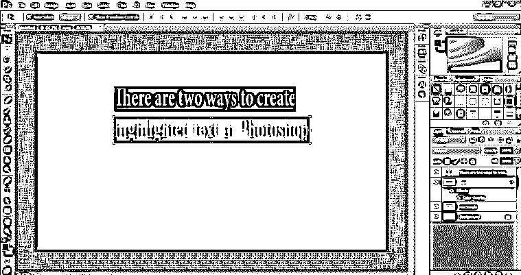

**步骤 6:** 在创建矩形时，确保创建的矩形与所写的文本相同。

#### 示例 2–在 Photoshop 中高亮显示文本

**第一步:**打开 Photoshop。

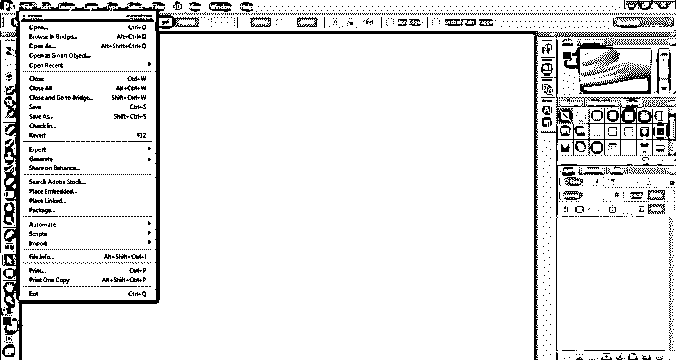

**第二步:**在 Photoshop 中创建新文件。

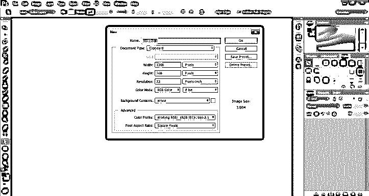

第三步:使用文本工具写下“Adobe Photoshop 家族”

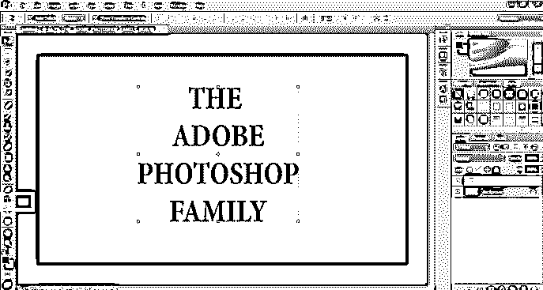

**步骤 4:** 现在，使用 Alt 命令创建相同文本的另一个副本，如下图所示。

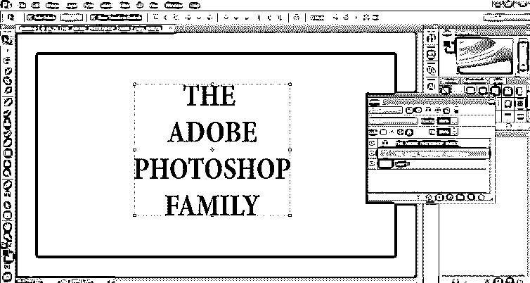

**第五步:**进入 Windows 选项，从菜单中选择字符。

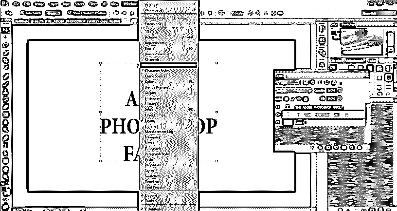

**第六步:**现在，选择文案文本，点击下划线选项，如下图所示。

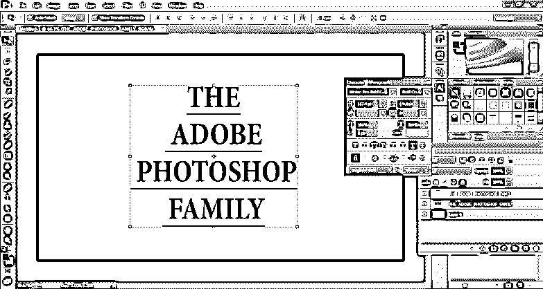

**第七步:**现在，将复制的文字颜色改为蓝色，如下图所示。

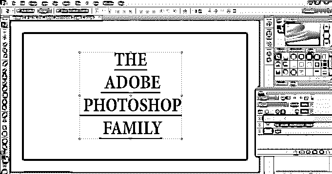

**步骤 8:** 现在，右键点击最顶层，选择转换为形状。这将改变文字层的形状层，我们可以使用路径选择工具很容易就相同。

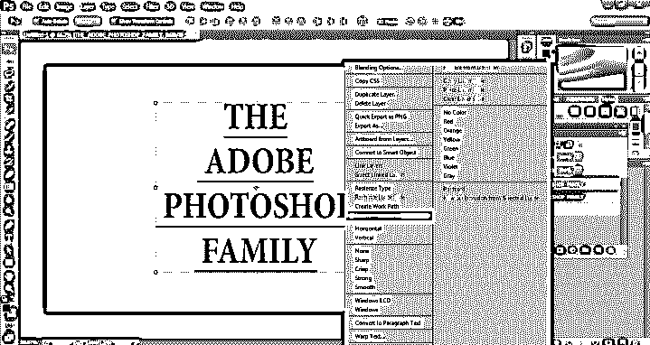

**步骤 9:** 现在，从工具箱中选择路径选择工具，按下 D 键拖动光标，如下图所示。

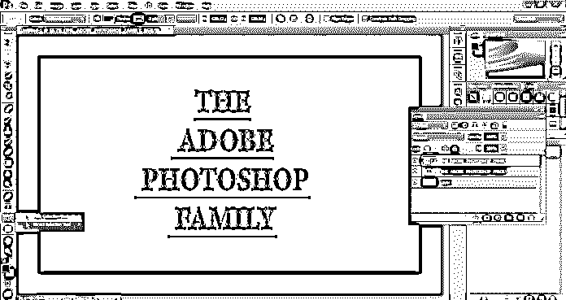

**第十步:**现在，把形状层放到文字层后面。

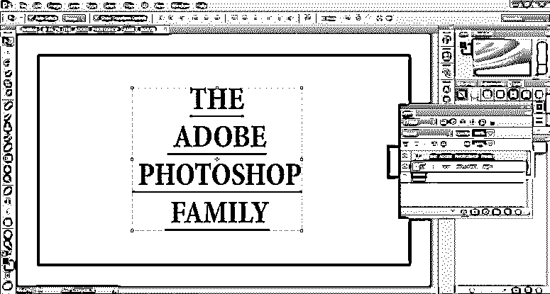

**步骤 11:** 现在，从工具箱中选择直接选择工具。此工具将帮助用户直接选择形状的锚点。

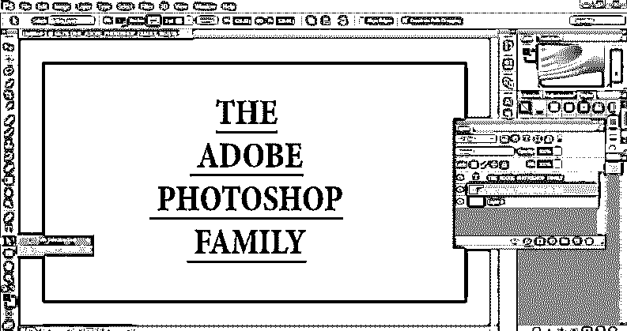

**步骤 12:** 使用这个工具和 shift 键，选择所有下划线最上面的锚点，如图所示。

**步骤 13:** 现在，使用向上箭头键，根据需要增加下划线的高度。这将看起来像是用蓝色突出显示的文本。

**步骤 14:** 现在，按住 shift 键，选择所有下划线的正确点，使用右箭头键根据需要进行编辑。

**第 15 步:**根据需要用左箭头键执行第 14 步。

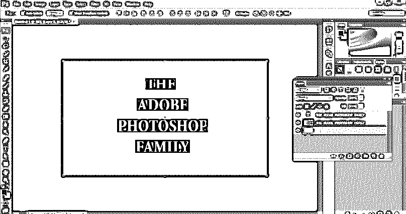

这种技术将帮助用户为他们的文本创建所需的荧光笔。在 Photoshop 中突出显示文本可以通过在文本后面创建矩形这一最简单的技巧来实现。虽然这种方法是最简单的方法。但是，它不能保证矩形的效率和准确性，并且看起来像荧光笔一样令人迷惑。第二种方法可能看起来很长，但是与现有技术相比，它给出了更清晰和更真实的外观和结果。

由于 Photoshop 中没有合适的工具可以直接突出显示给定的文本，并具有真正的准确性和外观，用户将总是不得不寻找一些替代方法来实现所需的结果。此外，用户还可以使用[画笔工具](https://www.educba.com/zbrush-tools/)来更轻松快捷地突出显示文本。

### 结论

总而言之，如果用户没有时间执行任务，他可能会选择第一种方法。而第二种方法比第一种方法需要更长的时间和精力。这完全取决于用户使用哪种技术以及在哪里使用。

### 推荐文章

这是一个如何在 Photoshop 中高亮显示文本的指南？.在这里，我们讨论两种不同的方法来一步一步地突出 photoshop 中的工具。您也可以浏览我们的其他相关文章，了解更多信息——

1.  [在 Photoshop 中创建透明文本](https://www.educba.com/transparent-text-in-photoshop/)
2.  [Photoshop 中的金属文字效果](https://www.educba.com/metal-text-effect-in-photoshop/)
3.  [Photoshop 中的金色文字效果](https://www.educba.com/gold-text-effect-in-photoshop/)
4.  [学习如何在 Photoshop 中制作文字效果](https://www.educba.com/text-effects-in-photoshop/)
5.  [Indesign 的替代方案|五大替代方案](https://www.educba.com/alternative-to-indesign/)

